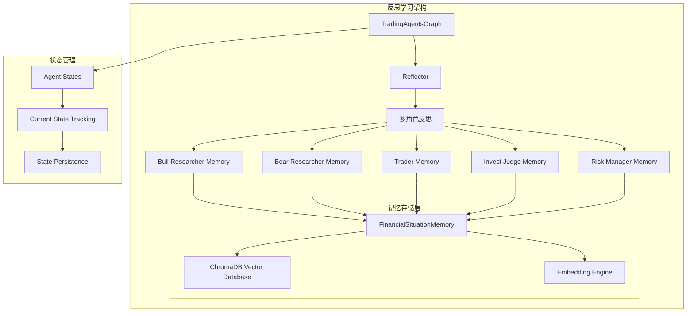
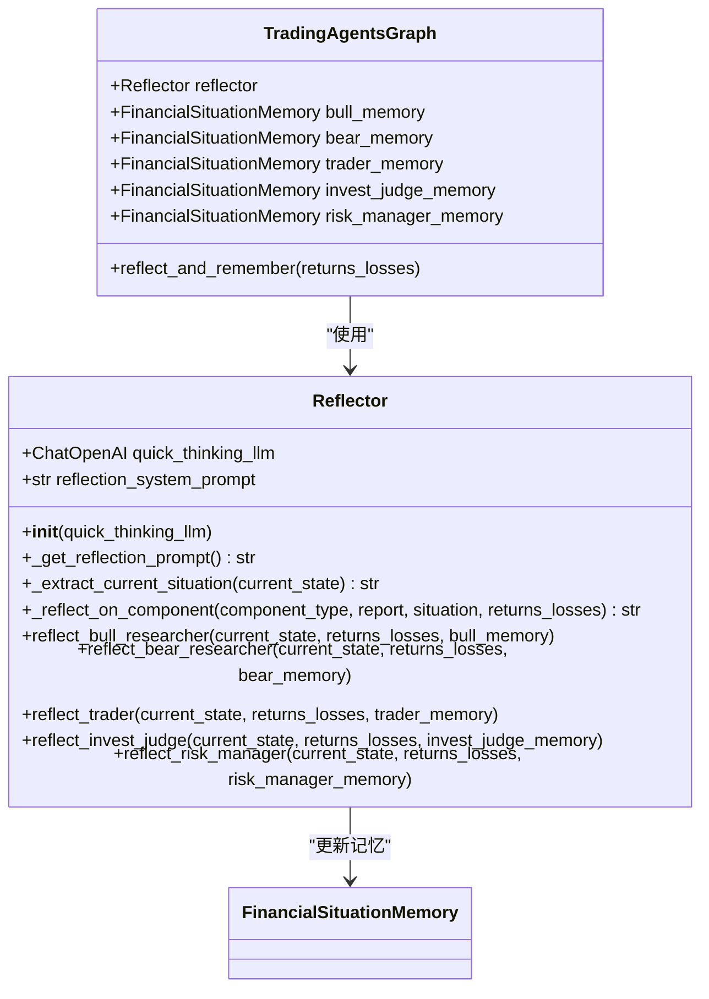
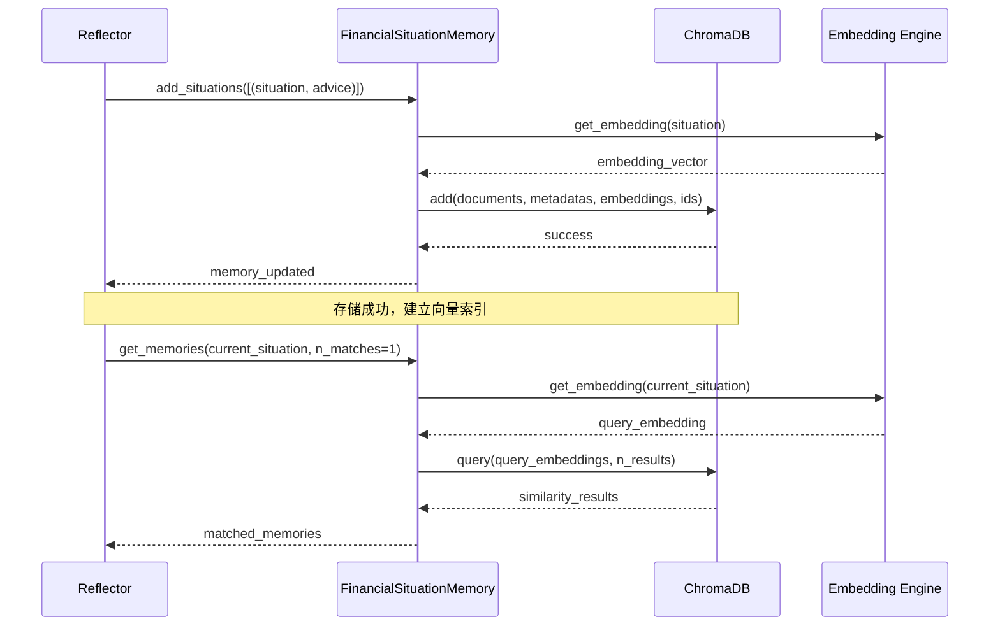
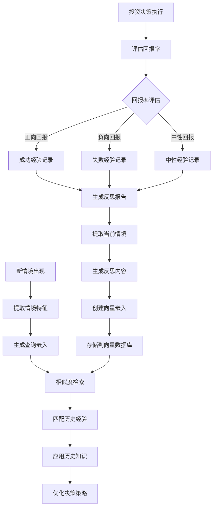
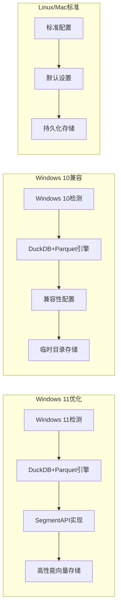
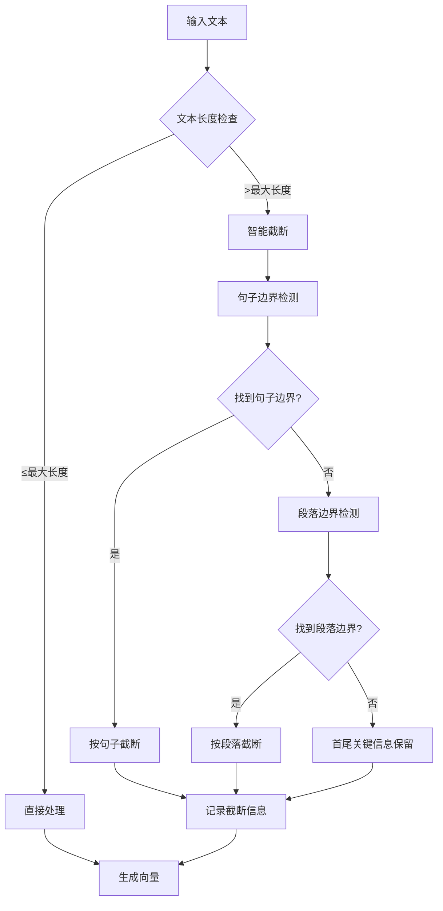
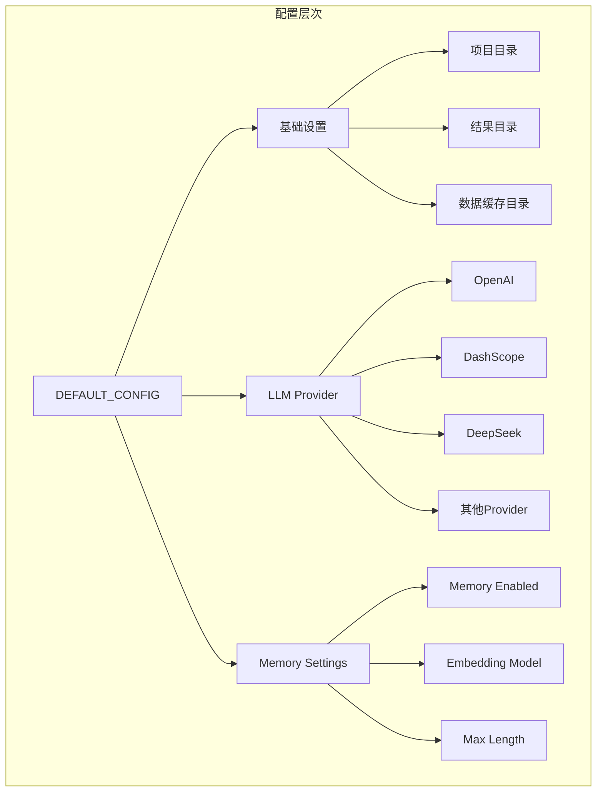
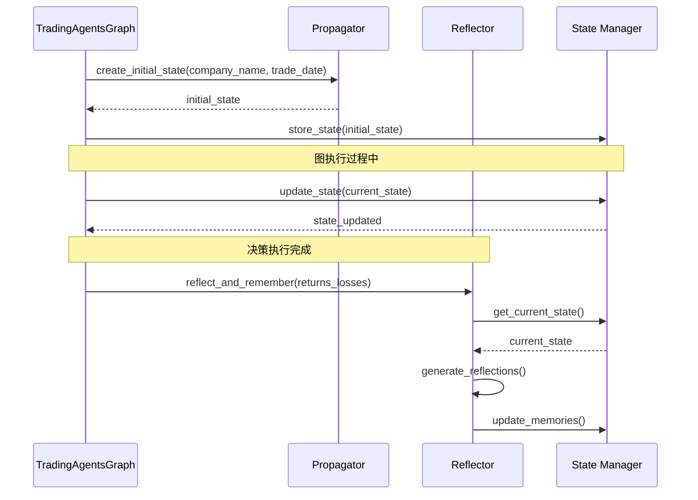
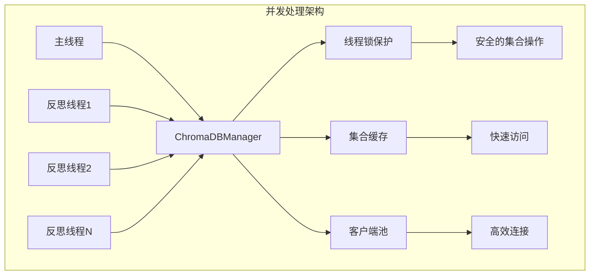

# 反思学习机制

<cite>
**本文档引用的文件**
- [tradingagents/graph/reflection.py](file://tradingagents/graph/reflection.py)
- [tradingagents/agents/utils/memory.py](file://tradingagents/agents/utils/memory.py)
- [tradingagents/graph/trading_graph.py](file://tradingagents/graph/trading_graph.py)
- [tradingagents/graph/signal_processing.py](file://tradingagents/graph/signal_processing.py)
- [tradingagents/default_config.py](file://tradingagents/default_config.py)
- [tradingagents/agents/utils/chromadb_win11_config.py](file://tradingagents/agents/utils/chromadb_win11_config.py)
- [tradingagents/agents/utils/chromadb_win10_config.py](file://tradingagents/agents/utils/chromadb_win10_config.py)
</cite>

## 目录
1. [引言](#引言)
2. [反思机制架构概述](#反思机制架构概述)
3. [核心组件分析](#核心组件分析)
4. [智能体经验学习流程](#智能体经验学习流程)
5. [向量数据库集成](#向量数据库集成)
6. [反思循环优化](#反思循环优化)
7. [配置与性能分析](#配置与性能分析)
8. [LangGraph状态管理集成](#langgraph状态管理集成)
9. [性能影响分析](#性能影响分析)
10. [故障排除指南](#故障排除指南)
11. [总结](#总结)

## 引言

TradingAgents项目中的反思学习机制是一个高度智能化的经验学习系统，它通过模拟人类专家的反思过程，使AI智能体能够从投资决策中学习并持续优化其决策策略。该机制的核心在于将成功和失败的投资经验转化为可检索的知识库，通过向量相似度匹配实现智能的历史案例检索和应用。

反思机制采用多层级的记忆系统，涵盖市场分析师、基本面分析师、交易员、投资判断者和风险管理者等多个角色的经验积累。每个角色的决策都会被记录下来，形成独特的知识库，支持后续类似情境下的智能参考。

## 反思机制架构概述

反思学习机制采用分层架构设计，包含反思器（Reflector）、记忆管理器（FinancialSituationMemory）和向量数据库（ChromaDB）三个核心层次。

**图表来源**
- [tradingagents/graph/reflection.py](file://tradingagents/graph/reflection.py#L1-L126)
- [tradingagents/agents/utils/memory.py](file://tradingagents/agents/utils/memory.py#L1-L713)

**章节来源**
- [tradingagents/graph/reflection.py](file://tradingagents/graph/reflection.py#L1-L126)
- [tradingagents/graph/trading_graph.py](file://tradingagents/graph/trading_graph.py#L237-L255)

## 核心组件分析

### Reflector反思器

Reflector是反思机制的核心控制器，负责协调各个智能体角色的经验反思过程。它采用统一的反思框架，对不同角色的决策进行系统性评估。

**图表来源**
- [tradingagents/graph/reflection.py](file://tradingagents/graph/reflection.py#L10-L126)
- [tradingagents/graph/trading_graph.py](file://tradingagents/graph/trading_graph.py#L237-L255)

反思器的反思提示模板包含了四个关键维度：推理分析、改进建议、总结提炼和查询提取。这种结构化的方法确保了反思过程的全面性和深度。

**章节来源**
- [tradingagents/graph/reflection.py](file://tradingagents/graph/reflection.py#L10-L126)

### FinancialSituationMemory记忆管理器

FinancialSituationMemory是专门设计的金融情境记忆管理系统，负责处理复杂的嵌入生成、向量存储和相似度检索任务。

**图表来源**
- [tradingagents/agents/utils/memory.py](file://tradingagents/agents/utils/memory.py#L555-L623)
- [tradingagents/graph/reflection.py](file://tradingagents/graph/reflection.py#L106-L124)

记忆管理器支持多种LLM提供商的嵌入模型，包括OpenAI、DashScope、DeepSeek等，具备智能降级机制和长度限制处理能力。

**章节来源**
- [tradingagents/agents/utils/memory.py](file://tradingagents/agents/utils/memory.py#L1-L713)

## 智能体经验学习流程

反思学习机制遵循一个完整的经验循环，从决策执行到经验存储再到知识检索的应用流程。

**图表来源**
- [tradingagents/graph/reflection.py](file://tradingagents/graph/reflection.py#L40-L124)
- [tradingagents/graph/trading_graph.py](file://tradingagents/graph/trading_graph.py#L400-L439)

### 投资决策回报率评估

反思机制通过SignalProcessor对最终交易决策进行结构化分析，提取关键性能指标：

| 指标类别 | 具体指标 | 描述 | 权重 |
|---------|---------|------|------|
| 投资动作 | action | 买入/持有/卖出决策 | 25% |
| 目标价格 | target_price | 预期目标价位 | 20% |
| 置信度 | confidence | 决策置信水平 | 15% |
| 风险评分 | risk_score | 风险评估分数 | 20% |
| 决策理由 | reasoning | 决策逻辑摘要 | 20% |

**章节来源**
- [tradingagents/graph/signal_processing.py](file://tradingagents/graph/signal_processing.py#L1-L337)

### 成功经验存储机制

成功的投资决策会被详细记录，包括完整的决策过程、市场背景、技术指标和最终回报。这些经验被转化为结构化的反思报告，存储在对应的向量数据库中。

存储过程包括：
1. **情境提取**：从当前状态中提取市场报告、情感报告、新闻报告和基本面报告
2. **反思生成**：使用统一的反思提示模板生成详细的反思内容
3. **向量化处理**：将反思内容转换为高维向量表示
4. **持久化存储**：将向量和元数据存储到ChromaDB中

**章节来源**
- [tradingagents/graph/reflection.py](file://tradingagents/graph/reflection.py#L40-L124)

## 向量数据库集成

### ChromaDB配置优化

系统针对不同操作系统平台进行了优化配置，确保最佳的性能表现。

**图表来源**
- [tradingagents/agents/utils/chromadb_win11_config.py](file://tradingagents/agents/utils/chromadb_win11_config.py#L1-L73)
- [tradingagents/agents/utils/chromadb_win10_config.py](file://tradingagents/agents/utils/chromadb_win10_config.py#L1-L32)

### 智能文本截断与处理

FinancialSituationMemory实现了智能的文本截断算法，确保长文本能够被有效处理而不丢失关键信息。

**图表来源**
- [tradingagents/agents/utils/memory.py](file://tradingagents/agents/utils/memory.py#L250-L320)

**章节来源**
- [tradingagents/agents/utils/memory.py](file://tradingagents/agents/utils/memory.py#L250-L320)

## 反思循环优化

### 多角色协同反思

反思机制支持多个智能体角色的协同反思，每个角色都有其特定的关注点和专业知识领域。

| 角色类型 | 专注领域 | 反思重点 | 存储位置 |
|---------|---------|---------|---------|
| Bull Researcher | 多头观点 | 上涨驱动因素、技术形态、市场情绪 | bull_memory |
| Bear Researcher | 空头观点 | 下跌压力、基本面恶化、风险因素 | bear_memory |
| Trader | 交易执行 | 实际交易决策、执行效果、市场时机 | trader_memory |
| Invest Judge | 投资判断 | 综合分析结论、投资价值评估 | invest_judge_memory |
| Risk Manager | 风险管理 | 风险评估、止损策略、仓位管理 | risk_manager_memory |

### 反思质量保证机制

反思过程包含多层次的质量控制：

1. **嵌入有效性检查**：验证生成的向量是否为空向量
2. **相似度阈值过滤**：确保检索到的经验具有足够相关性
3. **元数据完整性验证**：检查存储的元数据是否完整
4. **降级处理机制**：在出现问题时自动切换到备用方案

**章节来源**
- [tradingagents/graph/reflection.py](file://tradingagents/graph/reflection.py#L40-L124)
- [tradingagents/agents/utils/memory.py](file://tradingagents/agents/utils/memory.py#L592-L650)

## 配置与性能分析

### 基础配置

反思机制的配置通过DEFAULT_CONFIG进行管理，支持灵活的功能开关和性能调优。

**图表来源**
- [tradingagents/default_config.py](file://tradingagents/default_config.py#L1-L28)

### 性能监控指标

反思机制内置了完善的性能监控体系：

| 监控维度 | 具体指标 | 正常范围 | 优化建议 |
|---------|---------|---------|---------|
| 嵌入生成时间 | 平均响应时间 | <2秒 | 优化模型选择 |
| 向量检索速度 | 查询延迟 | <500ms | 调整索引参数 |
| 存储效率 | 向量压缩比 | >80% | 优化存储格式 |
| 检索准确率 | 相似度阈值 | >0.7 | 调整相似度算法 |
| 系统稳定性 | 错误率 | <1% | 加强异常处理 |

**章节来源**
- [tradingagents/default_config.py](file://tradingagents/default_config.py#L1-L28)

## LangGraph状态管理集成

### 状态追踪机制

反思机制与LangGraph的状态管理系统深度集成，确保每个决策阶段的状态都能被准确记录和追踪。

**图表来源**
- [tradingagents/graph/trading_graph.py](file://tradingagents/graph/trading_graph.py#L353-L375)
- [tradingagents/graph/trading_graph.py](file://tradingagents/graph/trading_graph.py#L400-L439)

### 状态持久化策略

系统采用多级状态持久化策略：

1. **实时状态跟踪**：在决策过程中实时更新状态
2. **快照保存**：定期保存关键决策节点的状态快照
3. **完整状态日志**：保存整个分析过程的完整状态记录
4. **反思状态备份**：专门保存反思过程中的状态信息

**章节来源**
- [tradingagents/graph/trading_graph.py](file://tradingagents/graph/trading_graph.py#L375-L439)

## 性能影响分析

### 时间复杂度分析

反思机制的时间复杂度主要取决于以下几个因素：

| 操作类型 | 时间复杂度 | 影响因素 | 优化策略 |
|---------|-----------|---------|---------|
| 嵌入生成 | O(n) | 文本长度、模型复杂度 | 模型选择、批量处理 |
| 向量检索 | O(log n) | 数据量、索引类型 | 索引优化、缓存策略 |
| 相似度计算 | O(d) | 向量维度 | 维度约简、近似算法 |
| 状态更新 | O(1) | 状态大小 | 增量更新、异步处理 |

### 内存使用优化

反思机制采用了多种内存优化策略：

1. **懒加载机制**：仅在需要时加载记忆库
2. **缓存管理**：智能缓存最近使用的记忆条目
3. **向量压缩**：使用高效的向量存储格式
4. **垃圾回收**：定期清理无用的记忆数据

### 并发处理能力

系统支持多线程并发处理，通过ChromaDBManager单例模式确保线程安全：

**图表来源**
- [tradingagents/agents/utils/memory.py](file://tradingagents/agents/utils/memory.py#L15-L104)

## 故障排除指南

### 常见问题诊断

| 问题类型 | 症状描述 | 可能原因 | 解决方案 |
|---------|---------|---------|---------|
| 嵌入生成失败 | 返回空向量 | API密钥错误、网络问题 | 检查API配置、网络连接 |
| 向量检索超时 | 查询响应缓慢 | 数据库过大、索引失效 | 重建索引、优化查询 |
| 内存不足 | 系统崩溃 | 存储数据过多 | 清理旧数据、增加内存 |
| 配置冲突 | 初始化失败 | 环境变量冲突 | 检查配置文件、清理缓存 |

### 性能调优建议

1. **嵌入模型选择**：根据具体需求选择合适的嵌入模型
2. **批处理优化**：对多个相似操作进行批处理
3. **缓存策略**：合理设置缓存大小和过期时间
4. **索引优化**：定期重建和优化向量索引

### 监控与告警

系统提供了完善的监控和告警机制：

- **实时监控**：监控关键性能指标
- **异常检测**：自动检测和报告异常情况
- **性能报告**：定期生成性能分析报告
- **容量规划**：预测资源使用趋势

## 总结

TradingAgents项目的反思学习机制代表了人工智能在投资决策领域的重大突破。通过将人类专家的反思过程数字化，该机制实现了智能体的自我学习和持续优化。

### 核心优势

1. **全面性**：覆盖投资决策的各个环节，从分析到执行再到反思
2. **智能化**：利用先进的向量检索技术实现智能的知识应用
3. **可扩展性**：支持多种LLM提供商和操作系统平台
4. **可靠性**：具备完善的降级机制和错误处理策略

### 应用前景

反思学习机制不仅适用于股票投资，还可以扩展到其他金融领域，如债券分析、衍生品定价、风险管理等。随着技术的不断发展，该机制将在提高投资决策质量和降低投资风险方面发挥越来越重要的作用。

通过持续的迭代优化和功能扩展，反思学习机制将为投资者提供更加智能、可靠和高效的决策支持，推动人工智能在金融领域的深入应用和发展。