# 图工作流设计

<cite>
**本文档中引用的文件**
- [trading_graph.py](file://tradingagents/graph/trading_graph.py)
- [setup.py](file://tradingagents/graph/setup.py)
- [propagation.py](file://tradingagents/graph/propagation.py)
- [conditional_logic.py](file://tradingagents/graph/conditional_logic.py)
- [reflection.py](file://tradingagents/graph/reflection.py)
- [signal_processing.py](file://tradingagents/graph/signal_processing.py)
- [agent_states.py](file://tradingagents/agents/utils/agent_states.py)
- [memory.py](file://tradingagents/agents/utils/memory.py)
- [market_analyst.py](file://tradingagents/agents/analysts/market_analyst.py)
- [fundamentals_analyst.py](file://tradingagents/agents/analysts/fundamentals_analyst.py)
- [bull_researcher.py](file://tradingagents/agents/researchers/bull_researcher.py)
- [bear_researcher.py](file://tradingagents/agents/researchers/bear_researcher.py)
- [research_manager.py](file://tradingagents/agents/managers/research_manager.py)
- [risk_manager.py](file://tradingagents/agents/managers/risk_manager.py)
- [aggresive_debator.py](file://tradingagents/agents/risk_mgmt/aggresive_debator.py)
- [conservative_debator.py](file://tradingagents/agents/risk_mgmt/conservative_debator.py)
- [neutral_debator.py](file://tradingagents/agents/risk_mgmt/neutral_debator.py)
</cite>

## 目录
1. [简介](#简介)
2. [项目架构概览](#项目架构概览)
3. [StateGraph核心设计](#stategraph核心设计)
4. [智能体节点详解](#智能体节点详解)
5. [条件边与路由逻辑](#条件边与路由逻辑)
6. [Propagator状态管理](#propagator状态管理)
7. [ConditionalLogic决策控制](#conditionallogic决策控制)
8. [Reflection经验学习机制](#reflection经验学习机制)
9. [SignalProcessor信号处理](#signalprocessor信号处理)
10. [AgentState状态模型](#agentstate状态模型)
11. [性能监控与调试](#性能监控与调试)
12. [最佳实践与优化](#最佳实践与优化)

## 简介

TradingAgents-CN是一个基于LangGraph框架构建的复杂交易智能体系统，采用图结构设计实现了多智能体协作的交易决策流程。该系统通过精心设计的StateGraph定义了智能体节点、条件边和决策逻辑，形成了一个完整的交易工作流管道。

系统的核心优势在于其模块化设计和可扩展性，支持多种分析师类型、风险管理模式和信号处理机制。通过图结构的可视化和可追溯性，开发者可以轻松理解和维护复杂的交易决策过程。

## 项目架构概览

TradingAgents-CN采用分层架构设计，主要包含以下几个核心层次：

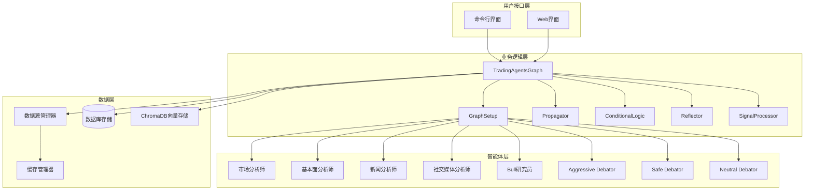

**图表来源**
- [trading_graph.py](file://tradingagents/graph/trading_graph.py#L1-L50)
- [setup.py](file://tradingagents/graph/setup.py#L1-L30)

**章节来源**
- [trading_graph.py](file://tradingagents/graph/trading_graph.py#L1-L100)
- [setup.py](file://tradingagents/graph/setup.py#L1-L50)

## StateGraph核心设计

StateGraph是TradingAgents-CN的核心架构组件，基于LangGraph框架构建了一个高度模块化的交易工作流。该图结构定义了智能体之间的交互关系和数据流转路径。

### 图结构组成

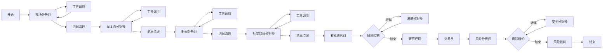

**图表来源**
- [setup.py](file://tradingagents/graph/setup.py#L170-L250)

### 节点类型分类

系统中的智能体节点按照功能可分为以下几类：

1. **数据分析师节点**：负责特定数据源的分析
   - 市场分析师 (`market`)
   - 基本面分析师 (`fundamentals`)  
   - 新闻分析师 (`news`)
   - 社交媒体分析师 (`social`)

2. **研究分析节点**：负责深入分析和辩论
   - 看涨研究员 (`bull_researcher`)
   - 看跌研究员 (`bear_researcher`)
   - 研究经理 (`research_manager`)

3. **风险分析节点**：负责风险评估和决策
   - 激进风险分析师 (`risky_analyst`)
   - 安全风险分析师 (`safe_analyst`)
   - 中性风险分析师 (`neutral_analyst`)
   - 风险经理 (`risk_manager`)

4. **交易执行节点**：负责最终决策和信号生成
   - 交易员 (`trader`)
   - 风险裁判 (`risk_judge`)

**章节来源**
- [setup.py](file://tradingagents/graph/setup.py#L80-L170)

## 智能体节点详解

### 市场分析师节点

市场分析师是系统的第一道分析关卡，负责技术面分析和市场数据处理。该节点采用统一的工具调用机制，支持多种市场数据源。

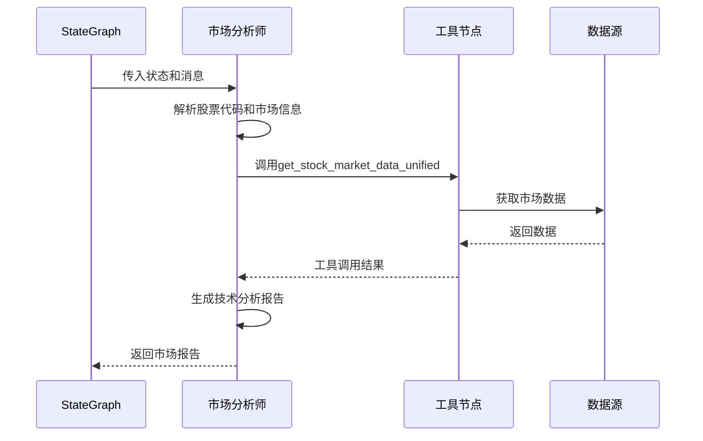

**图表来源**
- [market_analyst.py](file://tradingagents/agents/analysts/market_analyst.py#L265-L518)

市场分析师的核心特性包括：
- **智能工具选择**：根据股票类型自动选择合适的数据源
- **统一接口**：使用`get_stock_market_data_unified`工具处理所有市场数据
- **Google模型适配**：针对Google AI模型提供专门的工具调用处理
- **错误恢复**：具备完善的错误处理和降级机制

### 基本面分析师节点

基本面分析师专注于公司财务数据和基本面分析，采用严格的工具调用要求确保数据真实性。

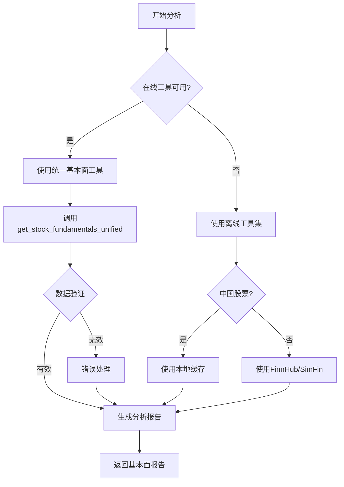

**图表来源**
- [fundamentals_analyst.py](file://tradingagents/agents/analysts/fundamentals_analyst.py#L83-L306)

### 研究员辩论节点

研究员辩论系统通过看涨和看跌研究员的交替发言，形成深入的分析辩论。该系统采用迭代式辩论机制，确保充分讨论。

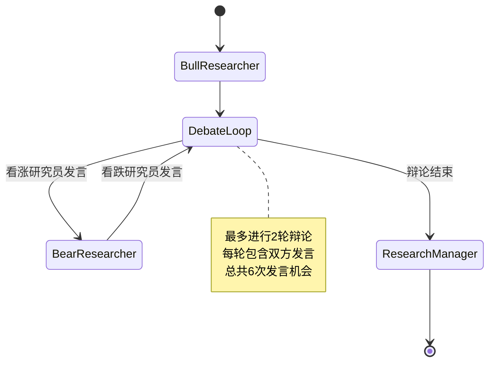

**图表来源**
- [bull_researcher.py](file://tradingagents/agents/researchers/bull_researcher.py#L1-L32)
- [bear_researcher.py](file://tradingagents/agents/researchers/bear_researcher.py#L1-L32)

### 风险分析节点

风险分析节点采用三重辩论机制，通过激进、安全和中性三种风险视角的碰撞，形成全面的风险评估。

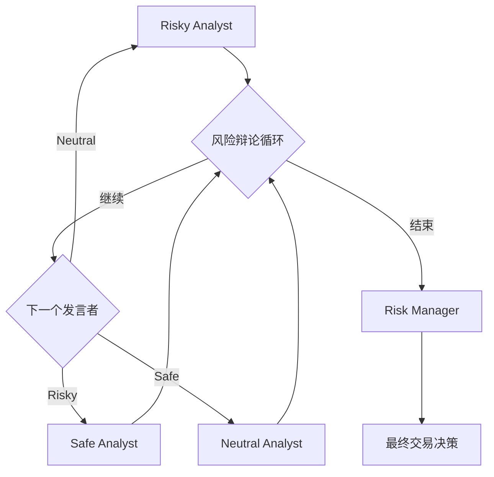

**图表来源**
- [aggresive_debator.py](file://tradingagents/agents/risk_mgmt/aggresive_debator.py#L36-L58)
- [conservative_debator.py](file://tradingagents/agents/risk_mgmt/conservative_debator.py#L43-L61)
- [neutral_debator.py](file://tradingagents/agents/risk_mgmt/neutral_debator.py#L25-L45)

**章节来源**
- [market_analyst.py](file://tradingagents/agents/analysts/market_analyst.py#L265-L518)
- [fundamentals_analyst.py](file://tradingagents/agents/analysts/fundamentals_analyst.py#L83-L306)
- [bull_researcher.py](file://tradingagents/agents/researchers/bull_researcher.py#L1-L32)
- [aggresive_debator.py](file://tradingagents/agents/risk_mgmt/aggresive_debator.py#L1-L58)

## 条件边与路由逻辑

ConditionalLogic类是整个图工作流的决策控制中心，负责根据不同的条件动态决定流程走向。

### 分析师工具调用路由

每个分析师节点都配备了专门的条件逻辑来处理工具调用后的流程：

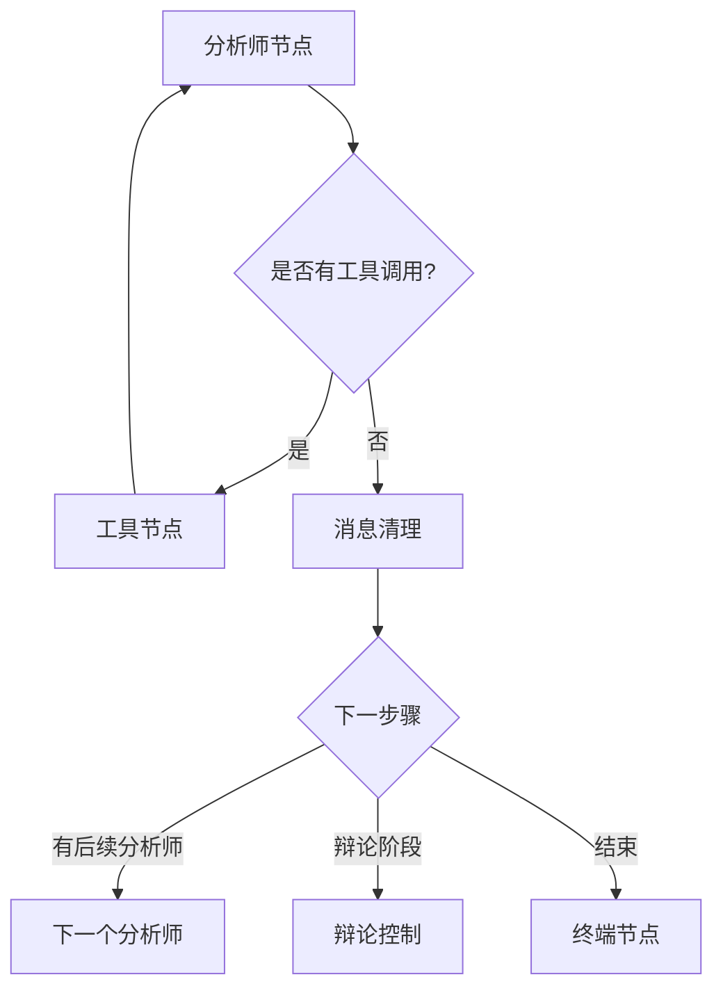

**图表来源**
- [conditional_logic.py](file://tradingagents/graph/conditional_logic.py#L15-L60)

### 辩论循环控制

辩论系统采用计数器机制来控制辩论的轮次和参与者：

| 控制条件 | 实现逻辑 | 最大轮次 |
|---------|---------|---------|
| 投资辩论轮次 | `state["investment_debate_state"]["count"] >= 2 * max_debate_rounds` | 3轮（6次发言） |
| 风险分析轮次 | `state["risk_debate_state"]["count"] >= 3 * max_risk_discuss_rounds` | 3轮（9次发言） |
| 发言顺序控制 | 根据最新发言者身份决定下一位 | 循环切换 |

### 终止条件判断

系统设置了多层次的终止条件来防止无限循环：

1. **辩论次数限制**：确保辩论不会无限制进行
2. **发言者轮换**：避免单一观点主导整个辩论
3. **最终决策触发**：当达到足够信息量时自动终止

**章节来源**
- [conditional_logic.py](file://tradingagents/graph/conditional_logic.py#L1-L80)

## Propagator状态管理

Propagator类负责图的初始化和状态传播，是整个工作流的启动器和状态管理者。

### 初始状态创建

Propagator通过`create_initial_state`方法创建图的起始状态：

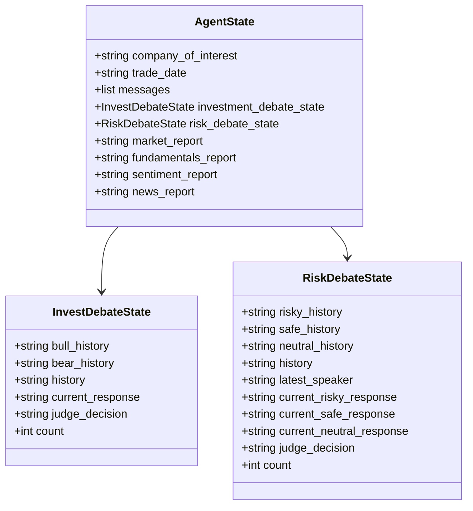

**图表来源**
- [agent_states.py](file://tradingagents/agents/utils/agent_states.py#L40-L80)
- [propagation.py](file://tradingagents/graph/propagation.py#L20-L45)

### 图参数配置

Propagator提供了灵活的图参数配置机制：

| 参数名称 | 默认值 | 作用描述 |
|---------|-------|---------|
| stream_mode | "values" | 控制流模式，实时返回中间状态 |
| recursion_limit | 100 | 递归调用的最大深度限制 |
| config | {} | LangGraph配置参数 |

### 状态传播机制

状态传播遵循以下原则：
1. **增量更新**：每次节点执行只更新相关状态字段
2. **消息累积**：所有节点的消息都会累积到全局消息列表中
3. **状态隔离**：不同类型的状态相互独立但可以引用

**章节来源**
- [propagation.py](file://tradingagents/graph/propagation.py#L1-L54)
- [agent_states.py](file://tradingagents/agents/utils/agent_states.py#L40-L81)

## ConditionalLogic决策控制

ConditionalLogic类实现了复杂的决策逻辑，控制着整个工作流的流向和节奏。

### 条件判断机制

系统采用函数式条件判断，每个节点都有对应的条件函数：

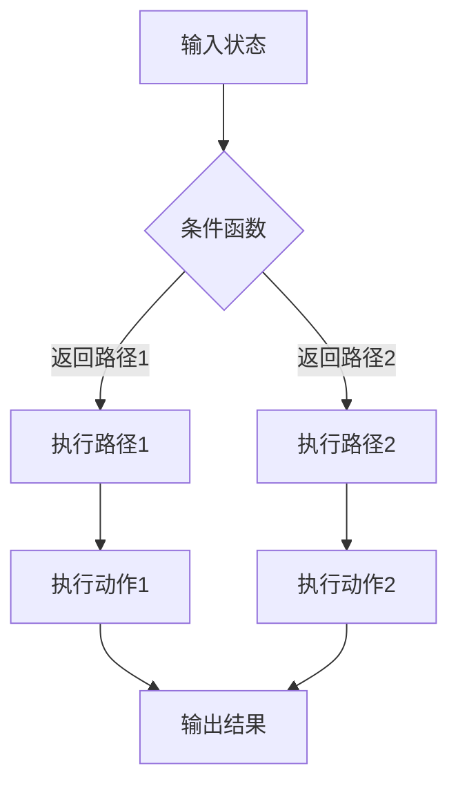

**图表来源**
- [conditional_logic.py](file://tradingagents/graph/conditional_logic.py#L15-L78)

### 辩论控制逻辑

辩论控制是ConditionalLogic的核心功能之一：

1. **投资辩论控制**
   - 基于辩论轮次计数器判断是否继续
   - 根据当前回应内容决定下一个发言者
   - 确保双方都有充分表达机会

2. **风险分析控制**
   - 更严格的轮次限制（3轮）
   - 基于发言者身份的循环切换
   - 确保三种风险视角都被充分表达

### 工具调用路由

每个分析师节点都实现了专门的工具调用路由逻辑：

```python
# 示例：市场分析师的工具调用判断
def should_continue_market(self, state: AgentState):
    messages = state["messages"]
    last_message = messages[-1]
    
    if hasattr(last_message, 'tool_calls') and last_message.tool_calls:
        return "tools_market"  # 跳转到工具节点
    return "Msg Clear Market"  # 直接清理消息
```

**章节来源**
- [conditional_logic.py](file://tradingagents/graph/conditional_logic.py#L1-L80)

## Reflection经验学习机制

Reflection机制是TradingAgents-CN的重要创新，通过经验学习不断提升决策质量。

### 学习框架设计

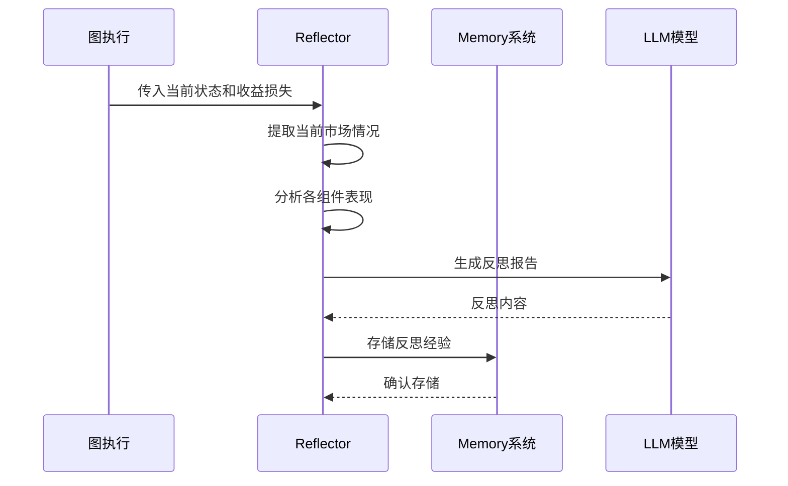

**图表来源**
- [reflection.py](file://tradingagents/graph/reflection.py#L76-L125)

### 反思内容结构

反思系统采用结构化的反思模板：

| 反思维度 | 内容描述 | 学习目标 |
|---------|---------|---------|
| 成功因素 | 正确决策的原因分析 | 识别有效策略 |
| 失败原因 | 错误决策的根本原因 | 避免重复错误 |
| 改进建议 | 具体的优化措施 | 提升未来表现 |
| 知识总结 | 可复用的经验教训 | 形成知识库 |

### 内存系统集成

反思结果通过Memory系统持久化存储：

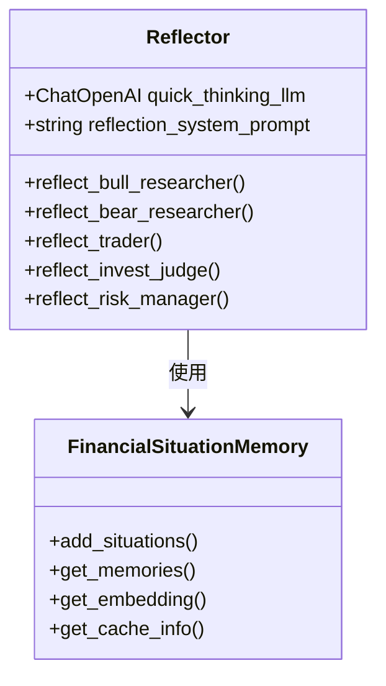

**图表来源**
- [reflection.py](file://tradingagents/graph/reflection.py#L1-L50)
- [memory.py](file://tradingagents/agents/utils/memory.py#L1-L100)

### 智能记忆检索

Memory系统采用向量相似度检索：

1. **文本嵌入**：使用多提供商的嵌入模型生成向量
2. **相似度计算**：基于余弦相似度匹配相关经验
3. **智能截断**：处理超长文本的嵌入限制
4. **降级机制**：在主模型失效时自动切换到备用方案

**章节来源**
- [reflection.py](file://tradingagents/graph/reflection.py#L1-L126)
- [memory.py](file://tradingagents/agents/utils/memory.py#L1-L200)

## SignalProcessor信号处理

SignalProcessor负责将复杂的分析结果转化为可执行的交易信号，是连接分析和执行的关键桥梁。

### 信号处理流程

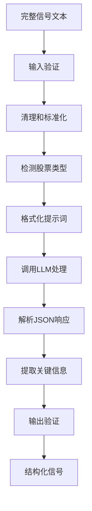

**图表来源**
- [signal_processing.py](file://tradingagents/graph/signal_processing.py#L20-L100)

### 信号结构定义

信号处理器生成的标准信号结构：

| 字段名称 | 类型 | 描述 | 示例值 |
|---------|------|------|--------|
| action | string | 投资动作 | "买入"/"持有"/"卖出" |
| target_price | float | 目标价格 | 15.25 |
| confidence | float | 置信度(0-1) | 0.85 |
| risk_score | float | 风险评分(0-1) | 0.6 |
| reasoning | string | 决策理由 | "基于基本面分析得出..." |

### 智能价格提取

信号处理器实现了强大的价格提取能力：

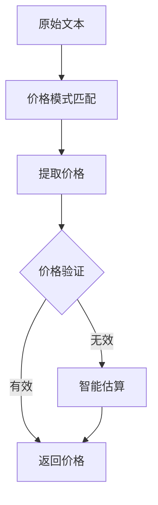

**图表来源**
- [signal_processing.py](file://tradingagents/graph/signal_processing.py#L150-L250)

### 多语言支持

信号处理器支持多种语言和货币：

1. **货币识别**：自动检测股票所在市场和计价货币
2. **语言转换**：确保输出内容符合目标市场的语言习惯
3. **文化适配**：根据市场特点调整分析风格和术语

### 错误处理机制

系统具备完善的错误处理和降级机制：

1. **输入验证**：检查信号内容的有效性
2. **格式恢复**：当JSON解析失败时使用文本提取
3. **默认值**：在无法提取关键信息时提供合理默认值
4. **日志记录**：详细记录处理过程和错误信息

**章节来源**
- [signal_processing.py](file://tradingagents/graph/signal_processing.py#L1-L337)

## AgentState状态模型

AgentState是整个系统的核心数据结构，定义了智能体间通信和状态流转的规范。

### 状态字段分类

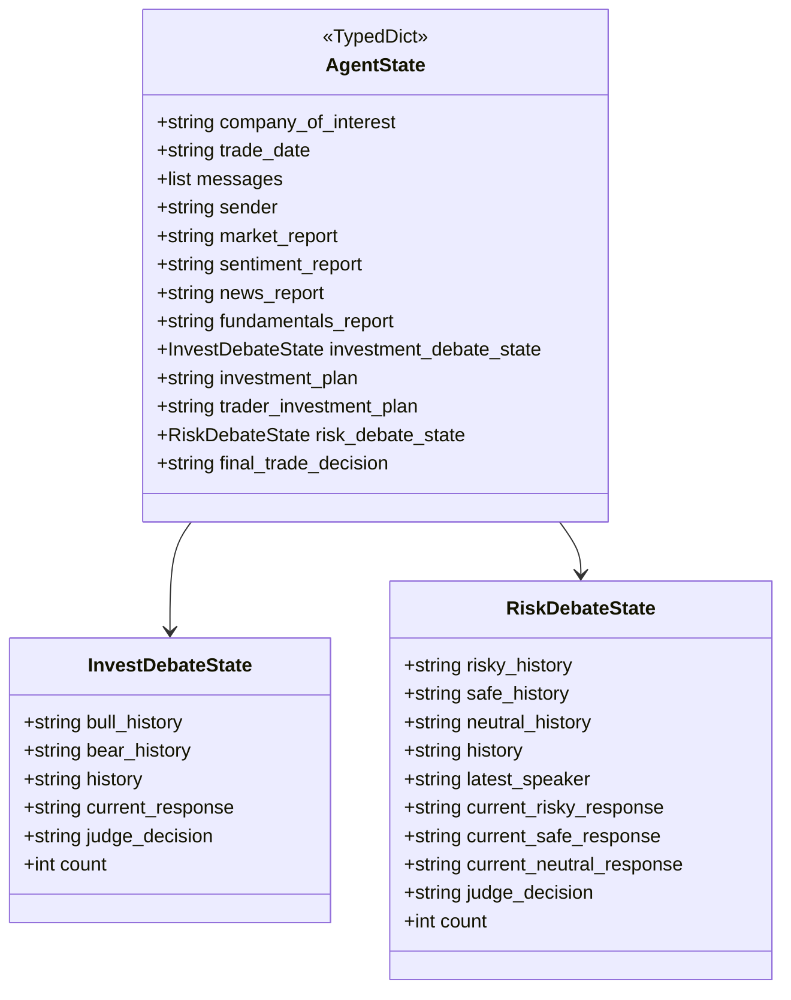

**图表来源**
- [agent_states.py](file://tradingagents/agents/utils/agent_states.py#L40-L81)

### 核心状态字段详解

| 字段类别 | 字段名称 | 类型 | 作用描述 |
|---------|---------|------|---------|
| 基础信息 | company_of_interest | string | 目标公司标识 |
| 基础信息 | trade_date | string | 交易日期 |
| 基础信息 | messages | list | 消息历史记录 |
| 基础信息 | sender | string | 消息发送者 |
| 分析报告 | market_report | string | 市场分析报告 |
| 分析报告 | sentiment_report | string | 情绪分析报告 |
| 分析报告 | news_report | string | 新闻分析报告 |
| 分析报告 | fundamentals_report | string | 基本面分析报告 |
| 投资辩论 | investment_debate_state | InvestDebateState | 投资辩论状态 |
| 投资计划 | investment_plan | string | 投资计划 |
| 投资计划 | trader_investment_plan | string | 交易员投资计划 |
| 风险分析 | risk_debate_state | RiskDebateState | 风险分析状态 |
| 最终决策 | final_trade_decision | string | 最终交易决策 |

### 嵌套状态结构

#### InvestDebateState（投资辩论状态）

投资辩论状态记录了看涨和看跌研究员的交流历史：

- **bull_history**：看涨研究员的历史发言记录
- **bear_history**：看跌研究员的历史发言记录  
- **history**：完整的辩论历史记录
- **current_response**：最新的回应内容
- **judge_decision**：研究经理的最终决策
- **count**：辩论轮次计数器

#### RiskDebateState（风险分析状态）

风险分析状态管理三个风险视角的辩论：

- **risky_history**：激进风险分析师的历史发言
- **safe_history**：安全风险分析师的历史发言
- **neutral_history**：中性风险分析师的历史发言
- **history**：完整的风险辩论历史
- **latest_speaker**：最新发言者的身份标识
- **current_risky_response**：激进分析师的最新回应
- **current_safe_response**：安全分析师的最新回应
- **current_neutral_response**：中性分析师的最新回应
- **judge_decision**：风险经理的最终决策
- **count**：风险辩论轮次计数器

### 状态流转规则

状态在图执行过程中遵循以下流转规则：

1. **消息累积**：所有节点的消息都会添加到全局消息列表
2. **字段更新**：每个节点只更新自己负责的状态字段
3. **历史保留**：辩论历史和分析报告会被逐步累积
4. **状态隔离**：不同类型的状态相互独立但可以引用

**章节来源**
- [agent_states.py](file://tradingagents/agents/utils/agent_states.py#L1-L81)

## 性能监控与调试

TradingAgents-CN提供了完善的性能监控和调试机制，帮助开发者理解和优化系统性能。

### 日志系统架构

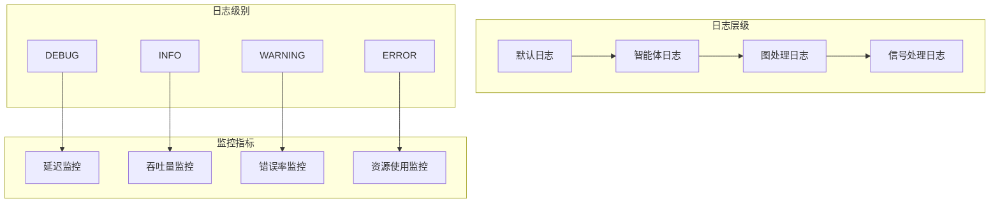

### 调试技巧

#### 1. 图执行跟踪

启用调试模式可以实时跟踪图的执行过程：

```python
# 启用调试模式
trading_graph = TradingAgentsGraph(debug=True)

# 调试模式下的执行
final_state = trading_graph.propagate(company_name, trade_date)
```

调试模式会输出：
- 每个节点的执行详情
- 状态变化的详细信息
- 工具调用的完整流程
- 错误堆栈信息

#### 2. 状态快照记录

系统自动记录完整的状态快照：

```python
# 状态快照保存位置
# eval_results/{ticker}/TradingAgentsStrategy_logs/full_states_log.json
```

#### 3. 性能指标监控

关键性能指标包括：

| 指标类型 | 监控内容 | 正常范围 |
|---------|---------|---------|
| 执行时间 | 整体执行耗时 | < 30秒 |
| 节点耗时 | 各节点执行时间 | < 10秒/节点 |
| 工具调用 | 工具成功率 | > 95% |
| 内存使用 | 内存占用峰值 | < 2GB |
| 并发处理 | 同时处理数量 | < 10个 |

### 常见问题诊断

#### 1. 工具调用失败

**症状**：节点执行中断，工具调用返回错误
**诊断步骤**：
1. 检查网络连接状态
2. 验证API密钥有效性
3. 查看工具调用参数
4. 检查数据源可用性

#### 2. 状态同步问题

**症状**：状态字段更新不一致
**诊断步骤**：
1. 检查状态字段的类型注解
2. 验证节点返回值的完整性
3. 确认状态合并逻辑

#### 3. 内存泄漏

**症状**：长时间运行后内存持续增长
**诊断步骤**：
1. 监控ChromaDB集合大小
2. 检查向量缓存配置
3. 分析状态累积速度

### 优化建议

#### 1. 并发优化

- 使用异步工具调用减少等待时间
- 实现批量数据处理
- 优化内存使用策略

#### 2. 缓存优化

- 启用适当的缓存策略
- 调整向量缓存大小
- 实现智能缓存淘汰

#### 3. 网络优化

- 配置合适的超时参数
- 实现重试机制
- 使用连接池管理

**章节来源**
- [trading_graph.py](file://tradingagents/graph/trading_graph.py#L300-L400)

## 最佳实践与优化

### 架构设计原则

1. **模块化设计**：每个组件都有明确的职责边界
2. **可扩展性**：支持新的分析师类型和工具集成
3. **容错性**：具备完善的错误处理和降级机制
4. **可观测性**：提供完整的监控和调试支持

### 性能优化策略

#### 1. 工具调用优化

```python
# 智能工具选择策略
def select_optimal_tools(stock_info):
    if is_china_stock(stock_info):
        return [get_china_stock_data]
    elif is_us_stock(stock_info):
        return [get_YFin_data, get_finnhub_data]
    else:
        return [get_YFin_data]
```

#### 2. 内存管理优化

- 合理配置ChromaDB缓存大小
- 实现智能的向量截断策略
- 定期清理过期的记忆数据

#### 3. 并发处理优化

- 使用异步工具调用
- 实现工作队列管理
- 优化状态同步机制

### 扩展开发指南

#### 1. 新增分析师类型

```python
# 创建新的分析师节点
def create_custom_analyst(llm, toolkit):
    def custom_node(state):
        # 实现分析师逻辑
        return {"custom_report": analysis_result}
    
    return custom_node

# 在GraphSetup中注册新节点
workflow.add_node("Custom Analyst", create_custom_analyst(...))
```

#### 2. 自定义条件逻辑

```python
# 扩展ConditionalLogic
class ExtendedConditionalLogic(ConditionalLogic):
    def should_continue_custom(self, state):
        # 实现自定义条件逻辑
        return "Next Node"
```

#### 3. 集成新数据源

```python
# 创建新的工具节点
custom_tool_node = ToolNode([custom_data_tool])

# 在图中添加工具节点
workflow.add_node("tools_custom", custom_tool_node)
```

### 生产环境部署

#### 1. 配置管理

```yaml
# 生产环境配置示例
llm_provider: "dashscope"
memory_enabled: true
max_recur_limit: 100
enable_embedding_length_check: true
```

#### 2. 监控告警

- 设置执行时间阈值告警
- 监控工具调用成功率
- 跟踪内存使用趋势
- 监控错误率变化

#### 3. 容灾备份

- 实现多提供商API切换
- 建立数据备份机制
- 设计故障恢复流程
- 实施负载均衡策略

### 安全考虑

#### 1. API密钥管理

- 使用环境变量存储敏感信息
- 实现密钥轮换机制
- 限制API访问频率
- 加密存储敏感数据

#### 2. 输入验证

- 验证股票代码格式
- 检查日期格式合法性
- 过滤恶意输入内容
- 实施速率限制

#### 3. 数据保护

- 加密存储向量数据
- 实施访问权限控制
- 定期清理临时数据
- 监控异常访问行为

通过遵循这些最佳实践和优化策略，TradingAgents-CN能够在生产环境中稳定高效地运行，为用户提供可靠的智能交易决策支持。