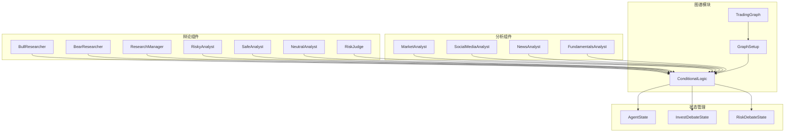
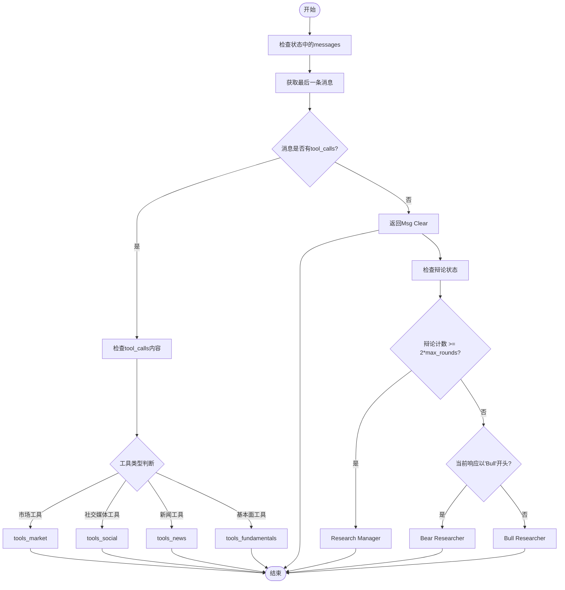
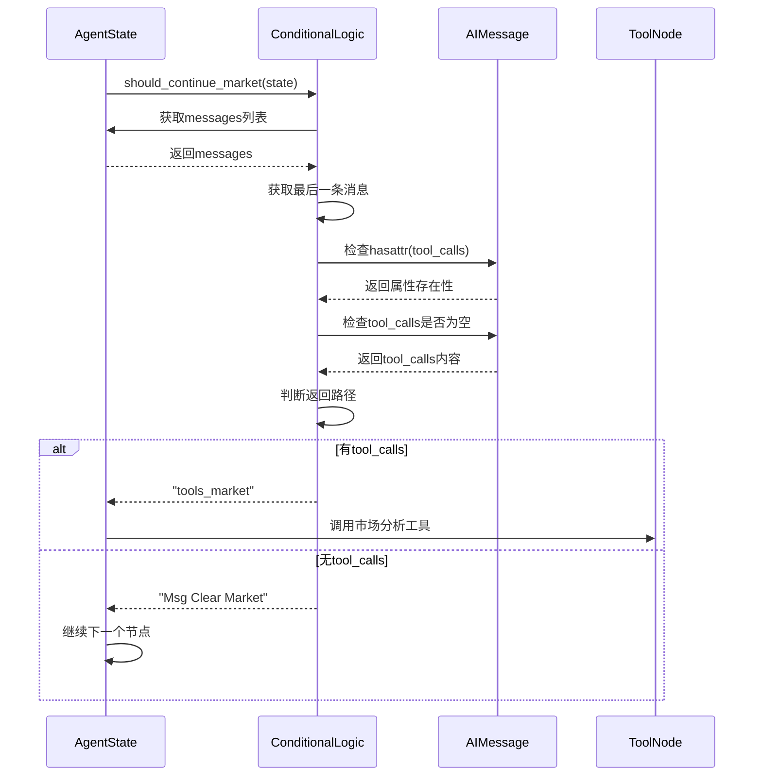
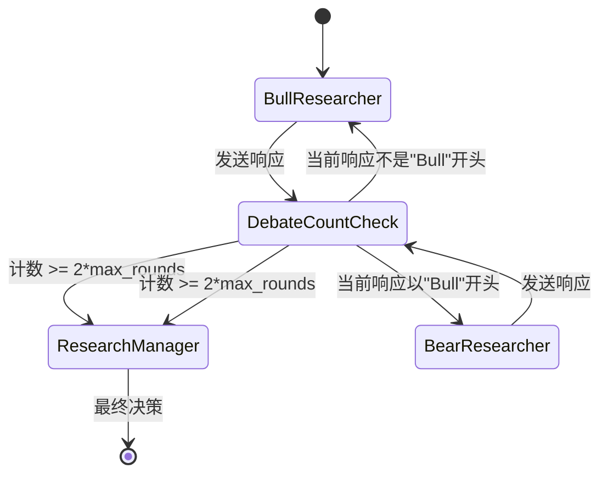
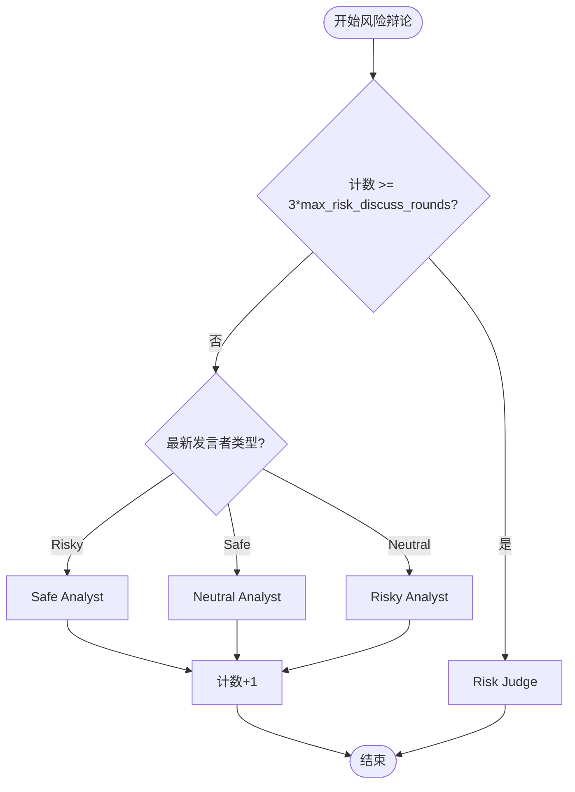
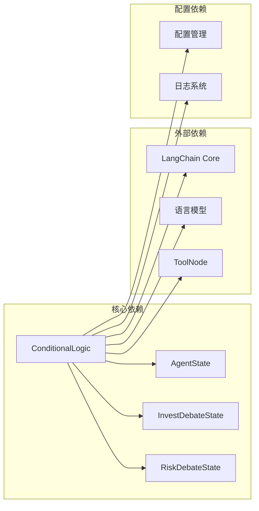

# 条件控制逻辑

<cite>
**本文档引用的文件**
- [conditional_logic.py](file://tradingagents/graph/conditional_logic.py)
- [agent_states.py](file://tradingagents/agents/utils/agent_states.py)
- [setup.py](file://tradingagents/graph/setup.py)
- [test_conditional_logic_fix.py](file://tests/test_conditional_logic_fix.py)
- [research_manager.py](file://tradingagents/agents/managers/research_manager.py)
- [risk_manager.py](file://tradingagents/agents/managers/risk_manager.py)
- [aggresive_debator.py](file://tradingagents/agents/risk_mgmt/aggresive_debator.py)
- [neutral_debator.py](file://tradingagents/agents/risk_mgmt/neutral_debator.py)
- [conservative_debator.py](file://tradingagents/agents/risk_mgmt/conservative_debator.py)
</cite>

## 目录
1. [简介](#简介)
2. [项目结构](#项目结构)
3. [核心组件](#核心组件)
4. [架构概览](#架构概览)
5. [详细组件分析](#详细组件分析)
6. [依赖关系分析](#依赖关系分析)
7. [性能考虑](#性能考虑)
8. [故障排除指南](#故障排除指南)
9. [结论](#结论)

## 简介

ConditionalLogic类是TradingAgents系统中的核心条件控制组件，负责根据不同的分析阶段和状态条件来决定工作流的流向。该类实现了复杂的条件逻辑，包括工具调用检测、辩论循环控制和风险评估流程管理。

ConditionalLogic类的主要职责包括：
- 检测AIMessage的tool_calls属性来决定是否继续工具节点调用
- 控制投资辩论的循环流程，基于计数器和响应内容
- 管理风险评估团队的三重辩论流程
- 提供可配置的最大轮次限制来控制决策流程长度

## 项目结构

ConditionalLogic类位于TradingAgents项目的图谱（graph）模块中，作为条件逻辑处理的核心组件：



**图表来源**
- [conditional_logic.py](file://tradingagents/graph/conditional_logic.py#L9-L78)
- [setup.py](file://tradingagents/graph/setup.py#L21-L48)

**章节来源**
- [conditional_logic.py](file://tradingagents/graph/conditional_logic.py#L1-L80)
- [agent_states.py](file://tradingagents/agents/utils/agent_states.py#L1-L81)

## 核心组件

ConditionalLogic类包含以下核心组件：

### 初始化配置
- `max_debate_rounds`: 投资辩论的最大轮次，默认值为1
- `max_risk_discuss_rounds`: 风险讨论的最大轮次，默认值为1

### 工具调用检测方法
- `should_continue_market()`: 检查市场分析是否应该继续
- `should_continue_social()`: 检查社交媒体分析是否应该继续  
- `should_continue_news()`: 检查新闻分析是否应该继续
- `should_continue_fundamentals()`: 检查基本面分析是否应该继续

### 辩论流程控制方法
- `should_continue_debate()`: 控制投资辩论的循环流程
- `should_continue_risk_analysis()`: 管理风险评估辩论流程

**章节来源**
- [conditional_logic.py](file://tradingagents/graph/conditional_logic.py#L9-L78)

## 架构概览

ConditionalLogic类采用状态驱动的条件逻辑架构，通过检查AgentState中的不同状态字段来决定工作流的走向：



**图表来源**
- [conditional_logic.py](file://tradingagents/graph/conditional_logic.py#L17-L78)

## 详细组件分析

### 工具调用检测机制

ConditionalLogic类通过检查AIMessage的tool_calls属性来决定是否调用工具节点。这种设计确保了只有在模型明确请求工具调用时才会进入相应的工具处理流程。

#### should_continue_market() 方法分析



**图表来源**
- [conditional_logic.py](file://tradingagents/graph/conditional_logic.py#L17-L25)

#### 工具调用安全性检查

ConditionalLogic类实现了安全的工具调用检测机制，使用`hasattr()`函数来检查消息对象是否具有tool_calls属性，避免了直接访问不存在属性导致的异常。

**章节来源**
- [conditional_logic.py](file://tradingagents/graph/conditional_logic.py#L17-L55)

### 投资辩论流程控制

should_continue_debate()方法实现了投资辩论的智能循环控制，基于辩论计数器和当前响应内容来决定下一步的参与者。

#### 辩论流程状态机



**图表来源**
- [conditional_logic.py](file://tradingagents/graph/conditional_logic.py#L57-L66)

#### 辩论控制逻辑详解

辩论控制逻辑的关键要素：

1. **计数器阈值检查**: 当辩论计数达到`2 * max_debate_rounds`时，自动终止辩论并转交给研究经理
2. **响应内容分析**: 根据当前研究员的响应内容决定下一个发言者
3. **状态持久化**: 通过investment_debate_state维护辩论历史和当前状态

**章节来源**
- [conditional_logic.py](file://tradingagents/graph/conditional_logic.py#L57-L66)

### 风险评估辩论流程

should_continue_risk_analysis()方法管理风险评估团队的三重辩论流程，涉及激进、保守和中立三种风险偏好的分析师。

#### 风险辩论流程图



**图表来源**
- [conditional_logic.py](file://tradingagents/graph/conditional_logic.py#L68-L78)

#### 风险辩论状态管理

风险辩论状态通过risk_debate_state字典维护，包含以下关键字段：

- `history`: 完整的辩论历史记录
- `risky_history`: 激进分析师的历史发言
- `safe_history`: 保守分析师的历史发言  
- `neutral_history`: 中立分析师的历史发言
- `latest_speaker`: 最新发言者的标识
- `count`: 当前辩论轮次计数

**章节来源**
- [conditional_logic.py](file://tradingagents/graph/conditional_logic.py#L68-L78)
- [agent_states.py](file://tradingagents/agents/utils/agent_states.py#L25-L47)

### 配置参数控制

ConditionalLogic类通过两个关键配置参数来控制决策流程的长度：

#### max_debate_rounds 参数

- **默认值**: 1
- **作用**: 控制投资辩论的最大轮次
- **影响**: 影响should_continue_debate()方法的计数阈值计算
- **典型值**: 1-3（根据分析深度需求调整）

#### max_risk_discuss_rounds 参数

- **默认值**: 1  
- **作用**: 控制风险评估辩论的最大轮次
- **影响**: 影响should_continue_risk_analysis()方法的计数阈值计算
- **典型值**: 1-3（根据风险评估深度需求调整）

**章节来源**
- [conditional_logic.py](file://tradingagents/graph/conditional_logic.py#L12-L15)

## 依赖关系分析

ConditionalLogic类与多个系统组件存在密切的依赖关系：



**图表来源**
- [conditional_logic.py](file://tradingagents/graph/conditional_logic.py#L1-L8)
- [agent_states.py](file://tradingagents/agents/utils/agent_states.py#L1-L10)

### 状态类型依赖

ConditionalLogic类依赖于特定的状态类型来正确执行条件逻辑：

1. **AgentState**: 主要状态容器，包含所有分析阶段的状态
2. **InvestDebateState**: 投资辩论专用状态结构
3. **RiskDebateState**: 风险评估辩论专用状态结构

### 工具节点集成

ConditionalLogic类与ToolNode紧密集成，通过返回特定字符串来触发相应的工具调用流程。

**章节来源**
- [conditional_logic.py](file://tradingagents/graph/conditional_logic.py#L1-L8)
- [agent_states.py](file://tradingagents/agents/utils/agent_states.py#L1-L81)

## 性能考虑

### 工具调用检测优化

ConditionalLogic类在工具调用检测方面采用了多项优化措施：

1. **早期退出机制**: 在检查tool_calls之前先检查属性存在性
2. **最小化内存访问**: 只访问必要的状态字段
3. **类型安全检查**: 使用hasattr()避免属性访问异常

### 状态访问优化

- **直接索引访问**: 通过状态字典直接访问所需字段
- **避免深层嵌套**: 减少状态结构的嵌套层级
- **缓存常用值**: 在方法内部缓存频繁访问的状态值

### 内存使用优化

- **状态轻量化**: 使用TypedDict定义轻量级状态结构
- **按需加载**: 只在需要时访问完整的状态信息
- **及时清理**: 确保状态更新时不会产生内存泄漏

## 故障排除指南

### 常见问题及解决方案

#### 1. ToolMessage属性错误

**问题描述**: 尝试访问ToolMessage的tool_calls属性导致AttributeError

**解决方案**: ConditionalLogic类已经修复了这个问题，使用`hasattr()`安全检查来避免直接访问不存在的属性。

**相关代码位置**: [conditional_logic.py](file://tradingagents/graph/conditional_logic.py#L17-L55)

#### 2. 辩论循环卡死

**问题描述**: 投资辩论或风险评估陷入无限循环

**诊断步骤**:
1. 检查max_debate_rounds和max_risk_discuss_rounds配置值
2. 验证辩论状态中的计数器是否正确递增
3. 确认状态更新逻辑是否正确执行

**解决方案**: 增加适当的调试日志，监控状态变化

#### 3. 状态字段缺失

**问题描述**: 访问不存在的状态字段导致KeyError

**预防措施**:
- 使用get()方法访问可选状态字段
- 在状态初始化时设置默认值
- 添加状态验证逻辑

**章节来源**
- [test_conditional_logic_fix.py](file://tests/test_conditional_logic_fix.py#L1-L158)

### 调试技巧

#### 状态监控

```python
# 调试工具调用检测
def debug_tool_calls(state):
    last_message = state["messages"][-1]
    has_tool_calls = hasattr(last_message, 'tool_calls')
    tool_calls = getattr(last_message, 'tool_calls', None)
    print(f"Message type: {type(last_message).__name__}")
    print(f"Has tool_calls: {has_tool_calls}")
    print(f"Tool calls: {tool_calls}")
```

#### 辩论状态跟踪

```python
# 调试辩论流程
def debug_debate_state(state):
    debate_state = state["investment_debate_state"]
    print(f"Count: {debate_state['count']}")
    print(f"Current response: {debate_state['current_response']}")
    print(f"History length: {len(debate_state['history'])}")
```

#### 风险辩论监控

```python
# 调试风险评估流程
def debug_risk_state(state):
    risk_state = state["risk_debate_state"]
    print(f"Count: {risk_state['count']}")
    print(f"Latest speaker: {risk_state['latest_speaker']}")
    print(f"Risky response length: {len(risk_state['current_risky_response'])}")
```

**章节来源**
- [test_conditional_logic_fix.py](file://tests/test_conditional_logic_fix.py#L15-L40)

## 结论

ConditionalLogic类是TradingAgents系统中不可或缺的条件控制组件，它通过精心设计的条件逻辑实现了复杂的投资分析工作流管理。该类的主要优势包括：

### 设计优势

1. **模块化设计**: 清晰分离不同类型的条件逻辑处理
2. **安全性优先**: 使用hasattr()等安全检查避免运行时错误
3. **可配置性**: 通过配置参数灵活控制流程长度
4. **状态驱动**: 基于状态变化的智能决策机制

### 功能特性

1. **智能工具调用**: 基于模型意图的工具节点选择
2. **辩论流程控制**: 投资和风险评估的多轮辩论管理
3. **状态持久化**: 完整的辩论历史和状态维护
4. **扩展性**: 易于添加新的条件逻辑类型

### 应用价值

ConditionalLogic类为TradingAgents系统提供了强大的条件控制能力，使得复杂的多智能体协作成为可能。通过合理配置参数和监控状态变化，可以实现高质量的投资分析决策流程。

该组件的成功实施证明了状态驱动的条件逻辑在复杂AI系统中的有效性，为类似系统的开发提供了宝贵的参考经验。