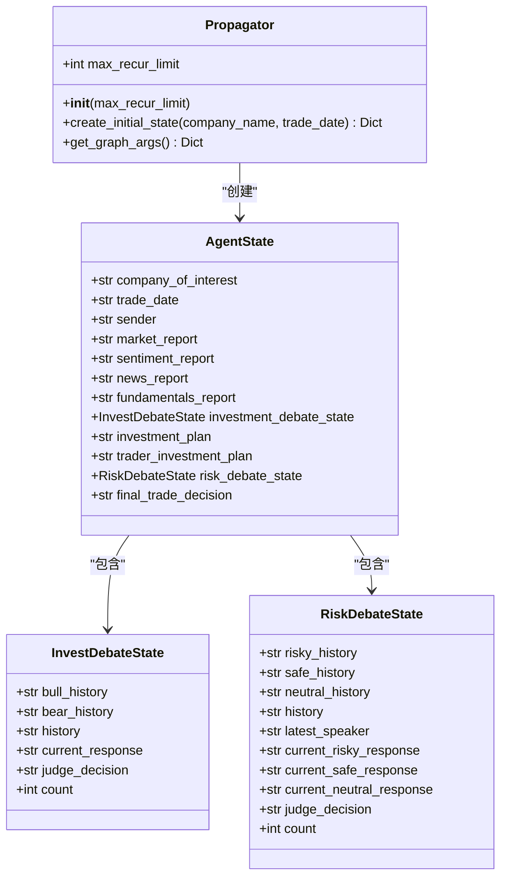
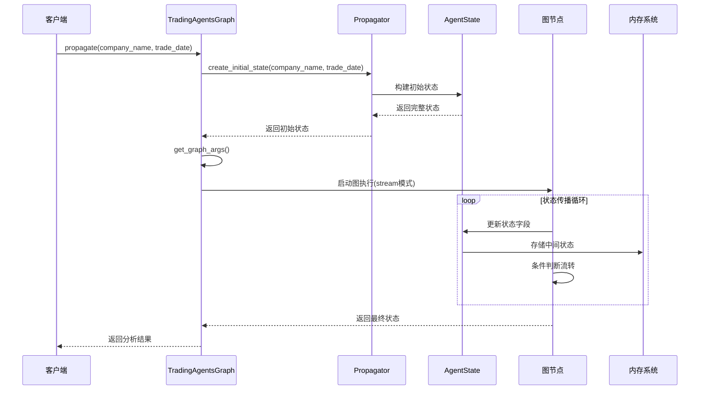

# 状态传播机制

<cite>
**本文档引用的文件**
- [propagation.py](file://tradingagents/graph/propagation.py)
- [agent_states.py](file://tradingagents/agents/utils/agent_states.py)
- [trading_graph.py](file://tradingagents/graph/trading_graph.py)
- [conditional_logic.py](file://tradingagents/graph/conditional_logic.py)
- [main.py](file://cli/main.py)
</cite>

## 目录
1. [简介](#简介)
2. [Propagator类架构概览](#propagator类架构概览)
3. [create_initial_state方法详解](#create_initialstate方法详解)
4. [get_graph_args方法详解](#get_graph_args方法详解)
5. [AgentState状态结构分析](#agentstate状态结构分析)
6. [状态传播机制](#状态传播机制)
7. [递归限制与无限循环防护](#递归限制与无限循环防护)
8. [调试示例与最佳实践](#调试示例与最佳实践)
9. [常见错误处理方案](#常见错误处理方案)
10. [总结](#总结)

## 简介

Propagator类是TradingAgents框架中负责状态初始化和传播的核心组件，它在图工作流中扮演着至关重要的角色。该类通过`create_initial_state`方法构建初始AgentState，通过`get_graph_args`方法配置图执行参数，确保整个交易分析流程的稳定性和可靠性。

## Propagator类架构概览

Propagator类采用简洁的设计模式，专注于状态管理和图执行配置：



**图表来源**
- [propagation.py](file://tradingagents/graph/propagation.py#L14-L52)
- [agent_states.py](file://tradingagents/agents/utils/agent_states.py#L53-L79)

**章节来源**
- [propagation.py](file://tradingagents/graph/propagation.py#L14-L52)
- [agent_states.py](file://tradingagents/agents/utils/agent_states.py#L53-L79)

## create_initial_state方法详解

`create_initial_state`方法是Propagator类的核心功能，负责根据输入的公司名称和交易日期构建完整的初始AgentState。

### 方法签名与参数

该方法接受两个必需参数：
- `company_name: str` - 目标公司的名称或标识符
- `trade_date: str` - 交易日期，支持字符串格式转换

### 初始化逻辑详解

方法返回一个字典对象，包含以下关键字段：

#### 1. 基础信息字段
```python
{
    "messages": [("human", company_name)],  # 初始消息，标记为人类输入
    "company_of_interest": company_name,    # 目标公司名称
    "trade_date": str(trade_date),          # 交易日期（强制转换为字符串）
}
```

#### 2. 投资辩论状态初始化
```python
"investment_debate_state": InvestDebateState({
    "history": "",                    # 辩论历史记录为空
    "current_response": "",           # 当前响应为空
    "count": 0                       # 辩论轮次计数为0
})
```

#### 3. 风险辩论状态初始化
```python
"risk_debate_state": RiskDebateState({
    "history": "",                    # 风险辩论历史为空
    "current_risky_response": "",     # 激进分析师当前响应为空
    "current_safe_response": "",      # 保守分析师当前响应为空
    "current_neutral_response": "",   # 中性分析师当前响应为空
    "count": 0                        # 风险讨论轮次计数为0
})
```

#### 4. 分析报告字段
```python
"market_report": "",                  # 市场分析报告为空
"fundamentals_report": "",            # 基本面分析报告为空
"sentiment_report": "",               # 情感分析报告为空
"news_report": ""                     # 新闻分析报告为空
```

### 状态完整性保障

该方法确保了以下状态完整性特征：
- **数据类型一致性**：所有字段都经过适当的类型初始化
- **状态可追踪性**：每个状态都有明确的计数器和历史记录
- **空值安全**：所有字符串字段初始化为空字符串
- **嵌套状态完整**：复杂状态对象（InvestDebateState、RiskDebateState）完全初始化

**章节来源**
- [propagation.py](file://tradingagents/graph/propagation.py#L21-L45)

## get_graph_args方法详解

`get_graph_args`方法负责配置图执行参数，特别是递归限制设置，这是防止无限循环的关键机制。

### 参数配置详解

```python
{
    "stream_mode": "values",           # 流式模式，按值流式处理
    "config": {
        "recursion_limit": self.max_recur_limit  # 递归深度限制
    }
}
```

### 递归限制的重要性

递归限制是图执行过程中的重要安全机制：

#### 1. 防止无限循环
- **默认限制**：100层递归深度
- **动态调整**：可通过构造函数参数自定义
- **异常检测**：超过限制时抛出RecursionError

#### 2. 性能优化
- **资源控制**：限制内存和CPU使用
- **执行时间**：确保分析在合理时间内完成
- **系统稳定性**：防止系统资源耗尽

#### 3. 调试支持
- **错误定位**：明确指出无限循环的位置
- **状态追踪**：提供详细的执行历史
- **性能监控**：监控递归深度变化

### 配置灵活性

该方法提供了灵活的配置选项：
- **流式处理**：支持增量结果返回
- **异步执行**：适合长时间运行的分析任务
- **状态恢复**：支持中断后的状态恢复

**章节来源**
- [propagation.py](file://tradingagents/graph/propagation.py#L47-L52)

## AgentState状态结构分析

AgentState类定义了整个交易分析流程中的状态结构，包含了从基础信息到最终决策的所有关键字段。

### 核心字段分类

#### 1. 基础标识字段
```python
company_of_interest: Annotated[str, "Company that we are interested in trading"]
trade_date: Annotated[str, "What date we are trading at"]
sender: Annotated[str, "Agent that sent this message"]
```

这些字段提供了基本的上下文信息，确保状态在整个流程中保持一致。

#### 2. 分析报告字段
```python
market_report: Annotated[str, "Report from the Market Analyst"]
sentiment_report: Annotated[str, "Report from the Social Media Analyst"]
news_report: Annotated[str, "Report from the News Researcher"]
fundamentals_report: Annotated[str, "Report from the Fundamentals Researcher"]
```

这些报告字段存储各个分析师的分析结果，形成完整的分析视图。

#### 3. 投资辩论状态
```python
investment_debate_state: Annotated[
    InvestDebateState, 
    "Current state of the debate on if to invest or not"
]
investment_plan: Annotated[str, "Plan generated by the Analyst"]
trader_investment_plan: Annotated[str, "Plan generated by the Trader"]
```

投资辩论状态管理多轮辩论的进展，包括：
- **历史记录**：完整的辩论历史
- **当前响应**：最新的辩论观点
- **计数器**：辩论轮次统计
- **最终决策**：研究经理的综合判断

#### 4. 风险管理状态
```python
risk_debate_state: Annotated[
    RiskDebateState, 
    "Current state of the debate on evaluating risk"
]
final_trade_decision: Annotated[str, "Final decision made by the Risk Analysts"]
```

风险管理状态包含三个分析师的视角：
- **激进分析师**：承担更高风险的策略
- **保守分析师**：稳健的投资策略  
- **中性分析师**：平衡的风险评估
- **最终决策**：投资组合经理的最终决定

### 状态传递机制

AgentState通过以下机制确保状态的一致性和完整性：

#### 1. 字典式访问
所有字段通过字典键值对访问，提供灵活的状态查询能力。

#### 2. 类型注解支持
使用Annotated类型注解，提供清晰的字段含义和预期类型。

#### 3. 嵌套状态管理
复杂状态（如InvestDebateState、RiskDebateState）通过TypedDict实现，支持深层状态操作。

**章节来源**
- [agent_states.py](file://tradingagents/agents/utils/agent_states.py#L53-L79)

## 状态传播机制

状态传播是整个TradingAgents框架的核心机制，通过Propagator类协调各个组件之间的状态传递。

### 传播流程图



**图表来源**
- [trading_graph.py](file://tradingagents/graph/trading_graph.py#L320-L375)
- [propagation.py](file://tradingagents/graph/propagation.py#L21-L45)

### 数据完整性保障

状态传播过程中实施多重数据完整性保障措施：

#### 1. 状态验证
- **类型检查**：确保字段类型符合预期
- **范围验证**：检查数值字段的有效范围
- **格式验证**：验证字符串格式的正确性

#### 2. 状态同步
- **原子操作**：状态更新采用原子性操作
- **事务支持**：支持状态更新的事务处理
- **回滚机制**：异常情况下支持状态回滚

#### 3. 状态追踪
- **版本控制**：跟踪状态的历史版本
- **变更日志**：记录状态的每次变更
- **审计轨迹**：提供完整的状态审计路径

### 并发安全性

状态传播机制确保在并发环境下的安全性：

#### 1. 线程安全
- **锁机制**：关键状态操作使用互斥锁
- **无锁设计**：部分状态采用无锁数据结构
- **原子操作**：使用原子操作保证状态一致性

#### 2. 内存隔离
- **状态隔离**：不同分析任务的状态相互隔离
- **垃圾回收**：及时清理不再使用的状态对象
- **内存池**：重用状态对象减少内存分配

**章节来源**
- [trading_graph.py](file://tradingagents/graph/trading_graph.py#L320-L375)

## 递归限制与无限循环防护

递归限制是图执行过程中的重要安全机制，由Propagator类的`max_recur_limit`参数控制。

### 递归限制配置

```python
class Propagator:
    def __init__(self, max_recur_limit=100):
        self.max_recur_limit = max_recur_limit
```

### 防护机制详解

#### 1. 默认限制策略
- **标准限制**：100层递归深度
- **动态调整**：可根据分析复杂度调整
- **性能平衡**：在准确性和性能间取得平衡

#### 2. 无限循环检测
```python
# 条件逻辑中的循环检测
def should_continue_debate(self, state: AgentState) -> str:
    if state["investment_debate_state"]["count"] >= 2 * self.max_debate_rounds:
        return "Research Manager"
    # ... 其他条件
```

#### 3. 异常处理机制
- **递归异常**：超过限制时抛出RecursionError
- **优雅降级**：提供备用执行路径
- **错误恢复**：支持从错误状态恢复

### 性能优化策略

#### 1. 执行效率
- **早期终止**：在达到限制前尽早终止不必要的计算
- **缓存机制**：缓存中间结果避免重复计算
- **并行处理**：利用多核处理器加速状态传播

#### 2. 资源管理
- **内存控制**：限制状态对象的内存占用
- **CPU优化**：优化状态传播算法的时间复杂度
- **I/O优化**：减少状态持久化的I/O开销

**章节来源**
- [propagation.py](file://tradingagents/graph/propagation.py#L17-L19)
- [conditional_logic.py](file://tradingagents/graph/conditional_logic.py#L57-L78)

## 调试示例与最佳实践

### 基础调试示例

以下是一个完整的调试流程示例：

```python
# 调试模式下的状态初始化
logger.debug(f"🔍 [GRAPH DEBUG] ===== TradingAgentsGraph.propagate 接收参数 =====")
logger.debug(f"🔍 [GRAPH DEBUG] 接收到的company_name: '{company_name}' (类型: {type(company_name)})")
logger.debug(f"🔍 [GRAPH DEBUG] 接收到的trade_date: '{trade_date}' (类型: {type(trade_date)})")

# 创建初始状态并验证
init_agent_state = propagator.create_initial_state(company_name, trade_date)
logger.debug(f"🔍 [GRAPH DEBUG] 初始状态中的company_of_interest: '{init_agent_state.get('company_of_interest', 'NOT_FOUND')}'")
logger.debug(f"🔍 [GRAPH DEBUG] 初始状态中的trade_date: '{init_agent_state.get('trade_date', 'NOT_FOUND')}'")

# 获取图参数
args = propagator.get_graph_args()
logger.debug(f"🔍 [GRAPH DEBUG] 递归限制设置: {args['config']['recursion_limit']}")
```

### 状态验证最佳实践

#### 1. 字段完整性检查
```python
def validate_initial_state(state: Dict[str, Any]) -> bool:
    """验证初始状态的完整性"""
    required_fields = [
        "messages", "company_of_interest", "trade_date",
        "investment_debate_state", "risk_debate_state"
    ]
    
    for field in required_fields:
        if field not in state:
            logger.error(f"缺少必要字段: {field}")
            return False
    
    # 验证状态对象类型
    if not isinstance(state["investment_debate_state"], InvestDebateState):
        logger.error("investment_debate_state类型错误")
        return False
    
    return True
```

#### 2. 状态传播跟踪
```python
# 启用调试模式进行状态跟踪
if debug_mode:
    trace = []
    for chunk in graph.stream(init_agent_state, **args):
        if len(chunk["messages"]) > 0:
            # 记录状态变化
            logger.debug(f"状态更新: {chunk.keys()}")
            trace.append(chunk)
    
    final_state = trace[-1]
```

### 性能监控示例

```python
import time
from functools import wraps

def monitor_state_propagation(func):
    @wraps(func)
    def wrapper(*args, **kwargs):
        start_time = time.time()
        result = func(*args, **kwargs)
        end_time = time.time()
        
        logger.info(f"状态传播耗时: {end_time - start_time:.2f}秒")
        return result
    return wrapper

@monitor_state_propagation
def propagate_with_monitoring(self, company_name, trade_date):
    return self.propagator.create_initial_state(company_name, trade_date)
```

**章节来源**
- [trading_graph.py](file://tradingagents/graph/trading_graph.py#L320-L351)
- [main.py](file://cli/main.py#L1239-L1269)

## 常见错误处理方案

### 1. 状态初始化错误

#### 错误现象
```python
# 错误：传入无效的trade_date
state = propagator.create_initial_state("AAPL", 20241231)  # 日期格式错误
```

#### 解决方案
```python
def safe_create_initial_state(propagator, company_name, trade_date):
    """安全的状态初始化包装器"""
    try:
        # 验证输入参数
        if not isinstance(trade_date, (str, int, float)):
            trade_date = str(trade_date)
        
        return propagator.create_initial_state(company_name, trade_date)
    except Exception as e:
        logger.error(f"状态初始化失败: {e}")
        # 返回默认状态
        return propagator.create_initial_state("UNKNOWN", "2024-01-01")
```

### 2. 递归限制错误

#### 错误现象
```
RecursionError: maximum recursion depth exceeded
```

#### 解决方案
```python
def handle_recursion_error(func):
    """递归错误处理装饰器"""
    def wrapper(*args, **kwargs):
        try:
            return func(*args, **kwargs)
        except RecursionError as e:
            logger.error(f"递归深度超出限制: {e}")
            # 降低递归限制重新尝试
            if 'max_recur_limit' in kwargs:
                kwargs['max_recur_limit'] //= 2
            return func(*args, **kwargs)
    return wrapper
```

### 3. 状态传播中断

#### 错误现象
```python
# 状态传播过程中被中断
for chunk in graph.stream(init_state, **args):
    if not validate_chunk(chunk):
        break  # 中断传播
```

#### 解决方案
```python
def robust_state_propagation(graph, init_state, args):
    """健壮的状态传播"""
    try:
        # 尝试标准传播
        return graph.invoke(init_state, **args)
    except Exception as e:
        logger.warning(f"标准传播失败: {e}")
        
        # 尝试简化传播
        simplified_args = args.copy()
        simplified_args['config']['recursion_limit'] = 50
        
        try:
            return graph.invoke(init_state, **simplified_args)
        except Exception as e:
            logger.error(f"简化传播也失败: {e}")
            # 返回部分状态
            return init_state
```

### 4. 内存溢出处理

#### 错误现象
```
MemoryError: Unable to allocate memory for state
```

#### 解决方案
```python
def memory_efficient_state_propagation(graph, init_state, args):
    """内存高效的传播策略"""
    # 分批处理大型状态
    batch_size = 10
    results = []
    
    for i in range(0, len(init_state), batch_size):
        batch = {k: v for k, v in init_state.items() if k != 'large_field'}
        batch_result = graph.invoke(batch, **args)
        results.append(batch_result)
        
        # 清理临时状态
        del batch
    
    return combine_results(results)
```

### 5. 状态验证失败

#### 错误现象
```python
# 状态字段缺失或类型错误
if "investment_debate_state" not in state:
    raise KeyError("投资辩论状态缺失")
```

#### 解决方案
```python
def validate_and_fix_state(state):
    """验证并修复状态"""
    fixed_state = state.copy()
    
    # 修复缺失字段
    if "investment_debate_state" not in fixed_state:
        fixed_state["investment_debate_state"] = InvestDebateState({
            "history": "", "current_response": "", "count": 0
        })
    
    # 修复类型错误
    if not isinstance(fixed_state["trade_date"], str):
        fixed_state["trade_date"] = str(fixed_state["trade_date"])
    
    return fixed_state
```

**章节来源**
- [trading_graph.py](file://tradingagents/graph/trading_graph.py#L353-L375)

## 总结

Propagator类在TradingAgents框架中发挥着核心作用，通过精心设计的状态初始化和传播机制，确保了整个交易分析流程的稳定性和可靠性。

### 关键特性总结

1. **状态完整性**：`create_initial_state`方法确保所有状态字段得到正确初始化
2. **安全防护**：`get_graph_args`方法通过递归限制防止无限循环
3. **灵活配置**：支持动态调整递归限制和执行参数
4. **调试友好**：提供详细的日志和状态追踪功能
5. **错误处理**：具备完善的错误检测和恢复机制

### 最佳实践建议

1. **参数验证**：始终验证输入参数的有效性
2. **异常处理**：实现完善的异常处理和恢复策略
3. **性能监控**：监控状态传播的性能指标
4. **状态追踪**：在调试模式下启用详细的状态追踪
5. **资源管理**：注意内存使用和资源释放

通过深入理解Propagator类的工作原理和最佳实践，开发者可以更好地利用TradingAgents框架构建稳定可靠的交易分析系统。