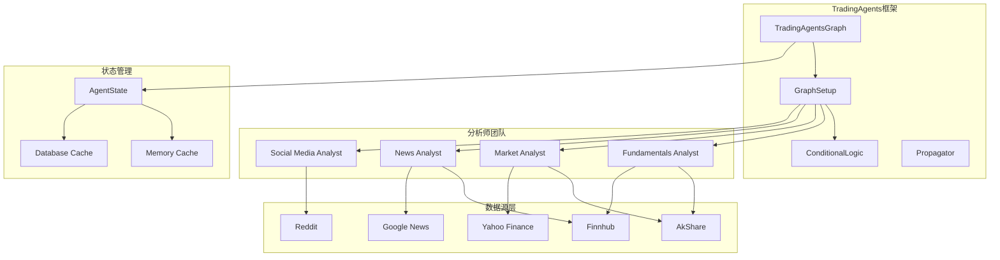
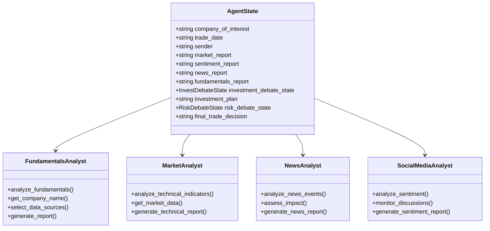
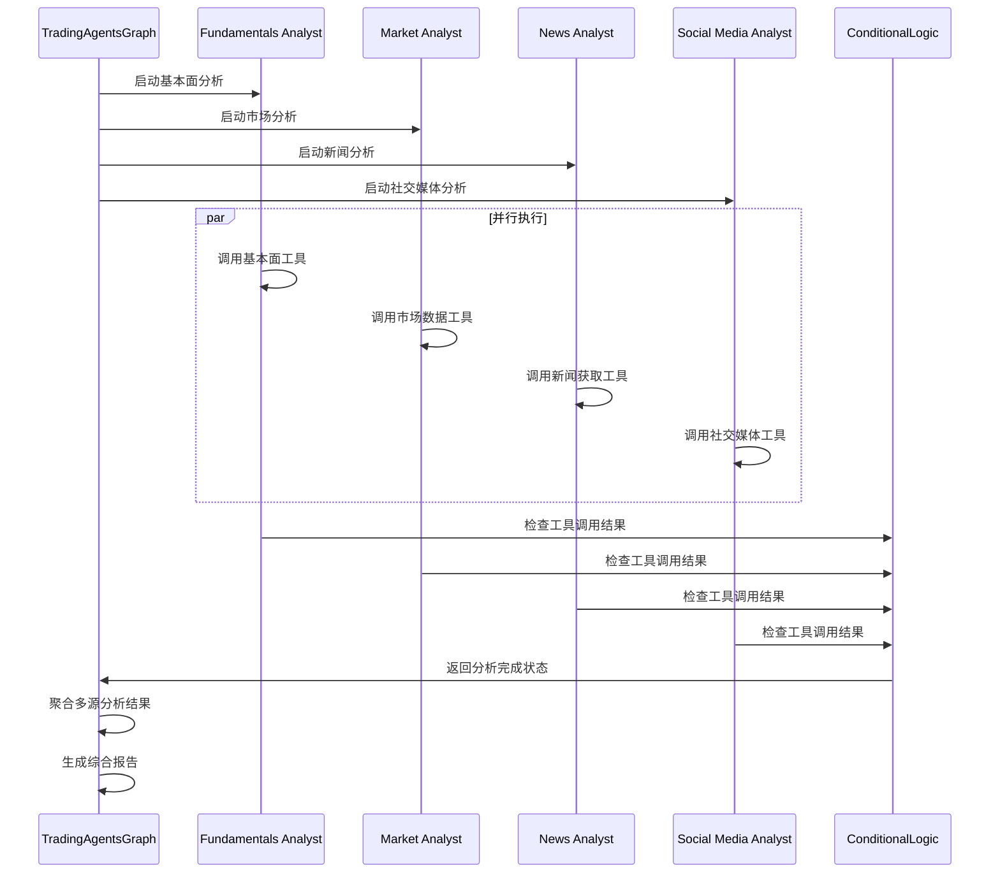
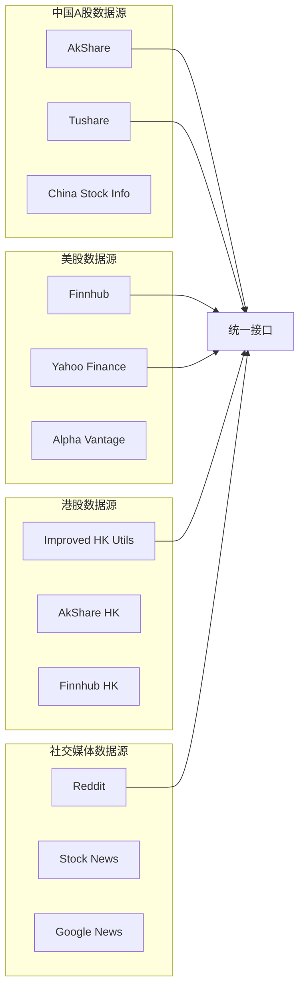
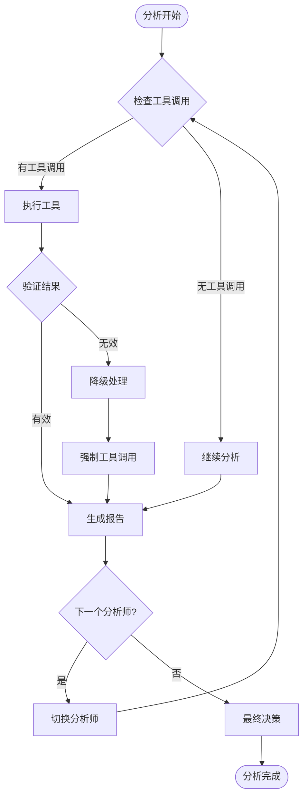
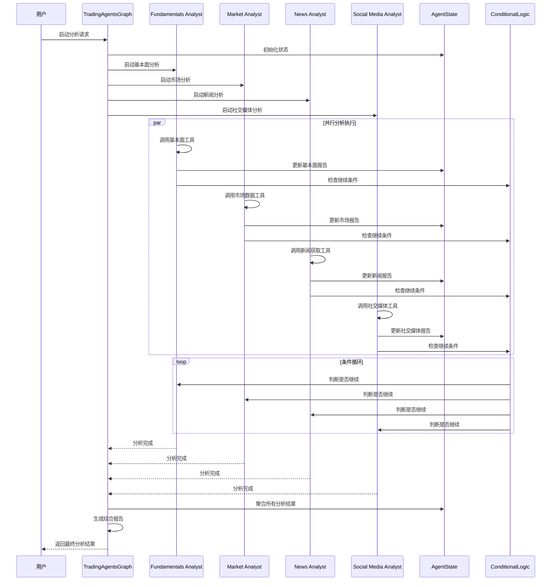
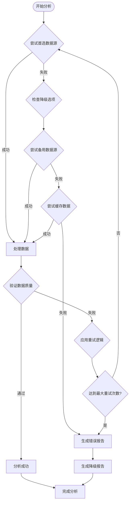

# 分析师团队协作

<cite>
**本文档引用的文件**
- [trading_graph.py](file://tradingagents/graph/trading_graph.py)
- [agent_states.py](file://tradingagents/agents/utils/agent_states.py)
- [conditional_logic.py](file://tradingagents/graph/conditional_logic.py)
- [setup.py](file://tradingagents/graph/setup.py)
- [fundamentals_analyst.py](file://tradingagents/agents/analysts/fundamentals_analyst.py)
- [market_analyst.py](file://tradingagents/agents/analysts/market_analyst.py)
- [news_analyst.py](file://tradingagents/agents/analysts/news_analyst.py)
- [social_media_analyst.py](file://tradingagents/agents/analysts/social_media_analyst.py)
- [akshare_utils.py](file://tradingagents/dataflows/akshare_utils.py)
- [finnhub_utils.py](file://tradingagents/dataflows/finnhub_utils.py)
- [db_cache_manager.py](file://tradingagents/dataflows/db_cache_manager.py)
</cite>

## 目录
1. [概述](#概述)
2. [系统架构](#系统架构)
3. [分析师团队组成](#分析师团队组成)
4. [并行协作机制](#并行协作机制)
5. [数据源集成](#数据源集成)
6. [条件逻辑控制](#条件逻辑控制)
7. [消息流转过程](#消息流转过程)
8. [错误处理与重试机制](#错误处理与重试机制)
9. [性能优化策略](#性能优化策略)
10. [总结](#总结)

## 概述

TradingAgents-CN采用基于LangGraph的并行协作架构，构建了一个高效的分析师团队系统。该系统通过四个核心分析师——基本面分析师、市场分析师、新闻分析师和社交媒体分析师——从不同维度对目标股票进行全面分析，最终形成综合性的投资决策支持。

系统的核心优势在于其并行处理能力和智能数据源管理。每个分析师独立运行，同时通过AgentState共享状态信息，确保分析结果的一致性和完整性。这种设计不仅提高了分析效率，还增强了系统的容错能力和扩展性。

## 系统架构

### 整体架构设计

**架构图来源**
- [trading_graph.py](file://tradingagents/graph/trading_graph.py#L1-L50)
- [setup.py](file://tradingagents/graph/setup.py#L1-L50)

### 核心组件说明

系统采用分层架构设计，主要包括以下几个层次：

1. **控制层**：TradingAgentsGraph负责整体流程控制和状态管理
2. **执行层**：各个分析师节点独立执行特定类型的分析任务
3. **数据层**：多种数据源提供全面的市场信息
4. **存储层**：多级缓存机制确保数据访问效率

**章节来源**
- [trading_graph.py](file://tradingagents/graph/trading_graph.py#L30-L100)
- [setup.py](file://tradingagents/graph/setup.py#L20-L80)

## 分析师团队组成

### 四大分析师角色

系统包含四个专门化的分析师团队，每个都专注于不同的分析维度：

#### 1. 基本面分析师（Fundamentals Analyst）
- **职责范围**：财务报表分析、盈利能力评估、估值计算
- **数据来源**：Finnhub、SimFin、AkShare
- **分析重点**：收入增长、利润率、资产负债结构、现金流状况

#### 2. 市场分析师（Market Analyst）
- **职责范围**：技术指标分析、价格趋势预测、交易量分析
- **数据来源**：AkShare、Yahoo Finance、Finnhub
- **分析重点**：移动平均线、MACD、RSI、布林带等技术指标

#### 3. 新闻分析师（News Analyst）
- **职责范围**：新闻事件分析、市场情绪评估、政策影响分析
- **数据来源**：Finnhub、Google News、Alpha Vantage
- **分析重点**：新闻时效性、事件影响程度、投资者情绪

#### 4. 社交媒体分析师（Social Media Analyst）
- **职责范围**：社交媒体情绪分析、投资者讨论监控、舆论影响评估
- **数据来源**：Reddit、OpenAI新闻API
- **分析重点**：散户情绪、KOL影响力、舆论热点

**类图来源**
- [agent_states.py](file://tradingagents/agents/utils/agent_states.py#L40-L80)
- [fundamentals_analyst.py](file://tradingagents/agents/analysts/fundamentals_analyst.py#L1-L50)

**章节来源**
- [fundamentals_analyst.py](file://tradingagents/agents/analysts/fundamentals_analyst.py#L1-L100)
- [market_analyst.py](file://tradingagents/agents/analysts/market_analyst.py#L1-L100)
- [news_analyst.py](file://tradingagents/agents/analysts/news_analyst.py#L1-L100)
- [social_media_analyst.py](file://tradingagents/agents/analysts/social_media_analyst.py#L1-L100)

## 并行协作机制

### LangGraph并行执行架构

系统基于LangGraph实现分析师的并行协作，通过状态共享和条件控制实现高效的任务分配和结果整合。

**序列图来源**
- [trading_graph.py](file://tradingagents/graph/trading_graph.py#L280-L320)
- [conditional_logic.py](file://tradingagents/graph/conditional_logic.py#L15-L50)

### AgentState状态管理

AgentState作为核心状态容器，维护所有分析师的中间结果和最终输出：

| 字段名称 | 类型 | 描述 | 默认值 |
|---------|------|------|--------|
| company_of_interest | string | 目标股票代码 | - |
| trade_date | string | 分析日期 | - |
| market_report | string | 市场分析报告 | "" |
| sentiment_report | string | 社交媒体报告 | "" |
| news_report | string | 新闻分析报告 | "" |
| fundamentals_report | string | 基本面分析报告 | "" |
| investment_debate_state | InvestDebateState | 投资辩论状态 | {} |
| risk_debate_state | RiskDebateState | 风险辩论状态 | {} |
| final_trade_decision | string | 最终交易决策 | "" |

**章节来源**
- [agent_states.py](file://tradingagents/agents/utils/agent_states.py#L40-L80)

## 数据源集成

### 多源数据获取架构

系统集成了多个数据源，确保信息的全面性和可靠性：

**图表来源**
- [akshare_utils.py](file://tradingagents/dataflows/akshare_utils.py#L1-L50)
- [finnhub_utils.py](file://tradingagents/dataflows/finnhub_utils.py#L1-L30)

### 数据源优先级策略

系统采用智能数据源选择机制，根据可用性和质量自动选择最优数据源：

1. **在线工具优先**：优先使用实时数据源
2. **离线工具备选**：在在线工具不可用时使用缓存数据
3. **降级机制**：当首选数据源失败时自动切换到备用源
4. **质量控制**：基于数据完整性和准确性评估选择最佳源

**章节来源**
- [akshare_utils.py](file://tradingagents/dataflows/akshare_utils.py#L50-L150)
- [finnhub_utils.py](file://tradingagents/dataflows/finnhub_utils.py#L1-L57)

## 条件逻辑控制

### 动态路由机制

ConditionalLogic类实现了复杂的条件控制逻辑，确保分析流程的灵活性和智能性：

**流程图来源**
- [conditional_logic.py](file://tradingagents/graph/conditional_logic.py#L15-L80)

### 条件判断规则

系统根据不同分析师的特点实现了专门的条件判断逻辑：

| 分析师类型 | 判断条件 | 返回路径 | 说明 |
|-----------|----------|----------|------|
| 市场分析师 | 是否有工具调用 | tools_market / Msg Clear Market | 控制技术分析流程 |
| 新闻分析师 | 是否有工具调用 | tools_news / Msg Clear News | 管理新闻获取流程 |
| 社交媒体分析师 | 是否有工具调用 | tools_social / Msg Clear Social | 监控社交媒体分析 |
| 基本面分析师 | 是否有工具调用 | tools_fundamentals / Msg Clear Fundamentals | 确保基本面数据获取 |

**章节来源**
- [conditional_logic.py](file://tradingagents/graph/conditional_logic.py#L15-L79)

## 消息流转过程

### 时序图展示

以下是分析师团队协作的完整时序流程：

**时序图来源**
- [trading_graph.py](file://tradingagents/graph/trading_graph.py#L320-L400)
- [setup.py](file://tradingagents/graph/setup.py#L160-L250)

### 消息传递机制

系统通过标准化的消息格式确保分析师之间的有效通信：

1. **工具调用消息**：包含工具名称和参数
2. **分析结果消息**：包含分析报告和结论
3. **状态更新消息**：反映分析进度和状态变化
4. **错误处理消息**：记录和传播异常信息

**章节来源**
- [trading_graph.py](file://tradingagents/graph/trading_graph.py#L320-L440)

## 错误处理与重试机制

### 多层错误处理架构

系统实现了完善的错误处理和重试机制，确保分析过程的稳定性和可靠性：

**流程图来源**
- [db_cache_manager.py](file://tradingagents/dataflows/db_cache_manager.py#L1-L100)

### 降级策略

系统采用多层次的降级策略，确保即使在部分数据源失效的情况下仍能提供有价值的分析：

1. **数据源降级**：从首选数据源切换到备用数据源
2. **功能降级**：在某些功能不可用时提供基础分析
3. **质量降级**：使用较低质量但可用的数据源
4. **服务降级**：提供有限但可靠的服务能力

**章节来源**
- [db_cache_manager.py](file://tradingagents/dataflows/db_cache_manager.py#L100-L200)

## 性能优化策略

### 缓存机制

系统实现了多级缓存机制，显著提升数据访问速度和系统响应性能：

| 缓存层级 | 存储介质 | 生命周期 | 适用场景 |
|---------|----------|----------|----------|
| 内存缓存 | Python字典 | 会话期间 | 频繁访问的小数据 |
| Redis缓存 | 内存数据库 | 可配置 | 中等大小数据 |
| MongoDB缓存 | 磁盘数据库 | 长期存储 | 大量历史数据 |
| 文件缓存 | 本地文件系统 | 永久存储 | 备份和归档数据 |

### 并行优化

1. **异步执行**：分析师节点并行执行，减少总体分析时间
2. **批量处理**：对相似操作进行批量处理，提高效率
3. **资源池化**：复用LLM连接和数据源连接
4. **智能调度**：根据系统负载动态调整资源分配

### 数据预处理

系统在数据获取阶段就进行预处理，减少后续分析的计算负担：

- **数据清洗**：去除无效和异常数据
- **格式标准化**：统一不同数据源的数据格式
- **特征提取**：提前计算常用技术指标
- **质量评估**：评估数据质量和完整性

**章节来源**
- [db_cache_manager.py](file://tradingagents/dataflows/db_cache_manager.py#L200-L300)

## 总结

TradingAgents-CN的分析师团队协作机制展现了现代AI系统设计的最佳实践。通过LangGraph的并行执行架构、智能数据源管理和完善的错误处理机制，系统实现了高效、可靠、可扩展的股票分析能力。

### 核心优势

1. **并行处理能力**：四大分析师并行工作，显著提升分析效率
2. **智能数据管理**：多源数据融合和自动降级机制确保数据可靠性
3. **灵活的条件控制**：基于状态的动态路由机制适应复杂业务需求
4. **完善的错误处理**：多层次的降级策略保证系统稳定性
5. **性能优化**：多级缓存和并行优化确保系统响应速度

### 应用价值

该系统为投资决策提供了全面、客观、及时的分析支持，帮助投资者更好地理解市场动态、评估投资机会和管理风险。通过自动化和智能化的分析流程，大大提升了投资分析的专业性和效率。

未来，系统还可以进一步扩展分析师类型、增加新的数据源、优化算法模型，以及增强用户交互界面，为用户提供更加丰富和个性化的投资分析服务。