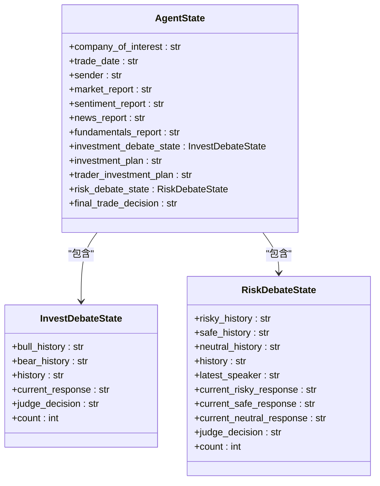
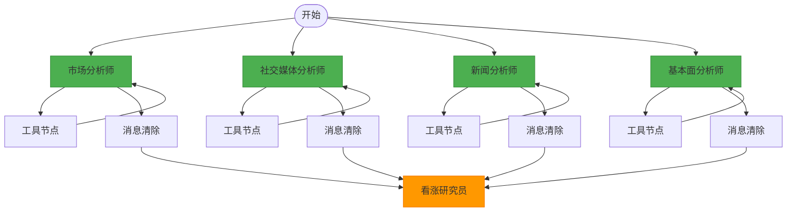
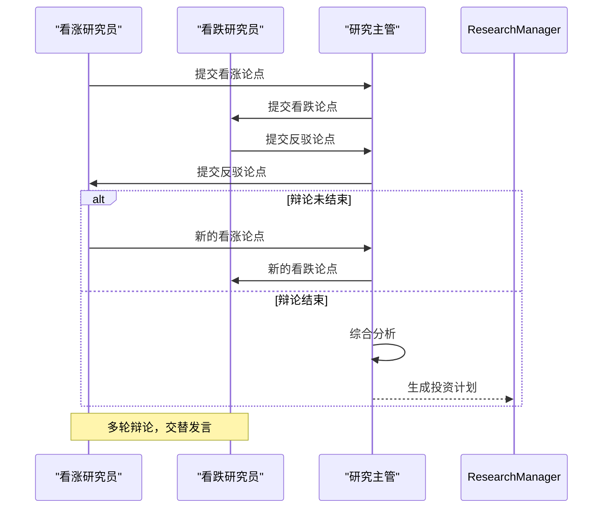
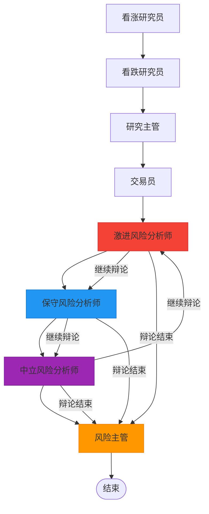
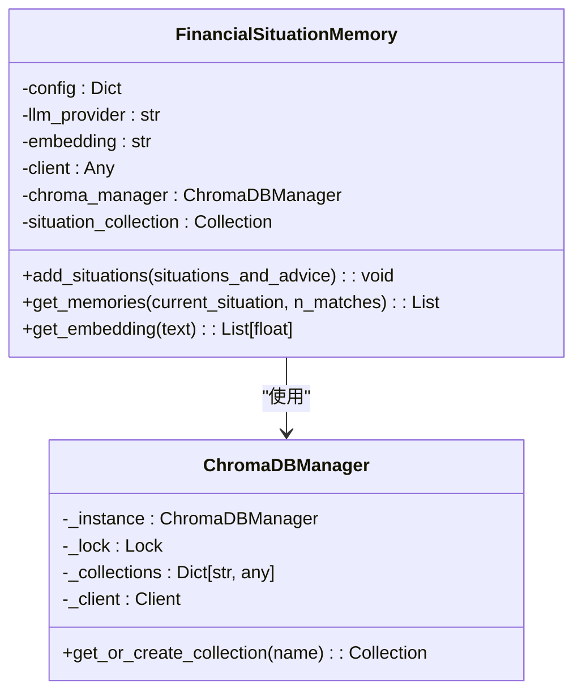
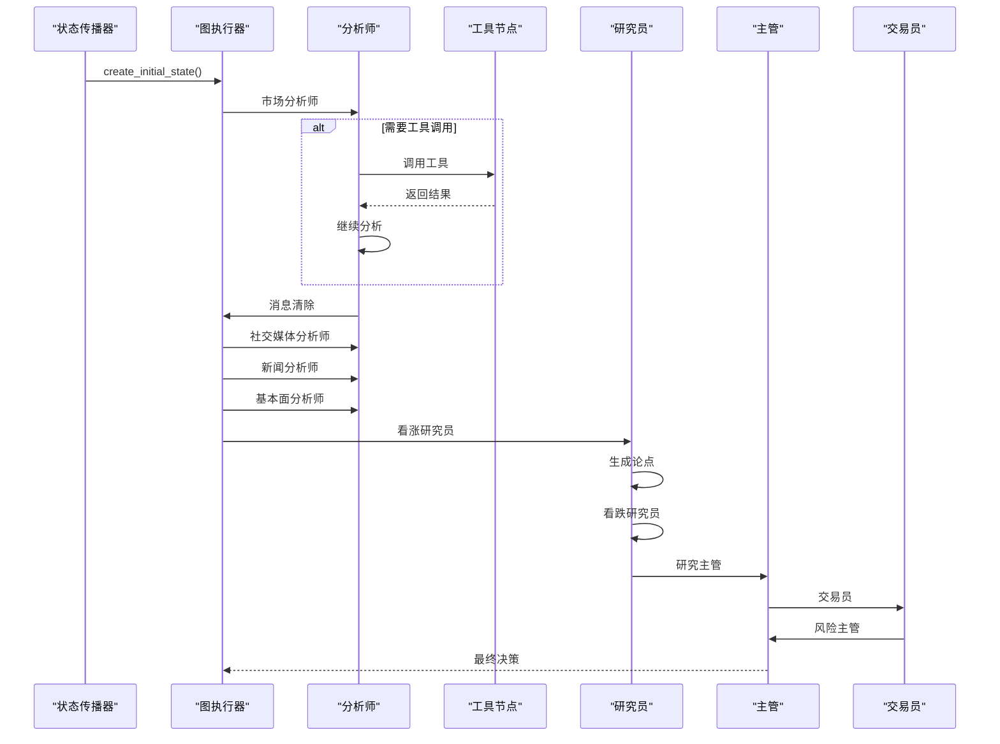
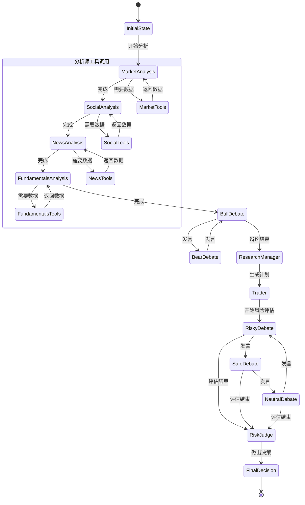

# 多智能体架构

<cite>
**本文档引用的文件**   
- [setup.py](file://tradingagents/graph/setup.py)
- [trading_graph.py](file://tradingagents/graph/trading_graph.py)
- [agent_states.py](file://tradingagents/agents/utils/agent_states.py)
- [memory.py](file://tradingagents/agents/utils/memory.py)
- [conditional_logic.py](file://tradingagents/graph/conditional_logic.py)
- [research_manager.py](file://tradingagents/agents/managers/research_manager.py)
- [risk_manager.py](file://tradingagents/agents/managers/risk_manager.py)
- [bull_researcher.py](file://tradingagents/agents/researchers/bull_researcher.py)
- [bear_researcher.py](file://tradingagents/agents/researchers/bear_researcher.py)
- [conservative_debator.py](file://tradingagents/agents/risk_mgmt/conservative_debator.py)
- [neutral_debator.py](file://tradingagents/agents/risk_mgmt/neutral_debator.py)
- [trader.py](file://tradingagents/agents/trader/trader.py)
- [propagation.py](file://tradingagents/graph/propagation.py)
</cite>

## 目录
1. [项目结构](#项目结构)
2. [核心组件](#核心组件)
3. [智能体状态与数据流](#智能体状态与数据流)
4. [并行分析阶段](#并行分析阶段)
5. [投资辩论阶段](#投资辩论阶段)
6. [风险评估阶段](#风险评估阶段)
7. [记忆机制](#记忆机制)
8. [工具调用与条件逻辑](#工具调用与条件逻辑)
9. [智能体协作时序图](#智能体协作时序图)
10. [状态流转图](#状态流转图)

## 项目结构

TradingAgents-CN项目采用模块化设计，其核心多智能体协作架构位于`tradingagents`目录下。该架构基于LangGraph构建，实现了复杂的智能体团队协作流程。项目主要分为以下几个关键模块：

- `agents`：包含所有智能体的实现，包括分析师、研究员、风险分析师和交易员。
- `graph`：包含图结构的定义、条件逻辑和状态传播机制。
- `agents/utils`：包含智能体状态定义和记忆机制。
- `dataflows`：负责数据获取和缓存管理。

这种分层架构确保了智能体逻辑、状态管理和数据流的清晰分离，便于维护和扩展。

**Section sources**
- [setup.py](file://tradingagents/graph/setup.py#L1-L254)
- [trading_graph.py](file://tradingagents/graph/trading_graph.py#L1-L441)

## 核心组件

系统的核心是一个由LangGraph驱动的有向无环图（DAG），该图定义了多个智能体之间的协作流程。整个流程分为三个主要阶段：并行分析、投资辩论和风险评估。

第一阶段是并行分析，由市场分析师、基本面分析师、新闻分析师和社交媒体分析师组成。这些智能体可以并行工作，各自生成初步报告。第二阶段是投资辩论，由看涨研究员和看跌研究员进行多轮辩论，最终由研究主管整合观点形成投资计划。第三阶段是风险评估，由激进、保守和中立风险分析师进行三重辩论，最终由风险主管做出最终决策。

**Section sources**
- [setup.py](file://tradingagents/graph/setup.py#L1-L254)
- [trading_graph.py](file://tradingagents/graph/trading_graph.py#L1-L441)

## 智能体状态与数据流

智能体之间的协作通过共享的`AgentState`对象实现。该状态对象定义了所有智能体可以访问和修改的共享数据结构。`AgentState`继承自`MessagesState`，并扩展了多个特定于交易分析的字段。

状态对象包含以下关键数据：
- `company_of_interest`：当前分析的公司
- `trade_date`：交易日期
- `market_report`：市场分析师的报告
- `sentiment_report`：社交媒体分析师的报告
- `news_report`：新闻分析师的报告
- `fundamentals_report`：基本面分析师的报告
- `investment_debate_state`：投资辩论的状态
- `risk_debate_state`：风险评估的状态
- `investment_plan`：投资计划
- `final_trade_decision`：最终交易决策

这种集中式状态管理确保了所有智能体都能访问最新的分析结果，实现了高效的信息共享。

**Diagram sources**
- [agent_states.py](file://tradingagents/agents/utils/agent_states.py#L1-L81)

## 并行分析阶段

并行分析阶段是整个流程的起点，由四种不同类型的分析师智能体并行工作。这些智能体分别是市场分析师、基本面分析师、新闻分析师和社交媒体分析师。它们可以独立地从各自的数据源收集信息，并生成初步分析报告。

在`GraphSetup`类的`setup_graph`方法中，通过`selected_analysts`参数来选择要包含的分析师类型。每个分析师节点都与一个工具节点（`ToolNode`）和一个消息清除节点（`Msg Clear`）相连。当分析师需要调用外部工具时，流程会跳转到相应的`ToolNode`，执行完工具调用后返回到分析师节点。

这一阶段的输出是四个关键报告：市场报告、情绪报告、新闻报告和基本面报告。这些报告将作为下一阶段投资辩论的输入。

**Diagram sources**
- [setup.py](file://tradingagents/graph/setup.py#L1-L254)
- [conditional_logic.py](file://tradingagents/graph/conditional_logic.py#L1-L80)

## 投资辩论阶段

投资辩论阶段由看涨研究员和看跌研究员之间的多轮辩论构成。这一阶段的目的是通过对立观点的碰撞，产生更全面和深入的分析。辩论流程由`should_continue_debate`条件函数控制，该函数根据辩论轮数和当前发言者来决定下一步的流程。

辩论开始时，流程从最后一个分析师的消息清除节点跳转到看涨研究员。看涨研究员会基于所有初步报告生成一个看涨论点。然后，`should_continue_debate`函数检查辩论轮数是否达到最大限制（默认为1轮）。如果未达到，则根据当前发言者决定下一个发言者。如果当前是看涨研究员发言，则下一个发言者是看跌研究员，反之亦然。

当辩论轮数达到最大限制后，流程跳转到研究主管节点。研究主管会综合双方的论点，结合历史记忆，生成最终的投资计划。这个计划不仅包含买入/卖出/持有的建议，还包括详细的理由、战略行动和目标价格分析。

**Diagram sources**
- [bull_researcher.py](file://tradingagents/agents/researchers/bull_researcher.py#L1-L99)
- [bear_researcher.py](file://tradingagents/agents/researchers/bear_researcher.py#L1-L90)
- [research_manager.py](file://tradingagents/agents/managers/research_manager.py#L1-L86)

## 风险评估阶段

风险评估阶段是决策流程的最后一步，由激进、保守和中立三位风险分析师进行三重辩论。这一阶段的目的是从不同风险偏好的角度评估投资决策，确保最终决策能够平衡风险与收益。

与投资辩论阶段类似，风险评估阶段也由条件函数`should_continue_risk_analysis`控制。该函数根据风险辩论的轮数和最后发言者来决定下一个发言者。三位风险分析师会围绕交易员的投资计划展开辩论，激进分析师会强调增长潜力和机会，保守分析师会强调风险和稳定性，而中立分析师则会提供平衡的观点。

当辩论轮数达到最大限制（默认为1轮）后，流程跳转到风险主管节点。风险主管会综合三位分析师的观点，生成最终的交易决策。这个决策是整个流程的最终输出，将被用于实际的交易操作。

**Diagram sources**
- [conservative_debator.py](file://tradingagents/agents/risk_mgmt/conservative_debator.py#L1-L63)
- [neutral_debator.py](file://tradingagents/agents/risk_mgmt/neutral_debator.py#L1-L60)
- [risk_manager.py](file://tradingagents/agents/managers/risk_manager.py#L1-L127)

## 记忆机制

系统实现了基于ChromaDB的向量记忆机制，通过`FinancialSituationMemory`类实现。该机制允许智能体从过去的经验中学习，避免重复过去的错误。记忆系统为每个智能体（看涨研究员、看跌研究员、交易员、研究主管和风险主管）维护一个独立的记忆库。

`FinancialSituationMemory`类使用单例模式的`ChromaDBManager`来管理数据库连接，避免并发创建集合的冲突。它支持多种嵌入模型，包括阿里百炼的`text-embedding-v3`、OpenAI的`text-embedding-3-small`等。系统会根据配置的LLM提供商自动选择合适的嵌入模型。

当智能体需要检索记忆时，系统会将当前情况的文本转换为向量，然后在记忆库中查找最相似的历史情况。这种基于语义相似度的检索机制使得智能体能够有效地从过去的经验中学习，提高决策质量。

**Diagram sources**
- [memory.py](file://tradingagents/agents/utils/memory.py#L1-L713)

## 工具调用与条件逻辑

智能体的工具调用和流程控制由`ToolNode`和条件逻辑函数共同实现。每个分析师节点都与一个`ToolNode`相连，当智能体需要调用外部工具时，流程会跳转到相应的`ToolNode`。

条件逻辑由`ConditionalLogic`类实现，该类包含多个条件函数，如`should_continue_market`、`should_continue_social`等。这些函数检查智能体的最后一条消息是否包含工具调用，如果有，则返回对应的工具节点名称，否则返回消息清除节点名称。

这种设计实现了灵活的流程控制，使得智能体可以根据需要动态调用工具，同时保持流程的清晰和可预测性。例如，市场分析师可以调用`get_YFin_data_online`工具获取实时市场数据，而新闻分析师可以调用`get_google_news`工具获取最新新闻。

**Section sources**
- [setup.py](file://tradingagents/graph/setup.py#L1-L254)
- [conditional_logic.py](file://tradingagents/graph/conditional_logic.py#L1-L80)

## 智能体协作时序图

以下时序图展示了智能体协作的完整流程，从初始状态创建到最终决策生成。

**Diagram sources**
- [propagation.py](file://tradingagents/graph/propagation.py#L1-L54)
- [trading_graph.py](file://tradingagents/graph/trading_graph.py#L1-L441)

## 状态流转图

以下状态流转图展示了智能体状态在整个流程中的变化。

**Diagram sources**
- [agent_states.py](file://tradingagents/agents/utils/agent_states.py#L1-L81)
- [setup.py](file://tradingagents/graph/setup.py#L1-L254)