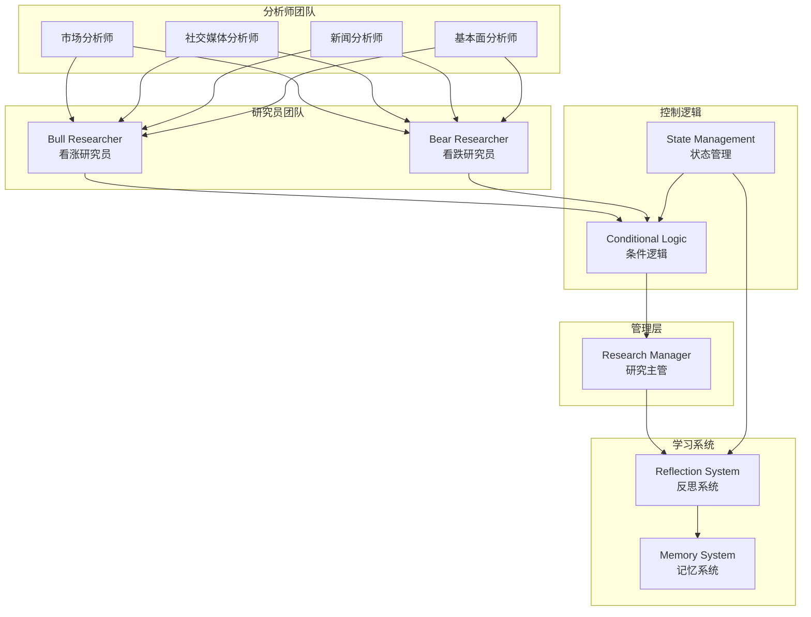
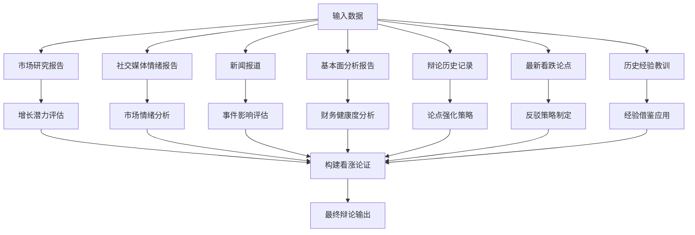
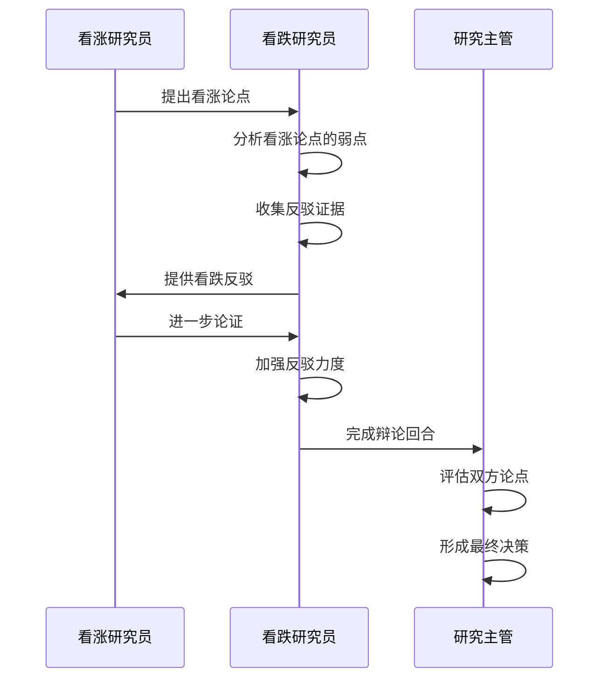
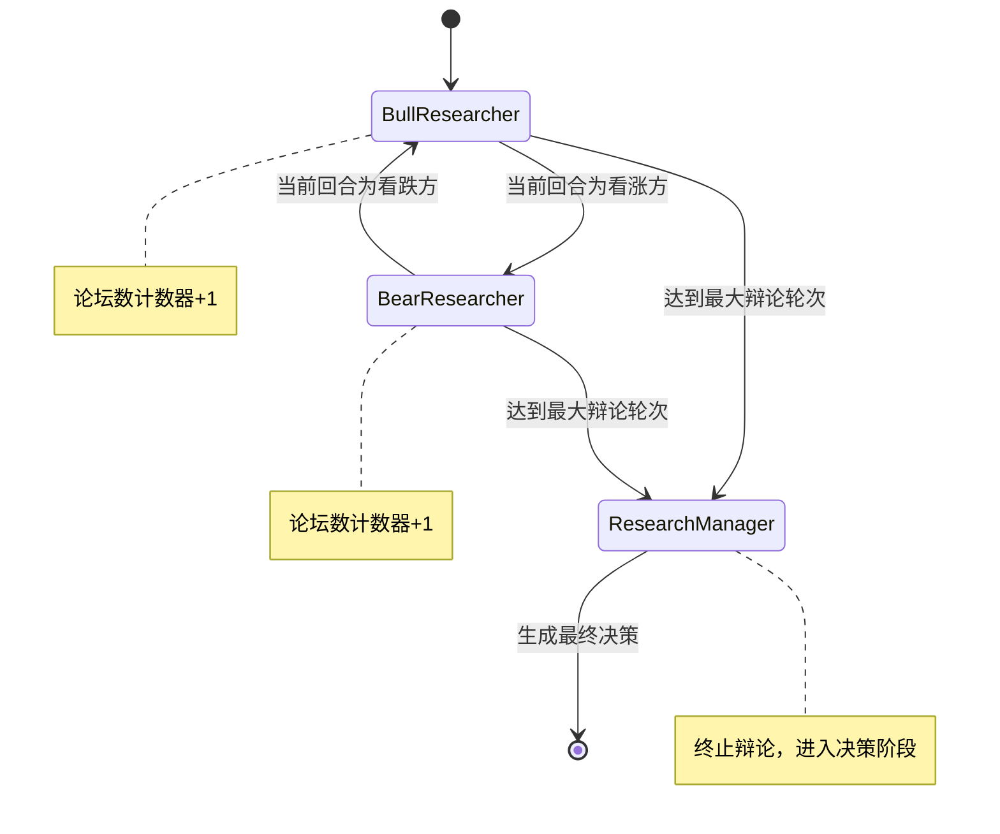
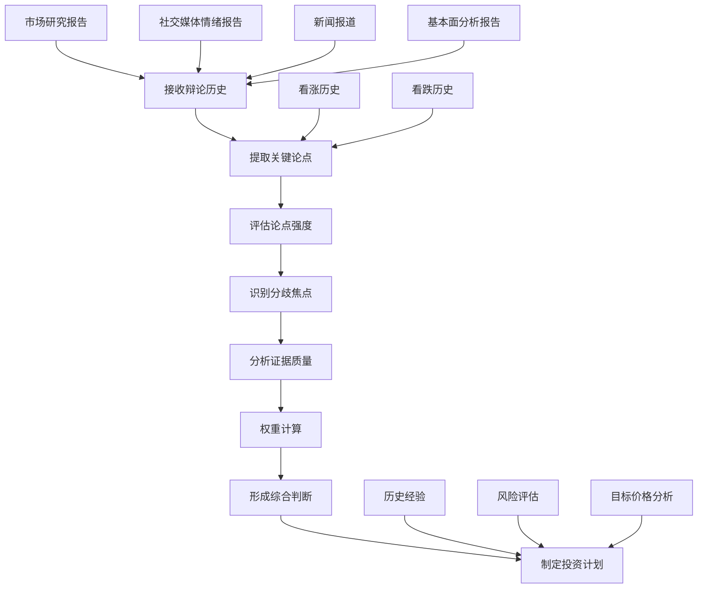
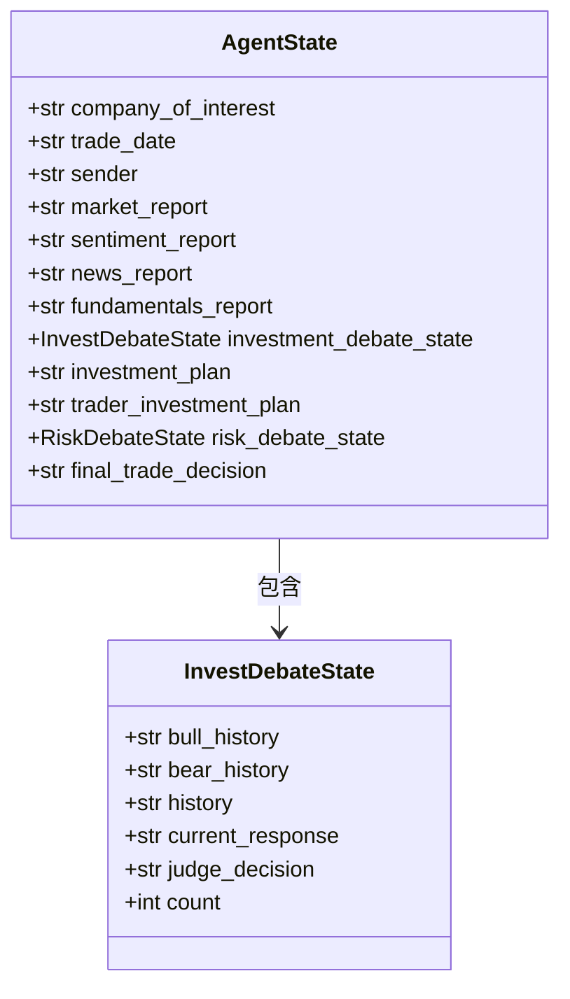
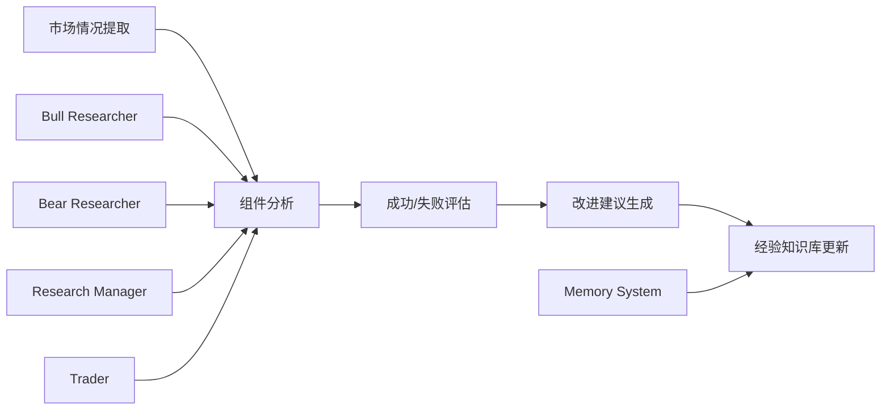
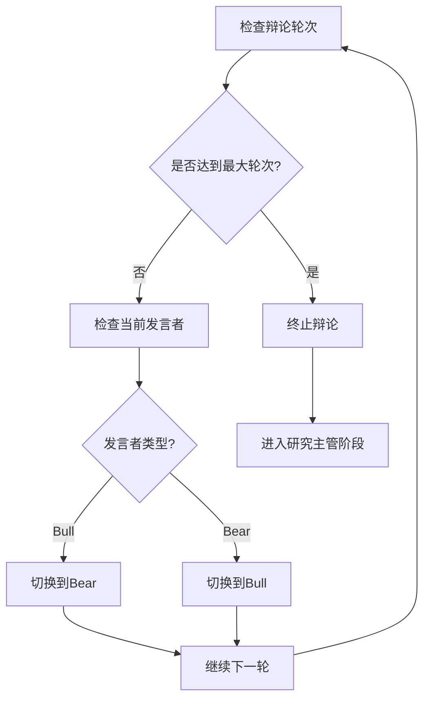

# 研究员辩论机制

<cite>
**本文档中引用的文件**
- [bull_researcher.py](file://tradingagents/agents/researchers/bull_researcher.py)
- [bear_researcher.py](file://tradingagents/agents/researchers/bear_researcher.py)
- [research_manager.py](file://tradingagents/agents/managers/research_manager.py)
- [conditional_logic.py](file://tradingagents/graph/conditional_logic.py)
- [agent_states.py](file://tradingagents/agents/utils/agent_states.py)
- [setup.py](file://tradingagents/graph/setup.py)
- [reflection.py](file://tradingagents/graph/reflection.py)
</cite>

## 目录
1. [引言](#引言)
2. [辩论架构概览](#辩论架构概览)
3. [看涨研究员机制](#看涨研究员机制)
4. [看跌研究员机制](#看跌研究员机制)
5. [辩论流程控制](#辩论流程控制)
6. [研究主管整合逻辑](#研究主管整合逻辑)
7. [状态管理系统](#状态管理系统)
8. [学习与反思机制](#学习与反思机制)
9. [辩论终止条件](#辩论终止条件)
10. [性能优化策略](#性能优化策略)
11. [故障排除指南](#故障排除指南)
12. [总结](#总结)

## 引言

研究员辩论机制是TradingAgents系统中的核心智能体协作框架，通过看涨研究员（Bull Researcher）和看跌研究员（Bear Researcher）之间的动态辩论，为投资决策提供多角度的深度分析。该机制采用对抗式推理模式，确保投资建议的全面性和可靠性。

系统设计遵循以下核心原则：
- **对抗性推理**：通过正反两方的辩论揭示潜在风险和机会
- **证据驱动**：基于市场研究、基本面分析、新闻报道和情绪分析
- **迭代优化**：通过多轮辩论逐步完善论点强度
- **学习进化**：基于历史经验和市场反馈持续改进

## 辩论架构概览

研究员辩论机制采用分层架构设计，包含多个专业角色和协调组件：

**图表来源**
- [setup.py](file://tradingagents/graph/setup.py#L1-L254)
- [conditional_logic.py](file://tradingagents/graph/conditional_logic.py#L1-L80)

**章节来源**
- [setup.py](file://tradingagents/graph/setup.py#L1-L254)
- [agent_states.py](file://tradingagents/agents/utils/agent_states.py#L1-L81)

## 看涨研究员机制

看涨研究员负责构建支持投资的强有力论证，其工作机制体现了积极的投资视角和成长导向的分析方法。

### 核心功能特性

看涨研究员具备以下关键能力：

1. **增长潜力分析**：重点评估公司的市场机会、收入预测和业务可扩展性
2. **竞争优势识别**：强调独特的技术优势、品牌价值和市场领导地位
3. **积极指标验证**：基于财务健康度、行业发展趋势和正面新闻证据
4. **看跌观点反驳**：通过具体数据和逻辑推理批判性分析对立观点
5. **动态辩论参与**：以对话形式直接回应看跌分析师的观点

### 提示工程设计

看涨研究员的提示模板经过精心设计，包含以下要素：

**图表来源**
- [bull_researcher.py](file://tradingagents/agents/researchers/bull_researcher.py#L40-L80)

### 推理链构建方法

看涨研究员采用结构化推理链，确保论证的逻辑严密性：

1. **证据收集阶段**：整合多源数据，识别关键积极因素
2. **论点构建阶段**：基于证据构建连贯的论证链条
3. **反驳准备阶段**：预判看跌观点，准备针对性反驳
4. **对话优化阶段**：调整表达方式，增强说服力

**章节来源**
- [bull_researcher.py](file://tradingagents/agents/researchers/bull_researcher.py#L1-L99)

## 看跌研究员机制

看跌研究员承担着识别投资风险和挑战的重要职责，其分析视角专注于潜在的负面因素和不确定性。

### 核心职责与方法

看跌研究员的主要任务包括：

1. **风险识别**：突出市场饱和、财务不稳定性等阻碍股票表现的因素
2. **竞争劣势分析**：强调市场地位薄弱、创新能力下降等脆弱性
3. **负面指标验证**：基于财务数据、市场趋势和不利新闻证据
4. **看涨观点批判**：通过具体数据揭露积极论点的弱点或过度乐观假设
5. **辩论策略执行**：以对话形式有效反驳看涨论点

### 对抗式推理模式

看跌研究员采用对抗式推理模式，与看涨研究员形成有效的制衡：

**图表来源**
- [bear_researcher.py](file://tradingagents/agents/researchers/bear_researcher.py#L40-L80)
- [research_manager.py](file://tradingagents/agents/managers/research_manager.py#L15-L85)

### 结论提炼方法

看跌研究员通过系统化的结论提炼过程，确保反驳的有效性：

1. **论点拆解**：分解看涨论点的关键假设和前提
2. **证据验证**：寻找支持看跌观点的实证证据
3. **逻辑批判**：识别看涨论证中的逻辑漏洞
4. **风险量化**：评估潜在风险的概率和影响程度

**章节来源**
- [bear_researcher.py](file://tradingagents/agents/researchers/bear_researcher.py#L1-L90)

## 辩论流程控制

辩论流程控制由条件逻辑模块负责，通过智能的状态判断确保辩论的有序进行和高效收敛。

### 流程控制机制

条件逻辑模块实现了精密的流程控制算法：

**图表来源**
- [conditional_logic.py](file://tradingagents/graph/conditional_logic.py#L50-L79)

### 轮次控制策略

辩论轮次控制采用动态平衡策略：

1. **基础轮次设置**：默认最大辩论轮次为1轮（2轮对话）
2. **轮次递增机制**：根据复杂度需求可扩展至多轮辩论
3. **智能终止判断**：当双方论点趋于稳定时提前终止
4. **公平性保证**：确保双方发言机会均等

**章节来源**
- [conditional_logic.py](file://tradingagents/graph/conditional_logic.py#L1-L80)

## 研究主管整合逻辑

研究主管负责整合双方论据，识别关键分歧点，并形成初步投资计划，是辩论流程的最终决策者。

### 整合分析流程

研究主管采用系统化的整合分析方法：

**图表来源**
- [research_manager.py](file://tradingagents/agents/managers/research_manager.py#L15-L85)

### 关键分歧点识别

研究主管通过以下维度识别关键分歧：

1. **基本面分歧**：财务指标、盈利能力、增长前景
2. **技术面分歧**：价格走势、支撑阻力位、技术指标
3. **市场环境分歧**：宏观经济影响、行业趋势、竞争格局
4. **风险偏好分歧**：风险承受能力、收益预期、时间周期

### 投资计划制定

研究主管基于辩论结果制定详细的投资计划：

| 计划要素 | 描述 | 输出格式 |
|---------|------|----------|
| 投资建议 | 明确的买入、卖出或持有建议 | 简洁的决策声明 |
| 理由分析 | 基于最强论点的解释 | 结构化的原因说明 |
| 战略行动 | 具体的执行步骤 | 可操作的行动计划 |
| 目标价格 | 基于综合分析的价格区间 | 具体的价格目标和时间范围 |

**章节来源**
- [research_manager.py](file://tradingagents/agents/managers/research_manager.py#L1-L86)

## 状态管理系统

状态管理系统维护辩论过程中的所有相关信息，确保各组件间的数据一致性。

### 投资辩论状态结构

投资辩论状态采用TypedDict定义，包含以下核心字段：

**图表来源**
- [agent_states.py](file://tradingagents/agents/utils/agent_states.py#L15-L81)

### 状态更新机制

状态更新遵循严格的序列化规则：

1. **历史记录维护**：保存完整的辩论对话历史
2. **轮次计数管理**：跟踪辩论进程
3. **响应状态同步**：确保最新论点及时传播
4. **决策状态固化**：在适当阶段固定最终决策

**章节来源**
- [agent_states.py](file://tradingagents/agents/utils/agent_states.py#L1-L81)

## 学习与反思机制

系统内置了完善的反思机制，通过历史数据分析和经验积累实现持续改进。

### 反思系统架构

反思系统采用模块化设计，针对不同角色提供专门的反思能力：

**图表来源**
- [reflection.py](file://tradingagents/graph/reflection.py#L15-L125)

### 学习循环机制

反思系统实现了完整的闭环学习循环：

1. **结果监控**：跟踪实际投资回报与预期的差异
2. **原因分析**：深入分析决策成功或失败的根本原因
3. **经验总结**：提炼可复用的知识和最佳实践
4. **知识传承**：将学习成果存储到记忆系统中

### 内存管理策略

系统采用智能内存管理策略：

- **相似性匹配**：基于当前市场情况检索相关历史经验
- **优先级排序**：根据经验的相关性和有效性排序
- **容量控制**：动态管理记忆容量，避免信息过载
- **更新机制**：定期清理过时信息，补充新经验

**章节来源**
- [reflection.py](file://tradingagents/graph/reflection.py#L1-L126)

## 辩论终止条件

辩论终止条件的判断直接影响系统的效率和效果，系统采用多层次的终止策略。

### 终止条件判断逻辑

**图表来源**
- [conditional_logic.py](file://tradingagents/graph/conditional_logic.py#L50-L79)

### 智能终止策略

系统实现了多种智能终止策略：

1. **轮次限制**：防止无限辩论，确保决策时效性
2. **论点收敛**：当双方论点趋于一致时提前终止
3. **质量阈值**：当论点质量达到满意水平时停止
4. **资源优化**：根据计算资源动态调整终止条件

### 结果汇总机制

辩论结束后的结果汇总包括：

- **论点强度对比**：量化双方论证的有效性
- **关键分歧总结**：提炼最重要的争议点
- **共识发现**：识别双方达成一致的观点
- **决策倾向分析**：评估最终的决策倾向

**章节来源**
- [conditional_logic.py](file://tradingagents/graph/conditional_logic.py#L50-L79)

## 性能优化策略

为了确保辩论机制的高效运行，系统采用了多种性能优化策略。

### 并行处理优化

系统支持多个研究员并行工作：

- **独立推理**：看涨和看跌研究员可以同时进行分析
- **异步通信**：研究员间的交流采用异步模式
- **资源池管理**：共享计算资源，提高利用率

### 缓存机制

系统实现了多层缓存机制：

1. **记忆缓存**：缓存历史经验，减少重复计算
2. **分析缓存**：缓存常用的分析结果
3. **提示缓存**：缓存常用的提示模板

### 内存优化

内存使用优化策略包括：

- **增量更新**：只存储必要的状态信息
- **压缩存储**：对历史数据进行压缩存储
- **垃圾回收**：定期清理无用的历史记录

## 故障排除指南

### 常见问题诊断

| 问题类型 | 症状描述 | 可能原因 | 解决方案 |
|---------|----------|----------|----------|
| 辩论停滞 | 研究员无法继续发言 | 状态同步问题 | 检查状态更新逻辑 |
| 论点重复 | 研究员提出相同观点 | 内存失效 | 重置记忆系统 |
| 性能下降 | 响应时间过长 | 缓存失效 | 清理缓存数据 |
| 内存溢出 | 系统内存使用过高 | 历史记录过多 | 清理历史数据 |

### 调试工具

系统提供了丰富的调试工具：

- **状态监控**：实时查看各组件状态
- **日志分析**：详细的执行日志记录
- **性能追踪**：关键操作的性能指标
- **错误报告**：自动化的错误检测和报告

### 最佳实践

为确保系统稳定运行，建议遵循以下最佳实践：

1. **定期维护**：清理过期的历史数据
2. **监控告警**：设置关键指标的监控告警
3. **版本控制**：对配置和模型进行版本管理
4. **备份策略**：定期备份重要的记忆数据

## 总结

研究员辩论机制代表了TradingAgents系统中智能体协作的最高水平，通过看涨和看跌研究员的对抗性推理，实现了投资决策的全面性和可靠性。该机制的核心优势包括：

1. **多角度分析**：通过正反两方的辩论覆盖各种投资视角
2. **动态优化**：基于实时反馈不断改进论证质量
3. **学习进化**：通过反思机制实现持续的知识积累
4. **高效决策**：在保证质量的前提下提高决策效率

随着系统的不断完善，研究员辩论机制将在复杂市场环境中发挥越来越重要的作用，为投资者提供更加可靠和智能的决策支持。未来的发展方向包括增强多模态数据分析能力、提升自然语言理解和生成质量，以及进一步优化大规模并发处理能力。