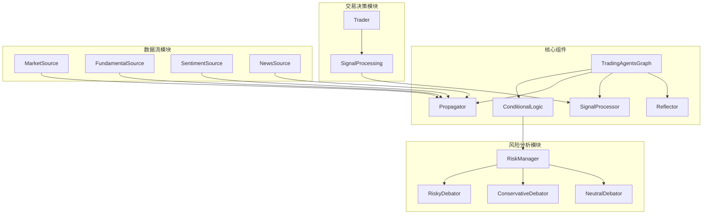
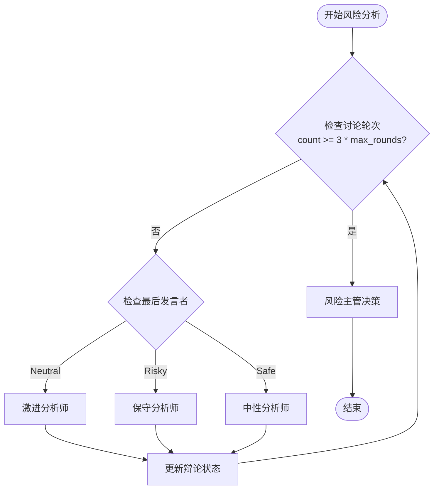
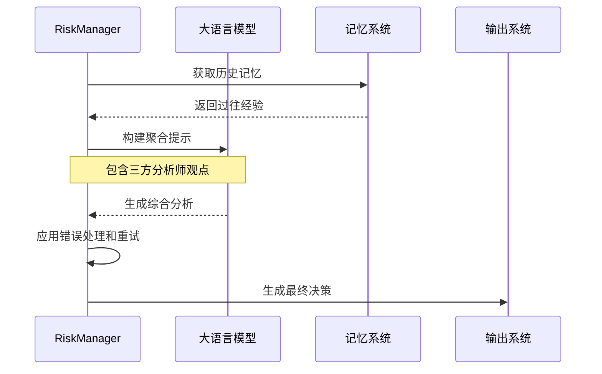
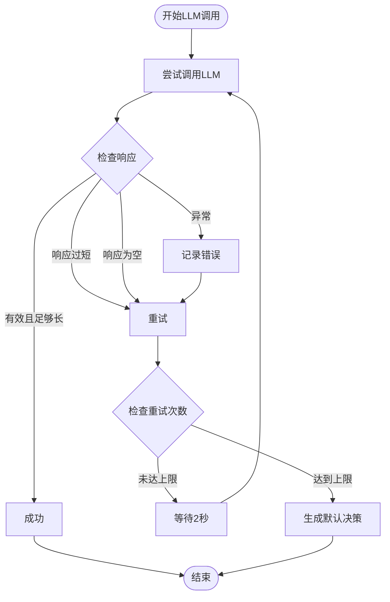
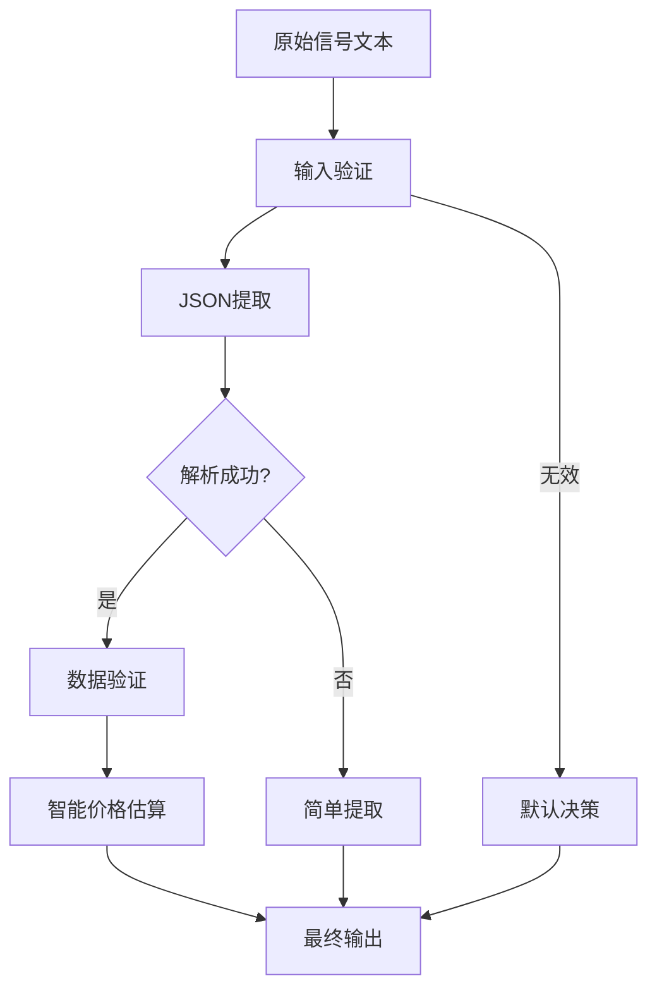
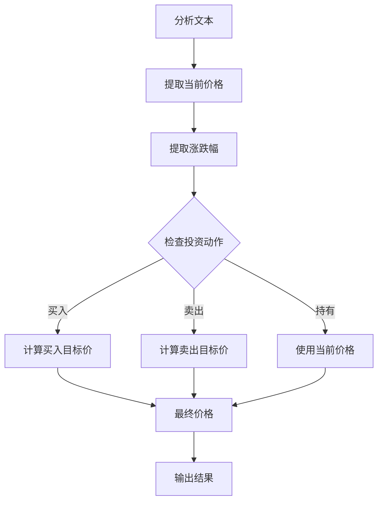
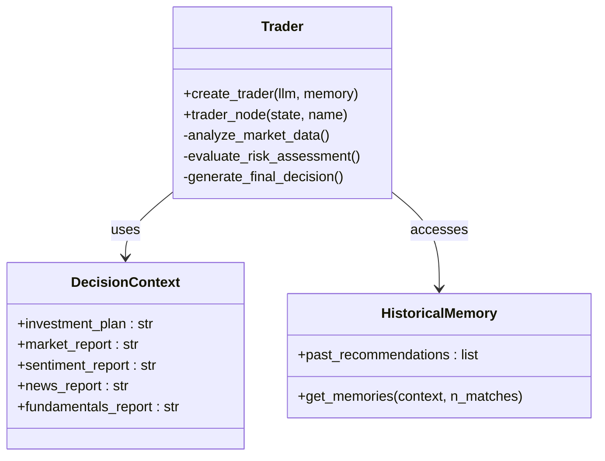
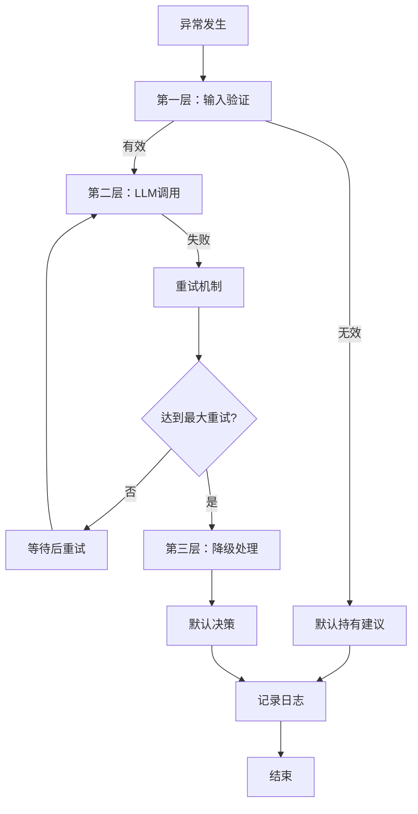
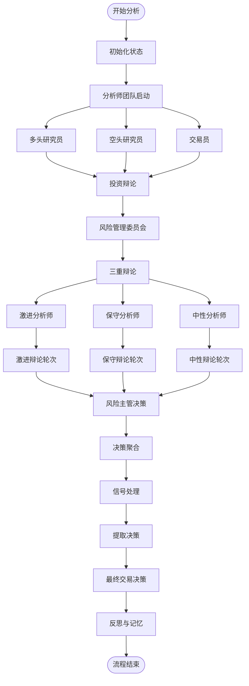

# 管理层决策流程

<cite>
**本文档中引用的文件**
- [risk_manager.py](file://tradingagents/agents/managers/risk_manager.py)
- [signal_processing.py](file://tradingagents/graph/signal_processing.py)
- [trader.py](file://tradingagents/agents/trader/trader.py)
- [aggresive_debator.py](file://tradingagents/agents/risk_mgmt/aggresive_debator.py)
- [conservative_debator.py](file://tradingagents/agents/risk_mgmt/conservative_debator.py)
- [neutral_debator.py](file://tradingagents/agents/risk_mgmt/neutral_debator.py)
- [trading_graph.py](file://tradingagents/graph/trading_graph.py)
- [conditional_logic.py](file://tradingagents/graph/conditional_logic.py)
- [propagation.py](file://tradingagents/graph/propagation.py)
- [test_risk_assessment.py](file://tests/test_risk_assessment.py)
</cite>

## 目录
1. [引言](#引言)
2. [系统架构概览](#系统架构概览)
3. [三重辩论决策流程](#三重辩论决策流程)
4. [风险分析师角色分析](#风险分析师角色分析)
5. [决策聚合算法](#决策聚合算法)
6. [信号处理机制](#信号处理机制)
7. [交易员智能体决策](#交易员智能体决策)
8. [异常处理与降级策略](#异常处理与降级策略)
9. [完整流程图](#完整流程图)
10. [性能考量](#性能考量)
11. [故障排除指南](#故障排除指南)
12. [结论](#结论)

## 引言

TradingAgents-CN系统实现了一个复杂的风险主管主导的三重辩论决策流程，该流程通过激进、保守和中立三位风险分析师的协同工作，为投资决策提供全面的风险评估。本文档详细阐述了这一创新性的风险管理机制，包括其架构设计、决策算法、信号处理机制以及异常处理策略。

该系统的核心创新在于引入了三个具有不同风险偏好的分析师角色，通过辩论式讨论产生平衡的风险评估，最终由风险主管进行决策聚合。这种设计不仅提高了决策的质量，还增强了系统的鲁棒性和适应性。

## 系统架构概览

TradingAgents-CN采用了模块化的架构设计，将不同的功能组件分离到独立的模块中，确保系统的可维护性和扩展性。



**图表来源**
- [trading_graph.py](file://tradingagents/graph/trading_graph.py#L25-L100)
- [conditional_logic.py](file://tradingagents/graph/conditional_logic.py#L8-L20)

**章节来源**
- [trading_graph.py](file://tradingagents/graph/trading_graph.py#L25-L100)
- [propagation.py](file://tradingagents/graph/propagation.py#L15-L52)

## 三重辩论决策流程

三重辩论决策流程是系统的核心机制，通过三个具有不同风险偏好的分析师角色进行深度讨论，最终形成全面的风险评估报告。

### 流程设计原理

该流程基于博弈论中的辩论理论，通过三个分析师的不同视角来识别和评估各种风险因素。每个分析师都有独特的风险偏好和分析方法：

- **激进分析师（Risky Debator）**：专注于高增长机会，强调收益潜力
- **保守分析师（Conservative Debator）**：注重风险控制，强调资本保护
- **中性分析师（Neutral Debator）**：提供平衡视角，兼顾收益和风险

### 讨论轮次控制

系统通过条件逻辑控制辩论的轮次，确保讨论的深度和效率：



**图表来源**
- [conditional_logic.py](file://tradingagents/graph/conditional_logic.py#L68-L78)

**章节来源**
- [conditional_logic.py](file://tradingagents/graph/conditional_logic.py#L68-L78)
- [aggresive_debator.py](file://tradingagents/agents/risk_mgmt/aggresive_debator.py#L8-L59)
- [conservative_debator.py](file://tradingagents/agents/risk_mgmt/conservative_debator.py#L8-L62)
- [neutral_debator.py](file://tradingagents/agents/risk_mgmt/neutral_debator.py#L8-L59)

## 风险分析师角色分析

### 激进分析师（Risky Debator）

激进分析师扮演着高风险高回报策略的倡导者角色。其核心职责是识别和评估潜在的高增长机会，即使这些机会伴随着较高的风险。

#### 分析特点
- **收益导向**：重点关注公司的增长潜力和创新机会
- **市场机会**：强调当前市场环境中的有利时机
- **风险容忍度**：愿意承担更高的波动性以换取更高收益
- **论证风格**：积极主动，善于发现被低估的机会

#### 关键论点
激进分析师通常会强调以下方面的优势：
- 技术创新带来的增长动力
- 市场占有率提升的可能性
- 新产品线的盈利潜力
- 行业变革带来的机遇

### 保守分析师（Conservative Debator）

保守分析师代表风险厌恶型投资者的视角，其重点在于资本保护和长期稳定性。

#### 分析特点
- **风险控制**：优先考虑潜在的负面因素和风险
- **基本面分析**：深入研究公司的财务健康状况
- **宏观经济考量**：关注经济周期和市场环境
- **防御策略**：强调风险缓解和保护措施

#### 关键论点
保守分析师通常会关注：
- 公司估值是否过高
- 行业竞争格局的变化
- 宏观经济不确定性的影响
- 公司债务水平和流动性风险

### 中性分析师（Neutral Debator）

中性分析师提供平衡的视角，试图在激进和保守观点之间找到最佳平衡点。

#### 分析特点
- **综合评估**：权衡各方观点，寻求平衡
- **风险收益比**：注重风险与收益的平衡
- **多元化策略**：建议分散投资以降低风险
- **情景分析**：考虑多种可能的市场情景

#### 关键论点
中性分析师通常会：
- 评估激进观点中的潜在风险
- 指出保守观点可能错失的机会
- 提供折衷的解决方案
- 强调风险管理的重要性

**章节来源**
- [aggresive_debator.py](file://tradingagents/agents/risk_mgmt/aggresive_debator.py#L8-L59)
- [conservative_debator.py](file://tradingagents/agents/risk_mgmt/conservative_debator.py#L8-L62)
- [neutral_debator.py](file://tradingagents/agents/risk_mgmt/neutral_debator.py#L8-L59)

## 决策聚合算法

风险主管的决策聚合算法是整个系统的核心，它将三个分析师的观点进行综合分析，生成最终的风险评估报告。

### 算法架构



**图表来源**
- [risk_manager.py](file://tradingagents/agents/managers/risk_manager.py#L8-L126)

### 聚合过程详解

#### 1. 数据收集与整合
风险主管首先收集所有分析师的输出，包括：
- 激进分析师的历史记录（risky_history）
- 保守分析师的历史记录（safe_history）
- 中性分析师的历史记录（neutral_history）
- 当前的辩论历史（history）

#### 2. 错误处理机制
系统实现了完善的错误处理和重试机制：



**图表来源**
- [risk_manager.py](file://tradingagents/agents/managers/risk_manager.py#L55-L85)

#### 3. 决策生成规则
当所有重试都失败时，系统会生成默认决策：

**默认建议：持有**
- 市场信息不足，避免盲目操作
- 保持现有仓位，等待更明确的市场信号
- 控制风险，避免在不确定性高的情况下做出激进决策

**章节来源**
- [risk_manager.py](file://tradingagents/agents/managers/risk_manager.py#L8-L126)

## 信号处理机制

信号处理机制负责从复杂的分析报告中提取结构化的投资决策信息，这是连接风险评估和最终交易决策的关键环节。

### 核心处理流程



**图表来源**
- [signal_processing.py](file://tradingagents/graph/signal_processing.py#L26-L213)

### 关键信号提取

信号处理器能够从分析报告中提取以下关键信息：

#### 1. 投资建议
- **买入**：明确的买入建议
- **持有**：维持现状的建议  
- **卖出**：卖出或减仓的建议

#### 2. 目标价位
系统使用多种模式匹配来提取目标价格：

```python
# 价格匹配模式示例
price_patterns = [
    r'目标价[位格]?[：:]?\s*[¥\$]?(\d+(?:\.\d+)?)',  # 目标价位: 45.50
    r'目标[：:]?\s*[¥\$]?(\d+(?:\.\d+)?)',         # 目标: 45.50
    r'价格[：:]?\s*[¥\$]?(\d+(?:\.\d+)?)',         # 价格: 45.50
    r'[¥\$](\d+(?:\.\d+)?)',                      # ¥45.50 或 $190
    # ... 更多模式
]
```

#### 3. 置信度和风险评分
- **置信度**：0-1之间的数值，表示决策的信心程度
- **风险评分**：0-1之间的数值，表示投资风险等级

#### 4. 决策理由
简明扼要的中文决策理由摘要

### 智能价格估算

当JSON解析失败时，系统会使用智能价格估算功能：



**图表来源**
- [signal_processing.py](file://tradingagents/graph/signal_processing.py#L215-L280)

**章节来源**
- [signal_processing.py](file://tradingagents/graph/signal_processing.py#L26-L336)

## 交易员智能体决策

交易员智能体负责综合投资计划与风险评估，做出最终的交易决策。该模块集成了历史记忆、实时分析和风险评估等多个维度的信息。

### 决策框架



**图表来源**
- [trader.py](file://tradingagents/agents/trader/trader.py#L8-L116)

### 决策生成过程

#### 1. 上下文构建
交易员首先构建完整的分析上下文：

- **投资计划**：基于分析师团队的综合分析
- **市场研究**：宏观经济和行业趋势
- **情绪分析**：社交媒体和新闻的情绪倾向
- **新闻报道**：最新的公司和行业新闻
- **基本面分析**：财务报表和估值指标

#### 2. 历史记忆利用
系统会检索历史记忆来避免重复错误：

```python
# 历史记忆检索示例
if memory is not None:
    past_memories = memory.get_memories(curr_situation, n_matches=2)
    past_memory_str = ""
    for i, rec in enumerate(past_memories, 1):
        past_memory_str += rec["recommendation"] + "\n\n"
```

#### 3. 决策生成规则
交易员遵循严格的决策生成规则：

- **货币单位**：根据股票类型自动选择正确的货币
- **目标价格**：必须提供具体数值，不允许为空
- **公司名称**：必须使用基本面报告中的真实名称
- **风险控制**：结合风险评估结果制定相应的风控措施

**章节来源**
- [trader.py](file://tradingagents/agents/trader/trader.py#L8-L116)

## 异常处理与降级策略

系统实现了多层次的异常处理和降级策略，确保在各种异常情况下仍能提供基本的服务能力。

### 错误处理层次



**图表来源**
- [risk_manager.py](file://tradingagents/agents/managers/risk_manager.py#L55-L116)

### 降级策略详解

#### 1. 输入验证降级
当输入信号无效时：
- 返回默认持有建议
- 设置置信度为0.5
- 设置风险评分为0.5
- 提供简要的默认理由

#### 2. LLM调用降级
当大语言模型调用失败时：
- 实现最多3次重试
- 每次重试间隔2秒
- 记录详细的错误信息
- 在所有重试失败后生成默认决策

#### 3. 数据提取降级
当JSON解析失败时：
- 使用正则表达式进行简单提取
- 启用智能价格估算
- 提供合理的默认值
- 记录降级处理过程

### 异常恢复机制

系统具备自动恢复能力：

- **状态重置**：异常发生后重置相关状态
- **资源清理**：释放占用的系统资源
- **日志记录**：详细记录异常信息用于后续分析
- **用户通知**：向用户传达异常状态和处理结果

**章节来源**
- [risk_manager.py](file://tradingagents/agents/managers/risk_manager.py#L55-L116)
- [signal_processing.py](file://tradingagents/graph/signal_processing.py#L26-L60)

## 完整流程图

以下是整个决策流程的完整可视化：



**图表来源**
- [trading_graph.py](file://tradingagents/graph/trading_graph.py#L353-L375)
- [conditional_logic.py](file://tradingagents/graph/conditional_logic.py#L68-L78)

## 性能考量

### 并发处理能力

系统设计支持并发处理多个股票的分析请求：

- **异步处理**：使用LangGraph的流式处理能力
- **资源隔离**：每个股票分析使用独立的状态
- **内存管理**：智能的内存使用和垃圾回收
- **缓存机制**：有效的数据缓存减少重复计算

### 计算复杂度

- **时间复杂度**：O(n × m)，其中n是股票数量，m是分析轮次
- **空间复杂度**：O(k)，其中k是状态存储大小
- **可扩展性**：支持水平扩展和分布式处理

### 优化策略

- **智能重试**：指数退避重试机制
- **批量处理**：支持批量股票分析
- **资源池化**：共享LLM资源提高效率
- **预热机制**：系统启动时预加载关键组件

## 故障排除指南

### 常见问题及解决方案

#### 1. LLM调用失败
**症状**：风险主管无法生成决策
**原因**：网络连接问题或API限制
**解决方案**：
- 检查API密钥配置
- 验证网络连接
- 查看重试日志
- 考虑使用备用LLM提供商

#### 2. 信号处理错误
**症状**：无法从分析报告中提取决策
**原因**：JSON格式错误或内容缺失
**解决方案**：
- 检查分析报告格式
- 验证信号处理器配置
- 使用简单提取模式
- 检查货币单位设置

#### 3. 内存不足
**症状**：长时间运行后系统变慢
**原因**：状态数据积累过多
**解决方案**：
- 定期清理历史状态
- 调整内存管理参数
- 使用压缩存储
- 实施内存监控

#### 4. 权限问题
**症状**：无法访问某些数据源
**原因**：API密钥或认证配置错误
**解决方案**：
- 验证所有API密钥
- 检查环境变量设置
- 确认数据源权限
- 更新认证配置

### 调试技巧

- **启用调试模式**：设置debug=True获取详细日志
- **检查状态跟踪**：分析中间状态了解流程瓶颈
- **监控资源使用**：观察CPU和内存使用情况
- **验证数据完整性**：检查各模块间的数据传递

**章节来源**
- [test_risk_assessment.py](file://tests/test_risk_assessment.py#L10-L199)

## 结论

TradingAgents-CN的风险主管主导的三重辩论决策流程代表了金融科技领域的一个重要创新。通过引入三个具有不同风险偏好的分析师角色，系统实现了更加全面和平衡的风险评估。

### 主要优势

1. **多元化视角**：三个分析师的不同观点确保了风险评估的全面性
2. **智能聚合**：风险主管的决策聚合算法能够有效整合多方意见
3. **鲁棒性强**：完善的异常处理和降级策略保证系统稳定性
4. **可扩展性好**：模块化设计便于功能扩展和维护
5. **自动化程度高**：从数据分析到最终决策的全流程自动化

### 应用价值

该系统特别适用于：
- 机构投资者的风险管理
- 量化交易策略的开发
- 投资组合的动态调整
- 高频交易的决策支持

### 未来发展方向

- **机器学习集成**：引入强化学习优化决策过程
- **实时分析**：支持实时市场数据的快速处理
- **个性化定制**：根据不同投资者的风险偏好进行定制
- **跨市场应用**：扩展到全球主要金融市场

通过持续的技术创新和优化，该系统有望成为金融风险管理领域的标杆解决方案，为投资者提供更加智能、可靠的风险决策支持。