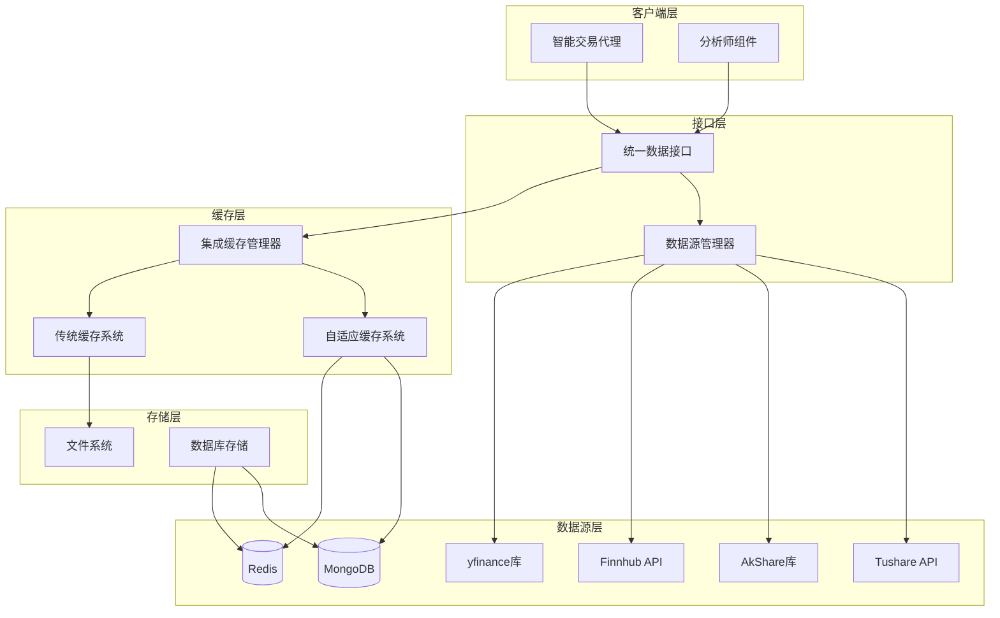
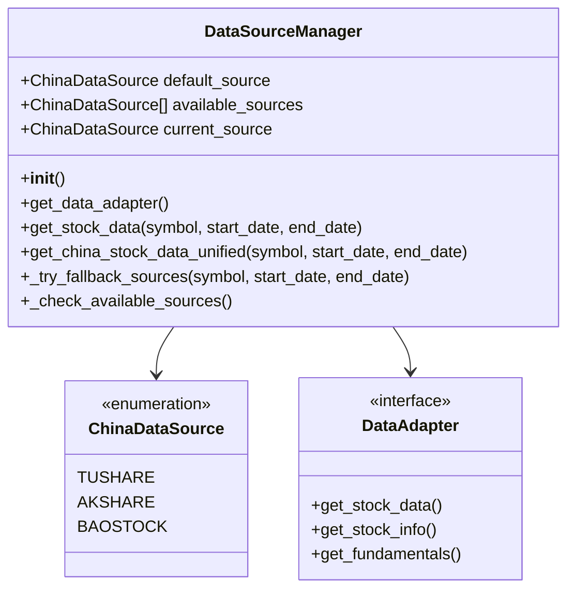
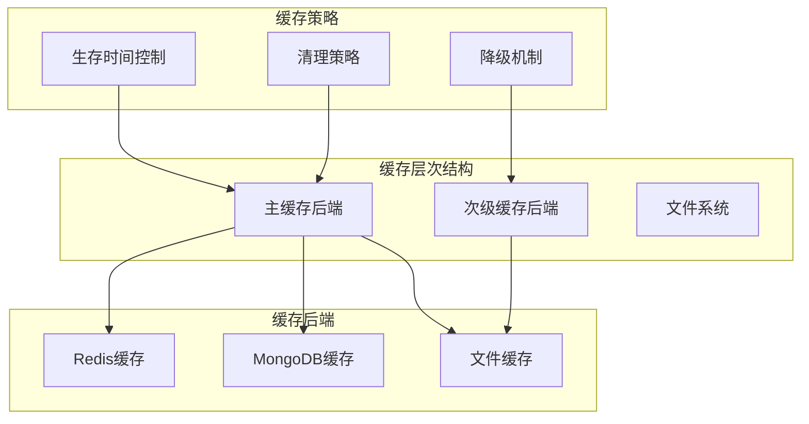
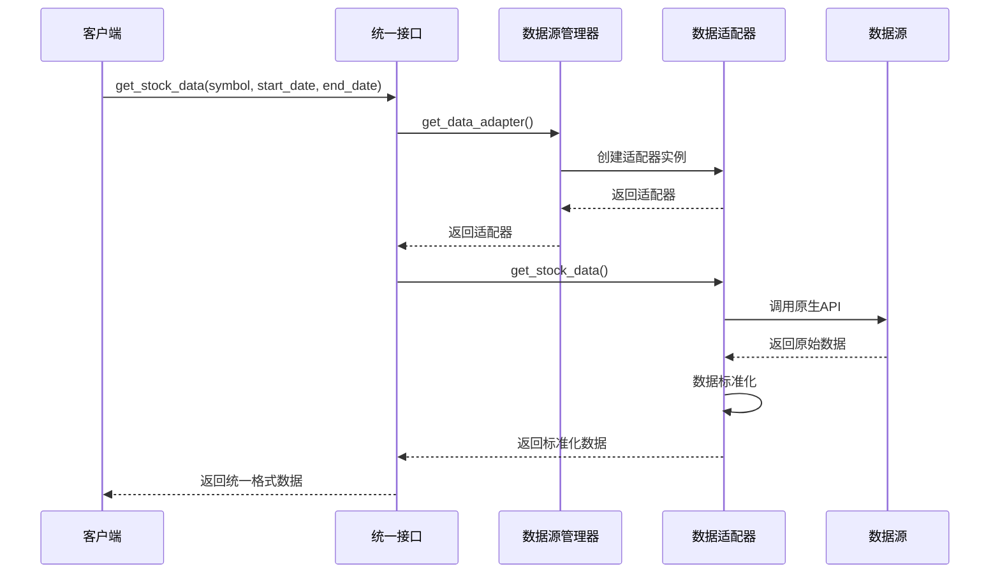
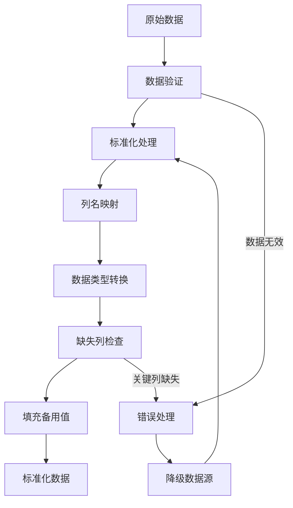
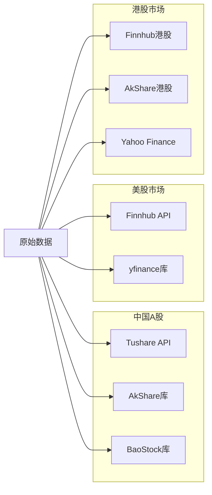
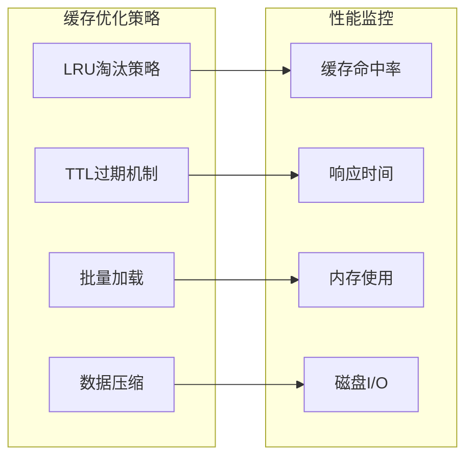
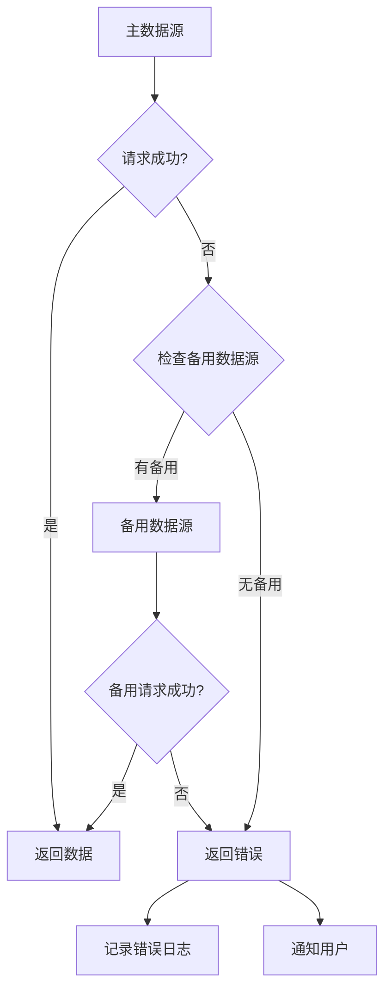
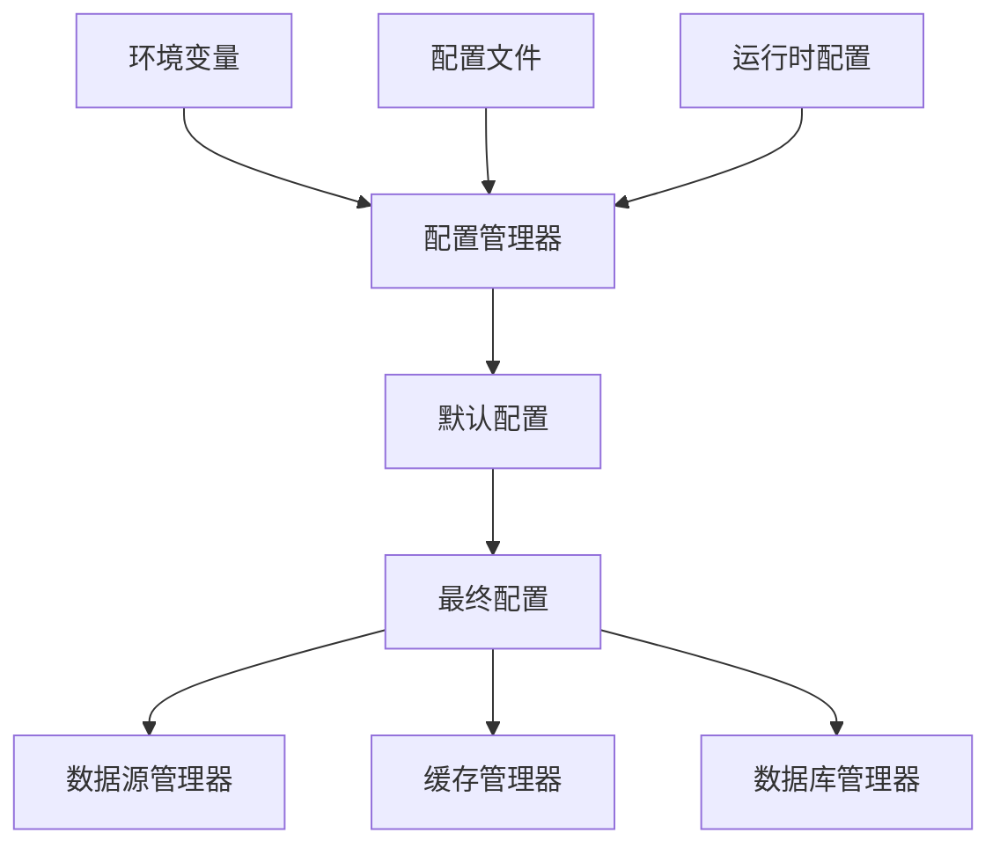

# 数据流架构

<cite>
**本文档引用的文件**
- [data_source_manager.py](file://tradingagents/dataflows/data_source_manager.py)
- [adaptive_cache.py](file://tradingagents/dataflows/adaptive_cache.py)
- [interface.py](file://tradingagents/dataflows/interface.py)
- [cache_manager.py](file://tradingagents/dataflows/cache_manager.py)
- [db_cache_manager.py](file://tradingagents/dataflows/db_cache_manager.py)
- [integrated_cache.py](file://tradingagents/dataflows/integrated_cache.py)
- [stock_data_service.py](file://tradingagents/dataflows/stock_data_service.py)
- [config.py](file://tradingagents/dataflows/config.py)
- [utils.py](file://tradingagents/dataflows/utils.py)
</cite>

## 目录
1. [简介](#简介)
2. [系统架构概览](#系统架构概览)
3. [数据源管理器](#数据源管理器)
4. [自适应缓存系统](#自适应缓存系统)
5. [统一数据接口](#统一数据接口)
6. [数据预处理流程](#数据预处理流程)
7. [性能优化策略](#性能优化策略)
8. [异常处理机制](#异常处理机制)
9. [配置管理](#配置管理)
10. [故障排除指南](#故障排除指南)

## 简介

TradingAgents-CN的数据流处理架构是一个高度集成的金融数据获取与缓存系统，旨在为智能交易代理提供可靠、高效、可扩展的数据服务。该架构通过多层次的缓存策略、智能的数据源优先级管理和完善的降级机制，确保在各种网络条件和数据源可用性下都能提供稳定的服务。

## 系统架构概览



**图表来源**
- [data_source_manager.py](file://tradingagents/dataflows/data_source_manager.py#L1-L50)
- [integrated_cache.py](file://tradingagents/dataflows/integrated_cache.py#L1-L50)
- [interface.py](file://tradingagents/dataflows/interface.py#L1-L50)

## 数据源管理器

### 架构设计

数据源管理器（DataSourceManager）是整个数据流架构的核心组件，负责协调多个数据源的优先级调用策略。系统支持中国股票数据源（Tushare、AkShare、BaoStock）和国际股票数据源（Finnhub、yfinance）的统一管理。



**图表来源**
- [data_source_manager.py](file://tradingagents/dataflows/data_source_manager.py#L20-L50)

### 数据源优先级策略

系统采用智能的降级机制，确保在主数据源不可用时能够自动切换到备用数据源：

| 主数据源 | 备用数据源1 | 备用数据源2 | 备用数据源3 |
|---------|------------|------------|------------|
| AKShare | Tushare | BaoStock | - |
| Tushare | AKShare | BaoStock | - |
| BaoStock | AKShare | Tushare | - |
| Finnhub | Yahoo Finance | - | - |
| Yahoo Finance | Finnhub | - | - |

**节来源**
- [data_source_manager.py](file://tradingagents/dataflows/data_source_manager.py#L547-L574)

### 环境变量配置

系统支持通过环境变量动态配置默认数据源：

```python
# 支持的数据源配置
DEFAULT_CHINA_DATA_SOURCE = os.getenv('DEFAULT_CHINA_DATA_SOURCE', 'akshare').lower()
```

**节来源**
- [data_source_manager.py](file://tradingagents/dataflows/data_source_manager.py#L50-L60)

## 自适应缓存系统

### 多层缓存架构

自适应缓存系统（AdaptiveCacheSystem）实现了智能的多层缓存策略，根据数据库可用性自动选择最佳缓存后端。



**图表来源**
- [adaptive_cache.py](file://tradingagents/dataflows/adaptive_cache.py#L20-L80)

### 缓存键生成策略

系统采用基于内容的缓存键生成算法，确保缓存的准确性和唯一性：

```python
def _get_cache_key(self, symbol: str, start_date: str = "", end_date: str = "", 
                  data_source: str = "default", data_type: str = "stock_data") -> str:
    key_data = f"{symbol}_{start_date}_{end_date}_{data_source}_{data_type}"
    return hashlib.md5(key_data.encode()).hexdigest()
```

**节来源**
- [adaptive_cache.py](file://tradingagents/dataflows/adaptive_cache.py#L45-L50)

### 缓存失效策略

系统实现了灵活的TTL（生存时间）机制，根据不同数据类型的特性设置不同的缓存期限：

| 数据类型 | 中国A股 | 美股 | 港股 |
|---------|--------|-----|-----|
| 股票数据 | 1小时 | 2小时 | 2小时 |
| 新闻数据 | 4小时 | 6小时 | 4小时 |
| 基本面数据 | 12小时 | 24小时 | 12小时 |

**节来源**
- [adaptive_cache.py](file://tradingagents/dataflows/adaptive_cache.py#L55-L70)

## 统一数据接口

### 适配器模式设计

统一数据接口（interface.py）采用适配器模式，为不同的数据源提供一致的API接口。



**图表来源**
- [interface.py](file://tradingagents/dataflows/interface.py#L1-L50)
- [data_source_manager.py](file://tradingagents/dataflows/data_source_manager.py#L100-L150)

### 数据标准化流程

系统实现了统一的数据标准化流程，确保来自不同数据源的数据格式一致性：



**图表来源**
- [tushare_adapter.py](file://tradingagents/dataflows/tushare_adapter.py#L214-L293)

**节来源**
- [tushare_adapter.py](file://tradingagents/dataflows/tushare_adapter.py#L214-L293)

## 数据预处理流程

### 原始数据获取

系统支持多种数据源的原始数据获取，包括中国A股、美股和港股市场：



**图表来源**
- [data_source_manager.py](file://tradingagents/dataflows/data_source_manager.py#L150-L250)

### 数据清洗与验证

系统实现了严格的数据清洗和验证机制：

1. **数据完整性检查**：验证关键字段的存在性和有效性
2. **数据类型转换**：确保数值型数据的正确格式
3. **异常值处理**：识别和处理异常的价格、成交量等数据
4. **时间序列排序**：按日期时间戳对数据进行排序

**节来源**
- [data_source_manager.py](file://tradingagents/dataflows/data_source_manager.py#L300-L400)

## 性能优化策略

### 缓存优化

系统采用了多层次的缓存优化策略：



**图表来源**
- [cache_manager.py](file://tradingagents/dataflows/cache_manager.py#L100-L200)

### 批量数据加载

系统支持批量数据加载，显著提升大数据量场景下的性能：

```python
# 批量加载示例
def batch_load_stock_data(symbols: List[str], start_date: str, end_date: str):
    with ThreadPoolExecutor(max_workers=10) as executor:
        futures = [
            executor.submit(get_stock_data, symbol, start_date, end_date)
            for symbol in symbols
        ]
        results = [future.result() for future in as_completed(futures)]
    return results
```

**节来源**
- [cache_manager.py](file://tradingagents/dataflows/cache_manager.py#L400-L500)

### 连接池管理

对于数据库缓存，系统实现了连接池管理机制：

```python
# Redis连接池配置
redis_pool = redis.ConnectionPool(
    host=host,
    port=port,
    password=password,
    max_connections=20
)
```

**节来源**
- [db_cache_manager.py](file://tradingagents/dataflows/db_cache_manager.py#L50-L100)

## 异常处理机制

### 降级策略

系统实现了完善的降级机制，确保在任何情况下都能提供服务：



**图表来源**
- [data_source_manager.py](file://tradingagents/dataflows/data_source_manager.py#L547-L574)

### 超时控制

系统为每个数据源请求设置了合理的超时时间：

```python
# 超时配置示例
TIMEOUT_CONFIG = {
    'tushare': 30,      # Tushare API超时30秒
    'akshare': 45,      # AkShare库超时45秒
    'finnhub': 20,      # Finnhub API超时20秒
    'yfinance': 30      # yfinance库超时30秒
}
```

**节来源**
- [data_source_manager.py](file://tradingagents/dataflows/data_source_manager.py#L500-L550)

### 错误恢复机制

系统实现了指数退避重试机制：

```python
# 指数退避重试
def exponential_backoff_retry(func, max_retries=3):
    for attempt in range(max_retries):
        try:
            return func()
        except Exception as e:
            if attempt == max_retries - 1:
                raise e
            wait_time = 2 ** attempt  # 2, 4, 8秒
            time.sleep(wait_time)
```

**节来源**
- [data_source_manager.py](file://tradingagents/dataflows/data_source_manager.py#L600-L650)

## 配置管理

### 配置层次结构

系统采用分层配置管理，支持环境变量、配置文件和运行时配置的优先级：



**图表来源**
- [config.py](file://tradingagents/dataflows/config.py#L1-L50)

### 数据目录配置

系统支持灵活的数据目录配置：

```python
# 数据目录配置
DATA_DIR = os.getenv('TRADINGAGENTS_DATA_DIR', 
                    os.path.join(os.path.expanduser('~'), '.tradingagents', 'data'))
```

**节来源**
- [config.py](file://tradingagents/dataflows/config.py#L20-L40)

### 数据库连接配置

系统提供了完整的数据库连接配置管理：

```python
# 数据库配置示例
DATABASE_CONFIG = {
    'mongodb': {
        'connection_string': 'mongodb://localhost:27017/',
        'database': 'tradingagents',
        'auth_source': 'admin'
    },
    'redis': {
        'host': 'localhost',
        'port': 6379,
        'password': 'tradingagents123',
        'database': 0
    }
}
```

**节来源**
- [database_config.py](file://tradingagents/config/database_config.py#L15-L55)

## 故障排除指南

### 常见问题诊断

| 问题类型 | 症状 | 可能原因 | 解决方案 |
|---------|------|---------|---------|
| 数据源连接失败 | API调用超时 | 网络问题、API密钥错误 | 检查网络连接和API配置 |
| 缓存读取失败 | 缓存数据丢失 | 磁盘空间不足、权限问题 | 清理磁盘空间和检查权限 |
| 数据格式错误 | 数据解析失败 | 数据源变更、版本不兼容 | 更新数据适配器 |
| 性能下降 | 响应时间过长 | 缓存失效、资源竞争 | 优化缓存策略和资源配置 |

### 监控指标

系统提供了全面的监控指标：

```python
# 缓存统计信息
cache_stats = {
    'hit_rate': cache_manager.get_hit_rate(),
    'average_response_time': cache_manager.get_avg_response_time(),
    'total_requests': cache_manager.get_total_requests(),
    'error_rate': cache_manager.get_error_rate()
}
```

**节来源**
- [integrated_cache.py](file://tradingagents/dataflows/integrated_cache.py#L200-L250)

### 日志记录

系统实现了分级日志记录机制：

```python
# 日志级别配置
LOG_LEVELS = {
    'data_source': 'INFO',
    'cache': 'WARNING',
    'performance': 'DEBUG',
    'error': 'ERROR'
}
```

**节来源**
- [utils.py](file://tradingagents/dataflows/utils.py#L1-L45)

通过这个全面的数据流架构文档，开发者可以深入了解TradingAgents-CN的金融数据处理能力，包括其强大的数据源管理、智能缓存策略、统一接口设计和完善的异常处理机制。这套架构不仅保证了系统的稳定性和可靠性，还为未来的功能扩展提供了坚实的基础。