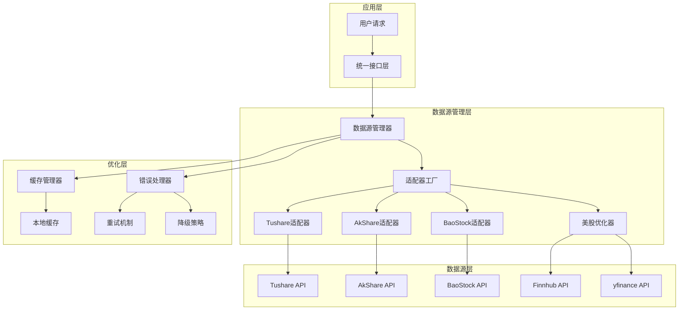
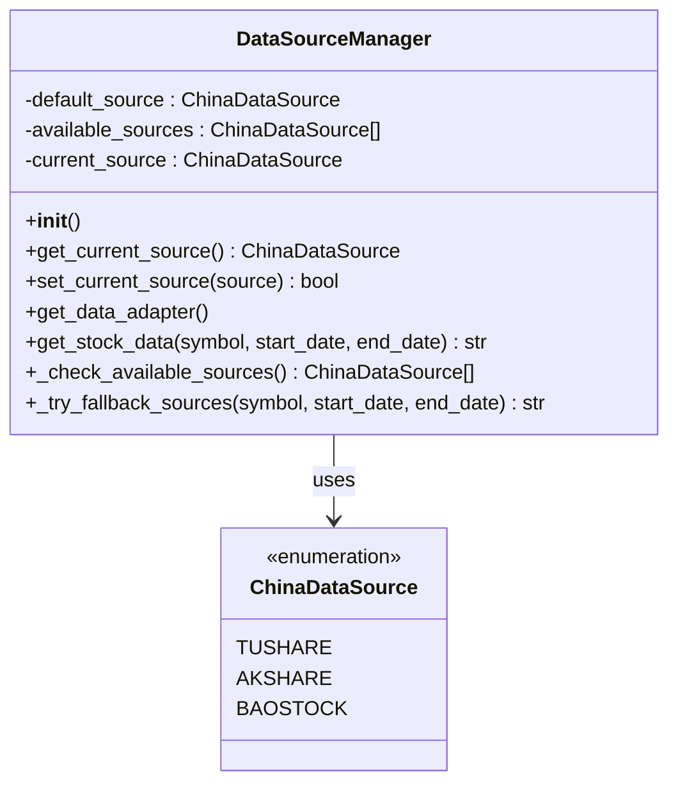
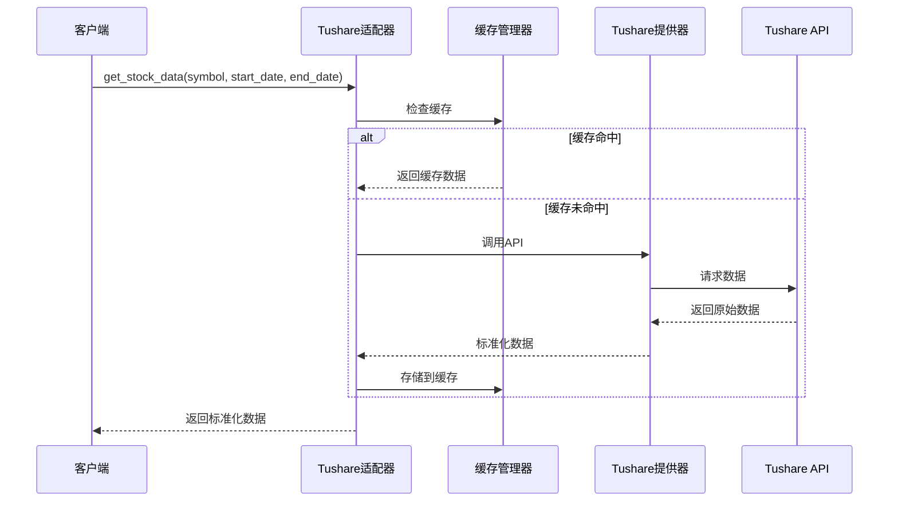
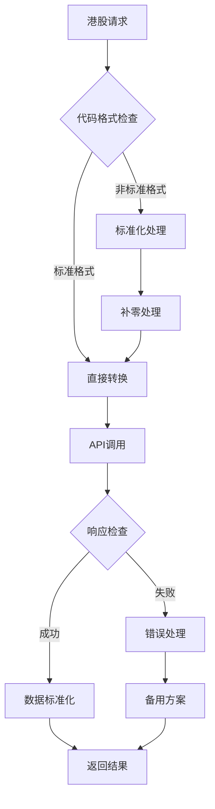
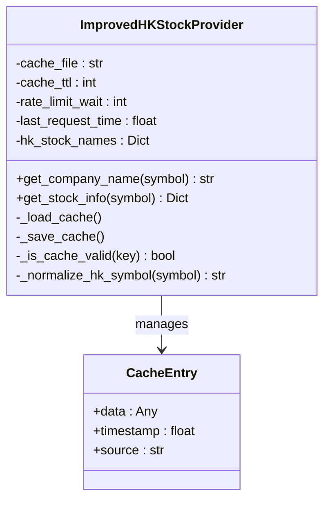
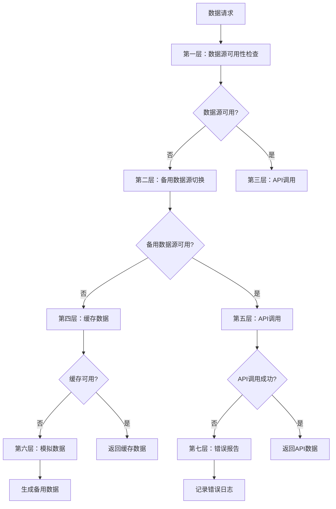
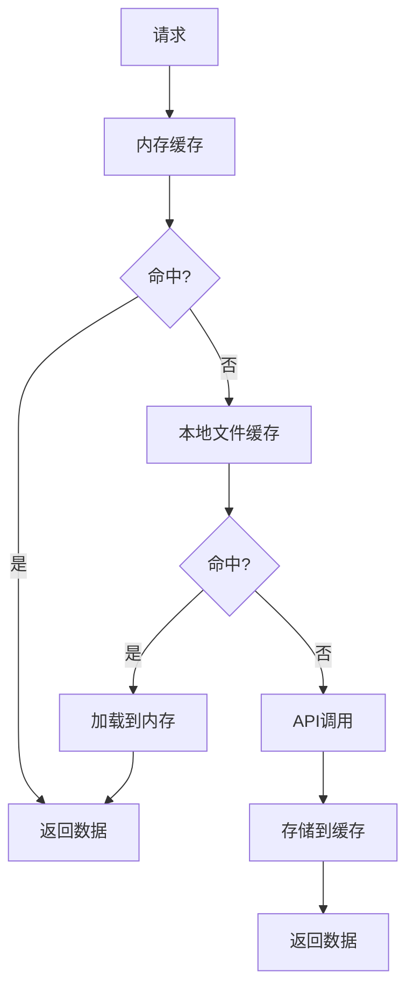

# 数据源集成

<cite>
**本文档引用的文件**
- [data_source_manager.py](file://tradingagents/dataflows/data_source_manager.py)
- [tushare_adapter.py](file://tradingagents/dataflows/tushare_adapter.py)
- [akshare_utils.py](file://tradingagents/dataflows/akshare_utils.py)
- [finnhub_utils.py](file://tradingagents/dataflows/finnhub_utils.py)
- [improved_hk_utils.py](file://tradingagents/dataflows/improved_hk_utils.py)
- [optimized_us_data.py](file://tradingagents/dataflows/optimized_us_data.py)
- [interface.py](file://tradingagents/dataflows/interface.py)
- [default_config.py](file://tradingagents/default_config.py)
</cite>

## 目录
1. [概述](#概述)
2. [系统架构](#系统架构)
3. [数据源管理器](#数据源管理器)
4. [适配器层设计](#适配器层设计)
5. [数据源优先级机制](#数据源优先级机制)
6. [特定市场适配器](#特定市场适配器)
7. [错误处理与降级机制](#错误处理与降级机制)
8. [缓存与性能优化](#缓存与性能优化)
9. [扩展新数据源](#扩展新数据源)
10. [最佳实践](#最佳实践)

## 概述

TradingAgents-CN采用统一的数据源集成架构，支持多个金融数据提供商的无缝切换和降级。该系统通过抽象层设计实现了对AkShare、Tushare、Finnhub、yfinance等数据源的统一管理，同时针对A股、港股、美股等不同市场的特殊需求提供了专门的优化策略。

核心特性包括：
- **多数据源统一接口**：通过适配器模式实现不同数据源的标准化访问
- **智能优先级调度**：基于配置和可用性的动态数据源选择
- **自动降级机制**：主数据源失败时的无缝备用方案切换
- **缓存优化策略**：减少API调用频率，提升响应速度
- **错误恢复机制**：完善的异常处理和数据回退策略

## 系统架构



**图表来源**
- [data_source_manager.py](file://tradingagents/dataflows/data_source_manager.py#L25-L50)
- [interface.py](file://tradingagents/dataflows/interface.py#L1-L50)

## 数据源管理器

数据源管理器（DataSourceManager）是整个数据源集成系统的核心组件，负责协调各个数据源的可用性检测、优先级管理和故障转移。

### 核心功能

#### 1. 数据源枚举定义
系统定义了标准的中国股票数据源枚举，支持Tushare、AkShare和BaoStock三种主要数据源：



**图表来源**
- [data_source_manager.py](file://tradingagents/dataflows/data_source_manager.py#L25-L35)

#### 2. 可用性检测机制
数据源管理器会自动检测每个数据源的可用性，包括库依赖检查和API连接测试：

- **Tushare检测**：检查tushare库安装状态和TOKEN配置
- **AkShare检测**：验证akshare库可用性和网络连接
- **BaoStock检测**：确认baostock库安装和API可用性

#### 3. 动态源切换
支持运行时动态切换数据源，无需重启应用程序：

```python
# 示例：切换到Tushare数据源
manager = get_data_source_manager()
manager.set_current_source(ChinaDataSource.TUSHARE)
```

**章节来源**
- [data_source_manager.py](file://tradingagents/dataflows/data_source_manager.py#L100-L150)

## 适配器层设计

适配器层通过统一接口封装不同数据源的API差异，为上层应用提供一致的数据访问体验。

### Tushare适配器

Tushare适配器是最成熟的数据源适配器，提供了完整的数据获取和缓存功能：



**图表来源**
- [tushare_adapter.py](file://tradingagents/dataflows/tushare_adapter.py#L80-L150)

#### 核心特性
- **自动缓存管理**：基于时间戳的智能缓存策略
- **数据标准化**：统一列名和数据格式
- **错误处理**：完善的异常捕获和降级机制
- **实时数据支持**：支持实时行情和历史数据

### AkShare适配器

AkShare适配器专注于中国市场，提供了丰富的A股和港股数据获取功能：

#### 港股优化策略
针对港股市场的特殊性，AkShare适配器实现了多项优化：



**图表来源**
- [akshare_utils.py](file://tradingagents/dataflows/akshare_utils.py#L200-L250)

**章节来源**
- [tushare_adapter.py](file://tradingagents/dataflows/tushare_adapter.py#L1-L100)
- [akshare_utils.py](file://tradingagents/dataflows/akshare_utils.py#L1-L100)

## 数据源优先级机制

系统实现了智能的数据源优先级调度，确保在主数据源不可用时能够无缝切换到备用数据源。

### 中国股市优先级

对于中国A股市场，系统按照以下优先级顺序选择数据源：

```mermaid
graph LR
A[用户请求] --> B{主数据源可用?}
B --> |是| C[使用主数据源]
B --> |否| D[检查备用数据源]
D --> E[AKShare]
D --> F[Tushare]
D --> G[BaoStock]
E --> H{AKShare可用?}
H --> |是| I[使用AKShare]
H --> |否| J[检查下一个]
F --> K{Tushare可用?}
K --> |是| L[使用Tushare]
K --> |否| M[检查下一个]
G --> N[BaoStock可用?}
N --> |是| O[使用BaoStock]
N --> |否| P[返回错误]
```

**图表来源**
- [data_source_manager.py](file://tradingagents/dataflows/data_source_manager.py#L547-L574)

### 美股市场优先级

美股市场采用了更加灵活的优先级策略，结合实时性和稳定性因素：

1. **Finnhub API**（首选）：提供高质量的实时数据
2. **Yahoo Finance**（备用）：作为Finnhub的可靠备份
3. **本地缓存**（兜底）：在API完全不可用时提供基础数据

**章节来源**
- [data_source_manager.py](file://tradingagents/dataflows/data_source_manager.py#L547-L574)
- [optimized_us_data.py](file://tradingagents/dataflows/optimized_us_data.py#L50-L100)

## 特定市场适配器

### 港股优化适配器（improved_hk_utils）

港股市场具有独特的交易规则和数据特征，系统为此专门开发了优化适配器：

#### 核心优化策略

1. **内置映射缓存**：预定义常见港股公司的名称映射，避免API调用
2. **智能缓存机制**：基于24小时TTL的本地缓存策略
3. **速率限制保护**：5秒间隔的API调用控制
4. **多源数据融合**：AKShare、Yahoo Finance等多种数据源的智能组合



**图表来源**
- [improved_hk_utils.py](file://tradingagents/dataflows/improved_hk_utils.py#L14-L50)

#### 港股代码标准化

系统实现了智能的港股代码标准化算法，支持多种输入格式：

| 输入格式 | 标准化结果 | 说明 |
|---------|-----------|------|
| 0700 | 00700 | 补充前导零 |
| 700 | 00700 | 4位数字格式 |
| 00700.HK | 00700 | 移除.HK后缀 |
| 700.HK | 00700 | 组合处理 |

**章节来源**
- [improved_hk_utils.py](file://tradingagents/dataflows/improved_hk_utils.py#L1-L100)

### 美股优化适配器

美股优化适配器针对美国市场的特点进行了专门优化：

#### 缓存策略
- **智能缓存查找**：优先查找FINNHUB缓存，其次查找Yahoo Finance缓存
- **过期缓存利用**：在新数据获取失败时使用过期缓存
- **混合数据源**：根据股票类型选择最优数据源

#### API限制处理
- **速率限制保护**：1秒最小调用间隔
- **并发控制**：避免API频率限制
- **优雅降级**：API失败时的平滑降级

**章节来源**
- [optimized_us_data.py](file://tradingagents/dataflows/optimized_us_data.py#L1-L100)

## 错误处理与降级机制

系统实现了多层次的错误处理和降级机制，确保在各种异常情况下仍能提供服务。

### 分层错误处理



### 具体降级策略

#### 1. 数据源降级
当主数据源失败时，系统会按照预设优先级自动切换到备用数据源。

#### 2. 缓存降级
在API完全不可用的情况下，系统会返回过期的缓存数据，确保基本功能可用。

#### 3. 模拟数据
当所有数据源都不可用时，系统会生成模拟数据供用户参考。

**章节来源**
- [data_source_manager.py](file://tradingagents/dataflows/data_source_manager.py#L600-L650)

## 缓存与性能优化

### 缓存架构

系统采用了多层缓存架构，包括内存缓存、本地文件缓存和分布式缓存：



### 性能优化策略

#### 1. 智能缓存策略
- **时间感知缓存**：不同数据类型的缓存时间不同
- **大小限制**：防止缓存占用过多磁盘空间
- **定期清理**：自动清理过期缓存文件

#### 2. 并发优化
- **异步处理**：API调用采用异步模式
- **连接池**：复用HTTP连接减少开销
- **批量请求**：合并多个小请求

#### 3. 网络优化
- **超时控制**：合理的API超时设置
- **重试机制**：指数退避重试策略
- **熔断器**：防止级联故障

**章节来源**
- [tushare_adapter.py](file://tradingagents/dataflows/tushare_adapter.py#L100-L200)

## 扩展新数据源

### 添加新数据源适配器

要向系统添加新的数据源适配器，需要遵循以下步骤：

#### 1. 创建适配器类

```python
class NewDataSourceAdapter:
    def __init__(self):
        self.provider = self._initialize_provider()
        self.cache_manager = get_cache()
    
    def get_stock_data(self, symbol: str, start_date: str, end_date: str) -> pd.DataFrame:
        # 实现数据获取逻辑
        pass
    
    def get_stock_info(self, symbol: str) -> Dict:
        # 实现股票信息获取
        pass
```

#### 2. 注册到数据源管理器

在`data_source_manager.py`中添加新的数据源：

```python
class ChinaDataSource(Enum):
    TUSHARE = "tushare"
    AKSHARE = "akshare"
    BAOSTOCK = "baostock"
    NEW_SOURCE = "new_source"  # 新增数据源

# 在_available_sources方法中添加检测逻辑
def _check_available_sources(self) -> List[ChinaDataSource]:
    available = []
    
    # 现有检测逻辑...
    
    # 新增数据源检测
    try:
        from .new_source_utils import get_new_source_provider
        available.append(ChinaDataSource.NEW_SOURCE)
        logger.info("✅ 新数据源可用")
    except ImportError:
        logger.warning("⚠️ 新数据源不可用")
    
    return available
```

#### 3. 实现统一接口

确保新适配器实现标准接口：

```python
def get_china_stock_data_new_source(symbol: str, start_date: str, end_date: str) -> str:
    """新数据源的统一接口"""
    adapter = get_new_source_adapter()
    return adapter.get_stock_data(symbol, start_date, end_date)
```

### 配置新数据源

#### 1. 环境变量配置
```bash
export DEFAULT_CHINA_DATA_SOURCE=new_source
```

#### 2. 依赖安装
确保安装新数据源所需的Python包：
```bash
pip install new-data-source-library
```

#### 3. 验证集成
运行测试确保新数据源正常工作：
```python
from tradingagents.dataflows.data_source_manager import DataSourceManager
manager = DataSourceManager()
print(manager.available_sources)  # 检查新数据源是否在可用列表中
```

**章节来源**
- [data_source_manager.py](file://tradingagents/dataflows/data_source_manager.py#L150-L200)

## 最佳实践

### 1. 数据源选择策略

- **优先使用免费数据源**：在成本敏感场景下优先使用免费数据源
- **平衡质量和成本**：根据业务需求选择合适的数据源组合
- **监控数据质量**：定期检查各数据源的数据准确性

### 2. 错误处理最佳实践

- **渐进式降级**：从最可靠的源开始，逐步降级到最简单的源
- **详细日志记录**：记录每个数据源的调用情况和错误信息
- **用户友好提示**：向用户提供清晰的错误信息和建议

### 3. 性能优化建议

- **合理设置缓存时间**：根据数据更新频率设置合适的缓存策略
- **监控API使用率**：避免超出API配额限制
- **异步处理**：对于大量数据请求使用异步处理

### 4. 安全考虑

- **API密钥管理**：安全存储和轮换API密钥
- **速率限制遵守**：严格遵守各数据源的速率限制要求
- **数据验证**：对接收到的数据进行完整性验证

通过遵循这些最佳实践，可以确保TradingAgents-CN的数据源集成系统在生产环境中稳定、高效地运行。