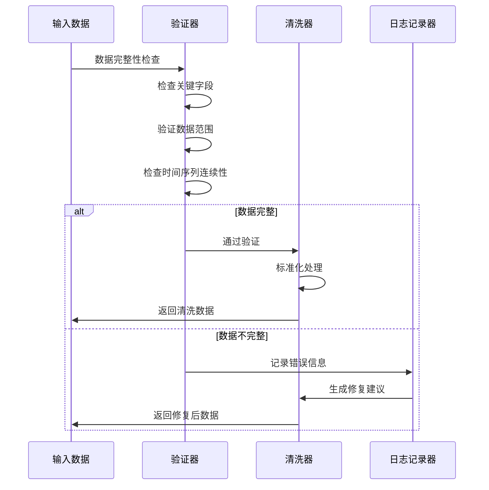

# 数据预处理

<cite>
**本文档引用的文件**
- [interface.py](file://tradingagents/dataflows/interface.py)
- [utils.py](file://tradingagents/dataflows/utils.py)
- [chinese_finance_utils.py](file://tradingagents/dataflows/chinese_finance_utils.py)
- [stockstats_utils.py](file://tradingagents/dataflows/stockstats_utils.py)
- [stock_data_service.py](file://tradingagents/dataflows/stock_data_service.py)
- [tushare_adapter.py](file://tradingagents/dataflows/tushare_adapter.py)
- [data_source_manager.py](file://tradingagents/dataflows/data_source_manager.py)
- [cache_manager.py](file://tradingagents/dataflows/cache_manager.py)
- [optimized_china_data.py](file://tradingagents/dataflows/optimized_china_data.py)
- [config.py](file://tradingagents/dataflows/config.py)
</cite>

## 目录
1. [概述](#概述)
2. [数据预处理架构](#数据预处理架构)
3. [统一数据结构规范](#统一数据结构规范)
4. [数据清洗与标准化](#数据清洗与标准化)
5. [技术指标计算](#技术指标计算)
6. [数据源整合](#数据源整合)
7. [缓存与性能优化](#缓存与性能优化)
8. [错误检测与修复](#错误检测与修复)
9. [数据标准化示例](#数据标准化示例)
10. [最佳实践](#最佳实践)

## 概述

TradingAgents-CN的数据预处理系统是一个高度集成的金融数据处理框架，负责从多个API源获取原始数据，通过标准化、清洗和验证流程，最终生成可供智能体分析的统一格式数据。该系统具备强大的容错能力、缓存机制和多数据源降级策略。

### 核心特性

- **多源数据聚合**：支持Tushare、AKShare、BaoStock等多种A股数据源
- **统一数据格式**：标准化所有数据源的输出格式
- **智能缓存**：多层次缓存策略提升性能
- **错误恢复**：完善的降级机制和错误处理
- **实时监控**：详细的日志记录和性能监控

## 数据预处理架构


**图表来源**
- [data_source_manager.py](file://tradingagents/dataflows/data_source_manager.py#L1-L50)
- [tushare_adapter.py](file://tradingagents/dataflows/tushare_adapter.py#L1-L50)

## 统一数据结构规范

### 核心数据接口

系统定义了一套统一的数据结构规范，确保不同数据源的数据能够无缝集成：


**图表来源**
- [interface.py](file://tradingagents/dataflows/interface.py#L1-L100)
- [data_source_manager.py](file://tradingagents/dataflows/data_source_manager.py#L20-L80)

### 字段映射规则

| 原始字段名 | 标准化字段名 | 数据类型 | 描述 |
|------------|--------------|----------|------|
| trade_date | date | datetime | 交易日期 |
| ts_code | code | string | 股票代码 |
| symbol | symbol | string | 股票符号 |
| open | open | float | 开盘价 |
| high | high | float | 最高价 |
| low | low | float | 最低价 |
| close | close | float | 收盘价 |
| vol | volume | float | 成交量 |
| amount | amount | float | 成交金额 |
| pct_chg | pct_change | float | 涨跌幅百分比 |
| change | change | float | 涨跌额 |

**章节来源**
- [tushare_adapter.py](file://tradingagents/dataflows/tushare_adapter.py#L214-L244)

## 数据清洗与标准化

### 空值处理策略

系统采用多层次的空值处理机制：


**图表来源**
- [tushare_adapter.py](file://tradingagents/dataflows/tushare_adapter.py#L269-L293)

### 类型转换机制

系统自动处理不同类型的数据转换：

```python
# 日期格式统一
data['date'] = pd.to_datetime(data['date'])

# 数值类型标准化
columns_to_convert = ['open', 'high', 'low', 'close', 'volume', 'amount']
for col in columns_to_convert:
    data[col] = pd.to_numeric(data[col], errors='coerce')

# 字符串标准化
data['code'] = data['code'].str.strip().str.upper()
```

**章节来源**
- [tushare_adapter.py](file://tradingagents/dataflows/tushare_adapter.py#L246-L267)

### 重复数据处理


**图表来源**
- [optimized_china_data.py](file://tradingagents/dataflows/optimized_china_data.py#L100-L200)

## 技术指标计算

### MACD指标计算

系统使用stockstats库进行技术指标计算：


**图表来源**
- [stockstats_utils.py](file://tradingagents/dataflows/stockstats_utils.py#L1-L50)

### RSI相对强弱指数

```python
# RSI计算公式
rsi = 100 - (100 / (1 + average_gain / average_loss))

# 参数配置
rsi_periods = [14, 21, 30]

# 状态判断
OVERBOUGHT = 70
OVERSOLD = 30
```

**章节来源**
- [interface.py](file://tradingagents/dataflows/interface.py#L600-L700)

### 其他技术指标

| 指标名称 | 计算周期 | 应用场景 | 阈值参考 |
|----------|----------|----------|----------|
| MA | 5, 10, 20, 60 | 趋势分析 | 金叉买入，死叉卖出 |
| MACD | 12, 26, 9 | 动量分析 | 柱状图正负值 |
| RSI | 14 | 超买超卖 | 30-70区间 |
| BOLL | 20 | 波动率分析 | 上轨压力，下轨支撑 |
| KDJ | 9, 3, 3 | 随机指标 | 20-80区间 |

## 数据源整合

### 多数据源降级机制


**图表来源**
- [data_source_manager.py](file://tradingagents/dataflows/data_source_manager.py#L400-L500)

### 数据源配置

```python
# 默认数据源优先级
DEFAULT_SOURCES = [
    ChinaDataSource.AKSHARE,      # 第一优先级：国内数据源
    ChinaDataSource.TUSHARE,      # 第二优先级：Tushare
    ChinaDataSource.BAOSTOCK      # 第三优先级：BaoStock
]

# 环境变量配置
os.environ.get('DEFAULT_CHINA_DATA_SOURCE', 'akshare')
```

**章节来源**
- [data_source_manager.py](file://tradingagents/dataflows/data_source_manager.py#L50-L100)

## 缓存与性能优化

### 缓存层次结构


**图表来源**
- [cache_manager.py](file://tradingagents/dataflows/cache_manager.py#L20-L80)

### 缓存策略配置

| 数据类型 | TTL(小时) | 文件格式 | 压缩 | 大小限制 |
|----------|-----------|----------|------|----------|
| 股票数据 | 1-24 | CSV | 是 | 50MB |
| 新闻数据 | 4-24 | TXT | 是 | 100MB |
| 基本面数据 | 12-72 | JSON | 是 | 20MB |
| 技术指标 | 2-12 | HDF5 | 是 | 30MB |

**章节来源**
- [cache_manager.py](file://tradingagents/dataflows/cache_manager.py#L60-L120)

### 性能监控

```python
# 缓存命中率统计
cache_stats = {
    'hit_rate': cache_hits / (cache_hits + cache_misses),
    'average_response_time': sum(response_times) / len(response_times),
    'total_cache_size': get_total_cache_size(),
    'cache_efficiency': calculate_efficiency()
}

# 数据质量监控
quality_metrics = {
    'data_completeness': calculate_completeness(data),
    'data_accuracy': validate_accuracy(data),
    'data_timeliness': check_timeliness(data)
}
```

## 错误检测与修复

### 异常成交量检测


**图表来源**
- [optimized_china_data.py](file://tradingagents/dataflows/optimized_china_data.py#L300-L400)

### 价格跳跃校正

```python
def detect_price_jumps(data, threshold=0.1):
    """
    检测价格跳跃异常
    threshold: 价格跳跃阈值(10%)
    """
    price_changes = data['close'].pct_change()
    jump_indices = price_changes.abs() > threshold
    
    return data[jump_indices]

def correct_price_jumps(data, method='interpolation'):
    """
    价格跳跃校正方法
    """
    if method == 'interpolation':
        # 使用插值法修复
        data['close'] = data['close'].interpolate()
    elif method == 'moving_average':
        # 使用移动平均平滑
        data['close'] = data['close'].rolling(window=5).mean()
    
    return data
```

### 数据完整性验证



**图表来源**
- [optimized_china_data.py](file://tradingagents/dataflows/optimized_china_data.py#L500-L600)

## 数据标准化示例

### 标准化前后对比

#### 原始数据（Tushare格式）
```json
{
    "trade_date": "2024-01-02",
    "ts_code": "000001.SZ",
    "open": 15.25,
    "high": 15.50,
    "low": 15.10,
    "close": 15.35,
    "vol": 12000000,
    "amount": 184800000.0,
    "pct_chg": 1.32
}
```

#### 标准化后数据
```json
{
    "date": "2024-01-02",
    "code": "000001",
    "symbol": "平安银行",
    "open": 15.25,
    "high": 15.50,
    "low": 15.10,
    "close": 15.35,
    "volume": 12000000,
    "amount": 184800000.0,
    "pct_change": 1.32,
    "change": 0.20,
    "market": "深圳",
    "industry": "银行业"
}
```

### 日期格式统一

```python
# 原始日期格式
date_formats = [
    "2024-01-02",
    "02/01/2024",
    "20240102",
    "Jan 2, 2024"
]

# 统一转换为ISO格式
normalized_dates = pd.to_datetime(raw_dates).dt.strftime('%Y-%m-%d')
```

### 价格单位归一化

```python
# 原始价格数据
price_units = {
    '股票价格': '元',
    '债券价格': '元',
    '基金净值': '元',
    '期货价格': '元/吨'
}

# 归一化处理
def normalize_prices(price, unit):
    conversion_rates = {
        '元': 1.0,
        '千元': 1000.0,
        '万元': 10000.0
    }
    
    return price * conversion_rates.get(unit, 1.0)
```

**章节来源**
- [tushare_adapter.py](file://tradingagents/dataflows/tushare_adapter.py#L214-L267)

## 最佳实践

### 数据质量保证

1. **多层验证机制**
   - 字段完整性检查
   - 数据范围验证
   - 时间序列连续性检查
   - 异常值检测

2. **缓存策略优化**
   - 热点数据优先缓存
   - TTL动态调整
   - 分层存储策略
   - 自动清理机制

3. **错误处理原则**
   - 优雅降级
   - 错误日志记录
   - 用户友好的错误提示
   - 自动重试机制

### 性能优化建议

1. **并发处理**
   ```python
   # 使用线程池处理多个数据源
   with ThreadPoolExecutor(max_workers=5) as executor:
       futures = [executor.submit(get_data, source) for source in data_sources]
       results = [future.result() for future in futures]
   ```

2. **批量操作**
   ```python
   # 批量数据处理
   batch_size = 1000
   for i in range(0, len(data), batch_size):
       batch = data[i:i+batch_size]
       process_batch(batch)
   ```

3. **内存管理**
   ```python
   # 及时释放内存
   del large_dataset
   gc.collect()
   
   # 使用生成器处理大数据
   def process_large_data(file_path):
       with open(file_path, 'r') as f:
           for line in f:
               yield process_line(line)
   ```

### 监控与维护

1. **关键指标监控**
   - 数据获取成功率
   - 平均响应时间
   - 缓存命中率
   - 错误率统计

2. **定期维护任务**
   - 缓存清理
   - 数据质量检查
   - 性能基准测试
   - 依赖库更新

通过这套完整的数据预处理系统，TradingAgents-CN能够确保从多个数据源获取的金融数据具有一致性、准确性和可靠性，为后续的智能分析提供高质量的数据基础。