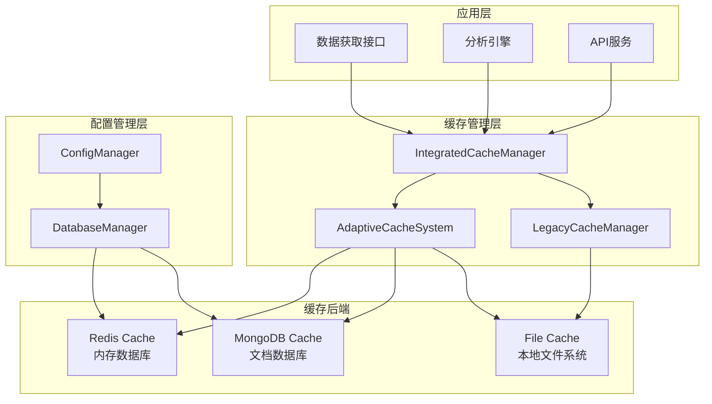
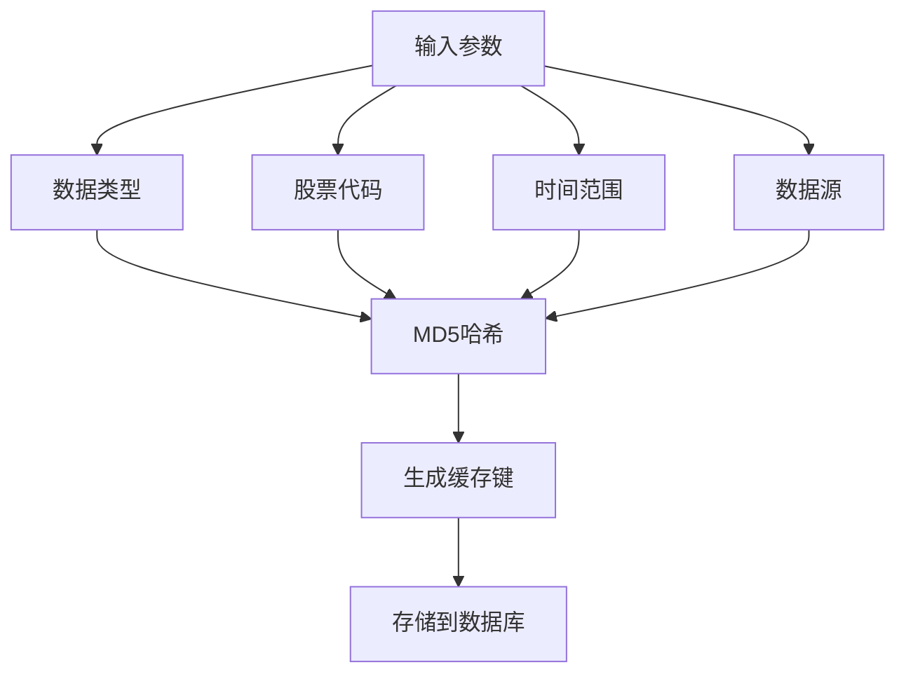
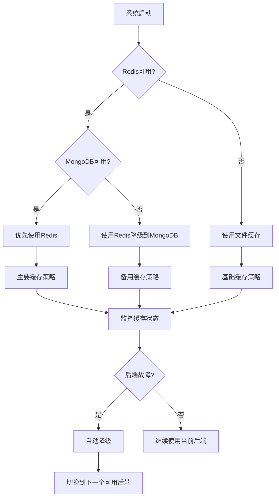
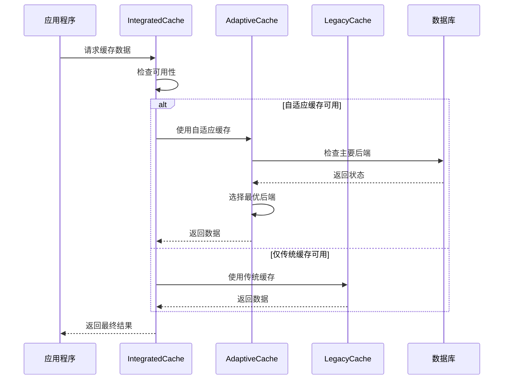
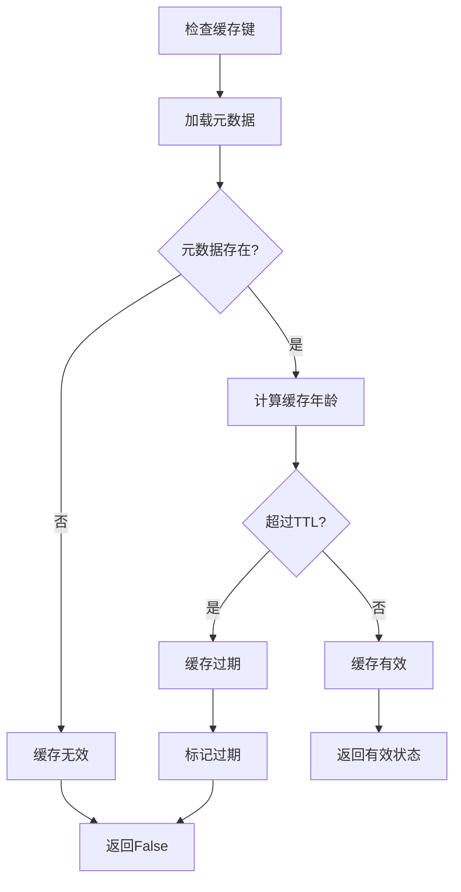
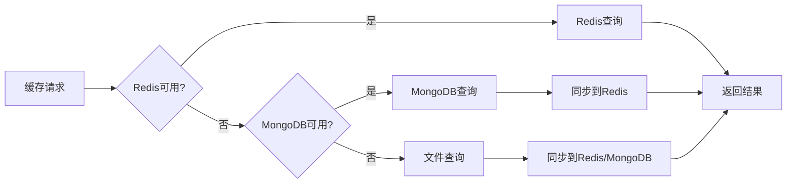
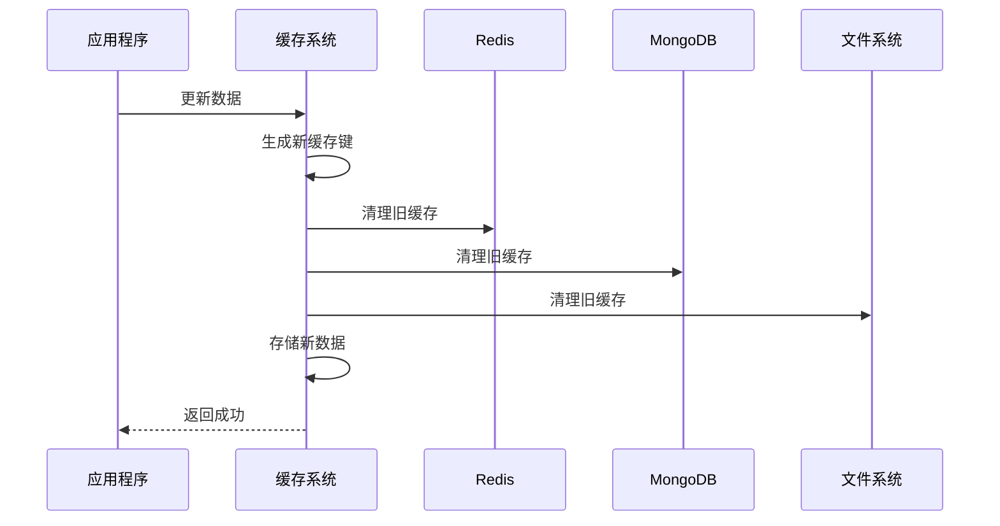
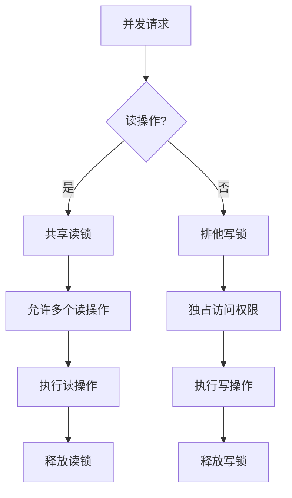
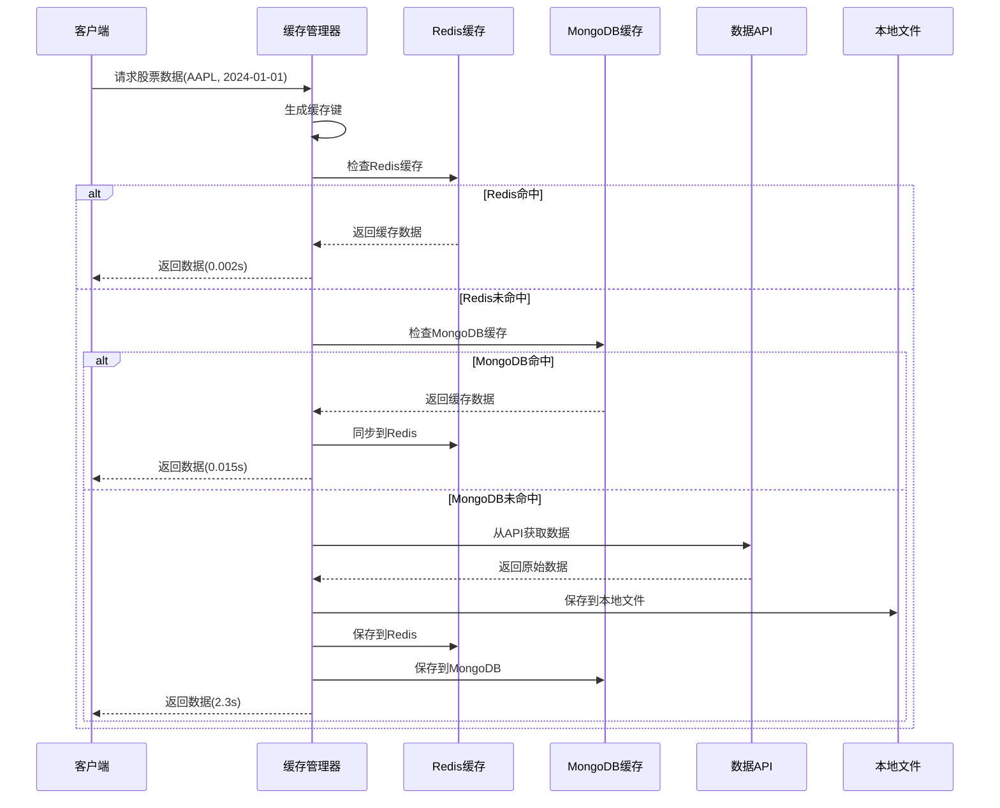
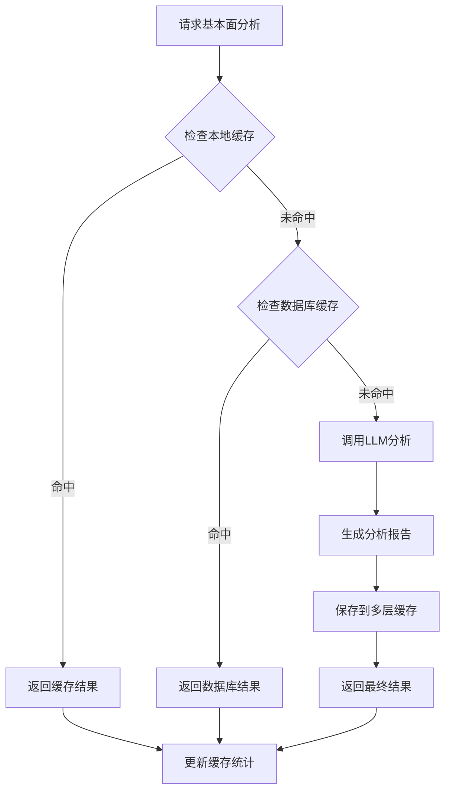

# TradingAgents-CN 缓存管理系统

<cite>
**本文档引用的文件**
- [cache_manager.py](file://tradingagents/dataflows/cache_manager.py)
- [db_cache_manager.py](file://tradingagents/dataflows/db_cache_manager.py)
- [adaptive_cache.py](file://tradingagents/dataflows/adaptive_cache.py)
- [integrated_cache.py](file://tradingagents/dataflows/integrated_cache.py)
- [database_manager.py](file://tradingagents/config/database_manager.py)
- [config_manager.py](file://tradingagents/config/config_manager.py)
- [optimized_us_data.py](file://tradingagents/dataflows/optimized_us_data.py)
- [interface.py](file://tradingagents/dataflows/interface.py)
- [test_fundamentals_cache.py](file://tests/test_fundamentals_cache.py)
- [test_cache_optimization.py](file://tests/test_cache_optimization.py)
</cite>

## 目录
1. [概述](#概述)
2. [系统架构](#系统架构)
3. [核心组件详解](#核心组件详解)
4. [缓存策略与算法](#缓存策略与算法)
5. [多层缓存协同机制](#多层缓存协同机制)
6. [性能优化与调优](#性能优化与调优)
7. [实际应用示例](#实际应用示例)
8. [故障排除与监控](#故障排除与监控)
9. [最佳实践指南](#最佳实践指南)

## 概述

TradingAgents-CN的缓存管理系统是一个多层次、智能化的缓存解决方案，旨在优化股票数据获取性能，减少API调用频率，并提供可靠的数据持久化能力。系统采用自适应缓存策略，能够根据可用资源自动选择最优的缓存后端。

### 主要特性

- **多层缓存架构**：文件缓存、Redis缓存、MongoDB缓存的无缝集成
- **智能降级机制**：当高级缓存不可用时自动降级到基础缓存
- **自适应缓存策略**：根据数据类型和市场自动调整缓存策略
- **TTL智能管理**：基于数据新鲜度的动态缓存失效机制
- **跨平台兼容**：支持Windows、Linux、macOS等多种操作系统

## 系统架构



**架构图来源**
- [integrated_cache.py](file://tradingagents/dataflows/integrated_cache.py#L1-L50)
- [adaptive_cache.py](file://tradingagents/dataflows/adaptive_cache.py#L1-L50)
- [database_manager.py](file://tradingagents/config/database_manager.py#L1-L50)

## 核心组件详解

### 1. 传统文件缓存系统 (StockDataCache)

传统文件缓存系统是系统的基础层，提供可靠的本地文件存储能力。

#### 核心功能

- **市场分类存储**：按美股和A股分别存储数据
- **多数据类型支持**：支持股票数据、新闻数据、基本面数据
- **智能TTL管理**：不同数据类型的缓存有效期不同
- **内容长度检查**：防止过大数据导致的缓存问题

#### 缓存配置表

| 数据类型 | TTL小时 | 最大文件数 | 描述 |
|---------|---------|-----------|------|
| 美股股票数据 | 2 | 1000 | 实时性要求高 |
| A股股票数据 | 1 | 1000 | 实时性要求最高 |
| 美股新闻 | 6 | 500 | 新闻时效性中等 |
| A股新闻 | 4 | 500 | 新闻时效性较高 |
| 美股基本面 | 24 | 200 | 基本面数据长期有效 |
| A股基本面 | 12 | 200 | 基本面数据短期有效 |

**节来源**
- [cache_manager.py](file://tradingagents/dataflows/cache_manager.py#L60-L90)

### 2. 数据库缓存系统 (DatabaseCacheManager)

数据库缓存系统提供高性能的分布式缓存能力，支持Redis和MongoDB两种存储后端。

#### 核心特性

- **双后端支持**：同时支持Redis和MongoDB
- **自动索引创建**：为常用查询字段创建索引
- **数据格式优化**：支持DataFrame JSON和文本格式
- **过期策略**：自动清理过期数据

#### 缓存键生成策略



**流程图来源**
- [db_cache_manager.py](file://tradingagents/dataflows/db_cache_manager.py#L120-L140)

**节来源**
- [db_cache_manager.py](file://tradingagents/dataflows/db_cache_manager.py#L100-L200)

### 3. 自适应缓存系统 (AdaptiveCacheSystem)

自适应缓存系统是最先进的缓存解决方案，能够根据系统状态自动选择最优的缓存后端。

#### 智能后端选择



**流程图来源**
- [adaptive_cache.py](file://tradingagents/dataflows/adaptive_cache.py#L18-L55)

#### TTL智能管理

自适应缓存系统根据股票市场类型自动调整缓存时间：

- **A股股票数据**：7200秒（2小时）
- **美股股票数据**：7200秒（2小时）
- **A股基本面**：86400秒（24小时）
- **美股基本面**：86400秒（24小时）

**节来源**
- [adaptive_cache.py](file://tradingagents/dataflows/adaptive_cache.py#L55-L85)

### 4. 集成缓存管理器 (IntegratedCacheManager)

集成缓存管理器是系统的统一入口，提供向后兼容的接口和智能缓存选择。

#### 缓存策略选择逻辑



**序列图来源**
- [integrated_cache.py](file://tradingagents/dataflows/integrated_cache.py#L50-L100)

**节来源**
- [integrated_cache.py](file://tradingagents/dataflows/integrated_cache.py#L15-L50)

## 缓存策略与算法

### 1. 缓存键生成算法

系统采用MD5哈希算法生成唯一的缓存键，确保缓存的准确性和唯一性。

#### 传统缓存键生成

```python
# 传统缓存键生成逻辑
params_str = f"{data_type}_{symbol}"
for key, value in sorted(kwargs.items()):
    params_str += f"_{key}_{value}"
cache_key = hashlib.md5(params_str.encode()).hexdigest()[:12]
```

#### 自适应缓存键生成

```python
# 自适应缓存键生成逻辑
key_data = f"{symbol}_{start_date}_{end_date}_{data_source}_{data_type}"
return hashlib.md5(key_data.encode()).hexdigest()
```

**节来源**
- [cache_manager.py](file://tradingagents/dataflows/cache_manager.py#L175-L185)
- [adaptive_cache.py](file://tradingagents/dataflows/adaptive_cache.py#L40-L50)

### 2. 数据新鲜度判断算法

系统实现了基于时间戳的智能缓存失效机制。

#### TTL检查算法



**流程图来源**
- [cache_manager.py](file://tradingagents/dataflows/cache_manager.py#L250-L280)

### 3. 内存缓存预热策略

系统支持多种缓存预热机制：

- **启动时预热**：系统启动时加载常用数据
- **定时预热**：定期预热热点数据
- **事件触发预热**：基于用户行为预热数据

**节来源**
- [adaptive_cache.py](file://tradingagents/dataflows/adaptive_cache.py#L200-L250)

### 4. 磁盘缓存持久化

传统文件缓存系统提供了完整的磁盘持久化机制：

- **自动目录结构**：按数据类型和市场分类存储
- **文件命名规范**：标准化的文件命名格式
- **压缩存储**：支持数据压缩以节省空间
- **定期清理**：自动清理过期文件

**节来源**
- [cache_manager.py](file://tradingagents/dataflows/cache_manager.py#L300-L350)

## 多层缓存协同机制

### 1. 读取顺序优化

系统按照以下优先级顺序查找缓存数据：

1. **Redis缓存**（最快）
2. **MongoDB缓存**（较快）
3. **本地文件缓存**（较慢）



**流程图来源**
- [db_cache_manager.py](file://tradingagents/dataflows/db_cache_manager.py#L200-L250)

### 2. 写入一致性保证

系统确保多层缓存的一致性：

- **原子性操作**：写入操作要么全部成功，要么全部失败
- **版本控制**：使用时间戳确保数据版本一致性
- **冲突解决**：当多个缓存层出现不一致时，采用最新数据

### 3. 缓存失效传播

当数据更新时，系统会自动使相关缓存失效：



**序列图来源**
- [integrated_cache.py](file://tradingagents/dataflows/integrated_cache.py#L200-L250)

**节来源**
- [integrated_cache.py](file://tradingagents/dataflows/integrated_cache.py#L100-L150)

## 性能优化与调优

### 1. 缓存命中率优化

#### 键值设计规范

- **紧凑性原则**：使用简短的键名
- **语义化命名**：键名应清晰表达含义
- **避免冲突**：确保键的唯一性

#### 缓存预热策略

```python
# 示例：批量预热热门股票数据
def warmup_cache_for_symbols(symbols, start_date, end_date):
    provider = get_optimized_us_data_provider()
    for symbol in symbols:
        provider.get_stock_data(symbol, start_date, end_date, force_refresh=True)
```

**节来源**
- [optimized_us_data.py](file://tradingagents/dataflows/optimized_us_data.py#L300-L350)

### 2. 批量缓存操作

系统支持高效的批量缓存操作：

- **批量写入**：一次性写入多个缓存项
- **批量读取**：同时获取多个缓存项
- **批量清理**：批量删除过期缓存

### 3. 并发访问控制

#### 读写锁机制



**流程图来源**
- [db_cache_manager.py](file://tradingagents/dataflows/db_cache_manager.py#L300-L350)

#### 乐观锁策略

对于高并发场景，系统采用乐观锁机制：

- **版本检查**：每次更新前检查数据版本
- **冲突检测**：发现冲突时重试操作
- **自动补偿**：自动处理并发冲突

**节来源**
- [db_cache_manager.py](file://tradingagents/dataflows/db_cache_manager.py#L350-L400)

### 4. 内存使用优化

#### 内存池管理

- **对象复用**：重用缓存对象以减少GC压力
- **内存映射**：大文件使用内存映射技术
- **垃圾回收优化**：合理配置JVM参数

#### 缓存大小控制

```python
# 示例：动态调整缓存大小
def adjust_cache_size(current_load, target_size):
    if current_load > 0.8:
        # 负载过高，缩小缓存
        return target_size * 0.8
    elif current_load < 0.3:
        # 负载过低，扩大缓存
        return target_size * 1.2
    return target_size
```

### 5. 网络优化

#### 连接池管理

- **连接复用**：数据库连接池复用
- **超时控制**：合理的连接超时设置
- **健康检查**：定期检查连接状态

#### 数据压缩

- **传输压缩**：网络传输数据压缩
- **存储压缩**：磁盘存储数据压缩
- **选择性压缩**：根据数据特征选择压缩算法

**节来源**
- [database_manager.py](file://tradingagents/config/database_manager.py#L100-L150)

## 实际应用示例

### 1. 股票数据请求完整调用链

以下是一个完整的股票数据请求示例，展示了缓存系统如何拦截和响应请求：



**序列图来源**
- [optimized_us_data.py](file://tradingagents/dataflows/optimized_us_data.py#L50-L100)

### 2. 基本面数据分析缓存流程



**流程图来源**
- [test_fundamentals_cache.py](file://tests/test_fundamentals_cache.py#L50-L100)

### 3. 缓存统计监控

系统提供详细的缓存统计信息：

```python
# 缓存统计示例
{
    "cache_system": "adaptive",
    "adaptive_cache": {
        "primary_backend": "redis",
        "fallback_enabled": True,
        "mongodb_available": True,
        "redis_available": True,
        "file_cache_count": 156
    },
    "legacy_cache": {
        "total_files": 245,
        "stock_data_count": 120,
        "news_count": 85,
        "fundamentals_count": 40,
        "total_size_mb": 12.5,
        "skipped_count": 5
    }
}
```

**节来源**
- [integrated_cache.py](file://tradingagents/dataflows/integrated_cache.py#L250-L300)

## 故障排除与监控

### 1. 常见问题诊断

#### 缓存未命中问题

**症状**：频繁从API获取数据，缓存命中率低

**诊断步骤**：
1. 检查缓存键生成是否正确
2. 验证TTL设置是否合理
3. 确认缓存后端是否正常工作
4. 检查缓存清理策略

**解决方案**：
```python
# 调试缓存键生成
def debug_cache_key(symbol, start_date, end_date):
    cache = get_cache()
    key = cache._generate_cache_key("stock_data", symbol, 
                                  start_date=start_date, 
                                  end_date=end_date)
    print(f"生成的缓存键: {key}")
    return key
```

#### 性能问题排查

**症状**：缓存响应时间过长

**诊断方法**：
1. 监控各缓存后端的响应时间
2. 检查网络连接状态
3. 分析数据库查询性能
4. 监控系统资源使用情况

### 2. 监控指标体系

#### 关键性能指标(KPI)

- **缓存命中率**：缓存命中的请求比例
- **平均响应时间**：缓存操作的平均耗时
- **缓存大小**：当前缓存占用的空间
- **错误率**：缓存操作失败的比例

#### 监控仪表板

```python
# 缓存监控示例
def get_cache_monitoring_data():
    cache = get_cache()
    stats = cache.get_cache_stats()
    
    return {
        "命中率": calculate_hit_rate(),
        "平均响应时间": stats["average_response_time"],
        "缓存大小": f"{stats['total_size_mb']}MB",
        "错误率": stats["error_rate"],
        "后端状态": {
            "redis": cache.is_redis_available(),
            "mongodb": cache.is_mongodb_available(),
            "file": True  # 文件缓存总是可用
        }
    }
```

### 3. 自动故障恢复

系统具备自动故障恢复能力：

- **后端检测**：定期检测缓存后端状态
- **自动切换**：后端故障时自动切换到备用后端
- **健康检查**：持续监控系统健康状态
- **告警通知**：故障发生时及时通知管理员

**节来源**
- [database_manager.py](file://tradingagents/config/database_manager.py#L200-L250)

## 最佳实践指南

### 1. 缓存配置优化

#### 生产环境配置建议

```python
# 推荐的生产环境配置
production_config = {
    "cache": {
        "primary_backend": "redis",  # 优先使用Redis
        "fallback_enabled": True,    # 启用降级机制
        "ttl_settings": {
            "us_stock_data": 7200,      # 2小时
            "china_stock_data": 3600,   # 1小时
            "us_news": 21600,           # 6小时
            "china_news": 14400,        # 4小时
            "us_fundamentals": 86400,   # 24小时
            "china_fundamentals": 43200 # 12小时
        }
    },
    "database": {
        "mongodb": {
            "enabled": True,
            "host": "mongodb-cluster.example.com",
            "port": 27017,
            "timeout": 5000
        },
        "redis": {
            "enabled": True,
            "host": "redis-cluster.example.com",
            "port": 6379,
            "timeout": 2000
        }
    }
}
```

### 2. 数据库连接优化

#### 连接池配置

```python
# 数据库连接池优化
database_config = {
    "mongodb": {
        "pool_size": 10,              # 连接池大小
        "max_pool_size": 50,          # 最大连接数
        "min_pool_size": 5,           # 最小连接数
        "max_idle_time_seconds": 300, # 连接最大空闲时间
        "wait_queue_timeout_ms": 5000 # 等待队列超时
    },
    "redis": {
        "max_connections": 20,        # 最大连接数
        "retry_on_timeout": True,     # 超时时重试
        "health_check_interval": 30   # 健康检查间隔
    }
}
```

### 3. 缓存清理策略

#### 自动清理配置

```python
# 缓存清理策略
cleanup_config = {
    "daily_cleanup": {
        "enabled": True,
        "schedule": "0 2 * * *",  # 每天凌晨2点执行
        "max_age_days": 7,        # 保留7天内的缓存
        "min_free_space": "20%"   # 保持至少20%的磁盘空间
    },
    "weekly_cleanup": {
        "enabled": True,
        "schedule": "0 3 * * 0",  # 每周日凌晨3点执行
        "max_age_days": 30,       # 保留30天内的缓存
        "cleanup_strategy": "aggressive"  # 激进清理策略
    }
}
```

### 4. 性能调优建议

#### 系统级优化

1. **硬件配置**：
   - 使用SSD硬盘提升文件缓存性能
   - 增加内存容量支持更大缓存
   - 配置高速网络连接

2. **操作系统优化**：
   - 调整文件描述符限制
   - 优化TCP参数
   - 配置合适的文件系统

3. **JVM优化**（如适用）：
   - 合理设置堆内存大小
   - 选择合适的垃圾收集器
   - 调整新生代和老年代比例

#### 应用级优化

1. **缓存策略优化**：
   - 根据业务特点调整TTL设置
   - 实施预热策略
   - 使用批量操作

2. **网络优化**：
   - 启用连接复用
   - 配置合适的超时时间
   - 使用CDN加速静态资源

3. **代码优化**：
   - 减少不必要的缓存操作
   - 使用异步处理
   - 实施合理的错误处理

### 5. 安全最佳实践

#### 访问控制

```python
# 缓存安全配置
security_config = {
    "access_control": {
        "enabled": True,
        "whitelist_ips": ["192.168.1.0/24", "10.0.0.0/8"],
        "rate_limit": {
            "requests_per_minute": 1000,
            "burst_size": 100
        }
    },
    "data_encryption": {
        "enabled": True,
        "algorithm": "AES-256-GCM",
        "rotation_period": 90  # 90天轮换密钥
    }
}
```

#### 数据保护

1. **敏感数据过滤**：不在缓存中存储敏感信息
2. **数据脱敏**：对缓存数据进行适当脱敏
3. **审计日志**：记录所有缓存操作
4. **备份策略**：定期备份缓存数据

**节来源**
- [config_manager.py](file://tradingagents/config/config_manager.py#L600-L700)

### 6. 监控与告警

#### 关键监控指标

```python
# 监控指标配置
monitoring_config = {
    "metrics": {
        "cache_hit_rate": {
            "threshold": 0.8,
            "alert_email": "ops@example.com"
        },
        "response_time": {
            "p95_threshold": 1000,  # 1秒
            "p99_threshold": 5000   # 5秒
        },
        "storage_utilization": {
            "warning_threshold": 0.8,
            "critical_threshold": 0.9
        }
    },
    "alerts": {
        "enabled": True,
        "channels": ["email", "slack", "pagerduty"],
        "escalation_policy": {
            "level1": {"timeout": 5, "escalate_to": "level2"},
            "level2": {"timeout": 15, "escalate_to": "manager"}
        }
    }
}
```

通过遵循这些最佳实践，可以确保TradingAgents-CN缓存系统的高效、稳定和安全运行，为用户提供优质的股票数据分析服务。