# TradingAgents-CN 系统架构文档

<cite>
**本文档引用的文件**
- [README.md](file://README.md)
- [main.py](file://main.py)
- [tradingagents/__init__.py](file://tradingagents/__init__.py)
- [tradingagents/graph/setup.py](file://tradingagents/graph/setup.py)
- [tradingagents/graph/trading_graph.py](file://tradingagents/graph/trading_graph.py)
- [tradingagents/default_config.py](file://tradingagents/default_config.py)
- [web/app.py](file://web/app.py)
- [cli/main.py](file://cli/main.py)
- [tradingagents/config/config_manager.py](file://tradingagents/config/config_manager.py)
- [tradingagents/dataflows/interface.py](file://tradingagents/dataflows/interface.py)
- [tradingagents/llm_adapters/dashscope_adapter.py](file://tradingagents/llm_adapters/dashscope_adapter.py)
- [tradingagents/tools/unified_news_tool.py](file://tradingagents/tools/unified_news_tool.py)
</cite>

## 目录
1. [概述](#概述)
2. [系统架构总览](#系统架构总览)
3. [核心组件分析](#核心组件分析)
4. [多智能体工作流架构](#多智能体工作流架构)
5. [数据流系统](#数据流系统)
6. [LLM适配器层](#llm适配器层)
7. [用户界面层](#用户界面层)
8. [配置管理系统](#配置管理系统)
9. [外部依赖关系](#外部依赖关系)
10. [设计决策与权衡](#设计决策与权衡)
11. [可扩展性与维护性](#可扩展性与维护性)
12. [总结](#总结)

## 概述

TradingAgents-CN 是一个基于多智能体大语言模型的中文金融交易决策框架，专为中文用户优化，提供完整的A股、港股和美股分析能力。系统采用LangGraph作为核心工作流引擎，实现了复杂的多智能体协作架构，支持多种LLM提供商，并提供了Web界面和CLI两种用户交互方式。

### 核心特性

- **多智能体协作架构**：基本面、技术面、新闻面、社交媒体四大分析师团队
- **结构化辩论机制**：看涨/看跌研究员进行深度分析，智能决策
- **多LLM提供商支持**：阿里百炼、DeepSeek、Google AI、OpenAI等
- **智能新闻分析**：基于AI的新闻过滤和质量评估系统
- **实时进度跟踪**：可视化分析过程，智能时间预估
- **专业报告导出**：支持Markdown/Word/PDF格式导出

## 系统架构总览

TradingAgents-CN 采用分层架构设计，从底层的数据源到顶层的用户界面，形成了完整的金融分析生态系统。

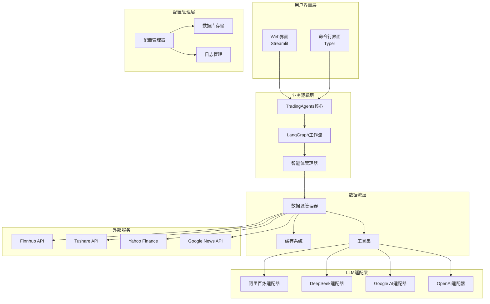

**架构图源文件**
- [web/app.py](file://web/app.py#L1-L50)
- [cli/main.py](file://cli/main.py#L1-L50)
- [tradingagents/graph/trading_graph.py](file://tradingagents/graph/trading_graph.py#L1-L100)

## 核心组件分析

### TradingAgents核心引擎

TradingAgents核心引擎是整个系统的大脑，负责协调各个智能体的工作。

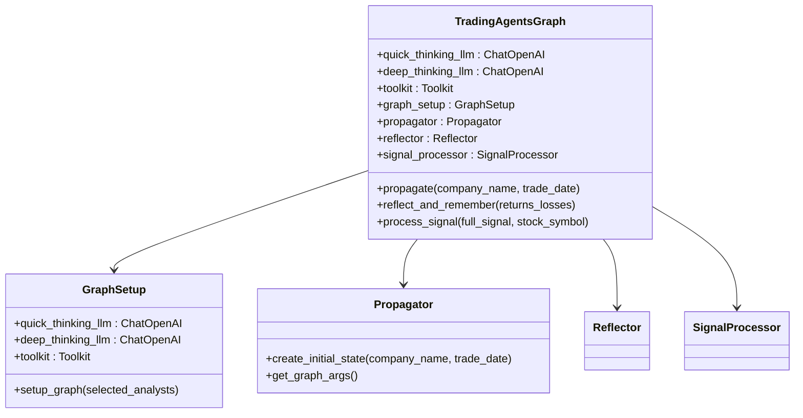

**类图源文件**
- [tradingagents/graph/trading_graph.py](file://tradingagents/graph/trading_graph.py#L30-L150)
- [tradingagents/graph/setup.py](file://tradingagents/graph/setup.py#L15-L80)

**章节源文件**
- [tradingagents/graph/trading_graph.py](file://tradingagents/graph/trading_graph.py#L30-L200)
- [tradingagents/graph/setup.py](file://tradingagents/graph/setup.py#L15-L100)

### 智能体团队架构

系统包含多个专业的智能体团队，每个团队都有特定的分析职责：

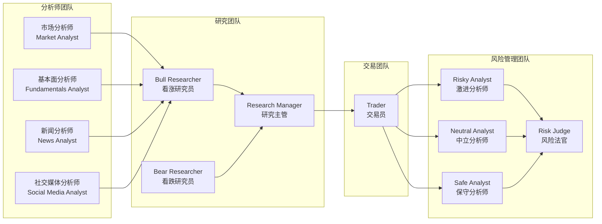

**架构图源文件**
- [tradingagents/graph/setup.py](file://tradingagents/graph/setup.py#L138-L180)
- [tradingagents/agents/__init__.py](file://tradingagents/agents/__init__.py#L1-L45)

**章节源文件**
- [tradingagents/graph/setup.py](file://tradingagents/graph/setup.py#L138-L250)
- [tradingagents/agents/__init__.py](file://tradingagents/agents/__init__.py#L1-L45)

## 多智能体工作流架构

### LangGraph工作流引擎

系统采用LangGraph作为核心工作流引擎，实现了复杂的多智能体协作机制。

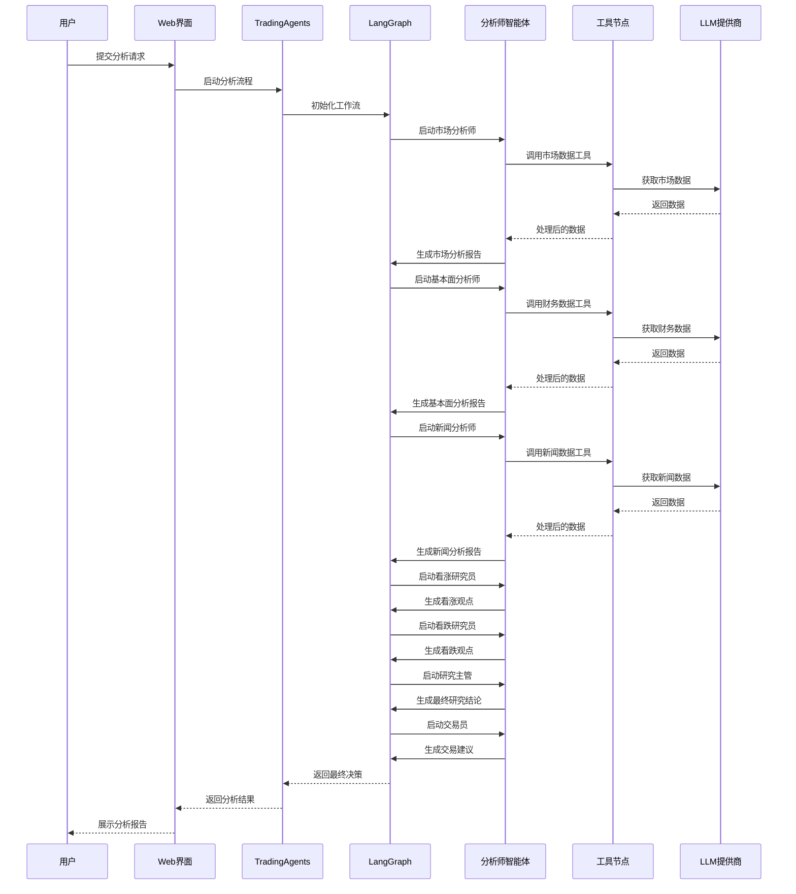

**序列图源文件**
- [tradingagents/graph/trading_graph.py](file://tradingagents/graph/trading_graph.py#L350-L440)
- [tradingagents/graph/setup.py](file://tradingagents/graph/setup.py#L200-L250)

### 条件逻辑与路由机制

系统实现了智能的条件逻辑和路由机制，确保工作流能够根据分析结果动态调整：

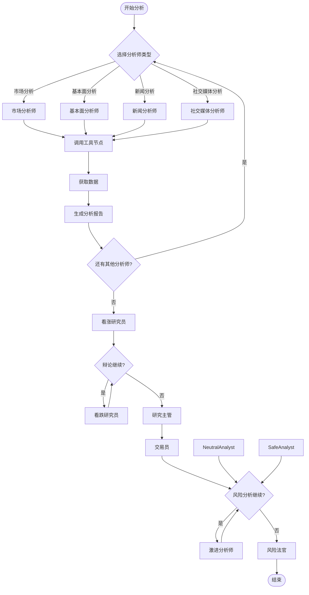

**流程图源文件**
- [tradingagents/graph/setup.py](file://tradingagents/graph/setup.py#L200-L250)
- [tradingagents/graph/conditional_logic.py](file://tradingagents/graph/conditional_logic.py)

**章节源文件**
- [tradingagents/graph/setup.py](file://tradingagents/graph/setup.py#L200-L254)
- [tradingagents/graph/propagation.py](file://tradingagents/graph/propagation.py#L1-L52)

## 数据流系统

### 统一数据接口层

系统通过统一的数据接口层整合多个数据源，提供标准化的数据获取能力：

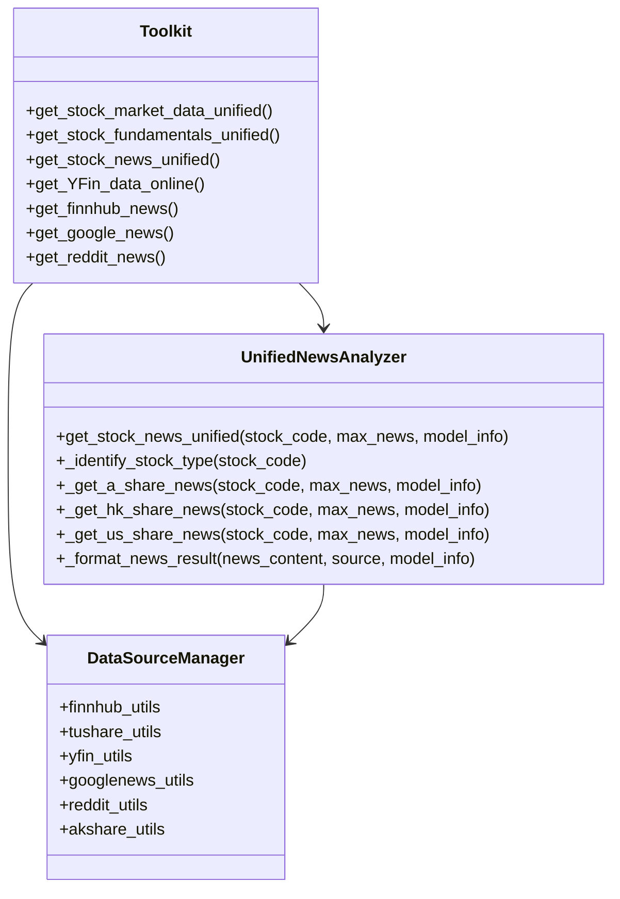

**类图源文件**
- [tradingagents/tools/unified_news_tool.py](file://tradingagents/tools/unified_news_tool.py#L15-L50)
- [tradingagents/dataflows/interface.py](file://tradingagents/dataflows/interface.py#L1-L50)

### 多数据源支持

系统支持多种数据源，确保数据的多样性和可靠性：

| 数据源类型 | 支持市场 | 主要功能 | 优先级 |
|-----------|---------|---------|--------|
| Finnhub API | 美股、部分港股 | 实时行情、新闻、财务数据 | 高 |
| Tushare API | A股 | 专业A股数据、财务报表 | 高 |
| Yahoo Finance | 全球市场 | 历史数据、财务指标 | 中 |
| Google News | 全球 | 实时新闻、趋势分析 | 中 |
| Reddit | 全球 | 社交媒体情绪 | 中 |
| AKShare | A股 | 开放数据源 | 低 |

**章节源文件**
- [tradingagents/dataflows/interface.py](file://tradingagents/dataflows/interface.py#L1-L200)
- [tradingagents/tools/unified_news_tool.py](file://tradingagents/tools/unified_news_tool.py#L1-L100)

## LLM适配器层

### 多提供商适配架构

系统实现了统一的LLM适配器架构，支持多种LLM提供商：

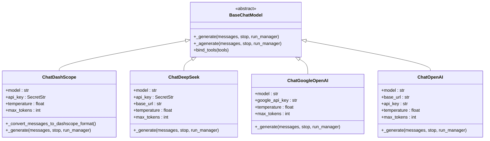

**类图源文件**
- [tradingagents/llm_adapters/dashscope_adapter.py](file://tradingagents/llm_adapters/dashscope_adapter.py#L25-L100)

### 模型选择与配置

系统提供了灵活的模型选择和配置机制：

| LLM提供商 | 支持模型 | 特色功能 | 适用场景 |
|----------|---------|---------|---------|
| 阿里百炼 | qwen-turbo/plus/max | 中文优化，成本效益高 | 日常分析、快速任务 |
| DeepSeek | deepseek-chat | 工具调用，性价比极高 | 复杂分析、专业任务 |
| Google AI | gemini-2.5-pro/flash | 最新旗舰，超快响应 | 实时分析、创新任务 |
| OpenAI | gpt-4o/claude | 顶级性能，平衡版本 | 高质量分析、重要决策 |

**章节源文件**
- [tradingagents/llm_adapters/dashscope_adapter.py](file://tradingagents/llm_adapters/dashscope_adapter.py#L1-L100)
- [tradingagents/config/config_manager.py](file://tradingagents/config/config_manager.py#L100-L200)

## 用户界面层

### Web界面架构

Web界面基于Streamlit构建，提供现代化的用户交互体验：

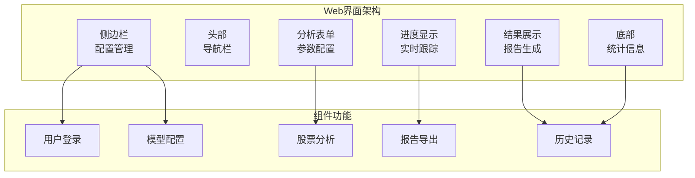

**架构图源文件**
- [web/app.py](file://web/app.py#L100-L200)

### CLI界面设计

CLI界面提供了命令行操作方式，适合自动化和批量处理：

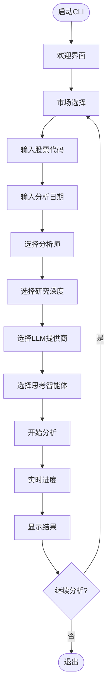

**流程图源文件**
- [cli/main.py](file://cli/main.py#L400-L600)

**章节源文件**
- [web/app.py](file://web/app.py#L1-L200)
- [cli/main.py](file://cli/main.py#L1-L200)

## 配置管理系统

### 配置管理架构

系统实现了完整的配置管理机制，支持多种配置方式：

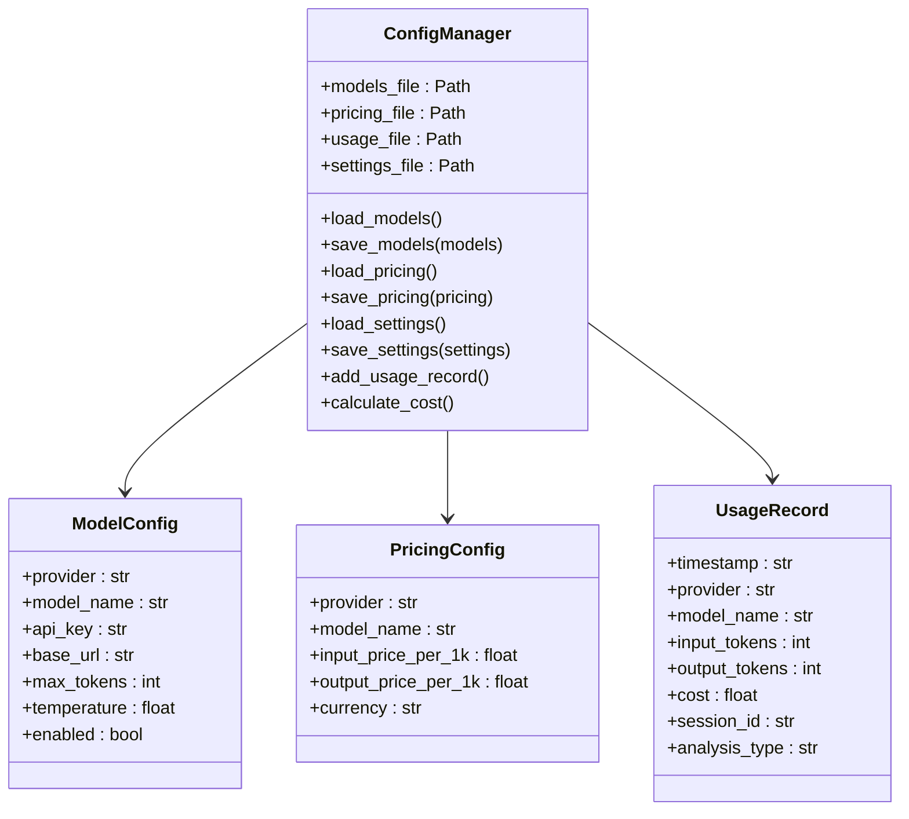

**类图源文件**
- [tradingagents/config/config_manager.py](file://tradingagents/config/config_manager.py#L30-L100)

### 环境配置与密钥管理

系统支持多种配置方式，确保灵活性和安全性：

| 配置方式 | 优先级 | 用途 | 示例 |
|---------|-------|------|------|
| 环境变量 | 最高 | API密钥、敏感配置 | `DASHSCOPE_API_KEY` |
| .env文件 | 高 | 一般配置 | `OPENAI_API_KEY` |
| JSON配置文件 | 中 | 模型配置、定价信息 | `models.json` |
| 默认配置 | 低 | 基础设置 | `DEFAULT_CONFIG` |

**章节源文件**
- [tradingagents/config/config_manager.py](file://tradingagents/config/config_manager.py#L1-L200)
- [tradingagents/default_config.py](file://tradingagents/default_config.py#L1-L28)

## 外部依赖关系

### 系统依赖图

TradingAgents-CN 依赖多个外部服务和库来提供完整的功能：

```mermaid
graph TB
subgraph "核心依赖"
LangChain[LangChain Core]
LangGraph[LangGraph]
Streamlit[Streamlit]
Typer[Typer CLI]
end
subgraph "LLM提供商"
DashScope[阿里百炼]
DeepSeek[DeepSeek]
GoogleAI[Google AI]
OpenAI[OpenAI]
end
subgraph "数据源"
Finnhub[Finnhub API]
Tushare[Tushare API]
YFinance[Yahoo Finance]
GoogleNews[Google News API]
Reddit[Reddit API]
end
subgraph "数据库"
MongoDB[MongoDB]
Redis[Redis]
end
subgraph "第三方库"
Pandas[Pandas]
NumPy[NumPy]
Requests[Requests]
OpenAI[OpenAI SDK]
end
TradingAgents --> LangChain
TradingAgents --> LangGraph
TradingAgents --> Streamlit
TradingAgents --> Typer
TradingAgents --> DashScope
TradingAgents --> DeepSeek
TradingAgents --> GoogleAI
TradingAgents --> OpenAI
TradingAgents --> Finnhub
TradingAgents --> Tushare
TradingAgents --> YFinance
TradingAgents --> GoogleNews
TradingAgents --> Reddit
TradingAgents --> MongoDB
TradingAgents --> Redis
TradingAgents --> Pandas
TradingAgents --> NumPy
TradingAgents --> Requests
TradingAgents --> OpenAI
```

**依赖图源文件**
- [requirements.txt](file://requirements.txt)
- [pyproject.toml](file://pyproject.toml)

### 数据库与缓存架构

系统支持多种数据存储方案，提供高性能的数据访问：

| 组件 | 用途 | 实现方式 | 性能特点 |
|------|------|---------|---------|
| MongoDB | 数据持久化 | 文档存储 | 高可用、自动备份 |
| Redis | 缓存加速 | 内存存储 | 超高速访问 |
| 文件系统 | 结果存储 | JSON/CSV | 简单可靠 |
| 内存缓存 | 临时数据 | Python字典 | 最快访问 |

**章节源文件**
- [tradingagents/config/config_manager.py](file://tradingagents/config/config_manager.py#L50-L150)

## 设计决策与权衡

### 选择LangGraph作为工作流引擎

**决策背景**：
- 需要实现复杂的多智能体协作机制
- 要求支持条件逻辑和动态路由
- 需要具备状态管理和错误恢复能力

**技术优势**：
1. **内置状态管理**：LangGraph提供了强大的状态管理功能，支持复杂的多智能体协作
2. **条件路由**：内置的条件逻辑支持动态工作流调整
3. **错误恢复**：完善的错误处理和恢复机制
4. **可视化调试**：支持工作流的可视化调试和监控

**替代方案对比**：
- **传统流程引擎**：缺乏LangGraph的灵活性和现代特性
- **自定义实现**：开发成本高，维护困难
- **其他框架**：不如LangGraph在LLM应用场景下成熟

### 多LLM提供商支持的设计权衡

**设计原则**：
1. **统一接口**：所有LLM提供商都实现相同的接口
2. **适配器模式**：使用适配器模式隔离LLM差异
3. **配置驱动**：通过配置文件管理LLM设置
4. **成本控制**：支持token追踪和成本预算

**权衡考虑**：
- **开发复杂度**：适配器模式增加了开发复杂度
- **运行时开销**：多层抽象可能带来性能损失
- **维护成本**：需要持续维护多个LLM适配器
- **功能一致性**：确保不同LLM提供商的功能一致性

### 数据源集成策略

**设计思路**：
1. **统一接口**：所有数据源都通过统一的工具接口访问
2. **优先级机制**：实现数据源的优先级和降级策略
3. **缓存优化**：多层缓存减少API调用
4. **错误处理**：完善的错误处理和重试机制

**技术决策**：
- 使用LangChain工具节点封装数据源访问
- 实现智能降级机制（Online → Offline → 缓存）
- 支持并发数据获取提高性能
- 提供详细的错误诊断信息

## 可扩展性与维护性

### 模块化设计

系统采用高度模块化的设计，便于扩展和维护：

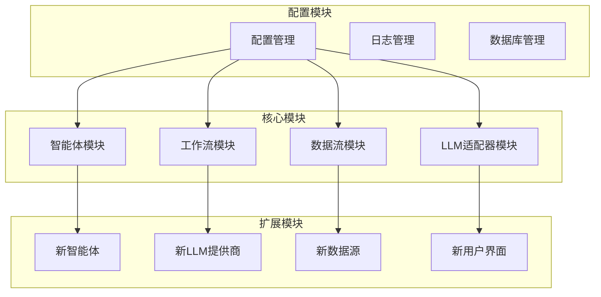

**架构图源文件**
- [tradingagents/agents/__init__.py](file://tradingagents/agents/__init__.py#L1-L45)
- [tradingagents/config/config_manager.py](file://tradingagents/config/config_manager.py#L1-L50)

### 扩展性设计原则

1. **插件化架构**：新功能可以通过插件形式添加
2. **配置驱动**：通过配置文件控制功能开关
3. **接口标准化**：统一的接口规范确保兼容性
4. **向后兼容**：新版本保持对旧版本的兼容性

### 维护性考虑

**代码组织**：
- 按功能模块划分清晰的目录结构
- 使用类型注解提高代码可读性
- 实现完整的单元测试和集成测试
- 提供详细的文档和示例

**监控与日志**：
- 统一的日志管理系统
- 性能监控和告警机制
- 使用统计和成本追踪
- 错误诊断和调试工具

**版本管理**：
- 语义化版本控制
- 完整的变更日志
- 向后兼容性保证
- 渐进式功能发布

**章节源文件**
- [tradingagents/config/config_manager.py](file://tradingagents/config/config_manager.py#L600-L727)
- [tradingagents/utils/logging_manager.py](file://tradingagents/utils/logging_manager.py)

## 总结

TradingAgents-CN 是一个设计精良的多智能体金融分析系统，具有以下核心优势：

### 技术优势

1. **先进的工作流架构**：基于LangGraph的多智能体协作机制，支持复杂的分析流程
2. **灵活的LLM集成**：统一的适配器架构支持多种LLM提供商
3. **强大的数据处理能力**：多数据源集成和智能缓存机制
4. **优秀的用户体验**：Web界面和CLI双入口，支持实时进度跟踪

### 架构特点

1. **模块化设计**：清晰的模块划分，便于维护和扩展
2. **配置驱动**：灵活的配置管理，支持多种部署场景
3. **可扩展性**：插件化架构支持功能扩展
4. **高可用性**：多层降级机制确保系统稳定性

### 应用价值

1. **专业性**：针对金融分析的专业设计和优化
2. **准确性**：多源数据验证和智能分析算法
3. **效率性**：自动化分析流程，大幅提高分析效率
4. **可靠性**：完善的错误处理和监控机制

TradingAgents-CN 代表了当前AI金融分析领域的先进水平，为中文用户提供了专业、可靠的智能金融分析解决方案。其模块化的设计和灵活的架构为未来的功能扩展和性能优化奠定了坚实的基础。