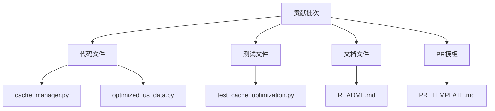
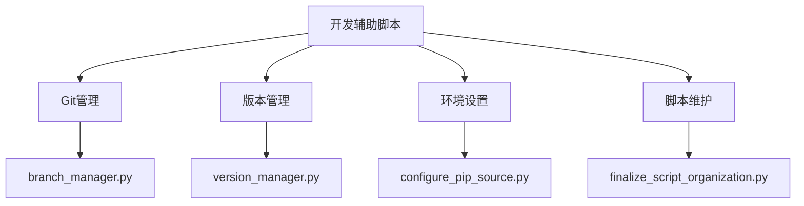

# 贡献指南

<cite>
**本文档引用的文件**  
- [upstream_contribution\batch1_caching\README.md](file://upstream_contribution/batch1_caching/README.md)
- [upstream_contribution\batch1_caching\PR_TEMPLATE.md](file://upstream_contribution/batch1_caching/PR_TEMPLATE.md)
- [scripts\git\upstream_git_workflow.sh](file://scripts/git/upstream_git_workflow.sh)
- [scripts\git\branch_manager.py](file://scripts/git/branch_manager.py)
- [scripts\maintenance\version_manager.py](file://scripts/maintenance/version_manager.py)
- [scripts\development\prepare_upstream_contribution.py](file://scripts/development/prepare_upstream_contribution.py)
- [scripts\maintenance\integrate_cache_improvements.ps1](file://scripts/maintenance/integrate_cache_improvements.ps1)
- [scripts\git\setup_fork_environment.sh](file://scripts/git/setup_fork_environment.sh)
- [scripts\maintenance\migrate_first_contribution.ps1](file://scripts/maintenance/migrate_first_contribution.ps1)
- [scripts\maintenance\finalize_script_organization.py](file://scripts/maintenance/finalize_script_organization.py)
- [scripts\setup\setup_fork_environment.ps1](file://scripts/setup/setup_fork_environment.ps1)
- [scripts\validation\verify_gitignore.py](file://scripts/validation/verify_gitignore.py)
- [scripts\setup\configure_pip_source.py](file://scripts/setup/configure_pip_source.py)
- [scripts\validation\check_dependencies.py](file://scripts/validation/check_dependencies.py)
</cite>

## 目录
1. [引言](#引言)
2. [贡献流程](#贡献流程)
3. [代码变更组织示例](#代码变更组织示例)
4. [代码风格与提交规范](#代码风格与提交规范)
5. [开发辅助脚本使用方法](#开发辅助脚本使用方法)
6. [文档、测试与代码质量要求](#文档测试与代码质量要求)
7. [从小处开始贡献](#从小处开始贡献)

## 引言
本指南旨在鼓励并指导社区成员参与TradingAgents-CN项目的开发。通过详细说明贡献流程、代码组织方式、开发工具使用等，帮助贡献者高效地为项目做出贡献。无论您是经验丰富的开发者还是开源新手，都可以通过本指南了解如何为项目做出有价值的改进。

## 贡献流程
参与项目贡献的标准流程包括以下步骤：

1. **Fork仓库**：在GitHub上Fork原始项目仓库到您的个人账户
2. **克隆本地**：将Fork的仓库克隆到本地开发环境
3. **创建分支**：基于main分支创建新的功能分支
4. **实现变更**：进行代码修改和功能开发
5. **提交更改**：将更改提交到您的分支
6. **推送分支**：将分支推送到您的Fork仓库
7. **创建PR**：在GitHub上创建Pull Request

自动化脚本`scripts/git/setup_fork_environment.sh`和`scripts/git/upstream_git_workflow.sh`可以帮助您快速完成Fork环境的设置和贡献流程的自动化。

**Section sources**
- [scripts/git/setup_fork_environment.sh](file://scripts/git/setup_fork_environment.sh#L1-L61)
- [scripts/git/upstream_git_workflow.sh](file://scripts/git/upstream_git_workflow.sh#L1-L306)

## 代码变更组织示例
项目通过`upstream_contribution`目录中的示例展示了如何组织代码变更。以`batch1_caching`为例，该贡献批次包含：

- **代码文件**：`tradingagents/dataflows/cache_manager.py`和`optimized_us_data.py`
- **测试文件**：`tests/test_cache_optimization.py`
- **文档文件**：`README.md`描述变更内容
- **PR模板**：`PR_TEMPLATE.md`提供标准化的Pull Request描述

这种组织方式确保了贡献的完整性，包括代码、测试和文档，便于维护者审查和集成。



**Diagram sources**
- [upstream_contribution/batch1_caching/README.md](file://upstream_contribution/batch1_caching/README.md#L1-L33)
- [upstream_contribution/batch1_caching/PR_TEMPLATE.md](file://upstream_contribution/batch1_caching/PR_TEMPLATE.md#L1-L36)

## 代码风格与提交规范
项目遵循一致的代码风格和提交信息规范，以确保代码库的可维护性。

### 代码风格
- 使用Python标准编码规范
- 函数和类应有清晰的文档字符串
- 变量命名采用小写加下划线风格
- 代码行长度不超过88个字符
- 使用类型注解提高代码可读性

### 提交信息规范
提交信息应遵循以下格式：
```
<类型>: <简短描述>

<详细描述>

<关联的Issue>
```

其中类型包括：
- `feat`: 新功能
- `fix`: 问题修复
- `docs`: 文档更新
- `style`: 代码格式调整
- `refactor`: 代码重构
- `test`: 测试相关
- `chore`: 构建过程或辅助工具的变动

**Section sources**
- [scripts/git/upstream_git_workflow.sh](file://scripts/git/upstream_git_workflow.sh#L1-L306)
- [upstream_contribution/batch1_caching/PR_TEMPLATE.md](file://upstream_contribution/batch1_caching/PR_TEMPLATE.md#L1-L36)

## 开发辅助脚本使用方法
项目提供了一系列开发辅助脚本，帮助贡献者更高效地工作。

### Git分支管理脚本
`scripts/git/branch_manager.py`提供了完整的分支管理功能：
- `status`: 检查当前分支状态
- `create`: 创建新的功能分支
- `cleanup`: 清理已合并的分支
- `release`: 发布新版本

### 维护脚本
`scripts/maintenance/`目录包含各种维护工具：
- `version_manager.py`: 版本号管理和发布
- `finalize_script_organization.py`: 脚本文件整理
- `integrate_cache_improvements.ps1`: 缓存系统集成

### 设置脚本
`scripts/setup/`目录提供环境配置工具：
- `configure_pip_source.py`: 配置国内pip源
- `setup_fork_environment.ps1`: 设置Fork开发环境



**Diagram sources**
- [scripts/git/branch_manager.py](file://scripts/git/branch_manager.py#L1-L287)
- [scripts/maintenance/version_manager.py](file://scripts/maintenance/version_manager.py#L1-L229)
- [scripts/setup/configure_pip_source.py](file://scripts/setup/configure_pip_source.py#L1-L224)

## 文档、测试与代码质量要求
项目对文档、测试和代码质量有严格要求，确保贡献的高质量。

### 文档要求
- 所有公共API必须有文档字符串
- 新功能需要更新相关文档
- 代码注释应使用英文
- 避免中文字符串和注释

### 测试要求
- 新功能必须包含相应的测试
- 修复问题时应添加回归测试
- 测试覆盖率应保持在合理水平
- 运行`python -m pytest tests/ -v`验证测试

### 代码质量要求
- 通过`check_dependencies.py`验证依赖
- 使用`verify_gitignore.py`检查Git配置
- 代码应具有良好的可读性和可维护性
- 避免重复代码，遵循DRY原则

**Section sources**
- [scripts/validation/check_dependencies.py](file://scripts/validation/check_dependencies.py#L1-L287)
- [scripts/validation/verify_gitignore.py](file://scripts/validation/verify_gitignore.py#L1-L157)

## 从小处开始贡献
我们鼓励贡献者从小的改进开始，逐步熟悉项目。以下是一些适合初学者的贡献类型：

### 文档改进
- 修复文档中的错别字和语法错误
- 改善文档的清晰度和可读性
- 补充缺失的文档内容
- 翻译文档为其他语言

### 测试增强
- 为现有功能添加新的测试用例
- 改进现有测试的覆盖率
- 修复失败的测试
- 添加性能基准测试

### 代码优化
- 修复小的代码风格问题
- 改进变量命名
- 优化简单的算法
- 添加缺失的类型注解

通过从小处着手，您可以逐步了解项目架构和开发流程，为后续更复杂的贡献打下基础。

**Section sources**
- [upstream_contribution/batch1_caching/README.md](file://upstream_contribution/batch1_caching/README.md#L1-L33)
- [scripts/development/prepare_upstream_contribution.py](file://scripts/development/prepare_upstream_contribution.py#L1-L326)