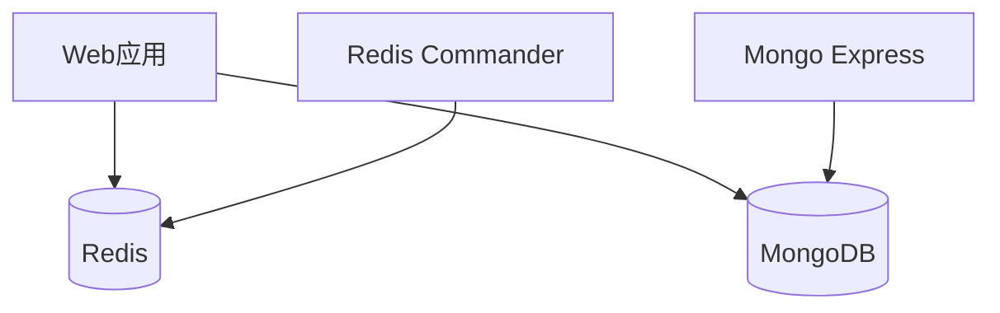
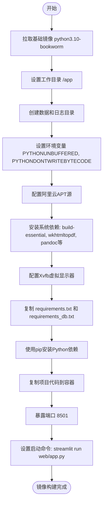
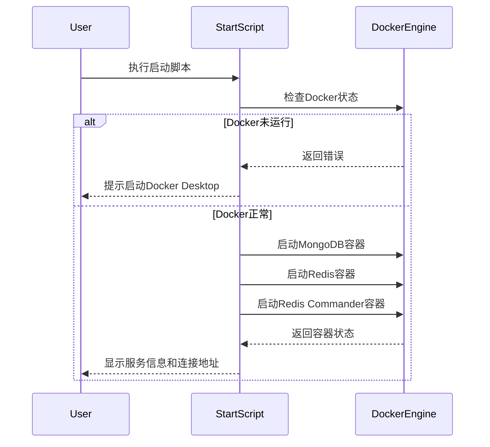
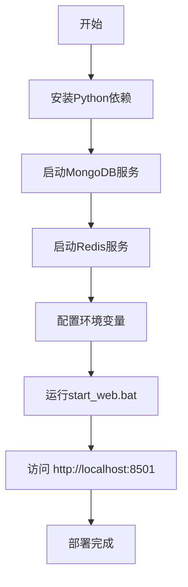

# 部署指南

<cite>
**本文档引用的文件**  
- [Dockerfile](file://Dockerfile)
- [docker-compose.yml](file://docker-compose.yml)
- [start_web.bat](file://start_web.bat)
- [scripts/docker/start_docker_services.bat](file://scripts/docker/start_docker_services.bat)
- [scripts/docker/stop_docker_services.bat](file://scripts/docker/stop_docker_services.bat)
- [scripts/docker/start_docker_services.sh](file://scripts/docker/start_docker_services.sh)
- [scripts/docker/stop_docker_services.sh](file://scripts/docker/stop_docker_services.sh)
</cite>

## 目录
1. [简介](#简介)
2. [项目结构](#项目结构)
3. [Docker容器化部署](#docker容器化部署)
4. [本地部署](#本地部署)
5. [生产环境配置建议](#生产环境配置建议)
6. [故障排查清单](#故障排查清单)
7. [结论](#结论)

## 简介
本指南详细说明了TradingAgents-CN项目的部署流程，涵盖Docker容器化部署和本地手动部署两种模式。内容包括服务配置、启动脚本使用、环境变量管理以及常见问题的解决方案，旨在帮助用户快速搭建并运行系统。

## 项目结构
项目采用模块化设计，主要包含以下目录：
- `web/`：Streamlit Web应用入口
- `tradingagents/`：核心交易分析代理逻辑
- `scripts/docker/`：Docker服务管理脚本
- `cli/`：命令行接口
- `data/`：数据存储与脚本
- 根目录包含Docker相关配置文件

**Section sources**
- [Dockerfile](file://Dockerfile)
- [docker-compose.yml](file://docker-compose.yml)

## Docker容器化部署

### 服务定义与依赖关系
`docker-compose.yml`定义了以下核心服务：



**Diagram sources**
- [docker-compose.yml](file://docker-compose.yml#L5-L131)

#### 服务说明
- **web**：主应用服务，基于Streamlit构建，依赖Redis服务
- **mongodb**：MongoDB数据库，用于持久化存储分析数据
- **redis**：缓存服务，提升数据访问性能
- **redis-commander**：Redis可视化管理界面
- **mongo-express**：MongoDB管理界面（可选）

#### 依赖关系
- `web` 服务通过 `depends_on` 依赖 `redis`，确保缓存服务先于应用启动
- 所有服务共享 `tradingagents-network` 网络，实现容器间通信
- 数据卷 `mongodb_data` 和 `redis_data` 实现数据持久化

**Section sources**
- [docker-compose.yml](file://docker-compose.yml#L5-L131)

### Dockerfile构建过程
Docker镜像基于 `ghcr.io/astral-sh/uv:python3.10-bookworm` 构建，主要步骤如下：



**Diagram sources**
- [Dockerfile](file://Dockerfile#L1-L43)

#### 基础镜像选择
使用 `ghcr.io/astral-sh/uv:python3.10-bookworm` 作为基础镜像，该镜像具有以下优势：
- 基于Debian Bookworm，系统稳定
- 预装uv工具，提升Python包安装速度
- 轻量级，减少镜像体积
- 支持现代Python特性

#### 关键配置
- 使用阿里云镜像源加速APT和PyPI包安装
- 安装PDF生成所需依赖（wkhtmltopdf、pandoc）
- 配置Xvfb支持无头环境下的PDF渲染
- 设置环境变量确保Python输出不被缓冲

**Section sources**
- [Dockerfile](file://Dockerfile#L1-L43)

### 服务启动与停止脚本
项目提供跨平台的Docker服务管理脚本。

#### 启动脚本
- `start_docker_services.bat`（Windows）
- `start_docker_services.sh`（Linux/macOS）

功能：
- 检查Docker服务状态
- 启动MongoDB、Redis和Redis Commander容器
- 显示连接信息和访问地址
- 支持数据持久化（通过Docker卷）

#### 停止脚本
- `stop_docker_services.bat`（Windows）
- `stop_docker_services.sh`（Linux/macOS）

功能：
- 安全停止并移除所有TradingAgents相关容器
- 保留Docker卷中的数据
- 提供完全清理数据的提示



**Diagram sources**
- [scripts/docker/start_docker_services.bat](file://scripts/docker/start_docker_services.bat#L1-L107)
- [scripts/docker/start_docker_services.sh](file://scripts/docker/start_docker_services.sh#L1-L101)

**Section sources**
- [scripts/docker/start_docker_services.bat](file://scripts/docker/start_docker_services.bat#L1-L107)
- [scripts/docker/start_docker_services.sh](file://scripts/docker/start_docker_services.sh#L1-L101)
- [scripts/docker/stop_docker_services.bat](file://scripts/docker/stop_docker_services.bat#L1-L42)
- [scripts/docker/stop_docker_services.sh](file://scripts/docker/stop_docker_services.sh#L1-L40)

## 本地部署

### 依赖安装
1. 安装Python 3.10+
2. 创建虚拟环境（可选）：
   ```bash
   python -m venv env
   ```
3. 安装依赖：
   ```bash
   pip install -r requirements.txt
   pip install -r requirements_db.txt
   pip install pytdx
   ```

### 服务启动步骤
1. **启动数据库服务**：
   - 本地安装并启动MongoDB（端口27017）
   - 本地安装并启动Redis（端口6379）

2. **配置环境变量**：
   创建 `.env` 文件，配置数据库连接：
   ```
   TRADINGAGENTS_MONGODB_URL=mongodb://localhost:27017/tradingagents
   TRADINGAGENTS_REDIS_URL=redis://localhost:6379
   TRADINGAGENTS_CACHE_TYPE=redis
   ```

3. **启动Web应用**：
   使用提供的批处理脚本：
   ```cmd
   start_web.bat
   ```
   或手动启动：
   ```cmd
   python -m streamlit run web/app.py --server.port 8501 --server.address localhost
   ```



**Section sources**
- [start_web.bat](file://start_web.bat#L1-L12)

## 生产环境配置建议

### 环境变量管理
- 使用 `.env` 文件集中管理配置
- 敏感信息（如数据库密码）不应硬编码在代码中
- 生产环境应使用更复杂的密码策略

### 日志记录
- 应用日志自动保存到 `/app/logs` 目录
- 建议配置日志轮转策略
- 可通过Docker日志驱动集成集中式日志系统

### 性能调优
- Redis配置 `appendonly yes` 确保持久化
- MongoDB使用专用数据卷避免性能瓶颈
- 根据负载调整容器资源限制（CPU、内存）

### 安全加固
- 为MongoDB和Redis设置强密码
- 生产环境不应暴露管理界面（Redis Commander、Mongo Express）
- 定期更新基础镜像和依赖包
- 使用HTTPS反向代理保护Web应用

**Section sources**
- [docker-compose.yml](file://docker-compose.yml#L5-L131)
- [Dockerfile](file://Dockerfile#L1-L43)

## 故障排查清单

### 常见问题及解决方案
| 问题现象 | 可能原因 | 解决方案 |
|--------|--------|--------|
| 端口冲突 | 27017、6379或8501端口已被占用 | 使用 `netstat` 或 `lsof` 查找占用进程并终止，或修改docker-compose.yml中的端口映射 |
| 镜像拉取失败 | 网络问题或镜像仓库不可访问 | 配置Docker镜像加速器，或手动拉取所需镜像 |
| 容器启动异常 | 依赖服务未就绪 | 检查 `docker logs` 输出，确保MongoDB和Redis正常启动 |
| Web应用无法连接数据库 | 网络配置错误 | 确认容器在同一个自定义网络中，检查连接字符串 |
| PDF生成失败 | Xvfb未正确启动 | 确认Dockerfile中Xvfb配置正确，检查DISPLAY环境变量 |

### 诊断命令
```bash
# 查看容器状态
docker ps --filter "name=tradingagents-"

# 查看特定容器日志
docker logs TradingAgents-web

# 进入容器调试
docker exec -it TradingAgents-web /bin/bash

# 检查网络连接
docker network inspect tradingagents-network
```

**Section sources**
- [docker-compose.yml](file://docker-compose.yml#L5-L131)
- [scripts/docker/start_docker_services.bat](file://scripts/docker/start_docker_services.bat#L1-L107)

## 结论
本部署指南提供了TradingAgents-CN项目的完整部署方案。Docker容器化部署简化了环境配置，确保了环境一致性；本地部署提供了更大的灵活性。通过合理配置生产环境参数和遵循安全最佳实践，可以确保系统稳定、安全地运行。建议生产环境优先使用Docker部署，并结合监控和日志系统进行运维管理。