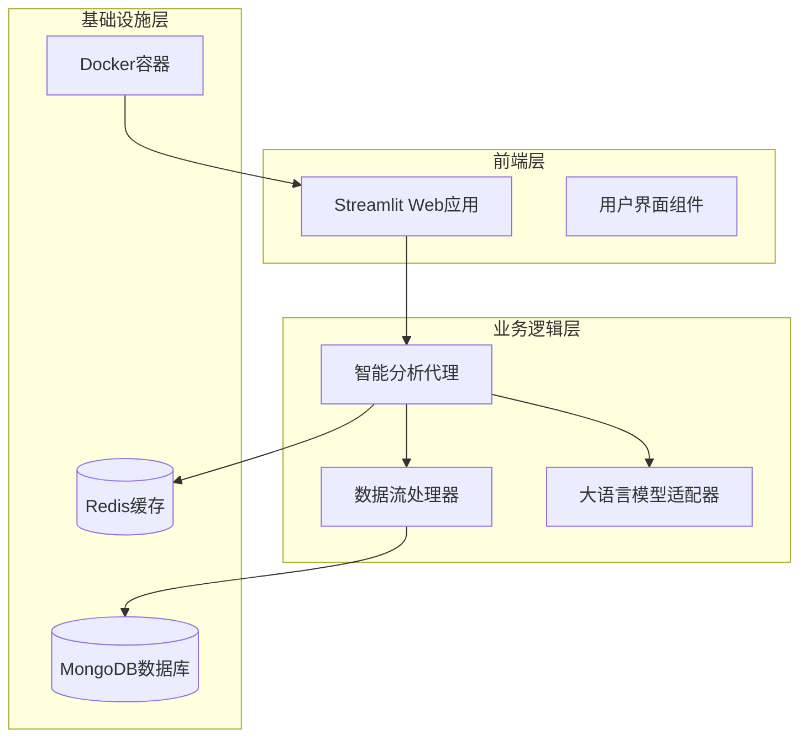
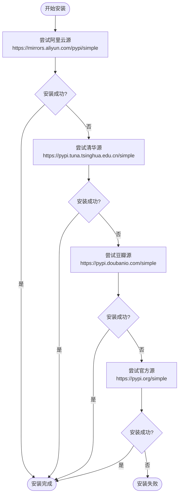
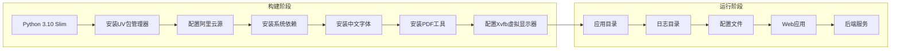
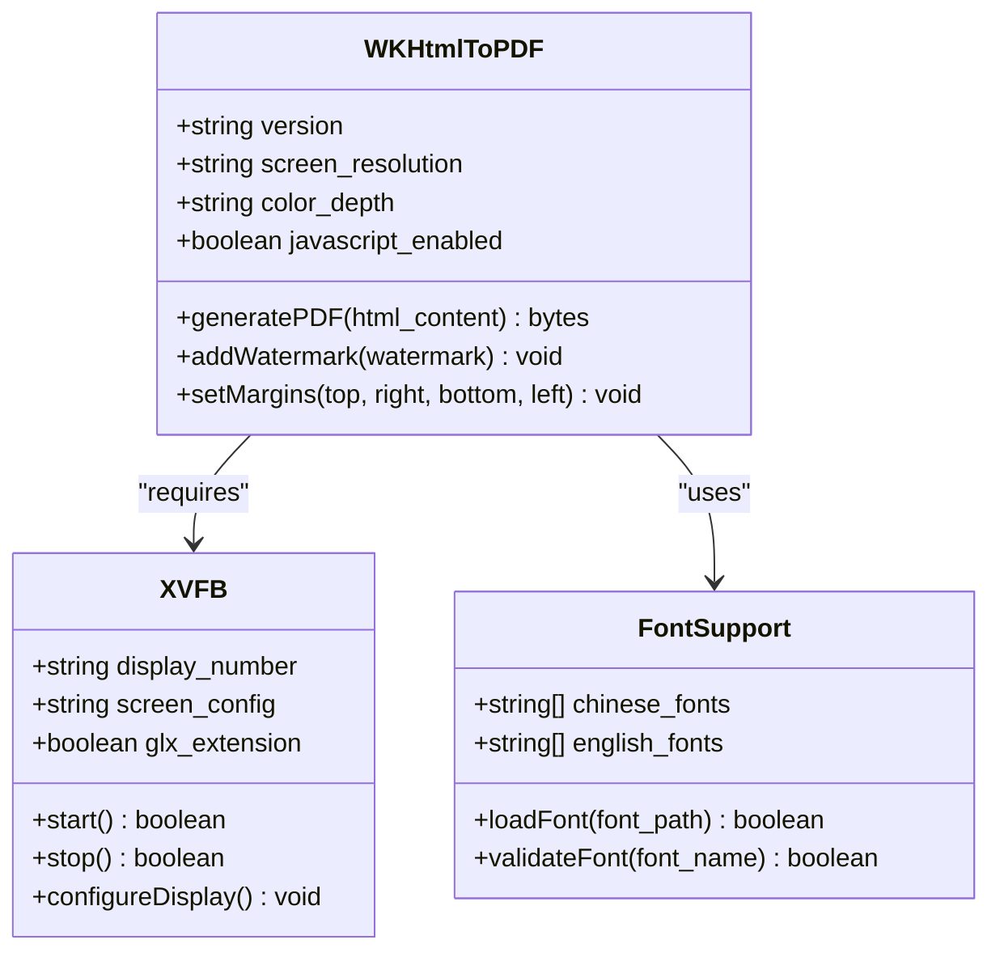
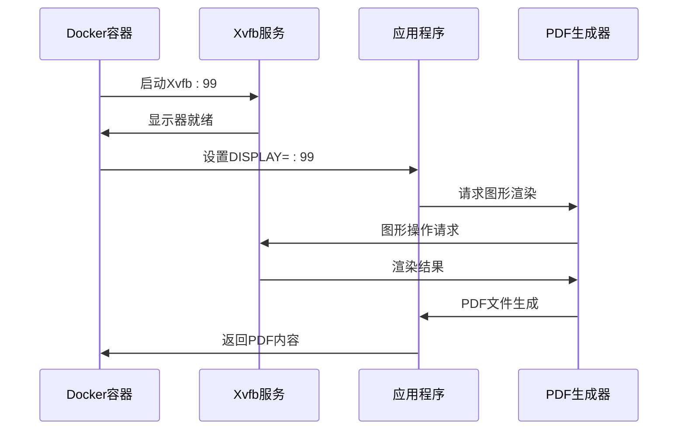
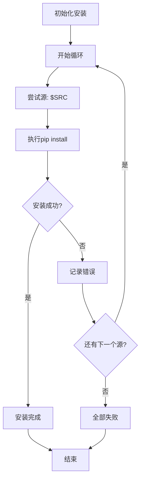
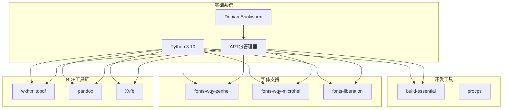
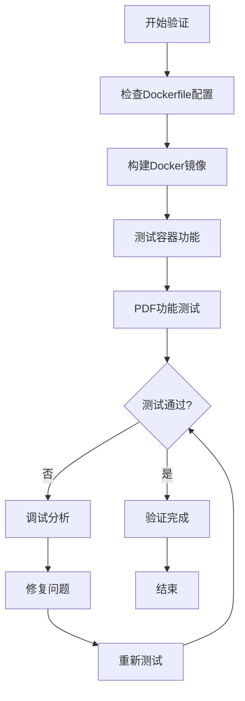

# Dockerfile配置详解

<cite>
**本文档引用的文件**
- [Dockerfile](file://Dockerfile)
- [docker-compose.yml](file://docker-compose.yml)
- [requirements.txt](file://requirements.txt)
- [scripts/build_docker_with_pdf.py](file://scripts/build_docker_with_pdf.py)
- [scripts/test_docker_pdf.py](file://scripts/test_docker_pdf.py)
- [scripts/docker/start_docker_services.sh](file://scripts/docker/start_docker_services.sh)
- [scripts/docker/stop_docker_services.sh](file://scripts/docker/stop_docker_services.sh)
- [web/utils/docker_pdf_adapter.py](file://web/utils/docker_pdf_adapter.py)
- [config/logging_docker.toml](file://config/logging_docker.toml)
</cite>

## 目录
1. [简介](#简介)
2. [项目结构概览](#项目结构概览)
3. [核心组件分析](#核心组件分析)
4. [架构概览](#架构概览)
5. [详细组件分析](#详细组件分析)
6. [依赖分析](#依赖分析)
7. [性能考虑](#性能考虑)
8. [故障排除指南](#故障排除指南)
9. [结论](#结论)

## 简介

本文档深入解析了TradingAgents-CN项目的Dockerfile多阶段构建配置，重点说明了基础镜像选择、依赖安装流程、PDF生成工具集成以及Xvfb虚拟显示器配置等关键技术要点。该Docker配置专门针对金融数据分析和报告生成功能进行了优化，特别是在无头环境下的图形渲染支持。

## 项目结构概览

该项目采用现代化的微服务架构，主要包含以下核心组件：



**图表来源**
- [docker-compose.yml](file://docker-compose.yml#L1-L159)
- [Dockerfile](file://Dockerfile#L1-L58)

**章节来源**
- [docker-compose.yml](file://docker-compose.yml#L1-L159)
- [Dockerfile](file://Dockerfile#L1-L58)

## 核心组件分析

### 基础镜像选择

项目选择了`python:3.10-slim-bookworm`作为基础镜像，这一选择具有以下优势：

1. **轻量化设计**：基于Debian Bookworm发行版的Slim版本，显著减少了镜像大小
2. **稳定性保证**：使用长期支持的Debian Bookworm稳定版本
3. **Python版本兼容性**：预装Python 3.10，满足项目依赖要求
4. **安全性**：定期更新的安全补丁支持

### 多源轮询安装机制

为了提高依赖安装的成功率，特别是在网络不稳定环境下，项目实现了多源轮询安装机制：



**图表来源**
- [Dockerfile](file://Dockerfile#L35-L42)

**章节来源**
- [Dockerfile](file://Dockerfile#L1-L58)

## 架构概览

### 多阶段构建架构



**图表来源**
- [Dockerfile](file://Dockerfile#L1-L58)
- [docker-compose.yml](file://docker-compose.yml#L5-L50)

## 详细组件分析

### 阿里云镜像源配置

项目通过修改APT源配置来加速包安装：

| 配置项 | 值 | 作用 |
|--------|-----|------|
| 主仓库 | `http://mirrors.aliyun.com/debian/ bookworm main` | 提供基础软件包 |
| 更新仓库 | `http://mirrors.aliyun.com/debian/ bookworm-updates main` | 提供安全更新 |
| 安全仓库 | `http://mirrors.aliyun.com/debian-security bookworm-security main` | 提供安全补丁 |

### PDF生成工具链集成

#### wkhtmltopdf配置

wkhtmltopdf是项目PDF生成的核心工具，配置特点：



**图表来源**
- [Dockerfile](file://Dockerfile#L20-L25)
- [web/utils/docker_pdf_adapter.py](file://web/utils/docker_pdf_adapter.py#L60-L85)

#### 中文字体支持

项目集成了多种中文字体以确保中文内容的正确渲染：

| 字体名称 | 字体类型 | 用途 | 文件路径 |
|----------|----------|------|----------|
| wqy-zenhei | 黑体 | 标准正文文本 | `/usr/share/fonts/truetype/wqy/wqy-zenhei.ttc` |
| wqy-microhei | 细黑体 | 细小文字显示 | `/usr/share/fonts/truetype/wqy/wqy-microhei.ttc` |
| liberation | 英文字体 | 英文字符渲染 | `/usr/share/fonts/truetype/liberation/` |

### Xvfb虚拟显示器配置

Xvfb（X Virtual Framebuffer）是无头环境中图形渲染的关键组件：



**图表来源**
- [Dockerfile](file://Dockerfile#L27-L32)
- [web/utils/docker_pdf_adapter.py](file://web/utils/docker_pdf_adapter.py#L30-L60)

#### Xvfb启动脚本分析

项目提供了专门的启动脚本`start-xvfb.sh`，其配置参数：

| 参数 | 值 | 说明 |
|------|-----|------|
| 显示器编号 | :99 | 默认Xvfb显示设备 |
| 屏幕分辨率 | 1024x768 | 标准桌面分辨率 |
| 颜色深度 | 24位 | 支持真彩色显示 |
| 权限控制 | -ac | 允许任意连接 |
| GLX扩展 | +extension GLX | 支持OpenGL加速 |

**章节来源**
- [Dockerfile](file://Dockerfile#L27-L32)
- [web/utils/docker_pdf_adapter.py](file://web/utils/docker_pdf_adapter.py#L30-L85)

### 多源轮询安装实现

项目实现了robust的依赖安装机制，确保在网络不稳定环境下的安装成功率：



**图表来源**
- [Dockerfile](file://Dockerfile#L35-L42)

**章节来源**
- [Dockerfile](file://Dockerfile#L35-L42)

## 依赖分析

### 系统级依赖关系



**图表来源**
- [Dockerfile](file://Dockerfile#L20-L25)
- [requirements.txt](file://requirements.txt#L1-L42)

### Python依赖管理

项目使用requirements.txt管理Python包依赖，主要包含：

| 依赖类别 | 包名 | 版本要求 | 用途 |
|----------|------|----------|------|
| 数据分析 | pandas, numpy | 最新稳定版 | 数据处理和分析 |
| 机器学习 | langchain, transformers | 最新稳定版 | AI模型集成 |
| 网络通信 | requests, websocket-client | 最新稳定版 | API调用 |
| 数据库 | pymongo, redis | 最新稳定版 | 数据存储 |
| Web框架 | streamlit | 最新稳定版 | Web界面 |
| 工具库 | tqdm, pytz | 最新稳定版 | 辅助功能 |

**章节来源**
- [requirements.txt](file://requirements.txt#L1-L42)

## 性能考虑

### 镜像大小优化

1. **Slim镜像选择**：使用python:3.10-slim-bookworm减少基础镜像大小
2. **一次性清理**：使用`rm -rf /var/lib/apt/lists/*`清理APT缓存
3. **最小化安装**：只安装必要的系统包和Python依赖

### 启动性能优化

1. **并行依赖安装**：多源轮询机制提高安装成功率
2. **延迟初始化**：Xvfb按需启动，减少资源占用
3. **缓存利用**：充分利用Docker层缓存机制

### 内存使用优化

1. **字体优化**：只安装必需的中文字体
2. **工具精简**：选择轻量级的PDF生成工具
3. **进程管理**：合理配置Xvfb内存使用

## 故障排除指南

### 常见构建失败场景

#### 网络超时问题

**症状**：依赖安装过程中断，提示网络超时

**解决方案**：
1. 检查网络连接稳定性
2. 使用多源轮询机制
3. 增加超时时间设置
4. 配置代理服务器

#### 依赖冲突问题

**症状**：pip安装时出现版本冲突错误

**解决方案**：
1. 使用`--upgrade`选项升级冲突包
2. 检查依赖版本兼容性
3. 使用虚拟环境隔离依赖
4. 更新pip和setuptools

#### 字体渲染问题

**症状**：PDF中中文字符显示异常

**解决方案**：
1. 确认字体包正确安装
2. 检查字体文件路径
3. 验证字体权限设置
4. 使用字体回退机制

#### Xvfb启动失败

**症状**：虚拟显示器无法启动

**解决方案**：
1. 检查Xvfb服务状态
2. 验证DISPLAY环境变量
3. 确认端口99未被占用
4. 检查系统资源限制

### 调试工具和方法

#### 容器内部调试

```bash
# 进入容器进行调试
docker exec -it TradingAgents-web bash

# 检查依赖安装状态
dpkg -l | grep -E "(wkhtmltopdf|xvfb|fonts)"

# 验证字体安装
fc-list | grep -i "wqy\|liberation"

# 测试PDF生成
python scripts/test_docker_pdf.py
```

#### 日志分析

项目提供了专门的日志配置文件，支持Docker环境的完整日志记录：

| 日志级别 | 输出目标 | 用途 |
|----------|----------|------|
| INFO | 控制台 | 一般信息记录 |
| DEBUG | 文件 | 详细调试信息 |
| ERROR | 文件+控制台 | 错误信息记录 |
| JSON | 结构化 | 生产环境监控 |

**章节来源**
- [scripts/test_docker_pdf.py](file://scripts/test_docker_pdf.py#L1-L168)
- [config/logging_docker.toml](file://config/logging_docker.toml#L1-L100)

### 构建验证流程

项目提供了完整的构建验证脚本，确保Docker镜像的正确性：



**图表来源**
- [scripts/build_docker_with_pdf.py](file://scripts/build_docker_with_pdf.py#L80-L120)

**章节来源**
- [scripts/build_docker_with_pdf.py](file://scripts/build_docker_with_pdf.py#L1-L160)

## 结论

TradingAgents-CN项目的Dockerfile配置展现了现代容器化应用的最佳实践。通过精心设计的基础镜像选择、多源轮询安装机制、PDF工具链集成和Xvfb虚拟显示器配置，该项目成功解决了金融数据分析和报告生成在无头环境中的技术挑战。

### 关键技术亮点

1. **轻量化设计**：基于python:3.10-slim-bookworm的高效镜像
2. **高可靠性**：多源轮询确保依赖安装成功率
3. **国际化支持**：完整的中文字体和PDF渲染能力
4. **自动化测试**：完善的构建验证和故障排除机制

### 最佳实践总结

1. **镜像优化**：选择合适的基镜像，最小化不必要的组件
2. **网络容错**：实现多源安装机制提高部署成功率
3. **环境隔离**：使用虚拟显示器支持无头图形应用
4. **监控调试**：提供完整的日志记录和故障诊断工具

该Docker配置为金融数据分析应用提供了稳定、高效的容器化解决方案，特别适用于需要生成复杂PDF报告的企业级应用场景。