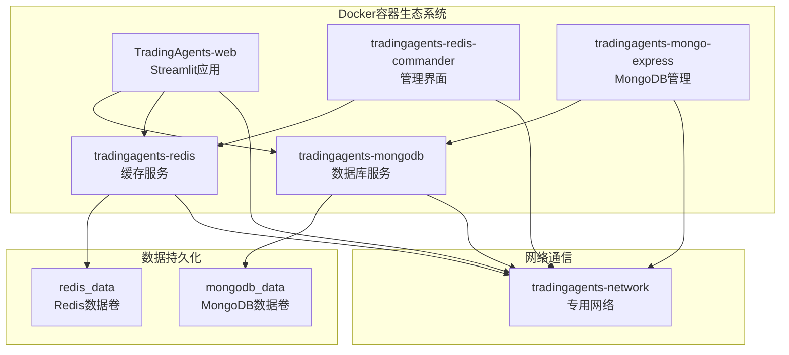
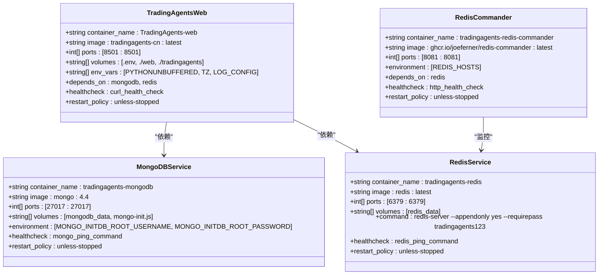
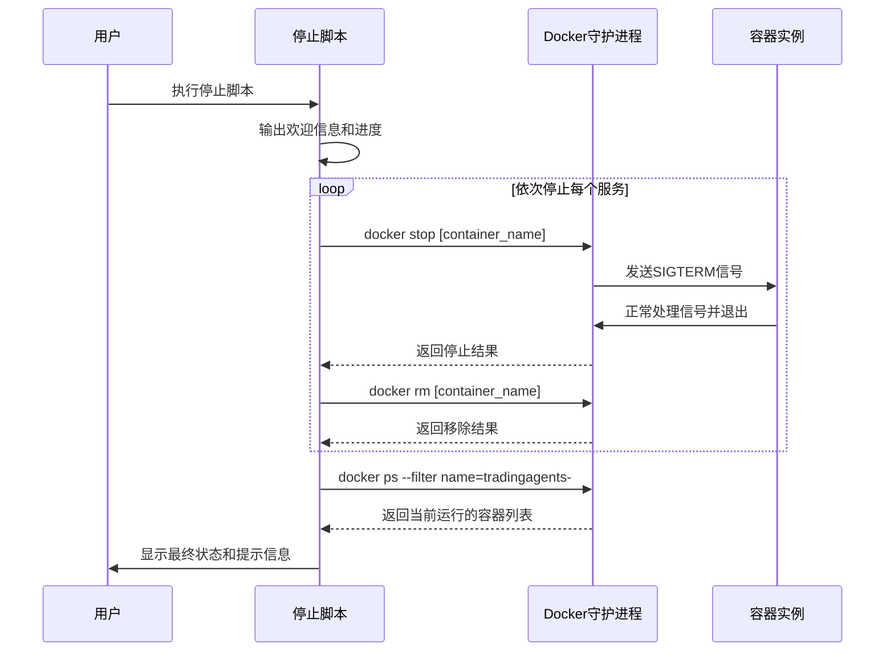
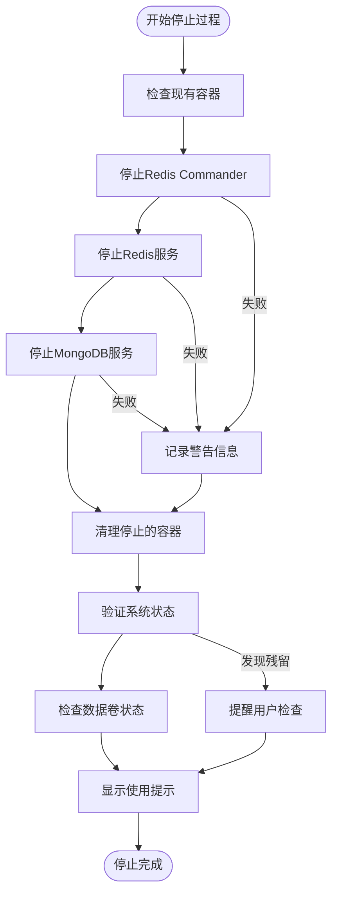
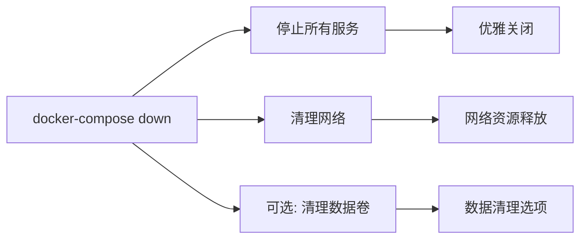
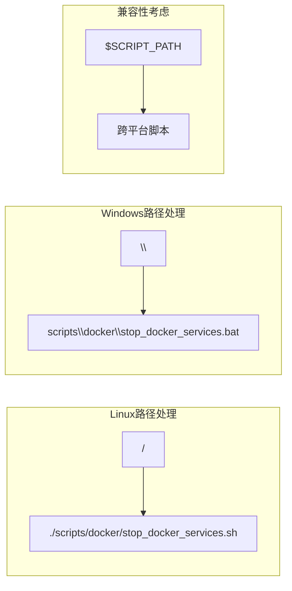

# Docker停止脚本全面解析

<cite>
**本文档引用的文件**
- [stop_docker_services.sh](file://scripts/docker/stop_docker_services.sh)
- [stop_docker_services.bat](file://scripts/docker/stop_docker_services.bat)
- [docker-compose.yml](file://docker-compose.yml)
- [start_docker_services.sh](file://scripts/docker/start_docker_services.sh)
- [start_docker.sh](file://scripts/start_docker.sh)
- [debug_docker.sh](file://scripts/debug_docker.sh)
- [README.md](file://scripts/docker/README.md)
</cite>

## 目录
1. [简介](#简介)
2. [项目结构概览](#项目结构概览)
3. [核心组件分析](#核心组件分析)
4. [架构设计](#架构设计)
5. [详细脚本分析](#详细脚本分析)
6. [错误处理机制](#错误处理机制)
7. [系统状态验证](#系统状态验证)
8. [跨平台差异对比](#跨平台差异对比)
9. [强制终止方案](#强制终止方案)
10. [最佳实践建议](#最佳实践建议)
11. [故障排除指南](#故障排除指南)
12. [总结](#总结)

## 简介

TradingAgents项目的Docker停止脚本（stop_docker_services.sh/.bat）是一个精心设计的容器管理工具，专门用于安全地终止TradingAgents生态系统中的所有Docker容器服务。该脚本不仅实现了优雅的服务关闭，还提供了完整的状态验证和数据保护机制。

本文档将深入分析脚本的设计理念、执行流程、错误处理策略以及跨平台兼容性，为开发者提供全面的技术参考。

## 项目结构概览

TradingAgents项目采用现代化的Docker容器化架构，包含以下核心组件：



**图表来源**
- [docker-compose.yml](file://docker-compose.yml#L1-L159)

**章节来源**
- [docker-compose.yml](file://docker-compose.yml#L1-L159)
- [README.md](file://scripts/docker/README.md#L1-L29)

## 核心组件分析

### 容器服务层次结构

TradingAgents的Docker架构采用分层设计，确保各服务之间的独立性和可靠性：



**图表来源**
- [docker-compose.yml](file://docker-compose.yml#L1-L159)

**章节来源**
- [docker-compose.yml](file://docker-compose.yml#L1-L159)

## 架构设计

### 停止脚本执行架构

Docker停止脚本采用了简洁而高效的执行架构，确保所有相关服务能够被正确识别和终止：



**图表来源**
- [stop_docker_services.sh](file://scripts/docker/stop_docker_services.sh#L1-L40)
- [stop_docker_services.bat](file://scripts/docker/stop_docker_services.bat#L1-L42)

### 数据持久化保护机制

脚本设计充分考虑了数据安全，确保重要业务数据不会因意外停止而丢失：



**图表来源**
- [stop_docker_services.sh](file://scripts/docker/stop_docker_services.sh#L10-L38)

**章节来源**
- [stop_docker_services.sh](file://scripts/docker/stop_docker_services.sh#L1-L40)
- [stop_docker_services.bat](file://scripts/docker/stop_docker_services.bat#L1-L42)

## 详细脚本分析

### Linux Bash脚本实现

Linux版本的停止脚本采用了标准的Bash语法，具有良好的可读性和维护性：

#### 脚本结构特点

1. **头部注释规范**：清晰标注脚本用途和功能
2. **错误重定向处理**：使用`2>/dev/null`静默处理错误输出
3. **容器名称标准化**：统一使用`tradingagents-`前缀标识
4. **状态反馈机制**：每步操作都提供明确的进度指示

#### 执行流程详解

脚本按照以下顺序执行容器停止操作：

1. **Redis Commander停止**：首先停止Redis管理界面
2. **Redis服务停止**：接着停止Redis缓存服务
3. **MongoDB服务停止**：最后停止主数据库服务

这种顺序确保了依赖关系的正确处理，避免因上游服务未停止而导致的错误。

**章节来源**
- [stop_docker_services.sh](file://scripts/docker/stop_docker_services.sh#L1-L40)

### Windows批处理脚本实现

Windows版本的停止脚本针对Windows CMD环境进行了优化：

#### 平台特定优化

1. **注释语法适配**：使用`REM`和`@echo off`适应Windows批处理
2. **错误重定向简化**：使用`2>nul`替代Unix的`2>/dev/null`
3. **交互式体验增强**：添加`pause`命令让用户确认操作完成

#### 用户体验改进

Windows版本在Linux版本基础上增加了：
- 更丰富的Unicode表情符号
- 明确的暂停提示
- 更详细的错误处理反馈

**章节来源**
- [stop_docker_services.bat](file://scripts/docker/stop_docker_services.bat#L1-L42)

### Docker Compose集成

虽然当前脚本直接使用`docker stop`命令，但项目整体架构支持更高级的停止方式：

#### docker-compose down命令分析

项目中其他脚本展示了更完整的停止方式：



**图表来源**
- [rebuild_and_test.ps1](file://scripts/rebuild_and_test.ps1#L10-L15)

**章节来源**
- [rebuild_and_test.ps1](file://scripts/rebuild_and_test.ps1#L10-L15)

## 错误处理机制

### 容器状态检测

脚本采用了多层次的错误处理策略：

#### 1. 静默错误处理

```bash
# Linux版本
docker stop tradingagents-redis-commander 2>/dev/null
docker rm tradingagents-redis-commander 2>/dev/null
```

```batch
REM Windows版本  
docker stop tradingagents-redis-commander 2>nul
docker rm tradingagents-redis-commander 2>nul
```

这种设计允许脚本在容器不存在或已停止的情况下继续执行，避免因单个服务的状态异常影响整体流程。

#### 2. 状态验证机制

脚本在停止完成后执行状态检查：

```bash
echo "📋 检查剩余容器..."
docker ps --filter "name=tradingagents-" --format "table {{.Names}}\t{{.Status}}\t{{.Ports}}"
```

这一步确保用户能够直观地看到哪些容器仍在运行，便于后续的手动处理。

#### 3. 权限处理策略

对于权限不足的情况，脚本不会中断执行，而是继续尝试下一个容器的操作，体现了健壮性设计。

**章节来源**
- [stop_docker_services.sh](file://scripts/docker/stop_docker_services.sh#L12-L32)
- [stop_docker_services.bat](file://scripts/docker/stop_docker_services.bat#L11-L33)

## 系统状态验证

### 容器状态检查

脚本提供了完整的系统状态验证机制：

#### 检查命令详解

```bash
docker ps --filter "name=tradingagents-" --format "table {{.Names}}\t{{.Status}}\t{{.Ports}}"
```

这个命令的作用：
- **过滤条件**：只显示名称包含`tradingagents-`的容器
- **格式化输出**：以表格形式展示容器名称、状态和端口映射
- **实时状态**：反映当前正在运行的容器状态

#### 验证结果解读

成功的验证结果应该显示：
- 所有预期的TradingAgents容器都已停止
- 状态列显示为`Exited`或类似的停止状态
- 端口映射信息为空或显示为`0.0.0.0:PORT->PORT/tcp`

#### 数据卷状态检查

脚本还隐含了数据保护机制：

```bash
echo "💡 提示:"
echo "   - 数据已保存在Docker卷中，下次启动时会自动恢复"
echo "   - 如需完全清理数据，请手动删除Docker卷:"
echo "     docker volume rm mongodb_data redis_data"
```

这表明：
- 数据持久化通过Docker卷实现
- 默认情况下数据不会被删除
- 提供了数据清理的明确指导

**章节来源**
- [stop_docker_services.sh](file://scripts/docker/stop_docker_services.sh#L32-L38)
- [stop_docker_services.bat](file://scripts/docker/stop_docker_services.bat#L33-L40)

## 跨平台差异对比

### 信号处理差异

不同操作系统对Docker容器信号处理存在细微差异：

| 特性 | Linux Bash | Windows Batch |
|------|------------|---------------|
| **信号类型** | SIGTERM（默认） | Windows进程信号 |
| **优雅关闭** | 支持SIGTERM信号 | 支持Windows进程终止 |
| **强制终止** | `docker kill` | `docker kill` |
| **超时处理** | 可配置超时 | 立即终止 |

### 路径分隔符处理



### 命令执行方式差异

#### Linux Bash特性
- 使用`#!/bin/bash`指定解释器
- 支持复杂的shell语法和管道操作
- 文件权限控制（`chmod +x`）

#### Windows Batch特性
- 使用`@echo off`控制输出
- 支持简单的条件判断和循环
- 用户交互友好（`pause`命令）

**章节来源**
- [stop_docker_services.sh](file://scripts/docker/stop_docker_services.sh#L1-L1)
- [stop_docker_services.bat](file://scripts/docker/stop_docker_services.bat#L1-L1)

## 强制终止方案

### docker kill命令使用

当优雅停止失败时，可以使用强制终止方案：

#### 强制终止序列

```bash
# 强制终止Redis Commander
docker kill tradingagents-redis-commander

# 强制终止Redis服务
docker kill tradingagents-redis

# 强制终止MongoDB服务
docker kill tradingagents-mongodb
```

#### 强制终止的优势与风险

**优势**：
- 立即终止容器进程
- 不等待优雅关闭期
- 适用于紧急情况

**风险**：
- 可能导致数据不一致
- 缓存数据丢失
- 事务完整性受损

### docker-compose down命令

对于更彻底的清理，可以使用docker-compose命令：

```bash
# 停止并移除所有容器、网络和卷
docker-compose down

# 停止并保留数据卷
docker-compose down --volumes
```

**章节来源**
- [rebuild_and_test.ps1](file://scripts/rebuild_and_test.ps1#L10-L15)

## 最佳实践建议

### 停止前准备工作

1. **数据备份检查**
   ```bash
   # 检查数据卷状态
   docker volume ls | grep tradingagents
   
   # 备份重要数据
   docker exec tradingagents-mongodb mongodump --out /backup/mongodb-$(date +%Y%m%d)
   ```

2. **日志收集**
   ```bash
   # 收集容器日志
   docker-compose logs > stop-debug-$(date +%Y%m%d).log
   ```

3. **健康检查**
   ```bash
   # 检查服务健康状态
   docker-compose ps
   ```

### 停止后验证清单

1. **容器状态验证**
   ```bash
   # 确认没有残留容器
   docker ps --filter "name=tradingagents-" --format "{{.Names}}"
   ```

2. **端口占用检查**
   ```bash
   # 检查关键端口是否释放
   netstat -tulpn | grep :8501
   ```

3. **资源使用检查**
   ```bash
   # 检查Docker资源使用
   docker system df
   ```

### 自动化停止脚本

推荐创建自动化停止脚本：

```bash
#!/bin/bash
# automated_stop.sh

echo "=== TradingAgents 自动化停止脚本 ==="

# 1. 停止服务
./scripts/docker/stop_docker_services.sh

# 2. 验证停止状态
echo "=== 验证停止状态 ==="
docker ps --filter "name=tradingagents-" --format "{{.Names}}"

# 3. 清理临时文件
rm -f /tmp/tradingagents-stop-*.log

echo "=== 停止完成 ==="
```

## 故障排除指南

### 常见问题及解决方案

#### 1. 容器无法停止

**症状**：容器长时间处于`Up`状态，无法正常停止

**解决方案**：
```bash
# 强制终止容器
docker kill tradingagents-container-name

# 或者使用docker-compose
docker-compose kill container-name
```

#### 2. 端口冲突

**症状**：停止后端口仍然被占用

**解决方案**：
```bash
# 查找占用端口的进程
lsof -i :8501

# 终止占用进程
sudo kill -9 PID

# 或者重启网络服务
sudo systemctl restart docker
```

#### 3. 数据卷锁定

**症状**：无法删除或重新创建数据卷

**解决方案**：
```bash
# 检查数据卷状态
docker volume inspect mongodb_data

# 强制卸载数据卷
docker volume rm -f mongodb_data
```

### 调试工具使用

项目提供了专门的调试脚本：

```bash
# 运行Docker调试工具
./scripts/debug_docker.sh
```

该脚本提供：
- Docker服务状态检查
- 网络连接验证
- 数据卷状态监控
- 端口占用检测

**章节来源**
- [debug_docker.sh](file://scripts/debug_docker.sh#L1-L46)

## 总结

TradingAgents的Docker停止脚本展现了现代容器化应用管理的最佳实践。通过优雅的停止机制、完善的错误处理和跨平台兼容性设计，该脚本为用户提供了可靠的服务管理体验。

### 核心优势

1. **优雅停止**：通过`docker stop`命令实现服务的正常关闭
2. **错误容忍**：静默处理容器不存在或已停止的情况
3. **状态验证**：提供完整的系统状态检查机制
4. **数据保护**：确保重要业务数据的安全存储
5. **跨平台支持**：同时支持Linux和Windows环境

### 技术亮点

- **容器命名规范**：统一使用`tradingagents-`前缀便于批量管理
- **渐进式停止**：按依赖顺序停止服务，避免资源竞争
- **用户体验优化**：提供详细的进度反馈和使用提示
- **故障恢复指导**：明确的数据清理和恢复路径

### 发展建议

1. **增强自动化**：集成到CI/CD流水线中
2. **监控集成**：与监控系统联动
3. **扩展功能**：支持更多自定义停止策略
4. **性能优化**：减少停止时间，提高效率

通过深入理解这些设计原则和实现细节，开发者可以更好地维护和扩展TradingAgents的容器化架构，确保系统的稳定性和可维护性。