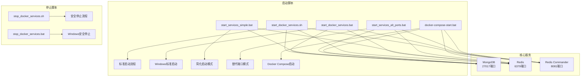
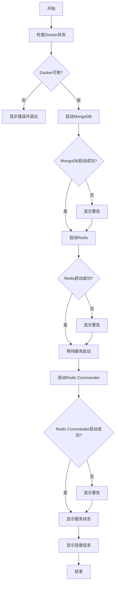
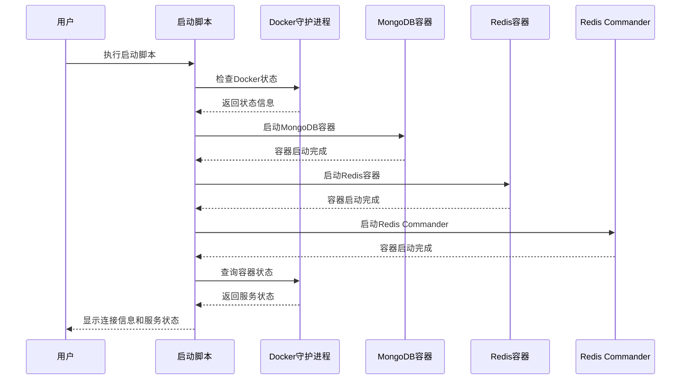
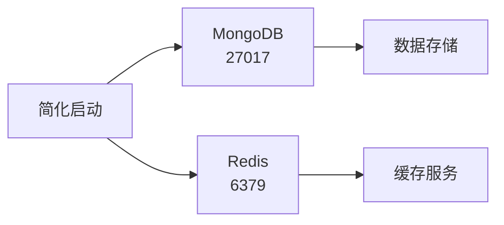
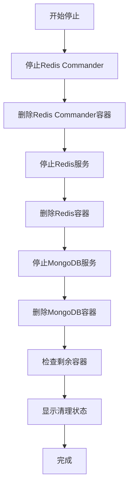
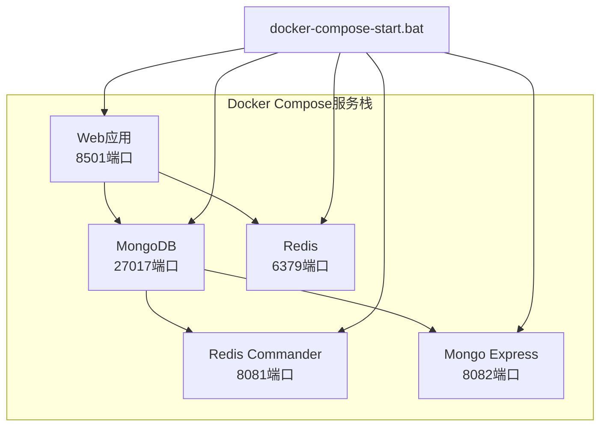
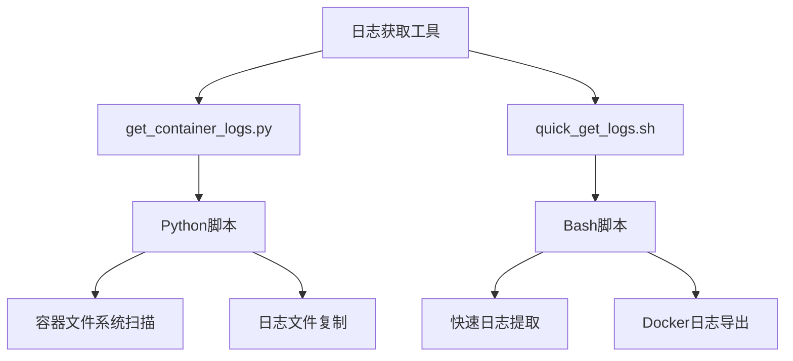

# Docker启动与停止脚本详细使用指南

<cite>
**本文档引用的文件**
- [start_docker_services.sh](file://scripts/docker/start_docker_services.sh)
- [start_docker_services.bat](file://scripts/docker/start_docker_services.bat)
- [stop_docker_services.sh](file://scripts/docker/stop_docker_services.sh)
- [stop_docker_services.bat](file://scripts/docker/stop_docker_services.bat)
- [start_services_simple.bat](file://scripts/docker/start_services_simple.bat)
- [start_services_alt_ports.bat](file://scripts/docker/start_services_alt_ports.bat)
- [docker-compose-start.bat](file://scripts/docker/docker-compose-start.bat)
- [docker-compose.yml](file://docker-compose.yml)
- [mongo-init.js](file://scripts/docker/mongo-init.js)
- [get_container_logs.py](file://scripts/get_container_logs.py)
- [quick_get_logs.sh](file://scripts/quick_get_logs.sh)
- [README.md](file://scripts/docker/README.md)
</cite>

## 目录
1. [简介](#简介)
2. [脚本架构概览](#脚本架构概览)
3. [Linux脚本详解](#linux脚本详解)
4. [Windows脚本详解](#windows脚本详解)
5. [标准启动脚本分析](#标准启动脚本分析)
6. [简化模式与替代端口模式](#简化模式与替代端口模式)
7. [停止脚本安全机制](#停止脚本安全机制)
8. [Docker Compose启动方式](#docker-compose启动方式)
9. [常见问题诊断](#常见问题诊断)
10. [日志获取与故障排查](#日志获取与故障排查)
11. [最佳实践建议](#最佳实践建议)

## 简介

TradingAgents项目提供了完整的Docker服务管理脚本套件，支持Linux和Windows两种操作系统环境。这些脚本负责管理MongoDB、Redis等核心数据库服务的启动、停止和监控，为整个交易分析系统提供基础设施支撑。

### 核心服务组件

- **MongoDB**: 主数据库，存储股票数据、分析结果和用户会话
- **Redis**: 缓存数据库，提供高性能的数据缓存和会话管理
- **Redis Commander**: 可选的Redis管理界面，便于数据库监控

## 脚本架构概览



**图表来源**
- [start_docker_services.sh](file://scripts/docker/start_docker_services.sh#L1-L101)
- [start_docker_services.bat](file://scripts/docker/start_docker_services.bat#L1-L107)
- [docker-compose.yml](file://docker-compose.yml#L1-L159)

## Linux脚本详解

### 脚本特性

Linux脚本采用Bash Shell编写，具有以下特点：

- **交互式反馈**: 实时显示服务启动状态
- **错误处理**: 详细的错误检查和提示
- **数据持久化**: 使用Docker卷确保数据不丢失
- **健康检查**: 启动后自动验证服务状态

### 执行流程



**图表来源**
- [start_docker_services.sh](file://scripts/docker/start_docker_services.sh#L8-L101)

### 关键配置参数

| 参数 | 值 | 说明 |
|------|-----|------|
| 容器名称 | tradingagents-mongodb | MongoDB容器标识 |
| 端口映射 | 27017:27017 | 宿主机到容器的端口映射 |
| 用户名 | admin | MongoDB管理员用户名 |
| 密码 | tradingagents123 | 数据库访问密码 |
| 数据卷 | mongodb_data | 持久化数据存储 |

**章节来源**
- [start_docker_services.sh](file://scripts/docker/start_docker_services.sh#L15-L35)

## Windows脚本详解

### 脚本特性

Windows批处理脚本针对Windows环境进行了优化：

- **字符编码**: 设置UTF-8编码避免中文乱码
- **错误级别检查**: 使用%errorlevel%进行错误处理
- **用户交互**: 提供暂停功能等待用户确认
- **兼容性**: 支持Windows 10/11系统

### 执行环境要求

- **Docker Desktop**: 必须安装并运行Docker Desktop
- **PowerShell**: 需要管理员权限运行
- **网络连接**: 启动时需要互联网连接下载镜像

### 跨平台差异对比

| 特性 | Linux Bash | Windows Batch |
|------|------------|---------------|
| 错误检查 | $? | %errorlevel% |
| 注释符号 | # | REM |
| 命令拼接 | \ | ^ |
| 输出重定向 | >/dev/null | >nul |
| 字符编码 | UTF-8 | 默认ANSI |
| 暂停命令 | sleep | timeout /t |

**章节来源**
- [start_docker_services.bat](file://scripts/docker/start_docker_services.bat#L1-L107)

## 标准启动脚本分析

### 完整服务启动流程

标准启动脚本(`start_docker_services`)实现了完整的三服务启动流程：



**图表来源**
- [start_docker_services.sh](file://scripts/docker/start_docker_services.sh#L15-L85)

### docker-compose up命令参数配置

脚本中使用的Docker命令参数说明：

- **-d**: 后台运行容器
- **--name**: 指定容器名称
- **-p**: 端口映射 host:container
- **-e**: 环境变量设置
- **-v**: 数据卷挂载
- **--restart**: 重启策略
- **--link**: 容器间网络链接

### 服务启动顺序与依赖关系

1. **MongoDB**: 作为主数据库服务，优先启动
2. **Redis**: 缓存服务，依赖于MongoDB的某些功能
3. **Redis Commander**: 可选管理界面，依赖于Redis服务

**章节来源**
- [start_docker_services.sh](file://scripts/docker/start_docker_services.sh#L20-L85)

## 简化模式与替代端口模式

### 简化模式(start_services_simple)

简化模式专注于核心数据库服务，移除了Redis Commander等辅助工具：



**图表来源**
- [start_services_simple.bat](file://scripts/docker/start_services_simple.bat#L1-L45)

### 替代端口模式(start_services_alt_ports)

替代端口模式适用于端口冲突场景：

| 服务 | 默认端口 | 替代端口 | 数据卷名称 |
|------|----------|----------|------------|
| MongoDB | 27017 | 27018 | tradingagents_mongodb_data |
| Redis | 6379 | 6380 | tradingagents_redis_data |
| Redis Commander | 8081 | 8082 | - |

### 适用场景分析

- **简化模式**: 开发环境，减少资源占用
- **替代端口模式**: 生产环境，避免端口冲突
- **标准模式**: 生产部署，完整功能体验

**章节来源**
- [start_services_alt_ports.bat](file://scripts/docker/start_services_alt_ports.bat#L1-L58)

## 停止脚本安全机制

### 安全终止流程

停止脚本实现了安全的服务终止机制：



**图表来源**
- [stop_docker_services.sh](file://scripts/docker/stop_docker_services.sh#L8-L35)

### 数据完整性保护

- **优雅关闭**: 使用`docker stop`而非强制终止
- **数据卷保留**: 停止时不删除数据卷
- **状态检查**: 停止后验证容器状态

### 清理选项说明

| 操作 | 命令 | 影响 |
|------|------|------|
| 停止容器 | docker stop | 服务停止，数据保留 |
| 删除容器 | docker rm | 容器删除，数据保留 |
| 删除数据卷 | docker volume rm | 数据永久删除 |

**章节来源**
- [stop_docker_services.sh](file://scripts/docker/stop_docker_services.sh#L10-L35)

## Docker Compose启动方式

### 组合服务管理

Docker Compose启动脚本提供了更高级的服务管理功能：



**图表来源**
- [docker-compose-start.bat](file://scripts/docker/docker-compose-start.bat#L1-L108)
- [docker-compose.yml](file://docker-compose.yml#L1-L159)

### 健康检查机制

Compose启动脚本实现了多阶段健康检查：

1. **服务启动检查**: 验证容器是否成功启动
2. **健康状态检查**: 等待所有服务达到健康状态
3. **功能验证**: 确认服务正常响应

### 可选管理界面

- **Redis Commander**: 实时Redis监控
- **Mongo Express**: MongoDB Web管理界面
- **Streamlit Web**: 主应用界面

**章节来源**
- [docker-compose-start.bat](file://scripts/docker/docker-compose-start.bat#L25-L85)

## 常见问题诊断

### 端口冲突问题

**症状**: 容器启动失败，提示端口已被占用

**诊断步骤**:
1. 检查端口占用情况: `netstat -an | findstr :27017`
2. 查找占用进程: `tasklist | findstr :27017`
3. 停止冲突服务或使用替代端口模式

**解决方案**:
- 使用替代端口模式脚本
- 手动停止冲突服务
- 修改系统防火墙规则

### 容器启动失败

**常见原因**:
- Docker服务未运行
- 镜像下载失败
- 资源不足（内存、磁盘）

**诊断命令**:
```bash
# 检查Docker状态
docker version

# 查看容器日志
docker logs tradingagents-mongodb

# 检查系统资源
docker system df
```

### 权限错误

**Linux权限问题**:
- Docker组权限不足
- 文件系统权限限制
- SELinux策略阻止

**Windows权限问题**:
- 管理员权限不足
- 防火墙阻止Docker通信
- 虚拟化功能未启用

**解决方法**:
1. 添加用户到docker组
2. 以管理员身份运行
3. 检查虚拟化设置

**章节来源**
- [start_docker_services.sh](file://scripts/docker/start_docker_services.sh#L8-L15)
- [start_docker_services.bat](file://scripts/docker/start_docker_services.bat#L10-L18)

## 日志获取与故障排查

### 自动化日志收集

系统提供了多种日志获取工具：



**图表来源**
- [get_container_logs.py](file://scripts/get_container_logs.py#L1-L274)
- [quick_get_logs.sh](file://scripts/quick_get_logs.sh#L1-L117)

### 日志分析技巧

**关键日志位置**:
- Docker标准日志: `docker logs <container>`
- 容器内应用日志: `/app/logs/`
- MongoDB系统日志: `/var/log/mongodb/`

**常见错误模式**:
- 连接超时: 网络配置问题
- 权限拒绝: 用户认证失败
- 磁盘空间不足: 存储配额限制

### 故障排查流程

1. **服务状态检查**: `docker ps --filter name=tradingagents-`
2. **日志分析**: `docker logs <container> | grep -i error`
3. **资源监控**: `docker stats`
4. **网络诊断**: `docker network inspect tradingagents-network`

**章节来源**
- [get_container_logs.py](file://scripts/get_container_logs.py#L200-L274)
- [quick_get_logs.sh](file://scripts/quick_get_logs.sh#L80-L117)

## 最佳实践建议

### 开发环境配置

- **使用简化模式**: 减少资源消耗
- **定期清理**: 清理停止的容器和数据卷
- **版本控制**: 将配置文件纳入版本控制

### 生产环境部署

- **使用Docker Compose**: 统一服务管理
- **健康检查**: 配置适当的健康检查策略
- **监控告警**: 设置服务状态监控

### 性能优化

- **资源限制**: 为容器设置合理的资源限制
- **存储优化**: 使用SSD存储提高I/O性能
- **网络优化**: 配置合适的网络策略

### 安全考虑

- **访问控制**: 限制数据库访问权限
- **网络安全**: 使用Docker网络隔离
- **定期更新**: 保持Docker和镜像最新

### 备份策略

- **数据备份**: 定期备份MongoDB和Redis数据
- **配置备份**: 备份Docker Compose配置文件
- **日志归档**: 归档历史日志文件

通过遵循这些最佳实践，可以确保TradingAgents系统的稳定运行和高效维护。