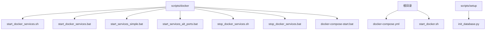
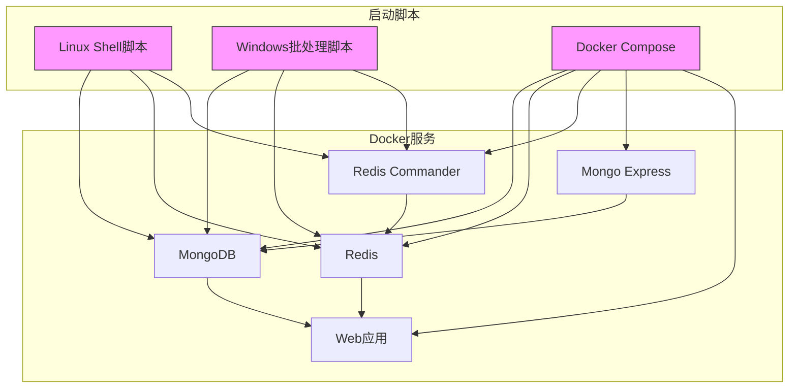
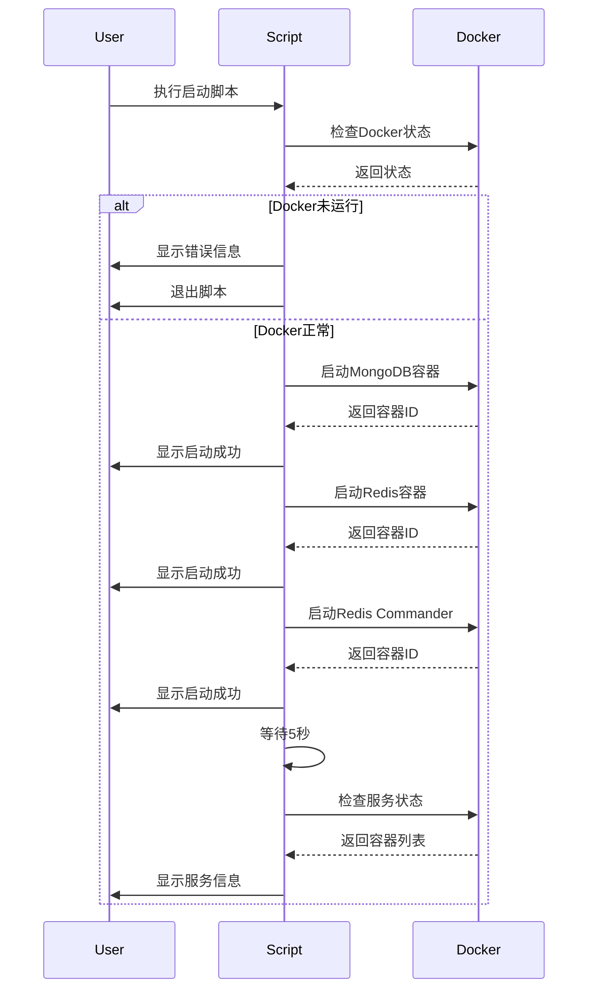
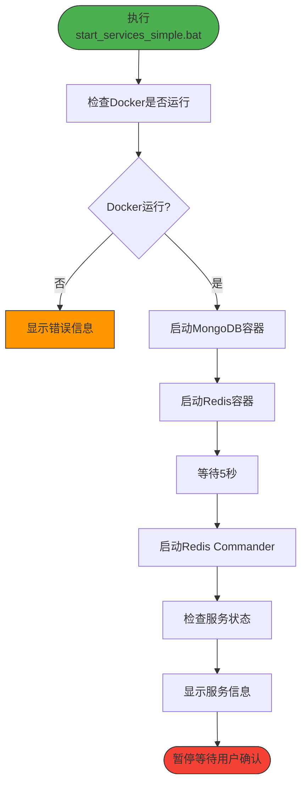
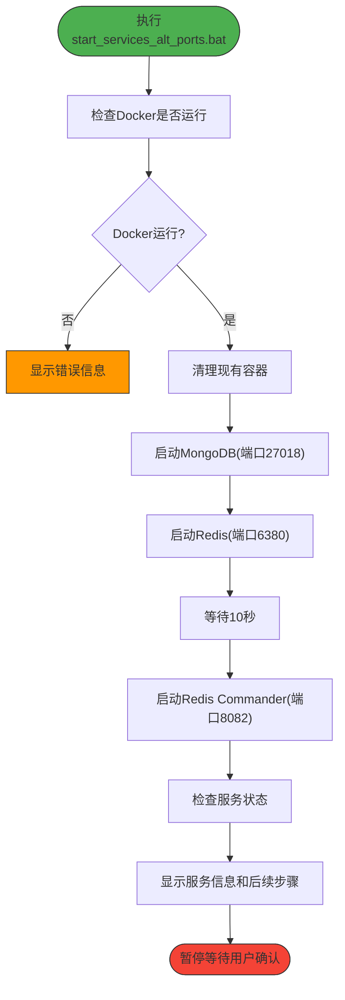
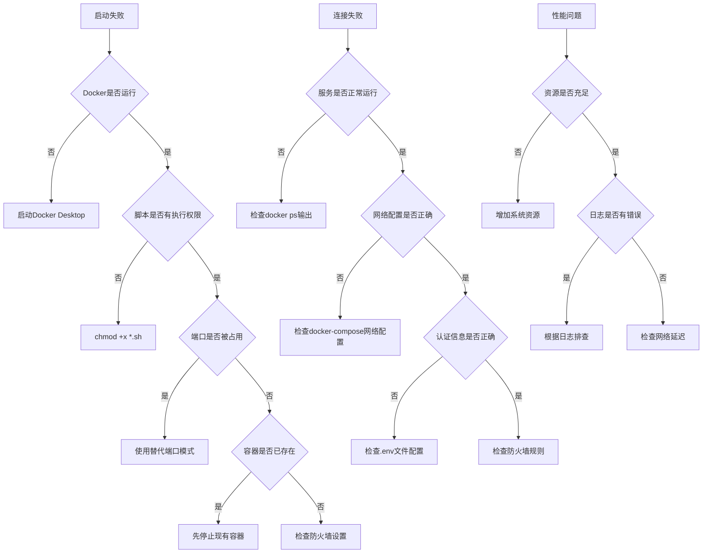

# Docker启动脚本

<cite>
**本文档中引用的文件**   
- [start_docker_services.sh](file://scripts/docker/start_docker_services.sh)
- [start_docker_services.bat](file://scripts/docker/start_docker_services.bat)
- [start_services_simple.bat](file://scripts/docker/start_services_simple.bat)
- [start_services_alt_ports.bat](file://scripts/docker/start_services_alt_ports.bat)
- [stop_docker_services.sh](file://scripts/docker/stop_docker_services.sh)
- [stop_docker_services.bat](file://scripts/docker/stop_docker_services.bat)
- [docker-compose.yml](file://docker-compose.yml)
- [start_docker.sh](file://scripts/start_docker.sh)
- [docker-compose-start.bat](file://scripts/docker/docker-compose-start.bat)
- [init_database.py](file://scripts/setup/init_database.py)
</cite>

## 目录
1. [简介](#简介)
2. [项目结构](#项目结构)
3. [核心组件](#核心组件)
4. [架构概述](#架构概述)
5. [详细组件分析](#详细组件分析)
6. [依赖分析](#依赖分析)
7. [性能考虑](#性能考虑)
8. [故障排除指南](#故障排除指南)
9. [结论](#结论)

## 简介
本文档详细说明了TradingAgents项目中Docker启动脚本的使用方法和内部实现机制。重点分析Linux与Windows平台启动脚本的差异，解释标准启动流程、简化模式和替代端口模式的使用场景，并结合docker-compose.yml文件说明服务依赖关系。

## 项目结构



**Diagram sources**
- [scripts/docker](file://scripts/docker)
- [docker-compose.yml](file://docker-compose.yml)
- [scripts/setup](file://scripts/setup)

**Section sources**
- [scripts/docker](file://scripts/docker)
- [docker-compose.yml](file://docker-compose.yml)

## 核心组件

本文档的核心组件包括：
- Linux平台启动脚本：`start_docker_services.sh`
- Windows平台启动脚本：`start_docker_services.bat`
- 简化模式启动脚本：`start_services_simple.bat`
- 替代端口模式启动脚本：`start_services_alt_ports.bat`
- Docker编排配置文件：`docker-compose.yml`
- 数据库初始化脚本：`init_database.py`

这些组件共同构成了TradingAgents项目的Docker服务管理生态系统，提供了跨平台、多场景的服务启动解决方案。

**Section sources**
- [start_docker_services.sh](file://scripts/docker/start_docker_services.sh)
- [start_docker_services.bat](file://scripts/docker/start_docker_services.bat)
- [start_services_simple.bat](file://scripts/docker/start_services_simple.bat)
- [start_services_alt_ports.bat](file://scripts/docker/start_services_alt_ports.bat)
- [docker-compose.yml](file://docker-compose.yml)
- [init_database.py](file://scripts/setup/init_database.py)

## 架构概述



**Diagram sources**
- [start_docker_services.sh](file://scripts/docker/start_docker_services.sh)
- [start_docker_services.bat](file://scripts/docker/start_docker_services.bat)
- [docker-compose.yml](file://docker-compose.yml)

## 详细组件分析

### 标准启动脚本分析

#### Linux与Windows脚本差异分析
```mermaid
classDiagram
class LinuxScript {
+#!/bin/bash
+echo "..."
+docker version
+docker run -d
+sleep 5
+chown/chmod
}
class WindowsScript {
+@echo off
+chcp 65001
+echo ...
+docker version
+docker run -d ^
+timeout /t 5
+pause
}
LinuxScript : 命令语法 : echo "text"
LinuxScript : 错误处理 : $?变量
LinuxScript : 行续符 : \
LinuxScript : 等待命令 : sleep
LinuxScript : 权限 : 需要执行权限
WindowsScript : 命令语法 : echo text
WindowsScript : 错误处理 : %errorlevel%
WindowsScript : 行续符 : ^
WindowsScript : 等待命令 : timeout
WindowsScript : 暂停 : pause
```

**Diagram sources**
- [start_docker_services.sh](file://scripts/docker/start_docker_services.sh)
- [start_docker_services.bat](file://scripts/docker/start_docker_services.bat)

#### 标准启动流程


**Diagram sources**
- [start_docker_services.sh](file://scripts/docker/start_docker_services.sh)
- [start_docker_services.bat](file://scripts/docker/start_docker_services.bat)

### 简化模式启动分析

#### 简化模式流程


**Diagram sources**
- [start_services_simple.bat](file://scripts/docker/start_services_simple.bat)

### 替代端口模式分析

#### 替代端口模式流程


**Diagram sources**
- [start_services_alt_ports.bat](file://scripts/docker/start_services_alt_ports.bat)

### Docker Compose模式分析

#### Docker Compose启动流程
```mermaid
sequenceDiagram
participant User
participant Script
participant DockerCompose
User->>Script : 执行docker-compose-start.bat
Script->>DockerCompose : 检查docker-compose版本
DockerCompose-->>Script : 返回版本信息
alt docker-compose不可用
Script->>User : 显示错误信息
Script->>User : 退出脚本
else docker-compose可用
Script->>DockerCompose : 启动核心服务
DockerCompose-->>Script : 返回启动结果
Script->>Script : 等待10秒
loop 健康检查循环
Script->>DockerCompose : 检查服务健康状态
DockerCompose-->>Script : 返回健康状态
alt 所有服务健康
Script->>User : 显示健康检查通过
break
else 服务未健康
Script->>Script : 等待5秒
end
end
Script->>User : 显示服务访问信息
Script->>User : 询问是否启动管理界面
alt 用户选择启动
Script->>DockerCompose : 启动Mongo Express
DockerCompose-->>Script : 返回启动结果
end
Script->>User : 显示管理命令和下一步
end
```

**Diagram sources**
- [docker-compose-start.bat](file://scripts/docker/docker-compose-start.bat)

## 依赖分析

```mermaid
erDiagram
DOCKER_SCRIPTS {
string script_name PK
string platform
string mode
string description
}
SERVICES {
string service_name PK
string image
string port
string volume
string restart_policy
}
ENVIRONMENT {
string env_var PK
string value
string description
}
CONFIG_FILES {
string file_name PK
string path
string description
}
DOCKER_SCRIPTS ||--o{ SERVICES : "启动"
DOCKER_SCRIPTS }|--|| CONFIG_FILES : "使用"
SERVICES }|--|| ENVIRONMENT : "使用"
CONFIG_FILES ||--o{ ENVIRONMENT : "包含"
DOCKER_SCRIPTS {
"start_docker_services.sh"
"start_docker_services.bat"
"start_services_simple.bat"
"start_services_alt_ports.bat"
"docker-compose-start.bat"
}
SERVICES {
"mongodb:4.4"
"redis:latest"
"rediscommander/redis-commander:latest"
"ghcr.io/joeferner/redis-commander:latest"
"mongo-express:latest"
"tradingagents-cn:latest"
}
CONFIG_FILES {
"docker-compose.yml"
".env"
"scripts/setup/init_database.py"
}
```

**Diagram sources**
- [docker-compose.yml](file://docker-compose.yml)
- [start_docker_services.sh](file://scripts/docker/start_docker_services.sh)
- [start_docker_services.bat](file://scripts/docker/start_docker_services.bat)

## 性能考虑

Docker启动脚本在设计时考虑了以下性能因素：

1. **容器重启策略**：所有服务都配置了`--restart unless-stopped`策略，确保服务在系统重启或意外终止后能自动恢复，提高了系统的可用性。

2. **数据持久化**：使用Docker卷（`mongodb_data`和`redis_data`）来持久化数据，避免了容器重启时数据丢失的问题，同时提供了更好的I/O性能。

3. **健康检查机制**：在docker-compose.yml中为每个服务配置了健康检查，确保服务完全启动后再进行依赖操作，避免了因服务未就绪导致的错误。

4. **资源隔离**：通过Docker容器化部署，实现了服务间的资源隔离，避免了资源竞争问题。

5. **启动顺序优化**：脚本中通过适当的等待时间（如5-10秒）来确保服务有足够时间初始化，避免了因启动顺序不当导致的依赖问题。

**Section sources**
- [docker-compose.yml](file://docker-compose.yml)
- [start_docker_services.sh](file://scripts/docker/start_docker_services.sh)
- [start_docker_services.bat](file://scripts/docker/start_docker_services.bat)

## 故障排除指南

### 常见问题及解决方案



**Diagram sources**
- [start_docker_services.sh](file://scripts/docker/start_docker_services.sh)
- [start_docker_services.bat](file://scripts/docker/start_docker_services.bat)
- [docker-compose.yml](file://docker-compose.yml)

### 日志查看方法

1. **查看特定容器日志**：
   ```bash
   docker logs tradingagents-mongodb
   docker logs tradingagents-redis
   docker logs TradingAgents-web
   ```

2. **实时查看日志流**：
   ```bash
   docker logs -f tradingagents-mongodb
   ```

3. **查看Docker Compose日志**：
   ```bash
   docker-compose logs -f web
   ```

4. **查看应用日志文件**：
   - 日志文件位于项目根目录的`logs/`文件夹中
   - 主要日志文件：`logs/tradingagents.log`

**Section sources**
- [start_docker_services.sh](file://scripts/docker/start_docker_services.sh)
- [start_docker_services.bat](file://scripts/docker/start_docker_services.bat)
- [docker-compose.yml](file://docker-compose.yml)

## 结论

TradingAgents项目的Docker启动脚本提供了一套完整的、跨平台的服务管理解决方案。通过分析这些脚本，我们可以得出以下结论：

1. **跨平台兼容性**：项目提供了Linux和Windows两个平台的启动脚本，确保了在不同操作系统上的可用性。

2. **多种启动模式**：提供了标准模式、简化模式和替代端口模式，满足了不同场景下的需求。

3. **自动化程度高**：脚本自动处理了Docker状态检查、服务启动、状态验证等流程，降低了用户的操作复杂度。

4. **健壮的错误处理**：脚本中包含了完善的错误检查和处理机制，能够及时发现并报告问题。

5. **良好的用户体验**：提供了清晰的输出信息、连接详情和后续步骤指导，帮助用户快速上手。

6. **灵活的配置选项**：通过环境变量和配置文件实现了配置的灵活性，便于定制和扩展。

7. **完善的文档支持**：配合docker-compose.yml文件，形成了完整的容器化部署方案。

这些启动脚本不仅简化了开发环境的搭建过程，也为生产环境的部署提供了参考，体现了项目在可维护性和可扩展性方面的良好设计。