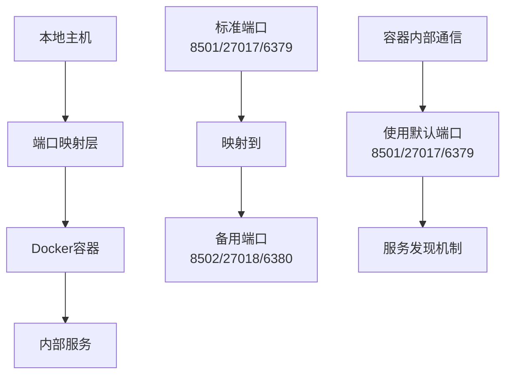
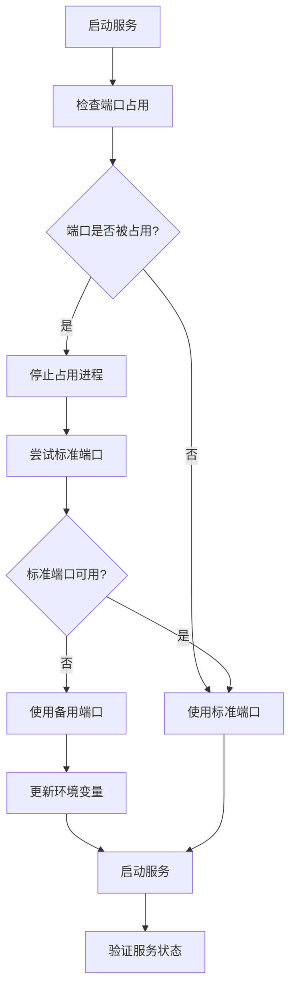
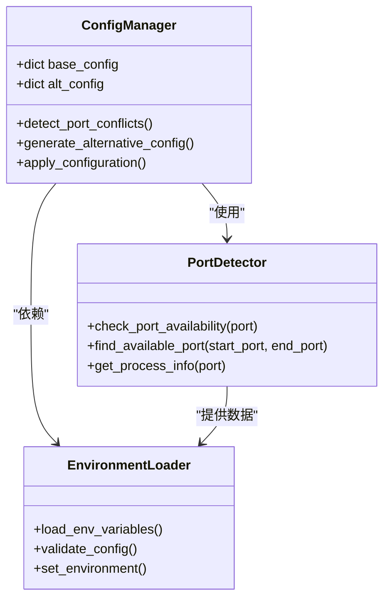
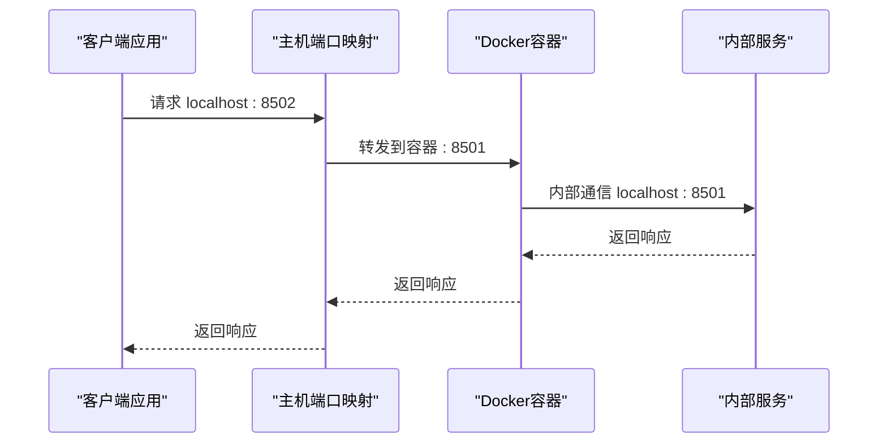

# 替代端口Docker启动脚本技术文档

<cite>
**本文档引用的文件**
- [start_services_alt_ports.bat](file://scripts/docker/start_services_alt_ports.bat)
- [docker-compose.yml](file://docker-compose.yml)
- [start_docker_services.bat](file://scripts/docker/start_docker_services.bat)
- [start_docker_services.sh](file://scripts/docker/start_docker_services.sh)
- [setup-docker.py](file://scripts/setup-docker.py)
- [check_system_status.py](file://scripts/validation/check_system_status.py)
- [debug_docker.sh](file://scripts/debug_docker.sh)
- [debug_docker.ps1](file://scripts/debug_docker.ps1)
- [database_manager.py](file://tradingagents/config/database_manager.py)
- [database_config.py](file://tradingagents/config/database_config.py)
- [db_cache_manager.py](file://tradingagents/dataflows/db_cache_manager.py)
</cite>

## 目录
1. [概述](#概述)
2. [端口映射策略](#端口映射策略)
3. [冲突检测与解决机制](#冲突检测与解决机制)
4. [环境变量配置](#环境变量配置)
5. [容器间通信机制](#容器间通信机制)
6. [故障排除指南](#故障排除指南)
7. [最佳实践建议](#最佳实践建议)
8. [总结](#总结)

## 概述

TradingAgents项目提供了灵活的Docker服务启动方案，特别针对端口冲突场景设计了替代端口映射策略。当本地标准端口（8501、27017、6379）被占用时，系统能够自动调整至备用端口（8502、27018、6380），确保服务正常启动和运行。

该解决方案采用硬编码端口映射的方式，在`start_services_alt_ports.bat`脚本中明确指定了替代端口，同时保持容器内部服务发现机制的完整性。

## 端口映射策略

### 标准端口配置

项目默认使用以下端口配置：

| 服务类型 | 标准端口 | 备用端口 | 映射规则 |
|---------|---------|---------|----------|
| Streamlit Web应用 | 8501 | 8502 | `-p 8502:8501` |
| MongoDB数据库 | 27017 | 27018 | `-p 27018:27017` |
| Redis缓存服务 | 6379 | 6380 | `-p 6380:6379` |
| Redis Commander | 8081 | 8082 | `-p 8082:8081` |

### 端口映射实现机制

替代端口脚本通过Docker的端口映射功能实现服务暴露：



**图表来源**
- [start_services_alt_ports.bat](file://scripts/docker/start_services_alt_ports.bat#L15-L35)
- [docker-compose.yml](file://docker-compose.yml#L15-L25)

**章节来源**
- [start_services_alt_ports.bat](file://scripts/docker/start_services_alt_ports.bat#L15-L35)
- [docker-compose.yml](file://docker-compose.yml#L15-L25)

## 冲突检测与解决机制

### 端口占用检测

系统提供了多层次的端口检测机制：

#### Windows平台检测
```powershell
# PowerShell端口检测命令
$ports = @(8501, 27017, 6379, 8081, 8082)
foreach ($port in $ports) {
    $result = netstat -an | Select-String ":$port "
    if ($result) {
        Write-Host "端口 $port 被占用: $result" -ForegroundColor Yellow
    } else {
        Write-Host "端口 $port 空闲" -ForegroundColor Green
    }
}
```

#### Linux/Mac平台检测
```bash
# Bash端口检测命令
ports=(8501 27017 6379 8081 8082)
for port in "${ports[@]}"; do
    if lsof -i :$port > /dev/null 2>&1; then
        echo "端口 $port 被占用:"
        lsof -i :$port
    else
        echo "端口 $port 空闲"
    fi
done
```

### 冲突解决流程



**图表来源**
- [debug_docker.ps1](file://scripts/debug_docker.ps1#L25-L35)
- [debug_docker.sh](file://scripts/debug_docker.sh#L25-L35)

**章节来源**
- [debug_docker.ps1](file://scripts/debug_docker.ps1#L25-L35)
- [debug_docker.sh](file://scripts/debug_docker.sh#L25-L35)

## 环境变量配置

### 硬编码配置问题

当前替代端口脚本采用硬编码方式配置端口，这种方式存在以下问题：

1. **维护困难**：修改端口需要直接编辑脚本文件
2. **配置分散**：不同环境下的配置难以统一管理
3. **扩展性差**：新增服务端口需要额外修改多个文件

### 参数化配置建议

推荐使用环境变量实现参数化配置：

```python
# 环境变量配置示例
import os

# 从环境变量读取端口配置
WEB_PORT = int(os.getenv('WEB_PORT', 8502))
MONGODB_PORT = int(os.getenv('MONGODB_PORT', 27018))
REDIS_PORT = int(os.getenv('REDIS_PORT', 6380))

# 构建Docker运行命令
docker_command = f"""
docker run -d \\
    --name tradingagents-web \\
    -p {WEB_PORT}:8501 \\
    -e WEB_PORT={WEB_PORT} \\
    ...
"""
```

### 动态配置管理



**图表来源**
- [database_manager.py](file://tradingagents/config/database_manager.py#L49-L76)
- [database_config.py](file://tradingagents/config/database_config.py#L56-L108)

**章节来源**
- [database_manager.py](file://tradingagents/config/database_manager.py#L49-L76)
- [database_config.py](file://tradingagents/config/database_config.py#L56-L108)

## 容器间通信机制

### 主机绑定端口变更

替代端口方案的关键特性是：**仅主机绑定端口变更，容器内部通信保持不变**。



**图表来源**
- [start_services_alt_ports.bat](file://scripts/docker/start_services_alt_ports.bat#L15-L35)
- [docker-compose.yml](file://docker-compose.yml#L15-L25)

### 服务发现机制

容器内部的服务发现仍然使用默认端口，确保：

1. **内部通信效率**：避免额外的端口转换开销
2. **配置一致性**：应用程序无需感知端口变化
3. **负载均衡支持**：支持集群环境下的服务发现

**章节来源**
- [start_services_alt_ports.bat](file://scripts/docker/start_services_alt_ports.bat#L15-L35)
- [docker-compose.yml](file://docker-compose.yml#L15-L25)

## 故障排除指南

### 常见问题诊断

#### 1. 端口冲突问题

**症状**：服务启动失败，提示端口已被占用

**诊断步骤**：
```bash
# Windows
netstat -an | findstr :8501
netstat -an | findstr :27017
netstat -an | findstr :6379

# Linux/Mac
lsof -i :8501
lsof -i :27017
lsof -i :6379
```

**解决方案**：
1. 终止占用端口的进程
2. 使用替代端口脚本
3. 修改应用程序配置

#### 2. Docker服务状态检查

```bash
# 检查Docker服务状态
docker version

# 检查容器运行状态
docker ps --filter "name=tradingagents-"

# 检查网络连接
docker network ls | grep tradingagents
```

#### 3. 环境变量验证

```python
# 验证数据库配置
import os
print(f"MongoDB端口: {os.getenv('MONGODB_PORT', '27017')}")
print(f"Redis端口: {os.getenv('REDIS_PORT', '6379')}")
```

### 切换指导

#### 从标准模式切换到替代模式

1. **停止现有服务**：
   ```bash
   docker stop tradingagents-mongodb tradingagents-redis tradingagents-redis-commander
   docker rm tradingagents-mongodb tradingagents-redis tradingagents-redis-commander
   ```

2. **运行替代端口脚本**：
   ```bash
   # Windows
   scripts\docker\start_services_alt_ports.bat
   
   # Linux/Mac
   ./scripts/docker/start_services_alt_ports.bat
   ```

3. **更新环境变量**：
   ```bash
   # 更新.env文件
   MONGODB_PORT=27018
   REDIS_PORT=6380
   ```

4. **重新初始化数据库**：
   ```bash
   python scripts/init_database.py
   ```

#### 从替代模式切换回标准模式

1. **停止替代端口服务**：
   ```bash
   docker stop tradingagents-mongodb tradingagents-redis tradingagents-redis-commander
   docker rm tradingagents-mongodb tradingagents-redis tradingagents-redis-commander
   ```

2. **清理端口占用**：
   ```bash
   # 终止占用标准端口的进程
   # Windows
   taskkill /F /IM mongod.exe /T
   taskkill /F /IM redis-server.exe /T
   
   # Linux/Mac
   pkill -f mongod
   pkill -f redis-server
   ```

3. **运行标准启动脚本**：
   ```bash
   # Windows
   scripts\docker\start_docker_services.bat
   
   # Linux/Mac
   ./scripts/docker/start_docker_services.sh
   ```

**章节来源**
- [check_system_status.py](file://scripts/validation/check_system_status.py#L40-L60)
- [setup-docker.py](file://scripts/setup-docker.py#L50-L60)

## 最佳实践建议

### 配置管理优化

1. **使用环境变量文件**：
   ```bash
   # .env.local
   MONGODB_PORT=27018
   REDIS_PORT=6380
   WEB_PORT=8502
   ```

2. **自动化端口检测**：
   ```python
   def detect_available_ports(base_ports):
       """自动检测可用端口"""
       available_ports = {}
       for service, base_port in base_ports.items():
           port = find_available_port(base_port)
           available_ports[service] = port
       return available_ports
   ```

3. **配置验证机制**：
   ```python
   def validate_configuration(config):
       """验证配置的有效性"""
       required_vars = ['MONGODB_PORT', 'REDIS_PORT', 'WEB_PORT']
       for var in required_vars:
           if not config.get(var):
               raise ValueError(f"缺少必需的配置变量: {var}")
   ```

### 监控与日志

1. **端口监控**：
   ```bash
   # 定期检查端口状态
   while true; do
       echo "$(date): 检查端口状态"
       ./scripts/debug_docker.sh
       sleep 300
   done
   ```

2. **日志记录**：
   ```python
   # 记录端口配置变更
   logger.info(f"端口配置更新: MongoDB={mongodb_port}, Redis={redis_port}, Web={web_port}")
   ```

### 部署策略

1. **多环境配置**：
   - 开发环境：使用标准端口
   - 测试环境：使用替代端口
   - 生产环境：动态分配端口

2. **容器编排**：
   ```yaml
   # docker-compose.override.yml
   version: '3.8'
   services:
     web:
       ports:
         - "${WEB_PORT:-8502}:8501"
     mongodb:
       ports:
         - "${MONGODB_PORT:-27018}:27017"
     redis:
       ports:
         - "${REDIS_PORT:-6380}:6379"
   ```

## 总结

TradingAgents项目的替代端口Docker启动方案提供了有效的端口冲突解决方案。通过硬编码的端口映射策略，系统能够在本地端口被占用时自动切换到备用端口，确保服务的连续性和可用性。

### 关键优势

1. **简单易用**：一键切换到替代端口模式
2. **兼容性强**：保持容器内部通信机制不变
3. **故障恢复**：提供清晰的切换指导和故障排除方案

### 改进建议

1. **参数化配置**：将硬编码端口改为环境变量配置
2. **自动化检测**：实现自动端口冲突检测和解决
3. **配置管理**：建立统一的配置管理机制

通过持续优化配置管理和自动化检测机制，可以进一步提升系统的稳定性和用户体验。