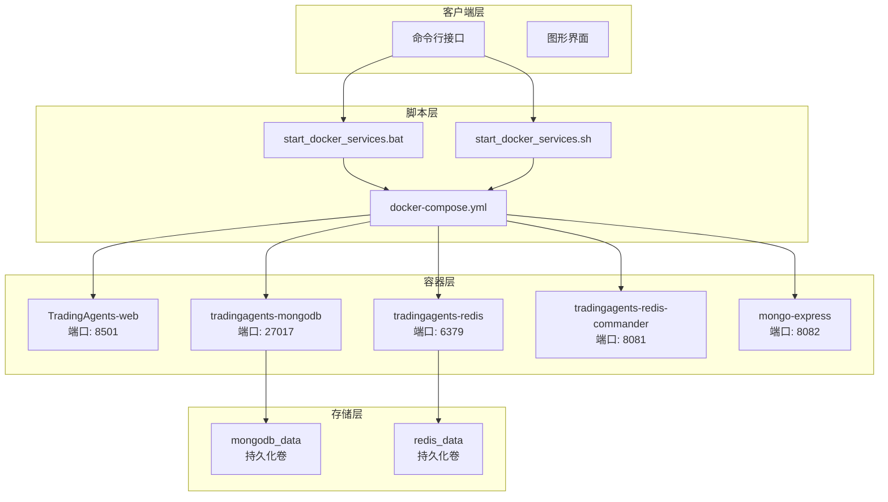
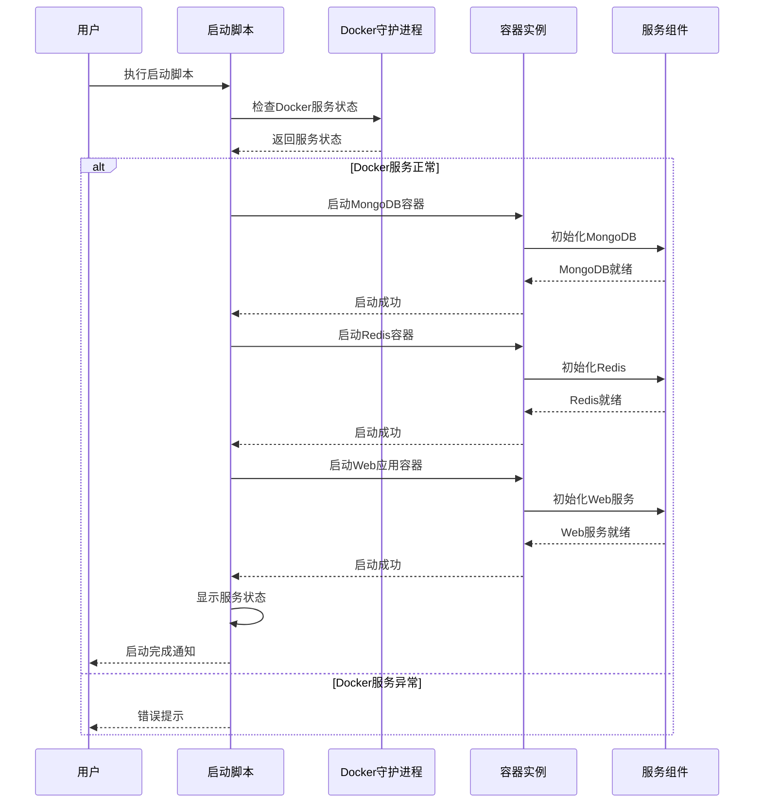
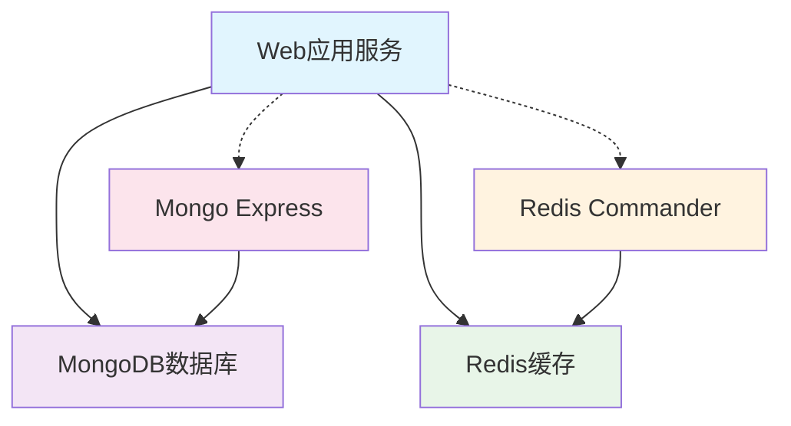
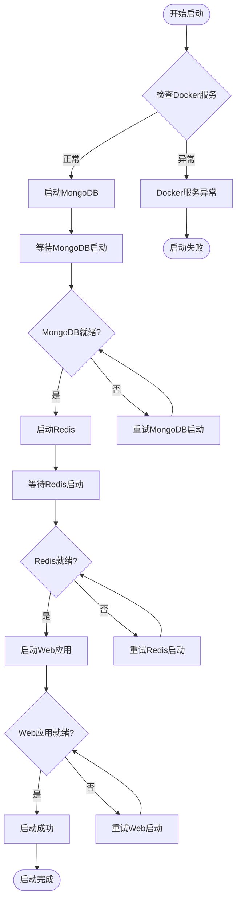
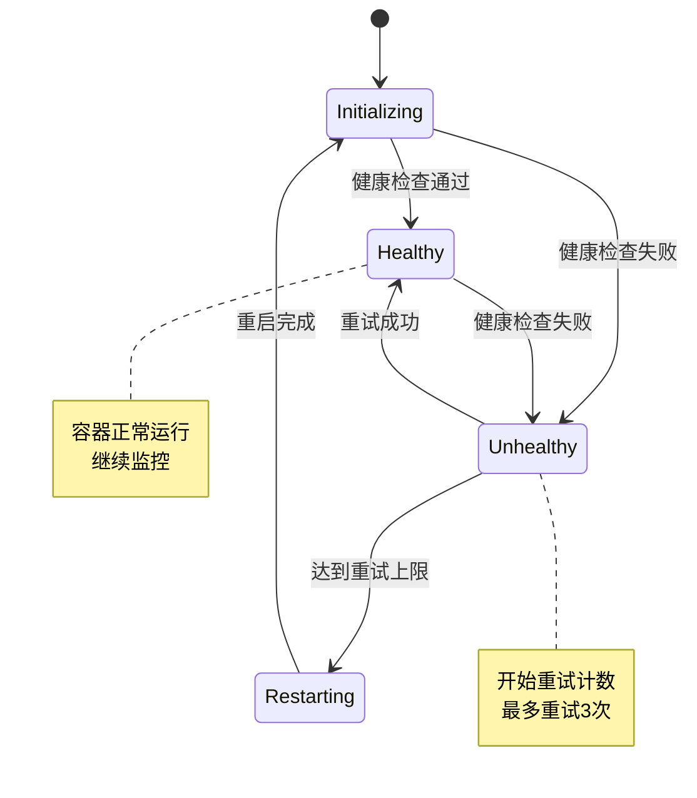
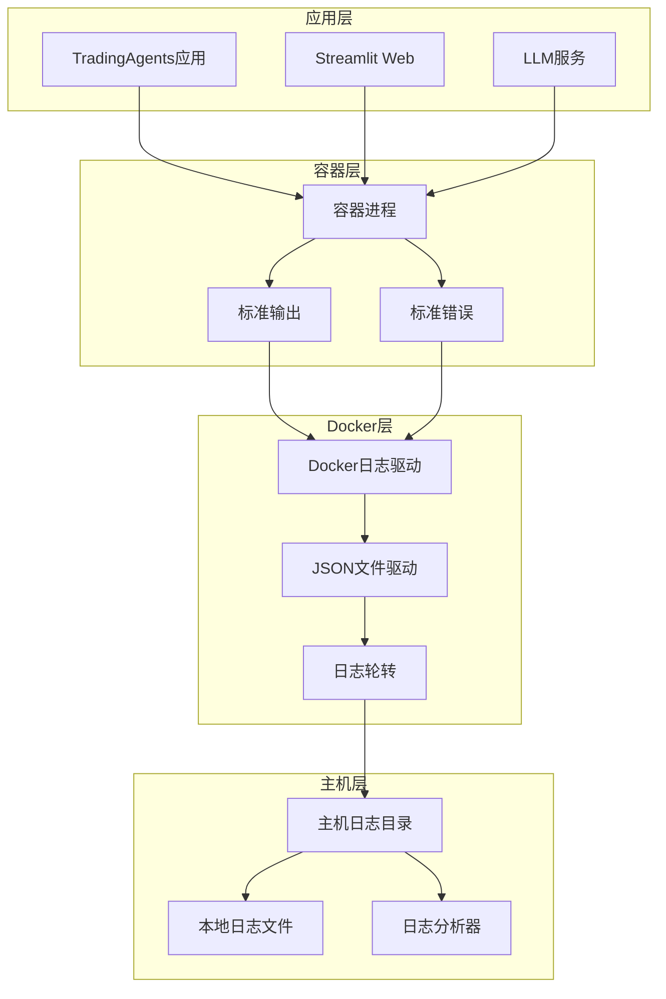

# 标准Docker启动流程

<cite>
**本文档引用的文件**
- [start_docker_services.sh](file://scripts/docker/start_docker_services.sh)
- [start_docker_services.bat](file://scripts/docker/start_docker_services.bat)
- [stop_docker_services.sh](file://scripts/docker/stop_docker_services.sh)
- [stop_docker_services.bat](file://scripts/docker/stop_docker_services.bat)
- [docker-compose.yml](file://docker-compose.yml)
- [mongo-init.js](file://scripts/docker/mongo-init.js)
- [debug_docker.sh](file://scripts/debug_docker.sh)
- [verify_docker_logs.py](file://scripts/verify_docker_logs.py)
- [setup-docker.py](file://scripts/setup-docker.py)
</cite>

## 目录
1. [项目概述](#项目概述)
2. [Docker启动流程架构](#docker启动流程架构)
3. [跨平台脚本实现](#跨平台脚本实现)
4. [核心组件分析](#核心组件分析)
5. [docker-compose配置详解](#docker-compose配置详解)
6. [服务启动顺序与依赖关系](#服务启动顺序与依赖关系)
7. [健康检查机制](#健康检查机制)
8. [日志监控与验证](#日志监控与验证)
9. [错误处理与故障排除](#错误处理与故障排除)
10. [最佳实践建议](#最佳实践建议)

## 项目概述

TradingAgents-CN项目采用Docker容器化部署方案，提供了完整的跨平台Docker启动流程。该系统通过标准化的启动脚本和配置文件，实现了MongoDB、Redis等核心服务的一键式部署，为Web应用提供了稳定的数据存储和缓存服务基础。

### 核心服务组成

- **Web应用服务**: Streamlit前端应用，监听端口8501
- **MongoDB数据库**: 版本4.4，提供文档型数据存储
- **Redis缓存**: 提供高性能内存数据缓存
- **Redis Commander**: 可选的Redis管理界面，端口8081
- **Mongo Express**: 可选的MongoDB管理界面，端口8082

## Docker启动流程架构

### 整体架构图



**图表来源**
- [start_docker_services.sh](file://scripts/docker/start_docker_services.sh#L1-L101)
- [start_docker_services.bat](file://scripts/docker/start_docker_services.bat#L1-L107)
- [docker-compose.yml](file://docker-compose.yml#L1-L159)

### 启动流程时序图



**图表来源**
- [start_docker_services.sh](file://scripts/docker/start_docker_services.sh#L8-L101)
- [start_docker_services.bat](file://scripts/docker/start_docker_services.bat#L8-L107)

## 跨平台脚本实现

### Linux Shell脚本特性

Linux脚本采用Bash语法，具有以下特点：

#### 命令语法差异
- **条件判断**: 使用`[ condition ]`语法
- **变量赋值**: 直接赋值，无需`set`命令
- **错误处理**: 使用`$?`获取上一条命令的退出状态码
- **字符串操作**: 支持丰富的字符串处理功能

#### 环境变量处理
```bash
# 检查Docker服务状态
if ! docker version >/dev/null 2>&1; then
    echo "❌ Docker未运行或未安装，请先启动Docker"
    exit 1
fi
```

#### 执行权限处理
- 脚本需要可执行权限：`chmod +x start_docker_services.sh`
- 使用Shebang声明：`#!/bin/bash`
- 支持管道和重定向操作

**章节来源**
- [start_docker_services.sh](file://scripts/docker/start_docker_services.sh#L1-L101)

### Windows批处理脚本特性

Windows脚本采用批处理语法，具有以下特点：

#### 命令语法差异
- **条件判断**: 使用`if %errorlevel% neq 0`语法
- **变量引用**: 使用`%variable%`语法
- **错误处理**: 使用`%errorlevel%`环境变量
- **字符串操作**: 功能相对有限

#### 环境变量处理
```batch
REM 检查Docker是否运行
docker version >nul 2>&1
if %errorlevel% neq 0 (
    echo [ERROR] Docker is not running or not installed
    echo Please start Docker Desktop first
    pause
    exit /b 1
)
```

#### 执行权限处理
- 自动识别`.bat`扩展名
- 支持`chcp 65001`设置UTF-8编码
- 使用`pause`命令暂停等待用户确认

**章节来源**
- [start_docker_services.bat](file://scripts/docker/start_docker_services.bat#L1-L107)

### 跨平台兼容性对比表

| 特性 | Linux Bash | Windows Batch |
|------|------------|---------------|
| **命令语法** | 引号包围，空格分隔 | 空格分隔，无引号要求 |
| **变量引用** | `$VAR` | `%VAR%` |
| **条件判断** | `[ condition ]` | `if condition` |
| **错误处理** | `$?` | `%errorlevel%` |
| **字符串处理** | 丰富内置功能 | 基础功能 |
| **管道支持** | 完整支持 | 有限支持 |
| **注释符号** | `#` | `REM` 或 `::` |
| **执行权限** | 需要chmod +x | 自动识别 |

## 核心组件分析

### MongoDB容器配置

#### 容器规格
- **镜像**: `mongo:4.4`
- **端口映射**: `27017:27017`
- **数据卷**: `mongodb_data:/data/db`
- **重启策略**: `unless-stopped`

#### 环境变量配置
- `MONGO_INITDB_ROOT_USERNAME`: admin
- `MONGO_INITDB_ROOT_PASSWORD`: tradingagents123  
- `MONGO_INITDB_DATABASE`: tradingagents

#### 初始化脚本集成
通过`mongo-init.js`脚本实现数据库初始化：
- 创建核心集合：stock_data、analysis_results、user_sessions、configurations
- 设置索引优化查询性能
- 插入初始配置数据和示例股票数据

**章节来源**
- [start_docker_services.sh](file://scripts/docker/start_docker_services.sh#L15-L35)
- [mongo-init.js](file://scripts/docker/mongo-init.js#L1-L141)

### Redis容器配置

#### 容器规格
- **镜像**: `redis:latest`
- **端口映射**: `6379:6379`
- **数据卷**: `redis_data:/data`
- **重启策略**: `unless-stopped`

#### 配置参数
- `--appendonly yes`: 启用持久化
- `--requirepass tradingagents123`: 设置密码认证

#### 缓存策略
- 支持多种数据类型：字符串、哈希、列表、集合、有序集合
- 提供TTL过期机制
- 支持主从复制和集群模式

**章节来源**
- [start_docker_services.sh](file://scripts/docker/start_docker_services.sh#L37-L47)

### Web应用容器配置

#### 容器规格
- **镜像**: `tradingagents-cn:latest`
- **端口映射**: `8501:8501`
- **工作目录**: `/app`
- **启动命令**: `python -m streamlit run web/app.py`

#### 环境变量配置
- `PYTHONUNBUFFERED`: 1（禁用Python缓冲）
- `PYTHONDONTWRITEBYTECODE`: 1（不生成.pyc文件）
- `TZ`: Asia/Shanghai（时区设置）
- `DOCKER_CONTAINER`: true（Docker环境标识）

#### 挂载卷配置
- `.env:/app/.env`：环境变量文件
- `./web:/app/web`：Web应用源码
- `./logs:/app/logs`：日志目录
- `./config:/app/config`：配置目录

**章节来源**
- [docker-compose.yml](file://docker-compose.yml#L1-L159)

## docker-compose配置详解

### 核心参数配置

#### docker-compose up命令参数

```yaml
# 标准启动命令
docker-compose up -d --remove-orphans --compatibility

# 参数说明
# -d: 后台守护进程运行
# --remove-orphans: 清理配置中已移除但仍在运行的孤立容器
# --compatibility: 兼容性模式，支持v3格式编排文件
```

#### 服务依赖关系



**图表来源**
- [docker-compose.yml](file://docker-compose.yml#L70-L85)

### 网络配置

#### 自定义网络
- **网络名称**: `tradingagents-network`
- **驱动类型**: `bridge`
- **连接方式**: 容器间直接通信

#### 端口映射策略
- **Web服务**: `8501:8501`（Streamlit应用）
- **MongoDB**: `27017:27017`（数据库端口）
- **Redis**: `6379:6379`（缓存端口）
- **Redis Commander**: `8081:8081`（管理界面）
- **Mongo Express**: `8082:8081`（管理界面）

### 存储配置

#### 数据卷类型
- **本地卷**: `tradingagents_mongodb_data`
- **本地卷**: `tradingagents_redis_data`

#### 卷挂载策略
- **只读挂载**: `mongo-init.js`脚本
- **读写挂载**: 日志目录、配置目录
- **开发模式**: 代码热重载支持

**章节来源**
- [docker-compose.yml](file://docker-compose.yml#L140-L159)

## 服务启动顺序与依赖关系

### 启动顺序分析

#### 1. MongoDB优先启动
```bash
# MongoDB启动命令
docker run -d \
    --name tradingagents-mongodb \
    -p 27017:27017 \
    -e MONGO_INITDB_ROOT_USERNAME=admin \
    -e MONGO_INITDB_ROOT_PASSWORD=tradingagents123 \
    -e MONGO_INITDB_DATABASE=tradingagents \
    -v mongodb_data:/data/db \
    --restart unless-stopped \
    mongo:4.4
```

#### 2. Redis次之启动
```bash
# Redis启动命令
docker run -d \
    --name tradingagents-redis \
    -p 6379:6379 \
    -v redis_data:/data \
    --restart unless-stopped \
    redis:latest redis-server --appendonly yes --requirepass tradingagents123
```

#### 3. Web应用最后启动
```bash
# Web应用启动命令
docker-compose up -d
```

### 依赖关系验证

#### 服务依赖检查表

| 服务 | 依赖服务 | 检查方法 | 端口状态 |
|------|----------|----------|----------|
| **Web应用** | MongoDB、Redis | 健康检查 | 8501: ✅ |
| **MongoDB** | 无 | ping命令 | 27017: ✅ |
| **Redis** | 无 | ping命令 | 6379: ✅ |
| **Redis Commander** | Redis | HTTP请求 | 8081: ✅ |
| **Mongo Express** | MongoDB | HTTP请求 | 8082: ✅ |

### 启动验证流程



**图表来源**
- [start_docker_services.sh](file://scripts/docker/start_docker_services.sh#L8-L101)
- [verify_docker_logs.py](file://scripts/verify_docker_logs.py#L20-L50)

**章节来源**
- [start_docker_services.sh](file://scripts/docker/start_docker_services.sh#L15-L85)
- [docker-compose.yml](file://docker-compose.yml#L70-L85)

## 健康检查机制

### 容器健康检查配置

#### Web应用健康检查
```yaml
healthcheck:
  test: ["CMD", "curl", "-f", "http://localhost:8501/_stcore/health"]
  interval: 30s
  timeout: 10s
  retries: 3
  start_period: 60s
```

#### MongoDB健康检查
```yaml
healthcheck:
  test: echo 'db.runCommand("ping").ok' | mongo localhost:27017/test --quiet
  interval: 30s
  timeout: 10s
  retries: 3
  start_period: 40s
```

#### Redis健康检查
```yaml
healthcheck:
  test: ["CMD", "redis-cli", "--raw", "incr", "ping"]
  interval: 30s
  timeout: 10s
  retries: 3
  start_period: 30s
```

### 健康检查状态监控

#### 检查频率与时长
- **检查间隔**: 30秒
- **超时时间**: 10秒
- **重试次数**: 3次
- **启动等待**: 30-60秒

#### 健康状态指标

| 服务 | 检查命令 | 成功条件 | 失败处理 |
|------|----------|----------|----------|
| **Web应用** | `curl -f http://localhost:8501/_stcore/health` | HTTP 2xx响应 | 重启容器 |
| **MongoDB** | `mongo --quiet -eval "db.runCommand('ping')" | grep -q "ok"` | 返回"ok": 1 | 重建容器 |
| **Redis** | `redis-cli incr ping` | 返回递增数字 | 重启服务 |

### 自动恢复机制



**图表来源**
- [docker-compose.yml](file://docker-compose.yml#L70-L95)

**章节来源**
- [docker-compose.yml](file://docker-compose.yml#L70-L95)

## 日志监控与验证

### 日志系统架构

#### 日志流层次结构



**图表来源**
- [verify_docker_logs.py](file://scripts/verify_docker_logs.py#L1-L50)

### 日志验证流程

#### 容器状态检查
```python
def check_container_status():
    """检查容器状态"""
    success, output, error = run_command("docker-compose ps")
    if success:
        if "TradingAgents-web" in output and "Up" in output:
            return True
        else:
            print("❌ TradingAgents-web容器未正常运行")
            return False
    else:
        print(f"❌ 无法获取容器状态: {error}")
        return False
```

#### 日志生成测试
```python
def trigger_logs_in_container():
    """在容器内触发日志生成"""
    test_cmd = '''
    import os
    import sys
    sys.path.insert(0, '/app')
    
    os.environ['DOCKER_CONTAINER'] = 'true'
    os.environ['TRADINGAGENTS_LOG_DIR'] = '/app/logs'
    
    from tradingagents.utils.logging_init import init_logging, get_logger
    
    logger = get_logger('docker_test')
    logger.info('Docker环境日志测试 - INFO级别')
    logger.warning('Docker环境日志测试 - WARNING级别')
    logger.error('Docker环境日志测试 - ERROR级别')
    '''
    
    success, output, error = run_command(f"docker exec TradingAgents-web {test_cmd}")
    return success
```

### 日志文件监控

#### 本地日志检查
- **目录位置**: `./logs/`
- **文件命名**: `tradingagents.log.*`
- **轮转策略**: 100MB大小限制，保留5个备份
- **编码格式**: UTF-8

#### 容器内日志检查
```bash
# 检查容器内日志目录
docker exec TradingAgents-web ls -la /app/logs/

# 查找日志文件
docker exec TradingAgents-web find /app/logs -name '*.log*' -type f

# 查看最近日志内容
docker logs --tail 20 TradingAgents-web
```

### 日志分析工具

#### 自动化验证脚本
- **功能**: 自动检查日志生成、文件存在性和内容完整性
- **执行**: `python scripts/verify_docker_logs.py`
- **输出**: 详细的日志状态报告和错误诊断

#### 日志监控指标

| 指标类型 | 检查项目 | 验证方法 | 阈值标准 |
|----------|----------|----------|----------|
| **文件存在性** | 日志文件数量 | 文件计数 | ≥1个 |
| **文件大小** | 日志文件大小 | 文件大小检查 | >0字节 |
| **内容完整性** | 日志条目数量 | 行数统计 | >10行 |
| **编码正确性** | 文件编码 | 编码检测 | UTF-8 |
| **时间戳格式** | 时间戳解析 | 正则匹配 | ISO 8601格式 |

**章节来源**
- [verify_docker_logs.py](file://scripts/verify_docker_logs.py#L20-L199)

## 错误处理与故障排除

### 常见错误类型

#### 权限相关错误

##### Linux权限问题
```bash
# chmod修复方案
chmod +x start_docker_services.sh
sudo chown -R $USER:$USER ./logs
sudo chown -R $USER:$USER ./config
```

##### Windows权限问题
```batch
REM 以管理员身份运行
powershell -Command "Start-Process cmd.exe -Verb RunAs"
```

#### 端口冲突处理

##### 端口占用检测
```bash
# Linux端口检查
lsof -i :8501  # Streamlit Web
lsof -i :27017 # MongoDB
lsof -i :6379  # Redis
lsof -i :8081  # Redis Commander
lsof -i :8082  # Mongo Express
```

##### 端口冲突解决方案
```bash
# 终止占用端口的进程
sudo kill $(sudo lsof -t -i:8501)
sudo kill $(sudo lsof -t -i:27017)
sudo kill $(sudo lsof -t -i:6379)
```

### 故障诊断命令集

#### Docker环境诊断
```bash
# Docker服务状态检查
docker version
docker info
docker system df

# 容器状态检查
docker-compose ps -a
docker ps --filter "name=tradingagents-"

# 网络状态检查
docker network ls | grep tradingagents
docker network inspect tradingagents-network

# 数据卷检查
docker volume ls | grep tradingagents
docker volume inspect tradingagents_mongodb_data
docker volume inspect tradingagents_redis_data
```

#### 服务健康检查
```bash
# Web应用健康检查
curl -f http://localhost:8501/_stcore/health

# MongoDB连接测试
mongo --host localhost --port 27017 --username admin --password tradingagents123 --authenticationDatabase admin

# Redis连接测试
redis-cli -h localhost -p 6379 -a tradingagents123 ping
```

### 自动化故障排除

#### 排查脚本功能
```bash
#!/bin/bash
# Docker排查命令集合 - Linux/Mac版本

echo "=== Docker容器排查工具 ==="

# 1. 检查Docker服务状态
echo -e "\n1. 检查Docker服务状态:"
if docker version > /dev/null 2>&1; then
    echo "✅ Docker服务正常运行"
else
    echo "❌ Docker服务未运行或有问题"
    exit 1
fi

# 2. 检查容器状态
echo -e "\n2. 检查容器状态:"
docker-compose ps -a

# 3. 检查端口占用
echo -e "\n5. 检查端口占用:"
ports=(8501 27017 6379 8081 8082)
for port in "${ports[@]}"; do
    if lsof -i :$port > /dev/null 2>&1; then
        echo "端口 $port 被占用:"
        lsof -i :$port
    else
        echo "端口 $port 空闲"
    fi
done
```

### 错误恢复策略

#### 服务重启策略
```bash
# 完全重启流程
docker-compose down
docker-compose up -d

# 部分重启策略
docker-compose restart web
docker-compose restart mongodb
docker-compose restart redis
```

#### 数据恢复方案
```bash
# 数据卷备份
docker run --rm -v tradingagents_mongodb_data:/data -v $(pwd)/backup:/backup alpine tar czf /backup/mongodb-backup.tar.gz /data

# 数据卷恢复
docker run --rm -v tradingagents_mongodb_data:/data -v $(pwd)/backup:/backup alpine tar xzf /backup/mongodb-backup.tar.gz -C /
```

**章节来源**
- [debug_docker.sh](file://scripts/debug_docker.sh#L1-L46)
- [start_docker_services.sh](file://scripts/docker/start_docker_services.sh#L8-L15)

## 最佳实践建议

### 部署前准备

#### 系统要求检查
- **Docker版本**: Docker Engine 20.10+，Docker Compose 2.0+
- **内存要求**: 至少2GB可用内存
- **存储空间**: 至少5GB可用磁盘空间
- **网络连接**: 稳定的互联网连接用于下载镜像

#### 环境配置优化
```bash
# Docker资源限制设置
echo '{"max-concurrent-downloads": 3}' > ~/.docker/config.json

# 镜像加速配置
echo '{"registry-mirrors": ["https://mirror.gcr.io"]}' > /etc/docker/daemon.json
```

### 监控与维护

#### 定期健康检查
```bash
# 每日健康检查脚本
#!/bin/bash
echo "=== 每日健康检查 ==="
docker-compose ps
docker-compose logs --tail=10 web
docker system prune -f
```

#### 性能监控指标
- **CPU使用率**: <80%
- **内存使用率**: <70%
- **磁盘I/O**: <90%
- **网络带宽**: 合理分配

### 安全配置建议

#### 网络安全
```yaml
# 网络隔离配置
networks:
  tradingagents-network:
    driver: bridge
    internal: false  # 外部访问
    # 限制特定IP访问
    ipam:
      config:
        - subnet: 172.20.0.0/16
          gateway: 172.20.0.1
```

#### 认证配置
- **MongoDB**: 强密码策略，启用认证
- **Redis**: 密码保护，禁用危险命令
- **Web应用**: HTTPS证书配置

### 备份与恢复

#### 自动化备份策略
```bash
#!/bin/bash
# 自动备份脚本
BACKUP_DATE=$(date +%Y%m%d_%H%M%S)
docker-compose down
tar -czf backup_${BACKUP_DATE}.tar.gz ./logs ./config ./data
docker-compose up -d
```

#### 恢复流程
1. 停止所有容器：`docker-compose down`
2. 恢复数据卷：替换备份的卷文件
3. 重新启动服务：`docker-compose up -d`
4. 验证服务状态：检查各组件健康状态

### 性能优化建议

#### 资源分配优化
```yaml
services:
  web:
    deploy:
      resources:
        limits:
          cpus: '1.0'
          memory: 1G
        reservations:
          cpus: '0.5'
          memory: 512M
```

#### 缓存策略优化
- **Redis配置**: 合理设置最大内存和淘汰策略
- **MongoDB配置**: 优化WiredTiger存储引擎参数
- **应用缓存**: 实现多级缓存架构

**章节来源**
- [setup-docker.py](file://scripts/setup-docker.py#L87-L136)
- [docker-compose.yml](file://docker-compose.yml#L1-L159)