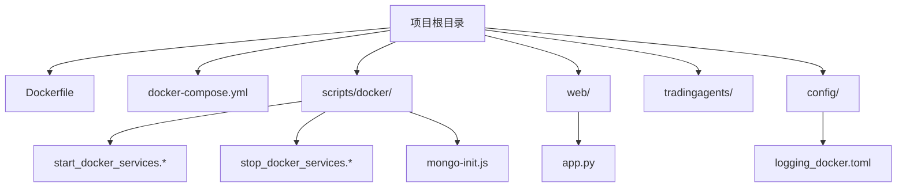
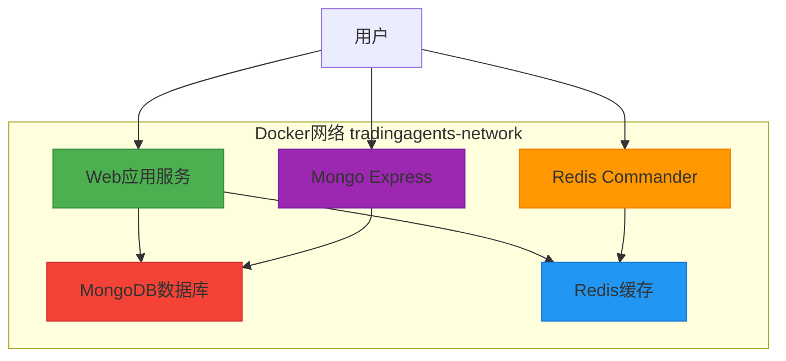
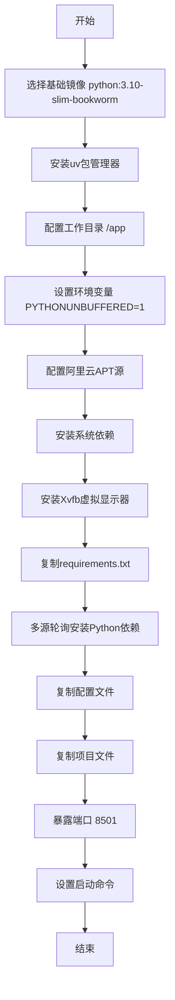
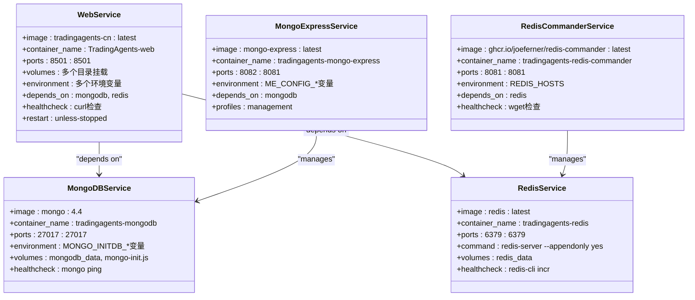
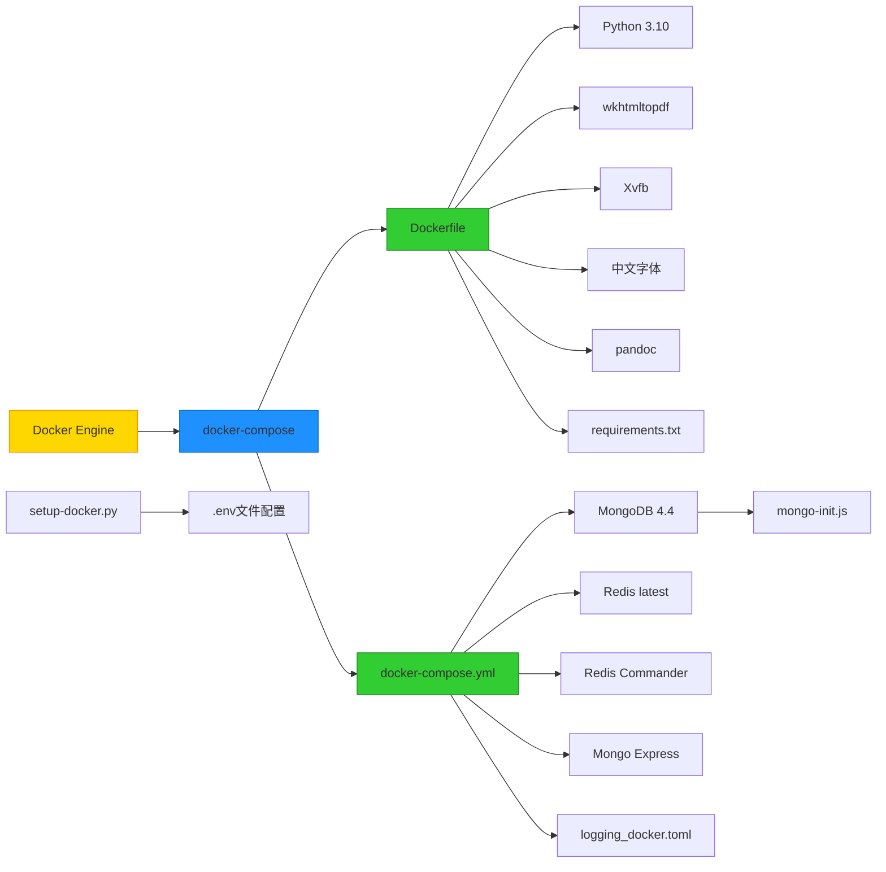

# Docker部署

<cite>
**本文档中引用的文件**  
- [Dockerfile](file://Dockerfile)
- [docker-compose.yml](file://docker-compose.yml)
- [scripts/docker/start_docker_services.sh](file://scripts/docker/start_docker_services.sh)
- [scripts/docker/start_docker_services.bat](file://scripts/docker/start_docker_services.bat)
- [scripts/docker/stop_docker_services.sh](file://scripts/docker/stop_docker_services.sh)
- [scripts/docker/stop_docker_services.bat](file://scripts/docker/stop_docker_services.bat)
- [scripts/docker/mongo-init.js](file://scripts/docker/mongo-init.js)
- [scripts/docker/start_services_simple.bat](file://scripts/docker/start_services_simple.bat)
- [scripts/docker/start_services_alt_ports.bat](file://scripts/docker/start_services_alt_ports.bat)
- [config/logging_docker.toml](file://config/logging_docker.toml)
- [scripts/setup-docker.py](file://scripts/setup-docker.py)
</cite>

## 目录
1. [简介](#简介)
2. [项目结构](#项目结构)
3. [核心组件](#核心组件)
4. [架构概述](#架构概述)
5. [详细组件分析](#详细组件分析)
6. [依赖分析](#依赖分析)
7. [性能考虑](#性能考虑)
8. [故障排除指南](#故障排除指南)
9. [结论](#结论)

## 简介
本文档提供TradingAgents项目的完整Docker部署指南。该系统是一个基于AI的股票分析平台，支持多源数据获取、LLM驱动的智能分析和Web可视化界面。文档详细说明了容器化部署的完整流程，包括Dockerfile多阶段配置、docker-compose服务编排、启动/停止脚本使用以及常见问题解决方案。

## 项目结构
TradingAgents项目采用模块化设计，主要包含以下目录：
- `web/`: Streamlit Web应用界面
- `tradingagents/`: 核心AI分析引擎
- `scripts/docker/`: Docker服务管理脚本
- `config/`: 配置文件，包括Docker专用日志配置
- 根目录：包含Dockerfile和docker-compose.yml等部署文件



**Diagram sources**
- [Dockerfile](file://Dockerfile)
- [docker-compose.yml](file://docker-compose.yml)
- [scripts/docker/start_docker_services.sh](file://scripts/docker/start_docker_services.sh)
- [web/app.py](file://web/app.py)
- [config/logging_docker.toml](file://config/logging_docker.toml)

**Section sources**
- [Dockerfile](file://Dockerfile)
- [docker-compose.yml](file://docker-compose.yml)
- [scripts/docker/README.md](file://scripts/docker/README.md)

## 核心组件
本项目的核心Docker部署组件包括：
- **Dockerfile**: 定义应用镜像构建过程，包含多阶段配置、依赖安装和环境设置
- **docker-compose.yml**: 定义多服务编排，包括Web应用、MongoDB、Redis等服务
- **启动/停止脚本**: 提供跨平台（Linux/Windows）的服务管理能力
- **MongoDB初始化脚本**: 在容器启动时创建数据库结构和初始数据
- **Docker专用日志配置**: 优化容器环境下的日志输出和管理

**Section sources**
- [Dockerfile](file://Dockerfile)
- [docker-compose.yml](file://docker-compose.yml)
- [scripts/docker/mongo-init.js](file://scripts/docker/mongo-init.js)
- [config/logging_docker.toml](file://config/logging_docker.toml)

## 架构概述
TradingAgents的Docker部署采用微服务架构，通过docker-compose编排多个相互依赖的服务。Web应用作为前端入口，连接后端的MongoDB（数据存储）和Redis（缓存）服务，同时提供Redis Commander和Mongo Express等管理界面。



**Diagram sources**
- [docker-compose.yml](file://docker-compose.yml)
- [scripts/docker/mongo-init.js](file://scripts/docker/mongo-init.js)

## 详细组件分析

### Dockerfile配置分析
Dockerfile采用多阶段配置，确保镜像的高效性和安全性。

#### 基础镜像与环境配置
Dockerfile基于`python:3.10-slim-bookworm`官方镜像，这是一个轻量级的Python基础镜像。通过配置阿里云镜像源加速包安装，并安装了构建工具、PDF生成工具（wkhtmltopdf）、中文字体（fonts-wqy-*）和文档转换工具（pandoc）等关键依赖。



**Diagram sources**
- [Dockerfile](file://Dockerfile)

#### 依赖安装与字体集成
系统依赖安装包括`build-essential`（编译工具）、`wkhtmltopdf`（HTML转PDF）、`xvfb`（虚拟X服务器）、`fonts-wqy-zenhei`和`fonts-wqy-microhei`（中文字体支持）、`pandoc`（文档格式转换）等。这些工具确保了应用在容器环境中能够正常生成PDF报告并正确显示中文。

多源轮询安装机制提高了依赖安装的可靠性，当阿里云源失败时，会依次尝试清华源、豆瓣源和官方源。

#### 启动脚本配置
通过创建`start-xvfb.sh`脚本启动Xvfb虚拟显示器，并在Dockerfile中设置DISPLAY环境变量为`:99`，解决了无头环境下GUI应用的运行问题。

**Section sources**
- [Dockerfile](file://Dockerfile)

### docker-compose.yml服务配置
docker-compose.yml定义了五个核心服务，通过网络隔离和依赖管理确保服务间的正确通信。

#### Web服务配置
Web服务是主要的应用入口，配置了以下关键参数：
- **端口映射**: `8501:8501`，将容器内的Streamlit端口映射到主机
- **数据卷挂载**: 挂载代码目录（web、tradingagents、scripts）和数据目录（logs、config），实现开发环境的热重载
- **环境变量**: 设置时区、日志配置和数据库连接信息，覆盖.env文件中的本地配置
- **依赖关系**: 依赖mongodb和redis服务，确保数据库服务先于Web应用启动
- **健康检查**: 通过curl检查`http://localhost:8501/_stcore/health`端点，确保应用正常运行
- **重启策略**: `unless-stopped`，确保服务在异常退出后自动重启

#### 数据库服务配置
##### MongoDB服务
- **端口映射**: `27017:27017`
- **环境变量**: 配置管理员用户名、密码和初始数据库
- **数据卷**: 使用命名卷`mongodb_data`持久化数据
- **初始化脚本**: 通过`mongo-init.js`在容器启动时执行数据库初始化
- **健康检查**: 执行MongoDB ping命令验证服务状态

##### Redis服务
- **端口映射**: `6379:6379`
- **启动命令**: 配置Redis持久化（appendonly yes）和密码认证
- **数据卷**: 使用命名卷`redis_data`持久化数据
- **健康检查**: 通过redis-cli执行incr命令验证服务状态

#### 管理界面服务
##### Redis Commander
- **端口映射**: `8081:8081`
- **环境变量**: 配置Redis连接信息，包括主机、端口、密码
- **依赖关系**: 依赖redis服务
- **健康检查**: 通过wget检查管理界面是否可访问

##### Mongo Express
- **端口映射**: `8082:8081`
- **环境变量**: 配置MongoDB连接信息和管理界面认证
- **依赖关系**: 依赖mongodb服务
- **配置文件**: 使用profiles特性，需要`--profile management`参数启动



**Diagram sources**
- [docker-compose.yml](file://docker-compose.yml)

**Section sources**
- [docker-compose.yml](file://docker-compose.yml)

### 启动与停止脚本分析
项目提供跨平台的Docker服务管理脚本，支持Linux和Windows系统。

#### 标准启动脚本
`start_docker_services.sh/.bat`脚本提供完整的服务启动流程：
1. 检查Docker服务状态
2. 启动MongoDB容器
3. 启动Redis容器
4. 等待服务初始化
5. 启动Redis Commander管理界面
6. 显示服务状态和连接信息

脚本包含错误处理机制，当Docker未运行时会提示用户启动Docker Desktop。

#### 简化启动脚本
`start_services_simple.bat`提供更简洁的启动流程，适合快速部署场景。该脚本省略了详细的输出信息，专注于核心服务的启动。

#### 替代端口启动脚本
`start_services_alt_ports.bat`脚本用于解决端口冲突问题：
- MongoDB使用27018端口
- Redis使用6380端口
- Redis Commander使用8082端口
脚本还提供详细的后续步骤指导，包括更新.env文件和运行数据库初始化。

#### 停止脚本
`stop_docker_services.sh/.bat`脚本提供优雅的服务停止功能：
- 按依赖顺序停止服务（先停止管理界面，再停止核心服务）
- 使用`docker stop`和`docker rm`确保容器被完全清理
- 提供数据持久化提示，说明数据保存在Docker卷中

```mermaid
sequenceDiagram
participant User
participant StartScript
participant DockerEngine
User->>StartScript : 执行start_docker_services.*
StartScript->>StartScript : 检查Docker状态
alt Docker未运行
StartScript-->>User : 显示错误信息
stop
end
StartScript->>DockerEngine : 启动MongoDB容器
DockerEngine-->>StartScript : 返回容器ID
StartScript->>StartScript : 检查启动结果
StartScript->>DockerEngine : 启动Redis容器
DockerEngine-->>StartScript : 返回容器ID
StartScript->>StartScript : 检查启动结果
StartScript->>StartScript : 等待5秒
StartScript->>DockerEngine : 启动Redis Commander
DockerEngine-->>StartScript : 返回容器ID
StartScript->>StartScript : 检查启动结果
StartScript->>DockerEngine : 查询服务状态
DockerEngine-->>StartScript : 返回容器列表
StartScript->>User : 显示服务状态和连接信息
```

**Diagram sources**
- [scripts/docker/start_docker_services.sh](file://scripts/docker/start_docker_services.sh)
- [scripts/docker/start_docker_services.bat](file://scripts/docker/start_docker_services.bat)
- [scripts/docker/stop_docker_services.sh](file://scripts/docker/stop_docker_services.sh)

**Section sources**
- [scripts/docker/start_docker_services.sh](file://scripts/docker/start_docker_services.sh)
- [scripts/docker/start_docker_services.bat](file://scripts/docker/start_docker_services.bat)
- [scripts/docker/stop_docker_services.sh](file://scripts/docker/stop_docker_services.sh)
- [scripts/docker/stop_docker_services.bat](file://scripts/docker/stop_docker_services.bat)

### MongoDB初始化分析
`mongo-init.js`脚本在MongoDB容器首次启动时执行，完成数据库的初始化工作。

#### 数据库结构初始化
脚本创建了四个核心集合：
- `stock_data`: 股票数据集合
- `analysis_results`: 分析结果集合
- `user_sessions`: 用户会话集合
- `configurations`: 系统配置集合

为每个集合创建了适当的索引，优化查询性能。

#### 初始数据插入
脚本插入了三类初始配置数据：
- **缓存TTL配置**: 为不同类型的数据设置不同的缓存过期时间
- **默认LLM模型配置**: 设置默认的AI模型提供商和模型名称
- **系统设置**: 记录系统版本和功能开关状态

同时插入了AAPL和000001的示例股票数据，用于验证数据访问功能。

**Section sources**
- [scripts/docker/mongo-init.js](file://scripts/docker/mongo-init.js)

## 依赖分析
TradingAgents的Docker部署依赖以下关键组件：



**Diagram sources**
- [Dockerfile](file://Dockerfile)
- [docker-compose.yml](file://docker-compose.yml)
- [requirements.txt](file://requirements.txt)
- [config/logging_docker.toml](file://config/logging_docker.toml)
- [scripts/setup-docker.py](file://scripts/setup-docker.py)

**Section sources**
- [Dockerfile](file://Dockerfile)
- [docker-compose.yml](file://docker-compose.yml)
- [requirements.txt](file://requirements.txt)

## 性能考虑
Docker部署在性能方面进行了多项优化：

1. **镜像优化**: 使用`python:3.10-slim-bookworm`基础镜像，减少镜像体积
2. **依赖缓存**: 通过合理的Dockerfile层顺序，利用Docker构建缓存提高构建效率
3. **数据持久化**: 使用命名卷（named volumes）而非绑定挂载（bind mounts）存储数据库数据，提高I/O性能
4. **资源限制**: 虽然当前配置未显式设置资源限制，但可通过docker-compose的`deploy.resources`字段添加
5. **健康检查**: 配置合理的健康检查间隔和超时时间，避免过度频繁的检查影响性能
6. **日志管理**: 配置日志轮转（max-size: "100m", max-file: "3"），防止日志文件无限增长

## 故障排除指南
### 常见构建失败及解决方案

| 问题现象 | 可能原因 | 解决方案 |
|---------|---------|---------|
| 依赖安装失败 | 网络问题或源不可用 | Dockerfile已配置多源轮询机制，通常可自动恢复 |
| 中文显示乱码 | 字体未正确安装 | 确认Dockerfile中安装了fonts-wqy-*系列字体包 |
| PDF生成失败 | wkhtmltopdf未正确配置 | 检查是否安装了wkhtmltopdf和Xvfb |
| 数据库连接失败 | 网络配置错误 | 确认服务在同一个Docker网络中，使用服务名作为主机名 |
| 容器频繁重启 | 健康检查失败 | 检查应用启动时间，适当调整healthcheck的start_period |

### 启动脚本使用说明

**Linux系统**:
```bash
# 启动服务
./scripts/docker/start_docker_services.sh

# 停止服务
./scripts/docker/stop_docker_services.sh
```

**Windows系统**:
```cmd
:: 启动服务
scripts\docker\start_docker_services.bat

:: 停止服务
scripts\docker\stop_docker_services.bat
```

**启动模式选择**:
- **标准模式**: 使用`start_docker_services.*`，适合常规开发和生产环境
- **简单模式**: 使用`start_services_simple.*`，适合快速测试场景
- **替代端口模式**: 使用`start_services_alt_ports.*`，当标准端口被占用时使用

### 环境配置
使用`scripts/setup-docker.py`脚本可自动配置Docker环境：
1. 检查Docker是否安装和运行
2. 复制.env.example为.env文件
3. 配置Docker专用的数据库连接参数
4. 提供API密钥配置指导

**Section sources**
- [scripts/setup-docker.py](file://scripts/setup-docker.py)
- [scripts/docker/start_docker_services.sh](file://scripts/docker/start_docker_services.sh)
- [scripts/docker/start_docker_services.bat](file://scripts/docker/start_docker_services.bat)

## 结论
TradingAgents项目的Docker部署方案设计完善，提供了从镜像构建到服务编排的完整解决方案。通过Dockerfile的多阶段配置确保了应用环境的一致性，docker-compose.yml实现了多服务的高效编排，而跨平台的启动/停止脚本则大大简化了部署操作。该方案特别适合需要中文字体支持、PDF生成和AI分析能力的金融数据分析应用，为开发者提供了高效、可靠的容器化部署体验。