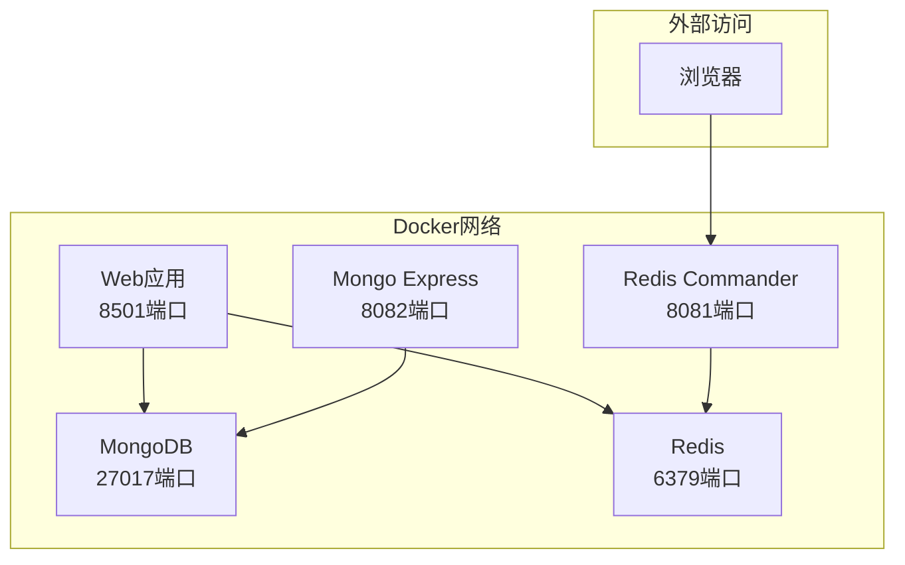
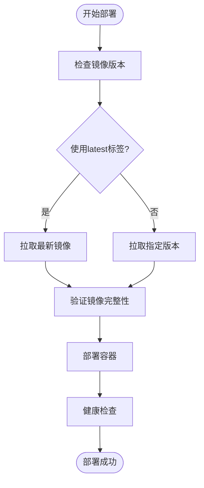
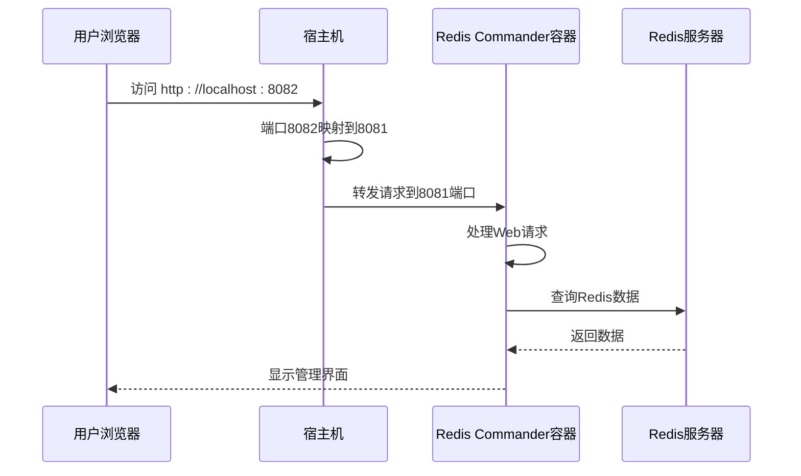
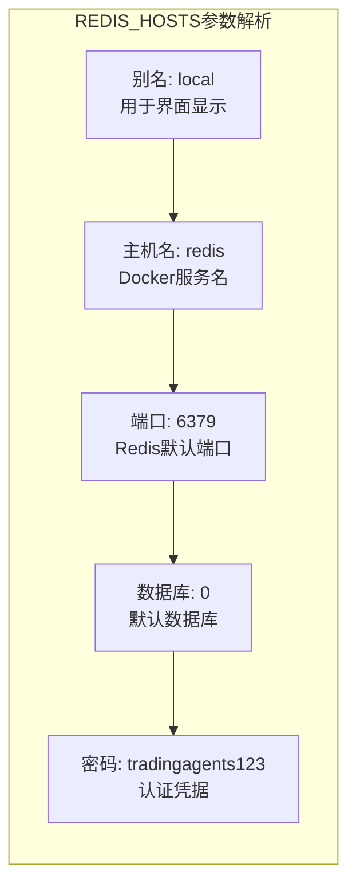
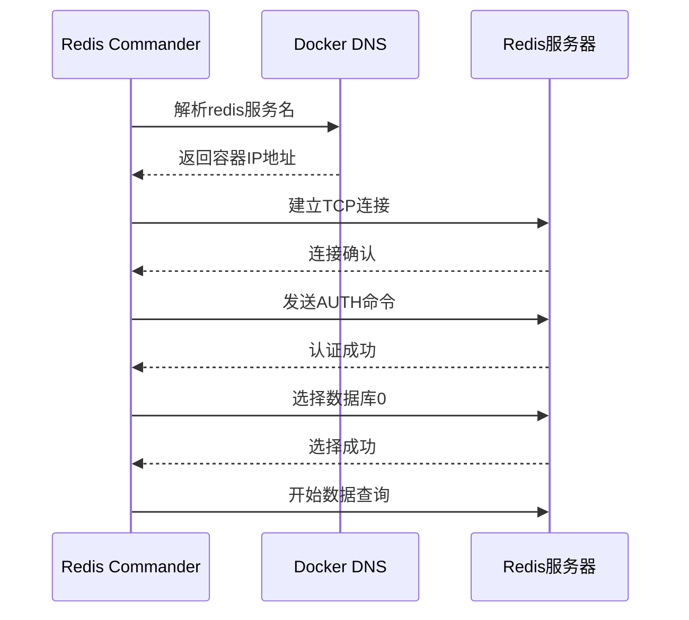
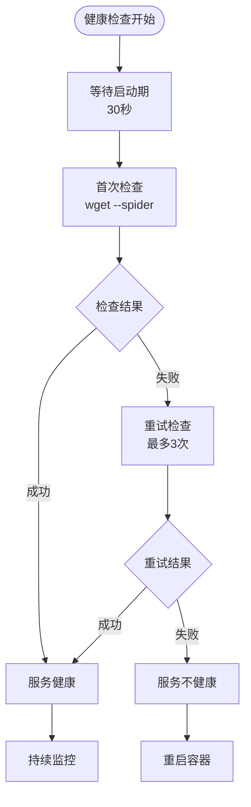

# Redis Commander管理界面配置

<cite>
**本文档引用的文件**
- [docker-compose.yml](file://docker-compose.yml)
- [Dockerfile](file://Dockerfile)
- [docs/configuration/docker-config.md](file://docs/configuration/docker-config.md)
- [docs/database_setup.md](file://docs/database_setup.md)
- [README.md](file://README.md)
- [tests/quick_redis_test.py](file://tests/quick_redis_test.py)
- [tradingagents/config/database_config.py](file://tradingagents/config/database_config.py)
- [tradingagents/config/database_manager.py](file://tradingagents/config/database_manager.py)
</cite>

## 目录
1. [简介](#简介)
2. [Redis Commander服务配置](#redis-commander服务配置)
3. [镜像来源和版本管理](#镜像来源和版本管理)
4. [端口映射配置](#端口映射配置)
5. [REDIS_HOSTS环境变量详解](#redis_hosts环境变量详解)
6. [服务依赖关系](#服务依赖关系)
7. [健康检查机制](#健康检查机制)
8. [管理界面功能](#管理界面功能)
9. [安全访问建议](#安全访问建议)
10. [故障排除](#故障排除)

## 简介

Redis Commander是一个基于Web的Redis数据库管理界面，为TradingAgents项目提供了直观的数据管理和监控功能。它允许开发者和运维人员通过浏览器界面实时查看Redis缓存数据、监控内存使用情况、执行基本的数据库操作等。

## Redis Commander服务配置

在TradingAgents项目的Docker Compose配置中，Redis Commander作为独立的服务容器运行，具有完整的配置和管理能力。



**图表来源**
- [docker-compose.yml](file://docker-compose.yml#L105-L125)

**节来源**
- [docker-compose.yml](file://docker-compose.yml#L105-L125)

## 镜像来源和版本管理

### 镜像选择

项目使用`ghcr.io/joeferner/redis-commander:latest`作为Redis Commander的基础镜像：

- **镜像仓库**: GitHub Container Registry (GHCR)
- **镜像名称**: joeferner/redis-commander
- **标签**: latest（始终指向最新稳定版本）

### 版本控制策略



**图表来源**
- [docker-compose.yml](file://docker-compose.yml#L106-L107)

**节来源**
- [docker-compose.yml](file://docker-compose.yml#L106-L107)

## 端口映射配置

### 端口配置详解

Redis Commander使用8081端口作为其Web管理界面的默认端口，通过Docker的端口映射功能对外提供访问服务。

| 配置项 | 值 | 说明 |
|--------|-----|------|
| 容器内部端口 | 8081 | Redis Commander的默认监听端口 |
| 主机映射端口 | 8081 | 映射到宿主机的端口（实际使用8082） |
| 访问地址 | http://localhost:8082 | 实际访问地址（端口映射差异） |

### 端口映射机制



**图表来源**
- [docker-compose.yml](file://docker-compose.yml#L110-L111)

**节来源**
- [docker-compose.yml](file://docker-compose.yml#L110-L111)

## REDIS_HOSTS环境变量详解

### 环境变量格式

`REDIS_HOSTS=local:redis:6379:0:tradingagents123` 是Redis Commander连接Redis服务器的关键配置，采用冒号分隔的格式：

| 参数位置 | 参数名称 | 值 | 说明 |
|----------|----------|-----|------|
| 1 | 别名 | local | 连接的显示名称 |
| 2 | 主机名 | redis | Redis服务器主机名（Docker服务名） |
| 3 | 端口 | 6379 | Redis服务器端口号 |
| 4 | 数据库编号 | 0 | 使用的Redis数据库索引 |
| 5 | 密码 | tradingagents123 | Redis访问密码 |

### 参数详细说明



**图表来源**
- [docker-compose.yml](file://docker-compose.yml#L112)

### 连接建立过程



**图表来源**
- [tradingagents/config/database_config.py](file://tradingagents/config/database_config.py#L56-L108)

**节来源**
- [docker-compose.yml](file://docker-compose.yml#L112)
- [tradingagents/config/database_config.py](file://tradingagents/config/database_config.py#L56-L108)

## 服务依赖关系

### 依赖配置

Redis Commander通过`depends_on`指令确保在Redis服务完全启动后再启动自身：

```yaml
depends_on:
  - redis
```

### 启动顺序控制

```mermaid
gantt
title Redis Commander启动时序图
dateFormat X
axisFormat %s
section Redis服务
Redis启动 :done, redis, 0, 30
section Redis Commander
依赖检查 :active, depends, 30, 10
启动服务 :active, startup, 40, 20
连接测试 :active, connect, 60, 15
就绪状态 :done, ready, 75, 5
```



**图表来源**
- [docker-compose.yml](file://docker-compose.yml#L117-L118)

### 依赖关系的重要性

1. **数据完整性**: 确保Redis服务可用后再进行数据操作
2. **连接稳定性**: 避免因服务未启动导致的连接失败
3. **用户体验**: 提供稳定的管理界面访问

**节来源**
- [docker-compose.yml](file://docker-compose.yml#L117-L118)

## 健康检查机制

### 健康检查配置

Redis Commander使用wget工具进行健康检查，验证Web服务的可访问性：

```yaml
healthcheck:
  test: ["CMD", "wget", "--quiet", "--tries=1", "--spider", "http://localhost:8081"]
  interval: 30s
  timeout: 10s
  retries: 3
  start_period: 30s
```

### 健康检查流程



**图表来源**
- [docker-compose.yml](file://docker-compose.yml#L119-L124)

### 检查机制说明

| 参数 | 值 | 说明 |
|------|-----|------|
| 检查间隔 | 30秒 | 每30秒执行一次健康检查 |
| 超时时间 | 10秒 | 单次检查的最大等待时间 |
| 重试次数 | 3次 | 连续失败后的重试次数 |
| 启动期 | 30秒 | 容器启动后等待的时间 |

**节来源**
- [docker-compose.yml](file://docker-compose.yml#L119-L124)

## 管理界面功能

### Web管理界面特性

Redis Commander提供了丰富的Web管理功能，帮助用户更好地管理和监控Redis数据库：

#### 主要功能模块

1. **数据库浏览**
   - 实时查看所有键值对
   - 支持多种数据类型（字符串、哈希、列表、集合等）
   - 键值编辑和删除功能

2. **内存监控**
   - 内存使用情况统计
   - 键空间分布分析
   - 内存优化建议

3. **性能监控**
   - 连接数统计
   - 命令执行统计
   - 响应时间分析

4. **数据管理**
   - 键值搜索和过滤
   - 批量操作支持
   - 数据导出功能

### 开发和调试价值

```mermaid
mindmap
root((Redis Commander价值))
开发效率
实时数据查看
快速问题诊断
配置验证
调试支持
缓存状态监控
数据流追踪
性能瓶颈识别
运维管理
数据备份检查
内存使用监控
权限审计
教育培训
Redis学习工具
数据结构演示
最佳实践展示
```

**图表来源**
- [tests/quick_redis_test.py](file://tests/quick_redis_test.py#L0-L54)

**节来源**
- [tests/quick_redis_test.py](file://tests/quick_redis_test.py#L0-L54)

## 安全访问建议

### 生产环境安全配置

由于Redis Commander的Web界面可能暴露敏感数据，在生产环境中应采取严格的安全措施：

#### 网络安全

1. **防火墙规则**
   ```bash
   # 限制访问源IP
   iptables -A INPUT -p tcp --dport 8081 -s 192.168.1.0/24 -j ACCEPT
   iptables -A INPUT -p tcp --dport 8081 -j DROP
   ```

2. **VPN访问**
   - 通过VPN网络访问管理界面
   - 避免直接暴露在公网

3. **反向代理**
   ```nginx
   server {
       listen 80;
       server_name redis-manager.example.com;
       
       location / {
           proxy_pass http://localhost:8081;
           proxy_set_header Host $host;
           proxy_set_header X-Real-IP $remote_addr;
       }
   }
   ```

#### 认证和授权

1. **强密码策略**
   - 使用复杂密码
   - 定期更换密码
   - 避免使用默认凭据

2. **访问控制**
   - 限制管理员账户数量
   - 实施最小权限原则
   - 记录访问日志

#### 监控和审计

1. **访问监控**
   ```bash
   # 监控访问日志
   tail -f /var/log/nginx/access.log | grep redis-commander
   ```

2. **异常检测**
   - 监控异常登录尝试
   - 检测可疑数据操作
   - 设置告警阈值

### 开发环境配置

在开发和测试环境中，可以适当放宽安全限制：

```yaml
# 开发环境配置
redis-commander:
  image: ghcr.io/joeferner/redis-commander:latest
  ports:
    - "8081:8081"
  environment:
    - REDIS_HOSTS=local:redis:6379:0:dev_password
  networks:
    - tradingagents-network
  restart: unless-stopped
```

**节来源**
- [docker-compose.yml](file://docker-compose.yml#L105-L125)

## 故障排除

### 常见问题及解决方案

#### 连接问题

1. **Redis Commander无法连接到Redis**
   - 检查Redis服务状态：`docker ps | grep redis`
   - 验证网络连通性：`docker exec tradingagents-redis-commander ping redis`
   - 检查密码配置：确认REDIS_HOSTS中的密码正确

2. **端口冲突**
   ```bash
   # 检查端口占用
   netstat -an | grep 8081
   # 修改端口映射
   docker-compose down
   # 修改docker-compose.yml中的端口配置
   docker-compose up -d
   ```

#### 性能问题

1. **界面响应缓慢**
   - 检查Redis服务器负载
   - 优化键值对数量
   - 调整内存配置

2. **内存使用过高**
   ```bash
   # 查看Redis内存使用
   docker exec tradingagents-redis redis-cli info memory
   # 清理无用数据
   docker exec tradingagents-redis redis-cli flushdb
   ```

#### 安全问题

1. **未经授权的访问**
   ```bash
   # 检查访问日志
   docker logs tradingagents-redis-commander | grep -i "unauthorized"
   # 重启服务加强安全
   docker restart tradingagents-redis-commander
   ```

### 调试工具

```bash
# 进入容器进行调试
docker exec -it tradingagents-redis-commander bash

# 查看容器日志
docker logs tradingagents-redis-commander

# 检查容器状态
docker inspect tradingagents-redis-commander
```

**节来源**
- [docker-compose.yml](file://docker-compose.yml#L105-L125)
- [tests/quick_redis_test.py](file://tests/quick_redis_test.py#L0-L54)

## 结论

Redis Commander作为TradingAgents项目的重要管理工具，提供了强大的Redis数据库管理功能。通过合理的配置和安全措施，它能够显著提升开发和运维效率。在生产环境中使用时，必须严格遵循安全最佳实践，确保系统的安全性。

正确配置Redis Commander不仅能够提高开发效率，还能帮助团队更好地理解和优化Redis缓存策略，为TradingAgents项目的稳定运行提供有力保障。