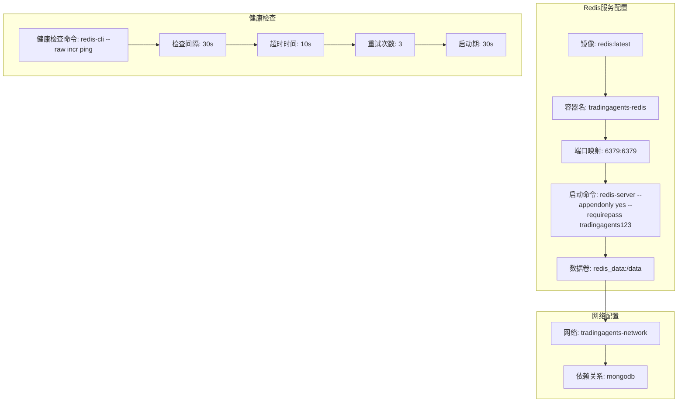
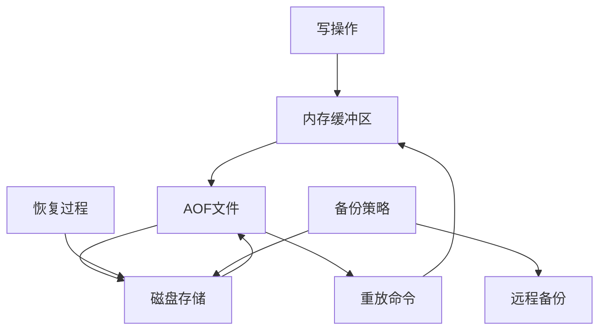
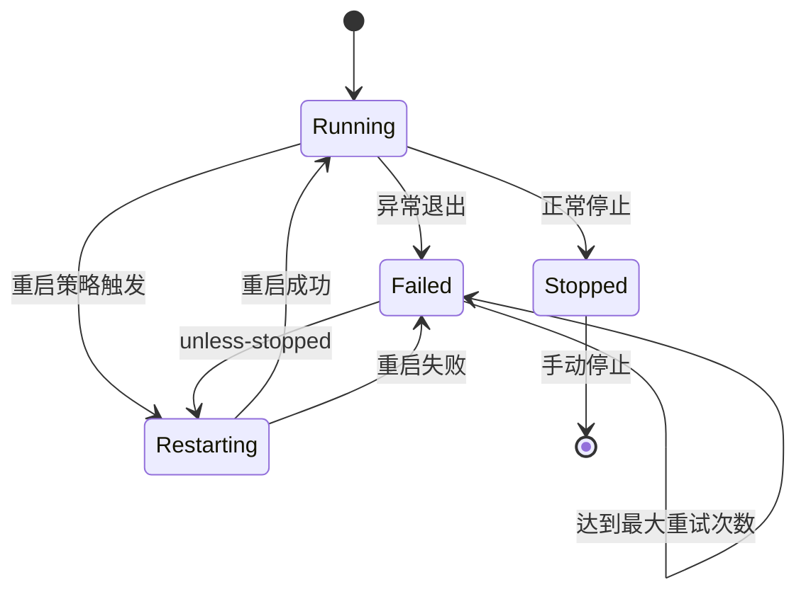
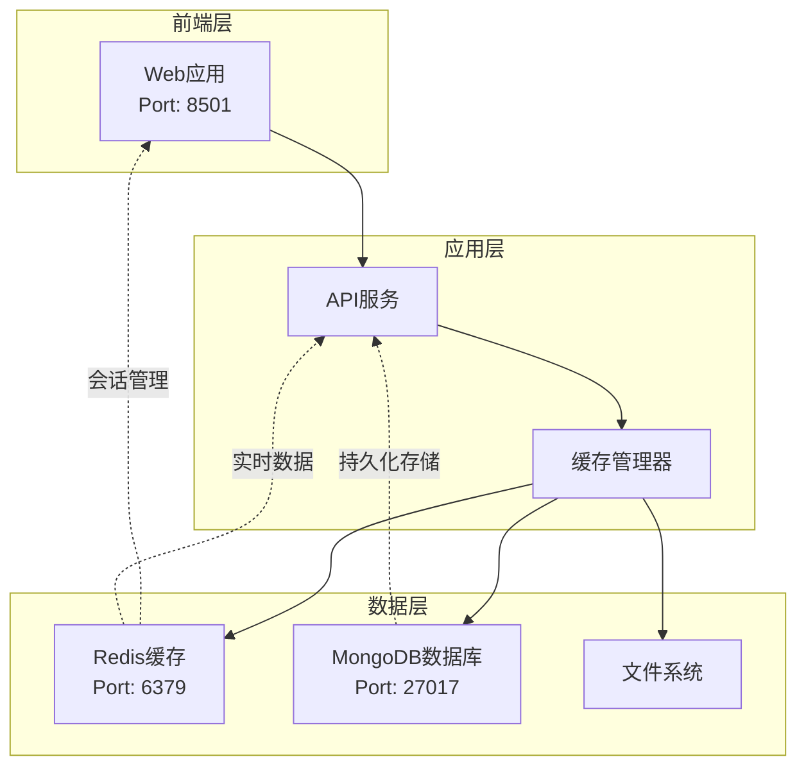
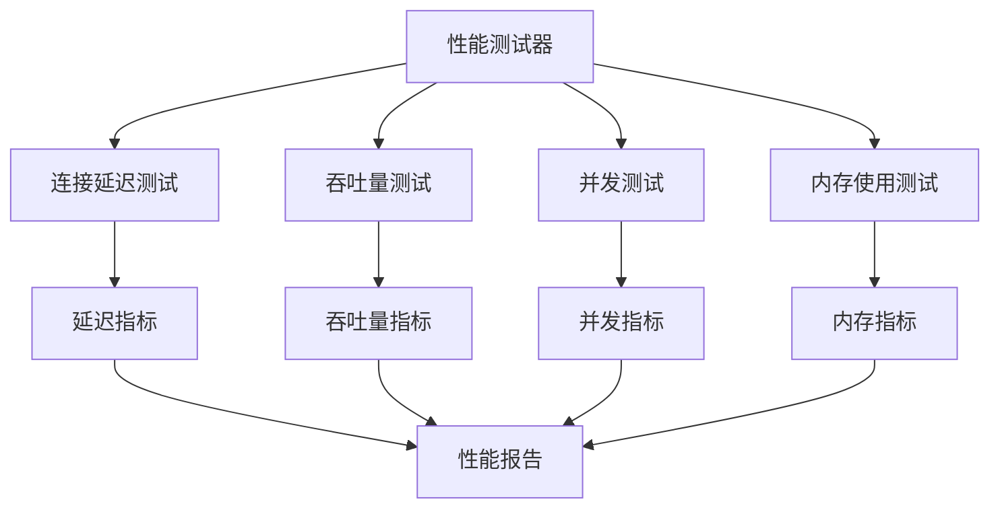

# Redis服务配置深度解析

<cite>
**本文档引用的文件**
- [docker-compose.yml](file://docker-compose.yml)
- [.env.example](file://.env.example)
- [test_redis_performance.py](file://tests/test_redis_performance.py)
- [quick_redis_test.py](file://tests/quick_redis_test.py)
- [database_management.py](file://web/modules/database_management.py)
- [setup_redis_windows.py](file://scripts/setup/setup_redis_windows.py)
- [init_database.py](file://scripts/setup/init_database.py)
</cite>

## 目录
1. [概述](#概述)
2. [Redis服务配置详解](#redis服务配置详解)
3. [版本管理与容器命名](#版本管理与容器命名)
4. [数据持久化策略](#数据持久化策略)
5. [安全机制配置](#安全机制配置)
6. [健康检查机制](#健康检查机制)
7. [高可用性策略](#高可用性策略)
8. [Redis在系统架构中的角色](#redis在系统架构中的角色)
9. [性能监控与优化](#性能监控与优化)
10. [故障排除指南](#故障排除指南)
11. [最佳实践建议](#最佳实践建议)

## 概述

Redis作为TradingAgents-CN系统的核心缓存服务，在docker-compose.yml中承担着高性能数据缓存、会话管理和实时数据处理的重要职责。本文档将深入解析Redis服务的完整配置细节，包括版本管理、数据持久化、安全机制、健康检查和性能优化等方面。

## Redis服务配置详解

### 基础配置结构

Redis服务在docker-compose.yml中的配置体现了现代容器化应用的最佳实践：



**图表来源**
- [docker-compose.yml](file://docker-compose.yml#L75-L90)

**章节来源**
- [docker-compose.yml](file://docker-compose.yml#L75-L90)

### 环境变量配置

系统通过环境变量实现Redis配置的灵活管理：

| 配置项 | 值 | 说明 |
|--------|-----|------|
| TRADINGAGENTS_CACHE_TYPE | redis | 缓存类型设置为Redis |
| TRADINGAGENTS_REDIS_URL | redis://:tradingagents123@redis:6379 | Redis连接URL格式 |
| REDIS_HOST | localhost | Redis主机地址 |
| REDIS_PORT | 6379 | Redis端口号 |
| REDIS_PASSWORD | tradingagents123 | Redis访问密码 |
| REDIS_DB | 0 | Redis数据库编号 |

**章节来源**
- [.env.example](file://.env.example#L130-L140)
- [docker-compose.yml](file://docker-compose.yml#L40-L42)

## 版本管理与容器命名

### 镜像版本策略

Redis服务采用`redis:latest`镜像，这种版本管理策略具有以下特点：

- **灵活性**: 始终使用最新的稳定版本，确保获得最新功能和安全修复
- **维护性**: 减少版本锁定带来的维护负担
- **兼容性**: 通过严格的测试确保新版本的兼容性

### 容器命名规范

容器命名为`tradingagents-redis`，遵循以下命名约定：

- **前缀**: `tradingagents-`表明服务归属的项目
- **服务名**: `redis`明确标识服务类型
- **可读性**: 清晰的命名便于运维管理和故障排查

**章节来源**
- [docker-compose.yml](file://docker-compose.yml#L76-L77)

## 数据持久化策略

### AOF持久化机制

Redis服务通过`--appendonly yes`参数启用了Append Only File (AOF)持久化：



**图表来源**
- [docker-compose.yml](file://docker-compose.yml#L81)

#### AOF持久化的数据安全意义

1. **数据完整性保障**: 每个写操作都被记录到AOF文件，确保数据不会因意外断电而丢失
2. **高可靠性**: 即使Redis进程崩溃，重启后也能通过AOF文件恢复大部分数据
3. **灵活配置**: 支持不同的同步策略（always、everysec、no）

### 数据卷挂载

通过`redis_data:/data`卷挂载实现数据持久化：

- **数据隔离**: 将Redis数据与容器生命周期分离
- **备份便利**: 可以独立备份数据卷
- **跨容器共享**: 支持多个容器共享同一数据卷

**章节来源**
- [docker-compose.yml](file://docker-compose.yml#L82-L83)

## 安全机制配置

### 密码认证机制

Redis服务设置了强密码保护：

```bash
--requirepass tradingagents123
```

#### 密码安全特性

1. **访问控制**: 所有客户端必须提供正确密码才能执行命令
2. **传输加密**: 在Docker网络内部通信，避免明文传输
3. **权限分离**: 不同服务使用不同密码，降低安全风险

### 网络安全配置

- **容器网络**: 使用Docker网络隔离，限制外部访问
- **端口绑定**: 仅暴露必要的6379端口
- **依赖关系**: 通过`depends_on`确保Redis在其他服务之前启动

**章节来源**
- [docker-compose.yml](file://docker-compose.yml#L81)

## 健康检查机制

### 健康检查命令解析

```bash
redis-cli --raw incr ping
```

#### 健康检查工作原理

1. **命令执行**: 使用`redis-cli`工具发送`incr ping`命令
2. **原子操作**: `incr`命令是原子性的，确保检查的准确性
3. **响应验证**: 检查命令返回值是否为递增的整数
4. **资源消耗**: 最小化对Redis性能的影响

### 健康检查配置参数

| 参数 | 值 | 说明 |
|------|-----|------|
| test | ["CMD", "redis-cli", "--raw", "incr", "ping"] | 检查命令 |
| interval | 30s | 检查间隔时间 |
| timeout | 10s | 命令执行超时 |
| retries | 3 | 失败重试次数 |
| start_period | 30s | 启动后等待时间 |

#### 健康检查的优势

- **快速发现问题**: 及时发现Redis服务异常
- **自动恢复**: 结合重启策略实现自动恢复
- **负载均衡**: 在集群环境中帮助流量路由决策

**章节来源**
- [docker-compose.yml](file://docker-compose.yml#L88-L93)

## 高可用性策略

### 重启策略配置

```yaml
restart: unless-stopped
```

#### 重启策略的工作机制



**图表来源**
- [docker-compose.yml](file://docker-compose.yml#L84)

#### 高可用性保障

1. **故障自动恢复**: Redis服务异常退出时自动重启
2. **系统稳定性**: 确保Redis作为关键依赖服务的持续可用
3. **业务连续性**: 避免因Redis故障影响整个系统的正常运行

### 依赖关系管理

Redis服务通过`depends_on`与其他服务建立依赖关系：

- **启动顺序**: 确保Redis先于Web服务启动
- **服务协调**: 避免因Redis不可用导致的启动失败
- **资源竞争**: 防止多个服务同时尝试连接Redis

**章节来源**
- [docker-compose.yml](file://docker-compose.yml#L85)
- [docker-compose.yml](file://docker-compose.yml#L56)

## Redis在系统架构中的角色

### 缓存层架构

Redis在TradingAgents-CN系统中扮演着关键的缓存角色：



**图表来源**
- [docker-compose.yml](file://docker-compose.yml#L1-L159)

### 缓存类型配置

系统通过环境变量配置Redis作为主要缓存后端：

```yaml
TRADINGAGENTS_CACHE_TYPE: redis
TRADINGAGENTS_REDIS_URL: redis://:tradingagents123@redis:6379
```

#### Redis缓存的应用场景

1. **会话存储**: 用户登录状态和会话信息
2. **实时数据缓存**: 股票行情、新闻资讯等高频访问数据
3. **计算结果缓存**: 分析报告、投资建议等复杂计算结果
4. **临时数据存储**: 交易流程中的中间状态数据

### 连接管理

Redis连接通过统一的URL格式管理：

- **认证信息**: 包含用户名和密码的完整认证信息
- **网络配置**: 明确的主机名和端口号
- **数据库选择**: 指定特定的数据库编号

**章节来源**
- [docker-compose.yml](file://docker-compose.yml#L40-L42)
- [.env.example](file://.env.example#L130-L140)

## 性能监控与优化

### 性能测试框架

系统提供了完整的Redis性能测试框架：



**图表来源**
- [test_redis_performance.py](file://tests/test_redis_performance.py#L267-L296)

### 关键性能指标

#### 连接延迟测试

- **测试方法**: 100次PING操作
- **指标**: 平均延迟、最小延迟、最大延迟、中位延迟
- **成功率**: 计算成功的连接百分比

#### 吞吐量性能测试

| 操作类型 | 测试规模 | 主要指标 |
|----------|----------|----------|
| SET操作 | 1000次 | 每秒操作数、总耗时 |
| GET操作 | 1000次 | 每秒操作数、平均响应时间 |
| PING操作 | 1000次 | 连接延迟、成功率 |

#### 内存使用监控

- **当前内存**: 实时内存使用量
- **峰值内存**: 历史最高内存使用量
- **内存增长**: 监控内存使用趋势

### 性能优化建议

#### 配置优化

1. **内存配置**
   ```bash
   maxmemory 2gb
   maxmemory-policy allkeys-lru
   ```

2. **网络优化**
   ```bash
   tcp-keepalive 300
   timeout 0
   ```

3. **持久化优化**
   ```bash
   save 900 1
   save 300 10
   save 60 10000
   ```

#### 监控指标

- **连接数**: 监控活跃连接数量
- **命令执行**: 跟踪慢查询和高频命令
- **内存使用**: 实时监控内存消耗
- **网络IO**: 监控网络带宽使用

**章节来源**
- [test_redis_performance.py](file://tests/test_redis_performance.py#L231-L266)

## 故障排除指南

### 常见问题诊断

#### 连接问题

1. **检查Redis服务状态**
   ```bash
   docker ps | grep redis
   docker logs tradingagents-redis
   ```

2. **验证网络连通性**
   ```bash
   docker exec -it tradingagents-redis redis-cli ping
   ```

3. **确认密码正确性**
   ```bash
   docker exec -it tradingagents-redis redis-cli -a tradingagents123 ping
   ```

#### 性能问题

1. **内存使用过高**
   ```bash
   docker exec -it tradingagents-redis redis-cli info memory
   ```

2. **连接数过多**
   ```bash
   docker exec -it tradingagents-redis redis-cli info clients
   ```

3. **慢查询分析**
   ```bash
   docker exec -it tradingagents-redis redis-cli slowlog get 10
   ```

### 监控工具集成

#### Web管理界面

Redis Commander提供了直观的Web管理界面：

- **端口**: 8081
- **访问**: http://localhost:8081
- **功能**: 键值管理、性能监控、配置查看

#### 日志分析

- **容器日志**: `docker logs tradingagents-redis`
- **Redis日志**: `/var/log/redis/redis-server.log`
- **应用日志**: 通过Docker日志驱动收集

**章节来源**
- [docker-compose.yml](file://docker-compose.yml#L95-L105)

## 最佳实践建议

### 部署最佳实践

1. **资源配置**
   - CPU: 至少2核
   - 内存: 2GB以上
   - 存储: SSD优先，预留足够的交换空间

2. **网络安全**
   - 限制外部访问
   - 使用防火墙规则
   - 定期更新密码

3. **监控告警**
   - 设置内存使用告警
   - 监控连接数变化
   - 建立性能基线

### 运维管理建议

1. **定期备份**
   - AOF文件备份
   - RDB快照备份
   - 远程存储策略

2. **性能调优**
   - 根据业务需求调整内存策略
   - 优化持久化配置
   - 监控和分析慢查询

3. **容量规划**
   - 预测数据增长趋势
   - 制定扩容计划
   - 评估硬件升级需求

### 开发环境配置

对于开发环境，建议使用简化配置：

```yaml
redis:
  image: redis:alpine
  container_name: tradingagents-redis-dev
  ports:
    - "6379:6379"
  command: redis-server --appendonly no --requirepass ""
  volumes:
    - redis_dev_data:/data
```

**章节来源**
- [setup_redis_windows.py](file://scripts/setup/setup_redis_windows.py#L49-L99)

## 总结

Redis服务在TradingAgents-CN系统中发挥着至关重要的作用，其配置体现了现代容器化应用的最佳实践。通过合理的版本管理、完善的数据持久化策略、严格的安全机制、可靠的健康检查和高可用性配置，Redis为整个系统提供了稳定、高效的数据缓存服务。

完善的性能监控和故障排除机制确保了Redis服务的可观测性和可维护性。结合具体的业务需求进行配置优化和容量规划，能够充分发挥Redis在提升系统性能方面的优势。