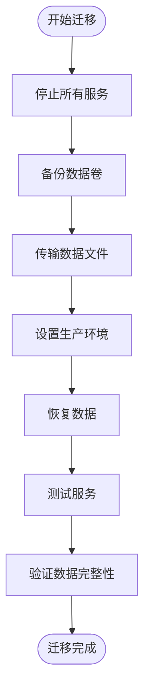

# 网络与数据卷配置

<cite>
**本文档中引用的文件**
- [docker-compose.yml](file://docker-compose.yml)
</cite>

## 目录
1. [简介](#简介)
2. [项目结构概览](#项目结构概览)
3. [自定义网络配置](#自定义网络配置)
4. [数据卷配置详解](#数据卷配置详解)
5. [网络与数据卷的协作机制](#网络与数据卷的协作机制)
6. [最佳实践与建议](#最佳实践与建议)
7. [故障排除指南](#故障排除指南)
8. [总结](#总结)

## 简介

在现代容器化应用中，网络和数据卷是确保应用稳定运行和数据持久化的关键组件。本文档深入分析TradingAgents项目中docker-compose.yml文件的网络和数据卷配置，探讨其设计原理、实现方式以及最佳实践。

通过系统性的分析，我们将了解如何利用Docker的网络隔离特性实现服务间的安全通信，以及如何通过精心设计的数据卷策略确保数据的持久化和可维护性。

## 项目结构概览

TradingAgents项目采用微服务架构，包含多个相互依赖的服务。项目结构清晰地展示了各个组件的组织方式：


**图表来源**
- [docker-compose.yml](file://docker-compose.yml#L1-L159)

## 自定义网络配置

### 网络驱动类型

TradingAgents项目使用bridge驱动创建自定义网络，这是Docker推荐的生产环境网络类型。


**图表来源**
- [docker-compose.yml](file://docker-compose.yml#L154-L156)

### 网络命名约定

项目采用统一的命名约定：`tradingagents-network`，这种命名方式具有以下优势：

1. **语义明确**：清晰表明网络服务于TradingAgents项目
2. **避免冲突**：独特的命名减少与其他项目的网络冲突
3. **易于识别**：便于在复杂的容器环境中快速定位

### 网络隔离与安全

自定义网络提供了以下安全特性：

- **服务发现**：容器可以通过服务名相互访问
- **网络隔离**：不同项目的网络完全隔离
- **流量控制**：可以限制容器间的通信
- **端口管理**：避免端口冲突问题


**图表来源**
- [docker-compose.yml](file://docker-compose.yml#L15-L17)
- [docker-compose.yml](file://docker-compose.yml#L67-L69)
- [docker-compose.yml](file://docker-compose.yml#L103-L105)

**章节来源**
- [docker-compose.yml](file://docker-compose.yml#L154-L156)

## 数据卷配置详解

### 数据卷驱动类型

项目使用local驱动创建数据卷，这是最常用的驱动类型，适用于单主机部署场景。


### 数据卷命名策略

项目为每个数据卷指定了明确的名称，这种做法具有显著优势：

| 数据卷名称 | 用途 | 存储位置 |
|-----------|------|----------|
| tradingagents_mongodb_data | MongoDB数据存储 | `/var/lib/docker/volumes/tradingagents_mongodb_data/_data` |
| tradingagents_redis_data | Redis数据存储 | `/var/lib/docker/volumes/tradingagents_redis_data/_data` |

### 核心数据库数据卷

#### MongoDB数据卷配置


**图表来源**
- [docker-compose.yml](file://docker-compose.yml#L70-L71)

#### Redis数据卷配置


**图表来源**
- [docker-compose.yml](file://docker-compose.yml#L106-L107)

### Bind Mount vs 数据卷对比

项目采用了混合使用策略，核心数据库使用数据卷，而日志和配置使用bind mounts：

| 特性 | 数据卷 | Bind Mount |
|------|--------|------------|
| 管理方式 | Docker管理 | 宿主机管理 |
| 数据持久化 | 容器生命周期内持久化 | 宿主机文件系统 |
| 性能 | 良好 | 优秀 |
| 共享性 | 易于跨容器共享 | 有限制 |
| 备份 | 更安全 | 直接文件备份 |
| 调试 | 需要进入容器 | 直接访问文件 |
| 移动性 | 可以导出导入 | 依赖宿主机路径 |

### 混合使用策略的优势


**章节来源**
- [docker-compose.yml](file://docker-compose.yml#L14-L25)
- [docker-compose.yml](file://docker-compose.yml#L70-L72)
- [docker-compose.yml](file://docker-compose.yml#L106-L108)

## 网络与数据卷的协作机制

### 服务间通信架构


**图表来源**
- [docker-compose.yml](file://docker-compose.yml#L15-L17)
- [docker-compose.yml](file://docker-compose.yml#L67-L69)
- [docker-compose.yml](file://docker-compose.yml#L103-L105)

### 数据流与网络交互


**图表来源**
- [docker-compose.yml](file://docker-compose.yml#L15-L17)
- [docker-compose.yml](file://docker-compose.yml#L67-L69)
- [docker-compose.yml](file://docker-compose.yml#L103-L105)

**章节来源**
- [docker-compose.yml](file://docker-compose.yml#L1-L159)

## 最佳实践与建议

### 数据卷备份策略

基于项目的配置，以下是推荐的数据卷备份方法：

#### 1. 使用Docker内置命令备份

```bash
# 备份MongoDB数据卷
docker run --rm -v tradingagents_mongodb_data:/data -v $(pwd):/backup \
  alpine tar czf /backup/mongodb_backup.tar.gz -C /data .

# 备份Redis数据卷  
docker run --rm -v tradingagents_redis_data:/data -v $(pwd):/backup \
  alpine tar czf /backup/redis_backup.tar.gz -C /data .
```

#### 2. 使用Docker Compose命令备份

```bash
# 创建备份目录
mkdir -p backups/$(date +%Y%m%d)

# 停止服务
docker compose down

# 备份数据卷
docker compose cp tradingagents-mongodb:/data/db backups/$(date +%Y%m%d)/mongodb_data
docker compose cp tradingagents-redis:/data backups/$(date +%Y%m%d)/redis_data

# 启动服务
docker compose up -d
```

### 数据迁移指南

#### 从开发环境迁移到生产环境



#### 数据卷迁移脚本示例

```bash
#!/bin/bash
# 生产环境数据迁移脚本

# 1. 停止现有服务
echo "停止现有服务..."
docker compose down

# 2. 备份当前数据
echo "备份当前数据..."
tar -czf backup_$(date +%Y%m%d_%H%M%S).tar.gz tradingagents_mongodb_data tradingagents_redis_data

# 3. 恢复新数据
echo "恢复新数据..."
tar -xzf new_data_backup.tar.gz

# 4. 重新启动服务
echo "启动新服务..."
docker compose up -d

echo "数据迁移完成！"
```

### 监控和维护

#### 数据卷健康检查

```bash
#!/bin/bash
# 数据卷健康检查脚本

echo "=== 数据卷健康检查 ==="

# 检查数据卷状态
echo "1. 检查数据卷大小:"
docker volume ls
echo ""

# 检查MongoDB数据卷
echo "2. MongoDB数据卷检查:"
docker run --rm -v tradingagents_mongodb_data:/data alpine du -sh /data
echo ""

# 检查Redis数据卷
echo "3. Redis数据卷检查:"
docker run --rm -v tradingagents_redis_data:/data alpine du -sh /data
echo ""

# 检查磁盘空间
echo "4. 磁盘空间检查:"
df -h | grep docker
```

#### 自动化维护任务

```bash
#!/bin/bash
# 自动化维护脚本

# 清理旧的日志文件
find logs -name "*.log" -mtime +7 -delete

# 压缩旧的备份文件
find backups -name "*.tar.gz" -mtime +30 -exec gzip {} \;

# 检查数据卷使用情况
VOLUME_USAGE=$(docker system df -v | grep "tradingagents_" | awk '{print $3}')
if [[ $VOLUME_USAGE > "80%" ]]; then
    echo "警告: 数据卷使用率超过80%"
fi
```

## 故障排除指南

### 常见网络问题

#### 1. 服务无法连接到数据库

**症状**: Web服务报告数据库连接失败

**排查步骤**:
```bash
# 检查网络连接
docker exec TradingAgents-web ping mongodb
docker exec TradingAgents-web ping redis

# 检查DNS解析
docker exec TradingAgents-web nslookup mongodb
docker exec TradingAgents-web nslookup redis

# 检查端口连通性
docker exec TradingAgents-web telnet mongodb 27017
docker exec TradingAgents-web telnet redis 6379
```

**解决方案**:
- 确认网络已正确创建：`docker network ls | grep tradingagents-network`
- 重启相关服务：`docker compose restart mongodb redis`

#### 2. 端口冲突

**症状**: 容器启动失败，提示端口已被占用

**解决方案**:
```bash
# 查找占用端口的进程
sudo netstat -tulpn | grep :8501
sudo netstat -tulpn | grep :27017
sudo netstat -tulpn | grep :6379

# 修改docker-compose.yml中的端口映射
# 或者停止占用端口的进程
```

### 常见数据卷问题

#### 1. 数据丢失或损坏

**症状**: 应用程序报告数据不一致或缺失

**排查步骤**:
```bash
# 检查数据卷状态
docker volume inspect tradingagents_mongodb_data
docker volume inspect tradingagents_redis_data

# 检查容器内的数据
docker run --rm -v tradingagents_mongodb_data:/data alpine ls -la /data
docker run --rm -v tradingagents_redis_data:/data alpine ls -la /data
```

**解决方案**:
- 从最近的备份恢复数据
- 检查Docker守护进程的存储驱动配置
- 验证宿主机的磁盘空间和权限

#### 2. 权限问题

**症状**: 容器无法写入数据卷

**解决方案**:
```bash
# 检查数据卷权限
docker run --rm -v tradingagents_mongodb_data:/data alpine chmod 755 /data

# 修复权限问题
sudo chown -R 999:999 /var/lib/docker/volumes/tradingagents_mongodb_data/_data
sudo chown -R 999:999 /var/lib/docker/volumes/tradingagents_redis_data/_data
```

### 性能优化建议

#### 1. 网络性能优化

```yaml
# 在docker-compose.yml中添加网络配置
networks:
  tradingagents-network:
    driver: bridge
    driver_opts:
      com.docker.network.bridge.enable_icc: "true"
      com.docker.network.bridge.enable_ip_masquerade: "true"
      com.docker.network.driver.mtu: "1500"
```

#### 2. 存储性能优化

```yaml
# 使用性能更好的存储驱动
volumes:
  mongodb_data:
    driver: local
    driver_opts:
      type: none
      o: bind
      device: /mnt/fast-storage/mongodb_data
  redis_data:
    driver: local
    driver_opts:
      type: none
      o: bind
      device: /mnt/fast-storage/redis_data
```

## 总结

TradingAgents项目的网络和数据卷配置展现了现代容器化应用的最佳实践。通过精心设计的架构，项目实现了：

### 关键优势

1. **网络安全性**：使用自定义bridge网络确保服务间的安全通信
2. **数据持久化**：通过数据卷配置保证核心数据的可靠存储
3. **运维便利性**：混合使用策略平衡了数据安全性和开发效率
4. **扩展性**：清晰的架构设计便于未来的功能扩展

### 设计原则

- **分离关注点**：不同类型的数据采用不同的存储策略
- **命名规范**：统一的命名约定提高可维护性
- **安全优先**：合理的网络隔离和权限控制
- **性能考虑**：针对不同数据类型的优化配置

### 实践价值

这套配置方案不仅适用于TradingAgents项目，也为其他容器化应用提供了宝贵的参考。通过学习和应用这些最佳实践，开发者可以构建更加稳定、安全和可维护的容器化应用。