# 性能优化指南

<cite>
**本文档中引用的文件**
- [adaptive_cache.py](file://tradingagents/dataflows/adaptive_cache.py)
- [db_cache_manager.py](file://tradingagents/dataflows/db_cache_manager.py)
- [database_manager.py](file://tradingagents/config/database_manager.py)
- [database_config.py](file://tradingagents/config/database_config.py)
- [docker-compose.yml](file://docker-compose.yml)
- [logging.toml](file://config/logging.toml)
- [logging_docker.toml](file://config/logging_docker.toml)
- [logging_manager.py](file://tradingagents/utils/logging_manager.py)
- [test_redis_performance.py](file://tests/test_redis_performance.py)
- [cleanup_cache.py](file://scripts/maintenance/cleanup_cache.py)
</cite>

## 目录
1. [简介](#简介)
2. [系统架构概览](#系统架构概览)
3. [基于Redis的缓存优化](#基于redis的缓存优化)
4. [数据库缓存管理](#数据库缓存管理)
5. [Docker资源限制配置](#docker资源限制配置)
6. [日志级别与性能影响](#日志级别与性能影响)
7. [数据库优化策略](#数据库优化策略)
8. [性能监控与分析](#性能监控与分析)
9. [最佳实践建议](#最佳实践建议)
10. [故障排除指南](#故障排除指南)

## 简介

TradingAgents-CN是一个高性能的交易分析系统，采用多层次缓存架构和智能数据库管理策略。本指南详细介绍了系统的核心性能优化机制，包括自适应缓存管理、数据库连接优化、Docker资源配置和日志系统调优等关键技术。

## 系统架构概览

系统采用分层架构设计，支持多种缓存后端和数据库组合：

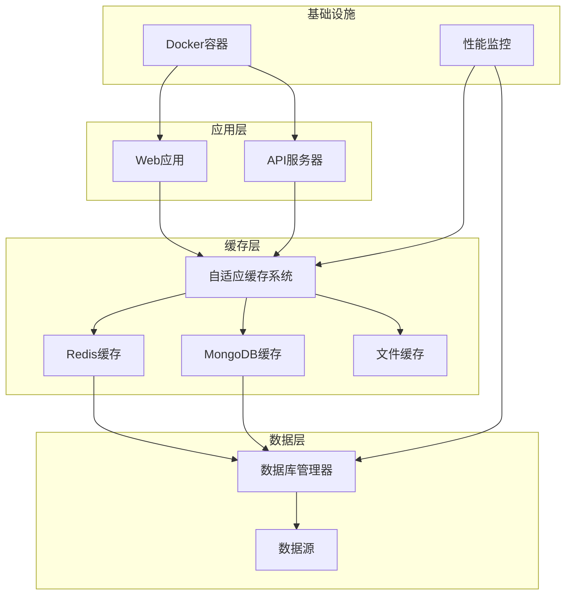

**图表来源**
- [adaptive_cache.py](file://tradingagents/dataflows/adaptive_cache.py#L1-L50)
- [database_manager.py](file://tradingagents/config/database_manager.py#L1-L50)

**章节来源**
- [adaptive_cache.py](file://tradingagents/dataflows/adaptive_cache.py#L1-L100)
- [database_manager.py](file://tradingagents/config/database_manager.py#L1-L100)

## 基于Redis的缓存优化

### 自适应缓存管理机制

系统实现了智能的自适应缓存管理，根据数据库可用性自动选择最优缓存策略：

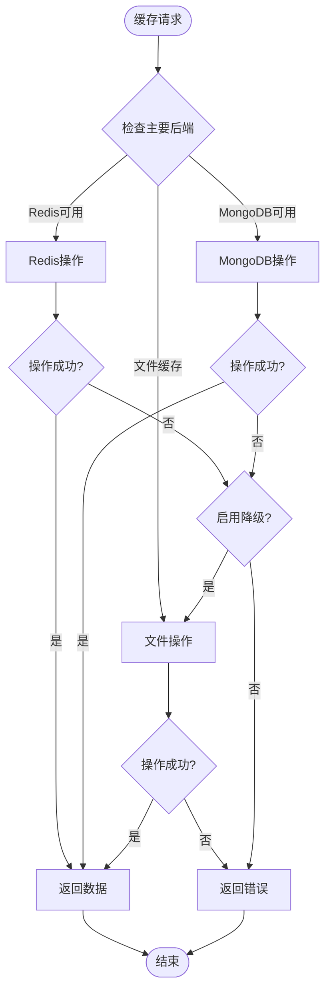

**图表来源**
- [adaptive_cache.py](file://tradingagents/dataflows/adaptive_cache.py#L200-L250)

### 缓存配置参数优化

| 参数类别 | 配置项 | 默认值 | 优化建议 | 性能影响 |
|---------|--------|--------|----------|----------|
| TTL设置 | US股票数据 | 2小时 | 根据数据更新频率调整 | 减少API调用 |
| TTL设置 | 中国股票数据 | 1小时 | 实时性强的数据缩短 | 提高数据新鲜度 |
| TTL设置 | 新闻数据 | 6小时 | 新闻时效性较低 | 平衡存储和性能 |
| TTL设置 | 基本面数据 | 24小时 | 长期参考数据延长 | 减少重复计算 |
| 文件缓存 | 最大大小 | 1000MB | 根据磁盘空间调整 | 防止磁盘满载 |
| 文件缓存 | 清理间隔 | 24小时 | 频繁访问数据缩短 | 保持磁盘整洁 |

### 缓存过期时间策略

系统实现了智能的TTL（生存时间）管理机制：

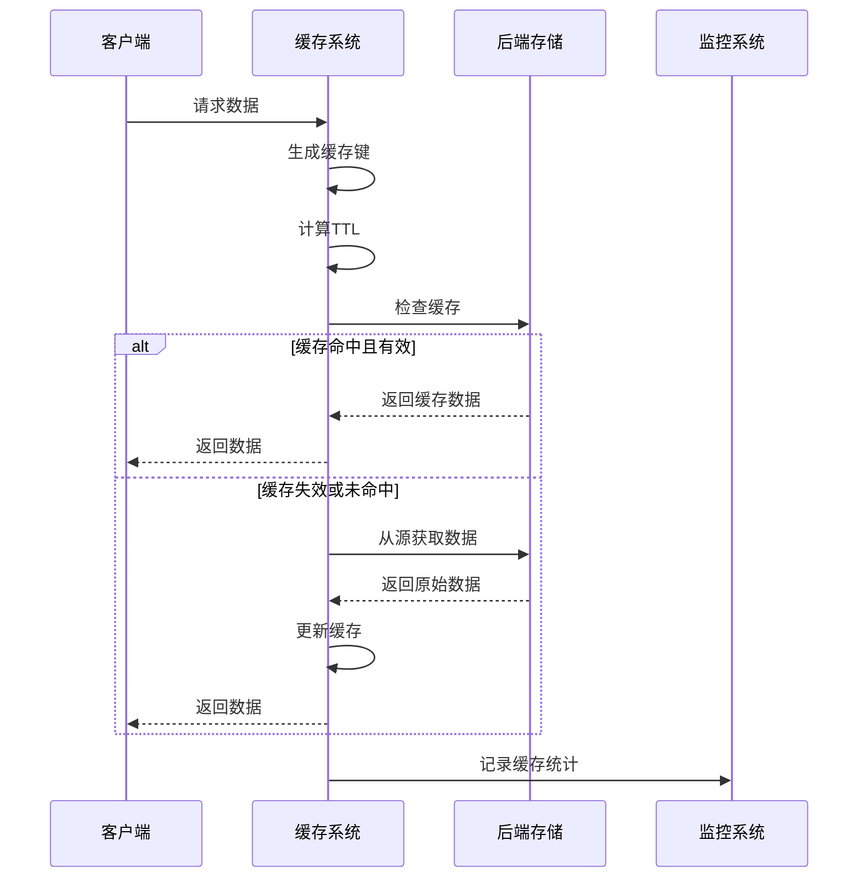

**图表来源**
- [adaptive_cache.py](file://tradingagents/dataflows/adaptive_cache.py#L40-L80)

**章节来源**
- [adaptive_cache.py](file://tradingagents/dataflows/adaptive_cache.py#L40-L150)

## 数据库缓存管理

### 多层缓存架构

DatabaseCacheManager实现了MongoDB和Redis的双层缓存架构：

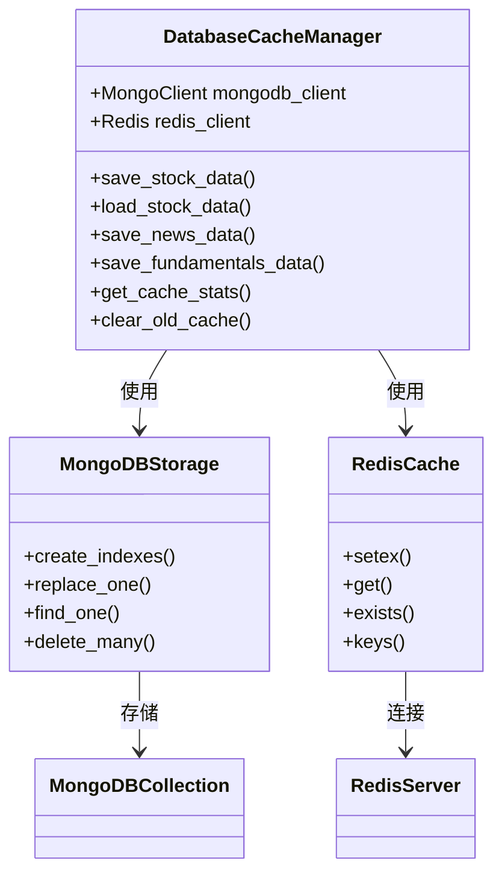

**图表来源**
- [db_cache_manager.py](file://tradingagents/dataflows/db_cache_manager.py#L30-L80)

### 数据库连接池配置

| 配置项 | 开发环境 | 生产环境 | Docker环境 | 性能影响 |
|--------|----------|----------|------------|----------|
| 连接超时 | 5秒 | 2秒 | 2秒 | 减少等待时间 |
| 连接池大小 | 动态 | 10 | 5 | 平衡资源使用 |
| 重试次数 | 3次 | 5次 | 3次 | 提高可靠性 |
| 心跳检测 | 30秒 | 30秒 | 30秒 | 监控连接状态 |
| 最大重试间隔 | 30秒 | 60秒 | 30秒 | 防止无限重试 |

### 批量处理策略

系统支持多种批量操作优化：

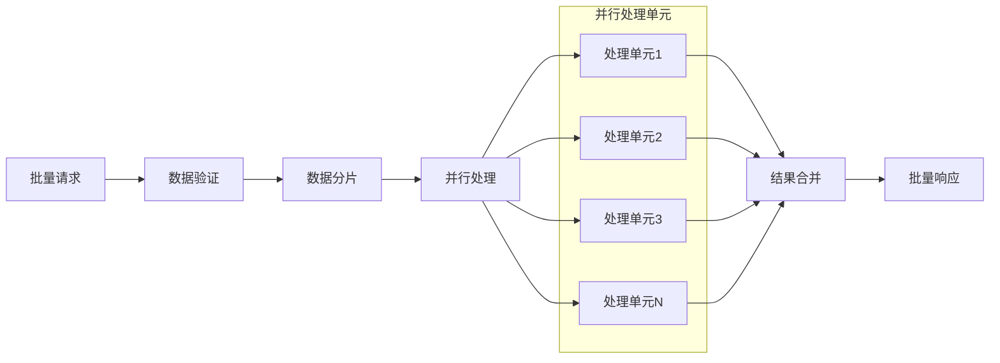

**图表来源**
- [db_cache_manager.py](file://tradingagents/dataflows/db_cache_manager.py#L200-L300)

**章节来源**
- [db_cache_manager.py](file://tradingagents/dataflows/db_cache_manager.py#L1-L200)

## Docker资源限制配置

### CPU和内存配置优化

Docker Compose配置提供了灵活的资源限制选项：

| 服务 | CPU限制 | 内存限制 | 优化策略 | 适用场景 |
|------|---------|----------|----------|----------|
| Web应用 | 2.0 | 2GB | 限制并发数 | 生产环境 |
| MongoDB | 1.5 | 1GB | 索引优化 | 数据密集型 |
| Redis | 1.0 | 512MB | 内存优化 | 缓存专用 |
| Redis Commander | 0.5 | 256MB | 管理工具 | 开发调试 |
| Mongo Express | 0.5 | 256MB | 管理工具 | 开发调试 |

### Docker资源监控

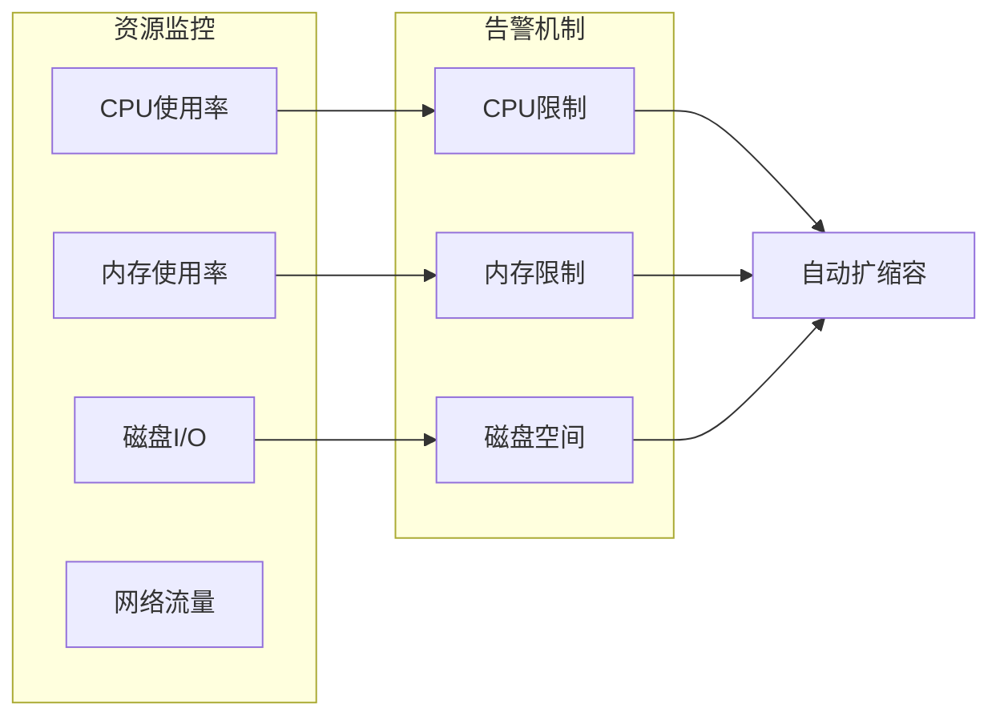

**图表来源**
- [docker-compose.yml](file://docker-compose.yml#L1-L50)

### 环境变量配置

关键的性能相关环境变量：

```yaml
environment:
  # Python优化
  PYTHONUNBUFFERED: 1
  PYTHONDONTWRITEBYTECODE: 1
  
  # JVM优化（如适用）
  JAVA_OPTS: "-Xmx512m -Xms256m"
  
  # 应用程序优化
  TRADINGAGENTS_LOG_LEVEL: "INFO"
  TRADINGAGENTS_CACHE_TYPE: "redis"
  TRADINGAGENTS_MAX_CONCURRENT_REQUESTS: "10"
```

**章节来源**
- [docker-compose.yml](file://docker-compose.yml#L1-L100)

## 日志级别与性能影响

### 日志级别配置策略

系统提供了多层次的日志配置，针对不同环境进行了优化：

| 日志级别 | 性能影响 | 内存占用 | I/O开销 | 适用场景 |
|----------|----------|----------|---------|----------|
| DEBUG | 高 | 高 | 高 | 开发调试 |
| INFO | 中 | 中 | 中 | 生产监控 |
| WARNING | 低 | 低 | 低 | 生产运行 |
| ERROR | 极低 | 极低 | 极低 | 生产运行 |
| CRITICAL | 极低 | 极低 | 极低 | 生产运行 |

### 生产环境日志配置最佳实践

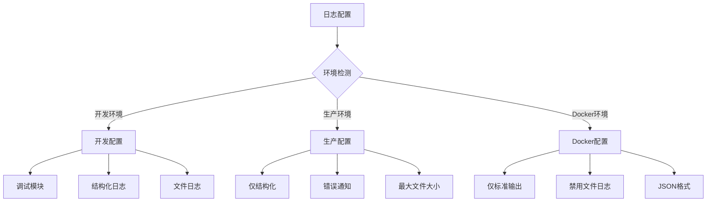

**图表来源**
- [logging.toml](file://config/logging.toml#L70-L110)
- [logging_docker.toml](file://config/logging_docker.toml#L70-L98)

### 性能监控日志

系统内置了详细的性能监控功能：

| 监控指标 | 阈值设置 | 告警条件 | 优化建议 |
|----------|----------|----------|----------|
| 慢操作阈值 | 5秒 | 超过阈值记录 | 优化算法或增加缓存 |
| 内存使用 | 80% | 超过阈值告警 | 调整JVM参数或增加内存 |
| API调用延迟 | 2秒 | 超过阈值记录 | 优化API调用策略 |
| 缓存命中率 | 90% | 低于阈值告警 | 调整缓存策略 |
| 数据库连接数 | 80% | 超过阈值告警 | 优化连接池配置 |

**章节来源**
- [logging.toml](file://config/logging.toml#L70-L110)
- [logging_manager.py](file://tradingagents/utils/logging_manager.py#L1-L100)

## 数据库优化策略

### 索引优化

系统为不同数据类型创建了专门的索引：

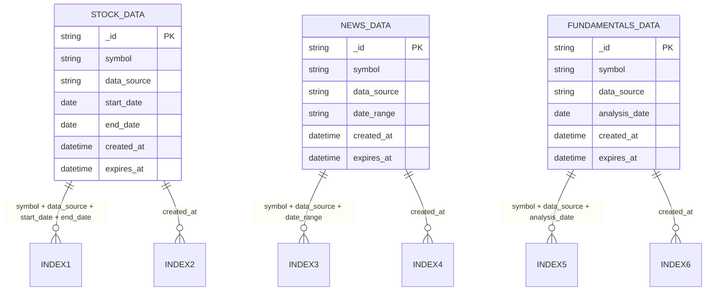

**图表来源**
- [db_cache_manager.py](file://tradingagents/dataflows/db_cache_manager.py#L120-L150)

### 连接池配置优化

| 配置参数 | 推荐值 | 说明 | 性能影响 |
|----------|--------|------|----------|
| 最小连接数 | 2 | 保证基本连接 | 减少连接开销 |
| 最大连接数 | 10 | 根据并发需求 | 防止连接过多 |
| 连接超时 | 2秒 | 快速失败 | 提高响应速度 |
| 空闲超时 | 300秒 | 清理空闲连接 | 资源回收 |
| 重试间隔 | 1秒 | 逐步重试 | 避免频繁重试 |

### 数据压缩策略

系统支持数据压缩以减少存储空间和传输时间：

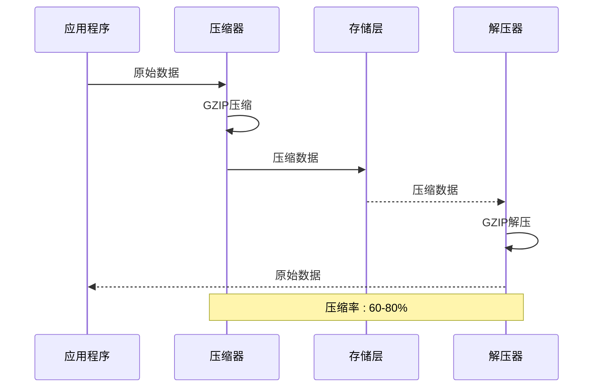

**图表来源**
- [db_cache_manager.py](file://tradingagents/dataflows/db_cache_manager.py#L150-L200)

**章节来源**
- [db_cache_manager.py](file://tradingagents/dataflows/db_cache_manager.py#L120-L200)

## 性能监控与分析

### Redis性能测试

系统提供了全面的Redis性能测试框架：

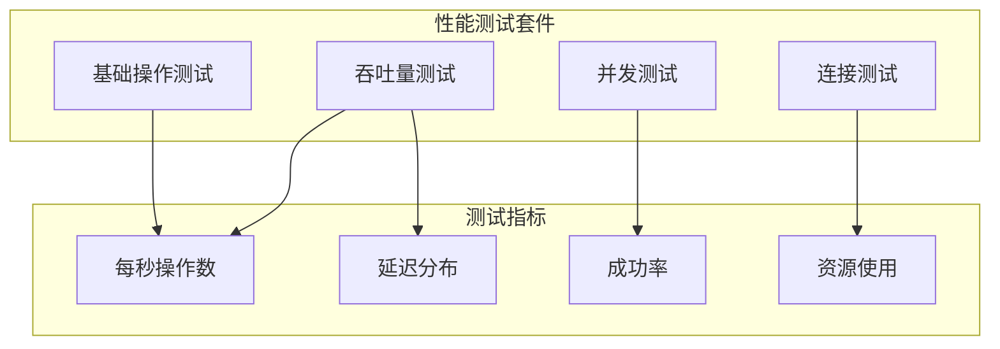

**图表来源**
- [test_redis_performance.py](file://tests/test_redis_performance.py#L120-L200)

### 缓存统计监控

系统实时监控缓存性能指标：

| 监控指标 | 计算方式 | 正常范围 | 异常处理 |
|----------|----------|----------|----------|
| 缓存命中率 | 命中次数/总请求 | >90% | 调整TTL或增加容量 |
| 平均响应时间 | 总时间/请求次数 | <100ms | 优化查询或增加缓存 |
| 内存使用率 | 已用内存/总内存 | <80% | 清理过期数据 |
| 连接池利用率 | 活跃连接/最大连接 | <70% | 调整连接池大小 |
| 错误率 | 错误次数/总请求 | <1% | 检查配置和网络 |

### 性能基准测试

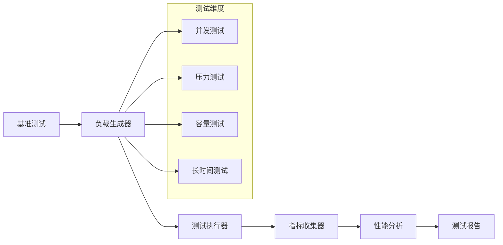

**图表来源**
- [test_redis_performance.py](file://tests/test_redis_performance.py#L1-L50)

**章节来源**
- [test_redis_performance.py](file://tests/test_redis_performance.py#L1-L100)

## 最佳实践建议

### 缓存优化策略

1. **智能TTL管理**
   - 根据数据更新频率设置不同的TTL
   - 实时数据使用较短TTL（1-2小时）
   - 历史数据使用较长TTL（24-72小时）

2. **预加载机制**
   - 关键数据提前加载到缓存
   - 使用后台线程定期更新热点数据
   - 实现智能预测加载

3. **缓存分层策略**
   - Redis用于高频访问数据
   - MongoDB用于持久化存储
   - 文件缓存作为最后降级方案

### 数据库优化建议

1. **连接池优化**
   ```python
   # 推荐的连接池配置
   connection_pool = ConnectionPool(
       host='localhost',
       port=6379,
       max_connections=10,
       timeout=2,
       retry_on_timeout=True
   )
   ```

2. **批量操作优化**
   - 使用管道（Pipeline）减少网络往返
   - 批量插入和更新操作
   - 合理设置批量大小（100-1000条）

3. **索引策略**
   - 为常用查询字段创建复合索引
   - 定期分析查询计划
   - 删除未使用的索引

### Docker部署优化

1. **资源分配**
   ```yaml
   web:
     deploy:
       resources:
         limits:
           cpus: '2.0'
           memory: 2G
         reservations:
           cpus: '1.0'
           memory: 1G
   ```

2. **健康检查**
   ```yaml
   healthcheck:
     test: ["CMD", "curl", "-f", "http://localhost:8501/_stcore/health"]
     interval: 30s
     timeout: 10s
     retries: 3
     start_period: 60s
   ```

3. **日志配置**
   ```yaml
   logging:
     driver: "json-file"
     options:
       max-size: "100m"
       max-file: "3"
   ```

### 监控和告警

1. **关键指标监控**
   - 缓存命中率
   - 数据库响应时间
   - 内存使用率
   - CPU使用率
   - 错误率

2. **告警阈值设置**
   - 缓存命中率 < 85%
   - 响应时间 > 2秒
   - 内存使用率 > 80%
   - 错误率 > 5%

## 故障排除指南

### 常见性能问题

1. **缓存性能问题**
   - **症状**: 响应时间过长
   - **原因**: 缓存命中率低、TTL设置不当
   - **解决方案**: 调整TTL、优化缓存策略、增加缓存容量

2. **数据库连接问题**
   - **症状**: 连接超时、连接池耗尽
   - **原因**: 连接池配置不当、查询效率低
   - **解决方案**: 调整连接池大小、优化查询、使用连接池监控

3. **内存泄漏问题**
   - **症状**: 内存使用持续增长
   - **原因**: 缓存未及时清理、对象未释放
   - **解决方案**: 定期清理缓存、检查代码逻辑、使用内存分析工具

### 性能诊断工具

1. **Redis性能分析**
   ```bash
   # Redis性能监控命令
   redis-cli --latency-history
   redis-cli --stat
   redis-cli --bigkeys
   ```

2. **数据库性能分析**
   ```sql
   -- MongoDB性能分析
   db.currentOp()
   db.serverStatus()
   db.stats()
   ```

3. **系统资源监控**
   ```bash
   # 系统资源监控
   top -p $(pgrep python)
   htop
   iostat -x 1
   free -h
   ```

### 优化效果评估

定期评估优化效果，确保性能目标达成：

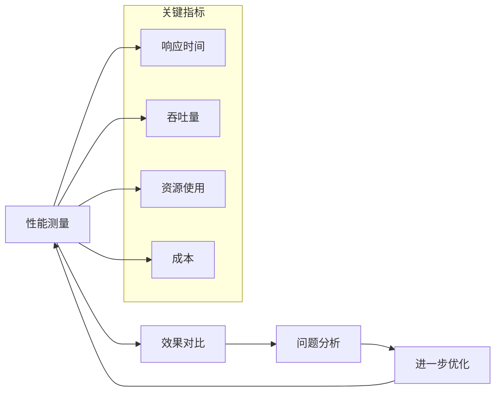

**章节来源**
- [cleanup_cache.py](file://scripts/maintenance/cleanup_cache.py#L50-L70)

## 结论

TradingAgents-CN的性能优化体系涵盖了从缓存管理到数据库优化的全方位策略。通过合理的配置和持续的监控，可以实现高性能、高可用的交易分析系统。建议根据实际业务需求和硬件环境，灵活调整各项配置参数，以达到最佳的性能表现。

关键优化要点：
- 实施多层缓存架构，提高数据访问速度
- 优化数据库连接池和索引策略
- 合理配置Docker资源限制
- 建立完善的监控和告警机制
- 定期进行性能测试和基准评估

通过遵循本指南的最佳实践，可以显著提升系统的整体性能和用户体验。