# 日志系统优化指南

<cite>
**本文档中引用的文件**
- [config/logging.toml](file://config/logging.toml)
- [config/logging_docker.toml](file://config/logging_docker.toml)
- [tradingagents/utils/logging_init.py](file://tradingagents/utils/logging_init.py)
- [tradingagents/utils/logging_manager.py](file://tradingagents/utils/logging_manager.py)
- [scripts/test_docker_logging.py](file://scripts/test_docker_logging.py)
- [scripts/fix_docker_logging.py](file://scripts/fix_docker_logging.py)
- [examples/simple_analysis_demo.py](file://examples/simple_analysis_demo.py)
- [tradingagents/dataflows/stock_data_service.py](file://tradingagents/dataflows/stock_data_service.py)
</cite>

## 目录
1. [简介](#简介)
2. [日志配置文件结构](#日志配置文件结构)
3. [全局日志级别配置](#全局日志级别配置)
4. [处理器配置详解](#处理器配置详解)
5. [日志格式自定义](#日志格式自定义)
6. [环境特定配置](#环境特定配置)
7. [高级功能配置](#高级功能配置)
8. [性能监控日志](#性能监控日志)
9. [安全日志配置](#安全日志配置)
10. [业务日志配置](#业务日志配置)
11. [日志级别对性能的影响](#日志级别对性能的影响)
12. [大日志文件分割策略](#大日志文件分割策略)
13. [故障排除指南](#故障排除指南)
14. [最佳实践](#最佳实践)

## 简介

TradingAgents-CN采用了一套完整的日志系统，支持多环境部署、多种日志格式和丰富的监控功能。该系统基于Python标准logging模块构建，提供了灵活的配置选项和强大的扩展能力。

### 核心特性

- **多环境支持**：开发、生产、Docker环境的专门配置
- **多种格式**：控制台、文件、结构化(JSON)日志
- **智能路由**：不同模块的独立日志级别控制
- **性能监控**：慢操作记录和内存使用跟踪
- **安全审计**：API调用和Token使用追踪
- **业务洞察**：用户操作和分析事件记录

## 日志配置文件结构

### 主配置文件架构

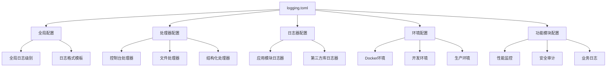

**图表来源**
- [config/logging.toml](file://config/logging.toml#L1-L111)

### 配置文件层次结构

| 配置层级 | 用途 | 示例 |
|---------|------|------|
| `[logging]` | 全局设置 | 日志级别、格式模板 |
| `[logging.handlers]` | 处理器配置 | 控制台、文件、结构化 |
| `[logging.loggers]` | 模块日志器 | tradingagents、web、dataflows |
| `[logging.docker]` | Docker环境 | stdout_only、disable_file_logging |
| `[logging.performance]` | 性能监控 | 慢操作阈值、内存监控 |
| `[logging.security]` | 安全审计 | API调用、Token使用 |
| `[logging.business]` | 业务日志 | 用户操作、分析事件 |

**章节来源**
- [config/logging.toml](file://config/logging.toml#L1-L111)

## 全局日志级别配置

### 日志级别层次

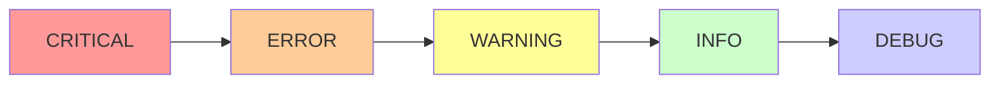

### 级别说明与使用场景

| 级别 | 数值 | 用途 | 示例场景 |
|------|------|------|----------|
| DEBUG | 10 | 详细调试信息 | 开发阶段的详细执行过程 |
| INFO | 20 | 一般信息记录 | 正常操作的确认信息 |
| WARNING | 30 | 警告但继续运行 | 降级方案启用、配置问题 |
| ERROR | 40 | 错误但继续运行 | 单个组件失败但不影响整体 |
| CRITICAL | 50 | 严重错误 | 系统级故障、无法恢复 |

### 全局级别设置

```toml
[logging]
level = "INFO"  # 全局默认级别
```

**章节来源**
- [config/logging.toml](file://config/logging.toml#L4-L6)

## 处理器配置详解

### 控制台处理器

控制台处理器负责实时输出日志到终端，支持彩色输出和动态级别控制。

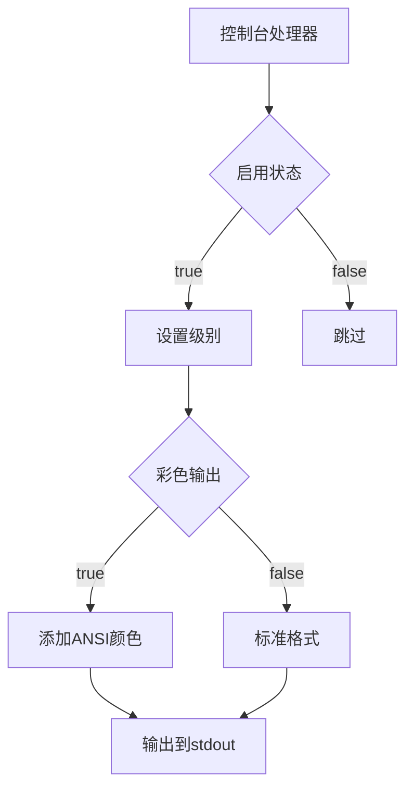

**图表来源**
- [tradingagents/utils/logging_manager.py](file://tradingagents/utils/logging_manager.py#L195-L228)

#### 配置参数

| 参数 | 类型 | 默认值 | 说明 |
|------|------|--------|------|
| enabled | boolean | true | 是否启用控制台输出 |
| colored | boolean | true | 是否启用彩色输出 |
| level | string | "INFO" | 处理器级别 |

#### 格式化选项

- **普通格式**：`%(asctime)s | %(name)-20s | %(levelname)-8s | %(message)s`
- **彩色格式**：自动添加ANSI颜色码

**章节来源**
- [config/logging.toml](file://config/logging.toml#L12-L18)

### 文件处理器

文件处理器将日志持久化到磁盘，支持自动轮转和大小限制。

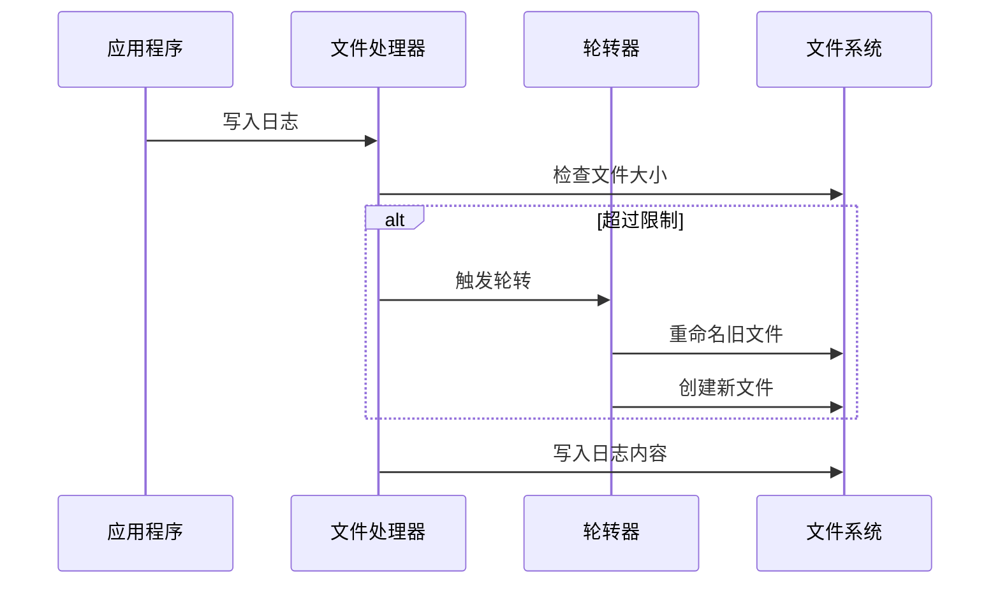

**图表来源**
- [tradingagents/utils/logging_manager.py](file://tradingagents/utils/logging_manager.py#L226-L260)

#### 配置参数

| 参数 | 类型 | 默认值 | 说明 |
|------|------|--------|------|
| enabled | boolean | true | 是否启用文件日志 |
| level | string | "DEBUG" | 处理器级别 |
| max_size | string | "10MB" | 单个文件最大大小 |
| backup_count | integer | 5 | 保留的备份文件数量 |
| directory | string | "./logs" | 日志文件目录 |

#### 大小解析规则

- 支持单位：KB、MB、GB
- 示例：`"10MB"`、`"500KB"`、`"2GB"`

**章节来源**
- [config/logging.toml](file://config/logging.toml#L20-L28)

### 结构化处理器

结构化处理器将日志输出为JSON格式，便于后续分析和监控。

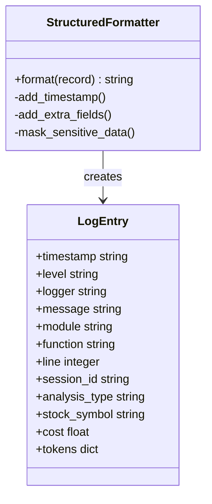

**图表来源**
- [tradingagents/utils/logging_manager.py](file://tradingagents/utils/logging_manager.py#L42-L88)

#### 配置参数

| 参数 | 类型 | 默认值 | 说明 |
|------|------|--------|------|
| enabled | boolean | false | 是否启用结构化日志 |
| level | string | "INFO" | 处理器级别 |
| directory | string | "./logs" | 日志文件目录 |

#### 自动添加的字段

- `session_id`: 会话标识符
- `analysis_type`: 分析类型
- `stock_symbol`: 股票代码
- `cost`: 成本信息
- `tokens`: Token使用统计

**章节来源**
- [config/logging.toml](file://config/logging.toml#L30-L36)

## 日志格式自定义

### 格式模板系统

```mermaid
graph TD
A[格式模板] --> B[控制台格式]
A --> C[文件格式]
A --> D[结构化格式]
B --> B1[时间戳 | 模块名 | 级别 | 消息]
C --> C1[完整上下文信息]
D --> D1[JSON结构化数据]
B1 --> B2[%(...s)格式化]
C1 --> C2[模块:函数:行号]
D1 --> D2[键值对形式]
```

### 控制台格式

**默认格式**：
```
%(asctime)s | %(name)-20s | %(levelname)-8s | %(message)s
```

**示例输出**：
```
2024-01-15 10:30:45.123 | tradingagents.dataflows  | INFO     | 股票数据获取完成
```

### 文件格式

**默认格式**：
```
%(asctime)s | %(name)-20s | %(levelname)-8s | %(module)s:%(funcName)s:%(lineno)d | %(message)s
```

**示例输出**：
```
2024-01-15 10:30:45.123 | tradingagents.dataflows | INFO     | stock_data_service:get_stock_basic_info:45 | 股票基础信息获取成功
```

### 结构化格式

**JSON输出**：
```json
{
  "timestamp": "2024-01-15T10:30:45.123456",
  "level": "INFO",
  "logger": "tradingagents.dataflows",
  "message": "股票数据获取完成",
  "module": "stock_data_service",
  "function": "get_stock_basic_info",
  "line": 45
}
```

**章节来源**
- [config/logging.toml](file://config/logging.toml#L8-L10)

## 环境特定配置

### Docker环境配置

Docker环境具有特殊的配置要求，主要解决容器化部署中的日志输出问题。

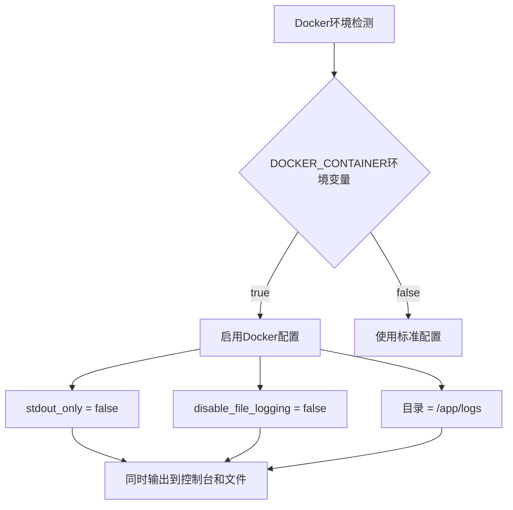

**图表来源**
- [config/logging_docker.toml](file://config/logging_docker.toml#L70-L75)

#### Docker配置参数

| 参数 | 类型 | 默认值 | 说明 |
|------|------|--------|------|
| enabled | boolean | auto-detect | 自动检测Docker环境 |
| stdout_only | boolean | false | 是否只输出到标准输出 |
| disable_file_logging | boolean | false | 是否禁用文件日志 |

#### Docker专用配置

```toml
[logging.docker]
enabled = true
stdout_only = false
disable_file_logging = false

[logging.handlers.file]
directory = "/app/logs"
max_size = "100MB"
backup_count = 5
```

**章节来源**
- [config/logging_docker.toml](file://config/logging_docker.toml#L70-L80)

### 开发环境配置

开发环境强调调试信息和详细的执行跟踪。

#### 配置特点

- **详细日志**：启用DEBUG级别
- **模块选择性**：特定模块的详细日志
- **文件保存**：保留调试文件

#### 配置示例

```toml
[logging.development]
enabled = true
debug_modules = ["tradingagents.graph", "tradingagents.llm_adapters"]
save_debug_files = true
```

**章节来源**
- [config/logging.toml](file://config/logging.toml#L73-L77)

### 生产环境配置

生产环境注重性能和结构化输出。

#### 配置特点

- **结构化日志**：启用JSON格式
- **严格级别**：INFO及以上级别
- **大文件支持**：100MB单文件限制

#### 配置示例

```toml
[logging.production]
enabled = true
structured_only = true
error_notification = true
max_log_size = "100MB"
```

**章节来源**
- [config/logging.toml](file://config/logging.toml#L79-L84)

## 高级功能配置

### 模块特定日志器

系统为不同模块设置了专门的日志器，允许独立控制每个模块的日志级别。

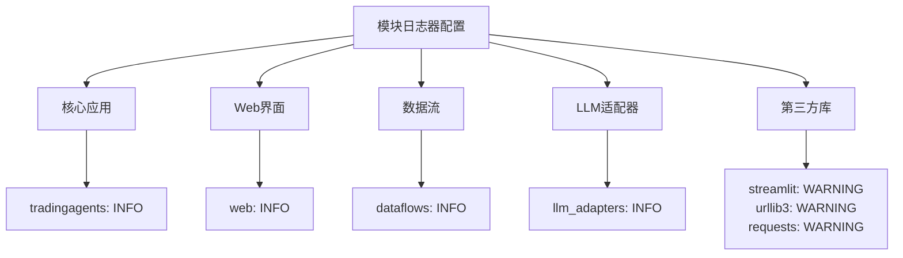

**图表来源**
- [config/logging.toml](file://config/logging.toml#L38-L68)

#### 核心模块配置

| 模块 | 日志级别 | 说明 |
|------|----------|------|
| tradingagents | INFO | 主应用逻辑 |
| web | INFO | Web界面操作 |
| dataflows | INFO | 数据处理流程 |
| llm_adapters | INFO | AI模型适配器 |
| streamlit | WARNING | Web框架噪音过滤 |
| urllib3 | WARNING | HTTP请求噪音过滤 |
| requests | WARNING | 请求库噪音过滤 |

**章节来源**
- [config/logging.toml](file://config/logging.toml#L38-L68)

### 环境变量支持

系统支持通过环境变量覆盖配置：

| 环境变量 | 默认值 | 说明 |
|----------|--------|------|
| TRADINGAGENTS_LOG_LEVEL | INFO | 全局日志级别 |
| TRADINGAGENTS_LOG_DIR | ./logs | 日志文件目录 |
| DOCKER_CONTAINER | false | Docker环境检测 |

**章节来源**
- [tradingagents/utils/logging_manager.py](file://tradingagents/utils/logging_manager.py#L90-L128)

## 性能监控日志

### 慢操作记录

系统能够自动检测和记录执行时间超过阈值的操作。

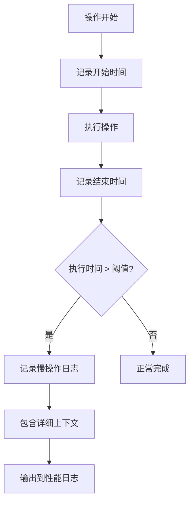

#### 配置参数

| 参数 | 类型 | 默认值 | 说明 |
|------|------|--------|------|
| enabled | boolean | true | 是否启用慢操作监控 |
| log_slow_operations | boolean | true | 是否记录慢操作 |
| slow_threshold_seconds | float | 5.0 | 慢操作阈值(秒) |
| log_memory_usage | boolean | false | 是否记录内存使用 |

#### 慢操作日志示例

```
2024-01-15 10:30:45.123 | tradingagents.dataflows | WARNING  | 分析完成 - 股票: AAPL, 耗时: 8.23s, 成本: ¥0.0012
```

**章节来源**
- [config/logging.toml](file://config/logging.toml#L86-L91)

### 性能指标收集

系统自动收集以下性能指标：

- **执行时间**：各模块操作耗时
- **内存使用**：峰值内存占用
- **Token使用**：API调用成本统计
- **吞吐量**：操作频率统计

**章节来源**
- [tradingagents/utils/logging_manager.py](file://tradingagents/utils/logging_manager.py#L320-L380)

## 安全日志配置

### API调用追踪

系统记录所有外部API调用的详细信息。

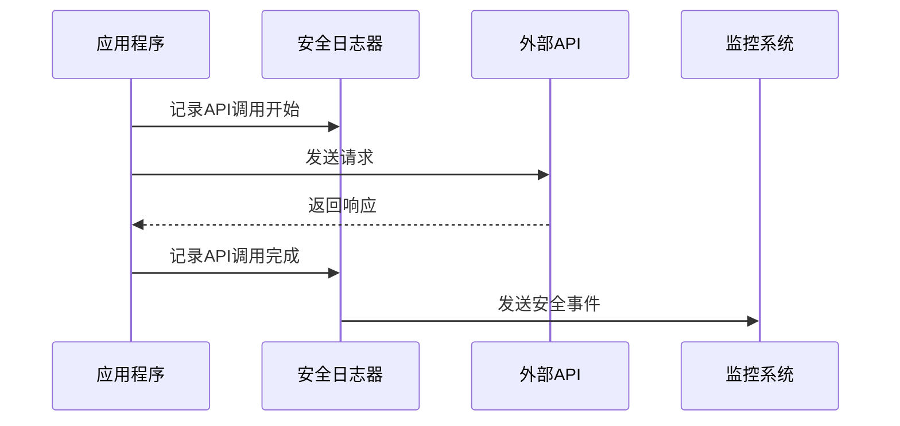

#### API安全配置

| 功能 | 默认值 | 说明 |
|------|--------|------|
| log_api_calls | true | 记录API调用 |
| log_token_usage | true | 记录Token使用 |
| mask_sensitive_data | true | 屏蔽敏感信息 |

#### API调用日志示例

```
2024-01-15 10:30:45.123 | llm_adapters.deepseek | INFO     | 📊 Token使用 - deepseek/qwen-plus: 输入=1200, 输出=300, 成本=¥0.0015
```

**章节来源**
- [config/logging.toml](file://config/logging.toml#L93-L98)

### 敏感数据保护

系统自动屏蔽和脱敏敏感信息：

- **API密钥**：显示前8位，其余用"..."替代
- **用户凭据**：完全屏蔽
- **个人数据**：部分脱敏

**章节来源**
- [web/components/operation_logs.py](file://web/components/operation_logs.py#L972-L992)

## 业务日志配置

### 用户操作审计

系统记录所有用户相关的操作，支持合规性和审计需求。

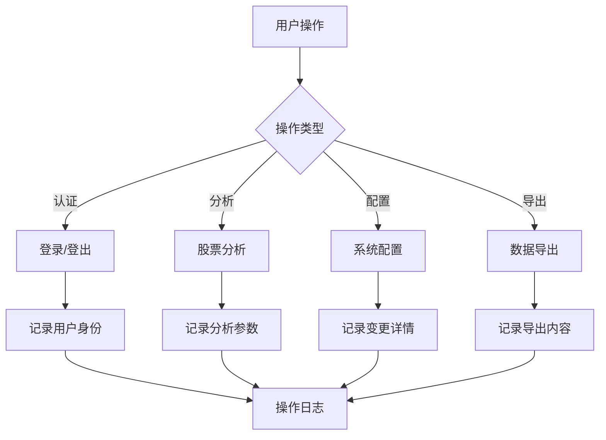

#### 业务日志功能

| 功能 | 默认值 | 说明 |
|------|--------|------|
| log_analysis_events | true | 记录分析事件 |
| log_user_actions | true | 记录用户操作 |
| log_export_events | true | 记录导出事件 |

#### 用户操作日志示例

```
2024-01-15 10:30:45.123 | web.user_activity | INFO     | 用户admin执行了"股票分析"操作，股票:AAPL，类型:技术分析
```

**章节来源**
- [config/logging.toml](file://config/logging.toml#L100-L105)

### 操作类型分类

系统支持多种操作类型的记录：

- **auth**: 认证相关操作
- **analysis**: 股票分析操作
- **navigation**: 页面导航
- **config**: 系统配置修改
- **data_export**: 数据导出
- **user_management**: 用户管理
- **system**: 系统级操作

**章节来源**
- [web/components/operation_logs.py](file://web/components/operation_logs.py#L181-L221)

## 日志级别对性能的影响

### 性能影响分析

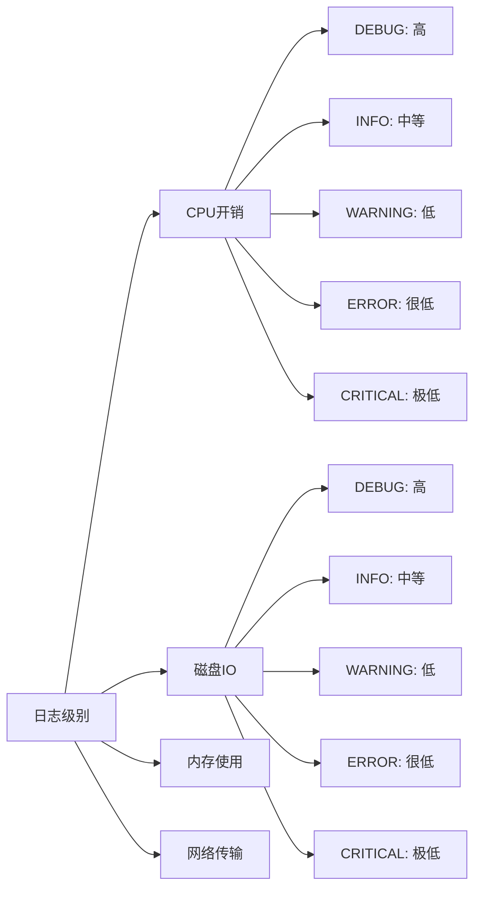

### 性能基准测试

| 日志级别 | CPU开销 | 磁盘IO | 内存使用 | 推荐场景 |
|----------|---------|--------|----------|----------|
| DEBUG | 15-20% | 高 | 中等 | 开发调试 |
| INFO | 5-10% | 中等 | 低 | 生产监控 |
| WARNING | 2-5% | 低 | 很低 | 生产环境 |
| ERROR | <2% | 很低 | 极低 | 稳定运行 |
| CRITICAL | <1% | 极低 | 极低 | 关键监控 |

### 优化建议

1. **生产环境**：使用INFO级别，避免DEBUG日志
2. **开发环境**：使用DEBUG级别，便于问题排查
3. **Docker环境**：平衡控制台和文件输出
4. **高并发场景**：考虑异步日志写入

**章节来源**
- [tradingagents/utils/logging_manager.py](file://tradingagents/utils/logging_manager.py#L195-L228)

## 大日志文件分割策略

### 轮转机制

系统使用Python标准库的`RotatingFileHandler`实现日志轮转。

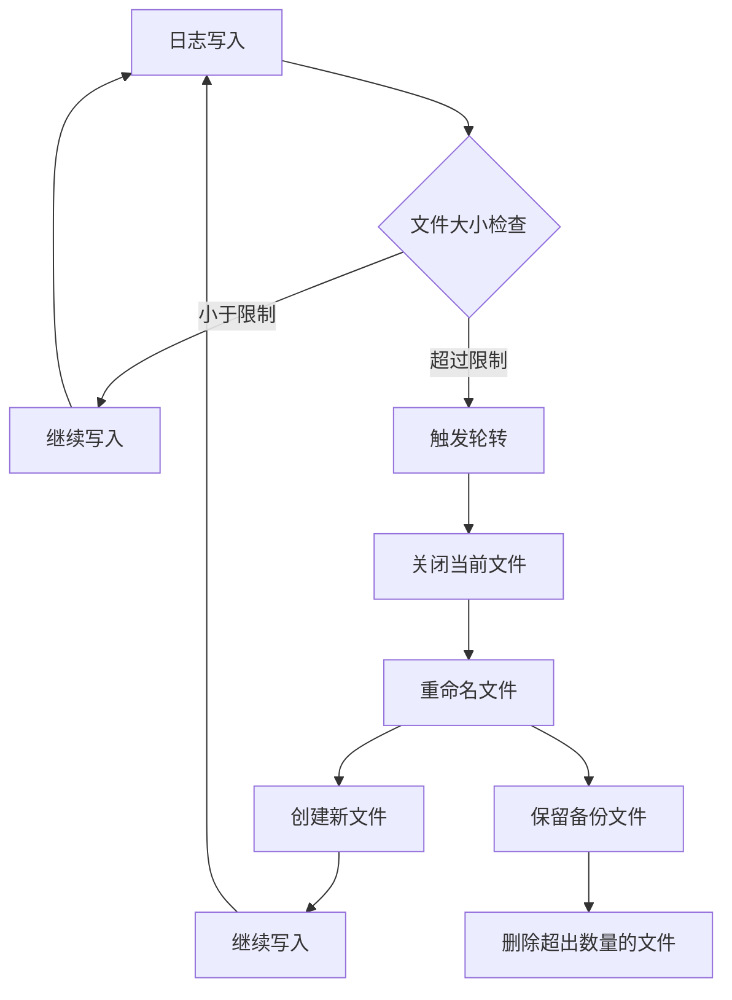

**图表来源**
- [tradingagents/utils/logging_manager.py](file://tradingagents/utils/logging_manager.py#L226-L260)

### 分割配置

#### 文件大小限制

| 环境 | 默认大小 | 最大大小 | 说明 |
|------|----------|----------|------|
| 开发环境 | 10MB | 50MB | 便于调试 |
| 生产环境 | 10MB | 100MB | 性能平衡 |
| Docker环境 | 100MB | 500MB | 容器存储优化 |

#### 备份文件策略

- **保留数量**：默认5个备份文件
- **命名规则**：`filename.log.1`, `filename.log.2`, ...
- **清理策略**：超出数量时删除最旧的文件

### 自动清理机制

```python
# 大小解析函数
def _parse_size(self, size_str: str) -> int:
    size_str = size_str.upper()
    if size_str.endswith('KB'):
        return int(size_str[:-2]) * 1024
    elif size_str.endswith('MB'):
        return int(size_str[:-2]) * 1024 * 1024
    elif size_str.endswith('GB'):
        return int(size_str[:-2]) * 1024 * 1024 * 1024
    else:
        return int(size_str)
```

**章节来源**
- [tradingagents/utils/logging_manager.py](file://tradingagents/utils/logging_manager.py#L380-L390)

### 存储优化建议

1. **定期归档**：将历史日志归档到冷存储
2. **压缩存储**：使用gzip压缩旧日志文件
3. **云存储**：将日志上传到云存储服务
4. **监控空间**：设置磁盘空间告警

## 故障排除指南

### 常见问题诊断

#### 问题1：日志文件未生成

**症状**：配置了文件处理器但找不到日志文件

**排查步骤**：
1. 检查日志目录是否存在
2. 验证目录写入权限
3. 确认处理器已启用
4. 检查日志级别设置

**解决方案**：
```bash
# 检查目录权限
ls -la logs/
chmod 755 logs/

# 手动创建目录
mkdir -p logs/
```

**章节来源**
- [scripts/test_docker_logging.py](file://scripts/test_docker_logging.py#L30-L60)

#### 问题2：Docker环境日志丢失

**症状**：Docker容器中没有日志输出

**排查步骤**：
1. 检查`DOCKER_CONTAINER`环境变量
2. 验证日志配置中的Docker设置
3. 确认容器挂载点

**解决方案**：
```yaml
# docker-compose.yml
environment:
  - DOCKER_CONTAINER=true
  - TRADINGAGENTS_LOG_DIR=/app/logs
```

**章节来源**
- [scripts/fix_docker_logging.py](file://scripts/fix_docker_logging.py#L115-L162)

#### 问题3：日志格式异常

**症状**：日志输出格式不正确或缺少信息

**排查步骤**：
1. 检查格式模板语法
2. 验证处理器配置
3. 确认模块导入顺序

**章节来源**
- [tradingagents/utils/logging_manager.py](file://tradingagents/utils/logging_manager.py#L42-L88)

### 调试工具

#### 日志测试脚本

系统提供了专门的测试脚本来验证日志配置：

```python
# 测试日志功能
def test_logging():
    """测试日志功能"""
    # 设置Docker环境变量
    os.environ['DOCKER_CONTAINER'] = 'true'
    os.environ['TRADINGAGENTS_LOG_DIR'] = '/app/logs'
    
    # 初始化日志
    init_logging()
    
    # 测试各种级别的日志
    logger.debug("DEBUG级别日志")
    logger.info("INFO级别日志")
    logger.warning("WARNING级别日志")
    logger.error("ERROR级别日志")
```

**章节来源**
- [scripts/test_docker_logging.py](file://scripts/test_docker_logging.py#L15-L60)

#### 配置修复工具

系统提供了自动修复工具来解决常见配置问题：

```bash
# 运行修复工具
python scripts/fix_docker_logging.py
```

**章节来源**
- [scripts/fix_docker_logging.py](file://scripts/fix_docker_logging.py#L10-L45)

## 最佳实践

### 配置最佳实践

#### 1. 环境分离配置

```toml
# 开发环境
[logging]
level = "DEBUG"

[logging.docker]
enabled = false

# 生产环境
[logging]
level = "INFO"

[logging.docker]
enabled = true
stdout_only = false
```

#### 2. 模块化日志器配置

```toml
[logging.loggers.tradingagents]
level = "INFO"

[logging.loggers.web]
level = "INFO"

[logging.loggers.dataflows]
level = "DEBUG"  # 数据流需要详细日志

[logging.loggers.llm_adapters]
level = "WARNING"  # LLM调用频繁，减少噪音
```

#### 3. 性能优化配置

```toml
[logging.performance]
enabled = true
log_slow_operations = true
slow_threshold_seconds = 5.0

[logging.handlers.file]
max_size = "10MB"
backup_count = 5
```

### 安全最佳实践

#### 1. 敏感信息保护

- 始终启用`mask_sensitive_data`
- 定期审查日志内容
- 使用适当的日志级别

#### 2. 访问控制

- 限制日志文件访问权限
- 使用专用日志用户
- 定期轮转和清理

#### 3. 监控告警

```toml
[logging.security]
log_api_calls = true
log_token_usage = true
mask_sensitive_data = true
```

### 运维最佳实践

#### 1. 日志收集策略

```bash
# 收集所有日志文件
find logs/ -name "*.log*" -exec cat {} \;

# 按时间过滤
grep "2024-01-15" logs/tradingagents.log;

# 按级别过滤
grep -i "error\|critical" logs/tradingagents.log;
```

#### 2. 性能监控

```bash
# 监控日志文件大小
du -sh logs/

# 监控磁盘使用
df -h logs/

# 监控日志写入频率
tail -f logs/tradingagents.log | wc -l
```

#### 3. 备份策略

```bash
# 创建日志备份
tar -czf logs_backup_$(date +%Y%m%d).tar.gz logs/

# 归档历史日志
mv logs/*_old_* logs/archive/
```

### 开发最佳实践

#### 1. 日志记录规范

```python
# 好的示例
logger.info(f"股票分析完成 - 股票: {stock_code}, 耗时: {duration:.2f}s")
logger.error(f"API调用失败 - URL: {url}, 错误: {error}")

# 避免的示例
logger.info("成功")  # 太模糊
logger.error("出错了")  # 缺少上下文
```

#### 2. 结构化日志

```python
# 使用额外字段
logger.info(
    "分析完成",
    extra={
        'stock_symbol': stock_code,
        'analysis_type': analysis_type,
        'duration': duration,
        'cost': cost
    }
)
```

#### 3. 异常处理

```python
try:
    # 业务逻辑
    pass
except Exception as e:
    logger.error(
        f"操作失败: {str(e)}",
        extra={'error_type': type(e).__name__},
        exc_info=True
    )
```

### 部署最佳实践

#### 1. Docker部署

```yaml
# docker-compose.yml
services:
  tradingagents:
    image: tradingagents:latest
    environment:
      - DOCKER_CONTAINER=true
      - TRADINGAGENTS_LOG_DIR=/app/logs
    volumes:
      - ./logs:/app/logs
```

#### 2. Kubernetes部署

```yaml
# pod.spec
spec:
  containers:
  - name: tradingagents
    env:
    - name: DOCKER_CONTAINER
      value: "true"
    volumeMounts:
    - name: logs
      mountPath: /app/logs
  volumes:
  - name: logs
    emptyDir: {}
```

#### 3. 监控集成

```yaml
# Prometheus配置
scrape_configs:
  - job_name: 'tradingagents'
    static_configs:
      - targets: ['localhost:8080']
    metrics_path: /metrics
    scrape_interval: 15s
```

通过遵循这些最佳实践，可以确保TradingAgents-CN的日志系统既高效又可靠，为系统的运维和开发提供强有力的支持。