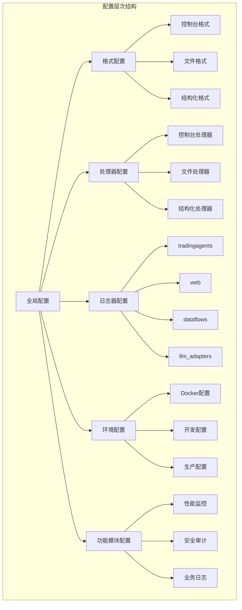
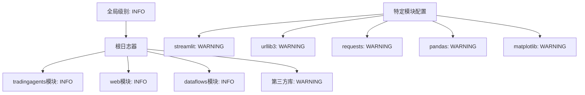
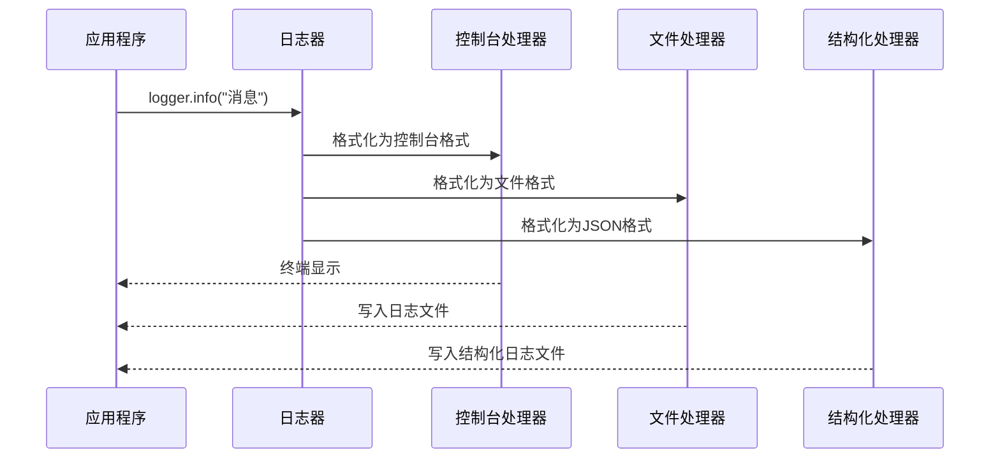
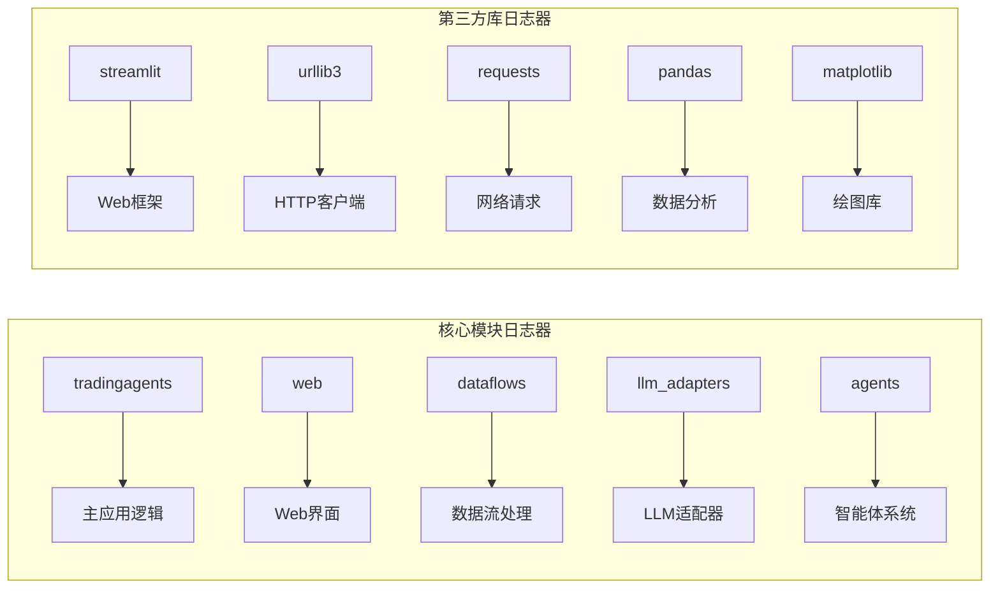
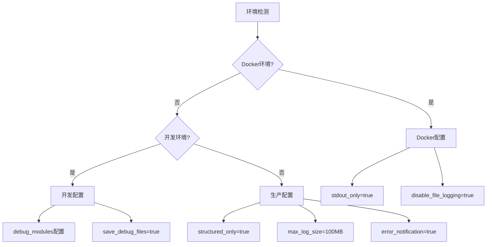
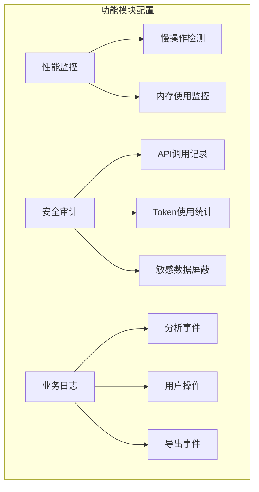

# TradingAgents-CN 日志配置结构详解

<cite>
**本文档中引用的文件**
- [config/logging.toml](file://config/logging.toml)
- [config/logging_docker.toml](file://config/logging_docker.toml)
- [tradingagents/utils/logging_manager.py](file://tradingagents/utils/logging_manager.py)
- [tradingagents/utils/logging_init.py](file://tradingagents/utils/logging_init.py)
- [cli/main.py](file://cli/main.py)
- [tradingagents/graph/trading_graph.py](file://tradingagents/graph/trading_graph.py)
- [tradingagents/dataflows/data_source_manager.py](file://tradingagents/dataflows/data_source_manager.py)
- [web/app.py](file://web/app.py)
- [examples/simple_analysis_demo.py](file://examples/simple_analysis_demo.py)
</cite>

## 目录
1. [概述](#概述)
2. [配置文件结构](#配置文件结构)
3. [全局日志级别配置](#全局日志级别配置)
4. [格式定义系统](#格式定义系统)
5. [处理器配置详解](#处理器配置详解)
6. [日志器层级设置](#日志器层级设置)
7. [环境特定配置](#环境特定配置)
8. [功能模块日志配置](#功能模块日志配置)
9. [高级功能配置](#高级功能配置)
10. [代码示例与最佳实践](#代码示例与最佳实践)
11. [故障排除指南](#故障排除指南)
12. [总结](#总结)

## 概述

TradingAgents-CN采用基于TOML的统一日志配置系统，提供了灵活而强大的日志管理功能。该系统支持多种输出格式、环境特定配置、模块化日志器管理和高级功能如性能监控、安全审计等。

### 核心特性

- **多格式支持**: 控制台、文件、结构化(JSON)日志输出
- **环境感知**: 开发、生产、Docker环境自动适配
- **模块化管理**: 针对不同功能模块的精细日志控制
- **高级功能**: 性能监控、安全审计、业务日志追踪
- **可扩展性**: 支持自定义配置和动态调整

## 配置文件结构

TradingAgents-CN的日志配置采用分层结构设计，主要包含以下核心部分：



**图表来源**
- [config/logging.toml](file://config/logging.toml#L1-L111)
- [config/logging_docker.toml](file://config/logging_docker.toml#L1-L100)

**章节来源**
- [config/logging.toml](file://config/logging.toml#L1-L111)
- [config/logging_docker.toml](file://config/logging_docker.toml#L1-L100)

## 全局日志级别配置

### 基础级别设置

全局日志级别是整个系统的默认日志输出标准，支持以下级别：

| 级别 | 数值 | 用途 | 推荐场景 |
|------|------|------|----------|
| DEBUG | 10 | 详细调试信息 | 开发阶段、问题排查 |
| INFO | 20 | 一般信息记录 | 正常运行状态 |
| WARNING | 30 | 警告信息 | 潜在问题、边界情况 |
| ERROR | 40 | 错误信息 | 异常处理、故障记录 |
| CRITICAL | 50 | 严重错误 | 系统级故障、不可恢复错误 |

### 级别继承机制



**图表来源**
- [config/logging.toml](file://config/logging.toml#L3-L4)
- [config/logging.toml](file://config/logging.toml#L48-L60)

**章节来源**
- [config/logging.toml](file://config/logging.toml#L3-L4)
- [tradingagents/utils/logging_manager.py](file://tradingagents/utils/logging_manager.py#L89-L120)

## 格式定义系统

### 控制台格式配置

控制台格式用于终端输出，提供人类可读的日志信息：

```toml
console = "%(asctime)s | %(name)-20s | %(levelname)-8s | %(message)s"
```

格式字段说明：
- `%(asctime)s`: 时间戳
- `%(name)-20s`: 日志器名称（左对齐，20字符宽度）
- `%(levelname)-8s`: 日志级别（左对齐，8字符宽度）
- `%(message)s`: 日志消息

### 文件格式配置

文件格式包含更多调试信息，便于后续分析：

```toml
file = "%(asctime)s | %(name)-20s | %(levelname)-8s | %(module)s:%(funcName)s:%(lineno)d | %(message)s"
```

额外字段：
- `%(module)s`: 模块名称
- `%(funcName)s`: 函数名称
- `%(lineno)d`: 行号

### 结构化格式配置

结构化格式使用JSON格式，便于机器解析和日志分析系统集成：

```toml
structured = "json"
```

结构化日志条目包含：
- 时间戳
- 日志级别
- 日志器名称
- 消息内容
- 模块信息
- 函数信息
- 行号
- 自定义字段（如会话ID、股票代码等）

**章节来源**
- [config/logging.toml](file://config/logging.toml#L7-L9)
- [tradingagents/utils/logging_manager.py](file://tradingagents/utils/logging_manager.py#L42-L88)

## 处理器配置详解

### 控制台处理器

控制台处理器负责向终端输出日志信息：

```toml
[logging.handlers.console]
enabled = true
colored = true
level = "INFO"
```

配置参数：
- `enabled`: 是否启用控制台输出
- `colored`: 是否启用彩色输出（仅在TTY环境中生效）
- `level`: 控制台输出的日志级别

### 文件处理器

文件处理器将日志写入文件，支持日志轮转：

```toml
[logging.handlers.file]
enabled = true
level = "DEBUG"
max_size = "10MB"
backup_count = 5
directory = "./logs"
```

关键参数：
- `max_size`: 单个日志文件最大大小
- `backup_count`: 保留的备份文件数量
- `directory`: 日志文件存储目录

### 结构化处理器

结构化处理器专门用于生成JSON格式的日志文件：

```toml
[logging.handlers.structured]
enabled = false
level = "INFO"
directory = "./logs"
```

特点：
- 默认关闭，生产环境可启用
- 使用专门的结构化格式化器
- 支持自定义字段扩展



**图表来源**
- [tradingagents/utils/logging_manager.py](file://tradingagents/utils/logging_manager.py#L195-L228)
- [tradingagents/utils/logging_manager.py](file://tradingagents/utils/logging_manager.py#L230-L260)

**章节来源**
- [config/logging.toml](file://config/logging.toml#L12-L47)
- [tradingagents/utils/logging_manager.py](file://tradingagents/utils/logging_manager.py#L195-L260)

## 日志器层级设置

### 核心模块日志器

TradingAgents-CN为不同功能模块设置了专门的日志器：



**图表来源**
- [config/logging.toml](file://config/logging.toml#L48-L60)

### 模块对应关系

| 日志器名称 | 对应模块 | 主要功能 | 推荐级别 |
|------------|----------|----------|----------|
| tradingagents | 主应用框架 | 核心业务逻辑、智能体协调 | INFO |
| web | Web界面 | 用户交互、路由处理 | INFO |
| dataflows | 数据流处理 | 数据获取、缓存管理 | INFO |
| llm_adapters | LLM适配器 | 大语言模型调用 | INFO |
| agents | 智能体系统 | 分析师、研究员、交易员 | INFO |
| streamlit | Streamlit框架 | Web界面渲染 | WARNING |
| urllib3 | HTTP客户端 | 网络请求日志 | WARNING |
| requests | 请求库 | HTTP请求处理 | WARNING |
| pandas | 数据分析 | 数据处理日志 | WARNING |
| matplotlib | 绘图库 | 图表生成日志 | WARNING |

### 层级继承规则

日志器遵循层级继承规则：
1. 子模块继承父模块的日志级别
2. 特定模块可以设置自己的日志级别
3. 全局级别作为最低限制

**章节来源**
- [config/logging.toml](file://config/logging.toml#L48-L60)
- [tradingagents/utils/logging_manager.py](file://tradingagents/utils/logging_manager.py#L320-L330)

## 环境特定配置

### Docker环境配置

Docker环境具有特殊的日志处理需求：

```toml
[logging.docker]
enabled = false
stdout_only = true
disable_file_logging = true
```

Docker环境特点：
- **stdout_only**: 只输出到标准输出，便于容器日志收集
- **disable_file_logging**: 禁用文件日志，避免容器内文件系统问题
- **自动检测**: 基于环境变量自动启用

### 开发环境配置

开发环境强调调试信息和详细日志：

```toml
[logging.development]
enabled = false
debug_modules = ["tradingagents.graph", "tradingagents.llm_adapters"]
save_debug_files = true
```

开发环境特性：
- `debug_modules`: 指定需要详细日志的模块
- `save_debug_files`: 保存调试文件以便分析

### 生产环境配置

生产环境注重性能和安全性：

```toml
[logging.production]
enabled = false
structured_only = true
error_notification = true
max_log_size = "100MB"
```

生产环境特点：
- `structured_only`: 只使用结构化日志
- `error_notification`: 启用错误通知
- 较大的日志文件限制



**图表来源**
- [config/logging.toml](file://config/logging.toml#L62-L85)
- [config/logging_docker.toml](file://config/logging_docker.toml#L75-L85)

**章节来源**
- [config/logging.toml](file://config/logging.toml#L62-L85)
- [config/logging_docker.toml](file://config/logging_docker.toml#L75-L85)

## 功能模块日志配置

### 性能监控配置

性能监控帮助识别系统瓶颈和优化机会：

```toml
[logging.performance]
enabled = true
log_slow_operations = true
slow_threshold_seconds = 5.0
log_memory_usage = false
```

性能监控功能：
- `log_slow_operations`: 记录耗时超过阈值的操作
- `slow_threshold_seconds`: 慢操作阈值（秒）
- `log_memory_usage`: 是否记录内存使用情况

### 安全审计配置

安全审计确保系统操作的可追溯性：

```toml
[logging.security]
enabled = true
log_api_calls = true
log_token_usage = true
mask_sensitive_data = true
```

安全审计内容：
- `log_api_calls`: 记录API调用
- `log_token_usage`: 记录Token使用量
- `mask_sensitive_data`: 屏蔽敏感数据

### 业务日志配置

业务日志记录关键业务事件：

```toml
[logging.business]
enabled = true
log_analysis_events = true
log_user_actions = true
log_export_events = true
```

业务日志事件：
- `log_analysis_events`: 分析事件记录
- `log_user_actions`: 用户操作记录
- `log_export_events`: 导出事件记录



**图表来源**
- [config/logging.toml](file://config/logging.toml#L87-L111)

**章节来源**
- [config/logging.toml](file://config/logging.toml#L87-L111)

## 高级功能配置

### 日志格式化器

系统提供了三种格式化器：

1. **ColoredFormatter**: 彩色控制台输出
2. **StructuredFormatter**: JSON结构化输出
3. **StandardFormatter**: 标准文本输出

### 自定义字段支持

结构化日志支持自定义字段扩展：

```python
# 示例：添加自定义字段
logger.info("消息", extra={
    'session_id': 'abc123',
    'stock_symbol': 'AAPL',
    'analysis_type': 'fundamental',
    'cost': 0.5,
    'tokens': 100
})
```

### 日志管理器功能

`TradingAgentsLogger`类提供了丰富的日志管理功能：

- **事件记录**: 分析开始/完成、模块执行等
- **Token统计**: LLM调用的Token使用情况
- **性能监控**: 操作耗时和资源使用
- **会话管理**: 基于会话ID的日志关联

**章节来源**
- [tradingagents/utils/logging_manager.py](file://tradingagents/utils/logging_manager.py#L20-L410)

## 代码示例与最佳实践

### 基础日志使用

```python
# 获取日志器
from tradingagents.utils.logging_manager import get_logger
logger = get_logger('my_module')

# 基本日志记录
logger.info("系统初始化完成")
logger.warning("配置参数缺失，使用默认值")
logger.error("数据库连接失败", exc_info=True)
```

### 会话日志管理

```python
# 会话专用日志
from tradingagents.utils.logging_init import get_session_logger
session_logger = get_session_logger('session-12345678', 'analysis')

session_logger.info("开始股票分析", extra={'stock_symbol': 'AAPL'})
```

### CLI模式日志配置

CLI模式下可以禁用控制台输出，保持界面整洁：

```python
# CLI专用日志配置
def setup_cli_logging():
    import logging
    from tradingagents.utils.logging_manager import get_logger_manager
    
    logger_manager = get_logger_manager()
    root_logger = logging.getLogger()
    
    # 移除控制台处理器
    for handler in root_logger.handlers[:]:
        if isinstance(handler, logging.StreamHandler):
            root_logger.removeHandler(handler)
```

### 模块化日志配置

```python
# 模块专用日志配置
def setup_module_logging(module_name):
    """设置特定模块的日志配置"""
    logger = get_logger(module_name)
    
    # 添加模块特定的处理器
    if module_name == 'dataflows':
        # 添加数据流专用处理器
        pass
    
    return logger
```

### 性能监控示例

```python
# 性能监控日志记录
logger_manager = get_logger_manager()

# 记录分析开始
logger_manager.log_analysis_start(
    logger, 
    stock_symbol='AAPL', 
    analysis_type='fundamental', 
    session_id='session-123'
)

# 记录分析完成
logger_manager.log_analysis_complete(
    logger, 
    stock_symbol='AAPL', 
    analysis_type='fundamental',
    session_id='session-123',
    duration=2.5,
    cost=0.3
)
```

**章节来源**
- [tradingagents/utils/logging_init.py](file://tradingagents/utils/logging_init.py#L1-L166)
- [cli/main.py](file://cli/main.py#L52-L88)
- [tradingagents/utils/logging_manager.py](file://tradingagents/utils/logging_manager.py#L330-L410)

## 故障排除指南

### 常见问题及解决方案

#### 1. KeyError: 'file' 错误

**问题描述**: Docker环境配置不完整导致的KeyError

**解决方案**: 使用完整的Docker配置文件

**正确配置**:
```toml
[logging.handlers.file]
enabled = true
level = "DEBUG"
max_size = "100MB"
backup_count = 5
directory = "/app/logs"
```

#### 2. 日志输出不一致

**问题描述**: 不同环境日志输出行为不一致

**解决方案**: 检查环境变量和配置文件

**检查清单**:
- 确认`DOCKER_CONTAINER`环境变量
- 验证配置文件路径
- 检查日志目录权限

#### 3. 性能问题

**问题描述**: 日志记录影响系统性能

**解决方案**: 调整日志级别和启用条件

**优化建议**:
- 生产环境使用结构化日志
- 降低DEBUG级别日志输出
- 启用异步日志处理

#### 4. 日志轮转问题

**问题描述**: 日志文件过大或清理不及时

**解决方案**: 调整轮转参数

**配置优化**:
```toml
max_size = "50MB"      # 减小单文件大小
backup_count = 10      # 增加备份数量
```

### 调试技巧

1. **环境变量调试**:
   ```bash
   export TRADINGAGENTS_LOG_LEVEL=DEBUG
   export TRADINGAGENTS_LOG_DIR=/tmp/logs
   ```

2. **配置验证**:
   ```python
   from tradingagents.utils.logging_manager import get_logger_manager
   manager = get_logger_manager()
   print(manager.config)
   ```

3. **日志测试**:
   ```python
   logger = get_logger('test')
   logger.debug("调试信息")
   logger.info("普通信息")
   logger.warning("警告信息")
   logger.error("错误信息")
   ```

**章节来源**
- [config/logging_docker.toml](file://config/logging_docker.toml#L1-L100)
- [tradingagents/utils/logging_manager.py](file://tradingagents/utils/logging_manager.py#L120-L150)

## 总结

TradingAgents-CN的日志配置系统是一个功能完整、设计精良的现代化日志解决方案。它通过以下特性实现了高效的日志管理：

### 核心优势

1. **统一配置**: 基于TOML的集中配置管理
2. **环境感知**: 自动适应不同运行环境
3. **模块化设计**: 针对不同功能模块的精细控制
4. **格式多样**: 支持多种输出格式满足不同需求
5. **功能丰富**: 包含性能监控、安全审计等高级功能

### 最佳实践建议

1. **开发阶段**: 启用详细日志和彩色输出
2. **生产环境**: 使用结构化日志和适当的日志级别
3. **Docker部署**: 使用专门的Docker配置文件
4. **性能监控**: 合理设置慢操作阈值
5. **安全考虑**: 启用安全审计并屏蔽敏感数据

### 扩展建议

1. **自定义格式化器**: 根据特定需求开发自定义格式化器
2. **远程日志**: 集成ELK或类似日志收集系统
3. **告警集成**: 与监控系统集成实现智能告警
4. **日志分析**: 建立专门的日志分析和可视化系统

通过合理配置和使用这些日志功能，开发者可以更好地理解和维护TradingAgents-CN系统，同时为用户提供更好的使用体验和系统可靠性保障。