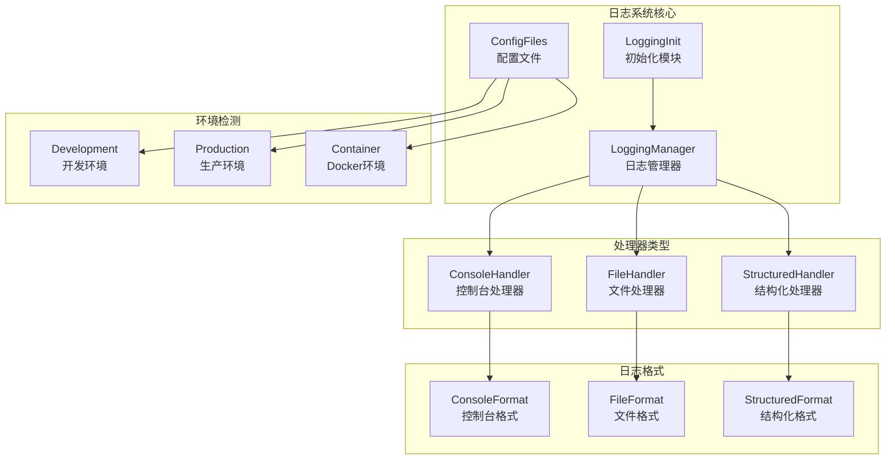
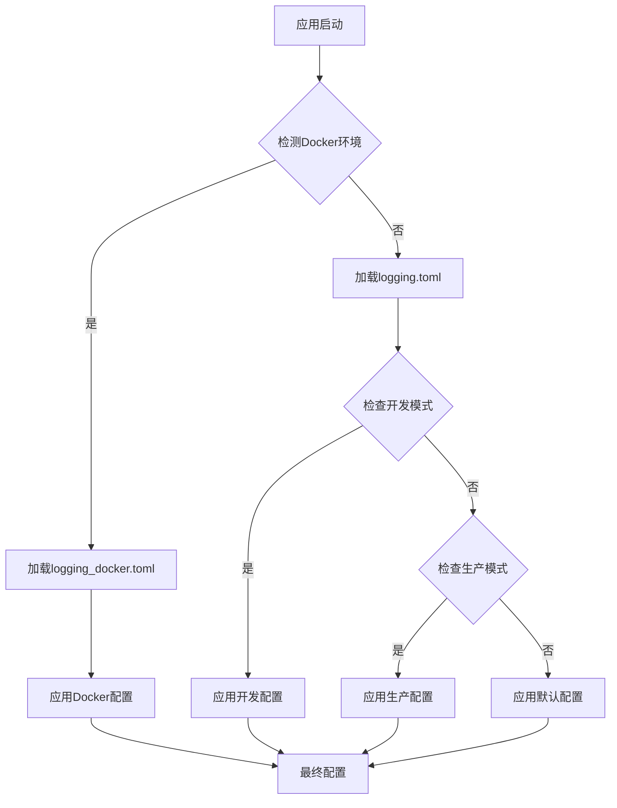
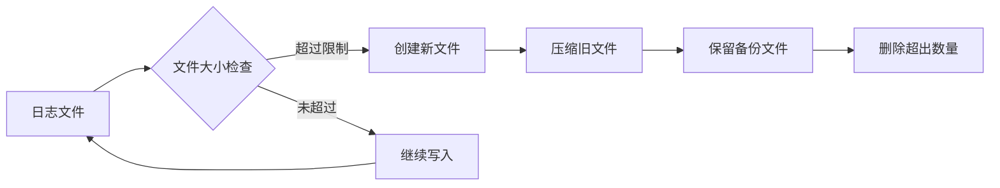

# 环境日志策略

<cite>
**本文档引用的文件**
- [config/logging.toml](file://config/logging.toml)
- [config/logging_docker.toml](file://config/logging_docker.toml)
- [tradingagents/utils/logging_manager.py](file://tradingagents/utils/logging_manager.py)
- [tradingagents/utils/logging_init.py](file://tradingagents/utils/logging_init.py)
- [scripts/fix_docker_logging.py](file://scripts/fix_docker_logging.py)
- [scripts/verify_docker_logs.py](file://scripts/verify_docker_logs.py)
- [scripts/fix_logging_config_error.py](file://scripts/fix_logging_config_error.py)
- [examples/simple_analysis_demo.py](file://examples/simple_analysis_demo.py)
</cite>

## 目录
1. [概述](#概述)
2. [日志系统架构](#日志系统架构)
3. [开发环境日志策略](#开发环境日志策略)
4. [生产环境日志策略](#生产环境日志策略)
5. [Docker环境日志策略](#docker环境日志策略)
6. [配置文件对比分析](#配置文件对比分析)
7. [日志处理机制](#日志处理机制)
8. [故障排除与最佳实践](#故障排除与最佳实践)
9. [总结](#总结)

## 概述

TradingAgents-CN项目采用统一的日志管理系统，支持开发、生产和Docker三种不同的环境配置。该系统通过灵活的配置文件和智能的环境检测机制，确保在不同部署环境下都能提供适当的日志记录能力，同时避免常见的KeyError等配置问题。

## 日志系统架构



**图表来源**
- [tradingagents/utils/logging_manager.py](file://tradingagents/utils/logging_manager.py#L1-L50)
- [tradingagents/utils/logging_init.py](file://tradingagents/utils/logging_init.py#L1-L30)

**章节来源**
- [tradingagents/utils/logging_manager.py](file://tradingagents/utils/logging_manager.py#L1-L100)
- [tradingagents/utils/logging_init.py](file://tradingagents/utils/logging_init.py#L1-L50)

## 开发环境日志策略

### 开发环境特性

开发环境专注于调试和问题诊断，提供了最详细的日志记录能力：

#### 调试日志配置
- **日志级别**: DEBUG级别，记录所有详细信息
- **格式**: 包含模块名、函数名和行号的完整堆栈跟踪
- **输出目标**: 同时输出到控制台和文件

#### 开发专用配置
```toml
[logging.development]
enabled = true
debug_modules = ["tradingagents.graph", "tradingagents.llm_adapters"]
save_debug_files = true
```

#### 调试模块选择
开发环境特别针对以下模块启用详细日志：
- `tradingagents.graph`: 图形处理和信号分析模块
- `tradingagents.llm_adapters`: LLM适配器模块

#### 文件日志保存
- **自动保存**: 启用调试文件保存功能
- **命名规则**: 使用会话ID和时间戳命名
- **存储位置**: 本地logs目录

### 开发环境优势
- **问题诊断**: 详细的堆栈跟踪帮助快速定位问题
- **性能分析**: 详细的模块执行时间和资源使用情况
- **调试便利**: 结构化的日志格式便于分析

**章节来源**
- [config/logging.toml](file://config/logging.toml#L80-L90)
- [tradingagents/utils/logging_manager.py](file://tradingagents/utils/logging_manager.py#L100-L150)

## 生产环境日志策略

### 生产环境特性

生产环境强调结构化日志和错误通知，确保系统的可观测性和可维护性：

#### 结构化日志配置
```toml
[logging.production]
enabled = true
structured_only = true
error_notification = true
max_log_size = "100MB"
```

#### 结构化日志格式
生产环境使用JSON格式的结构化日志，便于后续分析和处理：

```json
{
    "timestamp": "2024-01-15T10:30:45.123Z",
    "level": "INFO",
    "logger": "tradingagents.analysis",
    "message": "分析完成",
    "module": "fundamentals_analyst",
    "function": "analyze_stock",
    "line": 156
}
```

#### 错误通知机制
- **自动检测**: 系统自动检测并记录错误
- **告警集成**: 支持与外部监控系统集成
- **紧急通知**: 关键错误触发即时通知

#### 性能监控
- **慢操作记录**: 超过5秒的操作会被记录为慢操作
- **内存使用**: 可选的内存使用情况监控
- **API调用**: 记录所有API调用和响应时间

### 生产环境优势
- **可分析性**: 结构化格式便于自动化分析
- **可靠性**: 错误通知确保问题及时发现
- **性能**: 优化的日志级别减少系统开销

**章节来源**
- [config/logging.toml](file://config/logging.toml#L85-L110)
- [tradingagents/utils/logging_manager.py](file://tradingagents/utils/logging_manager.py#L300-L350)

## Docker环境日志策略

### Docker环境特性

Docker环境采用标准输出与文件日志协同的策略，解决容器化部署中的日志完整性问题：

#### 环境检测机制
```python
# 自动检测Docker环境
is_docker = (
    os.getenv('DOCKER_CONTAINER') == 'true' or
    logging_config.get('docker', {}).get('enabled', False)
)
```

#### 协同日志策略
```toml
[logging.docker]
enabled = true
stdout_only = false
disable_file_logging = false
```

#### 标准输出与文件协同
- **标准输出**: 所有日志同时输出到stdout，便于容器编排工具收集
- **文件日志**: 同时写入容器内的日志文件，防止日志丢失
- **目录映射**: `/app/logs` 目录映射到宿主机，确保日志持久化

### Docker环境修复配置

基于logging_docker.toml的修复配置解决了KeyError等常见问题：

#### 关键修复点
1. **格式配置完整性**: 确保所有格式配置项都存在
2. **处理器配置**: 正确配置文件处理器和结构化处理器
3. **环境变量**: 自动检测DOCKER_CONTAINER环境变量

#### 修复后的配置结构
```toml
[logging.format]
console = "%(asctime)s | %(levelname)-8s | %(name)s | %(message)s"
file = "%(asctime)s | %(name)-20s | %(levelname)-8s | %(module)s:%(funcName)s:%(lineno)d | %(message)s"
structured = "json"

[logging.handlers.file]
enabled = true
level = "DEBUG"
max_size = "100MB"
backup_count = 5
directory = "/app/logs"
```

### Docker环境优势
- **日志完整性**: 标准输出确保日志不会丢失
- **持久化存储**: 文件日志提供持久化存储
- **容器友好**: 符合容器化最佳实践

**章节来源**
- [config/logging_docker.toml](file://config/logging_docker.toml#L1-L100)
- [scripts/fix_docker_logging.py](file://scripts/fix_docker_logging.py#L1-L50)
- [scripts/verify_docker_logs.py](file://scripts/verify_docker_logs.py#L1-L100)

## 配置文件对比分析

### 开发环境 vs 生产环境

| 配置项 | 开发环境 | 生产环境 | Docker环境 |
|--------|----------|----------|------------|
| 日志级别 | DEBUG | INFO | INFO |
| 控制台输出 | 彩色格式 | 标准格式 | 标准格式 |
| 文件日志 | 启用 | 可选 | 启用 |
| 结构化日志 | 禁用 | 启用 | 启用 |
| 错误通知 | 禁用 | 启用 | 启用 |
| 日志轮转 | 10MB | 100MB | 100MB |
| 调试模块 | 特定模块 | 全部模块 | 全部模块 |

### 配置文件差异

#### logging.toml (通用配置)
- **Docker配置**: `stdout_only = true`, `disable_file_logging = true`
- **开发配置**: `enabled = false`, `save_debug_files = true`
- **生产配置**: `enabled = false`, `structured_only = true`

#### logging_docker.toml (Docker专用)
- **Docker配置**: `stdout_only = false`, `disable_file_logging = false`
- **格式配置**: 完整的格式定义，解决KeyError问题
- **文件配置**: 增强的文件处理器配置

### 配置优先级



**图表来源**
- [tradingagents/utils/logging_manager.py](file://tradingagents/utils/logging_manager.py#L150-L200)

**章节来源**
- [config/logging.toml](file://config/logging.toml#L1-L111)
- [config/logging_docker.toml](file://config/logging_docker.toml#L1-L100)

## 日志处理机制

### 处理器链

```mermaid
sequenceDiagram
participant App as 应用程序
participant LM as LoggingManager
participant CH as ConsoleHandler
participant FH as FileHandler
participant SH as StructuredHandler
App->>LM : init_logging()
LM->>LM : 检测环境
LM->>CH : 添加控制台处理器
LM->>FH : 添加文件处理器
LM->>SH : 添加结构化处理器
App->>LM : logger.info(message)
LM->>CH : 输出到控制台
LM->>FH : 写入文件
LM->>SH : 写入结构化日志
Note over CH,FH,SH : 所有处理器独立工作
```

**图表来源**
- [tradingagents/utils/logging_manager.py](file://tradingagents/utils/logging_manager.py#L180-L220)

### 格式化器类型

#### 控制台格式化器
- **彩色输出**: 支持ANSI颜色代码
- **简洁格式**: 移除冗余信息，提高可读性
- **终端检测**: 自动检测TTY环境

#### 文件格式化器
- **完整信息**: 包含模块名、函数名、行号
- **时间戳**: 精确到毫秒的时间戳
- **堆栈跟踪**: 完整的调用栈信息

#### 结构化格式化器
- **JSON格式**: 标准化的结构化数据
- **元数据**: 自动添加分析类型、股票代码等
- **扩展字段**: 支持动态添加业务相关字段

### 日志轮转机制



**图表来源**
- [tradingagents/utils/logging_manager.py](file://tradingagents/utils/logging_manager.py#L220-L260)

**章节来源**
- [tradingagents/utils/logging_manager.py](file://tradingagents/utils/logging_manager.py#L20-L100)
- [tradingagents/utils/logging_manager.py](file://tradingagents/utils/logging_manager.py#L260-L320)

## 故障排除与最佳实践

### 常见问题与解决方案

#### KeyError: 'file' 错误

**问题描述**: 配置文件中缺少必要的file格式配置项

**解决方案**: 使用修复脚本或手动修改配置

```bash
# 使用修复脚本
python scripts/fix_logging_config_error.py

# 或手动修复配置文件
```

**修复内容**:
- 添加完整的格式配置项
- 确保所有处理器都有正确的配置
- 验证配置文件语法

#### Docker日志丢失问题

**问题描述**: 容器停止后日志文件丢失

**解决方案**: 使用logging_docker.toml配置

**最佳实践**:
- 使用目录映射将日志目录挂载到宿主机
- 配置适当的日志轮转策略
- 监控磁盘空间使用情况

#### 性能影响优化

**问题描述**: 高频率日志记录影响系统性能

**解决方案**:
- 调整日志级别，避免DEBUG级别在生产环境
- 使用异步日志处理器
- 限制日志文件大小和保留数量

### 日志监控最佳实践

#### 开发阶段
- **实时监控**: 使用tail命令实时查看日志
- **过滤调试**: 使用grep过滤特定模块日志
- **性能分析**: 监控日志文件大小增长

#### 生产阶段
- **集中收集**: 使用ELK Stack或类似工具收集日志
- **告警配置**: 设置基于日志级别的告警
- **容量规划**: 监控日志存储空间使用

#### Docker部署
- **容器日志**: 使用docker logs命令查看容器日志
- **日志驱动**: 配置合适的日志驱动程序
- **健康检查**: 监控日志写入状态

### 日志安全考虑

#### 敏感信息保护
- **数据脱敏**: 自动屏蔽API密钥和个人信息
- **访问控制**: 限制日志文件的访问权限
- **传输加密**: 确保日志传输过程的安全性

#### 合规性要求
- **审计追踪**: 保留足够的审计信息
- **保留期限**: 遵循相关法规的保留要求
- **不可篡改**: 确保日志的完整性和不可篡改性

**章节来源**
- [scripts/fix_logging_config_error.py](file://scripts/fix_logging_config_error.py#L1-L72)
- [scripts/verify_docker_logs.py](file://scripts/verify_docker_logs.py#L200-L242)

## 总结

TradingAgents-CN的日志系统通过精心设计的环境配置策略，实现了开发、生产和Docker环境下的差异化日志需求：

### 核心优势

1. **环境感知**: 自动检测部署环境并应用相应配置
2. **灵活性**: 支持多种日志格式和输出目标
3. **可靠性**: 多层日志保护确保信息不丢失
4. **可维护性**: 结构化日志便于后续分析和处理

### 配置建议

- **开发环境**: 启用详细日志和调试文件保存
- **生产环境**: 使用结构化日志和错误通知机制
- **Docker环境**: 配置标准输出与文件日志协同策略

### 最佳实践

- 定期检查日志配置的有效性
- 监控日志文件大小和存储空间
- 建立完善的日志监控和告警机制
- 遵循安全和合规性要求

通过合理配置和使用这些日志策略，可以显著提升系统的可观测性、可维护性和安全性，为TradingAgents-CN项目的稳定运行提供有力保障。