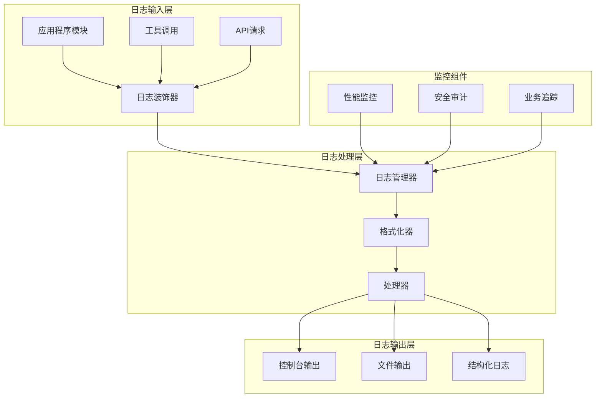
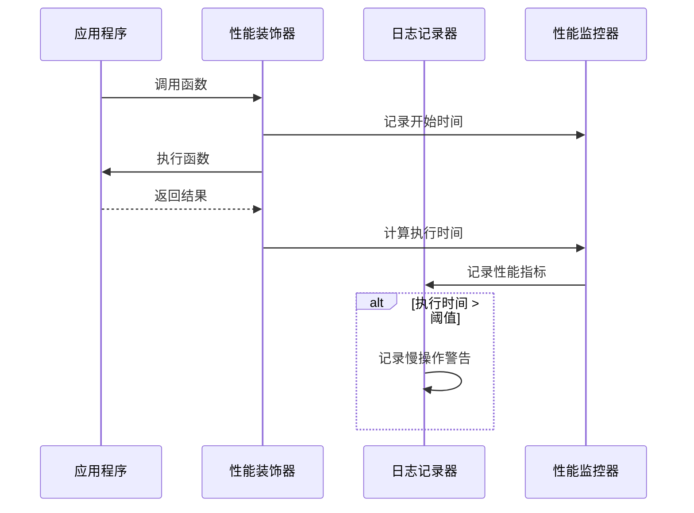
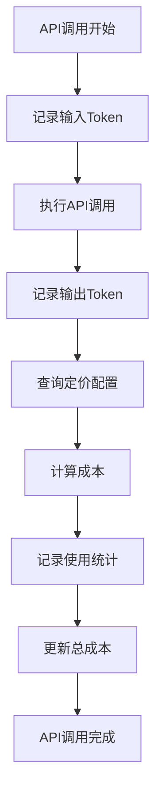
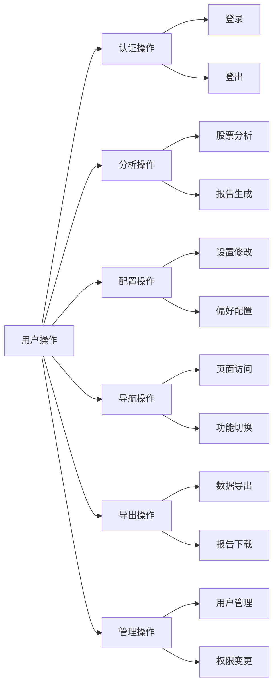
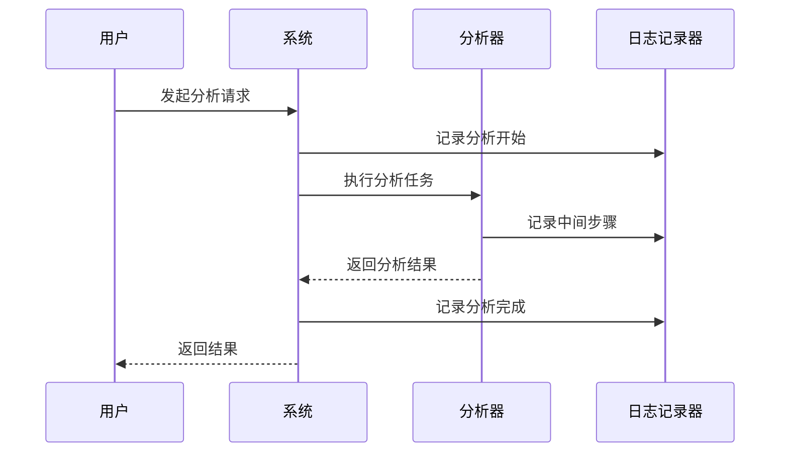
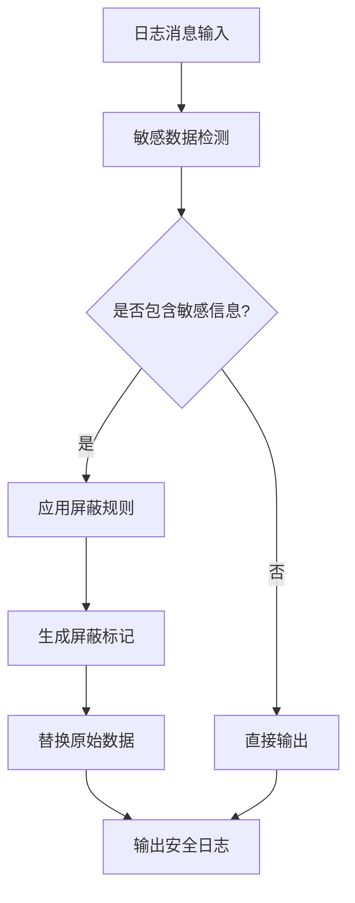
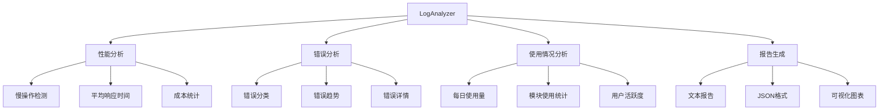
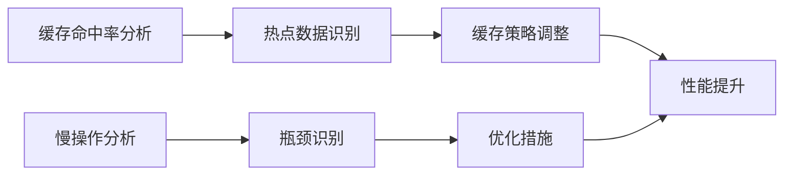
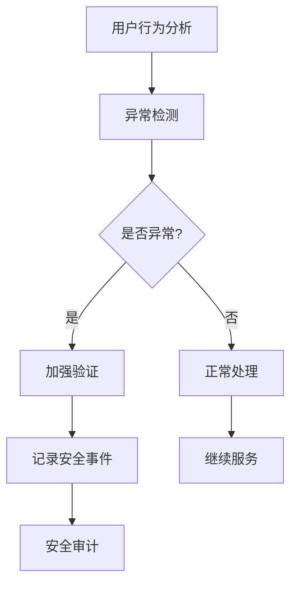

# 监控与审计日志

<cite>
**本文档中引用的文件**
- [config/logging.toml](file://config/logging.toml)
- [config/logging_docker.toml](file://config/logging_docker.toml)
- [tradingagents/utils/logging_init.py](file://tradingagents/utils/logging_init.py)
- [tradingagents/utils/logging_manager.py](file://tradingagents/utils/logging_manager.py)
- [scripts/log_analyzer.py](file://scripts/log_analyzer.py)
- [examples/token_tracking_demo.py](file://examples/token_tracking_demo.py)
- [web/utils/user_activity_logger.py](file://web/utils/user_activity_logger.py)
- [tradingagents/utils/tool_logging.py](file://tradingagents/utils/tool_logging.py)
- [tradingagents/config/config_manager.py](file://tradingagents/config/config_manager.py)
- [scripts/test_enhanced_logging.py](file://scripts/test_enhanced_logging.py)
- [reports/duplicate_logger_fix_report.md](file://reports/duplicate_logger_fix_report.md)
</cite>

## 目录
1. [概述](#概述)
2. [日志系统架构](#日志系统架构)
3. [性能监控日志](#性能监控日志)
4. [安全审计日志](#安全审计日志)
5. [业务行为日志](#业务行为日志)
6. [敏感数据屏蔽机制](#敏感数据屏蔽机制)
7. [日志分析工具](#日志分析工具)
8. [最佳实践指南](#最佳实践指南)
9. [故障排查案例](#故障排查案例)
10. [系统优化应用](#系统优化应用)

## 概述

TradingAgents-CN采用统一的日志管理系统，提供全面的监控与审计功能。该系统支持三种主要类型的日志记录：性能监控日志、安全审计日志和业务行为日志，同时具备完善的敏感数据保护机制。

### 核心特性

- **多层次日志分级**：支持DEBUG、INFO、WARNING、ERROR、CRITICAL五个级别
- **多种输出格式**：控制台、文件、结构化JSON格式
- **环境适配**：开发、测试、生产环境差异化配置
- **实时监控**：慢操作检测、内存使用监控
- **安全保护**：API调用追踪、Token用量记录、敏感数据屏蔽
- **业务洞察**：用户操作、分析事件、导出行为追踪

## 日志系统架构



**图表来源**
- [tradingagents/utils/logging_manager.py](file://tradingagents/utils/logging_manager.py#L1-L50)
- [tradingagents/utils/logging_init.py](file://tradingagents/utils/logging_init.py#L1-L30)

### 架构设计原则

1. **统一入口**：所有模块通过统一的日志接口进行记录
2. **灵活配置**：支持运行时动态调整日志级别和输出格式
3. **高性能**：异步处理和缓冲机制确保不影响业务性能
4. **可扩展性**：模块化设计便于添加新的监控维度

**章节来源**
- [tradingagents/utils/logging_manager.py](file://tradingagents/utils/logging_manager.py#L50-L150)

## 性能监控日志

### 慢操作记录

系统能够自动识别和记录执行时间超过阈值的操作，帮助开发者定位性能瓶颈。

#### 配置参数

| 参数 | 默认值 | 描述 |
|------|--------|------|
| `log_slow_operations` | `true` | 是否记录慢操作 |
| `slow_threshold_seconds` | `5.0` | 慢操作阈值（秒） |
| `log_memory_usage` | `false` | 是否记录内存使用 |

#### 实现机制



**图表来源**
- [tradingagents/utils/tool_logging.py](file://tradingagents/utils/tool_logging.py#L300-L400)

### 内存使用监控

虽然默认不启用内存监控，但系统提供了相应的基础设施来收集内存使用数据。

#### 监控指标

- **内存占用率**：当前进程内存使用百分比
- **内存峰值**：历史最高内存使用量
- **内存泄漏检测**：持续增长的内存使用模式

**章节来源**
- [config/logging.toml](file://config/logging.toml#L85-L95)

## 安全审计日志

### API调用追踪

系统全面记录所有外部API调用，包括请求参数、响应时间和错误信息。

#### 记录内容

| 字段 | 类型 | 描述 |
|------|------|------|
| `provider` | String | API提供商名称 |
| `endpoint` | String | API端点路径 |
| `request_time` | DateTime | 请求发起时间 |
| `response_time` | Float | 响应时间（秒） |
| `status_code` | Integer | HTTP状态码 |
| `error_message` | String | 错误信息（如有） |

### Token用量记录

精确跟踪每个API调用的Token使用量和成本。

#### 成本计算



**图表来源**
- [examples/token_tracking_demo.py](file://examples/token_tracking_demo.py#L100-L150)

#### Token跟踪功能

- **自动记录**：无需手动干预，自动跟踪所有LLM调用
- **成本估算**：实时计算API使用成本
- **阈值警告**：超出设定阈值时发出警告
- **历史统计**：提供详细的使用历史和统计报告

**章节来源**
- [examples/token_tracking_demo.py](file://examples/token_tracking_demo.py#L50-L100)

### 敏感数据保护

#### 屏蔽机制实现

系统采用多层次的数据屏蔽策略：

1. **自动识别**：识别潜在的敏感信息
2. **智能替换**：使用占位符替代敏感数据
3. **可配置规则**：支持自定义屏蔽规则

#### 屏蔽规则表

| 敏感类型 | 屏蔽方式 | 示例 |
|----------|----------|------|
| API密钥 | 截断显示 | `sk-***-abc123` |
| 用户密码 | 完全隐藏 | `******` |
| 邮箱地址 | 部分隐藏 | `u***@domain.com` |
| 手机号码 | 部分隐藏 | `138****5678` |
| 身份证号 | 部分隐藏 | `110101****1234` |

**章节来源**
- [config/logging.toml](file://config/logging.toml#L88-L90)

## 业务行为日志

### 用户操作记录

系统详细记录用户的各项操作行为，为业务分析和合规审计提供依据。

#### 操作类型分类



**图表来源**
- [web/utils/user_activity_logger.py](file://web/utils/user_activity_logger.py#L50-L100)

#### 记录字段详解

| 字段 | 描述 | 示例值 |
|------|------|--------|
| `timestamp` | 操作时间戳 | `2024-01-15T10:30:45.123Z` |
| `username` | 用户名 | `admin` |
| `action_type` | 操作类型 | `analysis` |
| `action_name` | 具体操作 | `stock_analysis` |
| `details` | 操作详情 | `{stock_code: "000001", type: "fundamental"}` |
| `duration_ms` | 操作耗时 | `1500` |
| `success` | 是否成功 | `true` |
| `session_id` | 会话标识 | `session_123456789` |

### 分析事件追踪

系统记录所有分析相关的事件，包括分析开始、完成和异常情况。

#### 分析流程监控



**图表来源**
- [tradingagents/utils/tool_logging.py](file://tradingagents/utils/tool_logging.py#L200-L300)

### 导出行为监控

记录所有数据导出操作，包括导出类型、数据量和成功率。

#### 导出类型

- **CSV导出**：表格数据导出
- **PDF导出**：报告文档导出  
- **JSON导出**：结构化数据导出
- **图片导出**：图表和可视化导出

**章节来源**
- [web/utils/user_activity_logger.py](file://web/utils/user_activity_logger.py#L200-L300)

## 敏感数据屏蔽机制

### 实现原理

系统采用基于正则表达式的智能数据识别和屏蔽算法。

#### 屏蔽流程



**图表来源**
- [tradingagents/utils/logging_manager.py](file://tradingagents/utils/logging_manager.py#L20-L50)

#### 配置选项

```toml
[logging.security]
mask_sensitive_data = true
```

### 屏蔽策略

1. **静态屏蔽**：对已知格式的敏感数据进行固定替换
2. **动态屏蔽**：根据上下文智能识别和屏蔽
3. **可配置屏蔽**：支持自定义屏蔽规则和模式

**章节来源**
- [config/logging.toml](file://config/logging.toml#L88-L90)

## 日志分析工具

### LogAnalyzer功能

系统提供专门的日志分析工具，支持对日志文件进行全面的统计和分析。

#### 分析功能模块



**图表来源**
- [scripts/log_analyzer.py](file://scripts/log_analyzer.py#L50-L100)

#### 分析指标

| 指标类别 | 具体指标 | 描述 |
|----------|----------|------|
| 性能指标 | 慢操作数量 | 执行时间超过阈值的操作 |
| 性能指标 | 平均响应时间 | 各模块的平均处理时间 |
| 性能指标 | 总成本 | API调用的累计成本 |
| 错误指标 | 错误总数 | 各类错误的累计数量 |
| 错误指标 | 错误分类 | 按类型分类的错误分布 |
| 使用指标 | 活跃模块 | 使用最频繁的模块 |
| 使用指标 | 用户统计 | 用户活跃度和使用模式 |

### 实际应用案例

#### 案例1：性能瓶颈识别

通过分析慢操作日志，发现某个数据源API响应时间异常。

**分析步骤**：
1. 使用LogAnalyzer扫描日志文件
2. 识别响应时间超过10秒的操作
3. 分析相关模块的调用链
4. 定位具体的性能瓶颈

#### 案例2：成本优化建议

分析Token使用统计，发现某个模型的成本过高。

**分析步骤**：
1. 统计各提供商的Token使用量
2. 计算各模型的成本效率
3. 识别高成本使用的场景
4. 提出优化建议

**章节来源**
- [scripts/log_analyzer.py](file://scripts/log_analyzer.py#L100-L200)

## 最佳实践指南

### 日志配置最佳实践

#### 开发环境配置

```toml
[logging]
level = "DEBUG"

[logging.handlers.console]
colored = true

[logging.performance]
log_slow_operations = true
slow_threshold_seconds = 2.0

[logging.security]
mask_sensitive_data = true
```

#### 生产环境配置

```toml
[logging]
level = "INFO"

[logging.handlers.file]
max_size = "100MB"
backup_count = 10

[logging.performance]
log_slow_operations = true
slow_threshold_seconds = 5.0

[logging.security]
log_api_calls = true
log_token_usage = true
mask_sensitive_data = true

[logging.business]
log_analysis_events = true
log_user_actions = true
log_export_events = true
```

### 日志记录最佳实践

#### 1. 合理的日志级别使用

| 级别 | 使用场景 | 示例 |
|------|----------|------|
| DEBUG | 详细调试信息 | 变量值、函数参数 |
| INFO | 一般信息记录 | 操作开始、完成 |
| WARNING | 警告信息 | 配置缺失、降级操作 |
| ERROR | 错误信息 | 异常捕获、失败操作 |
| CRITICAL | 严重错误 | 系统崩溃、数据丢失 |

#### 2. 性能监控最佳实践

```python
# 推荐的性能监控装饰器使用
@log_analysis_module("fundamentals_analyst")
def analyze_fundamentals(self, stock_symbol):
    # 分析逻辑
    pass
```

#### 3. 安全审计最佳实践

```python
# 敏感操作的安全记录
def secure_api_call(self, endpoint, data):
    logger.info(f"调用安全API: {endpoint}", 
                extra={'sensitive': True})
```

### 日志维护最佳实践

#### 1. 日志轮转策略

- **文件大小限制**：单个日志文件不超过100MB
- **备份数量**：保留最多10个历史日志文件
- **压缩存储**：自动压缩旧日志文件

#### 2. 日志清理策略

- **按时间清理**：保留最近90天的日志
- **按大小清理**：磁盘空间不足时优先删除旧日志
- **重要日志保留**：错误和安全相关日志永久保存

#### 3. 监控告警设置

- **错误率告警**：错误率超过5%时触发
- **性能告警**：平均响应时间超过阈值时触发
- **容量告警**：磁盘空间不足时触发

**章节来源**
- [config/logging.toml](file://config/logging.toml#L15-L50)

## 故障排查案例

### 案例1：API调用超时问题

#### 问题描述
用户反馈某些股票分析请求长时间无响应。

#### 排查步骤

1. **启用详细日志**：
   ```bash
   export TRADINGAGENTS_LOG_LEVEL=DEBUG
   ```

2. **重现问题**：
   ```python
   # 使用增强日志测试脚本
   python scripts/test_enhanced_logging.py
   ```

3. **分析日志**：
   ```bash
   python scripts/log_analyzer.py ./logs/tradingagents.log --output report.md
   ```

4. **定位问题**：
   - 发现Tushare API响应时间超过30秒
   - 确认是网络连接问题而非代码问题

#### 解决方案
- 增加API超时时间设置
- 添加备用数据源
- 实现请求重试机制

### 案例2：Token成本异常

#### 问题描述
系统显示Token使用成本异常高。

#### 排查步骤

1. **检查Token跟踪配置**：
   ```python
   # 验证配置文件
   from tradingagents.config.config_manager import config_manager
   settings = config_manager.load_settings()
   print(f"成本跟踪: {settings.get('enable_cost_tracking', True)}")
   ```

2. **分析使用统计**：
   ```python
   # 查看详细统计
   stats = config_manager.get_usage_statistics(30)
   print(f"总成本: ¥{stats['total_cost']:.4f}")
   ```

3. **识别异常模式**：
   - 发现某个会话的Token使用量异常高
   - 分析发现是批量操作导致的

#### 解决方案
- 优化批量处理逻辑
- 实现Token使用限制
- 添加成本预警机制

### 案例3：用户权限问题

#### 问题描述
用户报告无法访问某些功能。

#### 排查步骤

1. **检查用户活动日志**：
   ```python
   from web.utils.user_activity_logger import user_activity_logger
   
   activities = user_activity_logger.get_user_activities(
       username="problematic_user",
       action_type="auth"
   )
   ```

2. **分析权限变更**：
   - 检查用户角色变更历史
   - 验证权限配置的正确性
   - 确认权限继承关系

#### 解决方案
- 修复权限配置错误
- 更新用户角色分配
- 实现权限变更审计

**章节来源**
- [scripts/test_enhanced_logging.py](file://scripts/test_enhanced_logging.py#L50-L100)

## 系统优化应用

### 性能优化

#### 1. 缓存策略优化

通过分析日志中的缓存命中率，优化缓存策略：



**图表来源**
- [scripts/log_analyzer.py](file://scripts/log_analyzer.py#L150-L200)

#### 2. 资源使用优化

- **内存优化**：通过内存使用监控识别内存泄漏
- **CPU优化**：分析CPU密集型操作的分布
- **网络优化**：优化API调用频率和超时设置

### 成本优化

#### Token使用优化

1. **模型选择优化**：
   - 根据任务复杂度选择合适的模型
   - 实现模型自动切换机制
   - 建立成本效益评估体系

2. **调用策略优化**：
   - 实现智能缓存机制
   - 优化批量处理逻辑
   - 添加请求合并功能

#### API成本控制

- **成本阈值设置**：为不同模块设置成本上限
- **自动降级机制**：超出成本阈值时自动切换到低成本方案
- **使用统计分析**：定期分析使用模式，优化资源配置

### 安全加固

#### 1. 访问控制优化

通过用户行为分析，加强安全控制：



**图表来源**
- [web/utils/user_activity_logger.py](file://web/utils/user_activity_logger.py#L350-L400)

#### 2. 敏感操作保护

- **双因素认证**：对高风险操作实施二次验证
- **操作审计**：记录所有敏感操作的详细信息
- **实时监控**：建立异常操作的实时告警机制

### 业务优化

#### 1. 用户体验优化

通过分析用户操作日志，改善用户体验：

- **功能使用统计**：识别用户最常用的功能
- **操作路径分析**：优化用户操作流程
- **错误预防**：通过日志分析预测和预防常见错误

#### 2. 业务决策支持

- **趋势分析**：基于历史数据预测业务趋势
- **用户分群**：根据使用模式进行用户分群
- **价值评估**：评估不同功能的价值贡献

**章节来源**
- [scripts/log_analyzer.py](file://scripts/log_analyzer.py#L300-L372)

## 总结

TradingAgents-CN的监控与审计日志系统提供了全面的可观测性解决方案，涵盖了性能监控、安全审计和业务洞察三大核心领域。通过合理的配置和使用，该系统能够：

1. **提升系统稳定性**：及时发现和解决性能问题
2. **保障系统安全**：全面记录和监控安全相关事件
3. **优化业务运营**：基于数据分析驱动业务决策
4. **降低运维成本**：自动化监控和故障排查

随着系统的不断发展和完善，建议持续关注以下方面：

- **日志质量提升**：不断优化日志内容和格式
- **分析能力增强**：开发更智能的日志分析工具
- **集成度提高**：与其他监控系统的深度集成
- **自动化程度**：提升自动发现问题和解决问题的能力

通过充分发挥日志系统的潜力，可以构建更加稳定、安全、高效的交易代理系统。