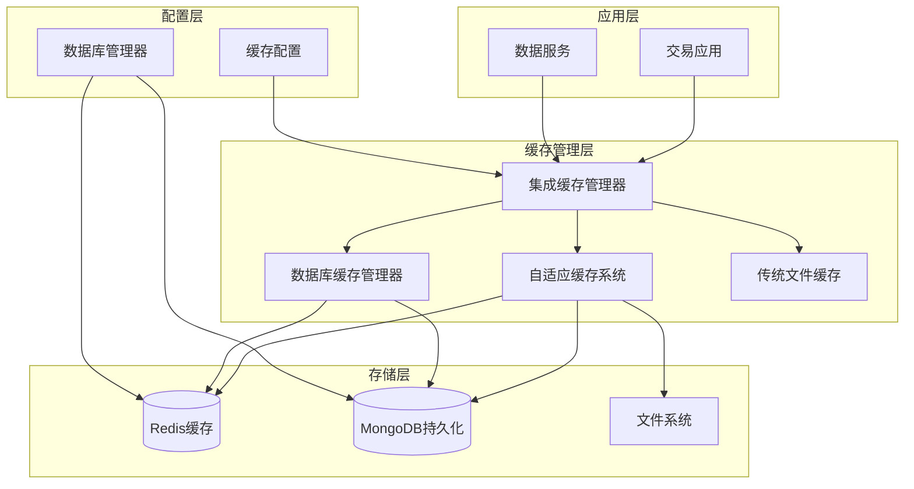
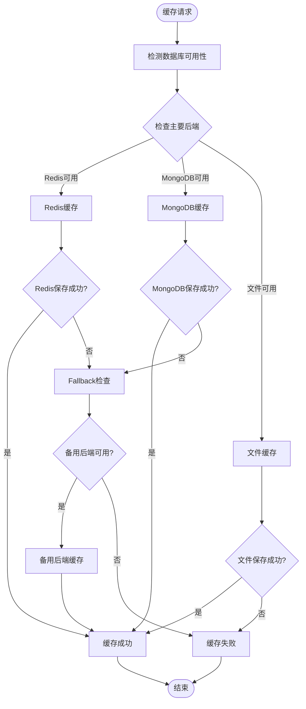
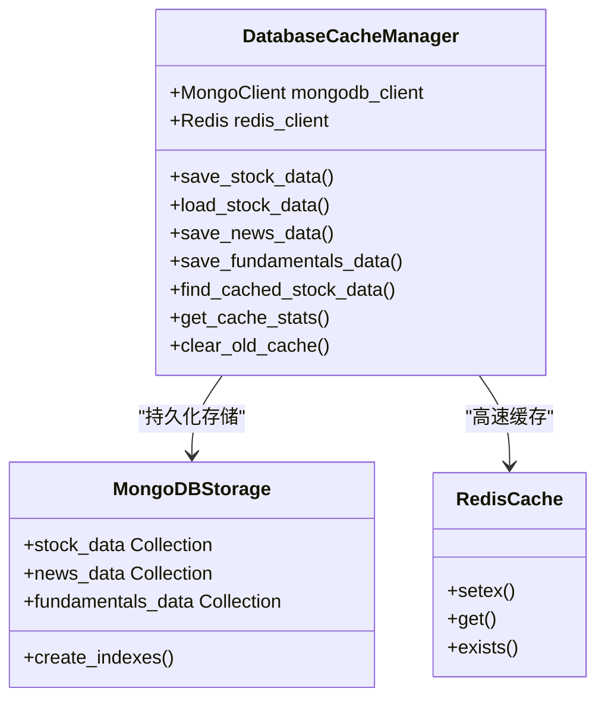
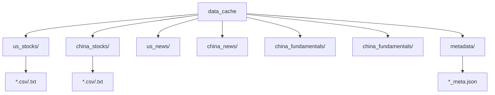
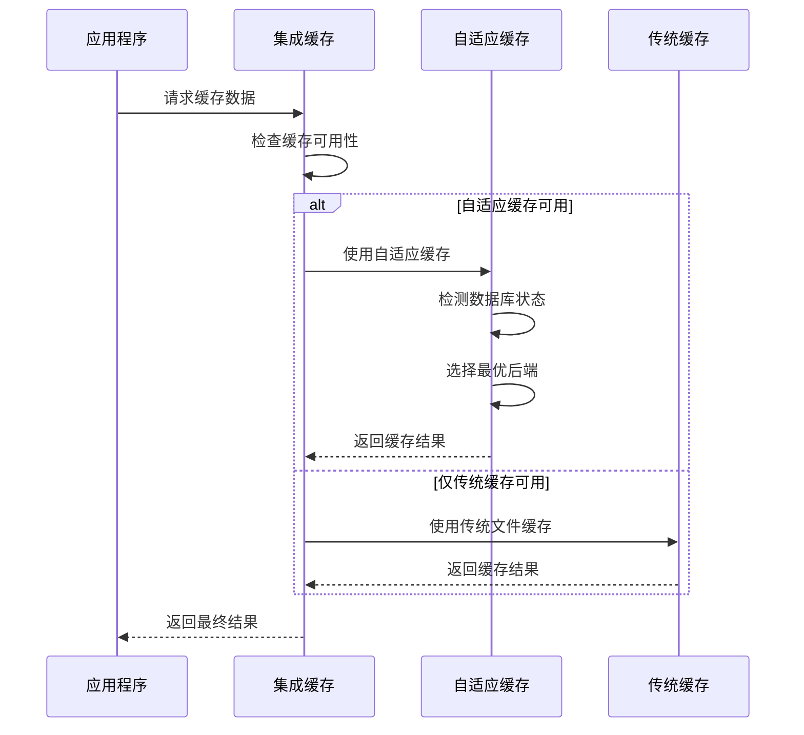
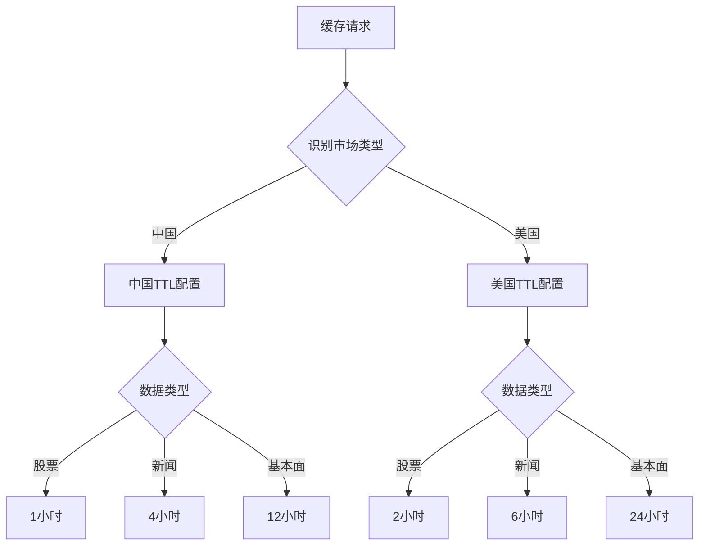
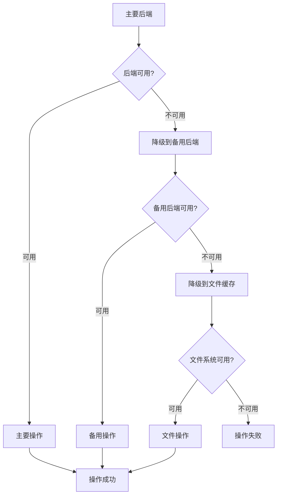

# 缓存优化指南

<cite>
**本文档引用的文件**
- [adaptive_cache.py](file://tradingagents/dataflows/adaptive_cache.py)
- [db_cache_manager.py](file://tradingagents/dataflows/db_cache_manager.py)
- [cache_manager.py](file://tradingagents/dataflows/cache_manager.py)
- [integrated_cache.py](file://tradingagents/dataflows/integrated_cache.py)
- [database_manager.py](file://tradingagents/config/database_manager.py)
- [database_config.py](file://tradingagents/config/database_config.py)
- [test_cache_optimization.py](file://tests/test_cache_optimization.py)
- [optimized_us_data.py](file://tradingagents/dataflows/optimized_us_data.py)
</cite>

## 目录
1. [简介](#简介)
2. [系统架构概览](#系统架构概览)
3. [自适应缓存系统](#自适应缓存系统)
4. [数据库缓存管理器](#数据库缓存管理器)
5. [传统文件缓存系统](#传统文件缓存系统)
6. [集成缓存管理器](#集成缓存管理器)
7. [缓存键生成算法](#缓存键生成算法)
8. [TTL过期策略](#ttl过期策略)
9. [降级策略实现](#降级策略实现)
10. [性能监控与统计](#性能监控与统计)
11. [最佳实践](#最佳实践)
12. [故障排除](#故障排除)

## 简介

TradingAgents-CN系统采用多层次的缓存优化策略，通过智能选择缓存后端、动态TTL管理和降级机制，实现了高效的数据访问和存储。系统支持Redis、MongoDB和文件三种缓存后端，并具备自动切换和故障恢复能力。

## 系统架构概览



**图表来源**
- [integrated_cache.py](file://tradingagents/dataflows/integrated_cache.py#L1-L50)
- [adaptive_cache.py](file://tradingagents/dataflows/adaptive_cache.py#L1-L50)
- [db_cache_manager.py](file://tradingagents/dataflows/db_cache_manager.py#L1-L50)

## 自适应缓存系统

### 核心特性

自适应缓存系统（AdaptiveCacheSystem）是系统的核心缓存引擎，具备以下核心特性：

- **智能后端选择**：根据数据库可用性自动选择最佳缓存后端
- **多后端支持**：同时支持Redis、MongoDB和文件缓存
- **动态降级**：当主要后端不可用时自动降级到备用方案
- **市场感知**：基于股票代码自动识别市场类型（美股/A股）

### 工作机制



**图表来源**
- [adaptive_cache.py](file://tradingagents/dataflows/adaptive_cache.py#L200-L250)

### 关键方法详解

#### 缓存保存流程

系统提供了统一的缓存保存接口，支持多种数据类型的缓存：

- **股票数据缓存**：支持DataFrame和字符串格式
- **新闻数据缓存**：支持文本格式
- **基本面数据缓存**：支持分析文本

#### 缓存加载流程

加载过程遵循优先级顺序：
1. 主要缓存后端（Redis/MongoDB）
2. 备用缓存后端（文件系统）
3. 返回None（缓存未命中）

**章节来源**
- [adaptive_cache.py](file://tradingagents/dataflows/adaptive_cache.py#L200-L300)

## 数据库缓存管理器

### 双层缓存架构

数据库缓存管理器（DatabaseCacheManager）实现了高性能的双层缓存架构：



**图表来源**
- [db_cache_manager.py](file://tradingagents/dataflows/db_cache_manager.py#L30-L80)

### 存储策略

#### MongoDB持久化存储

- **集合设计**：按数据类型分离存储
  - `stock_data`：股票历史数据
  - `news_data`：新闻数据
  - `fundamentals_data`：基本面数据
- **索引优化**：为常用查询字段建立复合索引
- **TTL支持**：自动过期机制

#### Redis高速缓存

- **过期策略**：智能TTL设置
  - 股票数据：6小时
  - 新闻数据：24小时  
  - 基本面数据：24小时
- **内存优化**：高效的序列化存储

### 数据同步机制

系统实现了智能的数据同步机制：

1. **写入时同步**：Redis和MongoDB同时写入
2. **读取时回填**：Redis未命中时从MongoDB加载并同步
3. **索引维护**：自动维护查询索引

**章节来源**
- [db_cache_manager.py](file://tradingagents/dataflows/db_cache_manager.py#L100-L200)

## 传统文件缓存系统

### 分层存储架构

传统文件缓存系统（StockDataCache）采用市场分类的分层存储架构：



**图表来源**
- [cache_manager.py](file://tradingagents/dataflows/cache_manager.py#L30-L50)

### 缓存配置策略

系统针对不同市场和数据类型设置了专门的TTL配置：

| 数据类型 | 美股TTL | A股TTL | 最大文件数 |
|---------|---------|--------|-----------|
| 股票数据 | 2小时 | 1小时 | 1000 |
| 新闻数据 | 6小时 | 4小时 | 500 |
| 基本面数据 | 24小时 | 12小时 | 200 |

### 内容长度控制

系统具备智能的内容长度控制机制：

- **长度检查**：可配置的最大内容长度（默认50KB）
- **长文本处理**：支持长文本提供商的自动跳过
- **向后兼容**：可禁用长度检查以保持原有行为

**章节来源**
- [cache_manager.py](file://tradingagents/dataflows/cache_manager.py#L50-L100)

## 集成缓存管理器

### 智能选择机制

集成缓存管理器（IntegratedCacheManager）提供了无缝的缓存体验：



**图表来源**
- [integrated_cache.py](file://tradingagents/dataflows/integrated_cache.py#L50-L100)

### 向后兼容性

集成缓存管理器确保了完全的向后兼容：

- **API一致性**：保持原有的缓存接口
- **数据迁移**：现有缓存文件继续有效
- **渐进升级**：可逐步启用新功能

**章节来源**
- [integrated_cache.py](file://tradingagents/dataflows/integrated_cache.py#L1-L50)

## 缓存键生成算法

### MD5哈希算法

系统采用MD5哈希算法生成唯一的缓存键：

```python
def _get_cache_key(self, symbol: str, start_date: str = "", end_date: str = "", 
                  data_source: str = "default", data_type: str = "stock_data") -> str:
    key_data = f"{symbol}_{start_date}_{end_date}_{data_source}_{data_type}"
    return hashlib.md5(key_data.encode()).hexdigest()
```

### 键组成要素

缓存键由以下要素组合而成：

1. **股票代码**（symbol）：唯一标识股票
2. **时间范围**（start_date/end_date）：数据的时间区间
3. **数据源**（data_source）：数据来源标识
4. **数据类型**（data_type）：数据类别标识

### 市场类型识别

系统能够自动识别市场类型：

```python
def _determine_market_type(self, symbol: str) -> str:
    import re
    if re.match(r'^\d{6}$', str(symbol)):
        return 'china'
    else:
        return 'us'
```

**章节来源**
- [adaptive_cache.py](file://tradingagents/dataflows/adaptive_cache.py#L40-L50)
- [cache_manager.py](file://tradingagents/dataflows/cache_manager.py#L120-L130)

## TTL过期策略

### 市场感知的TTL配置

系统实现了基于市场类型和数据类型的智能TTL策略：



**图表来源**
- [cache_manager.py](file://tradingagents/dataflows/cache_manager.py#L50-L80)

### 动态TTL计算

系统提供了灵活的TTL计算机制：

```python
def _get_ttl_seconds(self, symbol: str, data_type: str = "stock_data") -> int:
    # 判断市场类型
    if len(symbol) == 6 and symbol.isdigit():
        market = "china"
    else:
        market = "us"
    
    # 获取TTL配置
    ttl_key = f"{market}_{data_type}"
    ttl_seconds = self.cache_config["ttl_settings"].get(ttl_key, 7200)
    return ttl_seconds
```

### 过期验证机制

系统实现了双重过期验证：

1. **数据库TTL**：MongoDB自动过期机制
2. **文件TTL**：手动时间戳检查

**章节来源**
- [adaptive_cache.py](file://tradingagents/dataflows/adaptive_cache.py#L50-L70)
- [cache_manager.py](file://tradingagents/dataflows/cache_manager.py#L160-L190)

## 降级策略实现

### 多层降级机制

系统实现了完整的降级策略，确保服务的高可用性：



**图表来源**
- [adaptive_cache.py](file://tradingagents/dataflows/adaptive_cache.py#L250-L300)

### 自动检测与切换

数据库管理器负责自动检测各个后端的可用性：

- **Redis检测**：连接测试和功能验证
- **MongoDB检测**：连接状态和权限验证
- **文件系统检测**：目录权限和磁盘空间

### 降级配置选项

系统提供了灵活的降级配置：

- **fallback_enabled**：是否启用降级机制
- **primary_backend**：首选缓存后端
- **backup_backend**：备用缓存后端

**章节来源**
- [database_manager.py](file://tradingagents/config/database_manager.py#L140-L190)

## 性能监控与统计

### 缓存统计信息

系统提供了全面的缓存统计信息：

```python
def get_cache_stats(self) -> Dict[str, Any]:
    stats = {
        'primary_backend': self.primary_backend,
        'fallback_enabled': self.fallback_enabled,
        'database_available': self.db_manager.is_database_available(),
        'mongodb_available': self.db_manager.is_mongodb_available(),
        'redis_available': self.db_manager.is_redis_available(),
        'file_cache_directory': str(self.cache_dir),
        'file_cache_count': len(list(self.cache_dir.glob("*.pkl"))),
    }
    
    # Redis统计
    redis_client = self.db_manager.get_redis_client()
    if redis_client:
        redis_info = redis_client.info()
        stats['redis_memory_used'] = redis_info.get('used_memory_human', 'N/A')
        stats['redis_keys'] = redis_client.dbsize()
    
    # MongoDB统计
    mongodb_client = self.db_manager.get_mongodb_client()
    if mongodb_client:
        db = mongodb_client.tradingagents
        stats['mongodb_cache_count'] = db.cache.count_documents({})
    
    return stats
```

### 性能指标

系统监控以下关键性能指标：

- **缓存命中率**：缓存命中次数与总请求次数的比例
- **响应时间**：缓存操作的平均响应时间
- **存储使用量**：各存储后端的使用情况
- **错误率**：缓存操作失败的比例

### 清理机制

系统实现了自动的过期缓存清理：

```python
def clear_expired_cache(self):
    # 清理文件缓存
    cleared_files = 0
    for cache_file in self.cache_dir.glob("*.pkl"):
        # 检查文件时间戳
        if not self._is_cache_valid(file_timestamp, ttl_seconds):
            cache_file.unlink()
            cleared_files += 1
    
    # MongoDB自动清理（通过expires_at字段）
    # Redis自动清理（通过TTL机制）
```

**章节来源**
- [adaptive_cache.py](file://tradingagents/dataflows/adaptive_cache.py#L350-L380)

## 最佳实践

### 缓存使用建议

1. **合理设置TTL**：根据数据更新频率设置合适的过期时间
2. **监控缓存性能**：定期检查缓存命中率和响应时间
3. **优化存储结构**：合理组织文件目录结构
4. **定期清理**：执行定期的过期缓存清理

### 配置优化

```python
# 推荐的缓存配置
cache_config = {
    "primary_backend": "redis",  # 优先使用Redis
    "fallback_enabled": True,    # 启用降级机制
    "ttl_settings": {
        "us_stock_data": 7200,      # 2小时
        "china_stock_data": 3600,   # 1小时
        "us_news": 21600,           # 6小时
        "china_news": 14400,        # 4小时
        "us_fundamentals": 86400,   # 24小时
        "china_fundamentals": 43200  # 12小时
    }
}
```

### 错误处理

- **优雅降级**：当缓存不可用时自动降级
- **异常捕获**：妥善处理各种异常情况
- **日志记录**：详细记录缓存操作日志

## 故障排除

### 常见问题诊断

1. **缓存未命中**
   - 检查缓存键生成是否正确
   - 验证TTL设置是否合理
   - 确认数据源是否正确

2. **性能问题**
   - 检查数据库连接状态
   - 监控存储空间使用
   - 优化查询索引

3. **降级机制失效**
   - 验证备用后端配置
   - 检查降级开关状态
   - 确认网络连接状态

### 调试工具

系统提供了丰富的调试工具：

```python
# 获取缓存状态
cache_status = cache.get_cache_backend_info()

# 获取详细统计
cache_stats = cache.get_cache_stats()

# 性能测试
performance_mode = cache.get_performance_mode()
```

**章节来源**
- [test_cache_optimization.py](file://tests/test_cache_optimization.py#L1-L50)

## 结论

TradingAgents-CN的缓存优化系统通过多层次的设计和智能的降级机制，实现了高性能、高可用的数据缓存解决方案。系统不仅提供了卓越的性能表现，还具备良好的扩展性和维护性，为交易应用提供了坚实的数据支撑。

通过合理的配置和使用最佳实践，开发者可以充分发挥缓存系统的优势，显著提升应用的响应速度和用户体验。