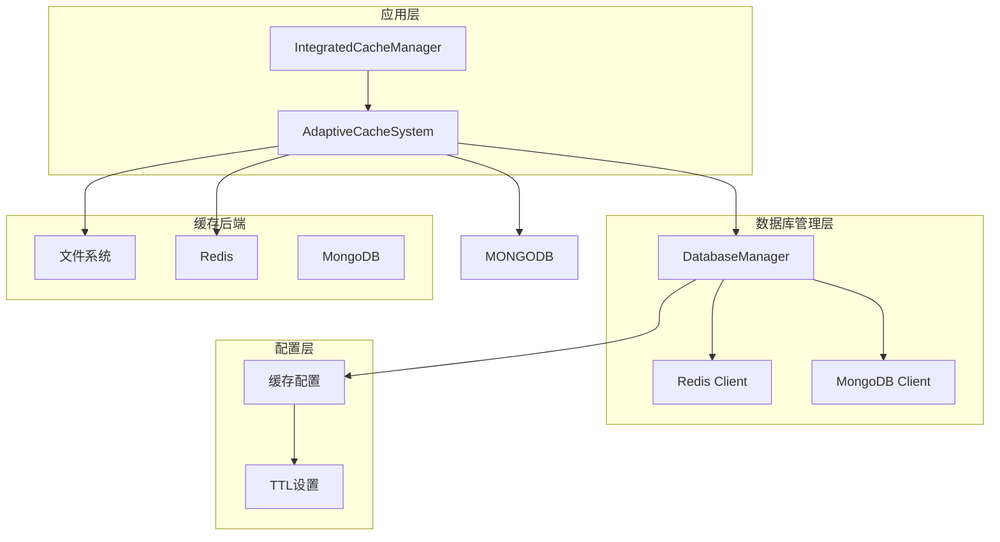
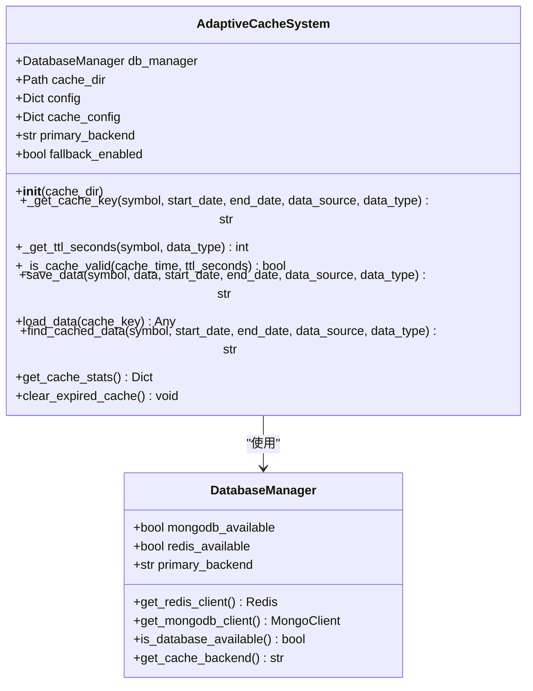
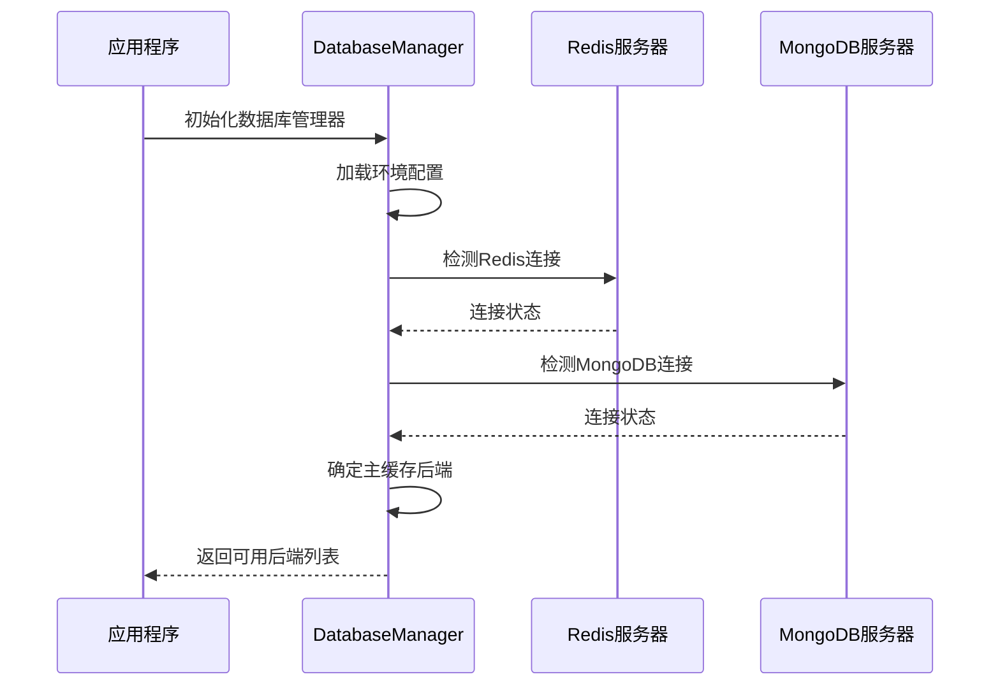
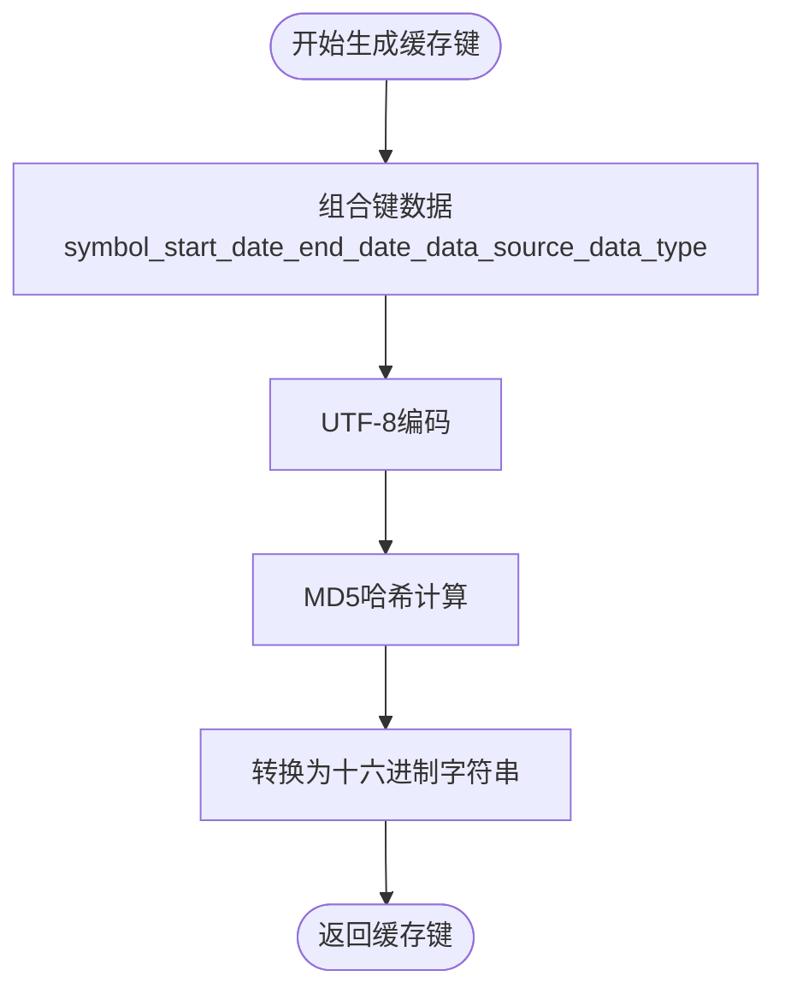
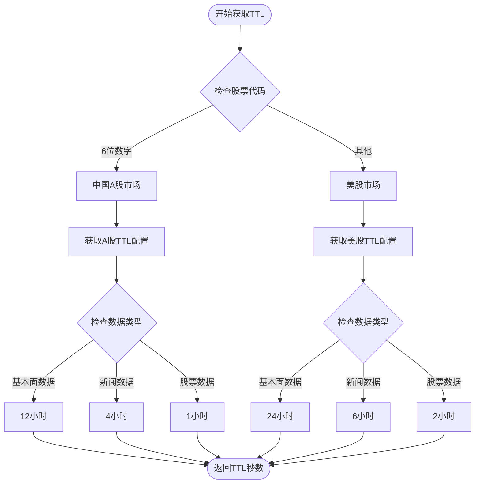
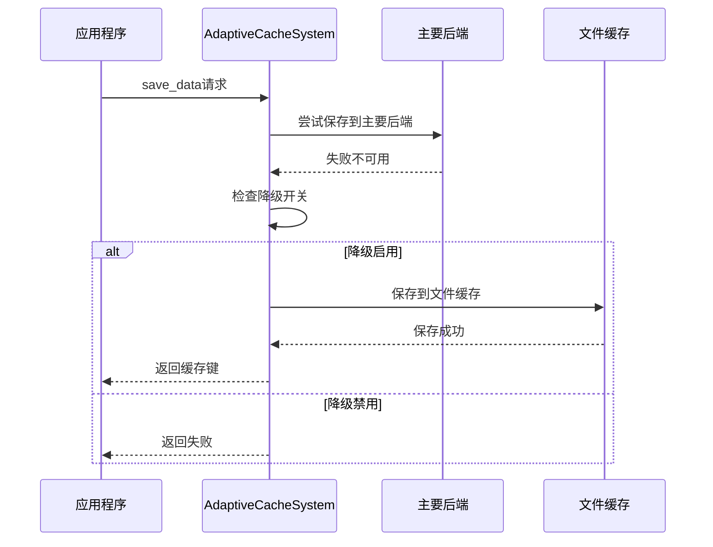
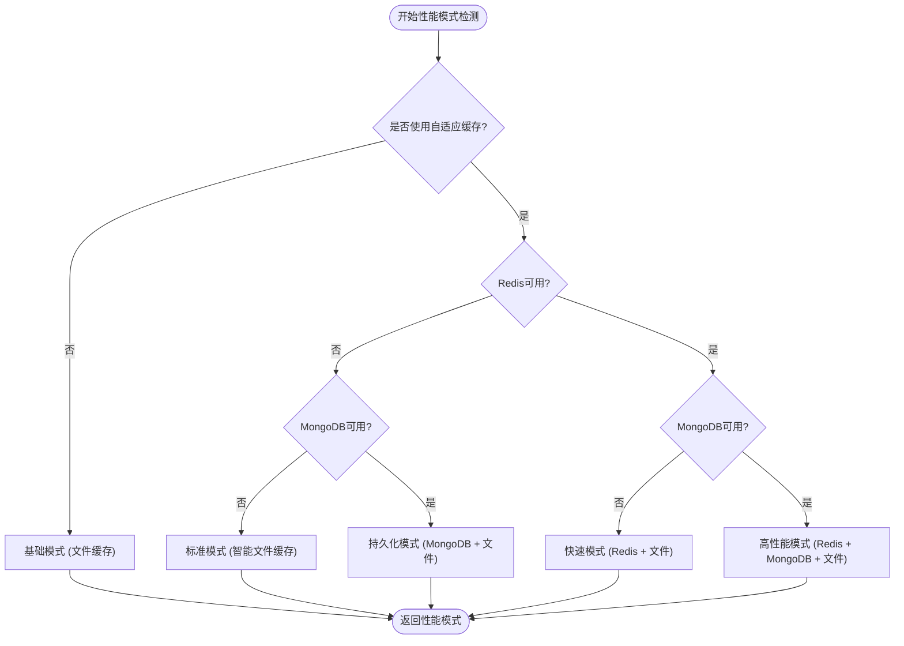
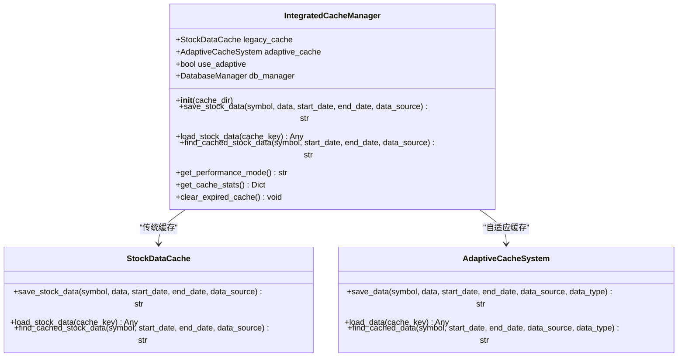

# 自适应缓存策略

<cite>
**本文档引用的文件**
- [adaptive_cache.py](file://tradingagents/dataflows/adaptive_cache.py)
- [integrated_cache.py](file://tradingagents/dataflows/integrated_cache.py)
- [database_manager.py](file://tradingagents/config/database_manager.py)
- [cache_manager.py](file://tradingagents/dataflows/cache_manager.py)
</cite>

## 目录
1. [引言](#引言)
2. [系统架构概览](#系统架构概览)
3. [核心组件分析](#核心组件分析)
4. [缓存键生成机制](#缓存键生成机制)
5. [TTL过期策略](#ttl过期策略)
6. [降级机制实现](#降级机制实现)
7. [性能模式识别](#性能模式识别)
8. [兼容层设计](#兼容层设计)
9. [故障排除指南](#故障排除指南)
10. [总结](#总结)

## 引言

自适应缓存系统（AdaptiveCacheSystem）是TradingAgents-CN项目中的核心数据缓存解决方案，它能够根据数据库配置和可用性动态选择最优的缓存后端。该系统支持Redis、MongoDB和文件系统三种缓存后端，并实现了智能的降级机制和性能优化策略。

## 系统架构概览

自适应缓存系统采用分层架构设计，通过数据库管理器（DatabaseManager）检测和选择可用的缓存后端，然后通过自适应缓存系统执行具体的缓存操作。



**图表来源**
- [integrated_cache.py](file://tradingagents/dataflows/integrated_cache.py#L1-L50)
- [adaptive_cache.py](file://tradingagents/dataflows/adaptive_cache.py#L18-L55)
- [database_manager.py](file://tradingagents/config/database_manager.py#L15-L50)

## 核心组件分析

### AdaptiveCacheSystem类设计

AdaptiveCacheSystem是自适应缓存系统的核心类，负责协调各种缓存后端的操作。



**图表来源**
- [adaptive_cache.py](file://tradingagents/dataflows/adaptive_cache.py#L18-L55)
- [database_manager.py](file://tradingagents/config/database_manager.py#L15-L50)

**章节来源**
- [adaptive_cache.py](file://tradingagents/dataflows/adaptive_cache.py#L18-L55)
- [database_manager.py](file://tradingagents/config/database_manager.py#L15-L50)

### 数据库管理器的作用

DatabaseManager负责检测和管理各种数据库服务的可用性，是自适应缓存系统的基础支撑组件。



**图表来源**
- [database_manager.py](file://tradingagents/config/database_manager.py#L15-L100)

**章节来源**
- [database_manager.py](file://tradingagents/config/database_manager.py#L15-L100)

## 缓存键生成机制

### _cache_key方法实现

_cache_key方法使用MD5哈希算法生成唯一的缓存键，确保不同组合的数据不会产生冲突。



**图表来源**
- [adaptive_cache.py](file://tradingagents/dataflows/adaptive_cache.py#L42-L45)

该方法的关键特性包括：
- **唯一性保证**：通过MD5哈希确保不同参数组合产生不同的键
- **可预测性**：相同的输入总是产生相同的输出
- **紧凑性**：MD5哈希生成固定长度的128位标识符

**章节来源**
- [adaptive_cache.py](file://tradingagents/dataflows/adaptive_cache.py#L42-L45)

### 键生成参数详解

缓存键的生成基于以下五个关键参数：

| 参数 | 类型 | 描述 | 示例 |
|------|------|------|------|
| symbol | str | 股票代码 | "000001", "AAPL" |
| start_date | str | 开始日期 | "2024-01-01" |
| end_date | str | 结束日期 | "2024-12-31" |
| data_source | str | 数据源标识 | "tushare", "yfinance" |
| data_type | str | 数据类型 | "stock_data", "news_data" |

这种设计允许系统区分同一股票在不同时间段、不同数据源和不同数据类型下的缓存需求。

## TTL过期策略

### _get_ttl_seconds方法实现

TTL（Time To Live）策略根据股票市场类型和数据类型自动调整缓存过期时间。



**图表来源**
- [adaptive_cache.py](file://tradingagents/dataflows/adaptive_cache.py#L47-L58)

### 市场类型判断逻辑

系统通过简单的字符串匹配来判断市场类型：

```python
# 判断市场类型
if len(symbol) == 6 and symbol.isdigit():
    market = "china"
else:
    market = "us"
```

这种判断方式具有以下优势：
- **简单高效**：O(1)时间复杂度
- **准确可靠**：基于股票代码的标准格式
- **易于维护**：无需复杂的正则表达式

### TTL配置表

| 市场类型 | 数据类型 | 默认TTL | 说明 |
|----------|----------|---------|------|
| 中国A股 | 股票数据 | 1小时 | 实时性要求高 |
| 中国A股 | 新闻数据 | 4小时 | 新闻时效性适中 |
| 中国A股 | 基本面数据 | 12小时 | 基本面数据变化慢 |
| 美股 | 股票数据 | 2小时 | API限制考虑 |
| 美股 | 新闻数据 | 6小时 | 新闻时效性较高 |
| 美股 | 基本面数据 | 24小时 | 基本面数据稳定 |

**章节来源**
- [adaptive_cache.py](file://tradingagents/dataflows/adaptive_cache.py#L47-L58)

## 降级机制实现

### 自动降级流程

当主要缓存后端不可用时，系统会自动降级到文件缓存，确保缓存功能的连续性。



**图表来源**
- [adaptive_cache.py](file://tradingagents/dataflows/adaptive_cache.py#L180-L220)

### 降级触发条件

降级机制在以下情况下自动激活：

1. **主要后端不可用**：Redis或MongoDB连接失败
2. **网络问题**：数据库服务暂时不可达
3. **认证失败**：数据库凭据无效
4. **权限不足**：数据库访问权限被拒绝

### 降级策略配置

系统通过配置项控制降级行为：

```python
# 在配置中启用降级
self.fallback_enabled = self.cache_config["fallback_enabled"]
```

**章节来源**
- [adaptive_cache.py](file://tradingagents/dataflows/adaptive_cache.py#L180-L220)

## 性能模式识别

### get_performance_mode方法

IntegratedCacheManager提供了get_performance_mode方法，根据可用的缓存后端返回相应的性能模式提示。



**图表来源**
- [integrated_cache.py](file://tradingagents/dataflows/integrated_cache.py#L250-L268)

### 性能模式详解

| 性能模式 | 组件配置 | 适用场景 | 性能特点 |
|----------|----------|----------|----------|
| 高性能模式 | Redis + MongoDB + 文件 | 生产环境，高并发 | 最快读写速度，最大容量 |
| 快速模式 | Redis + 文件 | 中等负载，快速响应 | 较快读写速度，中等容量 |
| 持久化模式 | MongoDB + 文件 | 数据持久性优先 | 数据持久性强，读写平衡 |
| 标准模式 | 智能文件缓存 | 开发测试，低负载 | 简单可靠，资源占用少 |
| 基础模式 | 文件缓存 | 最简配置，离线环境 | 最低资源消耗 |

**章节来源**
- [integrated_cache.py](file://tradingagents/dataflows/integrated_cache.py#L250-L268)

## 兼容层设计

### IntegratedCacheManager架构

IntegratedCacheManager作为传统缓存系统与自适应缓存系统的兼容层，提供统一的接口给上层应用。



**图表来源**
- [integrated_cache.py](file://tradingagents/dataflows/integrated_cache.py#L25-L50)

### 接口兼容性设计

IntegratedCacheManager通过以下方式确保接口兼容性：

1. **统一方法签名**：所有缓存操作方法保持一致的参数列表
2. **自动路由**：根据可用性自动选择合适的缓存系统
3. **错误透明**：底层错误向上层透明传递
4. **配置驱动**：通过配置决定使用哪种缓存系统

### 数据类型映射

系统在不同缓存系统之间进行数据类型映射：

| 数据类型 | AdaptiveCacheSystem | 传统缓存系统 | 映射关系 |
|----------|-------------------|-------------|----------|
| 股票数据 | stock_data | stock_data | 直接映射 |
| 新闻数据 | news_data | news | 直接映射 |
| 基本面数据 | fundamentals_data | fundamentals | 直接映射 |

**章节来源**
- [integrated_cache.py](file://tradingagents/dataflows/integrated_cache.py#L25-L50)

## 故障排除指南

### 常见问题诊断

#### 1. 缓存后端连接失败

**症状**：系统无法连接到Redis或MongoDB

**诊断步骤**：
```python
# 检查数据库可用性
from tradingagents.config.database_manager import get_database_manager
db_manager = get_database_manager()
print(f"Redis可用: {db_manager.is_redis_available()}")
print(f"MongoDB可用: {db_manager.is_mongodb_available()}")
```

**解决方案**：
- 检查数据库服务是否启动
- 验证网络连接
- 确认防火墙设置
- 检查认证凭据

#### 2. 缓存性能下降

**症状**：缓存读写速度变慢

**诊断方法**：
```python
# 获取缓存统计信息
from tradingagents.dataflows.integrated_cache import get_cache
cache = get_cache()
stats = cache.get_cache_stats()
print(f"缓存统计: {stats}")
```

**优化建议**：
- 升级硬件配置
- 优化数据库索引
- 调整TTL设置
- 增加缓存预热

#### 3. 降级机制失效

**症状**：主要后端不可用时仍尝试使用

**检查配置**：
```python
# 检查降级配置
from tradingagents.dataflows.adaptive_cache import get_cache_system
cache = get_cache_system()
print(f"降级启用: {cache.fallback_enabled}")
```

**章节来源**
- [adaptive_cache.py](file://tradingagents/dataflows/adaptive_cache.py#L320-L380)
- [database_manager.py](file://tradingagents/config/database_manager.py#L269-L304)

## 总结

自适应缓存系统通过智能的后端选择、灵活的TTL策略和可靠的降级机制，为TradingAgents-CN项目提供了高性能、高可用的数据缓存解决方案。

### 主要优势

1. **智能后端选择**：根据数据库可用性自动选择最优缓存后端
2. **灵活TTL策略**：针对不同市场和数据类型定制化过期时间
3. **可靠降级机制**：确保系统在任何情况下都能提供缓存服务
4. **性能模式识别**：为用户提供清晰的性能状态反馈
5. **向后兼容**：无缝集成传统缓存系统

### 技术创新点

- **市场类型自动识别**：基于股票代码格式自动判断市场类型
- **多维度缓存键生成**：通过MD5哈希确保缓存键的唯一性和一致性
- **配置驱动的性能优化**：通过配置文件灵活调整缓存策略
- **渐进式降级**：多层次的降级策略确保服务连续性

该系统的设计充分体现了现代软件工程的最佳实践，为大规模金融数据处理提供了坚实的基础设施支持。