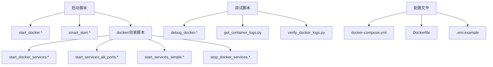
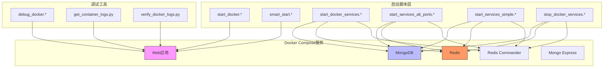
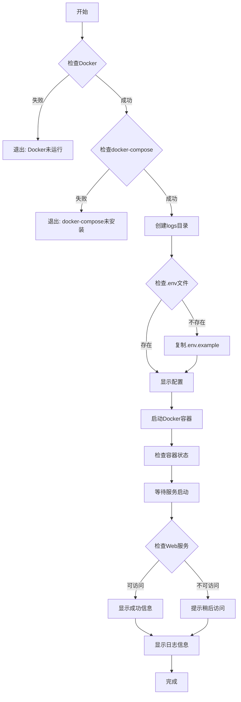
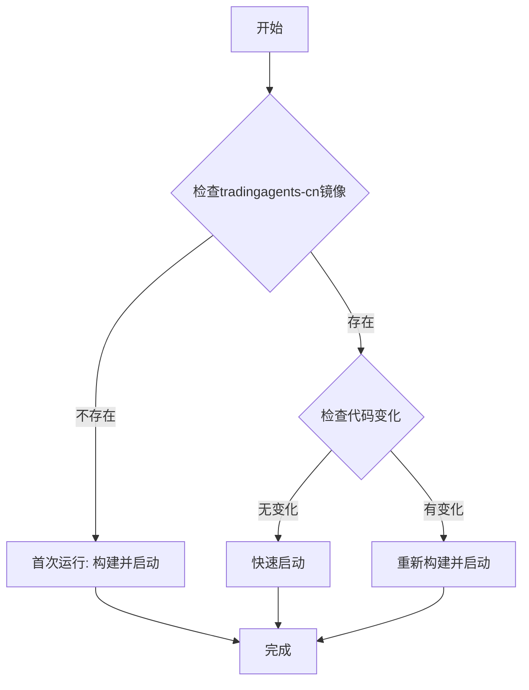
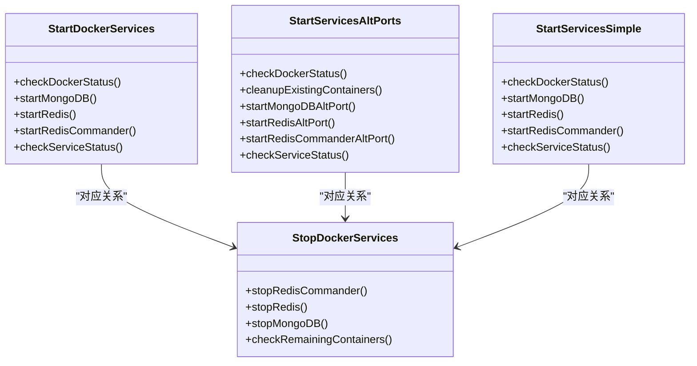
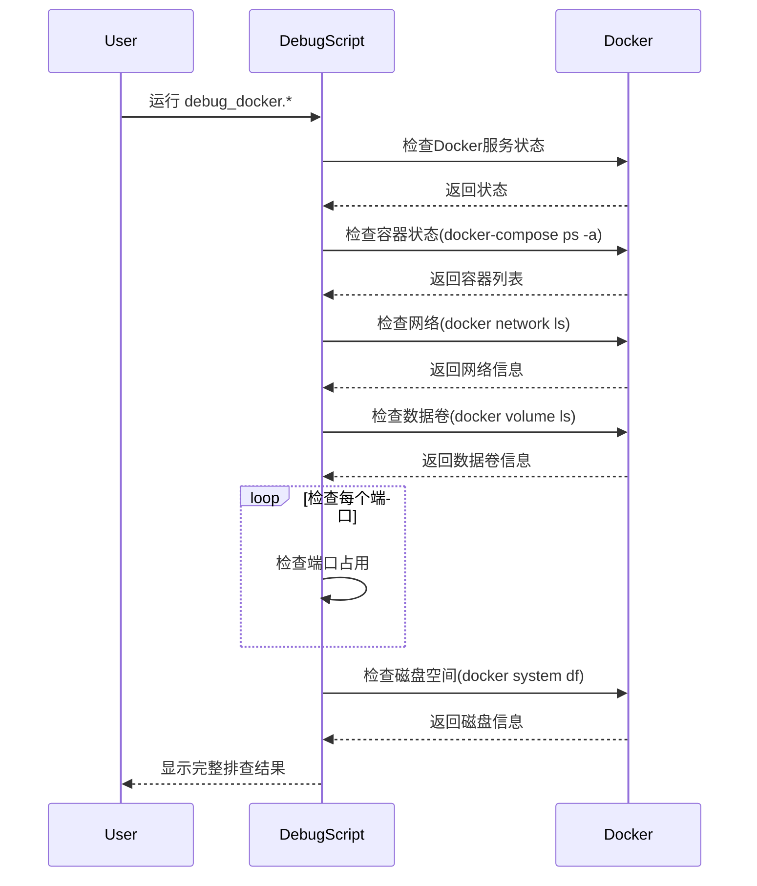
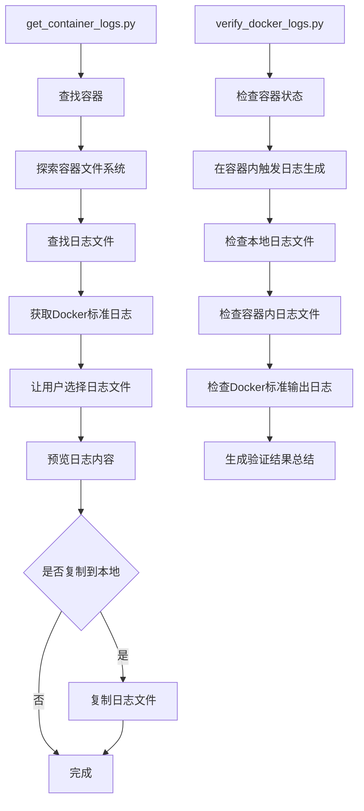
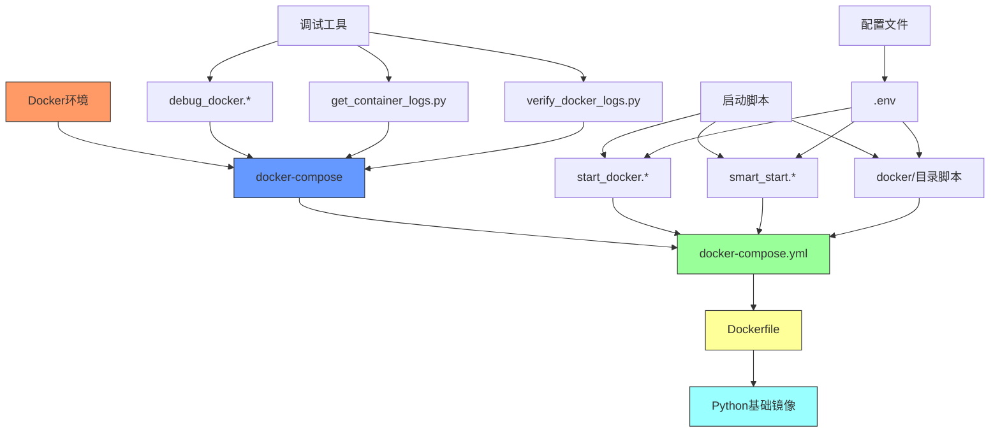
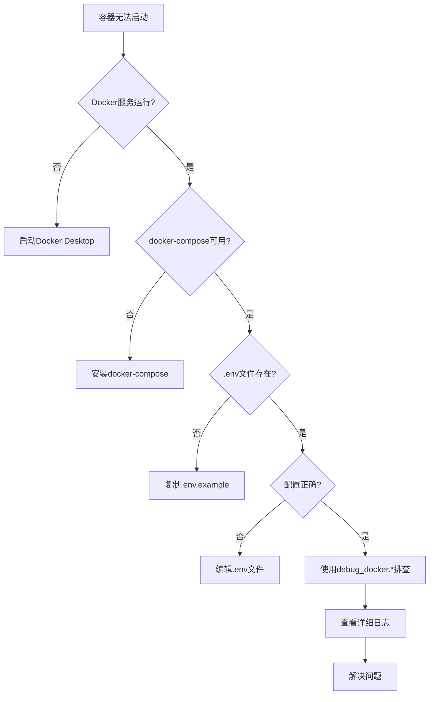
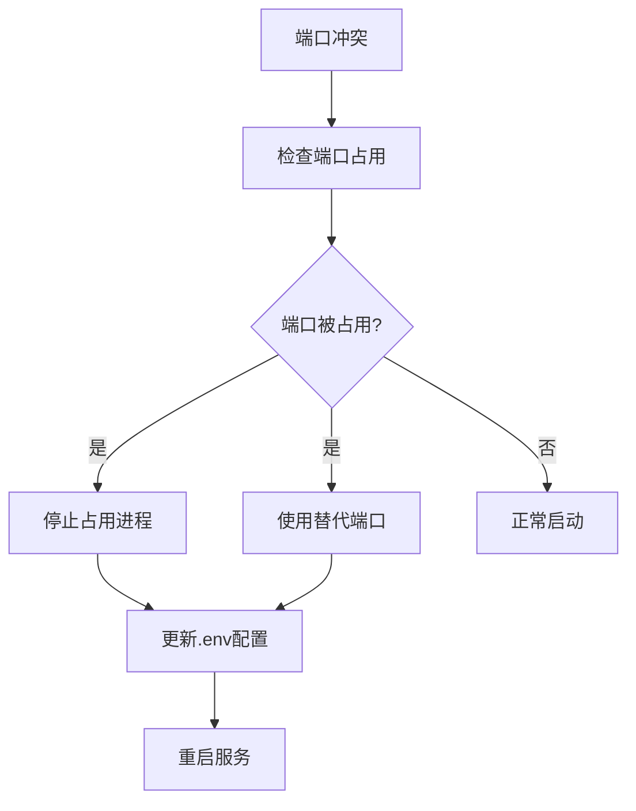

# Docker启动问题排查

<cite>
**本文档引用的文件**  
- [start_docker.sh](file://scripts/start_docker.sh)
- [start_docker.ps1](file://scripts/start_docker.ps1)
- [smart_start.sh](file://scripts/smart_start.sh)
- [smart_start.ps1](file://scripts/smart_start.ps1)
- [docker-compose.yml](file://docker-compose.yml)
- [Dockerfile](file://Dockerfile)
- [start_docker_services.sh](file://scripts/docker/start_docker_services.sh)
- [start_docker_services.bat](file://scripts/docker/start_docker_services.bat)
- [start_services_alt_ports.bat](file://scripts/docker/start_services_alt_ports.bat)
- [start_services_simple.bat](file://scripts/docker/start_services_simple.bat)
- [stop_docker_services.sh](file://scripts/docker/stop_docker_services.sh)
- [stop_docker_services.bat](file://scripts/docker/stop_docker_services.bat)
- [debug_docker.sh](file://scripts/debug_docker.sh)
- [debug_docker.ps1](file://scripts/debug_docker.ps1)
- [get_container_logs.py](file://scripts/get_container_logs.py)
- [verify_docker_logs.py](file://scripts/verify_docker_logs.py)
- [.env.example](file://.env.example)
</cite>

## 目录

1. [简介](#简介)
2. [项目结构](#项目结构)
3. [核心组件](#核心组件)
4. [架构概述](#架构概述)
5. [详细组件分析](#详细组件分析)
6. [依赖分析](#依赖分析)
7. [性能考虑](#性能考虑)
8. [故障排查指南](#故障排查指南)
9. [结论](#结论)

## 简介

本指南旨在解决TradingAgents项目中Docker容器启动过程中遇到的各种问题，包括容器无法启动、服务启动顺序错误、端口冲突等常见故障。通过深入分析`start_docker.*`系列脚本和`docker`目录下的各类启动脚本，我们将揭示`smart_start.*`脚本的智能检测逻辑。本指南提供针对Windows和Linux不同操作系统的解决方案，包括替代端口启动方案和简化服务启动模式的使用方法。结合实际错误日志，我们将说明如何逐步排查启动失败原因，并验证各服务的正常运行状态。

## 项目结构

本项目包含多个脚本和配置文件，用于管理Docker容器的启动、停止和调试。核心的Docker相关脚本位于`scripts/docker/`目录下，而主要的启动脚本分布在`scripts/`根目录中。

**Diagram sources**
- [scripts/start_docker.sh](file://scripts/start_docker.sh)
- [scripts/smart_start.sh](file://scripts/smart_start.sh)
- [scripts/docker/start_docker_services.sh](file://scripts/docker/start_docker_services.sh)
- [scripts/debug_docker.sh](file://scripts/debug_docker.sh)
- [docker-compose.yml](file://docker-compose.yml)

**Section sources**
- [scripts/start_docker.sh](file://scripts/start_docker.sh)
- [scripts/smart_start.sh](file://scripts/smart_start.sh)
- [scripts/docker/start_docker_services.sh](file://scripts/docker/start_docker_services.sh)

## 核心组件

本项目的核心组件包括一系列Docker启动和管理脚本，它们共同构成了一个完整的容器化应用启动和故障排查系统。`start_docker.*`脚本负责完整的应用启动流程，包括环境检查、目录创建、配置文件验证和容器启动。`smart_start.*`脚本实现了智能启动逻辑，能够根据代码变化自动决定是否需要重新构建镜像。`docker/`目录下的脚本提供了更细粒度的服务控制，允许用户单独启动数据库服务或使用替代端口。

**Section sources**
- [scripts/start_docker.sh](file://scripts/start_docker.sh#L1-L86)
- [scripts/smart_start.sh](file://scripts/smart_start.sh#L1-L33)
- [scripts/docker/start_docker_services.sh](file://scripts/docker/start_docker_services.sh#L1-L100)

## 架构概述

TradingAgents项目的Docker架构基于`docker-compose.yml`文件定义的多服务架构，包含Web应用、MongoDB数据库、Redis缓存和管理界面等多个组件。启动脚本层提供了多种启动模式，从完整的`start_docker.*`脚本到简化的`start_services_simple.*`脚本，满足不同场景的需求。

**Diagram sources**
- [docker-compose.yml](file://docker-compose.yml#L1-L158)
- [scripts/start_docker.sh](file://scripts/start_docker.sh#L1-L86)
- [scripts/docker/start_docker_services.sh](file://scripts/docker/start_docker_services.sh#L1-L100)

## 详细组件分析

### 启动脚本分析

#### start_docker.* 脚本分析
`start_docker.*`系列脚本是启动整个TradingAgents应用的主要入口。这些脚本首先检查Docker和docker-compose是否可用，然后创建必要的日志目录，检查并准备配置文件，最后启动所有定义在`docker-compose.yml`中的服务。

**Diagram sources**
- [scripts/start_docker.sh](file://scripts/start_docker.sh#L1-L86)
- [scripts/start_docker.ps1](file://scripts/start_docker.ps1#L1-L135)

**Section sources**
- [scripts/start_docker.sh](file://scripts/start_docker.sh#L1-L86)
- [scripts/start_docker.ps1](file://scripts/start_docker.ps1#L1-L135)

#### smart_start.* 脚本分析
`smart_start.*`脚本实现了智能启动逻辑，能够根据代码变化自动决定是否需要重新构建Docker镜像。这种机制避免了不必要的镜像重建，提高了开发效率。

**Diagram sources**
- [scripts/smart_start.sh](file://scripts/smart_start.sh#L1-L33)
- [scripts/smart_start.ps1](file://scripts/smart_start.ps1#L1-L35)

**Section sources**
- [scripts/smart_start.sh](file://scripts/smart_start.sh#L1-L33)
- [scripts/smart_start.ps1](file://scripts/smart_start.ps1#L1-L35)

### 服务管理脚本分析

#### docker目录脚本分析
`scripts/docker/`目录下的脚本提供了更细粒度的服务控制功能，允许用户单独管理数据库服务，而不影响Web应用。

**Diagram sources**
- [scripts/docker/start_docker_services.sh](file://scripts/docker/start_docker_services.sh#L1-L100)
- [scripts/docker/start_services_alt_ports.bat](file://scripts/docker/start_services_alt_ports.bat#L1-L57)
- [scripts/docker/start_services_simple.bat](file://scripts/docker/start_services_simple.bat#L1-L44)
- [scripts/docker/stop_docker_services.sh](file://scripts/docker/stop_docker_services.sh#L1-L39)

**Section sources**
- [scripts/docker/start_docker_services.sh](file://scripts/docker/start_docker_services.sh#L1-L100)
- [scripts/docker/start_services_alt_ports.bat](file://scripts/docker/start_services_alt_ports.bat#L1-L57)
- [scripts/docker/start_services_simple.bat](file://scripts/docker/start_services_simple.bat#L1-L44)
- [scripts/docker/stop_docker_services.sh](file://scripts/docker/stop_docker_services.sh#L1-L39)

### 调试工具分析

#### debug_docker.* 脚本分析
`debug_docker.*`脚本是一套完整的Docker排查工具，能够检查Docker服务状态、容器状态、网络配置、数据卷和端口占用情况。

**Diagram sources**
- [scripts/debug_docker.sh](file://scripts/debug_docker.sh#L1-L45)
- [scripts/debug_docker.ps1](file://scripts/debug_docker.ps1#L1-L46)

**Section sources**
- [scripts/debug_docker.sh](file://scripts/debug_docker.sh#L1-L45)
- [scripts/debug_docker.ps1](file://scripts/debug_docker.ps1#L1-L46)

#### 日志获取工具分析
`get_container_logs.py`和`verify_docker_logs.py`提供了高级的日志管理和验证功能。

**Diagram sources**
- [scripts/get_container_logs.py](file://scripts/get_container_logs.py#L1-L273)
- [scripts/verify_docker_logs.py](file://scripts/verify_docker_logs.py#L1-L241)

**Section sources**
- [scripts/get_container_logs.py](file://scripts/get_container_logs.py#L1-L273)
- [scripts/verify_docker_logs.py](file://scripts/verify_docker_logs.py#L1-L241)

## 依赖分析

本项目的Docker启动系统具有清晰的依赖关系，从基础的Docker环境到具体的启动脚本，形成了一个完整的依赖链。

**Diagram sources**
- [docker-compose.yml](file://docker-compose.yml#L1-L158)
- [Dockerfile](file://Dockerfile#L1-L57)
- [scripts/start_docker.sh](file://scripts/start_docker.sh#L1-L86)
- [scripts/smart_start.sh](file://scripts/smart_start.sh#L1-L33)
- [scripts/docker/start_docker_services.sh](file://scripts/docker/start_docker_services.sh#L1-L100)

**Section sources**
- [docker-compose.yml](file://docker-compose.yml#L1-L158)
- [Dockerfile](file://Dockerfile#L1-L57)
- [scripts/start_docker.sh](file://scripts/start_docker.sh#L1-L86)

## 性能考虑

在Docker启动过程中，性能主要受以下几个因素影响：

1. **镜像构建时间**：`smart_start.*`脚本通过智能判断是否需要重新构建镜像，避免了不必要的构建过程，显著提高了启动效率。
2. **服务启动顺序**：`docker-compose.yml`文件中的`depends_on`配置确保了服务按正确的顺序启动，避免了因依赖服务未就绪而导致的启动失败。
3. **数据卷使用**：通过Docker数据卷持久化数据库和Redis数据，避免了每次启动时重新初始化数据，提高了启动速度。
4. **并行启动**：Docker Compose默认并行启动所有服务，充分利用了系统资源，缩短了整体启动时间。

## 故障排查指南

### 常见问题及解决方案

#### 容器无法启动

**问题现象**：执行`start_docker.*`脚本后，容器无法正常启动。

**排查步骤**：
1. 检查Docker服务是否运行
2. 检查`docker-compose`是否可用
3. 检查`.env`配置文件是否存在且配置正确
4. 使用`debug_docker.*`脚本进行全面检查

**Section sources**
- [scripts/start_docker.sh](file://scripts/start_docker.sh#L5-L25)
- [scripts/debug_docker.sh](file://scripts/debug_docker.sh#L1-L45)

#### 服务启动顺序错误

**问题现象**：Web服务启动时无法连接到数据库或Redis。

**解决方案**：
1. 确保`docker-compose.yml`中正确配置了`depends_on`选项
2. 增加`healthcheck`配置，确保依赖服务完全就绪
3. 在应用代码中实现重试机制

**Section sources**
- [docker-compose.yml](file://docker-compose.yml#L45-L50)

#### 端口冲突

**问题现象**：端口8501、27017、6379等被其他进程占用。

**解决方案**：
1. 使用`start_services_alt_ports.*`脚本启动服务到替代端口
2. 修改`.env`文件中的端口配置
3. 停止占用端口的其他进程

**Section sources**
- [scripts/docker/start_services_alt_ports.bat](file://scripts/docker/start_services_alt_ports.bat#L1-L57)

### 操作系统特定解决方案

#### Windows系统

Windows系统使用PowerShell脚本（`.ps1`）和批处理脚本（`.bat`），需要注意：
- 确保PowerShell执行策略允许脚本运行
- 使用管理员权限运行脚本
- 注意文件路径的反斜杠转义

#### Linux/Mac系统

Linux/Mac系统使用Bash脚本（`.sh`），需要注意：
- 确保脚本具有执行权限（`chmod +x`）
- 确保系统安装了必要的依赖
- 注意文件路径的正斜杠

**Section sources**
- [scripts/start_docker.sh](file://scripts/start_docker.sh#L1-L86)
- [scripts/start_docker.ps1](file://scripts/start_docker.ps1#L1-L135)

### 日志分析

#### 日志级别

- **INFO**：正常操作信息
- **WARNING**：潜在问题警告
- **ERROR**：错误信息
- **DEBUG**：详细调试信息

#### 日志位置

1. 本地日志文件：`./logs/`目录
2. Docker标准输出：`docker-compose logs`
3. 容器内日志：`/app/logs/`目录

**Section sources**
- [scripts/verify_docker_logs.py](file://scripts/verify_docker_logs.py#L1-L241)
- [scripts/get_container_logs.py](file://scripts/get_container_logs.py#L1-L273)

## 结论

本指南详细分析了TradingAgents项目的Docker启动机制，涵盖了从基础启动脚本到高级调试工具的各个方面。通过理解`start_docker.*`和`smart_start.*`脚本的工作原理，用户可以更有效地管理容器化应用的生命周期。针对不同操作系统提供了相应的解决方案，并通过详细的故障排查流程帮助用户快速定位和解决启动问题。建议用户在遇到启动问题时，按照本指南的排查步骤逐步进行，利用提供的调试工具获取详细的系统信息，从而高效地解决问题。