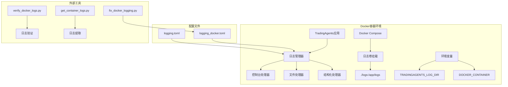
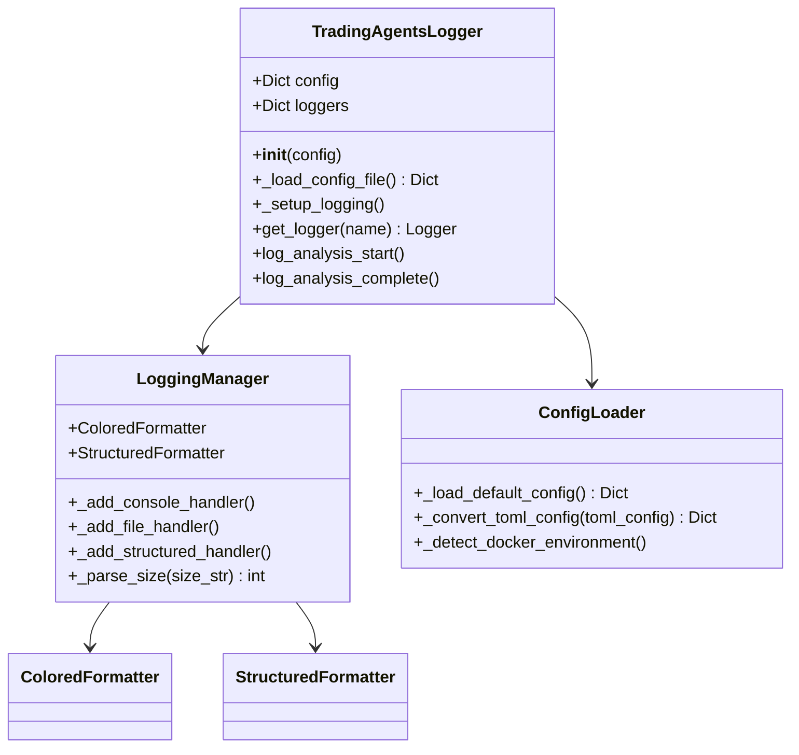
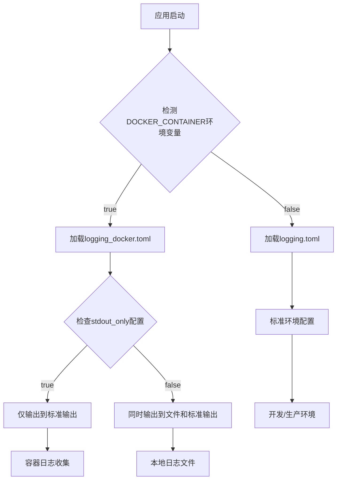
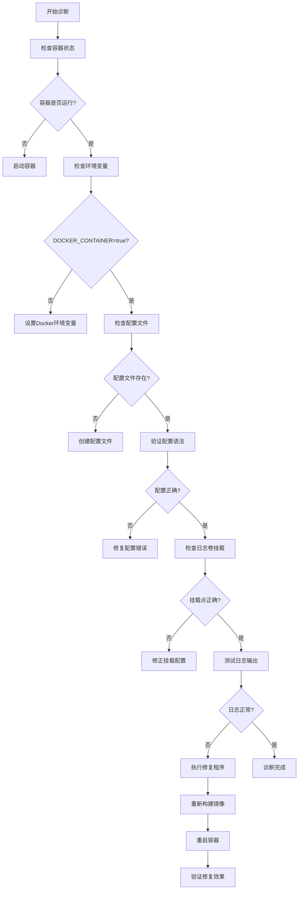
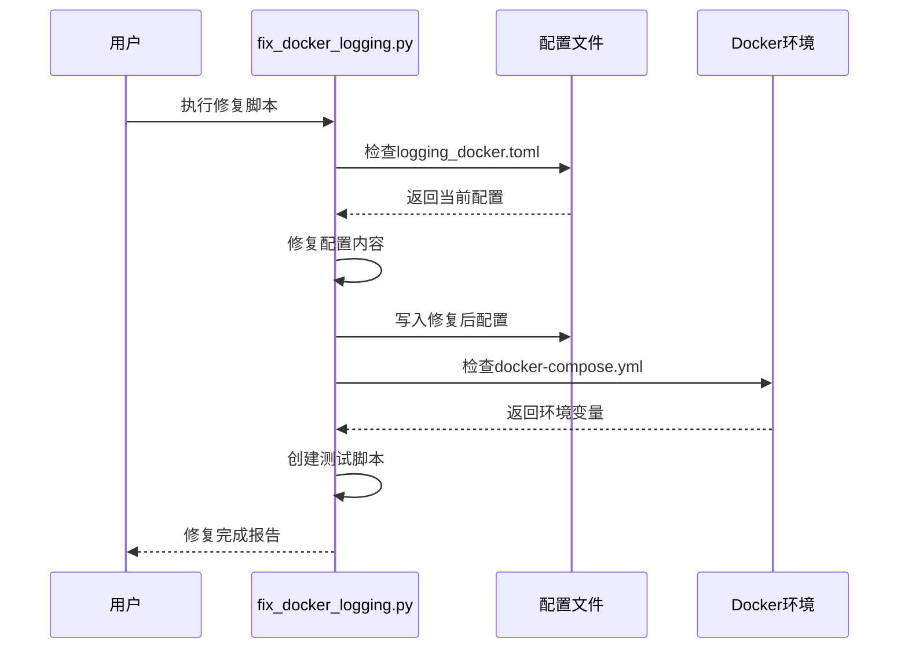
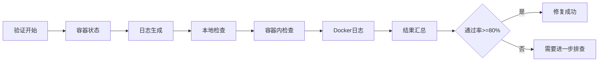
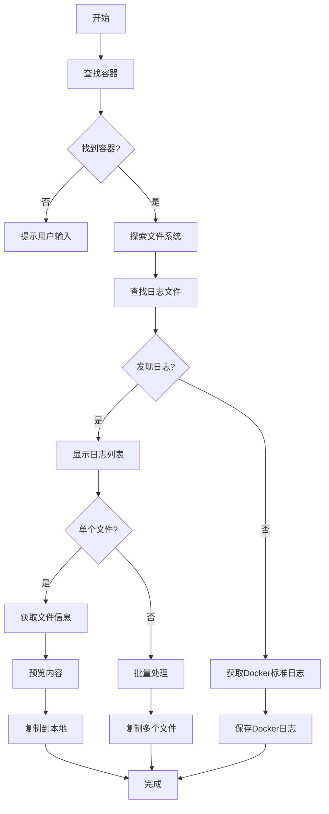

# Docker日志系统故障处理

<cite>
**本文档中引用的文件**
- [fix_docker_logging.py](file://scripts/fix_docker_logging.py)
- [verify_docker_logs.py](file://scripts/verify_docker_logs.py)
- [get_container_logs.py](file://scripts/get_container_logs.py)
- [logging_docker.toml](file://config/logging_docker.toml)
- [logging.toml](file://config/logging.toml)
- [logging_init.py](file://tradingagents/utils/logging_init.py)
- [logging_manager.py](file://tradingagents/utils/logging_manager.py)
- [docker-compose.yml](file://docker-compose.yml)
- [Dockerfile](file://Dockerfile)
- [debug_docker.sh](file://scripts/debug_docker.sh)
</cite>

## 目录
1. [简介](#简介)
2. [系统架构概览](#系统架构概览)
3. [核心组件分析](#核心组件分析)
4. [常见故障模式](#常见故障模式)
5. [故障诊断流程](#故障诊断流程)
6. [修复方案详解](#修复方案详解)
7. [配置文件说明](#配置文件说明)
8. [日志获取工具](#日志获取工具)
9. [最佳实践](#最佳实践)
10. [故障排除指南](#故障排除指南)

## 简介

TradingAgents-CN项目采用统一的日志管理系统，支持多种日志输出方式和环境配置。在Docker容器环境中，由于容器隔离特性，日志配置需要特别注意文件路径、权限和挂载点设置。本文档提供了完整的Docker日志系统故障处理方案，涵盖配置修复、验证测试和问题诊断等各个环节。

## 系统架构概览



**图表来源**
- [logging_manager.py](file://tradingagents/utils/logging_manager.py#L1-L50)
- [docker-compose.yml](file://docker-compose.yml#L1-L30)

## 核心组件分析

### 日志管理器架构



**图表来源**
- [logging_manager.py](file://tradingagents/utils/logging_manager.py#L60-L120)
- [logging_init.py](file://tradingagents/utils/logging_init.py#L15-L45)

### Docker环境特殊处理

系统能够自动检测Docker环境并应用相应的配置：



**图表来源**
- [logging_manager.py](file://tradingagents/utils/logging_manager.py#L130-L170)

**章节来源**
- [logging_manager.py](file://tradingagents/utils/logging_manager.py#L1-L100)
- [logging_init.py](file://tradingagents/utils/logging_init.py#L1-L50)

## 常见故障模式

### 1. 日志级别配置失效

**症状表现：**
- 日志输出不符合预期级别
- DEBUG级别日志未显示
- INFO级别日志过多

**根本原因：**
- 配置文件中日志级别设置错误
- 环境变量覆盖了配置文件设置
- Docker环境配置冲突

### 2. 日志文件路径错误

**症状表现：**
- 日志文件未生成
- 文件权限错误
- 路径不存在

**根本原因：**
- Docker卷挂载配置错误
- 容器内路径与主机路径不匹配
- 目录权限不足

### 3. KeyError: 'file'错误

**症状表现：**
- 应用启动时抛出KeyError异常
- 日志系统初始化失败

**根本原因：**
- 配置文件格式不完整
- 缺少必要的配置节
- TOML语法错误

### 4. 日志驱动配置问题

**症状表现：**
- Docker标准日志为空
- 日志丢失或重复
- 日志轮转失效

**根本原因：**
- Docker日志驱动配置不当
- 容器重启策略影响
- 日志选项参数错误

**章节来源**
- [fix_docker_logging.py](file://scripts/fix_docker_logging.py#L10-L50)
- [logging_manager.py](file://tradingagents/utils/logging_manager.py#L130-L170)

## 故障诊断流程

### 诊断检查清单



**图表来源**
- [verify_docker_logs.py](file://scripts/verify_docker_logs.py#L20-L80)
- [debug_docker.sh](file://scripts/debug_docker.sh#L1-L45)

### 自动化诊断工具

系统提供了完整的自动化诊断工具链：

| 工具名称 | 功能描述 | 使用场景 |
|---------|----------|----------|
| `verify_docker_logs.py` | 完整的日志功能验证 | 整体环境健康检查 |
| `get_container_logs.py` | 容器日志提取和分析 | 问题定位和日志收集 |
| `fix_docker_logging.py` | 自动修复日志配置 | 配置错误快速修复 |
| `debug_docker.sh` | Docker环境排查 | 基础设施问题诊断 |

**章节来源**
- [verify_docker_logs.py](file://scripts/verify_docker_logs.py#L1-L50)
- [get_container_logs.py](file://scripts/get_container_logs.py#L1-L50)

## 修复方案详解

### fix_docker_logging.py修复逻辑

该脚本专门针对Docker环境的日志配置问题提供自动化修复：

#### 核心修复功能

1. **配置文件修复**：自动修改logging_docker.toml中的关键配置
2. **环境变量检查**：验证docker-compose.yml中的环境变量设置
3. **测试脚本生成**：创建完整的日志功能测试脚本

#### 修复配置对比

| 配置项 | 修复前 | 修复后 | 说明 |
|--------|--------|--------|------|
| `stdout_only` | `true` | `false` | 允许同时输出到文件和控制台 |
| `disable_file_logging` | `true` | `false` | 启用文件日志记录 |
| `file.enabled` | `false` | `true` | 启用文件处理器 |
| `file.level` | 未设置 | `DEBUG` | 设置文件日志级别 |
| `file.max_size` | 未设置 | `100MB` | 设置文件大小限制 |
| `file.backup_count` | 未设置 | `5` | 设置备份文件数量 |

#### 修复流程图



**图表来源**
- [fix_docker_logging.py](file://scripts/fix_docker_logging.py#L10-L80)

**章节来源**
- [fix_docker_logging.py](file://scripts/fix_docker_logging.py#L1-L270)

### verify_docker_logs.py验证机制

该验证脚本提供全面的日志功能测试和验证：

#### 验证检查点

1. **容器状态检查**：确认TradingAgents-web容器正常运行
2. **日志生成测试**：在容器内触发日志写入操作
3. **本地日志检查**：验证主机上的日志文件生成
4. **容器内日志检查**：确认容器内的日志文件存在
5. **Docker标准日志检查**：验证Docker日志收集功能

#### 验证结果分析



**图表来源**
- [verify_docker_logs.py](file://scripts/verify_docker_logs.py#L180-L240)

**章节来源**
- [verify_docker_logs.py](file://scripts/verify_docker_logs.py#L1-L242)

## 配置文件说明

### logging_docker.toml配置详解

这是专门为Docker环境设计的日志配置文件，解决了KeyError: 'file'等常见问题：

#### 核心配置节

| 配置节 | 功能 | 关键参数 |
|--------|------|----------|
| `[logging]` | 全局日志设置 | `level` |
| `[logging.format]` | 日志格式定义 | `console`, `file`, `structured` |
| `[logging.handlers.console]` | 控制台输出 | `enabled`, `colored`, `level` |
| `[logging.handlers.file]` | 文件输出 | `enabled`, `level`, `max_size`, `backup_count`, `directory` |
| `[logging.handlers.structured]` | 结构化日志 | `enabled`, `level`, `directory` |
| `[logging.docker]` | Docker环境配置 | `enabled`, `stdout_only`, `disable_file_logging` |

#### Docker环境特殊配置

```toml
[logging.docker]
enabled = true
stdout_only = false  # 允许同时输出到文件和stdout
disable_file_logging = false  # 启用文件日志
```

#### 日志轮转配置

```toml
[logging.handlers.file]
enabled = true
level = "DEBUG"
max_size = "100MB"
backup_count = 5
directory = "/app/logs"
```

**章节来源**
- [logging_docker.toml](file://config/logging_docker.toml#L1-L100)

### logging.toml配置对比

标准配置文件适用于非Docker环境：

#### 主要差异

| 方面 | logging.toml | logging_docker.toml |
|------|-------------|-------------------|
| 日志目录 | `./logs` | `/app/logs` |
| stdout_only | `true` | `false` |
| disable_file_logging | `true` | `false` |
| 文件大小限制 | `10MB` | `100MB` |
| 备份文件数 | `5` | `5` |
| 结构化日志 | 默认关闭 | 默认开启 |

**章节来源**
- [logging.toml](file://config/logging.toml#L1-L111)

## 日志获取工具

### get_container_logs.py标准操作流程

该工具提供了完整的容器日志获取和分析功能：

#### 工具功能架构



**图表来源**
- [get_container_logs.py](file://scripts/get_container_logs.py#L100-L200)

#### 标准操作步骤

1. **容器发现**：自动查找TradingAgents容器
2. **文件系统探索**：扫描容器内的日志目录
3. **日志文件识别**：查找`.log`扩展名的文件
4. **信息收集**：获取文件大小、修改时间和行数
5. **内容预览**：显示文件最后几行内容
6. **本地复制**：将日志文件复制到主机

#### 使用示例

```bash
# 基本使用
python scripts/get_container_logs.py

# 手动指定容器
python scripts/get_container_logs.py --container TradingAgents-web

# 获取特定日志文件
python scripts/get_container_logs.py --file /app/logs/tradingagents.log
```

**章节来源**
- [get_container_logs.py](file://scripts/get_container_logs.py#L1-L274)

## 最佳实践

### Docker环境配置最佳实践

#### 1. 环境变量设置

```yaml
environment:
  # 日志级别配置
  TRADINGAGENTS_LOG_LEVEL: "INFO"
  # 日志目录配置
  TRADINGAGENTS_LOG_DIR: "/app/logs"
  # 日志文件配置
  TRADINGAGENTS_LOG_FILE: "/app/logs/tradingagents.log"
  # Docker环境标识
  DOCKER_CONTAINER: "true"
```

#### 2. 卷挂载配置

```yaml
volumes:
  # 日志目录映射
  - ./logs:/app/logs
  # 配置目录映射
  - ./config:/app/config
  # 数据目录映射
  - ./data:/app/data
```

#### 3. 日志驱动配置

```yaml
logging:
  driver: "json-file"
  options:
    max-size: "100m"
    max-file: "3"
```

### 日志级别配置策略

#### 开发环境

```toml
[logging]
level = "DEBUG"

[logging.handlers.console]
level = "DEBUG"

[logging.handlers.file]
level = "DEBUG"
```

#### 生产环境

```toml
[logging]
level = "INFO"

[logging.handlers.console]
level = "INFO"

[logging.handlers.file]
level = "WARNING"
```

### 性能优化建议

#### 1. 日志轮转配置

```toml
[logging.handlers.file]
max_size = "100MB"
backup_count = 5
```

#### 2. 结构化日志启用

```toml
[logging.handlers.structured]
enabled = true
level = "INFO"
```

#### 3. 性能监控配置

```toml
[logging.performance]
enabled = true
log_slow_operations = true
slow_threshold_seconds = 10.0
```

## 故障排除指南

### 常见问题快速解决方案

#### 问题1：日志文件未生成

**诊断步骤：**
1. 检查容器状态：`docker-compose ps`
2. 查看容器日志：`docker-compose logs web`
3. 验证配置文件：`cat config/logging_docker.toml`

**解决方案：**
```bash
# 1. 修复日志配置
python scripts/fix_docker_logging.py

# 2. 重新构建容器
docker-compose build web

# 3. 重启容器
docker-compose up -d web
```

#### 问题2：日志级别不生效

**诊断步骤：**
1. 检查环境变量：`docker exec TradingAgents-web env | grep LOG`
2. 验证配置文件：`docker exec TradingAgents-web cat /app/config/logging_docker.toml`

**解决方案：**
```bash
# 设置正确的日志级别
export TRADINGAGENTS_LOG_LEVEL=DEBUG

# 重启容器应用新配置
docker-compose restart web
```

#### 问题3：权限错误

**诊断步骤：**
1. 检查目录权限：`ls -la logs/`
2. 验证容器权限：`docker exec TradingAgents-web ls -la /app/logs/`

**解决方案：**
```bash
# 修复权限
chmod -R 755 logs/
chown -R $(id -u):$(id -g) logs/

# 或者在Docker中修复
docker exec TradingAgents-web chmod -R 755 /app/logs/
```

### 调试工具使用指南

#### 1. 完整诊断

```bash
# 运行完整诊断
python scripts/verify_docker_logs.py

# 查看详细结果
docker-compose logs web
```

#### 2. 实时监控

```bash
# 实时查看日志
tail -f logs/tradingagents.log

# 实时查看Docker日志
docker-compose logs -f web
```

#### 3. 问题重现

```bash
# 创建测试脚本
python scripts/test_docker_logging.py

# 检查测试结果
docker exec TradingAgents-web python test_docker_logging.py
```

### 紧急恢复程序

当遇到严重日志问题时，可以使用以下紧急恢复程序：

1. **临时配置恢复**：使用默认配置跳过损坏的配置文件
2. **容器重建**：完全重建容器以清除配置问题
3. **数据备份**：备份现有日志文件以防数据丢失
4. **降级模式**：启用基本的日志功能而不依赖复杂配置

**章节来源**
- [debug_docker.sh](file://scripts/debug_docker.sh#L1-L46)
- [verify_docker_logs.py](file://scripts/verify_docker_logs.py#L200-L242)

## 总结

Docker日志系统故障处理需要综合考虑容器环境特性、配置文件完整性、环境变量设置等多个方面。通过本文档提供的自动化工具、诊断流程和最佳实践，可以有效解决大部分Docker环境下的日志问题。

关键要点：
- 正确配置Docker卷挂载和环境变量
- 使用专门的Docker配置文件
- 定期验证日志功能
- 建立完善的日志监控机制
- 准备应急恢复方案

遵循这些指导原则，可以确保TradingAgents-CN项目在Docker环境中的日志系统稳定可靠地运行。