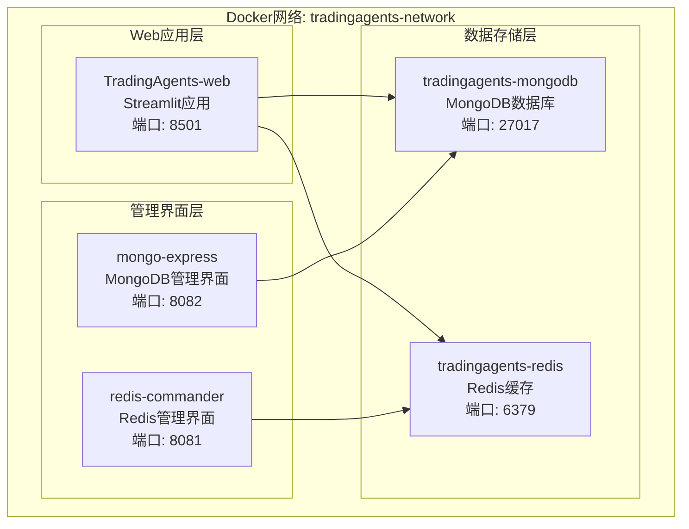
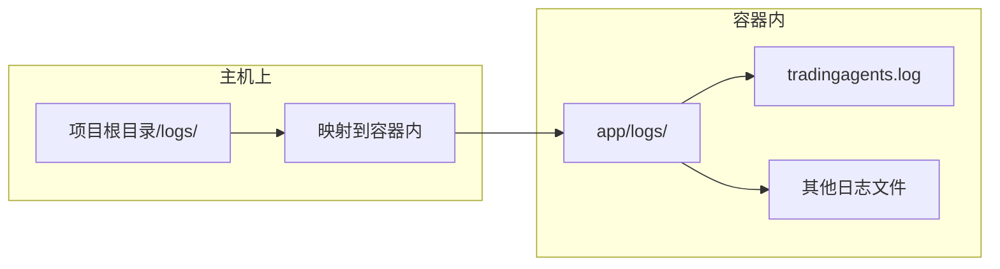
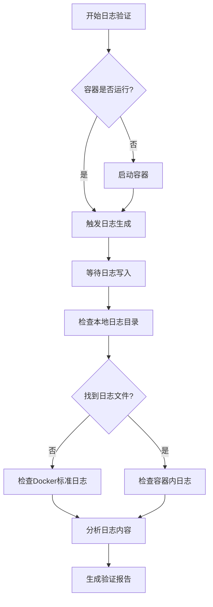
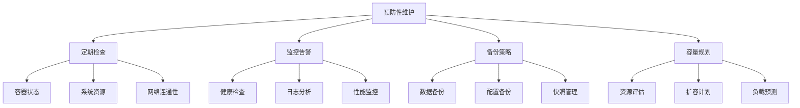
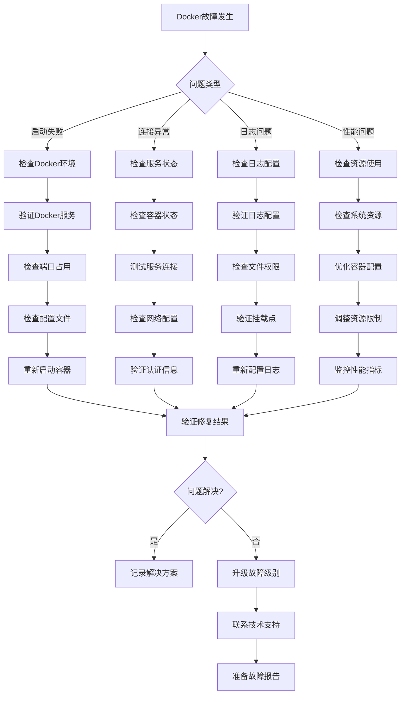

# Docker服务故障排除指南

<cite>
**本文档引用的文件**
- [docker-compose.yml](file://docker-compose.yml)
- [Dockerfile](file://Dockerfile)
- [scripts/docker/start_docker_services.sh](file://scripts/docker/start_docker_services.sh)
- [scripts/docker/stop_docker_services.sh](file://scripts/docker/stop_docker_services.sh)
- [scripts/docker/debug_docker.sh](file://scripts/debug_docker.sh)
- [scripts/docker/debug_docker.ps1](file://scripts/debug_docker.ps1)
- [scripts/fix_docker_logging.py](file://scripts/fix_docker_logging.py)
- [scripts/verify_docker_logs.py](file://scripts/verify_docker_logs.py)
- [scripts/get_container_logs.py](file://scripts/get_container_logs.py)
- [scripts/setup-docker.py](file://scripts/setup-docker.py)
- [config/logging_docker.toml](file://config/logging_docker.toml)
- [scripts/docker/README.md](file://scripts/docker/README.md)
</cite>

## 目录
1. [简介](#简介)
2. [Docker部署架构概览](#docker部署架构概览)
3. [常见故障类型及解决方案](#常见故障类型及解决方案)
4. [容器启动故障排除](#容器启动故障排除)
5. [服务连接异常诊断](#服务连接异常诊断)
6. [日志系统问题修复](#日志系统问题修复)
7. [网络连通性检查](#网络连通性检查)
8. [Docker诊断工具使用](#docker诊断工具使用)
9. [预防性维护建议](#预防性维护建议)
10. [故障排除流程图](#故障排除流程图)

## 简介

本指南提供了针对TradingAgents项目Docker部署的全面故障排除方法。涵盖了从容器启动到服务连接的各种常见问题，以及相应的诊断和修复方案。

## Docker部署架构概览

TradingAgents采用多容器架构，主要包含以下服务组件：



**图表来源**
- [docker-compose.yml](file://docker-compose.yml#L1-L159)

### 服务依赖关系

根据docker-compose.yml配置，各服务间的依赖关系如下：

| 服务 | 依赖服务 | 启动顺序 |
|------|----------|----------|
| web | mongodb, redis | 3 |
| redis-commander | redis | 2 |
| mongo-express | mongodb | 2 |

**章节来源**
- [docker-compose.yml](file://docker-compose.yml#L50-L159)

## 常见故障类型及解决方案

### 故障分类矩阵

| 故障类型 | 症状表现 | 可能原因 | 解决方案优先级 |
|----------|----------|----------|----------------|
| 容器启动失败 | 容器状态显示"Exited" | 配置错误、资源不足、端口冲突 | 高 |
| 服务连接异常 | 应用无法访问数据库/缓存 | 网络配置、服务未就绪、认证失败 | 高 |
| 日志缺失/异常 | 无日志文件或日志格式错误 | 日志配置、权限问题、挂载点错误 | 中 |
| 性能问题 | 响应缓慢、超时错误 | 资源限制、网络延迟、配置不当 | 中 |
| 数据持久化问题 | 数据丢失、卷挂载失败 | 卷配置、权限、存储空间 | 高 |

## 容器启动故障排除

### 1. 检查Docker环境状态

```bash
# Linux/macOS
./scripts/debug_docker.sh

# Windows PowerShell
.\scripts\debug_docker.ps1
```

**检查项目：**
- Docker服务是否正常运行
- docker-compose是否可用
- 系统资源是否充足

### 2. 查看容器状态

```bash
# 查看所有容器状态
docker-compose ps -a

# 查看特定容器详细信息
docker inspect TradingAgents-web
```

### 3. 检查容器日志

```bash
# 查看最近的容器日志
docker-compose logs --tail=50 web

# 实时监控日志
docker-compose logs -f web
```

### 4. 常见启动失败原因

#### a) 端口冲突

**症状：** 容器启动后立即退出，提示端口已被占用

**诊断：**
```bash
# 检查端口占用情况
netstat -an | grep :8501  # Windows
lsof -i :8501             # macOS/Linux
```

**解决方案：**
- 停止占用端口的进程
- 修改docker-compose.yml中的端口映射
- 使用不同的端口

#### b) 资源不足

**症状：** 容器启动失败，提示内存或CPU不足

**诊断：**
```bash
# 检查系统资源
docker stats
docker system df
```

**解决方案：**
- 增加Docker分配的内存和CPU
- 关闭不必要的Docker容器
- 清理未使用的Docker资源

#### c) 配置文件错误

**症状：** 容器启动但应用无法正常工作

**诊断：**
```bash
# 检查配置文件语法
docker-compose config

# 查看容器内的配置文件
docker exec TradingAgents-web ls -la /app/.env
```

**解决方案：**
- 验证.env文件格式
- 检查环境变量设置
- 确认API密钥配置

**章节来源**
- [scripts/debug_docker.sh](file://scripts/debug_docker.sh#L1-L45)
- [scripts/debug_docker.ps1](file://scripts/debug_docker.ps1#L1-L46)

## 服务连接异常诊断

### 1. MongoDB连接问题

#### a) 检查MongoDB服务状态

```bash
# 检查MongoDB容器状态
docker-compose ps | grep mongodb

# 进入MongoDB容器测试连接
docker exec -it tradingagents-mongodb mongo --username admin --password tradingagents123 --authenticationDatabase admin
```

#### b) 常见连接错误

| 错误信息 | 原因 | 解决方案 |
|----------|------|----------|
| Authentication failed | 用户名密码错误 | 检查环境变量配置 |
| connection refused | 服务未启动 | 等待服务启动或检查健康检查 |
| network unreachable | 网络配置问题 | 检查docker网络设置 |

### 2. Redis连接问题

#### a) 检查Redis服务状态

```bash
# 检查Redis容器状态
docker-compose ps | grep redis

# 测试Redis连接
docker exec -it tradingagents-redis redis-cli -a tradingagents123 ping
```

#### b) Redis管理界面访问

```bash
# 访问Redis Commander
# 地址: http://localhost:8081
# 默认连接: redis://localhost:6379
```

### 3. 服务间通信测试

```bash
# 从web容器测试MongoDB连接
docker exec TradingAgents-web mongo --host mongodb --username admin --password tradingagents123 --authenticationDatabase admin --eval "db.runCommand({ping: 1})"

# 从web容器测试Redis连接
docker exec TradingAgents-web redis-cli -h redis -a tradingagents123 ping
```

**章节来源**
- [docker-compose.yml](file://docker-compose.yml#L50-L120)

## 日志系统问题修复

### 1. 日志配置问题诊断

TradingAgents提供了专门的Docker日志修复工具：

```bash
# 修复Docker日志配置
python scripts/fix_docker_logging.py

# 验证日志功能
python scripts/verify_docker_logs.py
```

### 2. 日志配置文件结构

Docker环境使用专门的配置文件：`config/logging_docker.toml`

#### 核心配置项

| 配置项 | 默认值 | 说明 |
|--------|--------|------|
| handlers.file.enabled | true | 启用文件日志 |
| docker.stdout_only | false | 允许同时输出到文件和控制台 |
| docker.disable_file_logging | false | 不禁用文件日志 |
| handlers.file.max_size | "100MB" | 单个日志文件最大大小 |
| handlers.file.backup_count | 5 | 日志文件备份数量 |

### 3. 日志文件位置



**图表来源**
- [docker-compose.yml](file://docker-compose.yml#L15-L20)

### 4. 日志获取工具

使用专门的脚本获取容器内的日志文件：

```bash
# 获取容器日志
python scripts/get_container_logs.py
```

该工具提供以下功能：
- 自动查找TradingAgents容器
- 探索容器内的日志文件
- 复制日志文件到本地
- 查看Docker标准日志

### 5. 日志验证流程



**图表来源**
- [scripts/verify_docker_logs.py](file://scripts/verify_docker_logs.py#L1-L242)

**章节来源**
- [scripts/fix_docker_logging.py](file://scripts/fix_docker_logging.py#L1-L270)
- [scripts/verify_docker_logs.py](file://scripts/verify_docker_logs.py#L1-L242)
- [scripts/get_container_logs.py](file://scripts/get_container_logs.py#L1-L274)
- [config/logging_docker.toml](file://config/logging_docker.toml#L1-L74)

## 网络连通性检查

### 1. Docker网络状态检查

```bash
# 查看Docker网络
docker network ls | grep tradingagents

# 查看网络详细信息
docker network inspect tradingagents-network
```

### 2. 端口占用检查

```bash
# Linux/macOS
ports=(8501 27017 6379 8081 8082)
for port in "${ports[@]}"; do
    if lsof -i :$port > /dev/null 2>&1; then
        echo "端口 $port 被占用:"
        lsof -i :$port
    else
        echo "端口 $port 空闲"
    fi
done

# Windows
netstat -an | findstr :8501
```

### 3. 服务间连通性测试

```bash
# 从web容器测试MongoDB连接
docker exec TradingAgents-web curl -f http://mongodb:27017/

# 从web容器测试Redis连接
docker exec TradingAgents-web redis-cli -h redis -p 6379 ping

# 从主机测试web应用
curl -f http://localhost:8501/_stcore/health
```

### 4. 网络故障排除

| 问题类型 | 检查命令 | 解决方案 |
|----------|----------|----------|
| 网络不通 | `docker network connect` | 重新连接网络 |
| DNS解析失败 | `nslookup mongodb` | 检查DNS配置 |
| 防火墙阻止 | `iptables -L` | 配置防火墙规则 |
| 网络隔离 | `docker network prune` | 清理孤立网络 |

## Docker诊断工具使用

### 1. 系统资源监控

```bash
# 查看Docker系统信息
docker info

# 查看Docker磁盘使用情况
docker system df

# 查看容器资源使用
docker stats --no-stream
```

### 2. 容器健康检查

```bash
# 查看健康检查状态
docker inspect --format='{{json .State.Health}}' TradingAgents-web

# 手动触发健康检查
docker exec TradingAgents-web curl -f http://localhost:8501/_stcore/health
```

### 3. 配置验证

```bash
# 验证docker-compose配置
docker-compose config

# 检查环境变量
docker-compose exec web env | grep TRADINGAGENTS
```

### 4. 性能分析

```bash
# 查看容器进程
docker top TradingAgents-web

# 查看容器文件系统
docker exec TradingAgents-web df -h

# 查看容器网络接口
docker exec TradingAgents-web ip addr show
```

**章节来源**
- [scripts/debug_docker.sh](file://scripts/debug_docker.sh#L1-L45)
- [scripts/debug_docker.ps1](file://scripts/debug_docker.ps1#L1-L46)

## 预防性维护建议

### 1. 定期维护任务

| 维护项目 | 频率 | 操作步骤 |
|----------|------|----------|
| 日志清理 | 每周 | 删除超过备份数量的日志文件 |
| 镜像更新 | 每月 | docker-compose pull && docker-compose build |
| 磁盘空间检查 | 每天 | docker system df |
| 容器健康检查 | 实时 | docker-compose ps |
| 配置备份 | 每次修改 | 备份.env和docker-compose.yml |

### 2. 监控指标

```bash
# 监控脚本示例
#!/bin/bash
echo "=== Docker监控报告 ==="
echo "时间: $(date)"
echo ""
echo "容器状态:"
docker-compose ps --format "table {{.Name}}\t{{.Status}}\t{{.Ports}}"

echo ""
echo "系统资源:"
docker system df

echo ""
echo "网络状态:"
docker network ls | grep tradingagents
```

### 3. 备份策略

```bash
# 数据备份脚本
#!/bin/bash
BACKUP_DIR="backup/$(date +%Y%m%d_%H%M%S)"
mkdir -p $BACKUP_DIR

# 备份数据库
docker exec tradingagents-mongodb mongodump --out /backup/dump --archive --gzip

# 备份配置文件
cp docker-compose.yml $BACKUP_DIR/
cp .env $BACKUP_DIR/
cp -r config/ $BACKUP_DIR/

echo "备份完成: $BACKUP_DIR"
```

### 4. 性能优化建议

| 优化项目 | 配置建议 | 预期效果 |
|----------|----------|----------|
| 内存限制 | 设置合理的memory_limit | 防止内存溢出 |
| CPU限制 | 配置cpu_quota | 平衡系统负载 |
| 日志轮转 | 调整max_size和backup_count | 控制磁盘使用 |
| 网络模式 | 使用bridge而非host | 提高安全性 |
| 存储驱动 | 选择合适的存储驱动 | 优化I/O性能 |

### 5. 故障预防措施



## 故障排除流程图

以下是完整的Docker故障排除流程：



### 故障排除检查清单

#### 启动阶段检查清单
- [ ] Docker服务是否正常运行
- [ ] docker-compose是否正确安装
- [ ] 端口是否被占用
- [ ] 系统资源是否充足
- [ ] 配置文件语法是否正确

#### 运行阶段检查清单
- [ ] 容器状态是否正常
- [ ] 服务健康检查是否通过
- [ ] 网络连接是否通畅
- [ ] 数据库连接是否成功
- [ ] 缓存服务是否可用

#### 日志阶段检查清单
- [ ] 日志配置文件是否存在
- [ ] 日志文件是否正常生成
- [ ] 日志权限是否正确
- [ ] 日志轮转是否正常
- [ ] 日志内容是否完整

#### 性能阶段检查清单
- [ ] CPU使用率是否过高
- [ ] 内存使用是否合理
- [ ] 磁盘IO是否瓶颈
- [ ] 网络带宽是否充足
- [ ] 并发连接数是否正常

通过遵循本指南提供的故障排除方法和预防性维护建议，您可以有效地诊断和解决TradingAgents项目的Docker部署问题，确保系统的稳定性和可靠性。