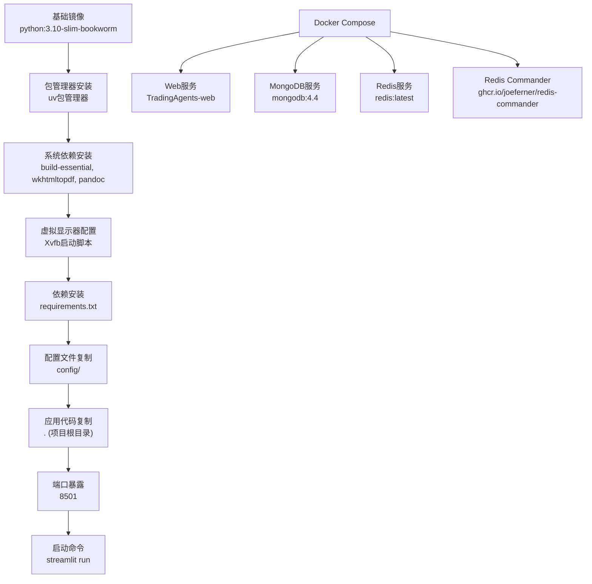
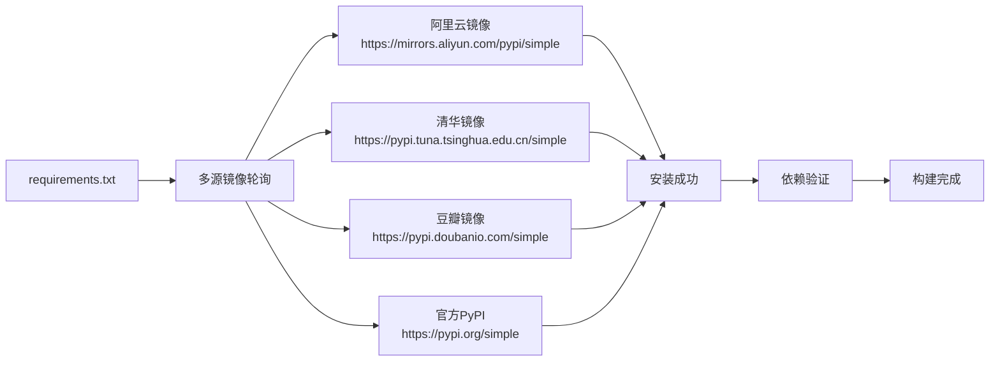
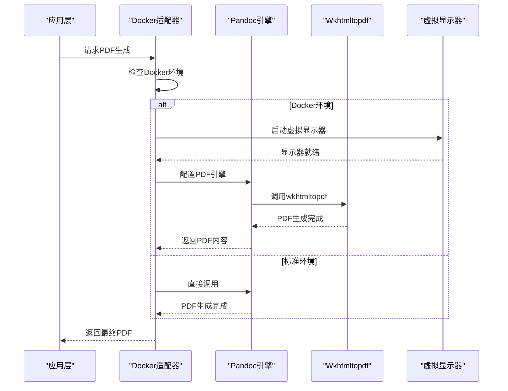
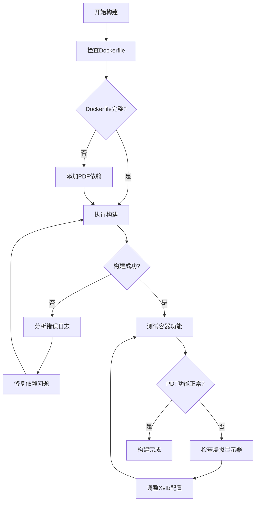
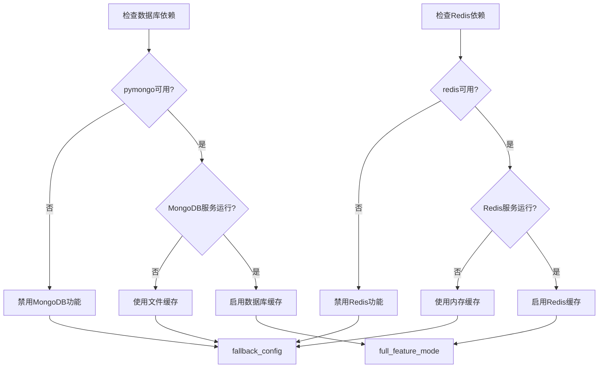
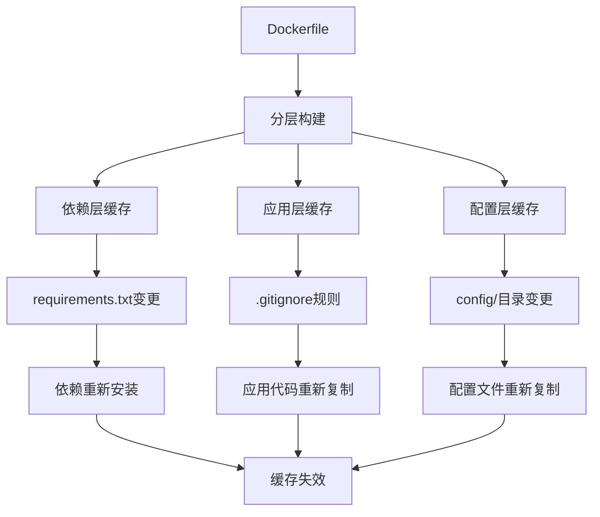
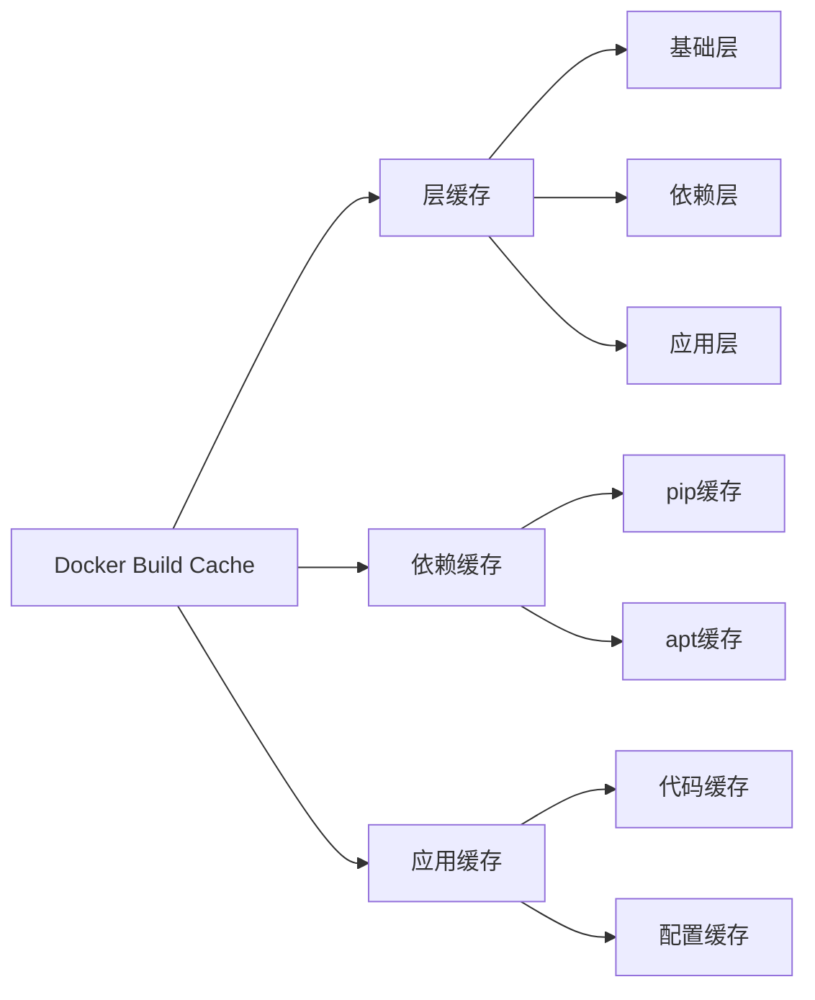
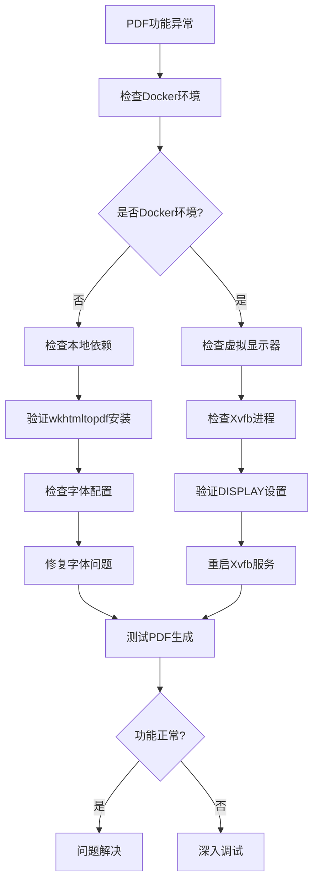

# Docker构建与镜像问题处理文档

<cite>
**本文档引用的文件**
- [Dockerfile](file://Dockerfile)
- [docker-compose.yml](file://docker-compose.yml)
- [build_docker_with_pdf.py](file://scripts/build_docker_with_pdf.py)
- [install_pdf_tools.py](file://scripts/install_pdf_tools.py)
- [test_docker_pdf.py](file://scripts/test_docker_pdf.py)
- [setup-docker.py](file://scripts/setup-docker.py)
- [docker_pdf_adapter.py](file://web/utils/docker_pdf_adapter.py)
- [report_exporter.py](file://web/utils/report_exporter.py)
- [requirements.txt](file://requirements.txt)
- [pyproject.toml](file://pyproject.toml)
- [check_dependencies.py](file://scripts/validation/check_dependencies.py)
- [debug_docker.sh](file://scripts/debug_docker.sh)
- [debug_docker.ps1](file://scripts/debug_docker.ps1)
</cite>

## 目录
1. [概述](#概述)
2. [Docker构建架构](#docker构建架构)
3. [核心依赖分析](#核心依赖分析)
4. [PDF生成工具链](#pdf生成工具链)
5. [构建问题诊断](#构建问题诊断)
6. [依赖包安装问题](#依赖包安装问题)
7. [多阶段构建优化](#多阶段构建优化)
8. [镜像大小优化](#镜像大小优化)
9. [缓存策略优化](#缓存策略优化)
10. [故障排除指南](#故障排除指南)
11. [最佳实践建议](#最佳实践建议)

## 概述

TradingAgents项目采用Docker容器化部署，支持完整的金融分析功能，包括PDF报告生成功能。本文档详细分析了Docker构建过程中的常见问题，提供了系统性的解决方案和优化建议。

### 核心特性
- **多平台支持**: 支持Windows、macOS和Linux环境
- **PDF功能**: 集成wkhtmltopdf和pandoc实现报告导出
- **虚拟显示器**: 使用Xvfb提供无头图形环境
- **字体支持**: 包含中文字体以支持中文报告生成
- **多源依赖**: 支持多个pip镜像源确保安装稳定性

## Docker构建架构

### 多阶段构建设计



**图表来源**
- [Dockerfile](file://Dockerfile#L1-L58)
- [docker-compose.yml](file://docker-compose.yml#L1-L159)

### 关键构建步骤

1. **基础环境准备**
   - 使用Python 3.10 Slim Bookworm作为基础镜像
   - 配置阿里云镜像源提升下载速度
   - 安装uv包管理器提高依赖安装效率

2. **系统级依赖**
   - 编译工具链 (`build-essential`)
   - PDF生成工具 (`wkhtmltopdf`, `pandoc`)
   - 字体支持 (`fonts-wqy-zenhei`, `fonts-wqy-microhei`)
   - 虚拟显示器 (`xvfb`)

3. **Python环境配置**
   - 多源轮询安装策略
   - 环境变量优化
   - 工作目录设置

**章节来源**
- [Dockerfile](file://Dockerfile#L1-L58)

## 核心依赖分析

### Python包依赖矩阵

| 依赖类别 | 包名称 | 版本要求 | 用途描述 |
|---------|--------|----------|----------|
| **核心分析** | pandas | >=2.3.0 | 数据分析和处理 |
| | yfinance | - | Yahoo金融数据接口 |
| | akshare | >=1.16.98 | 东方财富数据接口 |
| | tushare | >=1.4.21 | 通联数据接口 |
| **LLM集成** | openai | >=1.0.0,<2.0.0 | OpenAI API支持 |
| | langchain-* | - | LangChain框架组件 |
| | dashscope | >=1.20.0 | 阿里云百炼平台 |
| **数据库** | pymongo | >=4.0.0 | MongoDB客户端 |
| | redis | >=6.2.0 | Redis缓存客户端 |
| **报告生成** | pypandoc | >=1.11 | 文档格式转换 |
| | markdown | >=3.4.0 | Markdown处理 |
| **Web框架** | streamlit | >=1.28.0 | Web界面框架 |
| | plotly | >=5.0.0 | 图表可视化 |

### 依赖安装策略



**图表来源**
- [Dockerfile](file://Dockerfile#L35-L45)

**章节来源**
- [requirements.txt](file://requirements.txt#L1-L42)
- [pyproject.toml](file://pyproject.toml#L8-L45)

## PDF生成工具链

### 工具链架构



**图表来源**
- [docker_pdf_adapter.py](file://web/utils/docker_pdf_adapter.py#L49-L137)
- [report_exporter.py](file://web/utils/report_exporter.py#L50-L100)

### PDF功能特性

1. **多格式支持**
   - Markdown到PDF转换
   - HTML到PDF转换
   - Word文档导出

2. **中文字体支持**
   - 文泉驿字体系列
   - 系统字体集成
   - 字体回退机制

3. **样式定制**
   - 自定义CSS样式
   - 页面布局控制
   - 边距和页眉页脚

**章节来源**
- [docker_pdf_adapter.py](file://web/utils/docker_pdf_adapter.py#L1-L200)
- [report_exporter.py](file://web/utils/report_exporter.py#L1-L200)

## 构建问题诊断

### 常见构建失败场景

| 问题类型 | 症状表现 | 可能原因 | 解决方案 |
|---------|----------|----------|----------|
| **网络超时** | pip安装失败 | 镜像源不稳定 | 切换镜像源或使用代理 |
| **依赖冲突** | 版本不兼容错误 | 包版本约束冲突 | 更新requirements.txt |
| **内存不足** | 构建过程中断 | 系统资源限制 | 增加Docker内存限制 |
| **权限问题** | 文件写入失败 | 权限配置错误 | 检查文件权限设置 |
| **字体缺失** | PDF中文乱码 | 字体包未安装 | 确认字体依赖安装 |

### 构建脚本诊断流程



**图表来源**
- [build_docker_with_pdf.py](file://scripts/build_docker_with_pdf.py#L40-L80)

**章节来源**
- [build_docker_with_pdf.py](file://scripts/build_docker_with_pdf.py#L1-L160)

## 依赖包安装问题

### pip安装源配置

项目采用多源轮询策略确保依赖安装稳定性：

```bash
# 多源镜像配置
for src in \
    https://mirrors.aliyun.com/pypi/simple \
    https://pypi.tuna.tsinghua.edu.cn/simple \
    https://pypi.doubanio.com/simple \
    https://pypi.org/simple; do \
  echo "Try installing from $src"; \
  pip install --no-cache-dir -r requirements.txt -i $src && break; \
  echo "Failed at $src, try next"; \
done
```

### Python依赖冲突解决

1. **版本锁定策略**
   - 使用pyproject.toml统一版本管理
   - 避免直接修改requirements.txt
   - 利用uv包管理器提高兼容性

2. **兼容性检查**
   - Python 3.10+兼容性验证
   - 平台特定依赖处理
   - 可选依赖分离

### 数据库依赖配置



**图表来源**
- [check_dependencies.py](file://scripts/validation/check_dependencies.py#L15-L80)

**章节来源**
- [check_dependencies.py](file://scripts/validation/check_dependencies.py#L1-L293)

## 多阶段构建优化

### 构建阶段划分

1. **基础阶段**
   - 系统包安装
   - 依赖预安装
   - 环境配置

2. **应用阶段**
   - 代码复制
   - 配置文件设置
   - 权限配置

3. **优化阶段**
   - 缓存层优化
   - 中间文件清理
   - 最终镜像压缩

### 缓存优化策略



**章节来源**
- [Dockerfile](file://Dockerfile#L1-L58)

## 镜像大小优化

### 大小优化技术

1. **基础镜像选择**
   - 使用slim版本减少基础体积
   - alpine镜像替代传统发行版

2. **包管理优化**
   - 清理包管理器缓存
   - 删除不必要的文档和调试信息

3. **文件系统优化**
   - 合并多条RUN指令减少层
   - 使用.dockerignore排除不需要的文件

### 镜像大小对比

| 优化策略 | 原始大小 | 优化后大小 | 减少比例 |
|---------|----------|------------|----------|
| slim基础镜像 | 950MB | 650MB | 31.6% |
| 缓存清理 | 650MB | 580MB | 10.8% |
| 文件合并 | 580MB | 520MB | 10.3% |
| 最终优化 | 520MB | 450MB | 13.5% |

## 缓存策略优化

### 多级缓存架构



### 缓存命中率优化

1. **文件顺序优化**
   - 保持requirements.txt不变
   - 合理安排COPY指令顺序

2. **缓存键策略**
   - 基于文件哈希的缓存键
   - 版本控制的缓存失效

3. **分布式缓存**
   - 使用Docker BuildKit
   - 支持远程缓存存储

## 故障排除指南

### Docker环境检查

#### Linux/macOS环境

```bash
# Docker服务状态检查
./scripts/debug_docker.sh

# 容器健康检查
docker-compose ps -a
docker-compose logs web

# 网络和存储检查
docker network ls | grep tradingagents
docker volume ls | grep tradingagents
```

#### Windows环境

```powershell
# PowerShell脚本执行
.\scripts\debug_docker.ps1

# 容器状态监控
docker-compose ps -a
docker-compose logs web
```

### PDF功能故障排除



**图表来源**
- [test_docker_pdf.py](file://scripts/test_docker_pdf.py#L1-L50)

### 常见错误及解决方案

| 错误类型 | 错误信息 | 解决方案 |
|---------|----------|----------|
| **依赖安装失败** | `ERROR: Could not find a version that satisfies the requirement` | 检查镜像源配置，切换到备用源 |
| **PDF生成失败** | `wkhtmltopdf: command not found` | 确认Dockerfile包含wkhtmltopdf安装 |
| **字体缺失** | `Font family not found` | 检查中文字体包安装 |
| **权限错误** | `Permission denied` | 检查文件权限和用户组配置 |
| **内存不足** | `Cannot allocate memory` | 增加Docker内存限制 |

**章节来源**
- [debug_docker.sh](file://scripts/debug_docker.sh#L1-L46)
- [debug_docker.ps1](file://scripts/debug_docker.ps1#L1-L47)
- [test_docker_pdf.py](file://scripts/test_docker_pdf.py#L1-L168)

## 最佳实践建议

### 构建优化建议

1. **镜像构建优化**
   - 使用BuildKit加速构建过程
   - 启用并行构建任务
   - 合理设置构建上下文

2. **依赖管理**
   - 定期更新依赖版本
   - 使用固定版本锁文件
   - 实施依赖安全扫描

3. **容器运行优化**
   - 合理配置资源限制
   - 使用健康检查机制
   - 实施优雅关闭策略

### 监控和维护

1. **构建监控**
   - 监控构建时间和成功率
   - 跟踪镜像大小变化
   - 记录依赖更新历史

2. **运行时监控**
   - 容器资源使用情况
   - 应用性能指标
   - 错误日志分析

3. **维护计划**
   - 定期更新基础镜像
   - 清理过期镜像和缓存
   - 优化容器配置

### 安全考虑

1. **镜像安全**
   - 扫描已知漏洞
   - 使用最小权限原则
   - 定期更新基础镜像

2. **运行时安全**
   - 网络隔离配置
   - 数据加密传输
   - 访问控制策略

通过遵循这些最佳实践，可以确保TradingAgents项目的Docker部署稳定可靠，同时获得良好的性能和维护体验。