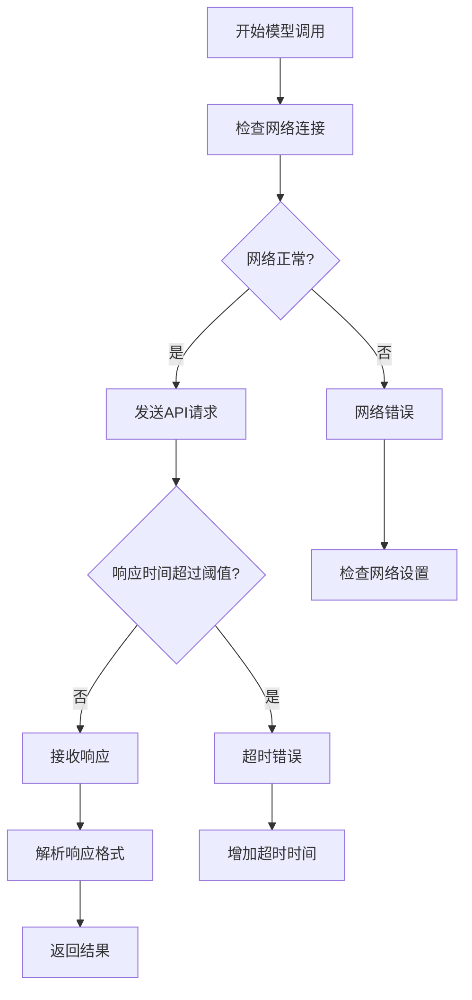
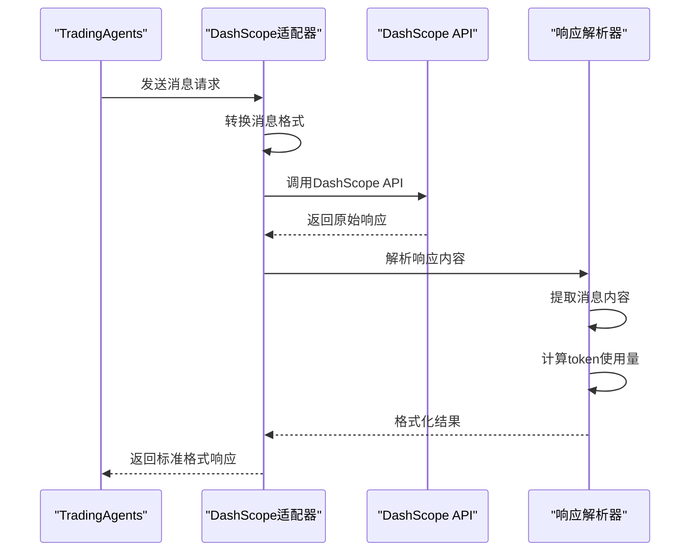
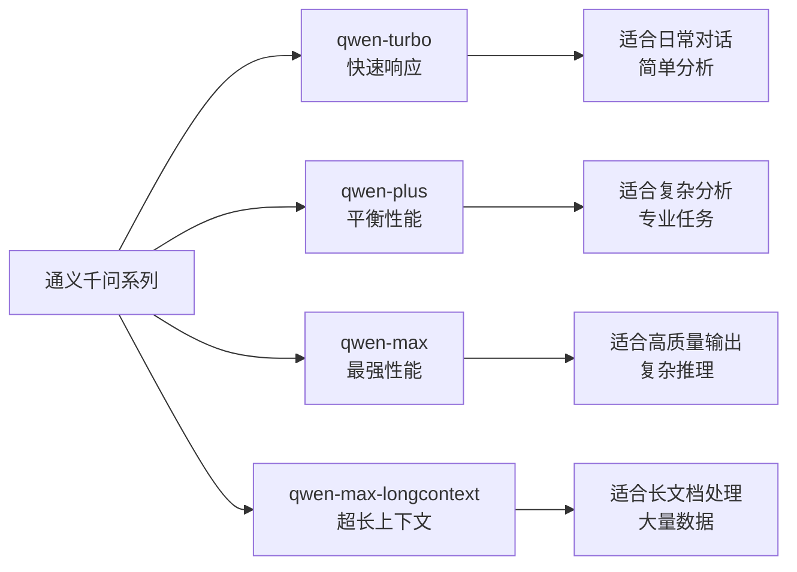
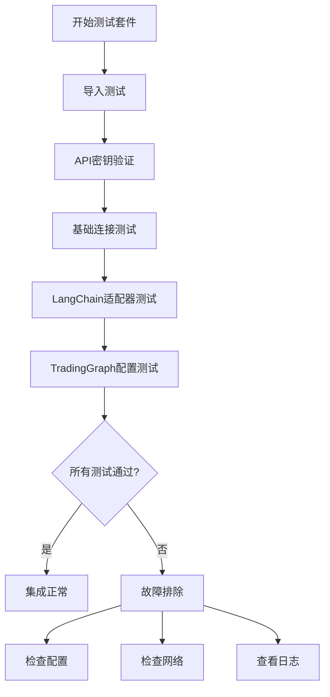
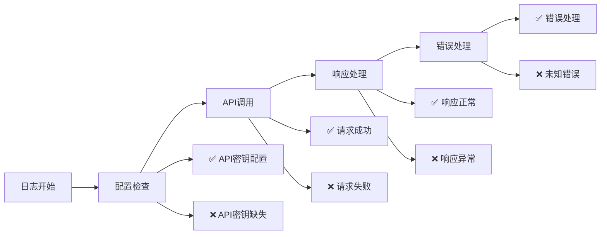
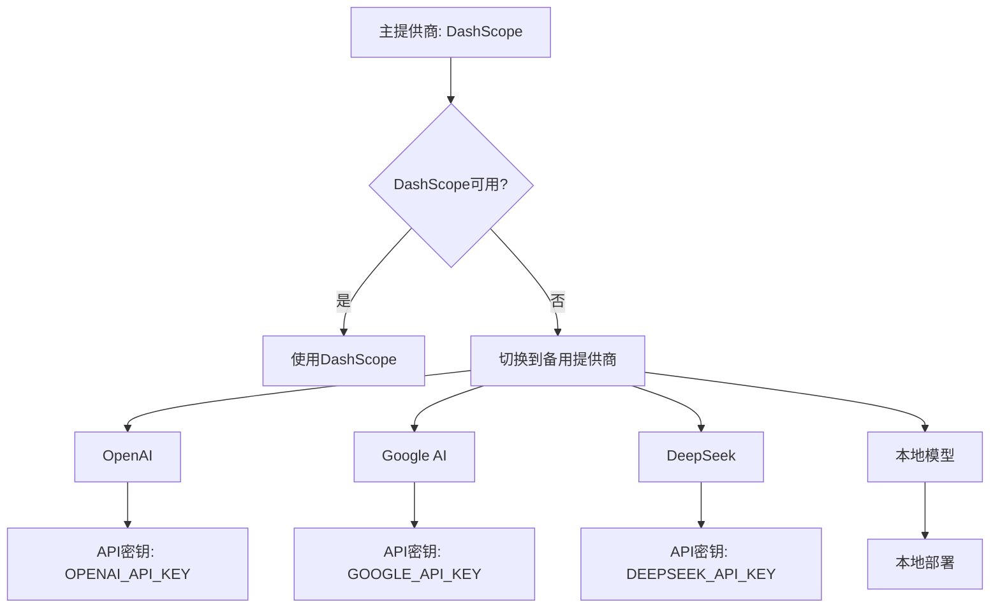
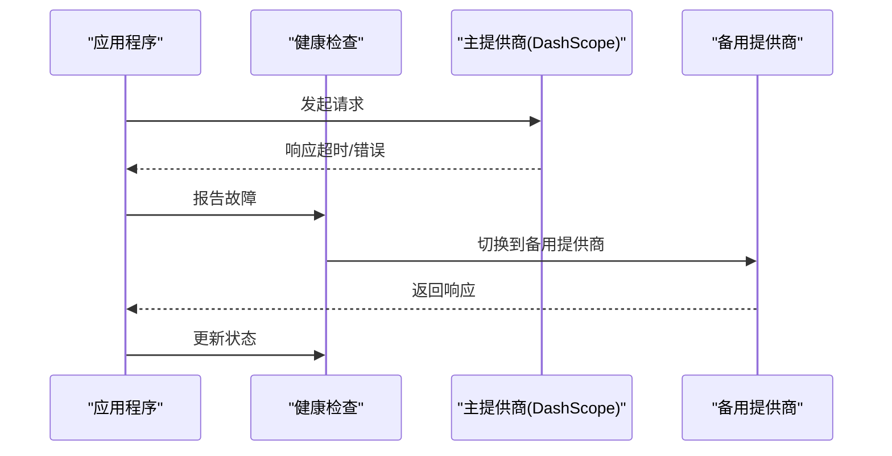

# DashScope集成问题故障排除指南

<cite>
**本文档引用的文件**
- [demo_dashscope.py](file://examples/dashscope_examples/demo_dashscope.py)
- [demo_dashscope_chinese.py](file://examples/dashscope_examples/demo_dashscope_chinese.py)
- [demo_dashscope_no_memory.py](file://examples/dashscope_examples/demo_dashscope_no_memory.py)
- [demo_dashscope_simple.py](file://examples/dashscope_examples/demo_dashscope_simple.py)
- [dashscope_adapter.py](file://tradingagents/llm_adapters/dashscope_adapter.py)
- [dashscope_openai_adapter.py](file://tradingagents/llm_adapters/dashscope_openai_adapter.py)
- [test_dashscope_integration.py](file://tests/integration/test_dashscope_integration.py)
- [check_api_config.py](file://scripts/check_api_config.py)
- [default_config.py](file://tradingagents/default_config.py)
- [logging.toml](file://config/logging.toml)
</cite>

## 目录
1. [简介](#简介)
2. [API密钥配置问题](#api密钥配置问题)
3. [模型调用超时问题](#模型调用超时问题)
4. [响应格式不兼容问题](#响应格式不兼容问题)
5. [适配器配置详解](#适配器配置详解)
6. [连接测试方法](#连接测试方法)
7. [日志分析与调试](#日志分析与调试)
8. [降级配置方案](#降级配置方案)
9. [常见错误及解决方案](#常见错误及解决方案)
10. [最佳实践建议](#最佳实践建议)

## 简介

DashScope（阿里百炼）是阿里巴巴推出的大规模语言模型服务平台，为TradingAgents提供了强大的中文理解和金融分析能力。本指南将帮助您解决DashScope集成过程中的常见问题，包括API密钥验证、模型调用超时、响应格式兼容性等问题。

## API密钥配置问题

### 问题描述

最常见的DashScope集成问题是API密钥配置错误或无效，导致认证失败。

### 诊断步骤

1. **检查环境变量设置**
   ```bash
   # Windows
   set DASHSCOPE_API_KEY=your_api_key
   
   # Linux/Mac
   export DASHSCOPE_API_KEY=your_api_key
   ```

2. **验证密钥格式**
   - 确保密钥以`sk-`开头
   - 长度通常为51个字符
   - 不包含特殊字符（除了连字符）

3. **使用配置检查工具**
   ```bash
   python scripts/check_api_config.py
   ```

### 常见错误及解决方案

| 错误信息 | 原因 | 解决方案 |
|---------|------|----------|
| `DashScope API key not found` | 环境变量未设置 | 设置DASHSCOPE_API_KEY环境变量 |
| `Invalid API key` | 密钥格式错误 | 检查密钥格式，确保以sk-开头 |
| `Authentication failed` | 密钥无效或过期 | 重新获取有效密钥 |

**章节来源**
- [check_api_config.py](file://scripts/check_api_config.py#L25-L60)
- [demo_dashscope.py](file://examples/dashscope_examples/demo_dashscope.py#L30-L50)

## 模型调用超时问题

### 问题表现

模型调用长时间无响应，最终超时失败。

### 超时配置分析



**图表来源**
- [dashscope_adapter.py](file://tradingagents/llm_adapters/dashscope_adapter.py#L120-L180)

### 超时问题解决方案

1. **调整超时参数**
   ```python
   # 在配置中设置合理的超时时间
   config = {
       "llm_provider": "dashscope",
       "deep_think_llm": "qwen-plus",
       "quick_think_llm": "qwen-turbo",
       "timeout": 30,  # 设置超时时间为30秒
       "max_retries": 3  # 设置最大重试次数
   }
   ```

2. **网络连接检查**
   - 确保网络稳定
   - 检查防火墙设置
   - 验证DNS解析

3. **降级策略**
   - 使用更小的模型（如qwen-turbo）
   - 减少max_tokens参数
   - 禁用不必要的功能

**章节来源**
- [dashscope_adapter.py](file://tradingagents/llm_adapters/dashscope_adapter.py#L120-L180)

## 响应格式不兼容问题

### 问题描述

DashScope API响应格式与TradingAgents期望的格式不匹配。

### 格式转换机制



**图表来源**
- [dashscope_adapter.py](file://tradingagents/llm_adapters/dashscope_adapter.py#L80-L120)

### 响应格式处理

1. **消息格式转换**
   - 将LangChain消息格式转换为DashScope格式
   - 处理多模态内容（目前只提取文本）
   - 保持消息角色映射

2. **响应解析**
   - 提取模型生成的内容
   - 解析token使用统计
   - 处理错误响应

3. **工具调用支持**
   - 支持OpenAI格式的工具调用
   - 提供备用工具转换机制
   - 验证工具调用响应

**章节来源**
- [dashscope_adapter.py](file://tradingagents/llm_adapters/dashscope_adapter.py#L80-L150)

## 适配器配置详解

### ChatDashScope适配器

这是直接调用DashScope API的适配器，提供完整的功能支持。

#### 核心配置参数

| 参数 | 类型 | 默认值 | 描述 |
|------|------|--------|------|
| model | str | "qwen-turbo" | 使用的模型名称 |
| api_key | SecretStr | None | API密钥 |
| temperature | float | 0.1 | 生成温度 |
| max_tokens | int | 2000 | 最大生成token数 |
| top_p | float | 0.9 | 核采样参数 |

#### 支持的模型



**图表来源**
- [dashscope_adapter.py](file://tradingagents/llm_adapters/dashscope_adapter.py#L200-L250)

### ChatDashScopeOpenAI适配器

利用DashScope的OpenAI兼容接口，支持原生Function Calling。

#### OpenAI兼容特性

- 支持原生Function Calling
- 完全兼容OpenAI SDK
- 更好的工具调用支持
- 更高的性能

**章节来源**
- [dashscope_openai_adapter.py](file://tradingagents/llm_adapters/dashscope_openai_adapter.py#L20-L60)

## 连接测试方法

### 基础连接测试

```python
# 使用集成测试脚本
python tests/integration/test_dashscope_integration.py

# 或使用专门的测试函数
from tradingagents.llm_adapters import ChatDashScope
from langchain_core.messages import HumanMessage

# 创建测试实例
llm = ChatDashScope(model="qwen-turbo")

# 发送测试消息
response = llm.invoke([HumanMessage(content="你好，请回复'连接成功'")])
print(f"测试结果: {response.content}")
```

### 功能测试套件



**图表来源**
- [test_dashscope_integration.py](file://tests/integration/test_dashscope_integration.py#L20-L80)

### 测试命令参考

| 测试类型 | 命令 | 描述 |
|---------|------|------|
| 基础连接 | `python -m tests.integration.test_dashscope_integration` | 完整集成测试 |
| 简单测试 | `python examples/dashscope_examples/demo_dashscope_simple.py` | 快速功能验证 |
| 中文测试 | `python examples/dashscope_examples/demo_dashscope_chinese.py` | 中文功能测试 |
| 无记忆测试 | `python examples/dashscope_examples/demo_dashscope_no_memory.py` | 兼容性测试 |

**章节来源**
- [test_dashscope_integration.py](file://tests/integration/test_dashscope_integration.py#L100-L180)

## 日志分析与调试

### 日志配置

DashScope集成使用统一的日志系统，支持多种输出格式。

#### 日志级别配置

```toml
[logging]
level = "INFO"

[logging.loggers.llm_adapters]
level = "DEBUG"  # 启用详细日志

[logging.loggers.tradingagents]
level = "INFO"
```

#### 关键日志信息

1. **API密钥验证**
   ```
   ✅ DASHSCOPE_API_KEY已配置: sk-...
   ```

2. **模型初始化**
   ```
   ✅ 模型初始化成功!
   ```

3. **API调用**
   ```
   ✅ DashScope API调用成功: 200
   ```

4. **错误信息**
   ```
   ❌ DashScope API error: 401 - Authentication failed
   ```

### 常见日志模式



**图表来源**
- [logging.toml](file://config/logging.toml#L40-L80)

### 调试技巧

1. **启用详细日志**
   ```python
   import logging
   logging.getLogger('tradingagents.llm_adapters').setLevel(logging.DEBUG)
   ```

2. **检查日志文件**
   - 主日志文件：`./logs/tradingagents.log`
   - 结构化日志：`./logs/tradingagents_structured.log`

3. **分析错误模式**
   - 认证错误：检查API密钥
   - 网络错误：检查网络连接
   - 格式错误：检查消息格式

**章节来源**
- [logging.toml](file://config/logging.toml#L20-L60)

## 降级配置方案

### 备用LLM提供商

当DashScope出现问题时，可以配置其他LLM提供商作为备用。

#### 支持的备用提供商



#### 配置示例

```python
# 默认配置（DashScope）
DEFAULT_CONFIG = {
    "llm_provider": "dashscope",
    "deep_think_llm": "qwen-plus",
    "quick_think_llm": "qwen-turbo",
    "backend_url": "https://dashscope.aliyuncs.com/api/v1"
}

# OpenAI备用配置
ALTERNATIVE_CONFIG = {
    "llm_provider": "openai",
    "deep_think_llm": "gpt-4o-mini",
    "quick_think_llm": "gpt-4o-mini",
    "backend_url": "https://api.openai.com/v1"
}
```

### 自动降级机制



**图表来源**
- [default_config.py](file://tradingagents/default_config.py#L10-L20)

### 降级配置最佳实践

1. **配置多个提供商**
   ```python
   # 在.env文件中配置多个提供商
   DASHSCOPE_API_KEY=your_sk_key
   OPENAI_API_KEY=your_openai_key
   ```

2. **设置降级优先级**
   ```python
   FALLBACK_PROVIDERS = [
       {"provider": "dashscope", "priority": 1},
       {"provider": "openai", "priority": 2},
       {"provider": "deepseek", "priority": 3}
   ]
   ```

3. **监控和自动切换**
   - 定期健康检查
   - 自动故障转移
   - 性能监控

**章节来源**
- [default_config.py](file://tradingagents/default_config.py#L10-L25)

## 常见错误及解决方案

### 认证错误

#### 错误信息
```
ValueError: DashScope API key not found
```

#### 解决方案
1. 检查环境变量设置
2. 验证API密钥格式
3. 确认密钥有效性

### 网络超时错误

#### 错误信息
```
TimeoutError: Request timed out
```

#### 解决方案
1. 增加超时时间设置
2. 检查网络连接稳定性
3. 使用更快的模型

### 响应格式错误

#### 错误信息
```
AttributeError: 'NoneType' object has no attribute 'content'
```

#### 解决方案
1. 检查API响应格式
2. 验证消息转换逻辑
3. 更新适配器版本

### 工具调用失败

#### 错误信息
```
Function calling not supported
```

#### 解决方案
1. 使用OpenAI兼容适配器
2. 检查模型支持的功能
3. 更新工具定义格式

**章节来源**
- [dashscope_adapter.py](file://tradingagents/llm_adapters/dashscope_adapter.py#L40-L80)
- [dashscope_openai_adapter.py](file://tradingagents/llm_adapters/dashscope_openai_adapter.py#L180-L220)

## 最佳实践建议

### 配置优化

1. **模型选择策略**
   - 日常任务：qwen-turbo
   - 复杂分析：qwen-plus
   - 高质量输出：qwen-max

2. **参数调优**
   ```python
   # 推荐配置
   model_config = {
       "temperature": 0.1,  # 降低随机性
       "max_tokens": 2000,  # 控制输出长度
       "top_p": 0.9,        # 核采样
       "timeout": 30        # 合理超时
   }
   ```

3. **资源管理**
   - 监控token使用量
   - 设置使用上限
   - 定期清理缓存

### 开发建议

1. **渐进式集成**
   - 先测试基础功能
   - 再测试高级功能
   - 最后测试完整流程

2. **错误处理**
   ```python
   try:
       response = llm.invoke(messages)
   except Exception as e:
       logger.error(f"DashScope调用失败: {e}")
       # 实施降级策略
       fallback_response = use_alternative_provider(messages)
   ```

3. **性能监控**
   - 记录响应时间
   - 监控错误率
   - 分析使用模式

### 生产环境部署

1. **安全配置**
   - 使用环境变量存储密钥
   - 启用HTTPS通信
   - 定期更新密钥

2. **监控告警**
   - 设置可用性监控
   - 配置错误告警
   - 监控使用量

3. **备份策略**
   - 配置多个提供商
   - 实施自动故障转移
   - 定期备份配置

通过遵循这些最佳实践，您可以确保DashScope集成的稳定性和可靠性，同时获得最佳的性能和用户体验。