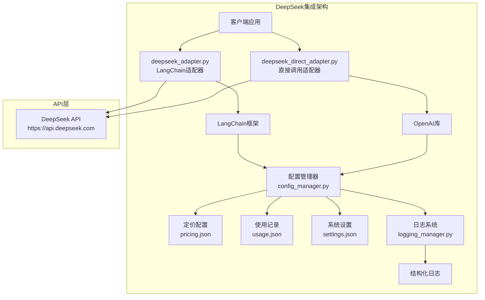
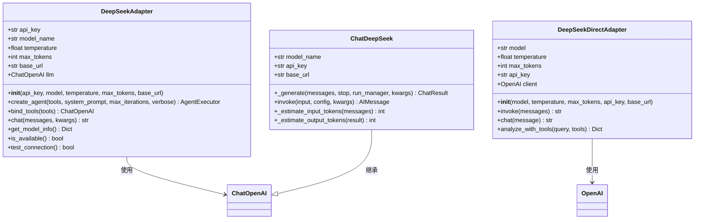
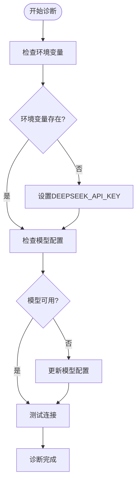
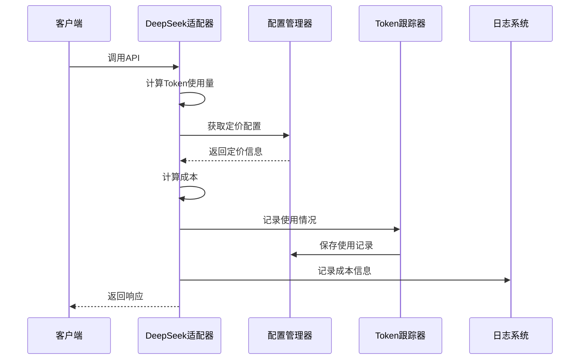
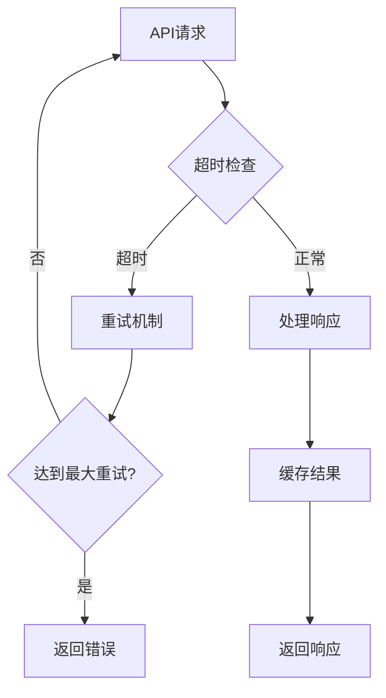
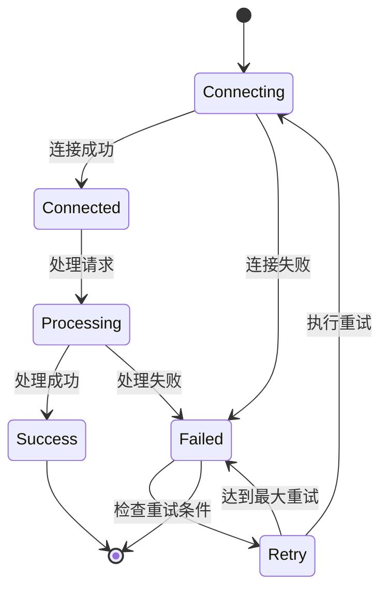
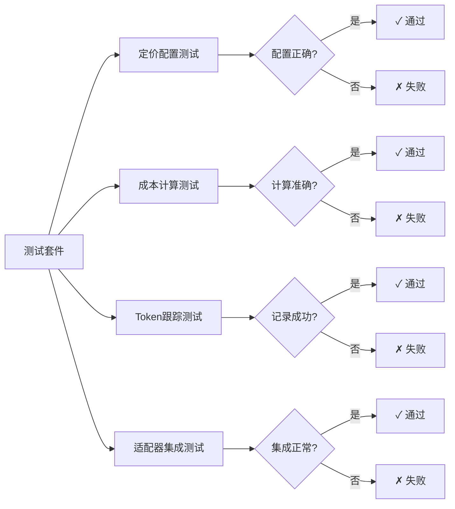
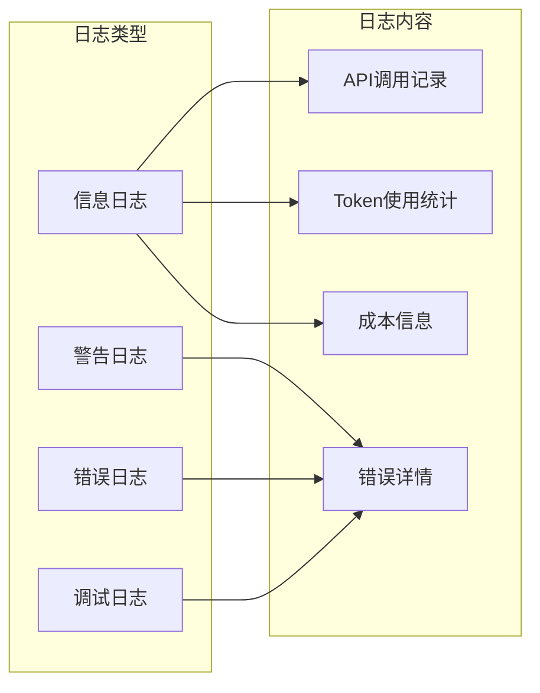

# DeepSeek集成问题故障排除指南

<cite>
**本文档中引用的文件**
- [deepseek_adapter.py](file://tradingagents/llm/deepseek_adapter.py)
- [deepseek_adapter.py](file://tradingagents/llm_adapters/deepseek_adapter.py)
- [deepseek_direct_adapter.py](file://tradingagents/llm_adapters/deepseek_direct_adapter.py)
- [config_manager.py](file://tradingagents/config/config_manager.py)
- [logging_manager.py](file://tradingagents/utils/logging_manager.py)
- [test_deepseek_cost_calculation.py](file://tests/test_deepseek_cost_calculation.py)
- [debug_deepseek_cost.py](file://tests/debug_deepseek_cost.py)
- [demo_deepseek_simple.py](file://examples/demo_deepseek_simple.py)
</cite>

## 目录
1. [概述](#概述)
2. [架构概览](#架构概览)
3. [核心组件分析](#核心组件分析)
4. [常见问题诊断](#常见问题诊断)
5. [Token计费异常解决方案](#token计费异常解决方案)
6. [响应延迟优化](#响应延迟优化)
7. [连接中断处理](#连接中断处理)
8. [测试脚本验证](#测试脚本验证)
9. [日志分析与监控](#日志分析与监控)
10. [最佳实践建议](#最佳实践建议)

## 概述

DeepSeek集成是TradingAgents系统中的重要组成部分，提供了强大的自然语言处理能力。本文档详细介绍了DeepSeek适配器的工作机制、常见问题及其解决方案，帮助开发者快速定位和解决问题。

DeepSeek集成包含两个主要适配器：
- **deepseek_adapter.py**: 基于LangChain的完整功能适配器
- **deepseek_direct_adapter.py**: 直接OpenAI库调用的简化适配器

## 架构概览



**图表来源**
- [deepseek_adapter.py](file://tradingagents/llm/deepseek_adapter.py#L1-L50)
- [deepseek_direct_adapter.py](file://tradingagents/llm_adapters/deepseek_direct_adapter.py#L1-L50)
- [config_manager.py](file://tradingagents/config/config_manager.py#L1-L100)

## 核心组件分析

### DeepSeek适配器类结构



**图表来源**
- [deepseek_adapter.py](file://tradingagents/llm/deepseek_adapter.py#L15-L100)
- [deepseek_adapter.py](file://tradingagents/llm_adapters/deepseek_adapter.py#L20-L150)
- [deepseek_direct_adapter.py](file://tradingagents/llm_adapters/deepseek_direct_adapter.py#L15-L100)

**节来源**
- [deepseek_adapter.py](file://tradingagents/llm/deepseek_adapter.py#L1-L247)
- [deepseek_adapter.py](file://tradingagents/llm_adapters/deepseek_adapter.py#L1-L263)
- [deepseek_direct_adapter.py](file://tradingagents/llm_adapters/deepseek_direct_adapter.py#L1-L179)

## 常见问题诊断

### 1. API密钥配置问题

**症状**: `ValueError: 需要提供DEEPSEEK_API_KEY`

**诊断步骤**:
1. 检查环境变量设置
2. 验证API密钥格式
3. 确认密钥权限

**解决方案**:
```bash
# 设置环境变量
export DEEPSEEK_API_KEY="your_api_key_here"

# 或在.env文件中配置
echo "DEEPSEEK_API_KEY=your_api_key_here" >> .env
```

### 2. 模型可用性问题

**症状**: 模型初始化失败或不支持工具调用

**诊断流程**:


**图表来源**
- [deepseek_adapter.py](file://tradingagents/llm/deepseek_adapter.py#L40-L80)

### 3. Token使用统计问题

**症状**: 成本计算为0或Token统计不准确

**诊断要点**:
- 检查定价配置文件
- 验证Token估算算法
- 确认使用记录保存

**节来源**
- [config_manager.py](file://tradingagents/config/config_manager.py#L400-L500)

## Token计费异常解决方案

### 成本计算准确性验证

DeepSeek的成本计算基于定价配置，支持精确到6位小数的成本计算。



**图表来源**
- [deepseek_adapter.py](file://tradingagents/llm_adapters/deepseek_adapter.py#L100-L180)
- [config_manager.py](file://tradingagents/config/config_manager.py#L450-L520)

### 修复后的成本计算逻辑

| 模型 | 输入价格/1K tokens | 输出价格/1K tokens | 货币 |
|------|-------------------|-------------------|------|
| deepseek-chat | ¥0.0014 | ¥0.0028 | CNY |
| deepseek-coder | ¥0.0014 | ¥0.0028 | CNY |

**节来源**
- [test_deepseek_cost_calculation.py](file://tests/test_deepseek_cost_calculation.py#L53-L90)
- [config_manager.py](file://tradingagents/config/config_manager.py#L200-L250)

## 响应延迟优化

### 连接池和超时设置



**图表来源**
- [deepseek_direct_adapter.py](file://tradingagents/llm_adapters/deepseek_direct_adapter.py#L50-L100)

### 优化建议

1. **连接超时设置**: 建议设置合理的超时时间（30-60秒）
2. **并发控制**: 限制同时请求数量
3. **缓存策略**: 实现智能缓存机制
4. **负载均衡**: 使用多个API密钥分散请求

**节来源**
- [deepseek_direct_adapter.py](file://tradingagents/llm_adapters/deepseek_direct_adapter.py#L30-L80)

## 连接中断处理

### 重试机制实现



**图表来源**
- [deepseek_adapter.py](file://tradingagents/llm/deepseek_adapter.py#L80-L120)

### 备用接口切换方案

1. **多API密钥轮换**: 实现API密钥池管理
2. **服务降级**: 在主要服务不可用时切换到备用服务
3. **熔断器模式**: 当错误率达到阈值时暂停请求

**节来源**
- [config_manager.py](file://tradingagents/config/config_manager.py#L650-L700)

## 测试脚本验证

### 成本计算测试

系统提供了完整的测试套件来验证DeepSeek集成的各项功能。



**图表来源**
- [test_deepseek_cost_calculation.py](file://tests/test_deepseek_cost_calculation.py#L100-L200)

### 调试工具使用

调试脚本提供了深入的问题诊断功能：

1. **定价配置检查**: 验证定价表配置
2. **成本计算验证**: 手动计算和自动验证
3. **Token跟踪测试**: 测试使用记录功能
4. **适配器连通性**: 测试API连接

**节来源**
- [debug_deepseek_cost.py](file://tests/debug_deepseek_cost.py#L1-L156)

## 日志分析与监控

### 结构化日志记录

DeepSeek集成使用统一的日志管理系统，提供详细的调用信息和性能指标。



**图表来源**
- [logging_manager.py](file://tradingagents/utils/logging_manager.py#L350-L410)

### 关键监控指标

| 指标类别 | 监控项目 | 正常范围 | 异常阈值 |
|----------|----------|----------|----------|
| 成本监控 | 单次调用成本 | ¥0.001-0.01 | > ¥0.05 |
| 性能监控 | 响应时间 | < 10秒 | > 30秒 |
| 可用性监控 | 连接成功率 | > 95% | < 90% |
| Token监控 | 输入Token数 | 100-10000 | > 20000 |
| Token监控 | 输出Token数 | 10-1000 | > 2000 |

**节来源**
- [logging_manager.py](file://tradingagents/utils/logging_manager.py#L300-L410)

## 最佳实践建议

### 1. 配置管理

- **环境变量优先**: 优先使用环境变量管理API密钥
- **定期更新**: 定期检查和更新定价配置
- **备份配置**: 保留配置文件的备份版本

### 2. 错误处理

- **优雅降级**: 实现服务不可用时的降级策略
- **重试机制**: 设置合理的重试次数和间隔
- **超时控制**: 配置适当的超时时间

### 3. 性能优化

- **连接复用**: 使用连接池减少连接开销
- **批量处理**: 对于大量请求考虑批量处理
- **缓存策略**: 实现智能缓存减少重复请求

### 4. 监控告警

- **成本监控**: 设置成本阈值告警
- **性能监控**: 监控响应时间和成功率
- **错误监控**: 及时发现和处理错误

### 5. 安全考虑

- **密钥保护**: 安全存储和传输API密钥
- **访问控制**: 限制对敏感配置的访问
- **审计日志**: 记录所有关键操作

通过遵循这些最佳实践，可以确保DeepSeek集成的稳定性、性能和安全性，为TradingAgents系统提供可靠的AI服务能力。