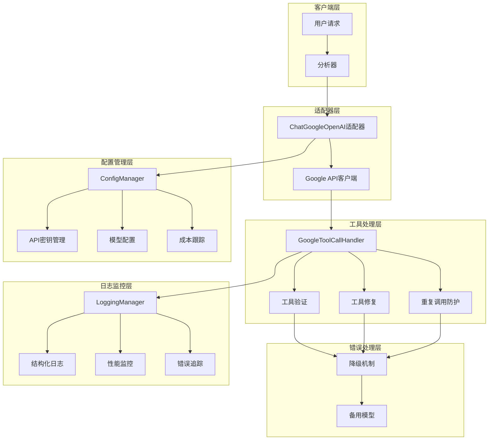
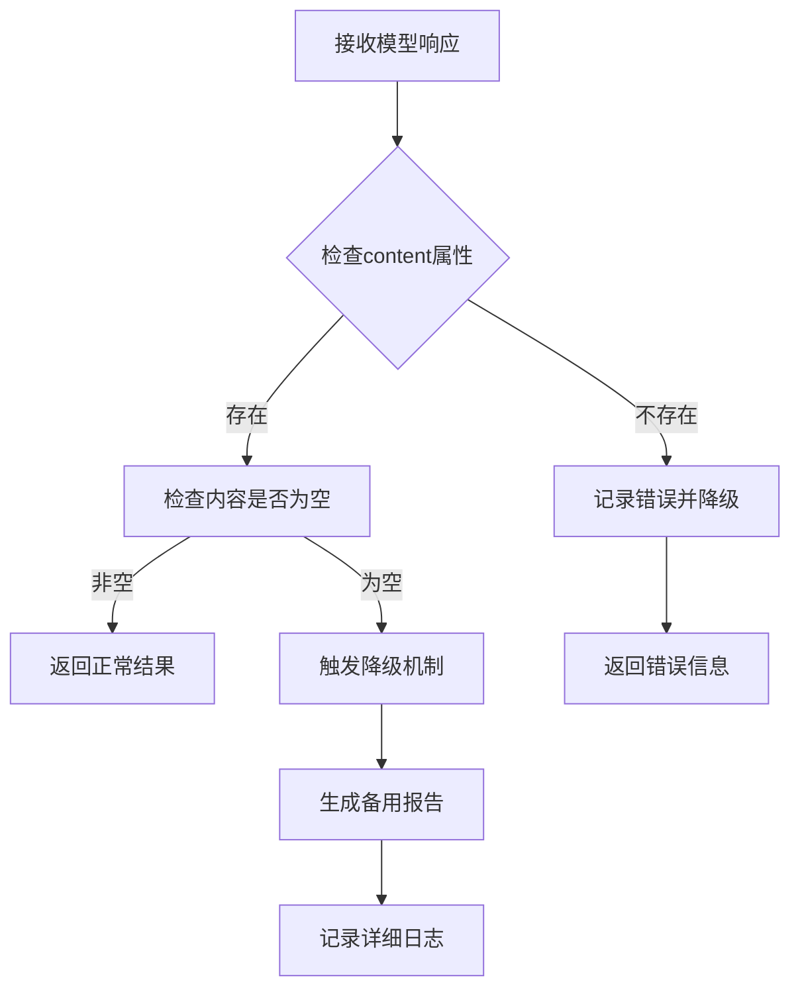
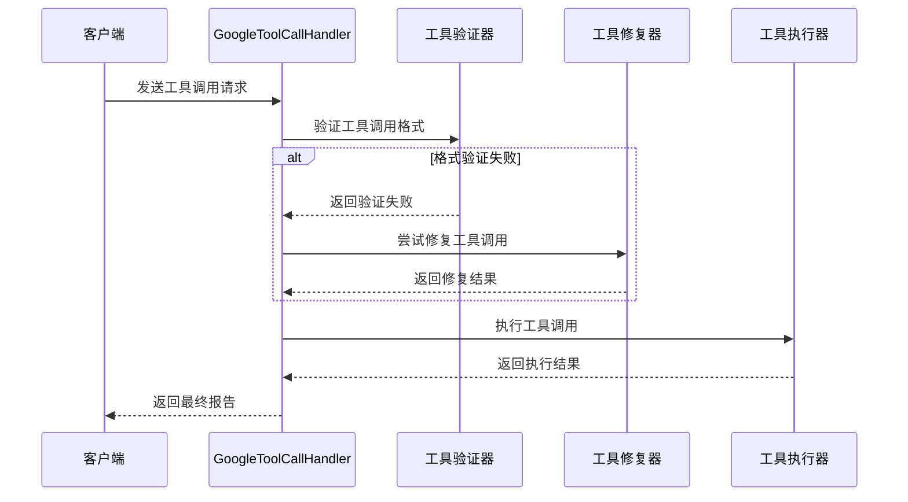
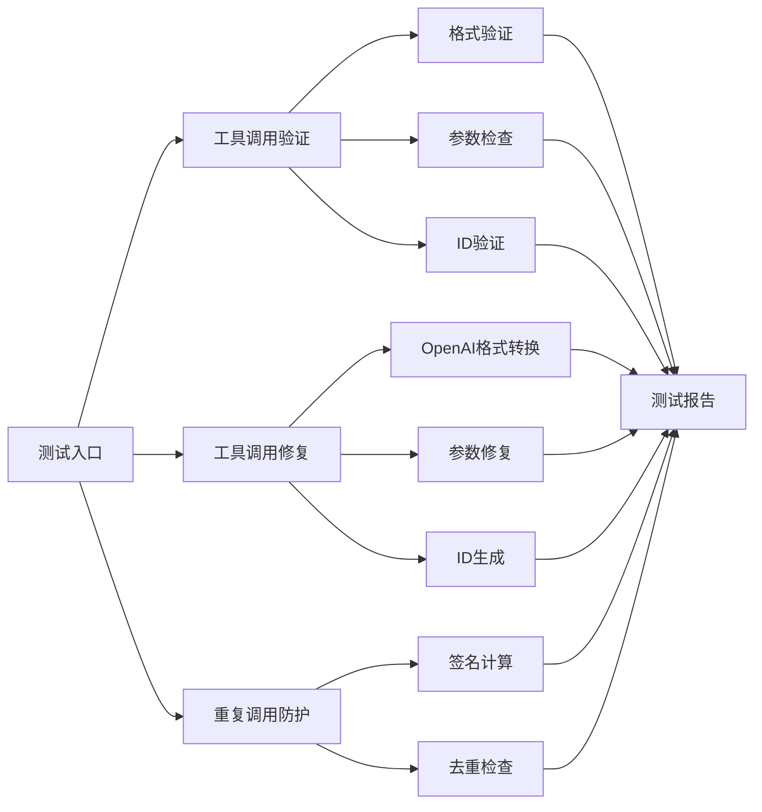
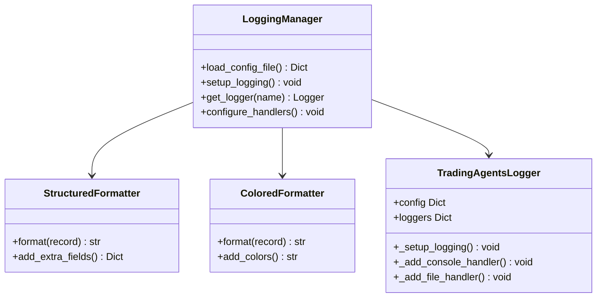
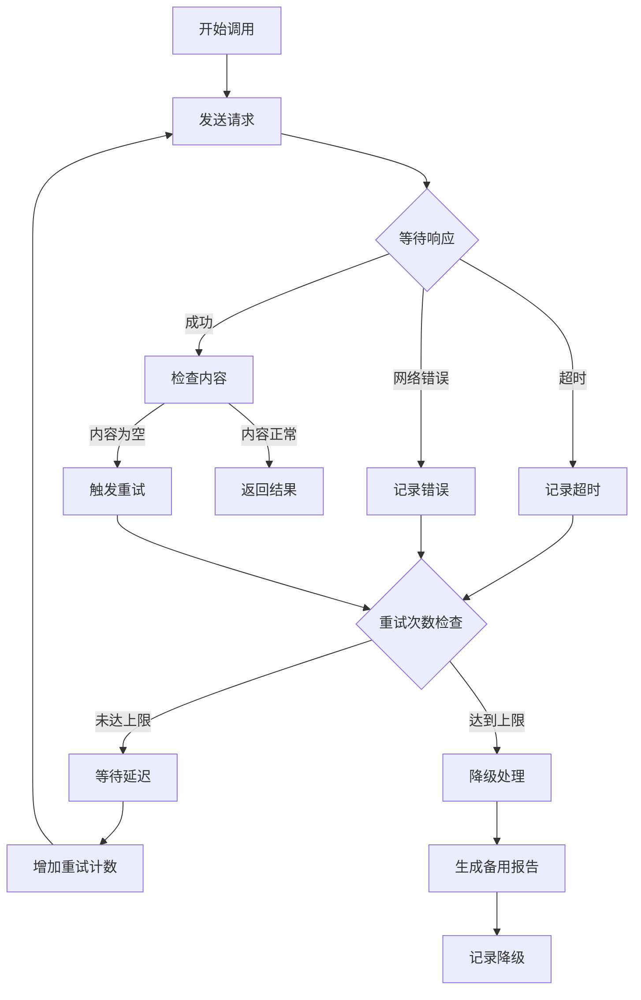
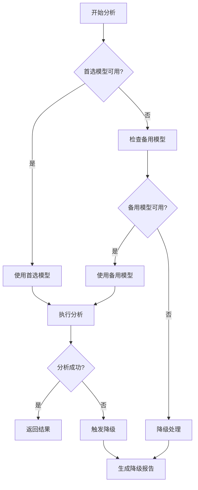
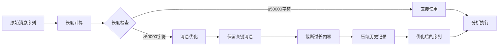
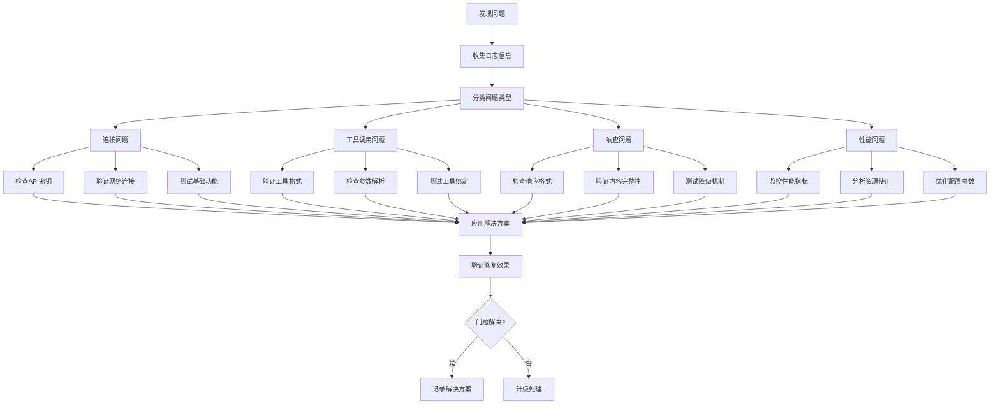

# Google LLM集成故障排除指南

<cite>
**本文档中引用的文件**
- [google_openai_adapter.py](file://tradingagents/llm_adapters/google_openai_adapter.py)
- [test_google_tool_handler_fix.py](file://tests/0.1.14/test_google_tool_handler_fix.py)
- [google_tool_handler.py](file://tradingagents/agents/utils/google_tool_handler.py)
- [config_manager.py](file://tradingagents/config/config_manager.py)
- [logging_manager.py](file://tradingagents/utils/logging_manager.py)
- [memory.py](file://tradingagents/agents/utils/memory.py)
</cite>

## 目录
1. [简介](#简介)
2. [核心架构概览](#核心架构概览)
3. [常见问题及解决方案](#常见问题及解决方案)
4. [工具调用链路完整性验证](#工具调用链路完整性验证)
5. [日志分析与调试](#日志分析与调试)
6. [超时重试机制](#超时重试机制)
7. [备选模型配置](#备选模型配置)
8. [性能优化建议](#性能优化建议)
9. [故障排除流程](#故障排除流程)
10. [最佳实践](#最佳实践)

## 简介

本指南专注于解决TradingAgents项目中Google LLM（如Gemini）集成过程中遇到的各种问题。主要针对`google_openai_adapter.py`适配器实现，涵盖模型响应为空、工具调用失败、记忆上下文丢失等核心问题的诊断和解决方案。

Google LLM集成面临的主要挑战包括：
- 工具调用格式不兼容问题
- 模型响应内容为空或格式异常
- 记忆上下文丢失和状态管理
- 网络超时和重试机制
- 多模型切换和降级处理

## 核心架构概览



**图表来源**
- [google_openai_adapter.py](file://tradingagents/llm_adapters/google_openai_adapter.py#L20-L50)
- [google_tool_handler.py](file://tradingagents/agents/utils/google_tool_handler.py#L15-L40)

**章节来源**
- [google_openai_adapter.py](file://tradingagents/llm_adapters/google_openai_adapter.py#L1-L50)
- [google_tool_handler.py](file://tradingagents/agents/utils/google_tool_handler.py#L1-L50)

## 常见问题及解决方案

### 1. 模型响应为空问题

#### 问题描述
Google模型返回空内容或content属性缺失，导致分析流程中断。

#### 根本原因分析
- API调用失败但未抛出异常
- 网络连接不稳定
- 请求参数格式错误
- 模型内部错误

#### 解决策略

**自动检测和降级**


**图表来源**
- [google_tool_handler.py](file://tradingagents/agents/utils/google_tool_handler.py#L100-L130)

**配置建议**
- 设置合理的超时时间（推荐20-30秒）
- 启用自动重试机制（最多3次）
- 实施降级策略

#### 诊断步骤
1. 检查API密钥有效性
2. 验证网络连接稳定性
3. 查看详细错误日志
4. 测试基础连接

### 2. 工具调用失败问题

#### 问题表现
- 工具调用格式不匹配
- 参数解析错误
- 重复调用导致性能问题

#### 解决方案架构



**图表来源**
- [google_tool_handler.py](file://tradingagents/agents/utils/google_tool_handler.py#L120-L200)

**章节来源**
- [google_tool_handler.py](file://tradingagents/agents/utils/google_tool_handler.py#L120-L250)

### 3. 记忆上下文丢失问题

#### 问题分析
- 消息序列过长导致截断
- 上下文窗口限制
- 状态同步问题

#### 解决策略
1. **消息优化**：智能截断和压缩
2. **上下文管理**：分块处理和缓存
3. **状态同步**：定期保存和恢复

**章节来源**
- [memory.py](file://tradingagents/agents/utils/memory.py#L230-L250)

## 工具调用链路完整性验证

### 测试框架设计



**图表来源**
- [test_google_tool_handler_fix.py](file://tests/0.1.14/test_google_tool_handler_fix.py#L20-L80)

### 关键测试用例

#### 1. 工具调用验证测试
- 验证有效工具调用通过
- 检测缺失字段的无效调用
- 测试错误类型识别

#### 2. 工具调用修复测试
- OpenAI格式到标准格式转换
- 参数JSON解析修复
- 自动生成唯一ID

#### 3. 重复调用防护测试
- 相同参数的重复调用检测
- 唯一签名生成
- 执行顺序控制

**章节来源**
- [test_google_tool_handler_fix.py](file://tests/0.1.14/test_google_tool_handler_fix.py#L1-L176)

## 日志分析与调试

### 日志配置结构



**图表来源**
- [logging_manager.py](file://tradingagents/utils/logging_manager.py#L40-L100)

### 关键日志指标

| 日志级别 | 关键指标 | 描述 |
|---------|---------|------|
| DEBUG | Google适配器 | 详细的操作步骤和参数 |
| INFO | 工具调用处理 | 成功的工具调用和执行结果 |
| WARNING | 降级机制 | 系统自动降级和备用方案启用 |
| ERROR | API调用失败 | 明确的错误信息和异常堆栈 |

### 日志分析技巧

1. **连接性诊断**
   ```
   查找关键字："Google AI OpenAI 兼容接口连接"
   ```

2. **工具调用分析**
   ```
   查找关键字："Google模型调用了" 和 "工具调用"
   ```

3. **错误定位**
   ```
   查找关键字："❌" 和 "⚠️" 前缀的日志
   ```

**章节来源**
- [logging_manager.py](file://tradingagents/utils/logging_manager.py#L1-L100)

## 超时重试机制

### 重试策略设计



**图表来源**
- [google_tool_handler.py](file://tradingagents/agents/utils/google_tool_handler.py#L600-L680)

### 配置参数

| 参数 | 推荐值 | 说明 |
|------|--------|------|
| 最大重试次数 | 3 | 避免无限重试 |
| 初始延迟时间 | 2秒 | 基础等待时间 |
| 指数退避因子 | 2 | 每次重试延迟翻倍 |
| 最大延迟时间 | 30秒 | 防止延迟过大 |

### 降级机制

当所有重试都失败时，系统会启动降级机制：

1. **备用模型切换**：尝试其他可用模型
2. **简化处理**：减少处理复杂度
3. **数据提取**：仅提取工具返回的核心数据
4. **人工介入**：标记需要人工处理的情况

**章节来源**
- [google_tool_handler.py](file://tradingagents/agents/utils/google_tool_handler.py#L600-L680)

## 备选模型配置

### 模型选择策略



### 支持的Google模型

| 模型名称 | 响应时间 | 上下文长度 | 功能特性 | 推荐场景 |
|----------|----------|------------|----------|----------|
| gemini-2.5-flash-lite-preview-06-17 | 1.45s | 32768 | 函数调用 | 超快响应 |
| gemini-2.5-flash | 2.73s | 32768 | 函数调用 | 快速分析 |
| gemini-2.0-flash | 1.87s | 32768 | 函数调用 | 实时分析 |
| gemini-1.5-pro | 2.25s | 32768 | 函数调用 | 复杂分析 |
| gemini-pro | 稳定 | 32768 | 函数调用 | 稳定性优先 |

### 配置示例

```python
# 高性能配置
config = {
    "quick_think_llm": "gemini-2.5-flash-lite-preview-06-17",
    "deep_think_llm": "gemini-2.0-flash"
}

# 稳定性配置  
config = {
    "quick_think_llm": "gemini-pro",
    "deep_think_llm": "gemini-pro"
}
```

**章节来源**
- [google_openai_adapter.py](file://tradingagents/llm_adapters/google_openai_adapter.py#L180-L280)

## 性能优化建议

### 消息序列优化



**图表来源**
- [google_tool_handler.py](file://tradingagents/agents/utils/google_tool_handler.py#L670-L720)

### 优化策略

1. **智能截断**：保留最近的重要消息
2. **内容压缩**：移除冗余信息
3. **分块处理**：将长上下文分割
4. **缓存机制**：复用相似上下文

### 内存管理

- **消息池管理**：限制历史消息数量
- **压缩存储**：使用高效的数据结构
- **定期清理**：清除过期的上下文信息

**章节来源**
- [google_tool_handler.py](file://tradingagents/agents/utils/google_tool_handler.py#L670-L720)

## 故障排除流程

### 诊断流程图



### 问题分类表

| 问题类型 | 症状 | 可能原因 | 诊断方法 | 解决方案 |
|----------|------|----------|----------|----------|
| 连接失败 | API调用超时 | 网络问题、密钥错误 | 检查网络和密钥 | 重试连接、更新密钥 |
| 工具调用失败 | 工具无法执行 | 格式错误、参数问题 | 验证工具格式 | 修复格式、标准化参数 |
| 响应为空 | 内容缺失 | 模型错误、格式问题 | 检查响应结构 | 启用降级机制 |
| 性能问题 | 响应缓慢 | 上下文过长、资源不足 | 监控性能指标 | 优化消息序列 |

### 快速诊断清单

1. **检查API密钥**
   - 环境变量是否正确设置
   - 密钥格式是否符合要求
   - 密钥权限是否足够

2. **验证网络连接**
   - 基础连通性测试
   - 防火墙和代理设置
   - DNS解析问题

3. **分析错误日志**
   - 查找错误级别日志
   - 提取关键错误信息
   - 关联相关日志条目

4. **测试基本功能**
   - 执行简单的文本生成
   - 测试工具调用功能
   - 验证模型响应

## 最佳实践

### 配置管理

1. **环境隔离**
   ```bash
   # 开发环境
   export GOOGLE_API_KEY="dev_key_here"
   
   # 生产环境  
   export GOOGLE_API_KEY="prod_key_here"
   ```

2. **配置版本控制**
   - 使用`.env`文件管理敏感信息
   - 配置文件加密存储
   - 定期更新配置参数

### 监控和告警

1. **关键指标监控**
   - API调用成功率
   - 响应时间分布
   - 错误率统计
   - 成本消耗跟踪

2. **告警机制**
   - 连接失败告警
   - 性能下降告警
   - 成本超限告警

### 安全考虑

1. **API密钥保护**
   - 不在代码中硬编码
   - 使用环境变量
   - 定期轮换密钥

2. **访问控制**
   - 最小权限原则
   - 审计日志记录
   - 异常行为监控

### 测试策略

1. **单元测试**
   - 工具调用验证
   - 格式转换测试
   - 错误处理验证

2. **集成测试**
   - 端到端流程测试
   - 性能基准测试
   - 容错能力测试

3. **压力测试**
   - 高并发场景
   - 长时间运行
   - 资源消耗监控

### 文档维护

1. **操作手册**
   - 常见问题解答
   - 故障排除指南
   - 配置参考

2. **变更记录**
   - 功能更新日志
   - 配置变更历史
   - 性能优化记录

通过遵循这些最佳实践，可以显著提高Google LLM集成的稳定性、性能和可维护性，确保TradingAgents系统在各种环境下都能可靠运行。