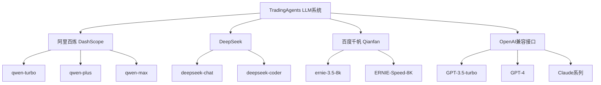
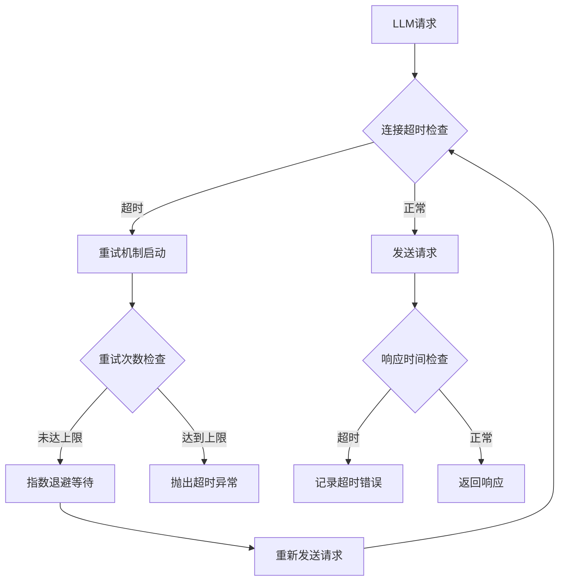
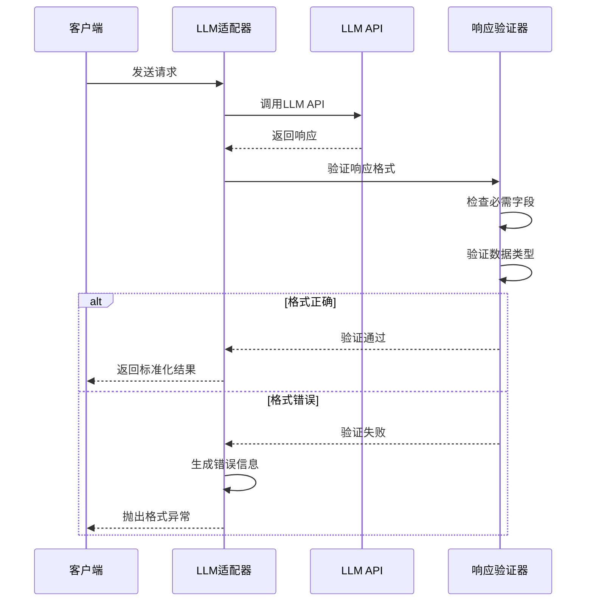
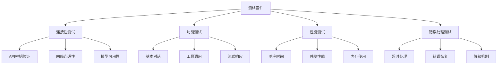
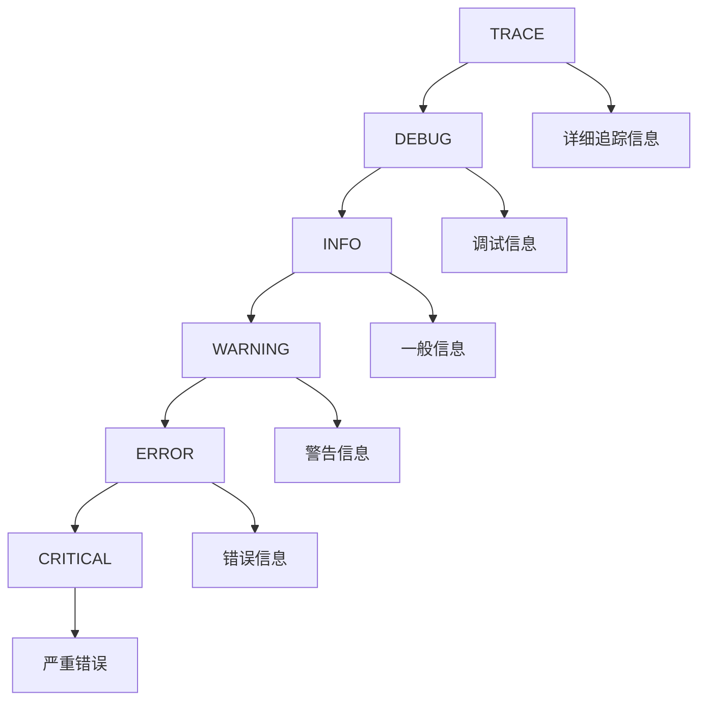
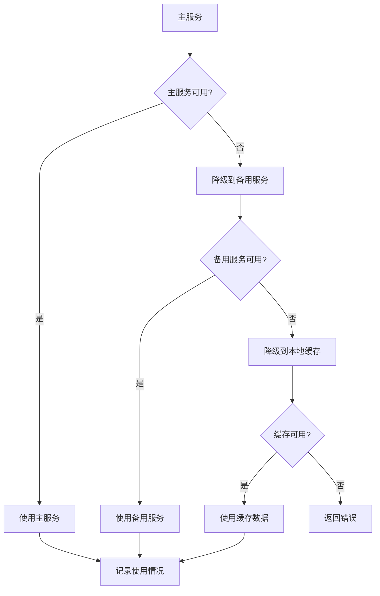
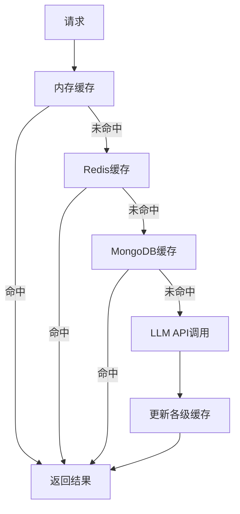

# LLM集成与调用问题故障排除指南

<cite>
**本文档引用的文件**
- [dashscope_adapter.py](file://tradingagents/llm_adapters/dashscope_adapter.py)
- [deepseek_adapter.py](file://tradingagents/llm_adapters/deepseek_adapter.py)
- [openai_compatible_base.py](file://tradingagents/llm_adapters/openai_compatible_base.py)
- [test_qianfan_connect.py](file://scripts/test_qianfan_connect.py)
- [config_manager.py](file://tradingagents/config/config_manager.py)
- [logging_manager.py](file://tradingagents/utils/logging_manager.py)
- [memory.py](file://tradingagents/agents/utils/memory.py)
- [google_tool_handler.py](file://tradingagents/agents/utils/google_tool_handler.py)
- [test_fallback_mechanism.py](file://scripts/test_fallback_mechanism.py)
- [googlenews_utils.py](file://tradingagents/dataflows/googlenews_utils.py)
- [akshare_utils.py](file://tradingagents/dataflows/akshare_utils.py)
</cite>

## 目录
1. [概述](#概述)
2. [API密钥验证失败](#api密钥验证失败)
3. [模型调用超时问题](#模型调用超时问题)
4. [响应格式错误](#响应格式错误)
5. [不同提供商的连接配置](#不同提供商的连接配置)
6. [测试脚本验证](#测试脚本验证)
7. [日志记录与诊断](#日志记录与诊断)
8. [降级和备选方案](#降级和备选方案)
9. [性能优化建议](#性能优化建议)
10. [常见问题解答](#常见问题解答)

## 概述

TradingAgents项目支持多个LLM提供商，包括阿里云百炼（DashScope）、DeepSeek、百度千帆（Qianfan）等。本指南提供了针对这些LLM集成中常见问题的完整故障排除方法。

### 支持的LLM提供商



**图表来源**
- [openai_compatible_base.py](file://tradingagents/llm_adapters/openai_compatible_base.py#L350-L400)
- [dashscope_adapter.py](file://tradingagents/llm_adapters/dashscope_adapter.py#L250-L294)

## API密钥验证失败

### 常见原因与解决方案

#### 1. 环境变量配置错误

**问题症状：**
```
ValueError: DashScope API key not found. Please set DASHSCOPE_API_KEY environment variable
```

**解决方案：**

| 提供商 | 环境变量名 | 配置方法 |
|--------|------------|----------|
| 阿里百炼 | `DASHSCOPE_API_KEY` | `export DASHSCOPE_API_KEY="your-api-key"` |
| DeepSeek | `DEEPSEEK_API_KEY` | `export DEEPSEEK_API_KEY="your-api-key"` |
| 百度千帆 | `QIANFAN_API_KEY` | `export QIANFAN_API_KEY="bce-v3/ALTAK-your-key"` |
| OpenAI | `OPENAI_API_KEY` | `export OPENAI_API_KEY="sk-your-openai-key"` |

**配置验证：**
```bash
# 检查环境变量是否正确设置
echo $DASHSCOPE_API_KEY
echo $DEEPSEEK_API_KEY
echo $QIANFAN_API_KEY
```

#### 2. API密钥格式验证

**OpenAI密钥格式验证：**
```python
# 格式要求：以'sk-'开头，总长度51字符
# 示例：sk-xxxxxxxxxxxxxxxxxxxxxxxxxxxxxxxxxxxxxxxxxxxxxx
```

**百度千帆密钥格式验证：**
```python
# 格式要求：bce-v3/ALTAK-xxx/xxx
# 示例：bce-v3/ALTAK-1234567890abcdef/1234567890abcdef
```

**节来源**
- [config_manager.py](file://tradingagents/config/config_manager.py#L150-L200)
- [openai_compatible_base.py](file://tradingagents/llm_adapters/openai_compatible_base.py#L50-L80)

### 3. 密钥权限检查

**验证步骤：**

1. **访问控制台确认密钥状态**
   - 登录对应提供商的开发者控制台
   - 检查API密钥是否有效且未过期
   - 确认密钥具有相应的调用权限

2. **测试密钥有效性**
   ```python
   # 使用提供的测试脚本验证
   python scripts/test_qianfan_connect.py
   ```

## 模型调用超时问题

### 超时配置与优化

#### 1. 连接超时设置

**HTTP请求超时配置：**



**图表来源**
- [googlenews_utils.py](file://tradingagents/dataflows/googlenews_utils.py#L25-L35)
- [akshare_utils.py](file://tradingagents/dataflows/akshare_utils.py#L49-L62)

#### 2. 超时参数配置

| 参数 | 默认值 | 推荐值 | 说明 |
|------|--------|--------|------|
| 连接超时 | 10秒 | 15-30秒 | 建立连接的最大时间 |
| 读取超时 | 30秒 | 60-120秒 | 读取响应的最大时间 |
| 重试次数 | 3次 | 5次 | 请求失败时的重试次数 |
| 退避因子 | 1 | 2 | 指数退避的乘数 |

**配置示例：**
```python
# HTTP会话超时配置
session = requests.Session()
session.timeout = (15, 60)  # (连接超时, 读取超时)
```

#### 3. 异步调用优化

**异步处理模式：**
```python
# 使用异步客户端提高并发性能
import httpx

async def async_llm_call(messages, timeout=30):
    async with httpx.AsyncClient(timeout=timeout) as client:
        response = await client.post(api_url, json=payload)
        return response.json()
```

**节来源**
- [googlenews_utils.py](file://tradingagents/dataflows/googlenews_utils.py#L25-L35)
- [akshare_utils.py](file://tradingagents/dataflows/akshare_utils.py#L49-L62)

### 4. 网络连接问题

**诊断命令：**
```bash
# 检查网络连通性
ping api.openai.com
ping dashscope.aliyuncs.com

# 检查DNS解析
nslookup api.openai.com
nslookup dashscope.aliyuncs.com

# 测试端口连通性
telnet api.openai.com 443
telnet dashscope.aliyuncs.com 443
```

## 响应格式错误

### 错误类型与处理

#### 1. JSON解析错误

**常见错误模式：**
```python
# 错误的JSON响应
{
    "error": "Invalid JSON format",
    "message": "Unexpected character at position 15"
}

# 正确的响应格式
{
    "id": "chatcmpl-123",
    "object": "chat.completion",
    "created": 1677652288,
    "model": "gpt-3.5-turbo-0613",
    "choices": [{
        "index": 0,
        "message": {
            "role": "assistant",
            "content": "Hello! How can I assist you today?"
        },
        "finish_reason": "stop"
    }],
    "usage": {
        "prompt_tokens": 9,
        "completion_tokens": 12,
        "total_tokens": 21
    }
}
```

#### 2. 响应格式验证

**验证流程：**



**图表来源**
- [dashscope_adapter.py](file://tradingagents/llm_adapters/dashscope_adapter.py#L120-L180)
- [deepseek_adapter.py](file://tradingagents/llm_adapters/deepseek_adapter.py#L80-L120)

#### 3. 错误处理策略

**错误分类与处理：**

| 错误类型 | 检测方法 | 处理策略 |
|----------|----------|----------|
| 空响应 | 检查响应内容是否为空 | 返回默认值或抛出异常 |
| 格式错误 | JSON解析失败 | 记录原始响应，抛出格式异常 |
| 字段缺失 | 检查必需字段 | 使用默认值填充或抛出异常 |
| 数据类型错误 | 类型检查失败 | 转换数据类型或抛出异常 |

**节来源**
- [memory.py](file://tradingagents/agents/utils/memory.py#L524-L553)
- [google_tool_handler.py](file://tradingagents/agents/utils/google_tool_handler.py#L626-L677)

## 不同提供商的连接配置

### 阿里百炼（DashScope）

#### 1. 基础配置

**环境变量设置：**
```bash
export DASHSCOPE_API_KEY="your-dashscope-api-key"
```

**模型配置选项：**

| 模型名称 | 上下文长度 | 推荐用途 | 价格（CNY/1K tokens） |
|----------|------------|----------|---------------------|
| qwen-turbo | 8,192 | 日常对话 | 输入: 0.002, 输出: 0.006 |
| qwen-plus | 32,768 | 复杂分析 | 输入: 0.004, 输出: 0.012 |
| qwen-max | 32,768 | 最强性能 | 输入: 0.02, 输出: 0.06 |
| qwen-max-longcontext | 1,000,000 | 长文档分析 | 输入: 0.02, 输出: 0.06 |

#### 2. 高级配置

**连接参数优化：**
```python
from tradingagents.llm_adapters.dashscope_adapter import create_dashscope_llm

llm = create_dashscope_llm(
    model="qwen-plus",
    temperature=0.1,
    max_tokens=2000,
    top_p=0.9,
    # 自定义超时设置
    timeout=30,
    # 重试配置
    max_retries=3
)
```

### DeepSeek

#### 1. API配置

**环境变量：**
```bash
export DEEPSEEK_API_KEY="your-deepseek-api-key"
```

**支持的模型：**
- `deepseek-chat` - 通用对话模型
- `deepseek-coder` - 代码专用模型

#### 2. Token跟踪配置

**Token使用统计：**
```python
# 自动记录Token使用量
# 输入tokens: 用户输入的token数量
# Output tokens: 模型生成的token数量
# 成本计算: 基于配置的费率表
```

**节来源**
- [dashscope_adapter.py](file://tradingagents/llm_adapters/dashscope_adapter.py#L250-L294)
- [deepseek_adapter.py](file://tradingagents/llm_adapters/deepseek_adapter.py#L200-L262)

### 百度千帆（Qianfan）

#### 1. 认证配置

**API密钥格式：**
```bash
export QIANFAN_API_KEY="bce-v3/ALTAK-your-access-key/your-secret-key"
```

**模型支持：**

| 模型名称 | 上下文长度 | 功能特性 |
|----------|------------|----------|
| ernie-3.5-8k | 5,120 | 基础对话能力 |
| ernie-4.0-turbo-8k | 5,120 | 增强推理能力 |
| ERNIE-Speed-8K | 5,120 | 快速响应 |
| ERNIE-Lite-8K | 5,120 | 轻量化部署 |

#### 2. 输入截断机制

**千帆模型的特殊处理：**
```python
# 自动截断过长的消息
def _truncate_messages(self, messages, max_tokens=4500):
    """截断消息以适应千帆模型的token限制"""
    # 从最后一条消息开始向前保留
    # 为千帆模型预留空间，使用4500而非5120
```

**节来源**
- [openai_compatible_base.py](file://tradingagents/llm_adapters/openai_compatible_base.py#L200-L280)

## 测试脚本验证

### 连接性测试

#### 1. 百度千帆连接测试

**测试脚本功能：**
- 验证API密钥配置
- 测试基本连接性
- 检查模型可用性
- 记录响应时间和错误信息

**运行测试：**
```bash
python scripts/test_qianfan_connect.py
```

**测试输出示例：**
```
==== Qianfan Connectivity Test ====
Model           : ernie-3.5-8k
QIANFAN_API_KEY set  : YES
ACCESS_KEY set  : NO
SECRET_KEY set  : NO
[OK] Adapter instantiated.
Sending test prompt to Qianfan ...
[OK] Response received (<=200 chars):
连接成功
Elapsed: 2.34s
Connectivity looks good.
```

#### 2. 自动化测试框架

**测试套件结构：**



**节来源**
- [test_qianfan_connect.py](file://scripts/test_qianfan_connect.py#L40-L94)

### 性能基准测试

#### 1. 响应时间测试

**测试指标：**
- 首字节时间（TTFB）
- 完整响应时间
- 并发处理能力
- 错误率统计

#### 2. 负载测试

**压力测试配置：**
```python
# 并发用户数
CONCURRENT_USERS = 10

# 测试持续时间
TEST_DURATION = 300  # 5分钟

# 请求频率
REQUEST_RATE = 10  # 每秒10个请求
```

## 日志记录与诊断

### 日志系统架构

#### 1. 多层次日志配置

**日志级别层次：**



#### 2. 结构化日志格式

**JSON格式日志条目：**
```json
{
    "timestamp": "2024-01-15T10:30:00.123456",
    "level": "INFO",
    "logger": "tradingagents.llm.dashscope",
    "message": "LLM调用成功",
    "module": "dashscope_adapter",
    "function": "_generate",
    "line": 150,
    "session_id": "session_20240115_103000",
    "provider": "dashscope",
    "model": "qwen-plus",
    "tokens": {
        "input": 1200,
        "output": 300
    },
    "cost": 0.006,
    "duration": 2.45
}
```

#### 3. 关键日志事件

**重要日志事件类型：**

| 事件类型 | 日志级别 | 触发条件 | 示例信息 |
|----------|----------|----------|----------|
| LLM调用开始 | INFO | 发起API请求 | "开始调用DashScope API" |
| LLM调用完成 | INFO | 成功接收响应 | "DashScope API调用完成，耗时: 2.34s" |
| Token使用 | INFO | 记录Token消耗 | "Token使用: 输入=1200, 输出=300" |
| 错误发生 | ERROR | API调用失败 | "DashScope API错误: 400 - Invalid request" |
| 降级触发 | WARNING | 主要服务不可用 | "DashScope服务不可用，降级到备用服务" |

**节来源**
- [logging_manager.py](file://tradingagents/utils/logging_manager.py#L300-L410)

### 诊断工具

#### 1. 日志分析脚本

**日志过滤与分析：**
```bash
# 搜索特定提供商的错误
grep "ERROR.*dashscope" logs/tradingagents.log

# 分析响应时间分布
awk '/duration/ {print $NF}' logs/tradingagents.log | sort -n

# 统计Token使用情况
grep "Token使用" logs/tradingagents.log | awk '{sum+=$NF} END {print "Total cost:", sum}'
```

#### 2. 实时监控

**监控指标：**
- API调用成功率
- 平均响应时间
- Token使用量统计
- 错误率趋势

## 降级和备选方案

### 降级机制设计

#### 1. 多层降级策略

**降级优先级：**



#### 2. 自动降级触发条件

**触发条件检测：**

| 条件类型 | 检测方法 | 降级动作 |
|----------|----------|----------|
| 连接超时 | 超时异常捕获 | 切换到备用服务 |
| 服务不可用 | HTTP 5xx错误 | 启动降级流程 |
| 频率限制 | 429状态码 | 等待后重试或降级 |
| 认证失败 | 401/403错误 | 检查密钥有效性 |
| 响应格式错误 | JSON解析失败 | 使用默认响应 |

#### 3. 降级配置管理

**配置示例：**
```python
# 降级配置
fallback_config = {
    "enabled": True,
    "max_retries": 3,
    "retry_delay": 2,  # 秒
    "timeout": 30,     # 秒
    "fallback_order": [
        "dashscope",
        "deepseek",
        "openai",
        "local_cache"
    ]
}
```

**节来源**
- [test_fallback_mechanism.py](file://scripts/test_fallback_mechanism.py#L20-L132)

### 备选方案配置

#### 1. 多提供商配置

**配置文件示例：**
```json
{
    "providers": [
        {
            "name": "dashscope",
            "enabled": true,
            "priority": 1,
            "api_key": "${DASHSCOPE_API_KEY}",
            "models": ["qwen-plus", "qwen-max"]
        },
        {
            "name": "deepseek",
            "enabled": true,
            "priority": 2,
            "api_key": "${DEEPSEEK_API_KEY}",
            "models": ["deepseek-chat"]
        },
        {
            "name": "openai",
            "enabled": false,
            "priority": 3,
            "api_key": "${OPENAI_API_KEY}",
            "models": ["gpt-3.5-turbo", "gpt-4"]
        }
    ],
    "fallback": {
        "enabled": true,
        "max_retries": 3,
        "delay_between_retries": 2
    }
}
```

#### 2. 动态负载均衡

**负载均衡算法：**
```python
# 基于成功率的动态权重分配
class LoadBalancer:
    def __init__(self):
        self.providers = []
        self.weights = {}
    
    def get_best_provider(self):
        # 根据成功率和响应时间计算加权分数
        scores = {}
        for provider in self.providers:
            success_rate = provider.get_success_rate()
            response_time = provider.get_avg_response_time()
            score = success_rate * (1 / response_time)
            scores[provider.name] = score
        
        # 返回最高分的提供商
        return max(scores.items(), key=lambda x: x[1])[0]
```

## 性能优化建议

### 1. 连接池优化

**HTTP连接池配置：**
```python
import requests
from requests.adapters import HTTPAdapter
from urllib3.util.retry import Retry

# 配置重试策略
retry_strategy = Retry(
    total=3,
    backoff_factor=1,
    status_forcelist=[429, 500, 502, 503, 504],
)

# 创建适配器
adapter = HTTPAdapter(
    pool_connections=10,
    pool_maxsize=20,
    max_retries=retry_strategy
)

# 应用到会话
session = requests.Session()
session.mount("http://", adapter)
session.mount("https://", adapter)
```

### 2. 缓存策略

**多级缓存架构：**



**缓存配置：**
```python
# 缓存配置示例
CACHE_CONFIG = {
    "memory": {
        "max_size": 1000,
        "ttl": 3600  # 1小时
    },
    "redis": {
        "enabled": True,
        "host": "localhost",
        "port": 6379,
        "ttl": 7200  # 2小时
    },
    "mongodb": {
        "enabled": False,
        "collection": "llm_cache",
        "ttl": 86400  # 24小时
    }
}
```

### 3. 并发优化

**异步处理模式：**
```python
import asyncio
from typing import List, Dict

class AsyncLLMClient:
    def __init__(self, providers: List[LLMProvider]):
        self.providers = providers
    
    async def call_all_providers(self, messages: List[Dict]):
        """并发调用所有可用提供商"""
        tasks = [
            provider.async_call(messages) 
            for provider in self.providers 
            if provider.is_available()
        ]
        
        results = await asyncio.gather(*tasks, return_exceptions=True)
        return self.process_results(results)
```

## 常见问题解答

### Q1: 如何判断LLM服务是否可用？

**诊断步骤：**
1. 检查API密钥配置
2. 运行连接测试脚本
3. 查看日志中的连接信息
4. 检查网络连通性

**检查命令：**
```bash
# 测试连接
python scripts/test_qianfan_connect.py

# 查看日志
tail -f logs/tradingagents.log | grep "LLM.*连接\|API.*调用"
```

### Q2: Token使用量如何计算？

**计算公式：**
```
总成本 = (输入Token数 ÷ 1000) × 输入单价 + (输出Token数 ÷ 1000) × 输出单价
```

**示例：**
```python
# DeepSeek成本计算
input_tokens = 2000
output_tokens = 1000
input_price = 0.0014  # CNY/1K tokens
output_price = 0.0028  # CNY/1K tokens

total_cost = (input_tokens/1000) * input_price + (output_tokens/1000) * output_price
# 总成本: 0.0042 CNY
```

### Q3: 如何设置成本警告？

**配置设置：**
```python
# 在settings.json中配置
{
    "enable_cost_tracking": true,
    "cost_alert_threshold": 100.0,  # 成本警告阈值（CNY）
    "currency_preference": "CNY"
}
```

**日志中的警告信息：**
```
WARNING - 成本警告: 今日成本已达到 ¥125.34，超过阈值 ¥100.0
```

### Q4: 遇到频率限制怎么办？

**处理策略：**
1. 实现指数退避重试
2. 使用备用提供商
3. 增加请求间隔
4. 优化请求内容

**示例配置：**
```python
# 频率限制处理
RATE_LIMIT_CONFIG = {
    "max_retries": 5,
    "base_delay": 2,  # 基础延迟时间（秒）
    "max_delay": 60,  # 最大延迟时间（秒）
    "backoff_factor": 2  # 退避因子
}
```

### Q5: 如何监控LLM性能？

**监控指标：**
- 响应时间分布
- 成功率统计
- Token使用量趋势
- 错误类型分析

**监控命令：**
```bash
# 分析响应时间
grep "耗时:" logs/tradingagents.log | awk '{sum+=$NF; count++} END {print "平均响应时间:", sum/count "秒"}'

# 统计成功率
grep "调用完成" logs/tradingagents.log | wc -l
grep "调用失败" logs/tradingagents.log | wc -l
```

### Q6: 如何配置多个提供商的负载均衡？

**配置示例：**
```python
# 多提供商配置
PROVIDER_CONFIG = {
    "dashscope": {
        "api_key": "key1",
        "weight": 0.4,
        "max_requests_per_minute": 100
    },
    "deepseek": {
        "api_key": "key2", 
        "weight": 0.3,
        "max_requests_per_minute": 80
    },
    "openai": {
        "api_key": "key3",
        "weight": 0.3,
        "max_requests_per_minute": 60
    }
}
```

通过遵循本指南中的故障排除方法和最佳实践，您可以有效地诊断和解决TradingAgents项目中遇到的各种LLM集成问题。定期监控和维护配置，确保系统的稳定性和性能。