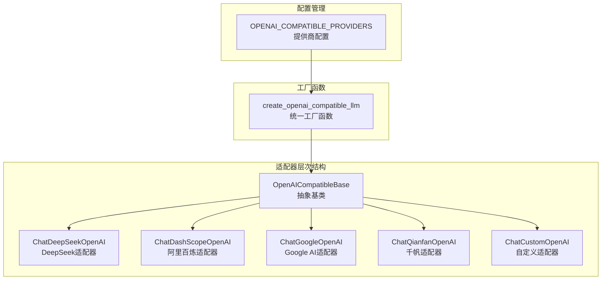
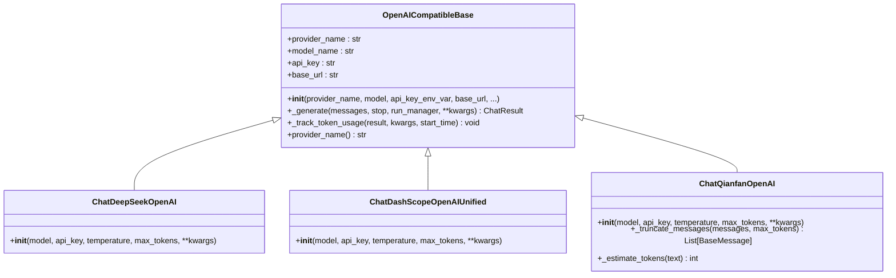
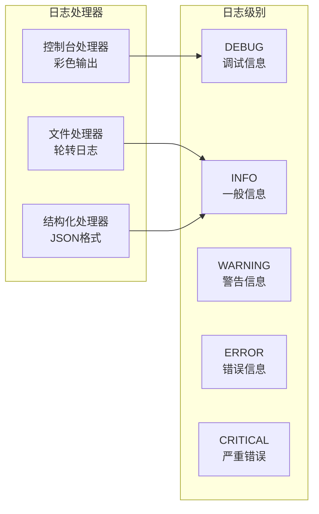
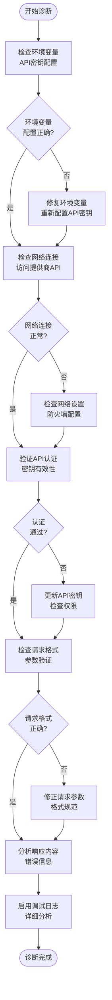

# 通用OpenAI兼容接口问题排除指南

<cite>
**本文档中引用的文件**
- [openai_compatible_base.py](file://tradingagents/llm_adapters/openai_compatible_base.py)
- [dashscope_openai_adapter.py](file://tradingagents/llm_adapters/dashscope_openai_adapter.py)
- [google_openai_adapter.py](file://tradingagents/llm_adapters/google_openai_adapter.py)
- [dashscope_adapter.py](file://tradingagents/llm_adapters/dashscope_adapter.py)
- [logging_manager.py](file://tradingagents/utils/logging_manager.py)
- [test_dashscope_adapter_fix.py](file://tests/test_dashscope_adapter_fix.py)
- [api_checker.py](file://web/utils/api_checker.py)
</cite>

## 目录
1. [简介](#简介)
2. [架构概览](#架构概览)
3. [核心抽象基类分析](#核心抽象基类分析)
4. [常见问题诊断](#常见问题诊断)
5. [适配器继承机制](#适配器继承机制)
6. [日志调试指南](#日志调试指南)
7. [模拟测试环境](#模拟测试环境)
8. [最佳实践](#最佳实践)
9. [故障排除流程](#故障排除流程)
10. [总结](#总结)

## 简介

本文档基于TradingAgents项目的`openai_compatible_base.py`抽象基类，为开发者提供通用OpenAI兼容接口集成的完整故障排除指南。该系统支持多个LLM提供商（DeepSeek、DashScope、Google AI、千帆等），通过统一的适配器模式实现标准化的接口调用。

## 架构概览



**图表来源**
- [openai_compatible_base.py](file://tradingagents/llm_adapters/openai_compatible_base.py#L31-L71)
- [openai_compatible_base.py](file://tradingagents/llm_adapters/openai_compatible_base.py#L381-L413)

**章节来源**
- [openai_compatible_base.py](file://tradingagents/llm_adapters/openai_compatible_base.py#L1-L436)

## 核心抽象基类分析

### OpenAICompatibleBase类设计

`OpenAICompatibleBase`是所有OpenAI兼容适配器的抽象基类，提供了统一的初始化和请求处理机制。

#### 核心特性

1. **统一初始化流程**
   - API密钥自动从环境变量获取
   - 支持多种LangChain版本的兼容性处理
   - 提供详细的初始化日志

2. **请求处理机制**
   - 自动token使用量追踪
   - 统一的错误处理和日志记录
   - 支持自定义参数传递

#### 关键方法分析



**图表来源**
- [openai_compatible_base.py](file://tradingagents/llm_adapters/openai_compatible_base.py#L31-L71)
- [openai_compatible_base.py](file://tradingagents/llm_adapters/openai_compatible_base.py#L138-L170)

**章节来源**
- [openai_compatible_base.py](file://tradingagents/llm_adapters/openai_compatible_base.py#L31-L170)

## 常见问题诊断

### HTTP状态码错误

#### 400 Bad Request
**症状**: 请求格式错误，服务器无法理解

**常见原因**:
1. **请求体格式不符**
   - 缺少必需的字段
   - 数据类型不匹配
   - 参数超出范围

**解决方案**:
```python
# 检查请求参数格式
def validate_request_format(messages, temperature, max_tokens):
    # 验证消息格式
    if not isinstance(messages, list) or not messages:
        raise ValueError("消息列表不能为空")
    
    # 验证温度参数
    if not 0 <= temperature <= 2:
        raise ValueError("温度参数应在0-2范围内")
    
    # 验证最大token数
    if max_tokens and max_tokens <= 0:
        raise ValueError("最大token数必须大于0")
```

#### 401 Unauthorized
**症状**: API密钥无效或缺失

**诊断步骤**:
1. 检查环境变量设置
2. 验证API密钥格式
3. 确认密钥权限

**解决方案**:
```python
# API密钥验证函数
def validate_api_key(provider, api_key):
    if not api_key:
        raise ValueError(f"{provider} API密钥未找到")
    
    # 格式验证
    if provider == "dashscope" and not api_key.startswith("sk-"):
        raise ValueError("阿里百炼API密钥应以'sk-'开头")
    elif provider == "qianfan" and not api_key.startswith("bce-v3/"):
        raise ValueError("千帆API密钥应以'bce-v3/'开头")
    
    return True
```

#### 404 Not Found
**症状**: API端点不存在或URL错误

**常见场景**:
- 自定义URL配置错误
- 提供商域名变更
- 接口版本不匹配

**解决方案**:
```python
# URL验证和修复
def validate_base_url(base_url, provider):
    if not base_url:
        raise ValueError(f"{provider} 基础URL不能为空")
    
    # 标准化URL格式
    if not base_url.startswith(('http://', 'https://')):
        base_url = f"https://{base_url}"
    
    return base_url.rstrip('/')
```

#### 429 Rate Limit Exceeded
**症状**: 请求频率超过限制

**解决方案**:
```python
# 速率限制处理
import time
from functools import wraps

def rate_limited(max_per_second):
    def decorator(func):
        min_interval = 1.0 / max_per_second
        
        @wraps(func)
        def wrapper(*args, **kwargs):
            last_time_called = getattr(wrapper, 'last_time_called', 0)
            elapsed = time.time() - last_time_called
            left_to_wait = min_interval - elapsed
            
            if left_to_wait > 0:
                time.sleep(left_to_wait)
            
            ret = func(*args, **kwargs)
            wrapper.last_time_called = time.time()
            return ret
        
        return wrapper
    
    return decorator
```

### 认证头缺失问题

#### 环境变量配置错误
**症状**: API调用时提示认证失败

**诊断方法**:
```python
# API密钥状态检查
def check_api_key_status():
    required_keys = {
        "DASHSCOPE_API_KEY": "阿里百炼",
        "DEEPSEEK_API_KEY": "DeepSeek",
        "GOOGLE_API_KEY": "Google AI",
        "QIANFAN_API_KEY": "千帆"
    }
    
    missing_keys = []
    for env_var, provider in required_keys.items():
        if not os.getenv(env_var):
            missing_keys.append(provider)
    
    return {
        "has_missing_keys": bool(missing_keys),
        "missing_providers": missing_keys
    }
```

#### API密钥格式验证
**常见格式问题**:
- 缺少前缀标识
- 格式不完整
- 包含特殊字符

**验证规则**:
```python
# 密钥格式验证
def validate_key_format(key_type, api_key):
    validations = {
        "DASHSCOPE_API_KEY": lambda k: k.startswith("sk-"),
        "DEEPSEEK_API_KEY": lambda k: len(k) > 10,
        "GOOGLE_API_KEY": lambda k: len(k) > 20,
        "QIANFAN_API_KEY": lambda k: k.startswith("bce-v3/")
    }
    
    if key_type in validations:
        if not validations[key_type](api_key):
            return False, f"{key_type} 格式错误"
    
    return True, "格式正确"
```

**章节来源**
- [api_checker.py](file://web/utils/api_checker.py#L82-L132)
- [openai_compatible_base.py](file://tradingagents/llm_adapters/openai_compatible_base.py#L50-L70)

## 适配器继承机制

### 方法重写要点

#### `_generate`方法重写
所有子类都需要重写`_generate`方法来处理特定的请求逻辑：

```python
def _generate(self, messages, stop=None, run_manager=None, **kwargs):
    # 1. 调用父类方法获取基础响应
    result = super()._generate(messages, stop, run_manager, **kwargs)
    
    # 2. 添加特定的后处理逻辑
    self._post_process_result(result)
    
    # 3. 记录token使用量
    self._track_token_usage(result, kwargs)
    
    return result
```

#### 特殊适配器的重写需求

##### 千帆模型的token截断
```python
def _truncate_messages(self, messages, max_tokens=4500):
    """截断消息以适应千帆模型的token限制"""
    truncated_messages = []
    total_tokens = 0
    
    for message in reversed(messages):
        content = str(message.content)
        message_tokens = self._estimate_tokens(content)
        
        if total_tokens + message_tokens <= max_tokens:
            truncated_messages.insert(0, message)
            total_tokens += message_tokens
        else:
            # 截断超长消息
            if not truncated_messages:
                remaining_tokens = max_tokens - 100
                max_chars = remaining_tokens * 2
                truncated_content = content[:max_chars] + "...(内容已截断)"
                message.content = truncated_content
                truncated_messages.insert(0, message)
            break
    
    return truncated_messages
```

##### Google AI的工具调用优化
```python
def _optimize_message_content(self, message):
    """优化消息内容格式，确保包含新闻特征关键词"""
    if not isinstance(message, AIMessage) or not message.content:
        return
    
    content = message.content
    
    # 检查是否是工具调用返回的新闻内容
    if self._is_news_content(content):
        optimized_content = self._enhance_news_content(content)
        message.content = optimized_content
```

### 工厂函数设计

#### `create_openai_compatible_llm`函数
统一的适配器创建入口，支持动态提供商选择：

```python
def create_openai_compatible_llm(
    provider: str,
    model: str,
    api_key: Optional[str] = None,
    temperature: float = 0.1,
    max_tokens: Optional[int] = None,
    base_url: Optional[str] = None,
    **kwargs
) -> OpenAICompatibleBase:
    """创建OpenAI兼容LLM实例的统一工厂函数"""
    
    # 1. 验证提供商支持
    provider_info = OPENAI_COMPATIBLE_PROVIDERS.get(provider)
    if not provider_info:
        raise ValueError(f"不支持的OpenAI兼容提供商: {provider}")
    
    # 2. 处理base_url参数冲突
    if base_url is None:
        base_url = provider_info.get("base_url")
    
    # 3. 创建适配器实例
    adapter_class = provider_info["adapter_class"]
    return adapter_class(
        model=model,
        api_key=api_key,
        temperature=temperature,
        max_tokens=max_tokens,
        base_url=base_url,
        **kwargs
    )
```

**章节来源**
- [openai_compatible_base.py](file://tradingagents/llm_adapters/openai_compatible_base.py#L381-L413)
- [openai_compatible_base.py](file://tradingagents/llm_adapters/openai_compatible_base.py#L138-L170)

## 日志调试指南

### 统一日志系统

系统使用统一的日志管理器，提供结构化和非结构化日志支持：



**图表来源**
- [logging_manager.py](file://tradingagents/utils/logging_manager.py#L15-L40)
- [logging_manager.py](file://tradingagents/utils/logging_manager.py#L150-L200)

### 请求/响应日志记录

#### HTTP请求日志
```python
# 请求日志记录
logger.info(
    f"📤 发送请求 - Provider: {provider}, Model: {model}",
    extra={
        'provider': provider,
        'model': model,
        'request_id': request_id,
        'timestamp': datetime.now().isoformat(),
        'request_body': sanitized_request
    }
)
```

#### 响应日志记录
```python
# 响应日志记录
logger.info(
    f"📥 接收响应 - Status: {status_code}, Duration: {duration:.2f}s",
    extra={
        'provider': provider,
        'model': model,
        'status_code': status_code,
        'duration': duration,
        'response_size': len(response_text),
        'response_body': sanitized_response
    }
)
```

#### 错误日志记录
```python
# 错误日志记录
logger.error(
    f"❌ API调用失败 - {error_type}: {error_message}",
    extra={
        'provider': provider,
        'model': model,
        'error_type': error_type,
        'error_details': error_details,
        'retry_count': retry_count,
        'backoff_time': backoff_time
    },
    exc_info=True
)
```

### 调试工具函数

#### 连接测试
```python
def test_api_connection(provider, model, api_key=None):
    """测试API连接"""
    try:
        # 创建适配器实例
        llm = create_openai_compatible_llm(
            provider=provider,
            model=model,
            api_key=api_key,
            max_tokens=50
        )
        
        # 发送测试消息
        response = llm.invoke("你好，请简单介绍一下你自己。")
        
        if response and hasattr(response, 'content') and response.content:
            logger.info(f"✅ {provider} API连接成功")
            return True
        else:
            logger.error(f"❌ {provider} API响应为空")
            return False
            
    except Exception as e:
        logger.error(f"❌ {provider} API连接失败: {e}")
        return False
```

#### 功能测试
```python
def test_function_calling(provider, model, api_key=None):
    """测试工具调用功能"""
    try:
        llm = create_openai_compatible_llm(
            provider=provider,
            model=model,
            api_key=api_key
        )
        
        # 定义测试工具
        @tool
        def test_tool(query: str) -> str:
            return f"收到查询: {query}"
        
        # 绑定工具并测试
        llm_with_tools = llm.bind_tools([test_tool])
        response = llm_with_tools.invoke("请使用test_tool查询'hello world'")
        
        if hasattr(response, 'tool_calls') and response.tool_calls:
            logger.info(f"✅ {provider} 工具调用功能正常")
            return True
        else:
            logger.warning(f"⚠️ {provider} 工具调用未触发")
            return True  # 工具调用未触发不算失败
            
    except Exception as e:
        logger.error(f"❌ {provider} 工具调用测试失败: {e}")
        return False
```

**章节来源**
- [logging_manager.py](file://tradingagents/utils/logging_manager.py#L1-L411)
- [dashscope_openai_adapter.py](file://tradingagents/llm_adapters/dashscope_openai_adapter.py#L180-L220)

## 模拟测试环境

### Mock测试框架

#### 基础Mock类
```python
import unittest.mock as mock
from unittest import TestCase

class TestOpenAIAdapter(TestCase):
    def setUp(self):
        """设置测试环境"""
        self.mock_llm = mock.MagicMock(spec=OpenAICompatibleBase)
        self.mock_llm.provider_name = "test_provider"
        self.mock_llm.model_name = "test-model"
        
        # 模拟API响应
        self.mock_response = mock.MagicMock()
        self.mock_response.content = "测试响应内容"
        self.mock_response.tool_calls = []
        
        self.mock_llm.invoke.return_value = self.mock_response
    
    def test_basic_invoke(self):
        """测试基本调用"""
        result = self.mock_llm.invoke("测试消息")
        self.assertEqual(result.content, "测试响应内容")
        self.mock_llm.invoke.assert_called_once_with("测试消息")
```

#### 工具调用Mock
```python
def mock_tool_calling_setup():
    """设置工具调用的Mock"""
    mock_tool_call = {
        "name": "get_stock_data",
        "arguments": '{"ticker": "AAPL", "days": 30}'
    }
    
    mock_response = mock.MagicMock()
    mock_response.content = "股票数据获取完成"
    mock_response.tool_calls = [mock_tool_call]
    
    return mock_response
```

### 测试数据准备

#### 模拟消息格式
```python
def create_mock_messages():
    """创建模拟的消息格式"""
    from langchain_core.messages import HumanMessage, AIMessage, SystemMessage
    
    return [
        SystemMessage(content="你是一个专业的股票分析师"),
        HumanMessage(content="请分析苹果公司的股票走势"),
        AIMessage(content="好的，让我为您分析苹果公司的股票数据")
    ]
```

#### 模拟API响应
```python
def create_mock_api_response(success=True, tool_calls=None):
    """创建模拟的API响应"""
    if tool_calls is None:
        tool_calls = []
    
    mock_result = mock.MagicMock()
    mock_result.generations = [
        mock.MagicMock(
            message=mock.MagicMock(
                content="测试响应内容" if success else "API调用失败",
                tool_calls=tool_calls
            )
        )
    ]
    
    return mock_result
```

### 集成测试环境

#### 环境隔离
```python
@contextmanager
def isolated_test_environment():
    """创建隔离的测试环境"""
    original_env = os.environ.copy()
    original_modules = list(sys.modules.keys())
    
    try:
        # 清理环境变量
        test_env_vars = ['TEST_API_KEY', 'TEST_BASE_URL']
        for var in test_env_vars:
            if var in os.environ:
                del os.environ[var]
        
        yield
        
    finally:
        # 恢复原始环境
        os.environ.clear()
        os.environ.update(original_env)
        
        # 清理新增的模块
        for module in list(sys.modules.keys()):
            if module not in original_modules:
                del sys.modules[module]
```

**章节来源**
- [test_dashscope_adapter_fix.py](file://tests/test_dashscope_adapter_fix.py#L1-L335)

## 最佳实践

### 错误处理策略

#### 分层错误处理
```python
def robust_api_call(provider, model, messages, max_retries=3):
    """健壮的API调用实现"""
    
    for attempt in range(max_retries):
        try:
            # 1. 参数验证
            validate_input_parameters(messages, model)
            
            # 2. 创建适配器
            llm = create_openai_compatible_llm(provider, model)
            
            # 3. 执行调用
            response = llm.invoke(messages)
            
            # 4. 响应验证
            if validate_response(response):
                return response
            
            # 5. 重试逻辑
            if attempt < max_retries - 1:
                backoff_time = 2 ** attempt  # 指数退避
                time.sleep(backoff_time)
                
        except ValueError as e:
            # 参数错误，不重试
            logger.error(f"参数错误: {e}")
            raise
            
        except ConnectionError as e:
            # 网络错误，重试
            logger.warning(f"网络连接错误 (尝试 {attempt + 1}): {e}")
            if attempt == max_retries - 1:
                raise
                
        except Exception as e:
            # 其他错误，记录并重试
            logger.error(f"未知错误 (尝试 {attempt + 1}): {e}")
            if attempt == max_retries - 1:
                raise
    
    raise TimeoutError("API调用超时")
```

#### 异常分类处理
```python
class APIException(Exception):
    """API调用异常基类"""
    def __init__(self, provider, status_code, message):
        self.provider = provider
        self.status_code = status_code
        self.message = message
        super().__init__(f"{provider} API错误 ({status_code}): {message}")

class AuthenticationError(APIException):
    """认证错误"""
    pass

class RateLimitError(APIException):
    """速率限制错误"""
    pass

class ValidationError(APIException):
    """请求验证错误"""
    pass
```

### 性能优化

#### 连接池管理
```python
class APIClientPool:
    """API客户端连接池"""
    
    def __init__(self, max_pool_size=10):
        self.max_pool_size = max_pool_size
        self.pool = queue.Queue()
        self.active_connections = 0
    
    def get_client(self, provider, model):
        """获取客户端连接"""
        if self.pool.qsize() > 0:
            return self.pool.get()
        
        if self.active_connections < self.max_pool_size:
            self.active_connections += 1
            return create_openai_compatible_llm(provider, model)
        
        # 等待可用连接
        return self.pool.get(timeout=30)
    
    def release_client(self, client):
        """释放客户端连接"""
        if self.pool.qsize() < self.max_pool_size:
            self.pool.put(client)
        else:
            # 超出池大小，销毁连接
            self.active_connections -= 1
```

#### 缓存策略
```python
class ResponseCache:
    """响应缓存系统"""
    
    def __init__(self, ttl=300):  # 5分钟默认TTL
        self.cache = {}
        self.ttl = ttl
    
    def get(self, key):
        """获取缓存值"""
        if key in self.cache:
            value, timestamp = self.cache[key]
            if time.time() - timestamp < self.ttl:
                return value
            else:
                del self.cache[key]
        return None
    
    def set(self, key, value):
        """设置缓存值"""
        self.cache[key] = (value, time.time())
```

### 监控和告警

#### 关键指标监控
```python
class APIMonitor:
    """API监控系统"""
    
    def __init__(self):
        self.metrics = {
            'total_requests': 0,
            'successful_requests': 0,
            'failed_requests': 0,
            'average_response_time': 0,
            'error_rates': {}
        }
    
    def record_request(self, provider, success, duration, error_type=None):
        """记录请求指标"""
        self.metrics['total_requests'] += 1
        
        if success:
            self.metrics['successful_requests'] += 1
        else:
            self.metrics['failed_requests'] += 1
            if error_type:
                self.metrics['error_rates'][error_type] = \
                    self.metrics['error_rates'].get(error_type, 0) + 1
        
        # 更新平均响应时间
        current_avg = self.metrics['average_response_time']
        total_reqs = self.metrics['total_requests']
        self.metrics['average_response_time'] = \
            (current_avg * (total_reqs - 1) + duration) / total_reqs
    
    def get_health_status(self):
        """获取健康状态"""
        total = self.metrics['total_requests']
        if total == 0:
            return "UNKNOWN"
        
        success_rate = self.metrics['successful_requests'] / total
        avg_time = self.metrics['average_response_time']
        
        if success_rate > 0.95 and avg_time < 5.0:
            return "HEALTHY"
        elif success_rate > 0.8:
            return "DEGRADED"
        else:
            return "UNHEALTHY"
```

## 故障排除流程

### 诊断流程图



### 问题分类表

| 问题类型 | 症状描述 | 可能原因 | 解决方案 |
|---------|---------|---------|---------|
| 认证失败 | 401错误，API密钥无效 | 环境变量未设置，密钥格式错误 | 检查环境变量，验证密钥格式 |
| 网络连接 | 连接超时，DNS解析失败 | 网络不通，防火墙阻止 | 检查网络连接，配置代理 |
| 请求格式 | 400错误，参数验证失败 | 消息格式不正确，参数类型错误 | 验证消息结构，检查参数类型 |
| 速率限制 | 429错误，请求过于频繁 | 超出API配额，请求频率过高 | 实现指数退避，降低请求频率 |
| 模型不可用 | 404错误，模型不存在 | 模型名称错误，权限不足 | 检查模型列表，确认权限 |
| 工具调用失败 | Function calling失败 | 工具定义格式错误，参数不匹配 | 验证工具定义，检查参数格式 |

### 调试检查清单

#### 基础检查
- [ ] 环境变量已正确设置
- [ ] API密钥格式正确
- [ ] 网络连接正常
- [ ] 基础URL配置正确

#### 请求检查
- [ ] 消息格式符合OpenAI规范
- [ ] 参数类型和范围正确
- [ ] 工具定义格式正确
- [ ] 请求体大小在限制内

#### 响应检查
- [ ] HTTP状态码正常
- [ ] 响应内容格式正确
- [ ] token使用量合理
- [ ] 错误信息清晰明确

**章节来源**
- [openai_compatible_base.py](file://tradingagents/llm_adapters/openai_compatible_base.py#L413-L434)

## 总结

本文档提供了基于`openai_compatible_base.py`抽象基类的完整OpenAI兼容接口故障排除指南。通过系统化的诊断流程、详细的错误处理策略和实用的调试工具，开发者可以快速定位和解决集成过程中遇到的各种问题。

### 关键要点

1. **统一的抽象基类设计**：`OpenAICompatibleBase`提供了标准化的初始化和请求处理机制
2. **分层的错误处理**：从网络层到应用层的全面错误捕获和处理
3. **完善的日志系统**：结构化和非结构化日志支持，便于问题追踪
4. **灵活的适配器机制**：支持不同提供商的特殊需求和优化
5. **强大的测试框架**：提供模拟测试和集成测试能力

### 最佳实践建议

1. **始终使用工厂函数**：通过`create_openai_compatible_llm`创建适配器实例
2. **实施分层错误处理**：在应用层捕获和处理特定异常
3. **启用详细日志**：在开发阶段启用调试日志，生产环境使用结构化日志
4. **定期进行健康检查**：监控API调用的成功率和响应时间
5. **建立测试环境**：使用模拟测试确保代码质量

通过遵循本文档提供的指导原则和最佳实践，开发者可以构建稳定可靠的OpenAI兼容接口集成，确保系统的高可用性和良好的用户体验。