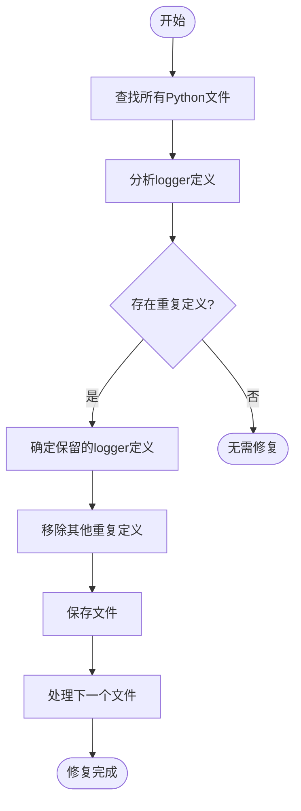
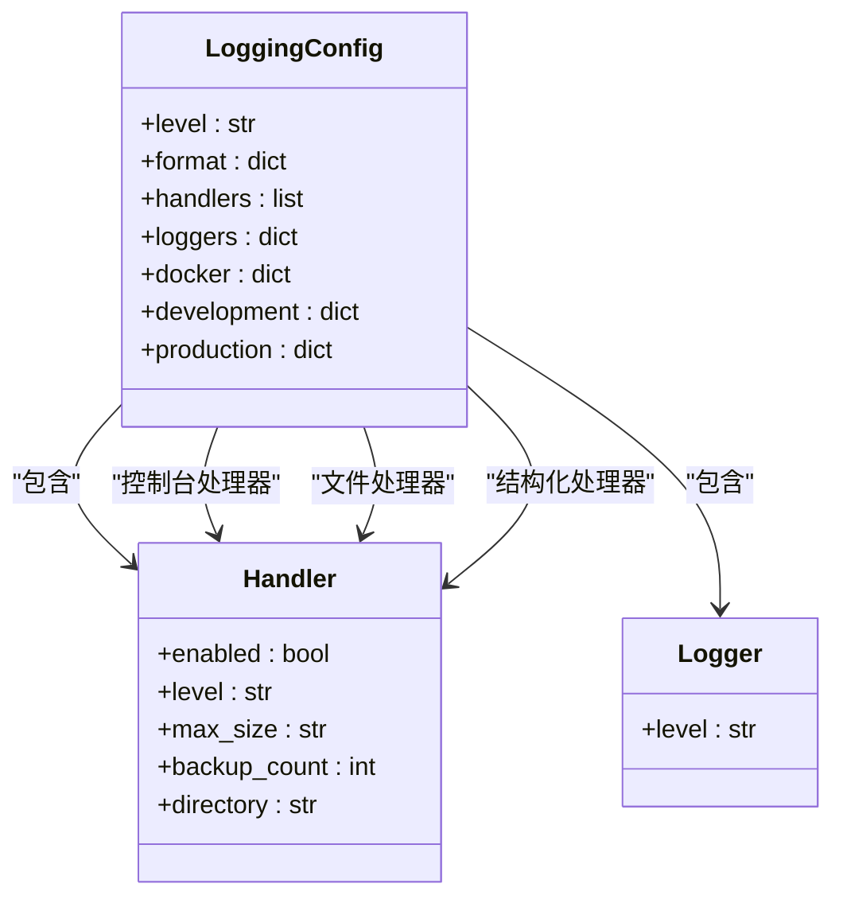
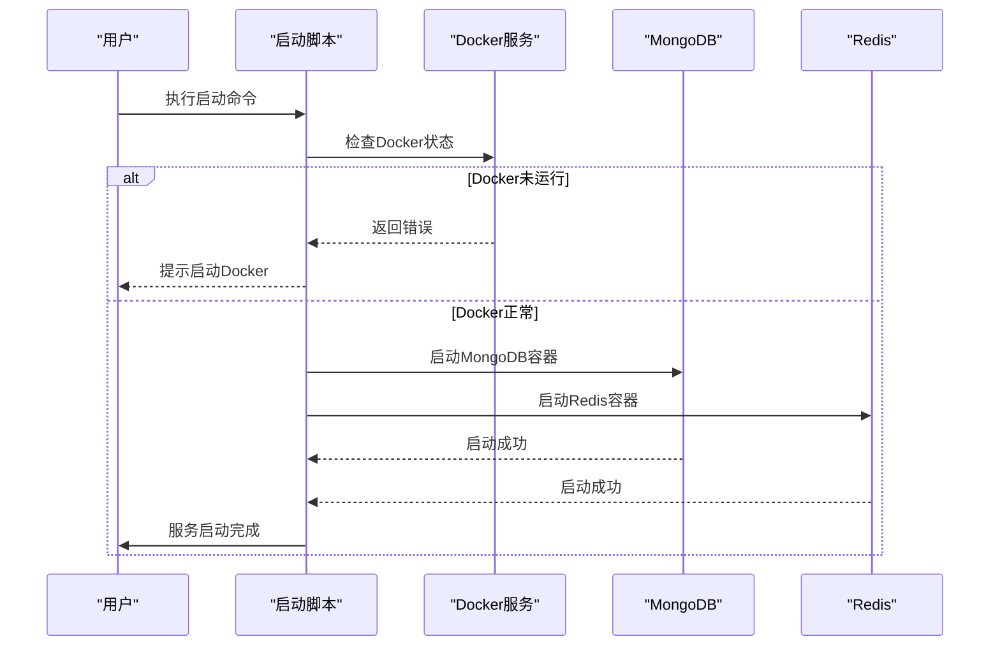
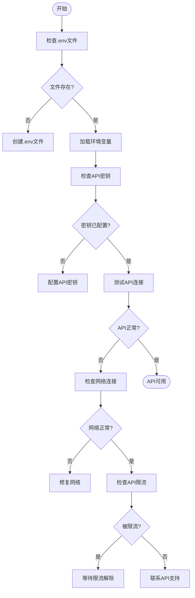
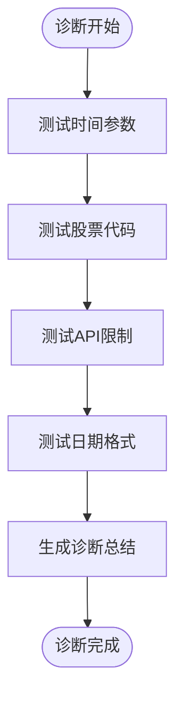
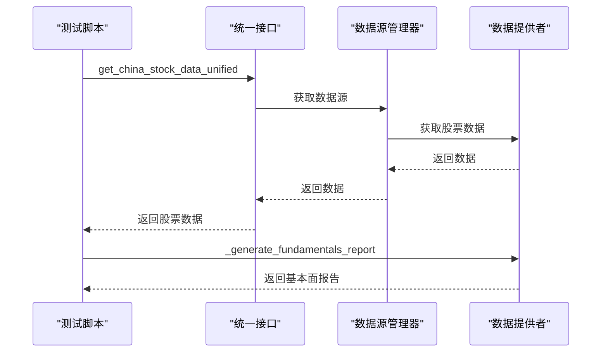

# 故障排除

<cite>
**本文档中引用的文件**  
- [duplicate_logger_fix_report.md](file://reports/duplicate_logger_fix_report.md)
- [logger_position_fix_report.md](file://reports/logger_position_fix_report.md)
- [logging_import_fix_report.md](file://reports/logging_import_fix_report.md)
- [print_to_log_conversion_report.md](file://reports/print_to_log_conversion_report.md)
- [syntax_error_files_report.txt](file://reports/syntax_error_files_report.txt)
- [diagnose_empty_data.py](file://scripts/diagnose_empty_data.py)
- [test_fundamentals_with_stock_name.py](file://scripts/test_fundamentals_with_stock_name.py)
- [get_container_logs.py](file://scripts/get_container_logs.py)
- [check_api_config.py](file://scripts/check_api_config.py)
- [fix_duplicate_loggers.py](file://scripts/fix_duplicate_loggers.py)
- [logging.toml](file://config/logging.toml)
- [logging_docker.toml](file://config/logging_docker.toml)
- [check_system_status.py](file://scripts/validation/check_system_status.py)
- [cleanup_cache.py](file://scripts/maintenance/cleanup_cache.py)
- [start_docker_services.sh](file://scripts/docker/start_docker_services.sh)
- [stop_docker_services.sh](file://scripts/docker/stop_docker_services.sh)
- [docker-compose.yml](file://docker-compose.yml)
</cite>

## 目录
1. [引言](#引言)
2. [日志系统问题排查](#日志系统问题排查)
3. [服务启动与连接异常](#服务启动与连接异常)
4. [数据获取为空问题](#数据获取为空问题)
5. [诊断脚本使用指南](#诊断脚本使用指南)
6. [Docker容器排查技巧](#docker容器排查技巧)
7. [预防性维护建议](#预防性维护建议)
8. [附录](#附录)

## 引言
本故障排除指南旨在系统性地解决TradingAgents系统在部署和运行过程中遇到的常见问题。通过分析`reports/`目录下的各类修复报告，我们整理了日志配置、重复记录器、语法错误等典型问题的根本原因和解决方案。针对服务启动失败、数据库连接异常、LLM调用超时、数据获取为空等关键故障，提供了详细的诊断步骤和修复方法。同时，本指南介绍了如何使用`diagnose_empty_data.py`、`test_fundamentals_with_stock_name.py`等诊断脚本定位数据流问题，并提供了Docker容器日志查看、网络连通性测试、依赖服务状态检查等实用排查技巧。

## 日志系统问题排查

### 重复Logger定义问题
根据`reports/duplicate_logger_fix_report.md`报告，系统中存在大量重复的logger定义问题。在321个扫描文件中，有98个文件发现了重复定义，总共移除了108个重复定义。

**问题现象**：
- 在同一文件中多次定义`logger = get_logger()`，如`main.py`中第6行和第8行都定义了`logger = get_logger('default')`
- 导致日志输出混乱，可能丢失重要日志信息

**根本原因**：
- 开发过程中未遵循统一的日志初始化规范
- 多次复制粘贴代码导致重复定义
- 缺乏代码审查机制

**解决方案**：
1. 使用`scripts/fix_duplicate_loggers.py`脚本自动修复
2. 手动检查并移除重复的logger定义，确保每个文件只在头部定义一次
3. 保留import语句区域附近的logger定义，移除其他位置的重复定义



**诊断步骤**：
1. 运行`python scripts/fix_duplicate_loggers.py`执行修复
2. 检查生成的`duplicate_logger_fix_report.md`报告确认修复结果
3. 验证日志输出是否正常

**Section sources**
- [duplicate_logger_fix_report.md](file://reports/duplicate_logger_fix_report.md)
- [fix_duplicate_loggers.py](file://scripts/fix_duplicate_loggers.py)

### 日志导入位置问题
根据`reports/logger_position_fix_report.md`报告，系统中未发现日志导入位置问题，修复文件数为0。

**问题现象**：
- 日志导入语句位置不当，可能影响模块加载顺序
- 导致日志配置未正确应用

**根本原因**：
- 日志导入语句未放在文件头部
- 在函数内部导入日志模块

**解决方案**：
- 确保所有日志导入语句位于文件头部，在import语句区域
- 使用`reports/logging_import_fix_report.md`中列出的文件作为参考

**Section sources**
- [logger_position_fix_report.md](file://reports/logger_position_fix_report.md)
- [logging_import_fix_report.md](file://reports/logging_import_fix_report.md)

### 日志配置问题
系统提供了两种日志配置文件：`config/logging.toml`用于常规环境，`config/logging_docker.toml`用于Docker环境。

**常见问题**：
- Docker环境中日志配置错误，导致KeyError: 'file'错误
- 日志级别设置不当，无法获取足够的调试信息
- 日志文件路径权限问题

**解决方案**：
1. 确保Docker环境使用`logging_docker.toml`配置文件
2. 检查`logging.docker`配置项：
   - `enabled = true`
   - `stdout_only = false`
   - `disable_file_logging = false`
3. 确保容器内日志目录`/app/logs`存在且有写入权限



**Diagram sources**
- [logging.toml](file://config/logging.toml)
- [logging_docker.toml](file://config/logging_docker.toml)

**Section sources**
- [logging.toml](file://config/logging.toml)
- [logging_docker.toml](file://config/logging_docker.toml)

### Print语句转换问题
根据`reports/print_to_log_conversion_report.md`报告，系统已成功将100个文件中的print语句转换为日志记录。

**问题现象**：
- 使用print语句输出调试信息，无法控制输出级别
- print输出无法被日志系统捕获和管理

**根本原因**：
- 早期开发阶段使用print进行调试
- 缺乏统一的日志使用规范

**解决方案**：
- 使用`scripts/convert_prints_to_logs.py`脚本批量转换
- 将所有print语句替换为适当的日志级别记录：
  - `logger.info()` 替代普通输出
  - `logger.debug()` 替代调试信息
  - `logger.warning()` 替代警告信息
  - `logger.error()` 替代错误信息

**Section sources**
- [print_to_log_conversion_report.md](file://reports/print_to_log_conversion_report.md)

### 语法错误问题
根据`reports/syntax_error_files_report.txt`报告，系统中存在65个文件有语法错误。

**问题现象**：
- 意外缩进错误，如`data/scripts/sync_stock_info_to_mongodb.py`第398行
- 缺少except或finally块，如`examples/dashscope_examples/demo_dashscope_simple.py`第111行
- 无效语法，如`scripts/build_docker_with_pdf.py`第35行

**根本原因**：
- 代码编辑过程中未正确处理缩进
- 异常处理块不完整
- 特殊字符混入代码，如`upstream_contribution/batch2_error_handling/tradingagents/agents/analysts/market_analyst.py`中的中文句号

**解决方案**：
1. 使用`scripts/syntax_checker.py`检查语法错误
2. 修复缩进问题，确保使用统一的缩进风格（推荐4个空格）
3. 完善异常处理块，确保try语句有对应的except或finally
4. 移除代码中的特殊字符

**Section sources**
- [syntax_error_files_report.txt](file://reports/syntax_error_files_report.txt)

## 服务启动与连接异常

### 服务启动失败
**问题现象**：
- 启动脚本执行失败
- 依赖服务未正确启动
- 环境变量配置错误

**根本原因**：
- `.env`文件缺失或配置不正确
- 依赖服务（MongoDB、Redis）未启动
- 端口冲突或权限问题

**解决方案**：
1. 检查`.env`文件是否存在，必要时复制`.env.example`创建
2. 使用`scripts/docker/start_docker_services.sh`启动依赖服务
3. 检查端口占用情况，确保27017(MongoDB)和6379(Redis)端口可用



**Diagram sources**
- [start_docker_services.sh](file://scripts/docker/start_docker_services.sh)
- [stop_docker_services.sh](file://scripts/docker/stop_docker_services.sh)

**Section sources**
- [start_docker_services.sh](file://scripts/docker/start_docker_services.sh)

### 数据库连接异常
**问题现象**：
- 无法连接MongoDB或Redis
- 数据库认证失败
- 网络连接超时

**根本原因**：
- 数据库服务未运行
- 连接地址或端口配置错误
- 认证凭据不正确

**解决方案**：
1. 使用`scripts/validation/check_system_status.py`检查系统状态
2. 验证环境变量配置：
   - `MONGODB_ENABLED=true`
   - `MONGODB_HOST=localhost`
   - `MONGODB_PORT=27017`
   - `REDIS_ENABLED=true`
   - `REDIS_HOST=localhost`
   - `REDIS_PORT=6379`
3. 检查数据库容器状态：`docker ps --filter "name=tradingagents-"`

**诊断步骤**：
1. 运行`python scripts/validation/check_system_status.py`
2. 检查输出中的数据库状态信息
3. 根据提示修复配置问题

**Section sources**
- [check_system_status.py](file://scripts/validation/check_system_status.py)

### LLM调用超时
**问题现象**：
- LLM API调用响应缓慢或超时
- 无法获取AI分析结果
- Token使用量异常

**根本原因**：
- API密钥未配置或无效
- 网络连接问题
- API服务端限流

**解决方案**：
1. 使用`scripts/check_api_config.py`检查API配置
2. 确保以下环境变量已正确配置：
   - `DASHSCOPE_API_KEY`
   - `OPENAI_API_KEY`
   - `GOOGLE_API_KEY`
   - `DEEPSEEK_API_KEY`
3. 测试API可用性



**Section sources**
- [check_api_config.py](file://scripts/check_api_config.py)

## 数据获取为空问题

### Tushare数据返回为空
**问题现象**：
- 调用Tushare API返回空数据
- 股票基本信息获取失败
- 历史数据查询结果为空

**根本原因**：
- 时间范围问题：查询的日期范围内没有交易数据
- 股票代码问题：股票代码格式不正确或股票已退市
- API权限问题：Tushare账号权限不足
- 网络问题：网络连接不稳定
- 缓存问题：缓存了错误的空数据

**解决方案**：
使用`scripts/diagnose_empty_data.py`脚本进行诊断：



**诊断步骤**：
1. 运行`python scripts/diagnose_empty_data.py`
2. 检查时间参数测试结果
3. 验证股票代码是否正确
4. 测试API权限和调用频率
5. 确认日期格式处理是否正确

**Section sources**
- [diagnose_empty_data.py](file://scripts/diagnose_empty_data.py)

### 基本面分析股票名称获取失败
**问题现象**：
- 基本面报告中显示"未知公司"而非实际股票名称
- 股票信息获取失败
- 行业和地区信息为空

**根本原因**：
- 股票信息获取接口调用失败
- 降级机制未正确工作
- 缓存了错误的股票信息

**解决方案**：
使用`scripts/test_fundamentals_with_stock_name.py`脚本进行测试：



**诊断步骤**：
1. 运行`python scripts/test_fundamentals_with_stock_name.py`
2. 检查是否能正确获取股票名称
3. 验证降级机制是否正常工作
4. 测试完整的基本面分析流程

**Diagram sources**
- [test_fundamentals_with_stock_name.py](file://scripts/test_fundamentals_with_stock_name.py)

**Section sources**
- [test_fundamentals_with_stock_name.py](file://scripts/test_fundamentals_with_stock_name.py)

## 诊断脚本使用指南

### diagnose_empty_data.py
此脚本用于诊断Tushare返回空数据的原因。

**使用方法**：
```bash
python scripts/diagnose_empty_data.py
```

**功能**：
- 测试不同的时间参数
- 测试不同类型的股票代码
- 测试API限制和权限
- 测试日期格式处理

**输出内容**：
- 时间参数测试结果
- 股票代码测试结果
- API限制测试结果
- 日期格式测试结果
- 诊断总结和可能原因

**Section sources**
- [diagnose_empty_data.py](file://scripts/diagnose_empty_data.py)

### test_fundamentals_with_stock_name.py
此脚本用于测试基本面分析是否能正确获取股票名称。

**使用方法**：
```bash
python scripts/test_fundamentals_with_stock_name.py
```

**功能**：
- 测试基本面分析中的股票名称获取
- 直接测试股票信息获取
- 测试基本面分析的降级机制
- 测试完整的基本面分析流程

**输出内容**：
- 股票数据获取结果
- 基本面报告生成结果
- 股票名称检查结果
- 测试总结和建议

**Section sources**
- [test_fundamentals_with_stock_name.py](file://scripts/test_fundamentals_with_stock_name.py)

### check_api_config.py
此脚本用于检查API配置状态和可用性。

**使用方法**：
```bash
python scripts/check_api_config.py
```

**功能**：
- 检查.env文件是否存在
- 检查DashScope配置
- 检查其他API配置
- 检查记忆功能是否可用
- 提供配置建议

**输出内容**：
- .env文件状态
- 各API密钥配置状态
- 记忆功能测试结果
- 配置建议和最小配置建议

**Section sources**
- [check_api_config.py](file://scripts/check_api_config.py)

### check_system_status.py
此脚本用于检查系统状态，包括数据库配置和缓存系统状态。

**使用方法**：
```bash
python scripts/validation/check_system_status.py
```

**功能**：
- 检查环境配置文件
- 检查数据库管理器
- 检查缓存系统
- 测试缓存功能
- 进行简单性能测试
- 提供系统建议

**输出内容**：
- 环境配置状态
- 数据库配置状态
- API密钥配置状态
- 数据库状态
- 缓存系统状态
- 缓存功能测试结果
- 性能测试结果
- 系统建议

**Section sources**
- [check_system_status.py](file://scripts/validation/check_system_status.py)

## Docker容器排查技巧

### 查看容器日志
使用`scripts/get_container_logs.py`脚本获取Docker容器内部日志。

**使用方法**：
```bash
python scripts/get_container_logs.py
```

**功能**：
- 查找TradingAgents容器
- 探索容器文件系统
- 获取Docker标准日志
- 复制日志文件到本地

**诊断步骤**：
1. 运行脚本自动查找容器
2. 探索容器文件系统查找日志文件
3. 获取Docker标准日志
4. 选择并复制日志文件到本地进行分析

**Section sources**
- [get_container_logs.py](file://scripts/get_container_logs.py)

### 网络连通性测试
**测试方法**：
1. 检查容器网络配置：
   ```bash
   docker network ls
   docker network inspect bridge
   ```
2. 测试容器间通信：
   ```bash
   docker exec tradingagents-mongodb ping tradingagents-redis
   ```
3. 测试外部网络连接：
   ```bash
   docker exec tradingagents-data-service curl -I https://api.tushare.pro
   ```

### 依赖服务状态检查
**检查方法**：
1. 查看容器状态：
   ```bash
   docker ps --filter "name=tradingagents-"
   ```
2. 检查MongoDB状态：
   ```bash
   docker exec tradingagents-mongodb mongo --eval "db.stats()"
   ```
3. 检查Redis状态：
   ```bash
   docker exec tradingagents-redis redis-cli -a tradingagents123 ping
   ```

**Section sources**
- [start_docker_services.sh](file://scripts/docker/start_docker_services.sh)

## 预防性维护建议

### 定期清理缓存
使用`scripts/maintenance/cleanup_cache.py`脚本定期清理过期缓存。

**使用方法**：
```bash
# 查看缓存统计
python scripts/maintenance/cleanup_cache.py --stats

# 清理7天前的缓存
python scripts/maintenance/cleanup_cache.py

# 清理3天前的文件缓存
python scripts/maintenance/cleanup_cache.py --days 3 --type file
```

**建议**：
- 每周执行一次缓存清理
- 生产环境设置自动清理任务
- 监控缓存大小，避免磁盘空间不足

**Section sources**
- [cleanup_cache.py](file://scripts/maintenance/cleanup_cache.py)

### 配置管理
**建议**：
1. 确保`.env`文件安全，不要提交到版本控制
2. 定期备份重要配置
3. 使用`check_api_config.py`定期检查API配置
4. 为不同环境（开发、测试、生产）使用不同的配置文件

### 监控与告警
**建议**：
1. 设置日志监控，及时发现错误
2. 监控数据库连接状态
3. 监控API调用成功率和响应时间
4. 设置磁盘空间告警，避免缓存过大

### 备份策略
**建议**：
1. 定期备份MongoDB数据
2. 备份重要配置文件
3. 使用`data_backup_20250731_071130/`目录结构进行数据备份
4. 测试备份恢复流程

## 附录

### 诊断脚本清单
| 脚本名称 | 功能描述 | 使用场景 |
|---------|--------|--------|
| diagnose_empty_data.py | 诊断Tushare返回空数据的原因 | 数据获取为空问题 |
| test_fundamentals_with_stock_name.py | 测试基本面分析股票名称获取 | 股票信息获取失败 |
| get_container_logs.py | 获取Docker容器内部日志 | 容器日志查看 |
| check_api_config.py | 检查API配置状态 | API调用问题 |
| check_system_status.py | 检查系统状态 | 系统整体健康检查 |
| cleanup_cache.py | 清理过期缓存 | 预防性维护 |

### 常见错误代码对照表
| 错误类型 | 可能原因 | 解决方案 |
|---------|--------|--------|
| KeyError: 'file' | Docker日志配置错误 | 使用logging_docker.toml |
| unexpected indent | 代码缩进错误 | 修复缩进，使用4个空格 |
| expected 'except' or 'finally' block | 异常处理块不完整 | 添加except或finally块 |
| Connection refused | 数据库连接失败 | 检查数据库服务是否运行 |
| API rate limit exceeded | API调用超限 | 降低调用频率或升级API套餐 |

### 环境变量配置参考
```env
# LLM API密钥
DASHSCOPE_API_KEY=your_dashscope_api_key
OPENAI_API_KEY=your_openai_api_key
GOOGLE_API_KEY=your_google_api_key
DEEPSEEK_API_KEY=your_deepseek_api_key

# 数据源API密钥
TUSHARE_TOKEN=your_tushare_token
FINNHUB_API_KEY=your_finnhub_api_key

# 数据库配置
MONGODB_ENABLED=true
MONGODB_HOST=localhost
MONGODB_PORT=27017
MONGODB_USERNAME=admin
MONGODB_PASSWORD=tradingagents123

REDIS_ENABLED=true
REDIS_HOST=localhost
REDIS_PORT=6379
REDIS_PASSWORD=tradingagents123
```