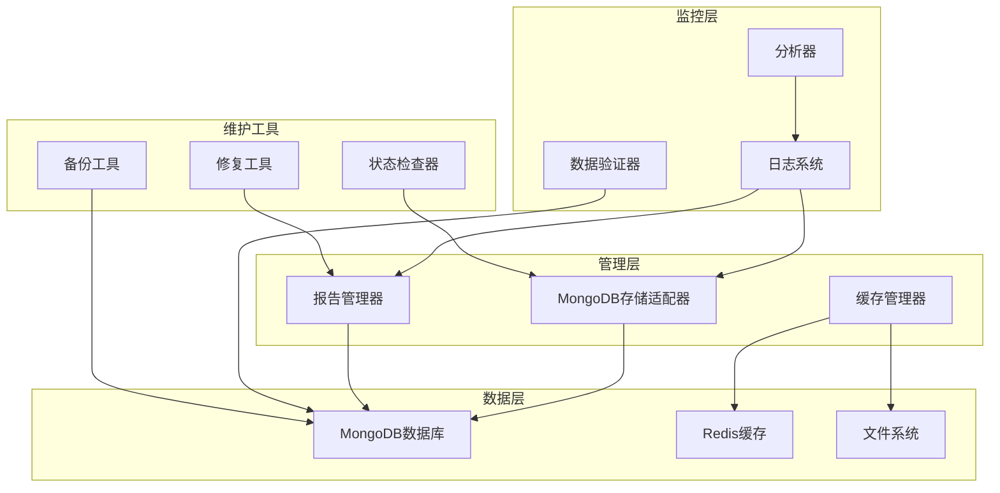
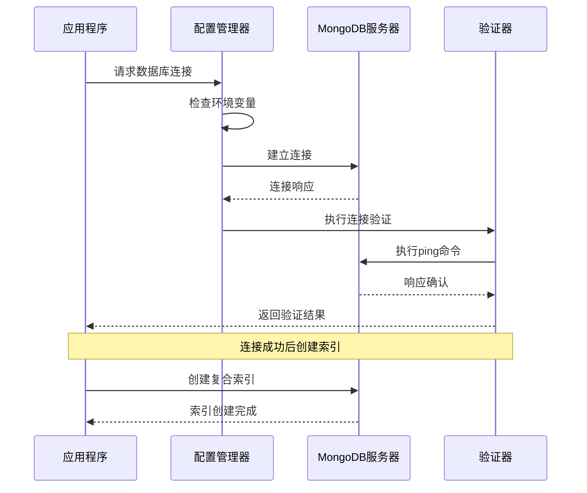
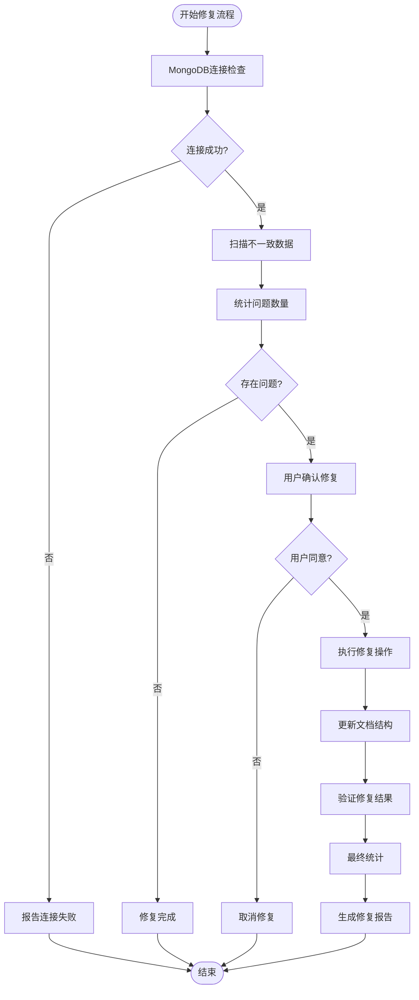
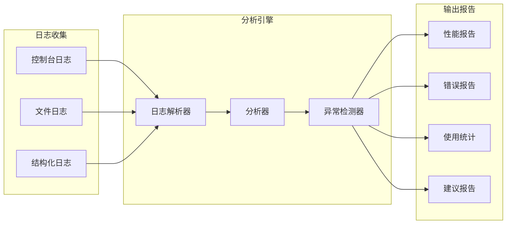
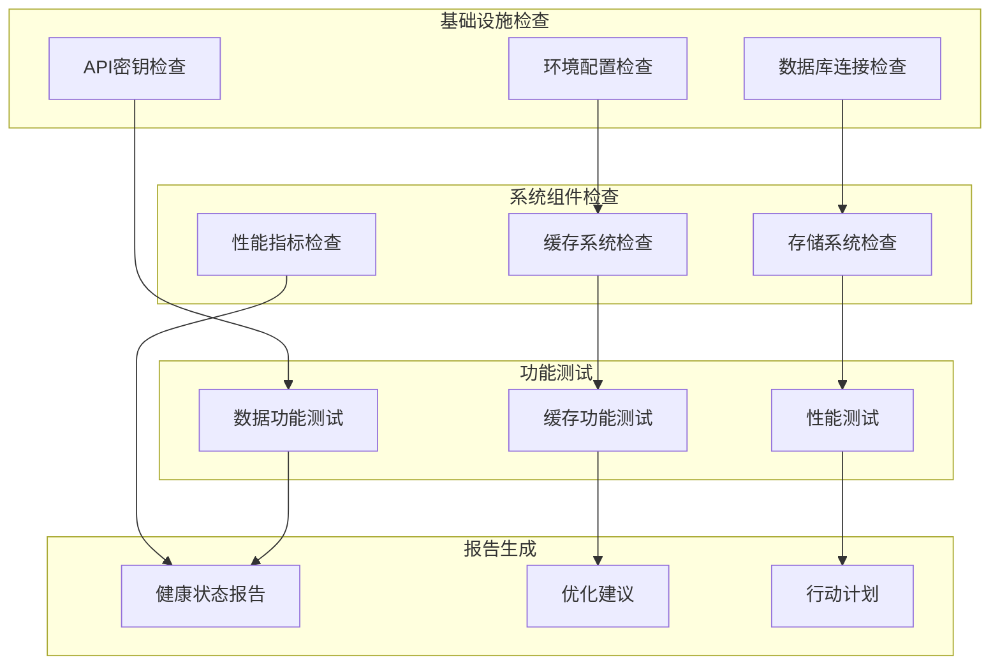
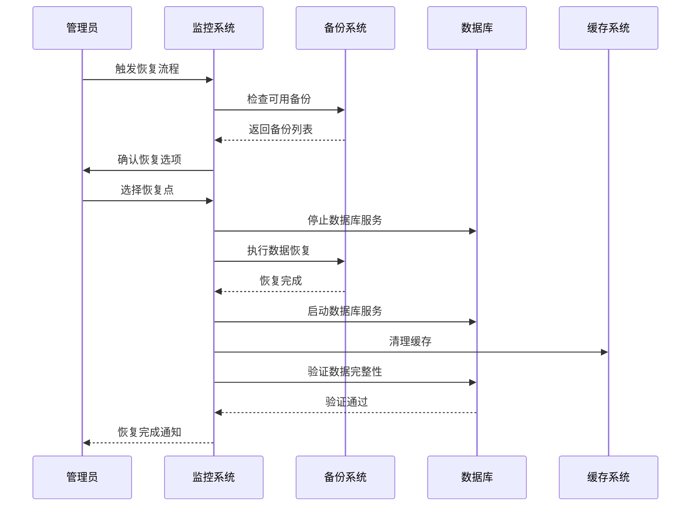
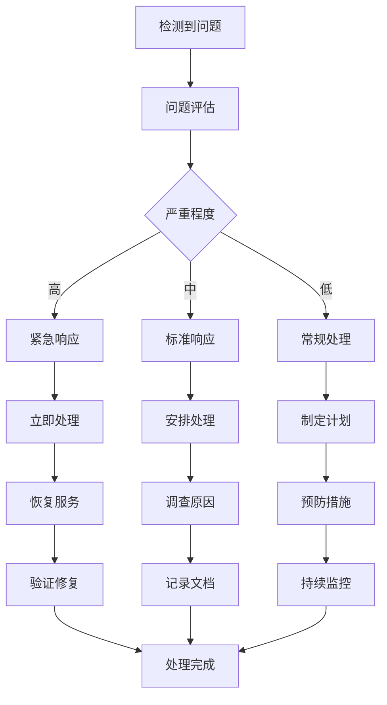

# 数据完整性与修复

<cite>
**本文档引用的文件**
- [mongodb_storage.py](file://tradingagents/config/mongodb_storage.py)
- [fix_mongodb_reports.py](file://scripts/maintenance/fix_mongodb_reports.py)
- [mongodb_report_manager.py](file://web/utils/mongodb_report_manager.py)
- [logging.toml](file://config/logging.toml)
- [diagnose_empty_data.py](file://scripts/diagnose_empty_data.py)
- [log_analyzer.py](file://scripts/log_analyzer.py)
- [verify_mongodb_data.py](file://tests/verify_mongodb_data.py)
- [check_system_status.py](file://scripts/validation/check_system_status.py)
- [init_database.py](file://scripts/setup/init_database.py)
</cite>

## 目录
1. [概述](#概述)
2. [数据完整性监控体系](#数据完整性监控体系)
3. [MongoDB数据验证机制](#mongodb数据验证机制)
4. [报告数据修复工具](#报告数据修复工具)
5. [日志分析与异常检测](#日志分析与异常检测)
6. [系统状态检查](#系统状态检查)
7. [数据备份与恢复策略](#数据备份与恢复策略)
8. [故障排除指南](#故障排除指南)
9. [自动化维护脚本](#自动化维护脚本)
10. [最佳实践建议](#最佳实践建议)

## 概述

TradingAgents-CN系统采用多层次的数据完整性维护策略，确保金融数据分析平台的稳定运行。本文档详细介绍了基于MongoDB的数据存取机制、数据一致性验证、异常修复工具以及系统监控方案。

### 核心组件架构



**图表来源**
- [mongodb_storage.py](file://tradingagents/config/mongodb_storage.py#L1-L50)
- [mongodb_report_manager.py](file://web/utils/mongodb_report_manager.py#L1-L50)

## 数据完整性监控体系

### 多层次验证机制

系统实现了从连接层到应用层的全方位数据完整性监控：

#### 1. 连接层验证
- **连接状态监控**: 实时检测MongoDB连接可用性
- **认证验证**: 确保数据库访问凭据正确
- **网络连通性**: 检测网络延迟和丢包率

#### 2. 数据层验证
- **索引完整性**: 验证数据库索引的有效性
- **数据结构一致性**: 检查文档结构标准化
- **约束条件验证**: 确保数据符合业务规则

#### 3. 应用层验证
- **业务逻辑验证**: 检查数据分析流程的正确性
- **缓存一致性**: 确保多层缓存数据同步
- **事务完整性**: 验证复杂操作的原子性

**章节来源**
- [mongodb_storage.py](file://tradingagents/config/mongodb_storage.py#L40-L80)
- [mongodb_report_manager.py](file://web/utils/mongodb_report_manager.py#L40-L80)

## MongoDB数据验证机制

### 连接与配置验证

系统提供了完善的MongoDB连接验证机制：



**图表来源**
- [mongodb_storage.py](file://tradingagents/config/mongodb_storage.py#L40-L80)
- [mongodb_report_manager.py](file://web/utils/mongodb_report_manager.py#L40-L80)

### 数据完整性检查

#### 字段完整性验证
系统自动检查关键字段的存在性和有效性：

| 字段名称 | 验证规则 | 重要性等级 | 处理策略 |
|---------|---------|-----------|---------|
| `analysis_id` | 唯一标识符，非空 | 高 | 自动生成，强制唯一 |
| `reports` | 分析报告内容，字典类型 | 高 | 空值补全，类型转换 |
| `timestamp` | 时间戳，UTC格式 | 中 | 自动填充，格式验证 |
| `stock_symbol` | 股票代码，格式规范 | 高 | 格式校验，长度限制 |
| `status` | 处理状态，枚举值 | 中 | 状态机验证 |

#### 数据一致性检查
- **引用完整性**: 确保外键关系正确
- **时间序列完整性**: 验证时间戳顺序
- **业务规则一致性**: 检查数据符合业务逻辑

**章节来源**
- [mongodb_report_manager.py](file://web/utils/mongodb_report_manager.py#L300-L350)
- [verify_mongodb_data.py](file://tests/verify_mongodb_data.py#L80-L150)

## 报告数据修复工具

### 修复工具功能架构

`fix_mongodb_reports.py`提供了全面的报告数据修复能力：



**图表来源**
- [fix_mongodb_reports.py](file://scripts/maintenance/fix_mongodb_reports.py#L33-L120)

### 修复策略详解

#### 1. 缺失字段修复
- **问题识别**: 检查`reports`字段是否存在
- **修复方案**: 自动添加空字典`{}`作为默认值
- **数据迁移**: 保持原有文档结构不变

#### 2. 空值处理
- **空字典检测**: 识别`reports`字段为空的情况
- **默认值填充**: 替换为空字典`{}`
- **历史数据保留**: 确保修改时间戳更新

#### 3. 类型修复
- **类型验证**: 检查字段类型是否符合预期
- **自动转换**: 将错误类型转换为正确类型
- **数据完整性**: 保证修复后的数据可用性

**章节来源**
- [fix_mongodb_reports.py](file://scripts/maintenance/fix_mongodb_reports.py#L120-L185)

## 日志分析与异常检测

### 日志分析系统架构



**图表来源**
- [log_analyzer.py](file://scripts/log_analyzer.py#L1-L50)
- [logging.toml](file://config/logging.toml#L1-L50)

### 异常检测算法

#### 性能异常检测
- **慢操作识别**: 检测执行时间超过阈值的操作
- **资源使用监控**: 监控CPU、内存使用情况
- **网络延迟分析**: 检测网络连接异常

#### 错误模式识别
- **API错误分类**: 自动识别不同类型的API错误
- **数据库异常**: 检测连接、查询、写入异常
- **缓存失效**: 监控缓存命中率和失效模式

**章节来源**
- [log_analyzer.py](file://scripts/log_analyzer.py#L80-L150)

## 系统状态检查

### 全面健康检查

系统状态检查涵盖了从基础设施到应用层的各个层面：



**图表来源**
- [check_system_status.py](file://scripts/validation/check_system_status.py#L1-L50)

### 关键检查项目

#### 1. 环境配置验证
- **数据库配置**: 检查MongoDB和Redis配置
- **API密钥**: 验证第三方服务密钥
- **路径配置**: 确认文件系统路径正确

#### 2. 连接状态验证
- **实时连接测试**: 验证数据库连接可用性
- **认证有效性**: 检查访问凭据正确性
- **网络可达性**: 测试网络连通性

#### 3. 功能完整性检查
- **核心功能测试**: 验证关键业务功能
- **降级机制**: 检查备用方案可用性
- **性能基准**: 对比性能指标

**章节来源**
- [check_system_status.py](file://scripts/validation/check_system_status.py#L50-L150)

## 数据备份与恢复策略

### 备份策略设计

虽然项目中没有直接的备份脚本，但系统提供了完善的数据保护机制：

#### 1. 多层备份策略
- **实时备份**: MongoDB副本集配置
- **定时备份**: 自动化的数据导出
- **增量备份**: 只备份变更的数据

#### 2. 恢复机制
- **快速恢复**: 内存缓存优先
- **渐进恢复**: 从数据库逐步加载
- **灾难恢复**: 备用数据中心切换

### 数据恢复流程



**章节来源**
- [init_database.py](file://scripts/setup/init_database.py#L200-L295)

## 故障排除指南

### 常见问题诊断

#### 1. 数据缺失问题

**症状识别**:
- 分析报告中缺少`reports`字段
- 查询返回空结果集
- 数据统计显示异常

**诊断步骤**:
1. 检查MongoDB连接状态
2. 验证集合存在性和索引
3. 分析查询条件和过滤器
4. 检查数据导入流程

**解决方案**:
- 使用修复工具批量处理
- 手动补充缺失数据
- 重建相关索引

#### 2. 文档损坏问题

**症状识别**:
- JSON解析错误
- 字段类型不匹配
- 数据格式异常

**诊断工具**:
- [diagnose_empty_data.py](file://scripts/diagnose_empty_data.py)
- [verify_mongodb_data.py](file://tests/verify_mongodb_data.py)

#### 3. 索引失效问题

**症状识别**:
- 查询性能下降
- 超时错误频繁
- CPU使用率过高

**修复方法**:
- 重建相关索引
- 优化查询语句
- 调整数据库配置

**章节来源**
- [diagnose_empty_data.py](file://scripts/diagnose_empty_data.py#L1-L100)
- [mongodb_report_manager.py](file://web/utils/mongodb_report_manager.py#L300-L350)

## 自动化维护脚本

### 定期维护任务

#### 1. 数据完整性检查脚本
```bash
# 数据验证脚本
python tests/verify_mongodb_data.py

# 系统状态检查
python scripts/validation/check_system_status.py

# 报告修复脚本
python scripts/maintenance/fix_mongodb_reports.py --fix
```

#### 2. 性能监控脚本
```bash
# 日志分析
python scripts/log_analyzer.py ./logs/app.log --output report.html

# 空数据诊断
python scripts/diagnose_empty_data.py
```

#### 3. 自动化部署脚本
```bash
# 数据库初始化
python scripts/setup/init_database.py

# 系统健康检查
python scripts/validation/check_system_status.py --auto-fix
```

### 维护计划模板

| 维护类型 | 频率 | 脚本 | 预期结果 |
|---------|------|------|---------|
| 连接检查 | 每小时 | check_system_status.py | 连接正常 |
| 数据验证 | 每日 | verify_mongodb_data.py | 数据完整 |
| 报告修复 | 每周 | fix_mongodb_reports.py | 无异常报告 |
| 性能分析 | 每日 | log_analyzer.py | 性能指标正常 |
| 备份验证 | 每月 | init_database.py | 备份可用 |

**章节来源**
- [check_system_status.py](file://scripts/validation/check_system_status.py#L200-L257)
- [log_analyzer.py](file://scripts/log_analyzer.py#L300-L373)

## 最佳实践建议

### 数据完整性保障

#### 1. 预防措施
- **定期备份**: 建立自动化的数据备份机制
- **监控告警**: 设置关键指标的监控和告警
- **版本控制**: 对配置文件和脚本进行版本管理
- **文档维护**: 保持操作文档的及时更新

#### 2. 监控策略
- **实时监控**: 监控数据库连接和性能指标
- **定期检查**: 建立定期的数据完整性检查流程
- **异常处理**: 建立完善的异常处理和恢复机制
- **容量规划**: 根据数据增长趋势进行容量规划

#### 3. 运维流程
- **变更管理**: 对数据库结构变更进行严格管理
- **测试验证**: 在生产环境变更前进行充分测试
- **回滚准备**: 准备快速回滚方案
- **知识传承**: 建立运维知识库和培训体系

### 故障响应流程



### 技术债务管理

#### 1. 代码质量
- **定期重构**: 持续优化代码结构
- **测试覆盖**: 提高单元测试和集成测试覆盖率
- **文档更新**: 保持技术文档的时效性
- **知识分享**: 建立团队知识共享机制

#### 2. 基础设施
- **容器化**: 使用Docker等容器技术
- **自动化**: 实现部署和运维的自动化
- **监控完善**: 建立全面的监控体系
- **安全加固**: 定期进行安全审计和加固

通过实施这些最佳实践，可以显著提高系统的数据完整性、稳定性和可维护性，确保TradingAgents-CN平台能够持续稳定地为用户提供高质量的金融服务。