# 数据库初始化异常处理指南

<cite>
**本文档引用的文件**
- [init_database.py](file://scripts/setup/init_database.py)
- [mongo-init.js](file://scripts/mongo-init.js)
- [mongo-init.js](file://scripts/docker/mongo-init.js)
- [setup_databases.py](file://scripts/setup/setup_databases.py)
- [database_manager.py](file://tradingagents/config/database_manager.py)
- [database_config.py](file://tradingagents/config/database_config.py)
- [check_dependencies.py](file://scripts/validation/check_dependencies.py)
- [start_docker_services.sh](file://scripts/docker/start_docker_services.sh)
- [docker-compose.yml](file://docker-compose.yml)
</cite>

## 目录
1. [概述](#概述)
2. [初始化脚本架构](#初始化脚本架构)
3. [MongoDB初始化异常处理](#mongodb初始化异常处理)
4. [Redis初始化异常处理](#redis初始化异常处理)
5. [环境检查清单](#环境检查清单)
6. [部分初始化成功处理](#部分初始化成功处理)
7. [清理和重试流程](#清理和重试流程)
8. [故障排除指南](#故障排除指南)
9. [最佳实践建议](#最佳实践建议)

## 概述

TradingAgents系统采用多层数据库架构，支持MongoDB和Redis双引擎缓存模式。本指南详细说明了数据库初始化过程中的异常处理机制，涵盖了集合创建失败、索引构建错误、初始数据插入异常等各种场景的处理策略。

### 初始化架构概览

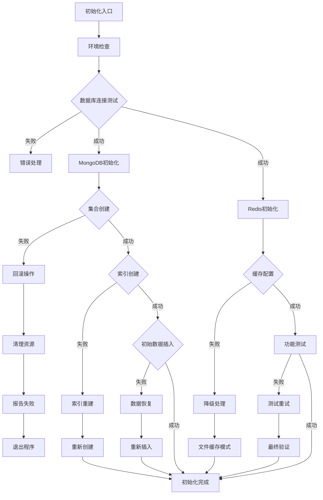

**图表来源**
- [init_database.py](file://scripts/setup/init_database.py#L254-L293)
- [database_manager.py](file://tradingagents/config/database_manager.py#L188-L221)

## 初始化脚本架构

### 执行顺序和依赖关系

系统数据库初始化遵循严格的执行顺序，确保各组件间的正确依赖关系：

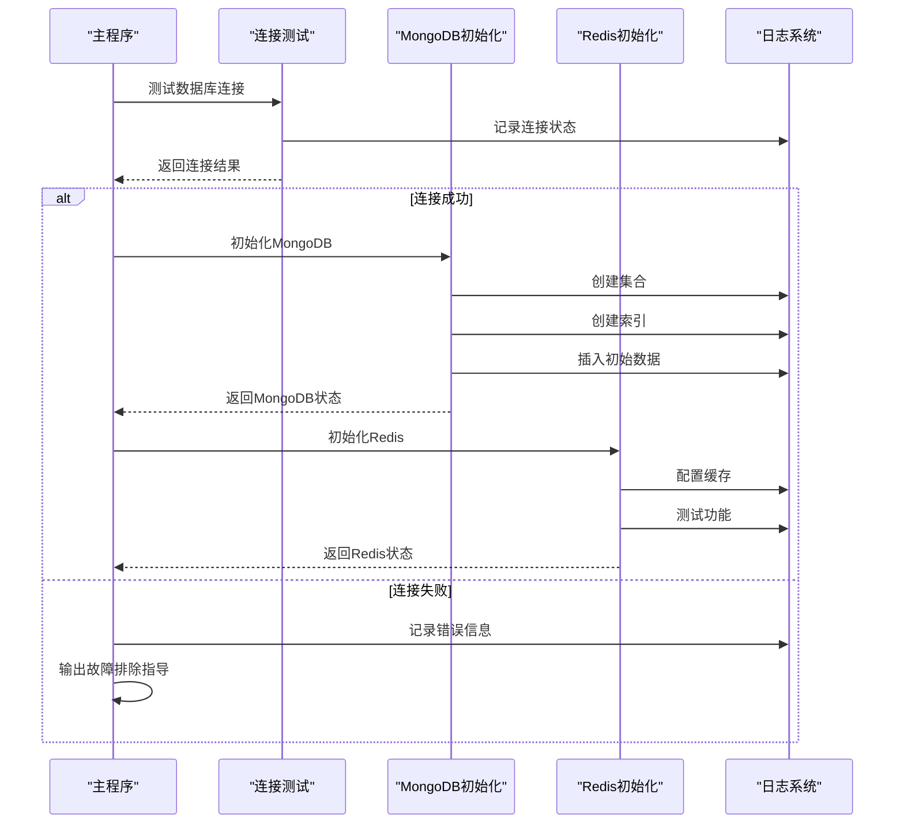

**图表来源**
- [init_database.py](file://scripts/setup/init_database.py#L254-L293)
- [database_manager.py](file://tradingagents/config/database_manager.py#L188-L221)

### 核心初始化组件

#### MongoDB初始化流程

MongoDB初始化包含以下关键步骤：

1. **连接验证**：检查MongoDB服务可用性
2. **数据库创建**：创建主数据库实例
3. **集合创建**：建立核心业务集合
4. **索引构建**：优化查询性能
5. **数据初始化**：插入系统配置数据

#### Redis初始化流程

Redis初始化专注于缓存功能配置：

1. **连接测试**：验证Redis服务状态
2. **缓存清理**：清空现有缓存数据
3. **配置设置**：初始化缓存参数
4. **功能测试**：验证读写功能
5. **统计监控**：收集性能指标

**章节来源**
- [init_database.py](file://scripts/setup/init_database.py#L25-L150)
- [init_database.py](file://scripts/setup/init_database.py#L152-L250)

## MongoDB初始化异常处理

### 集合创建失败处理

当MongoDB集合创建失败时，系统采用多层次的错误处理机制：

#### 错误类型识别

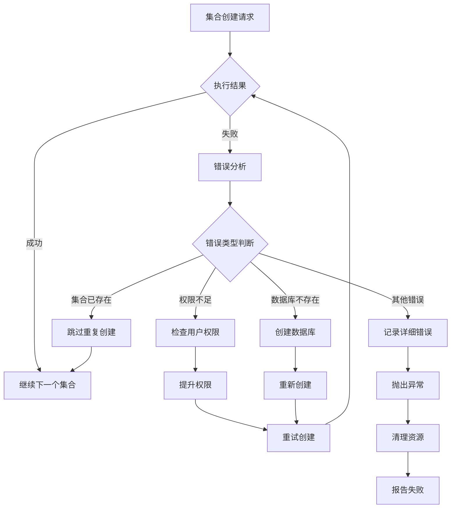

**图表来源**
- [init_database.py](file://scripts/setup/init_database.py#L31-L63)
- [database_manager.py](file://tradingagents/config/database_manager.py#L188-L221)

#### 索引构建错误处理

索引创建失败可能导致严重的性能问题，系统提供以下处理策略：

| 错误类型 | 检测方法 | 处理策略 | 恢复步骤 |
|---------|---------|---------|---------|
| 权限不足 | 连接异常 | 检查用户角色配置 | 重新授权用户 |
| 内存不足 | 创建超时 | 减少索引大小 | 分批创建索引 |
| 数据冲突 | 唯一约束冲突 | 数据去重处理 | 删除重复记录 |
| 索引损坏 | 查询异常 | 重建索引 | drop + recreate |
| 网络中断 | 连接丢失 | 自动重连 | 重试机制 |

### 初始数据插入异常

初始配置数据插入失败会影响系统正常运行，处理流程如下：

#### 数据完整性检查

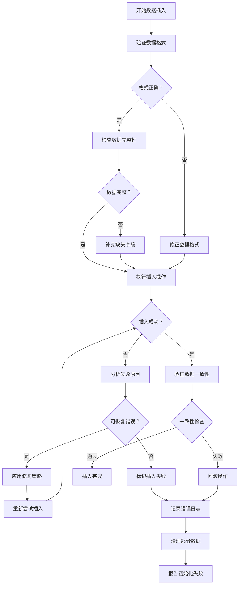

**图表来源**
- [init_database.py](file://scripts/setup/init_database.py#L100-L130)

**章节来源**
- [init_database.py](file://scripts/setup/init_database.py#L31-L150)
- [database_manager.py](file://tradingagents/config/database_manager.py#L188-L221)

## Redis初始化异常处理

### 缓存配置异常

Redis初始化过程中的配置异常处理机制：

#### 连接参数验证

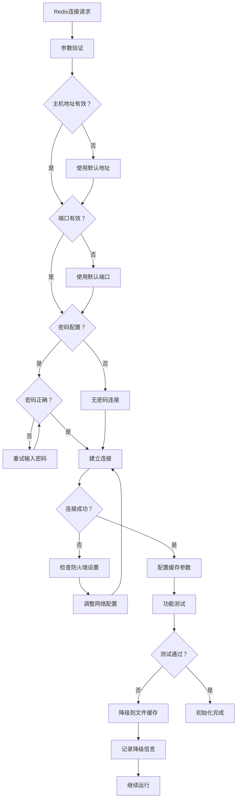

**图表来源**
- [init_database.py](file://scripts/setup/init_database.py#L152-L250)
- [database_manager.py](file://tradingagents/config/database_manager.py#L222-L280)

#### 缓存功能测试

Redis功能测试确保缓存系统正常工作：

| 测试项目 | 验证方法 | 失败处理 | 恢复策略 |
|---------|---------|---------|---------|
| 连接测试 | ping命令 | 记录连接失败 | 重试连接 |
| 写入测试 | set操作 | 检查写入权限 | 修正权限设置 |
| 读取测试 | get操作 | 验证数据一致性 | 重新写入数据 |
| TTL测试 | set with expiry | 检查过期机制 | 调整TTL配置 |
| 清理测试 | flushdb操作 | 确认清理权限 | 限制清理范围 |

### 降级机制

当Redis不可用时，系统自动降级到文件缓存模式：

#### 降级触发条件

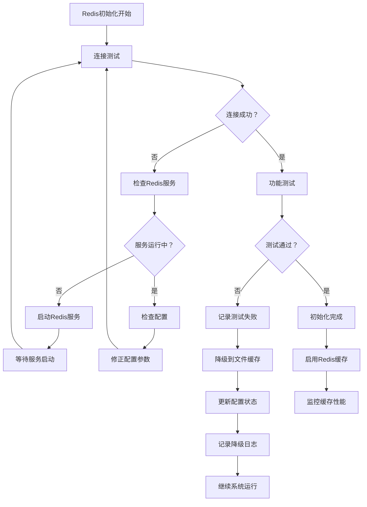

**图表来源**
- [init_database.py](file://scripts/setup/init_database.py#L152-L250)
- [check_dependencies.py](file://scripts/validation/check_dependencies.py#L150-L200)

**章节来源**
- [init_database.py](file://scripts/setup/init_database.py#L152-L250)
- [database_manager.py](file://tradingagents/config/database_manager.py#L222-L280)

## 环境检查清单

### 目录权限检查

在数据库初始化前，必须验证系统目录的访问权限：

#### 必需目录结构

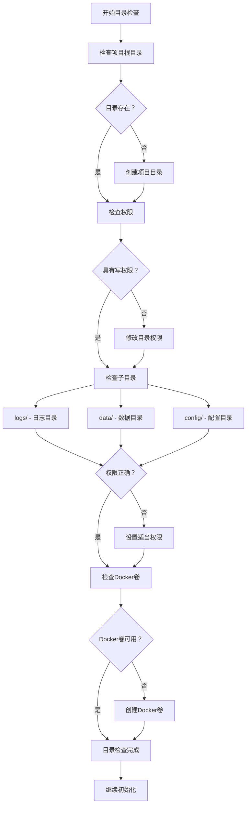

**图表来源**
- [check_dependencies.py](file://scripts/validation/check_dependencies.py#L197-L233)

#### 权限要求表

| 目录路径 | 权限要求 | 检查命令 | 修复方法 |
|---------|---------|---------|---------|
| `/logs` | 755 | `ls -la logs/` | `chmod 755 logs` |
| `/data` | 755 | `ls -la data/` | `chmod 755 data` |
| `/config` | 755 | `ls -la config/` | `chmod 755 config` |
| `/data/cache` | 755 | `ls -la data/cache/` | `chmod 755 data/cache` |
| `/data/exports` | 755 | `ls -la data/exports/` | `chmod 755 data/exports` |
| `/data/temp` | 755 | `ls -la data/temp/` | `chmod 755 data/temp` |

### 配置文件完整性检查

#### 环境变量验证

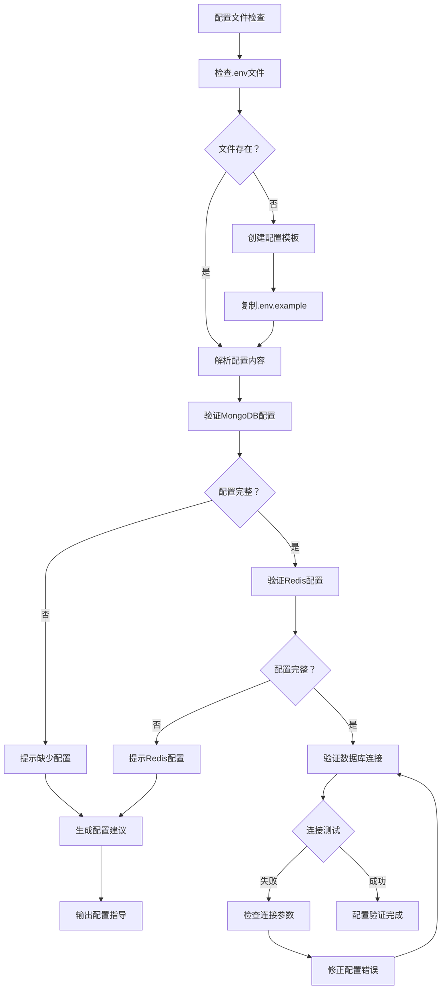

**图表来源**
- [check_dependencies.py](file://scripts/validation/check_dependencies.py#L159-L201)

#### 配置验证表

| 配置项 | 必填 | 默认值 | 验证方法 | 错误处理 |
|-------|------|--------|---------|---------|
| `MONGODB_HOST` | 是 | localhost | 连接测试 | 使用默认值 |
| `MONGODB_PORT` | 是 | 27017 | 端口监听 | 检查防火墙 |
| `MONGODB_DATABASE` | 是 | tradingagents | 数据库存在 | 创建数据库 |
| `REDIS_HOST` | 是 | localhost | 连接测试 | 使用默认值 |
| `REDIS_PORT` | 是 | 6379 | 端口监听 | 检查服务状态 |
| `REDIS_PASSWORD` | 否 | - | 认证测试 | 跳过认证 |

### 服务可用性检查

#### Docker服务检查

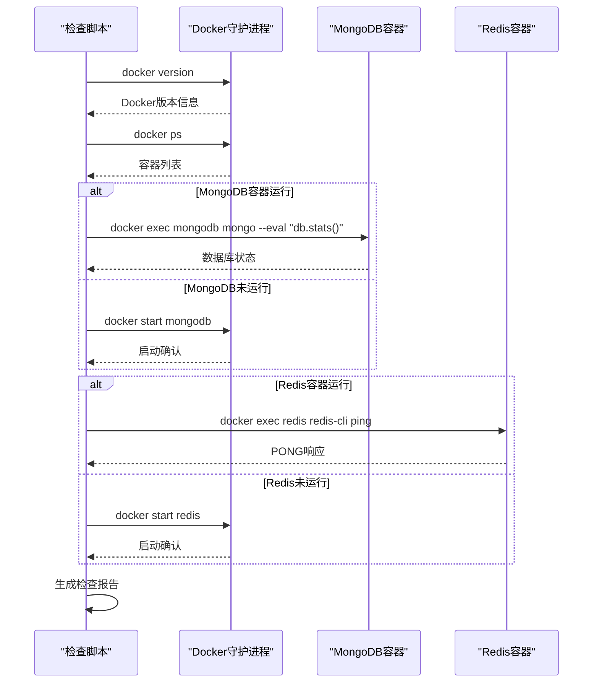

**图表来源**
- [start_docker_services.sh](file://scripts/docker/start_docker_services.sh#L10-L50)
- [docker-compose.yml](file://docker-compose.yml#L100-L158)

**章节来源**
- [check_dependencies.py](file://scripts/validation/check_dependencies.py#L159-L201)
- [start_docker_services.sh](file://scripts/docker/start_docker_services.sh#L10-L50)

## 部分初始化成功处理

### 混合模式运行

当部分数据库服务可用时，系统采用混合模式运行：

#### 服务状态检测

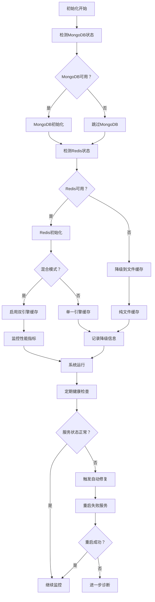

**图表来源**
- [database_manager.py](file://tradingagents/config/database_manager.py#L188-L221)

### 数据一致性维护

#### 分布式事务处理

当数据库初始化部分失败时，确保数据一致性：

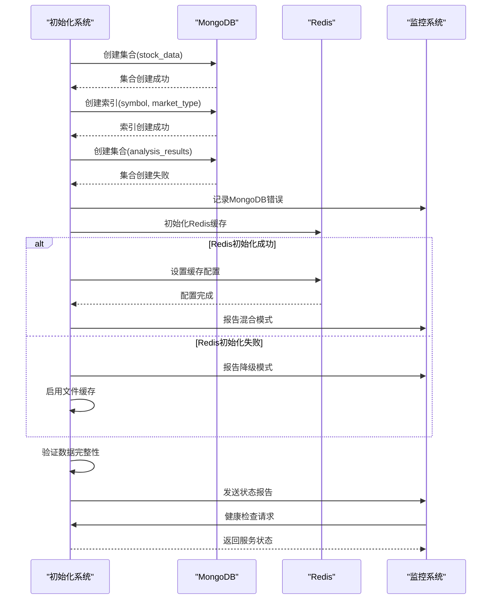

**图表来源**
- [init_database.py](file://scripts/setup/init_database.py#L254-L293)

### 自动恢复机制

#### 故障自愈流程

| 故障类型 | 检测时间 | 恢复策略 | 恢复时间 | 影响范围 |
|---------|---------|---------|---------|---------|
| MongoDB连接失败 | 1分钟 | 重启容器 | 2分钟 | 数据持久化 |
| Redis连接失败 | 1分钟 | 重启服务 | 1分钟 | 缓存功能 |
| 索引创建失败 | 5分钟 | 重建索引 | 10分钟 | 查询性能 |
| 配置数据丢失 | 10分钟 | 重新插入 | 2分钟 | 系统配置 |
| 权限问题 | 3分钟 | 重新授权 | 1分钟 | 访问控制 |

**章节来源**
- [database_manager.py](file://tradingagents/config/database_manager.py#L188-L221)
- [init_database.py](file://scripts/setup/init_database.py#L254-L293)

## 清理和重试流程

### 标准化清理流程

当初始化失败时，系统提供标准化的清理流程：

#### 清理阶段划分

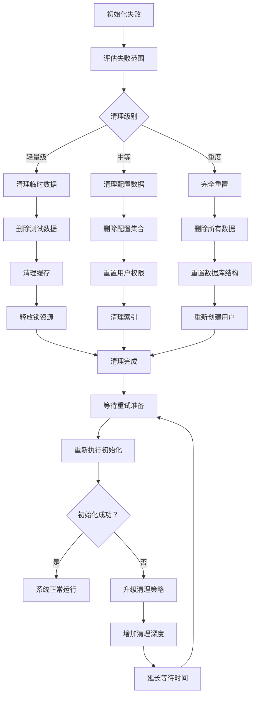

**图表来源**
- [init_database.py](file://scripts/setup/init_database.py#L254-L293)

### 重试策略配置

#### 指数退避算法

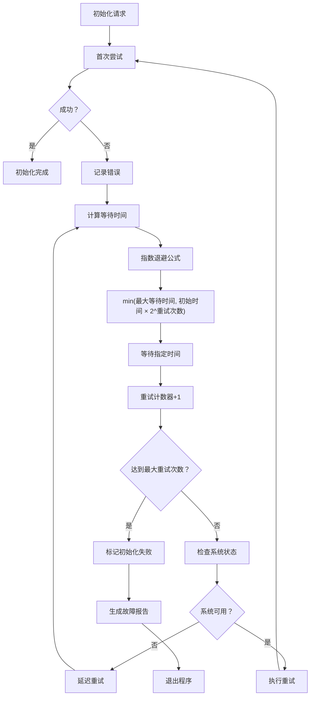

**图表来源**
- [database_manager.py](file://tradingagents/config/database_manager.py#L188-L221)

#### 重试配置表

| 参数名称 | 默认值 | 最大值 | 说明 |
|---------|--------|--------|------|
| 初始重试间隔 | 5秒 | - | 第一次重试等待时间 |
| 最大重试间隔 | 60秒 | - | 最大等待时间 |
| 最大重试次数 | 5次 | - | 总重试上限 |
| 退避倍数 | 2.0 | - | 指数增长因子 |
| 超时时间 | 30秒 | - | 单次操作超时 |
| 健康检查间隔 | 10秒 | - | 状态检查频率 |

### 数据恢复策略

#### 增量恢复机制

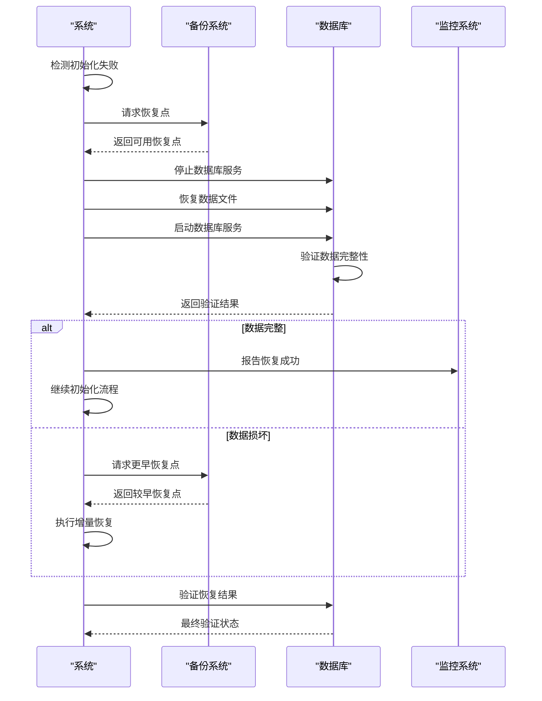

**图表来源**
- [database_manager.py](file://tradingagents/config/database_manager.py#L340-L361)

**章节来源**
- [init_database.py](file://scripts/setup/init_database.py#L254-L293)
- [database_manager.py](file://tradingagents/config/database_manager.py#L188-L221)

## 故障排除指南

### 常见错误诊断

#### 错误分类和处理

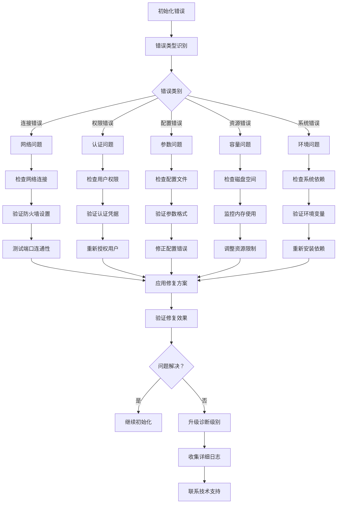

**图表来源**
- [check_dependencies.py](file://scripts/validation/check_dependencies.py#L250-L292)

### 日志分析技巧

#### 关键日志模式

| 错误模式 | 日志关键词 | 可能原因 | 解决方案 |
|---------|-----------|---------|---------|
| 连接超时 | "Connection timeout" | 网络延迟、服务未启动 | 检查服务状态、网络配置 |
| 权限拒绝 | "Permission denied" | 用户权限不足 | 重新授权、检查角色配置 |
| 配置错误 | "Invalid configuration" | 参数格式错误 | 验证配置文件格式 |
| 磁盘满 | "No space left" | 存储空间不足 | 清理磁盘空间 |
| 内存不足 | "Out of memory" | 内存资源耗尽 | 增加内存、优化查询 |
| 端口占用 | "Address already in use" | 端口被其他进程占用 | 更改端口、停止冲突进程 |

### 性能监控指标

#### 关键性能指标

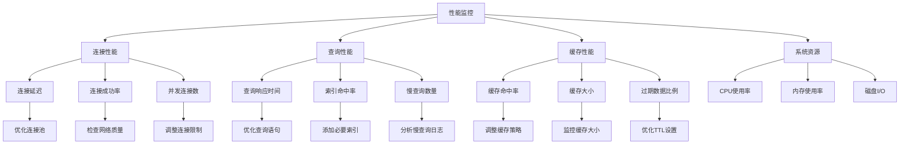

**图表来源**
- [database_manager.py](file://tradingagents/config/database_manager.py#L320-L361)

**章节来源**
- [check_dependencies.py](file://scripts/validation/check_dependencies.py#L250-L292)
- [database_manager.py](file://tradingagents/config/database_manager.py#L320-L361)

## 最佳实践建议

### 生产环境部署

#### 高可用配置

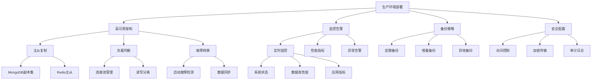

### 开发环境配置

#### 快速开发设置

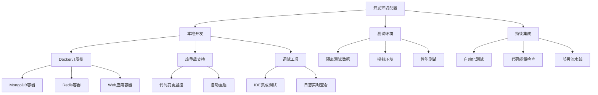

### 维护和优化

#### 定期维护任务

| 维护任务 | 频率 | 目的 | 执行方法 |
|---------|------|------|---------|
| 数据库健康检查 | 每日 | 监控系统状态 | 运行健康检查脚本 |
| 索引优化 | 每周 | 提升查询性能 | 分析慢查询日志 |
| 缓存清理 | 每日 | 释放存储空间 | 清理过期缓存数据 |
| 日志轮转 | 每日 | 管理日志文件 | 自动压缩旧日志 |
| 备份验证 | 每周 | 确保备份有效性 | 测试备份恢复 |
| 安全扫描 | 每月 | 检查安全漏洞 | 运行安全扫描工具 |

### 故障预防措施

#### 主动监控策略

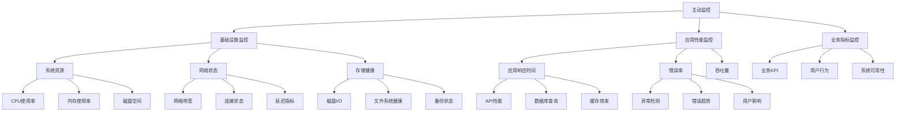

**章节来源**
- [database_manager.py](file://tradingagents/config/database_manager.py#L188-L221)
- [setup_databases.py](file://scripts/setup/setup_databases.py#L200-L261)

## 结论

TradingAgents系统的数据库初始化异常处理机制提供了全面的容错能力和恢复策略。通过多层次的错误检测、自动化的清理重试流程以及完善的监控告警体系，系统能够在各种异常情况下保持稳定运行。

关键要点包括：

1. **分层异常处理**：从连接层到业务层的全方位错误捕获和处理
2. **自动恢复机制**：智能的重试策略和指数退避算法
3. **降级运行能力**：在部分服务不可用时的混合模式运行
4. **完善的监控体系**：实时的状态监控和性能指标跟踪
5. **标准化的运维流程**：清晰的故障排除和恢复指导

通过遵循本指南的最佳实践，运维人员能够有效地管理和维护TradingAgents系统的数据库环境，确保系统的高可用性和稳定性。