# 数据库连接与数据问题故障排除指南

<cite>
**本文档引用的文件**
- [setup_databases.py](file://scripts/setup/setup_databases.py)
- [init_database.py](file://scripts/setup/init_database.py)
- [fix_mongodb_reports.py](file://scripts/maintenance/fix_mongodb_reports.py)
- [mongo-init.js](file://scripts/docker/mongo-init.js)
- [database_config.py](file://tradingagents/config/database_config.py)
- [database_manager.py](file://tradingagents/config/database_manager.py)
- [logging.toml](file://config/logging.toml)
- [docker-compose.yml](file://docker-compose.yml)
- [check_system_status.py](file://scripts/validation/check_system_status.py)
- [check_dependencies.py](file://scripts/validation/check_dependencies.py)
</cite>

## 目录
1. [简介](#简介)
2. [系统架构概览](#系统架构概览)
3. [数据库配置验证](#数据库配置验证)
4. [常见连接问题排查](#常见连接问题排查)
5. [数据初始化问题](#数据初始化问题)
6. [认证错误处理](#认证错误处理)
7. [数据完整性修复](#数据完整性修复)
8. [日志分析与监控](#日志分析与监控)
9. [Docker环境配置](#docker环境配置)
10. [性能优化建议](#性能优化建议)
11. [故障排除流程图](#故障排除流程图)

## 简介

TradingAgents-CN是一个基于Python的投资交易分析平台，采用MongoDB和Redis作为核心数据存储解决方案。本指南提供了全面的数据库连接与数据问题故障排除方法，帮助用户快速诊断和解决常见的数据库相关问题。

系统支持多种部署模式：
- **Docker容器化部署**：推荐的生产环境部署方式
- **独立服务部署**：手动安装MongoDB和Redis
- **文件缓存模式**：无数据库依赖的降级方案

## 系统架构概览

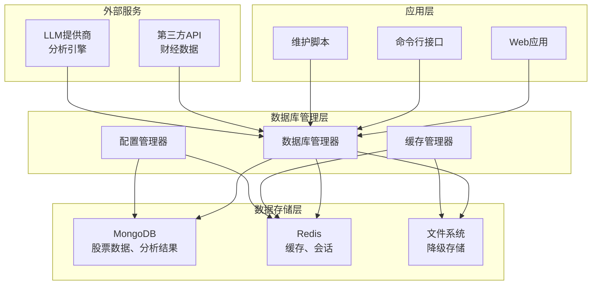

**图表来源**
- [database_manager.py](file://tradingagents/config/database_manager.py#L1-L50)
- [database_config.py](file://tradingagents/config/database_config.py#L1-L30)

## 数据库配置验证

### 环境变量配置检查

系统通过环境变量控制数据库连接配置，以下是关键配置项：

| 配置项 | 描述 | 默认值 | 必需 |
|--------|------|--------|------|
| `MONGODB_ENABLED` | MongoDB启用状态 | `false` | 否 |
| `REDIS_ENABLED` | Redis启用状态 | `false` | 否 |
| `MONGODB_HOST` | MongoDB主机地址 | `localhost` | 是（启用时） |
| `MONGODB_PORT` | MongoDB端口号 | `27017` | 是（启用时） |
| `MONGODB_USERNAME` | MongoDB用户名 | - | 否 |
| `MONGODB_PASSWORD` | MongoDB密码 | - | 否 |
| `MONGODB_DATABASE` | 数据库名称 | `tradingagents` | 是 |
| `REDIS_HOST` | Redis主机地址 | `localhost` | 是（启用时） |
| `REDIS_PORT` | Redis端口号 | `6379` | 是（启用时） |
| `REDIS_PASSWORD` | Redis密码 | - | 否 |

### 配置验证脚本

系统提供了专门的配置检查工具：

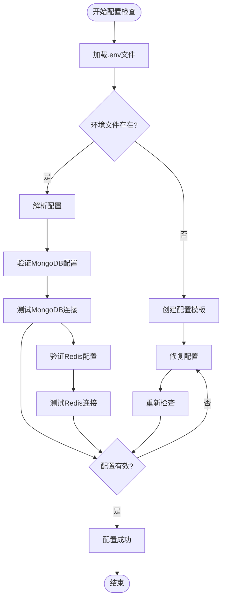

**图表来源**
- [check_system_status.py](file://scripts/validation/check_system_status.py#L20-L80)
- [database_config.py](file://tradingagents/config/database_config.py#L80-L118)

**章节来源**
- [check_system_status.py](file://scripts/validation/check_system_status.py#L1-L100)
- [database_config.py](file://tradingagents/config/database_config.py#L1-L119)

## 常见连接问题排查

### MongoDB连接失败

#### 问题症状
- 数据库连接超时
- 无法建立连接
- 服务器选择超时

#### 排查步骤

1. **检查MongoDB服务状态**
```bash
# Windows
sc query MongoDB

# Linux
systemctl status mongodb
```

2. **验证网络连接**
```bash
# 测试TCP连接
telnet localhost 27017

# 使用MongoDB Shell测试
mongosh --host localhost --port 27017
```

3. **检查防火墙设置**
```bash
# 查看端口监听状态
netstat -an | grep 27017
```

#### 解决方案

| 问题类型 | 解决方法 | 命令示例 |
|----------|----------|----------|
| 服务未启动 | 启动MongoDB服务 | `systemctl start mongodb` |
| 端口被占用 | 更改端口或停止冲突服务 | `netstat -tulpn \| grep 27017` |
| 配置错误 | 检查配置文件 | `cat /etc/mongod.conf` |
| 权限问题 | 检查文件权限 | `ls -la /var/lib/mongodb` |

### Redis连接失败

#### 问题症状
- 连接拒绝
- Ping失败
- 无法建立连接

#### 排查步骤

1. **检查Redis服务状态**
```bash
# 检查服务状态
redis-cli ping

# 查看Redis日志
tail -f /var/log/redis/redis-server.log
```

2. **验证配置文件**
```bash
# 检查Redis配置
redis-server /etc/redis/redis.conf --test-config
```

#### 解决方案

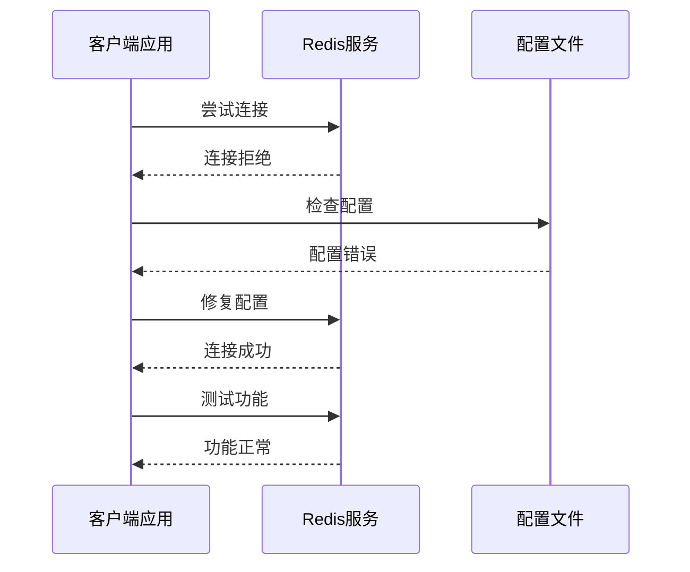

**图表来源**
- [database_manager.py](file://tradingagents/config/database_manager.py#L120-L180)

**章节来源**
- [database_manager.py](file://tradingagents/config/database_manager.py#L120-L200)
- [check_dependencies.py](file://scripts/validation/check_dependencies.py#L20-L80)

## 数据初始化问题

### 数据库初始化流程

系统提供了完整的数据库初始化脚本，确保所有必要的集合和索引正确创建。

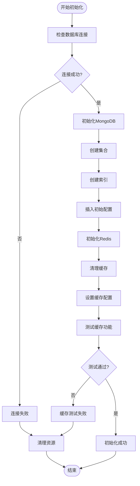

**图表来源**
- [init_database.py](file://scripts/setup/init_database.py#L20-L100)

### 集合和索引创建

系统自动创建以下核心集合：

| 集合名称 | 用途 | 主要索引 |
|----------|------|----------|
| `stock_data` | 股票历史数据 | `(symbol, market_type), (created_at)` |
| `analysis_results` | 分析结果 | `(symbol, analysis_type), (created_at)` |
| `user_sessions` | 用户会话 | `(session_id), (created_at)` |
| `configurations` | 系统配置 | `(config_type, config_name), (updated_at)` |

### 初始配置数据

系统插入以下关键配置：

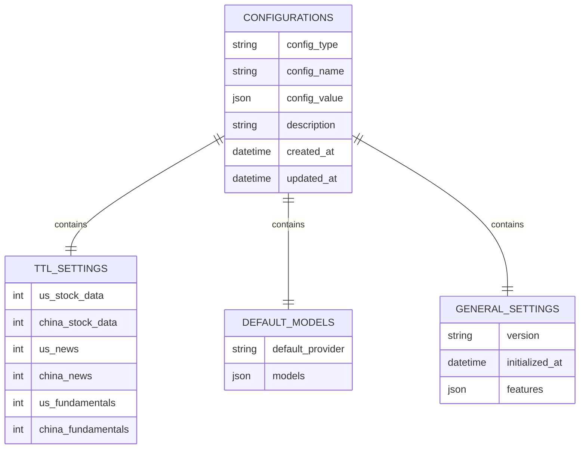

**图表来源**
- [init_database.py](file://scripts/setup/init_database.py#L80-L150)
- [mongo-init.js](file://scripts/docker/mongo-init.js#L50-L120)

**章节来源**
- [init_database.py](file://scripts/setup/init_database.py#L1-L295)
- [mongo-init.js](file://scripts/docker/mongo-init.js#L1-L141)

## 认证错误处理

### 认证失败原因分析

常见的认证问题包括：

1. **凭据错误**：用户名或密码不正确
2. **权限不足**：用户缺乏必要权限
3. **认证源配置错误**：`authSource`设置不当
4. **SSL/TLS问题**：加密连接配置错误

### 认证配置检查流程

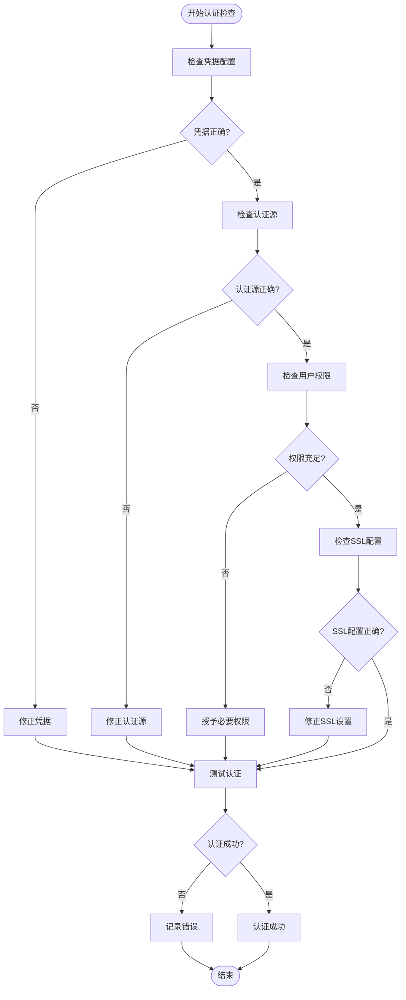

**图表来源**
- [database_manager.py](file://tradingagents/config/database_manager.py#L100-L150)

### 认证错误诊断

系统提供详细的认证诊断信息：

| 错误类型 | 错误消息 | 解决方案 |
|----------|----------|----------|
| `AuthenticationFailed` | 认证失败 | 检查用户名密码 |
| `Unauthorized` | 权限不足 | 检查用户角色 |
| `AuthSchemaMismatch` | 认证模式不匹配 | 检查认证源配置 |
| `CertificateVerificationError` | SSL证书验证失败 | 检查SSL配置 |

**章节来源**
- [database_manager.py](file://tradingagents/config/database_manager.py#L100-L200)

## 数据完整性修复

### MongoDB报告数据修复

系统提供了专门的报告数据修复工具，用于处理分析报告中的数据结构不一致问题。

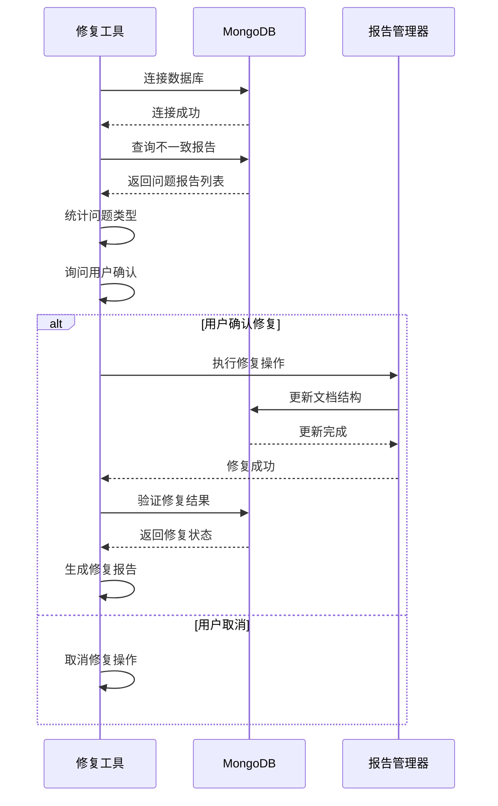

**图表来源**
- [fix_mongodb_reports.py](file://scripts/maintenance/fix_mongodb_reports.py#L50-L120)

### 修复操作类型

系统能够处理以下数据结构问题：

| 问题类型 | 描述 | 修复方法 |
|----------|------|----------|
| 缺少`reports`字段 | 文档中缺少reports字段 | 添加空字典 `{}` |
| `reports`字段为空 | reports字段为null或空对象 | 重置为空字典 |
| 字段类型错误 | reports字段不是字典类型 | 转换为字典类型 |
| 数据格式不规范 | 字段值格式不符合预期 | 标准化数据格式 |

### 数据重建流程

当数据库出现严重损坏时，可以使用mongo-init.js进行数据重建：

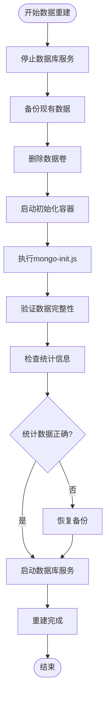

**图表来源**
- [mongo-init.js](file://scripts/docker/mongo-init.js#L1-L50)

**章节来源**
- [fix_mongodb_reports.py](file://scripts/maintenance/fix_mongodb_reports.py#L1-L185)
- [mongo-init.js](file://scripts/docker/mongo-init.js#L1-L141)

## 日志分析与监控

### 日志配置结构

系统采用结构化日志配置，支持多种日志处理器：

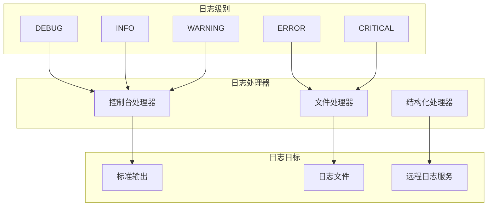

**图表来源**
- [logging.toml](file://config/logging.toml#L1-L50)

### 关键日志类别

系统记录以下关键日志类别：

| 日志类别 | 描述 | 关键信息 |
|----------|------|----------|
| `database` | 数据库操作日志 | 连接状态、查询性能、错误信息 |
| `cache` | 缓存操作日志 | 缓存命中率、存储状态、性能指标 |
| `security` | 安全相关日志 | 认证尝试、权限检查、访问控制 |
| `performance` | 性能监控日志 | 查询耗时、内存使用、响应时间 |

### 故障诊断日志模式

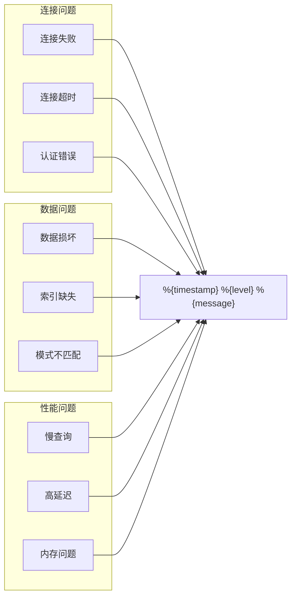

**图表来源**
- [logging.toml](file://config/logging.toml#L80-L111)

**章节来源**
- [logging.toml](file://config/logging.toml#L1-L111)

## Docker环境配置

### Docker Compose配置

系统提供了完整的Docker Compose配置，支持一键部署：

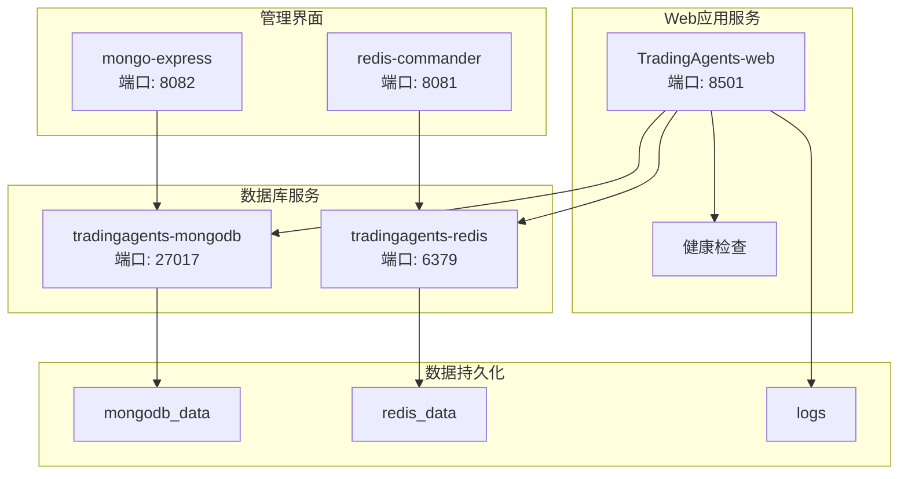

**图表来源**
- [docker-compose.yml](file://docker-compose.yml#L1-L100)

### Docker服务启动流程

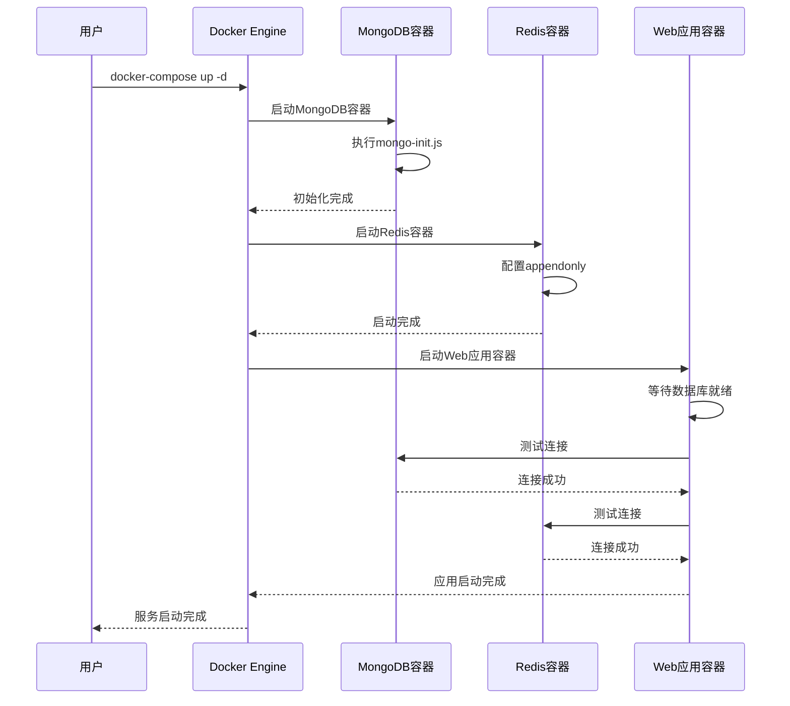

**图表来源**
- [docker-compose.yml](file://docker-compose.yml#L100-L159)

### Docker环境变量配置

| 环境变量 | 描述 | 默认值 |
|----------|------|--------|
| `MONGODB_ENABLED` | 启用MongoDB | `true` |
| `REDIS_ENABLED` | 启用Redis | `true` |
| `TRADINGAGENTS_LOG_LEVEL` | 日志级别 | `INFO` |
| `DOCKER_CONTAINER` | Docker环境标识 | `true` |

**章节来源**
- [docker-compose.yml](file://docker-compose.yml#L1-L159)

## 性能优化建议

### 缓存策略优化

系统支持多种缓存后端，每种都有不同的性能特征：

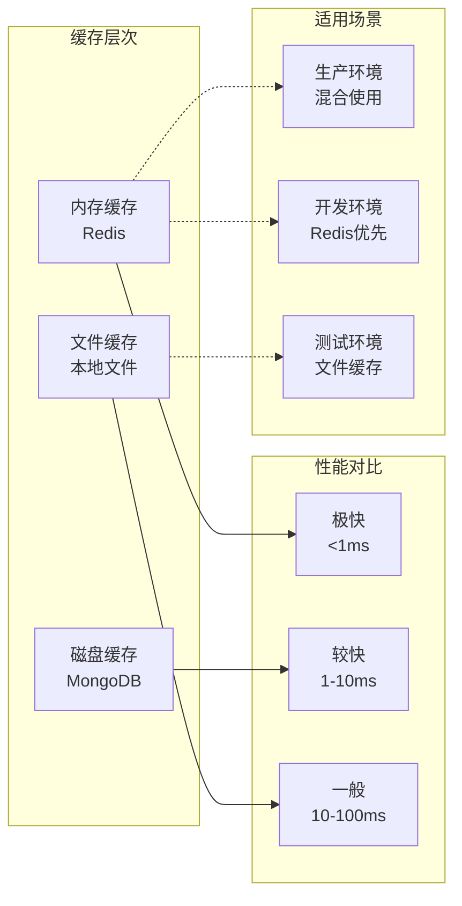

### 数据库性能调优

| 优化项目 | 建议配置 | 预期效果 |
|----------|----------|----------|
| 连接池大小 | 10-50个连接 | 减少连接开销 |
| 索引策略 | 复合索引优化 | 提升查询性能 |
| 分片配置 | 按时间分片 | 扩展存储容量 |
| 内存分配 | 70%可用内存 | 避免OOM |

### 监控指标

系统监控以下关键性能指标：

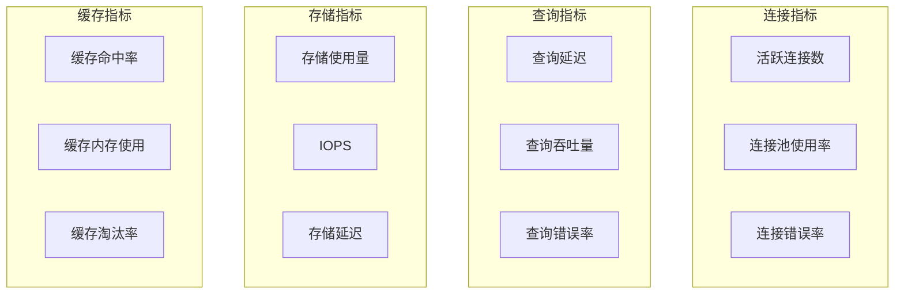

**章节来源**
- [check_system_status.py](file://scripts/validation/check_system_status.py#L200-L257)

## 故障排除流程图

### 完整故障排除流程

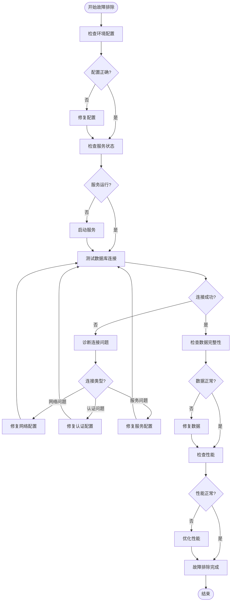

### 快速诊断检查清单

| 检查项目 | 检查方法 | 预期结果 |
|----------|----------|----------|
| 环境变量 | 检查`.env`文件 | 配置完整 |
| 服务状态 | `docker ps` | 服务运行 |
| 网络连接 | `telnet localhost 27017` | 连接成功 |
| 数据库连接 | 应用连接测试 | 连接正常 |
| 数据完整性 | 查询测试 | 数据完整 |
| 性能指标 | 监控面板 | 性能良好 |

**章节来源**
- [check_system_status.py](file://scripts/validation/check_system_status.py#L1-L257)
- [check_dependencies.py](file://scripts/validation/check_dependencies.py#L1-L293)

## 结论

本故障排除指南涵盖了TradingAgents-CN数据库系统的各个方面，从基础配置到高级故障诊断。通过遵循本指南的步骤，用户可以：

1. **快速定位问题**：使用标准化的诊断流程识别问题根源
2. **预防性维护**：定期检查系统状态，避免潜在问题
3. **高效修复**：采用最佳实践快速解决问题
4. **性能优化**：持续监控和优化系统性能

对于复杂问题，建议结合日志分析和系统监控工具进行深入诊断。系统提供了丰富的日志信息和监控指标，可以帮助运维人员快速定位和解决问题。