# A股数据流故障排除指南

<cite>
**本文档引用的文件**
- [diagnose_empty_data.py](file://scripts/diagnose_empty_data.py)
- [tushare_utils.py](file://tradingagents/dataflows/tushare_utils.py)
- [akshare_utils.py](file://tradingagents/dataflows/akshare_utils.py)
- [chinese_finance_utils.py](file://tradingagents/dataflows/chinese_finance_utils.py)
- [test_fundamentals_with_stock_name.py](file://scripts/test_fundamentals_with_stock_name.py)
- [data_source_manager.py](file://tradingagents/dataflows/data_source_manager.py)
- [interface.py](file://tradingagents/dataflows/interface.py)
- [cache_manager.py](file://tradingagents/dataflows/cache_manager.py)
- [stock_validator.py](file://tradingagents/utils/stock_validator.py)
</cite>

## 目录
1. [概述](#概述)
2. [常见问题诊断](#常见问题诊断)
3. [Tushare数据源故障排除](#tushare数据源故障排除)
4. [AKShare数据源故障排除](#akshare数据源故障排除)
5. [股票代码验证机制](#股票代码验证机制)
6. [降级策略与备用数据源](#降级策略与备用数据源)
7. [缓存系统故障排除](#缓存系统故障排除)
8. [日志分析与调试](#日志分析与调试)
9. [测试与验证](#测试与验证)
10. [最佳实践建议](#最佳实践建议)

## 概述

本指南针对A股数据流中常见的故障场景，提供系统性的诊断和解决方案。涵盖Tushare和AKShare两个主要数据源的故障排除，以及完整的降级机制和备用方案。

### 主要故障类型

1. **空数据返回** - API调用成功但返回空数据
2. **股票代码映射错误** - 股票代码格式不正确
3. **日期格式不兼容** - 日期参数格式错误
4. **API权限问题** - Tushare账号权限不足
5. **网络连接问题** - 网络不稳定或超时
6. **缓存污染** - 缓存了错误的空数据

## 常见问题诊断

### 诊断流程图

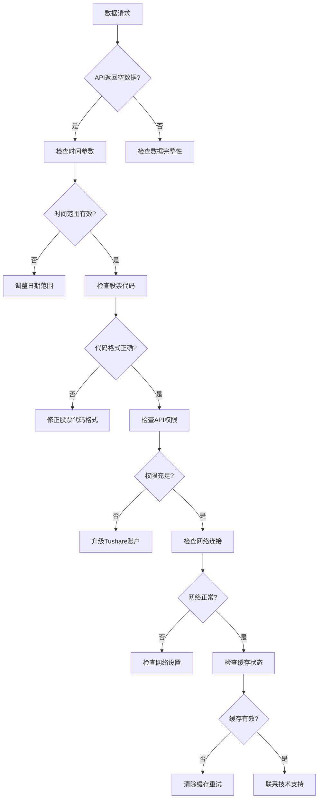

**图表来源**
- [diagnose_empty_data.py](file://scripts/diagnose_empty_data.py#L1-L250)

## Tushare数据源故障排除

### 连接状态检查

Tushare连接失败是最常见的问题之一。以下是详细的诊断步骤：

#### 1. API Token验证

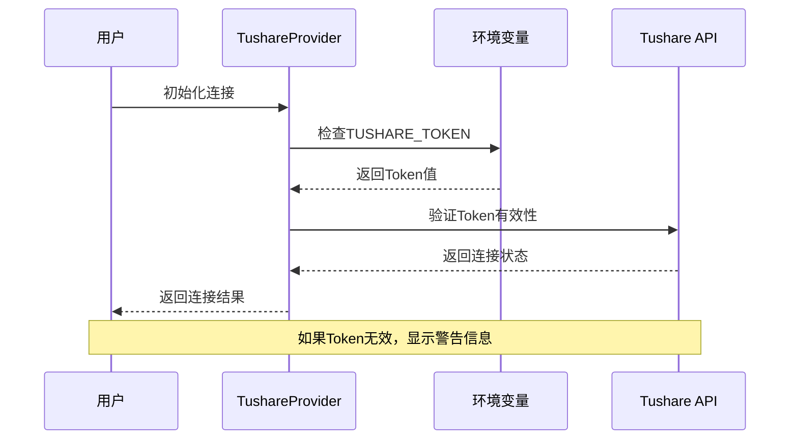

**图表来源**
- [tushare_utils.py](file://tradingagents/dataflows/tushare_utils.py#L40-L80)

#### 2. 时间参数诊断

诊断脚本提供了多种时间参数组合的测试：

| 测试案例 | 开始日期 | 结束日期 | 用途 |
|---------|---------|---------|------|
| 原始问题时间 | 2025-01-10 | 2025-01-17 | 复现原始问题 |
| 最近7天 | 动态计算 | 动态计算 | 检查近期数据 |
| 最近30天 | 动态计算 | 动态计算 | 检查较长时间段 |
| 2024年末 | 2024-12-25 | 2024-12-31 | 检查节假日数据 |
| 2025年初 | 2025-01-01 | 2025-01-07 | 检查新年数据 |

#### 3. 股票代码格式验证

Tushare对股票代码有严格的格式要求：

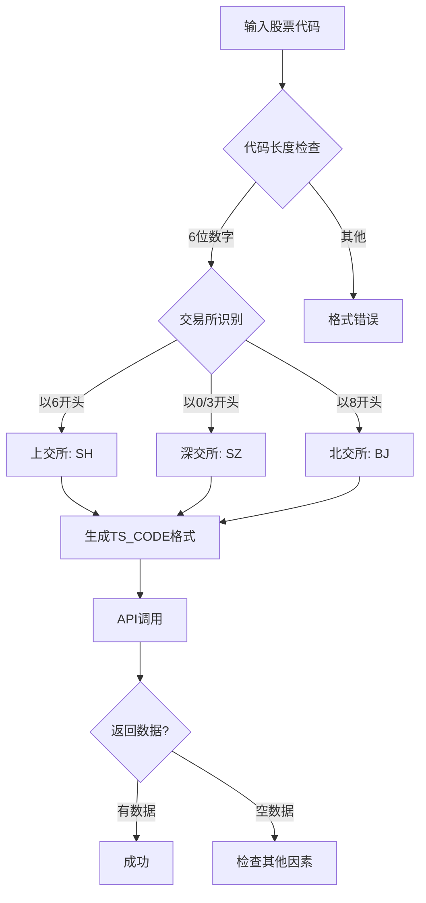

**图表来源**
- [tushare_utils.py](file://tradingagents/dataflows/tushare_utils.py#L473-L520)

**章节来源**
- [tushare_utils.py](file://tradingagents/dataflows/tushare_utils.py#L473-L520)
- [diagnose_empty_data.py](file://scripts/diagnose_empty_data.py#L25-L85)

### Tushare连接机制

Tushare提供器实现了完整的连接管理和错误处理：

#### 连接建立过程

1. **Token验证** - 检查环境变量中的API密钥
2. **API初始化** - 设置Tushare客户端
3. **连接测试** - 验证API可用性
4. **缓存配置** - 初始化数据缓存

#### 降级策略

当Tushare出现故障时，系统会自动切换到备用数据源：

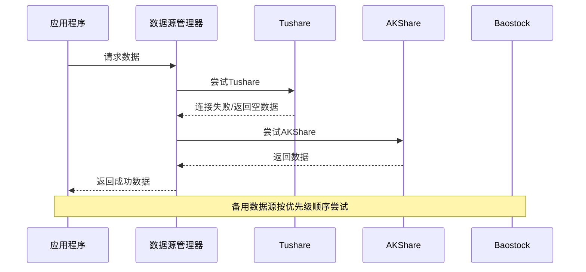

**图表来源**
- [data_source_manager.py](file://tradingagents/dataflows/data_source_manager.py#L547-L574)

**章节来源**
- [tushare_utils.py](file://tradingagents/dataflows/tushare_utils.py#L40-L120)
- [data_source_manager.py](file://tradingagents/dataflows/data_source_manager.py#L547-L574)

## AKShare数据源故障排除

### AKShare连接特性

AKShare相比Tushare具有更好的稳定性，但仍可能出现以下问题：

#### 1. 超时处理机制

AKShare实现了完善的超时控制：

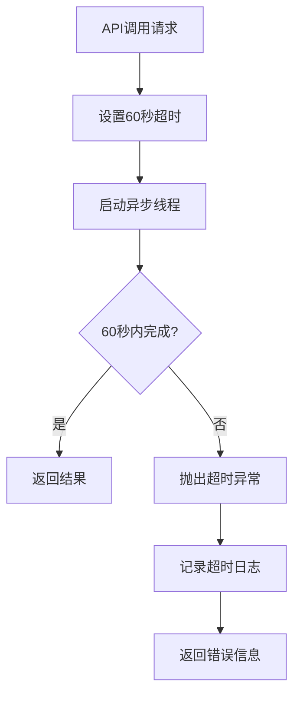

**图表来源**
- [akshare_utils.py](file://tradingagents/dataflows/akshare_utils.py#L35-L60)

#### 2. 港股数据获取

AKShare对港股数据有特殊的处理逻辑：

| 处理步骤 | 描述 | 实现方式 |
|---------|------|----------|
| 代码标准化 | 将4-5位数字转换为5位格式 | `symbol.zfill(5)` |
| 格式验证 | 检查.HK后缀 | 正则表达式匹配 |
| 数据转换 | 标准化列名 | 字典映射转换 |
| 超时保护 | 60秒超时限制 | 线程超时机制 |

#### 3. 财务数据获取

AKShare提供多层次的财务数据获取：

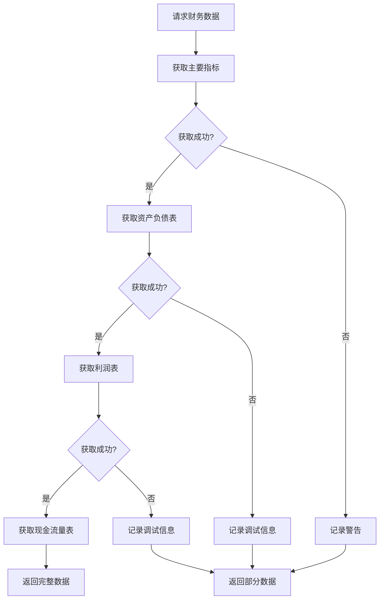

**图表来源**
- [akshare_utils.py](file://tradingagents/dataflows/akshare_utils.py#L280-L350)

**章节来源**
- [akshare_utils.py](file://tradingagents/dataflows/akshare_utils.py#L35-L60)
- [akshare_utils.py](file://tradingagents/dataflows/akshare_utils.py#L280-L350)

## 股票代码验证机制

### 验证流程

系统实现了多层次的股票代码验证：

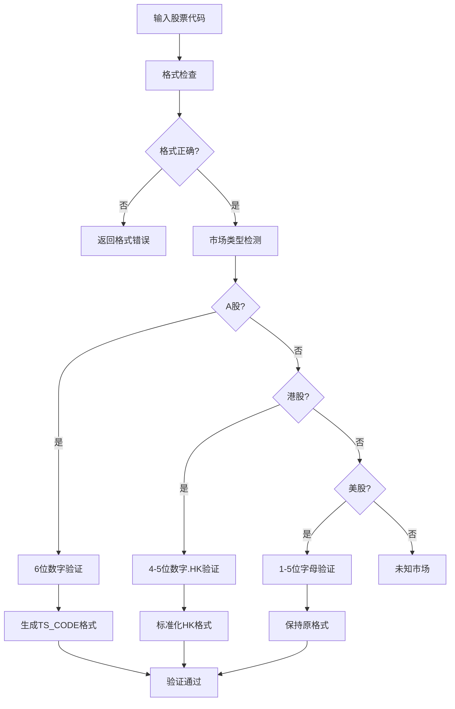

**图表来源**
- [stock_validator.py](file://tradingagents/utils/stock_validator.py#L107-L170)

### 常见代码格式问题

| 市场类型 | 正确格式 | 常见错误 | 解决方案 |
|---------|---------|---------|----------|
| A股 | 6位数字 | 5位数字、字母 | 补齐前导零 |
| 港股 | 4-5位数字.HK | 纯数字、大小写错误 | 添加.HK后缀、统一大写 |
| 美股 | 1-5位字母 | 数字、超长代码 | 转换为大写、截断超长部分 |

**章节来源**
- [stock_validator.py](file://tradingagents/utils/stock_validator.py#L107-L170)

## 降级策略与备用数据源

### 数据源优先级

系统按照以下优先级使用数据源：

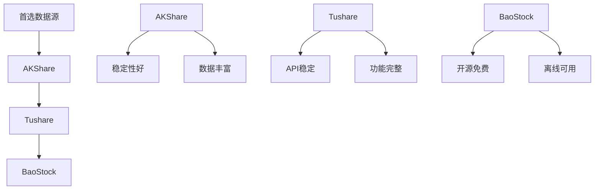

**图表来源**
- [data_source_manager.py](file://tradingagents/dataflows/data_source_manager.py#L547-L574)

### 降级机制实现

降级机制确保在主数据源失败时能够快速切换：

#### 1. 自动降级触发条件

- API调用超时（>60秒）
- 返回空数据或错误信息
- 连接失败或认证错误
- 数据质量不符合预期

#### 2. 降级过程监控

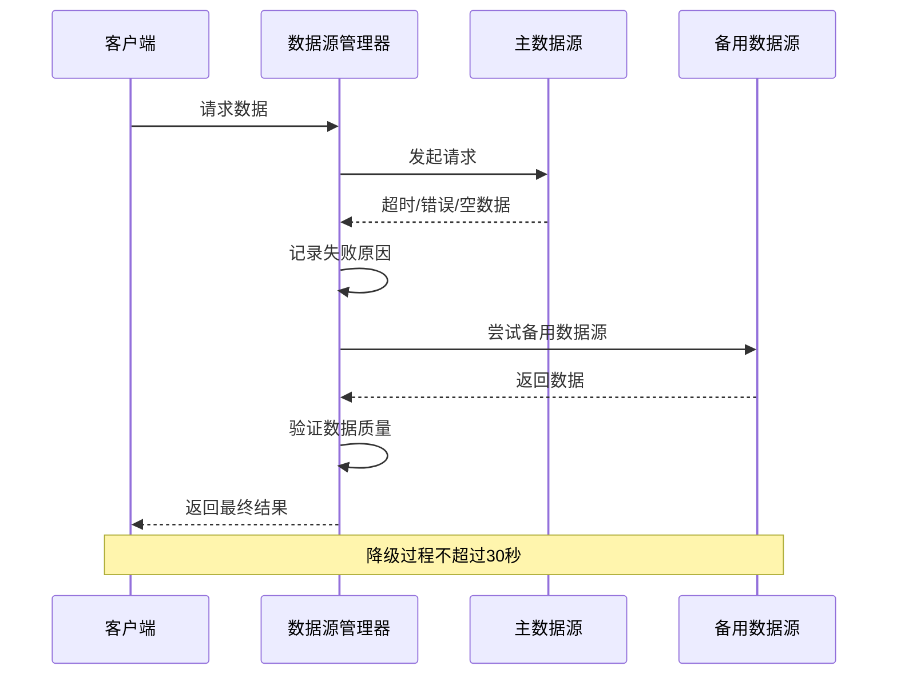

**图表来源**
- [data_source_manager.py](file://tradingagents/dataflows/data_source_manager.py#L547-L574)

**章节来源**
- [data_source_manager.py](file://tradingagents/dataflows/data_source_manager.py#L547-L574)

## 缓存系统故障排除

### 缓存架构

系统实现了智能缓存管理：

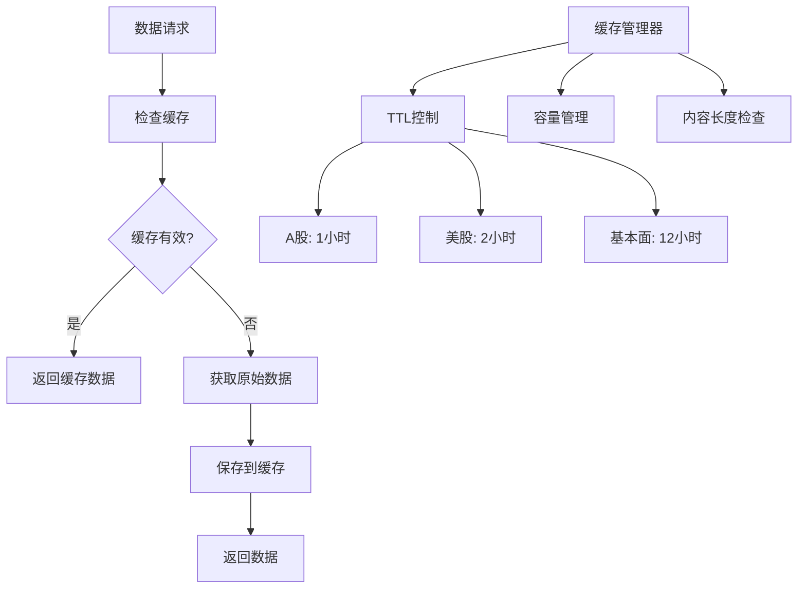

**图表来源**
- [cache_manager.py](file://tradingagents/dataflows/cache_manager.py#L30-L80)

### 缓存问题诊断

#### 1. 缓存失效检查

| 检查项 | 检查方法 | 解决方案 |
|-------|---------|----------|
| TTL过期 | 检查缓存时间戳 | 清除过期缓存 |
| 文件损坏 | 验证文件完整性 | 重新下载数据 |
| 内容超长 | 检查内容长度 | 跳过缓存或压缩数据 |
| 权限问题 | 检查文件读写权限 | 修复权限设置 |

#### 2. 缓存清理策略

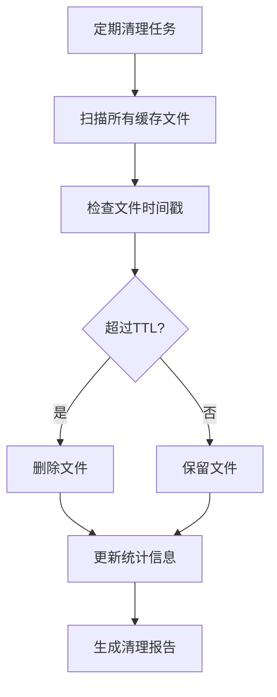

**图表来源**
- [cache_manager.py](file://tradingagents/dataflows/cache_manager.py#L600-L646)

**章节来源**
- [cache_manager.py](file://tradingagents/dataflows/cache_manager.py#L30-L80)
- [cache_manager.py](file://tradingagents/dataflows/cache_manager.py#L600-L646)

## 日志分析与调试

### 日志级别配置

系统使用分级日志记录：

| 日志级别 | 用途 | 示例 |
|---------|------|------|
| DEBUG | 详细调试信息 | 股票代码转换过程 |
| INFO | 一般信息记录 | 数据源切换、缓存操作 |
| WARNING | 警告信息 | 数据源降级、缓存失效 |
| ERROR | 错误信息 | API调用失败、连接错误 |

### 关键日志追踪点

#### 1. 股票代码追踪

系统在关键节点记录股票代码转换过程：

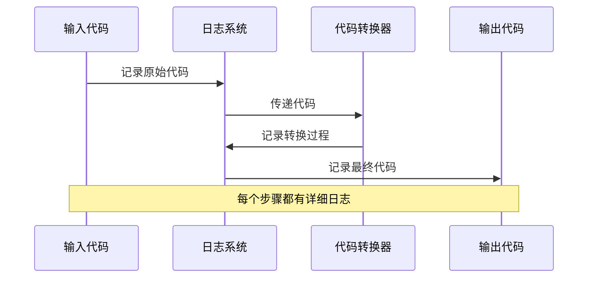

**图表来源**
- [tushare_utils.py](file://tradingagents/dataflows/tushare_utils.py#L473-L520)

#### 2. API调用追踪

每个API调用都有完整的追踪信息：

| 追踪信息 | 记录内容 | 用途 |
|---------|---------|------|
| 调用时间 | 开始和结束时间 | 性能分析 |
| 参数信息 | 输入参数详情 | 调试验证 |
| 返回结果 | 响应状态和数据 | 结果验证 |
| 异常信息 | 错误类型和堆栈 | 故障定位 |

**章节来源**
- [tushare_utils.py](file://tradingagents/dataflows/tushare_utils.py#L473-L520)

## 测试与验证

### 基本面分析测试

测试脚本验证了股票名称获取的正确性：

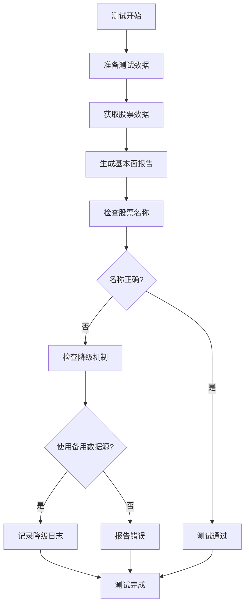

**图表来源**
- [test_fundamentals_with_stock_name.py](file://scripts/test_fundamentals_with_stock_name.py#L15-L50)

### 诊断脚本功能

诊断脚本提供了全面的问题排查能力：

#### 1. 时间参数测试

测试不同时间范围对数据获取的影响：

```python
# 测试案例示例
test_cases = [
    {"name": "原始问题时间", "start": "2025-01-10", "end": "2025-01-17"},
    {"name": "最近7天", "start": "2025-07-01", "end": "2025-07-17"},
    {"name": "最近30天", "start": "2025-06-17", "end": "2025-07-17"},
]
```

#### 2. 股票代码测试

验证不同类型股票代码的兼容性：

| 股票类型 | 代码示例 | 市场 | 预期结果 |
|---------|---------|------|----------|
| 创业板 | 300033 | 创业板 | 成功获取 |
| 深圳主板 | 000001 | 深圳主板 | 成功获取 |
| 上海主板 | 600036 | 上海主板 | 成功获取 |
| 科创板 | 688001 | 科创板 | 成功获取 |
| 中小板 | 002415 | 深圳中小板 | 成功获取 |

**章节来源**
- [test_fundamentals_with_stock_name.py](file://scripts/test_fundamentals_with_stock_name.py#L15-L50)
- [diagnose_empty_data.py](file://scripts/diagnose_empty_data.py#L25-L85)

## 最佳实践建议

### 1. 配置优化

#### 环境变量设置

```bash
# Tushare API配置
export TUSHARE_TOKEN="your_token_here"

# 数据源优先级
export DEFAULT_CHINA_DATA_SOURCE="akshare"

# 缓存配置
export MAX_CACHE_CONTENT_LENGTH="50000"
export ENABLE_CACHE_LENGTH_CHECK="true"
```

#### 数据源选择策略

| 场景 | 推荐数据源 | 原因 |
|------|-----------|------|
| 实时数据需求 | Tushare | API响应快，数据及时 |
| 稳定性要求高 | AKShare | 更好的错误处理 |
| 离线使用 | BaoStock | 无需网络连接 |
| 历史数据丰富 | AKShare | 数据完整性好 |

### 2. 错误处理最佳实践

#### 1. 优雅降级

```python
# 推荐的降级模式
try:
    data = primary_source.get_data(symbol, start_date, end_date)
    if not data.empty:
        return data
except Exception as e:
    logger.warning(f"主数据源失败: {e}")

# 自动降级到备用数据源
return backup_source.get_data(symbol, start_date, end_date)
```

#### 2. 超时控制

```python
# 设置合理的超时时间
TIMEOUT_CONFIG = {
    'tushare': 30,      # Tushare API超时
    'akshare': 60,      # AKShare API超时
    'baostock': 120     # BaoStock API超时
}
```

### 3. 监控与维护

#### 1. 定期健康检查

```python
# 健康检查清单
health_checks = [
    "API连接测试",
    "数据完整性验证",
    "缓存状态检查",
    "错误日志分析",
    "性能指标监控"
]
```

#### 2. 缓存维护

```python
# 定期清理过期缓存
cache_manager.clear_old_cache(max_age_days=7)

# 监控缓存使用情况
stats = cache_manager.get_cache_stats()
logger.info(f"缓存统计: {stats}")
```

### 4. 故障恢复流程

#### 1. 快速恢复步骤

1. **检查网络连接** - 确认网络正常
2. **验证API密钥** - 检查Tushare Token有效性
3. **清除缓存** - 清理可能的损坏缓存
4. **切换数据源** - 手动切换到备用数据源
5. **重启服务** - 重启相关服务组件

#### 2. 长期解决方案

1. **升级API计划** - 提升Tushare账户权限
2. **增加备用数据源** - 集成更多数据提供商
3. **优化缓存策略** - 改进缓存失效机制
4. **增强监控告警** - 建立完善的监控体系

通过遵循这些最佳实践，可以显著提高A股数据流的稳定性和可靠性，减少故障发生的概率，并在出现问题时能够快速定位和解决。