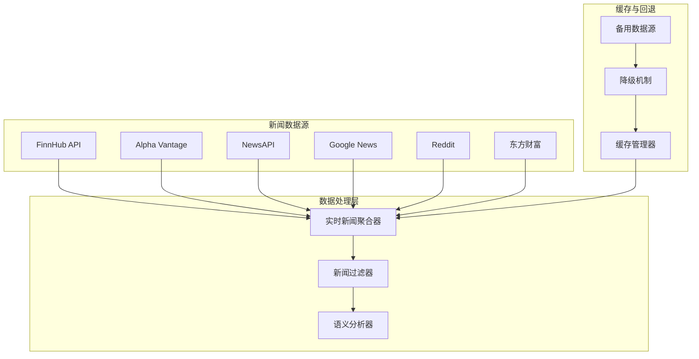
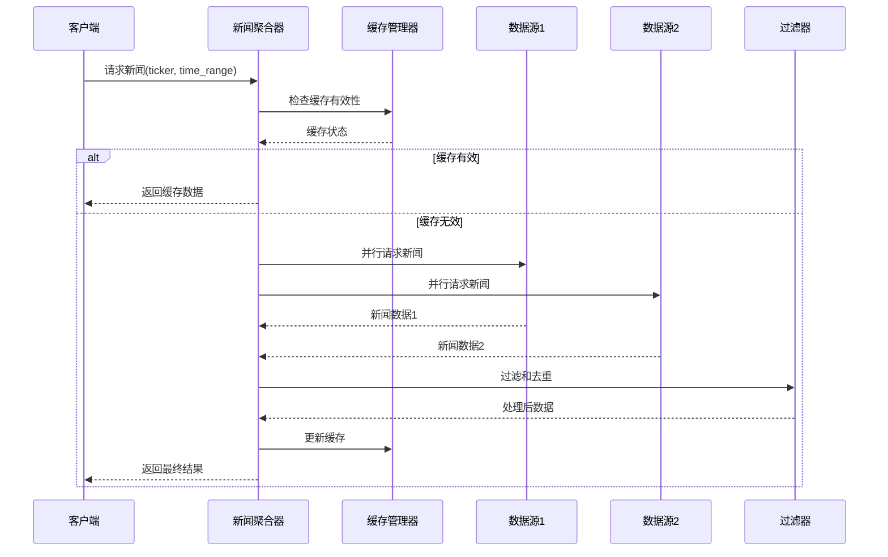
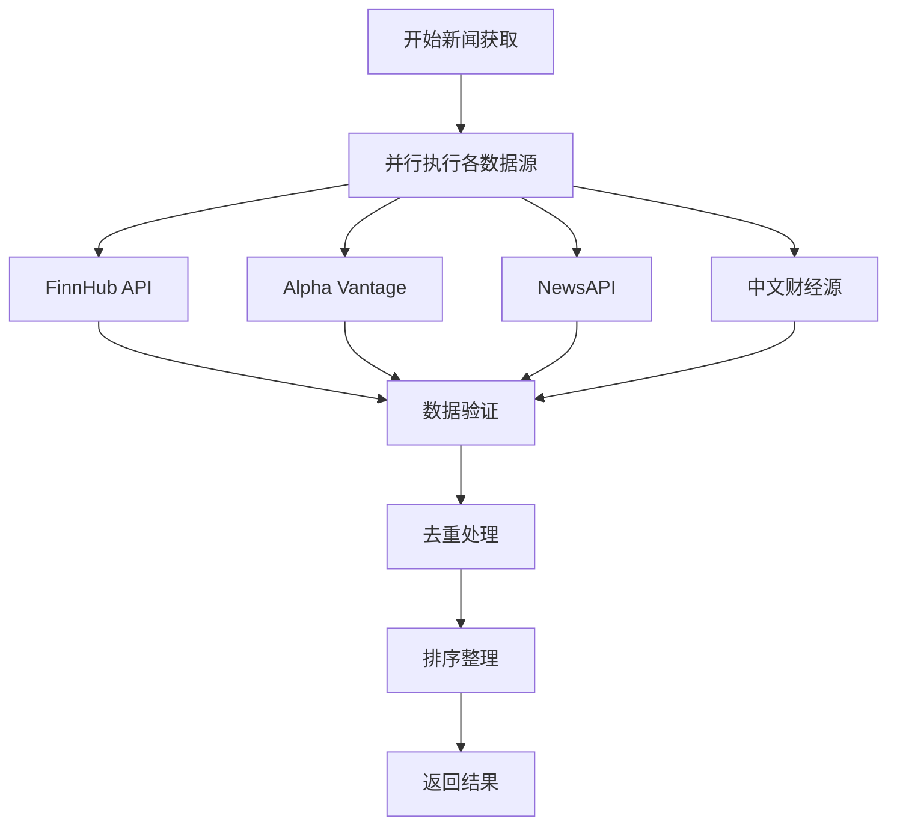
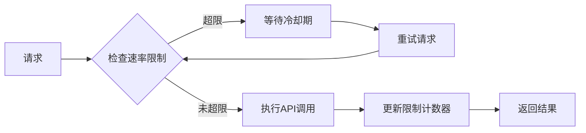
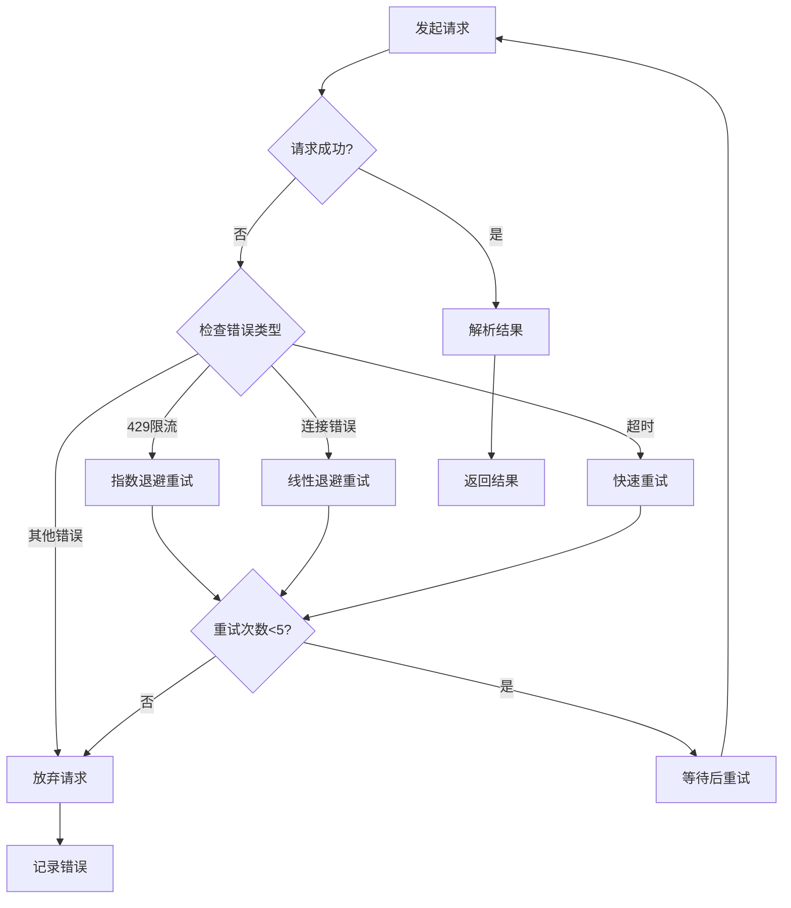
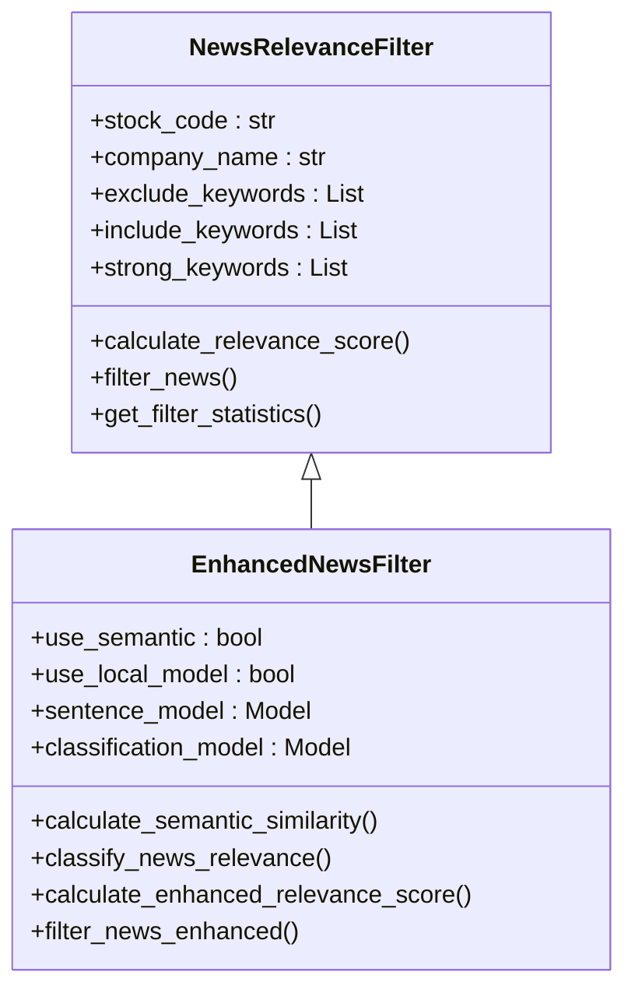
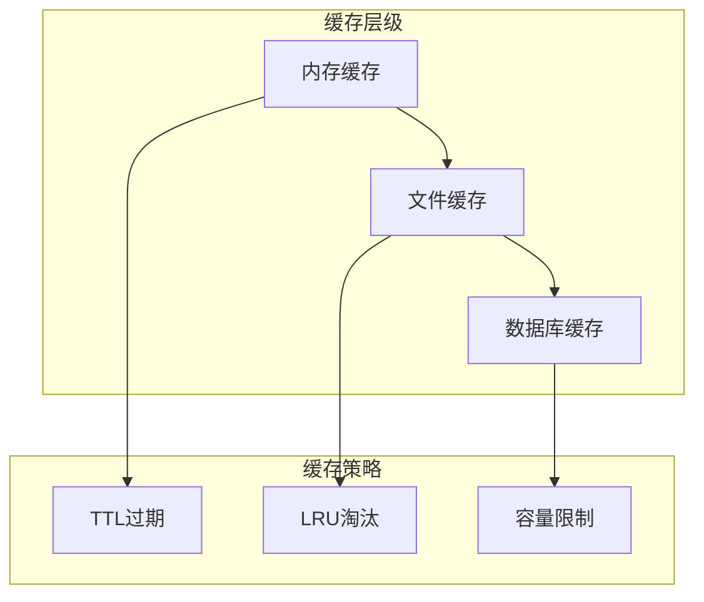
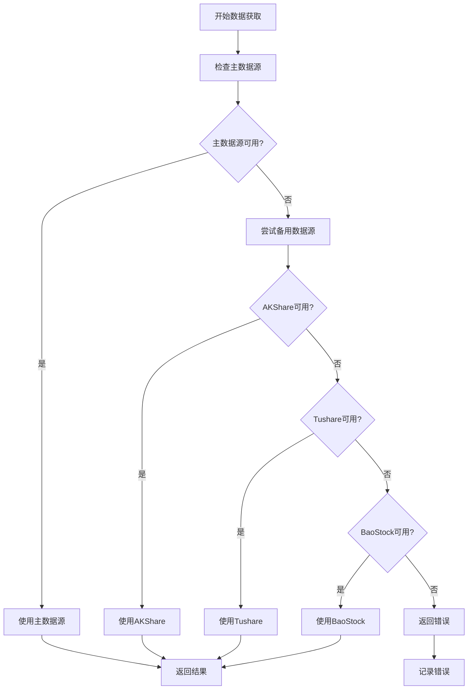
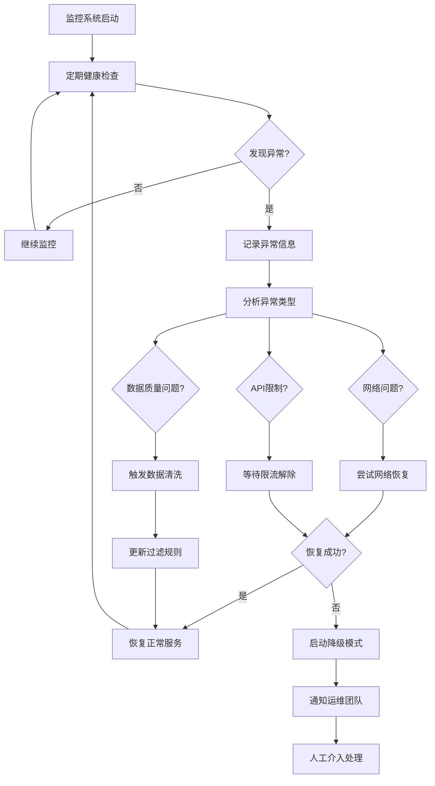

# 新闻数据流故障排除指南

<cite>
**本文档引用的文件**
- [realtime_news_utils.py](file://tradingagents/dataflows/realtime_news_utils.py)
- [reddit_utils.py](file://tradingagents/dataflows/reddit_utils.py)
- [googlenews_utils.py](file://tradingagents/dataflows/googlenews_utils.py)
- [enhanced_news_filter.py](file://tradingagents/utils/enhanced_news_filter.py)
- [cache_manager.py](file://tradingagents/dataflows/cache_manager.py)
- [news_filter.py](file://tradingagents/utils/news_filter.py)
- [test_news_timeout.py](file://examples/test_news_timeout.py)
- [test_fallback_mechanism.py](file://scripts/test_fallback_mechanism.py)
</cite>

## 目录
1. [概述](#概述)
2. [系统架构分析](#系统架构分析)
3. [实时新闻抓取故障排除](#实时新闻抓取故障排除)
4. [Reddit API访问故障排除](#reddit-api访问故障排除)
5. [Google News搜索故障排除](#google-news搜索故障排除)
6. [新闻过滤器优化](#新闻过滤器优化)
7. [缓存回退机制](#缓存回退机制)
8. [替代数据源集成](#替代数据源集成)
9. [性能监控与诊断](#性能监控与诊断)
10. [最佳实践建议](#最佳实践建议)

## 概述

本指南针对TradingAgents-CN项目中的新闻数据流系统进行全面的故障排除和优化。该系统采用多源异构架构，整合了FinnHub、Alpha Vantage、NewsAPI、Google News、Reddit等多个新闻源，并实现了智能缓存和降级机制。

### 核心组件概览



**图表来源**
- [realtime_news_utils.py](file://tradingagents/dataflows/realtime_news_utils.py#L1-L50)
- [cache_manager.py](file://tradingagents/dataflows/cache_manager.py#L1-L100)

## 系统架构分析

### 事件驱动架构设计

实时新闻系统采用事件驱动架构，通过优先级队列和异步处理确保数据流的高效性。



**图表来源**
- [realtime_news_utils.py](file://tradingagents/dataflows/realtime_news_utils.py#L50-L150)
- [cache_manager.py](file://tradingagents/dataflows/cache_manager.py#L200-L300)

### 超时处理机制

系统实现了多层次的超时处理机制，包括连接超时、读取超时和整体操作超时。

**节来源**
- [realtime_news_utils.py](file://tradingagents/dataflows/realtime_news_utils.py#L100-L200)
- [googlenews_utils.py](file://tradingagents/dataflows/googlenews_utils.py#L20-L50)

## 实时新闻抓取故障排除

### 常见问题诊断

#### 1. API密钥配置问题

**症状**: 新闻获取失败，返回401或403错误

**诊断步骤**:
```python
# 检查API密钥配置
import os
keys = {
    'FINNHUB_API_KEY': os.getenv('FINNHUB_API_KEY'),
    'ALPHA_VANTAGE_API_KEY': os.getenv('ALPHA_VANTAGE_API_KEY'),
    'NEWSAPI_KEY': os.getenv('NEWSAPI_KEY')
}

for key, value in keys.items():
    print(f"{key}: {'✅ 已配置' if value else '❌ 未配置'}")
```

**解决方案**:
- 确保所有必需的API密钥已正确设置
- 验证密钥的有效性和权限范围
- 检查API配额使用情况

#### 2. 网络连接问题

**症状**: 请求超时或连接失败

**诊断方法**:
```python
# 测试网络连通性
import requests
urls = [
    "https://finnhub.io",
    "https://www.alphavantage.co",
    "https://newsapi.org"
]

for url in urls:
    try:
        response = requests.get(url, timeout=10)
        print(f"{url}: ✅ 可访问")
    except Exception as e:
        print(f"{url}: ❌ 访问失败 - {e}")
```

#### 3. 数据格式不兼容

**症状**: 解析错误或数据结构异常

**解决方案**:
- 实现严格的数据验证机制
- 添加默认值处理逻辑
- 记录详细的错误日志

**节来源**
- [realtime_news_utils.py](file://tradingagents/dataflows/realtime_news_utils.py#L200-L300)

### 性能优化策略

#### 并行数据获取

系统采用并行处理模式，同时从多个数据源获取新闻，显著提升响应速度。



**图表来源**
- [realtime_news_utils.py](file://tradingagents/dataflows/realtime_news_utils.py#L50-L100)

#### 动态优先级调整

根据数据源的响应时间和成功率动态调整获取优先级。

**节来源**
- [realtime_news_utils.py](file://tradingagents/dataflows/realtime_news_utils.py#L300-L400)

## Reddit API访问故障排除

### OAuth认证配置

Reddit API需要严格的OAuth认证流程，配置不当会导致访问被拒绝。

#### 必需配置项

| 配置项 | 描述 | 示例值 |
|--------|------|--------|
| `REDDIT_CLIENT_ID` | 应用客户端ID | `your_client_id_here` |
| `REDDIT_CLIENT_SECRET` | 应用密钥 | `your_client_secret_here` |
| `REDDIT_USER_AGENT` | 用户代理字符串 | `TradingAgents/1.0` |

#### 认证流程验证

```python
# Reddit认证测试脚本
import praw

def test_reddit_auth():
    client_id = os.getenv('REDDIT_CLIENT_ID')
    client_secret = os.getenv('REDDIT_CLIENT_SECRET')
    user_agent = os.getenv('REDDIT_USER_AGENT')
    
    try:
        reddit = praw.Reddit(
            client_id=client_id,
            client_secret=client_secret,
            user_agent=user_agent
        )
        
        # 测试基本连接
        subreddit = reddit.subreddit('investing')
        print(f"✅ Reddit连接成功: {subreddit.display_name}")
        print(f"   订阅者数量: {subreddit.subscribers:,}")
        
        return True
    except Exception as e:
        print(f"❌ Reddit认证失败: {e}")
        return False
```

### API限制与频率控制

#### 速率限制策略

Reddit API实施严格的速率限制，需要合理规划请求频率。



**图表来源**
- [reddit_utils.py](file://tradingagents/dataflows/reddit_utils.py#L1-L50)

#### 数据源管理

Reddit工具支持预下载数据文件，减少实时API调用压力。

**节来源**
- [reddit_utils.py](file://tradingagents/dataflows/reddit_utils.py#L50-L136)

## Google News搜索故障排除

### 查询语法限制

Google News搜索对查询语法有严格限制，不当的查询可能导致搜索结果为空。

#### 有效查询模式

| 查询类型 | 语法示例 | 说明 |
|----------|----------|------|
| 基本搜索 | `"AAPL stock news"` | 精确匹配短语 |
| 股票代码 | `AAPL OR "Apple Inc."` | 使用OR操作符 |
| 时间范围 | `AAPL site:news.google.com` | 限定站点搜索 |
| 关键词组合 | `AAPL earnings AND "Q4 2024"` | 使用AND操作符 |

#### 搜索结果处理

```python
# Google News搜索优化
def optimize_google_search(query, start_date, end_date):
    # 标准化日期格式
    if "-" in start_date:
        start_date = datetime.strptime(start_date, "%Y-%m-%d")
        start_date = start_date.strftime("%m/%d/%Y")
    
    # 构建查询URL
    url = (
        f"https://www.google.com/search?q={query}"
        f"&tbs=cdr:1,cd_min:{start_date},cd_max:{end_date}"
        f"&tbm=nws&start={offset}"
    )
    
    return url
```

### 频率控制策略

#### 重试机制

系统实现了智能重试机制，应对网络不稳定和临时限流。



**图表来源**
- [googlenews_utils.py](file://tradingagents/dataflows/googlenews_utils.py#L20-L50)

#### 随机延迟策略

为了避免被识别为爬虫，系统在每次请求前添加随机延迟。

**节来源**
- [googlenews_utils.py](file://tradingagents/dataflows/googlenews_utils.py#L50-L130)

## 新闻过滤器优化

### 基础过滤器配置

系统提供了多层次的新闻过滤机制，确保输出高质量的相关新闻。

#### 过滤器层次结构



**图表来源**
- [news_filter.py](file://tradingagents/utils/news_filter.py#L15-L80)
- [enhanced_news_filter.py](file://tradingagents/utils/enhanced_news_filter.py#L20-L100)

#### 关键词权重配置

| 关键词类型 | 权重分数 | 说明 |
|------------|----------|------|
| 直接提及公司名称 | +50 | 标题中出现公司全称 |
| 直接提及股票代码 | +40 | 标题中出现股票代码 |
| 强相关关键词 | +30/+15 | 重大事件相关词汇 |
| 包含关键词 | +15/+8 | 业务相关词汇 |
| 排除关键词 | -40/-20 | 无关或误导性词汇 |

### 语义相似度过滤

#### 模型配置

增强过滤器支持语义相似度分析，使用预训练的sentence-transformers模型。

```python
# 语义模型初始化
def _init_semantic_model(self):
    try:
        from sentence_transformers import SentenceTransformer
        
        # 使用轻量级中文模型
        model_name = "paraphrase-multilingual-MiniLM-L12-v2"
        self.sentence_model = SentenceTransformer(model_name)
        
        # 预计算公司相关embedding
        company_texts = [
            self.company_name,
            f"{self.company_name}股票",
            f"{self.company_name}公司",
            f"{self.stock_code}",
            f"{self.company_name}业绩"
        ]
        
        self.company_embedding = self.sentence_model.encode(company_texts)
        
    except ImportError:
        self.use_semantic = False
```

#### 综合评分算法

```python
# 综合评分计算
def calculate_enhanced_relevance_score(self, title: str, content: str):
    scores = {}
    
    # 1. 基础规则评分 (40%权重)
    rule_score = super().calculate_relevance_score(title, content)
    scores['rule_score'] = rule_score
    
    # 2. 语义相似度评分 (35%权重)
    if self.use_semantic:
        semantic_score = self.calculate_semantic_similarity(title, content)
        scores['semantic_score'] = semantic_score
    
    # 3. 本地模型分类评分 (25%权重)
    if self.use_local_model:
        classification_score = self.classify_news_relevance(title, content)
        scores['classification_score'] = classification_score
    
    # 综合评分
    final_score = (
        0.4 * rule_score +
        0.35 * scores['semantic_score'] +
        0.25 * scores['classification_score']
    )
    
    return final_score
```

**节来源**
- [enhanced_news_filter.py](file://tradingagents/utils/enhanced_news_filter.py#L100-L200)

### 过滤阈值优化

#### 自适应阈值调整

系统支持自适应阈值调整，根据历史数据动态优化过滤标准。

```python
# 过滤统计信息
def get_filter_statistics(self, original_df, filtered_df):
    stats = {
        'original_count': len(original_df),
        'filtered_count': len(filtered_df),
        'filter_rate': (len(original_df) - len(filtered_df)) / len(original_df) * 100,
        'avg_score': filtered_df['relevance_score'].mean(),
        'max_score': filtered_df['relevance_score'].max(),
        'min_score': filtered_df['relevance_score'].min()
    }
    return stats
```

## 缓存回退机制

### 缓存架构设计

系统实现了多层缓存架构，包括内存缓存、文件缓存和数据库缓存。



**图表来源**
- [cache_manager.py](file://tradingagents/dataflows/cache_manager.py#L50-L150)

### 缓存配置优化

#### 市场差异化缓存策略

| 数据类型 | 美股缓存TTL | A股缓存TTL | 最大文件数 |
|----------|-------------|-------------|------------|
| 股价数据 | 2小时 | 1小时 | 1000 |
| 新闻数据 | 6小时 | 4小时 | 500 |
| 基本面数据 | 24小时 | 12小时 | 200 |

#### 缓存有效性检查

```python
def is_cache_valid(self, cache_key, max_age_hours=None, symbol=None, data_type=None):
    metadata = self._load_metadata(cache_key)
    if not metadata:
        return False

    # 自动确定TTL
    if max_age_hours is None:
        market_type = self._determine_market_type(symbol)
        cache_type = f"{market_type}_{data_type}"
        max_age_hours = self.cache_config.get(cache_type, {}).get('ttl_hours', 24)

    cached_at = datetime.fromisoformat(metadata['cached_at'])
    age = datetime.now() - cached_at

    is_valid = age.total_seconds() < max_age_hours * 3600
    
    if is_valid:
        logger.info(f"✅ 缓存有效: {symbol} (剩余 {max_age_hours - age.total_seconds()/3600:.1f}小时)")
    
    return is_valid
```

### 内容长度限制

#### 长文本处理策略

```python
def should_skip_cache_for_content(self, content, data_type="unknown"):
    # 检查内容长度
    content_length = len(content)
    max_length = self.content_length_config['max_content_length']
    
    if content_length <= max_length:
        return False
    
    # 检查可用的长文本提供商
    available_providers = self._check_provider_availability()
    long_text_providers = self.content_length_config['long_text_providers']
    available_long_providers = [p for p in available_providers if p in long_text_providers]
    
    if not available_long_providers:
        logger.warning(f"⚠️ 内容过长({content_length:,}字符 > {max_length:,}字符)，跳过缓存")
        return True
    
    return False
```

**节来源**
- [cache_manager.py](file://tradingagents/dataflows/cache_manager.py#L200-L400)

## 替代数据源集成

### 数据源优先级

系统实现了智能的数据源优先级机制，确保在主数据源失效时能够快速切换。



**图表来源**
- [data_source_manager.py](file://tradingagents/dataflows/data_source_manager.py#L547-L574)

### 降级机制实现

#### 自动降级策略

```python
# 备用数据源降级
def _try_fallback_sources(self, symbol, start_date, end_date):
    fallback_order = [
        ChinaDataSource.AKSHARE,
        ChinaDataSource.TUSHARE,
        ChinaDataSource.BAOSTOCK
    ]

    for source in fallback_order:
        if source != self.current_source and source in self.available_sources:
            try:
                # 直接调用具体数据源方法
                if source == ChinaDataSource.TUSHARE:
                    result = self._get_tushare_data(symbol, start_date, end_date)
                elif source == ChinaDataSource.AKSHARE:
                    result = self._get_akshare_data(symbol, start_date, end_date)
                elif source == ChinaDataSource.BAOSTOCK:
                    result = self._get_baostock_data(symbol, start_date, end_date)

                if "❌" not in result:
                    return result
                else:
                    logger.warning(f"备用数据源{source.value}返回错误结果")
                    
            except Exception as e:
                logger.error(f"备用数据源{source.value}调用失败: {e}")
    
    return "❌ 所有数据源均不可用"
```

#### 数据源健康检查

```python
def check_data_source_health(self):
    """检查各数据源的健康状态"""
    health_status = {}
    
    for source in self.available_sources:
        try:
            if source == ChinaDataSource.AKSHARE:
                # 测试AKShare连接
                import akshare as ak
                test_data = ak.stock_zh_a_spot()
                health_status[source.value] = "✅ 可用"
                
            elif source == ChinaDataSource.TUSHARE:
                # 测试Tushare连接
                import tushare as ts
                ts.set_token(os.getenv('TUSHARE_TOKEN'))
                pro = ts.pro_api()
                test_data = pro.stock_basic()
                health_status[source.value] = "✅ 可用"
                
        except Exception as e:
            health_status[source.value] = f"❌ 失效: {e}"
    
    return health_status
```

**节来源**
- [data_source_manager.py](file://tradingagents/dataflows/data_source_manager.py#L500-L600)

## 性能监控与诊断

### 性能指标监控

#### 关键性能指标(KPI)

| 指标名称 | 目标值 | 监控方法 | 告警阈值 |
|----------|--------|----------|----------|
| 新闻获取响应时间 | <5秒 | 日志分析 | >10秒 |
| 数据源可用性 | >95% | 定期健康检查 | <90% |
| 缓存命中率 | >80% | 缓存统计 | <70% |
| 过滤准确率 | >90% | 人工标注对比 | <85% |

#### 性能诊断工具

```python
# 性能监控脚本
def monitor_news_pipeline():
    """监控新闻数据流管道性能"""
    metrics = {
        'response_times': [],
        'success_rates': [],
        'cache_hits': 0,
        'cache_misses': 0
    }
    
    # 监控各数据源性能
    sources = ['finnhub', 'alpha_vantage', 'newsapi', 'google']
    for source in sources:
        # 记录响应时间
        response_time = measure_response_time(source)
        metrics['response_times'].append(response_time)
        
        # 记录成功率
        success_rate = check_source_availability(source)
        metrics['success_rates'].append(success_rate)
    
    # 缓存性能统计
    cache_stats = get_cache().get_cache_stats()
    metrics['cache_hits'] = cache_stats['total_files'] - cache_stats['skipped_count']
    metrics['cache_misses'] = cache_stats['skipped_count']
    
    return metrics
```

### 故障诊断流程

#### 自动故障检测



**图表来源**
- [test_news_timeout.py](file://examples/test_news_timeout.py#L1-L50)
- [test_fallback_mechanism.py](file://scripts/test_fallback_mechanism.py#L1-L100)

#### 日志分析工具

```python
# 日志分析脚本
def analyze_news_errors(log_file):
    """分析新闻获取相关的错误日志"""
    error_patterns = {
        'timeout': r'timeout|超时',
        'auth': r'401|403|认证',
        'rate_limit': r'429|限流',
        'network': r'ConnectionError|网络',
        'parse': r'解析|格式'
    }
    
    error_counts = {pattern: 0 for pattern in error_patterns.keys()}
    
    with open(log_file, 'r') as f:
        for line in f:
            for pattern_name, pattern in error_patterns.items():
                if re.search(pattern, line, re.IGNORECASE):
                    error_counts[pattern_name] += 1
    
    return error_counts
```

**节来源**
- [test_news_timeout.py](file://examples/test_news_timeout.py#L50-L83)

## 最佳实践建议

### 配置管理

#### 环境变量配置

```bash
# 生产环境配置
export FINNHUB_API_KEY="your_finnhub_key"
export ALPHA_VANTAGE_API_KEY="your_alpha_vantage_key"
export NEWSAPI_KEY="your_newsapi_key"
export REDDIT_CLIENT_ID="your_reddit_client_id"
export REDDIT_CLIENT_SECRET="your_reddit_secret"
export REDDIT_USER_AGENT="TradingAgents/1.0"

# 缓存配置
export MAX_CACHE_CONTENT_LENGTH="50000"
export ENABLE_CACHE_LENGTH_CHECK="true"
```

#### 配置验证脚本

```python
# 配置验证
def validate_configuration():
    """验证所有必要的配置项"""
    required_vars = [
        'FINNHUB_API_KEY',
        'ALPHA_VANTAGE_API_KEY',
        'REDDIT_CLIENT_ID',
        'REDDIT_CLIENT_SECRET',
        'REDDIT_USER_AGENT'
    ]
    
    missing_vars = [var for var in required_vars if not os.getenv(var)]
    
    if missing_vars:
        print(f"❌ 缺少以下必要配置: {', '.join(missing_vars)}")
        return False
    
    # 验证API密钥格式
    finnhub_key = os.getenv('FINNHUB_API_KEY')
    if not finnhub_key.startswith('token_'):
        print("⚠️ FINNHUB_API_KEY格式可能不正确")
    
    return True
```

### 监控告警设置

#### 关键指标告警

```python
# 告警配置
ALERT_THRESHOLDS = {
    'response_time': 10.0,  # 秒
    'failure_rate': 0.1,    # 10%
    'cache_hit_rate': 0.7,  # 70%
    'error_count': 10       # 每小时
}

def check_alert_conditions(metrics):
    """检查是否达到告警阈值"""
    alerts = []
    
    if metrics['average_response_time'] > ALERT_THRESHOLDS['response_time']:
        alerts.append(f"响应时间过长: {metrics['average_response_time']:.2f}s")
    
    if metrics['failure_rate'] > ALERT_THRESHOLDS['failure_rate']:
        alerts.append(f"失败率过高: {metrics['failure_rate']:.1%}")
    
    if metrics['cache_hit_rate'] < ALERT_THRESHOLDS['cache_hit_rate']:
        alerts.append(f"缓存命中率过低: {metrics['cache_hit_rate']:.1%}")
    
    if metrics['error_count'] > ALERT_THRESHOLDS['error_count']:
        alerts.append(f"错误数量过多: {metrics['error_count']}")
    
    return alerts
```

### 容量规划

#### 资源需求评估

| 组件 | CPU需求 | 内存需求 | 存储需求 | 网络带宽 |
|------|---------|----------|----------|----------|
| 新闻聚合器 | 2核心 | 4GB | 10GB | 10Mbps |
| 缓存管理器 | 1核心 | 2GB | 50GB | 5Mbps |
| 语义分析器 | 4核心 | 8GB | 20GB | 20Mbps |
| 数据源管理器 | 1核心 | 1GB | 5GB | 2Mbps |

#### 扩展策略

```python
# 自动扩展配置
AUTO_SCALE_CONFIG = {
    'cpu_threshold': 0.7,           # CPU使用率阈值
    'memory_threshold': 0.8,        # 内存使用率阈值
    'scale_up_factor': 1.5,         # 扩展倍数
    'scale_down_factor': 0.5,       # 缩减倍数
    'cooldown_period': 300          # 冷却时间(秒)
}

def auto_scale_resources(current_load):
    """自动资源扩展"""
    scale_actions = []
    
    if current_load['cpu'] > AUTO_SCALE_CONFIG['cpu_threshold']:
        scale_actions.append({
            'action': 'scale_up',
            'factor': AUTO_SCALE_CONFIG['scale_up_factor'],
            'reason': 'CPU使用率过高'
        })
    
    if current_load['memory'] > AUTO_SCALE_CONFIG['memory_threshold']:
        scale_actions.append({
            'action': 'scale_up',
            'factor': AUTO_SCALE_CONFIG['scale_up_factor'],
            'reason': '内存使用率过高'
        })
    
    return scale_actions
```

### 安全考虑

#### API密钥保护

```python
# 密钥安全配置
def secure_api_keys():
    """安全处理API密钥"""
    sensitive_keys = [
        'FINNHUB_API_KEY',
        'ALPHA_VANTAGE_API_KEY',
        'NEWSAPI_KEY',
        'REDDIT_CLIENT_SECRET',
        'TUSHARE_TOKEN'
    ]
    
    # 检查密钥暴露风险
    for key in sensitive_keys:
        value = os.getenv(key)
        if value:
            # 检查是否在日志中泄露
            if re.search(r'[A-Za-z0-9]{20,}', value):
                print(f"⚠️ 潜在的密钥泄露风险: {key}")
    
    # 使用环境变量加密存储
    # 实现密钥轮换机制
    pass
```

### 文档维护

#### 知识库更新

建立完善的故障排除知识库，包含常见问题、解决方案和最佳实践。

```python
# 知识库管理
class KnowledgeBase:
    def __init__(self):
        self.articles = {}
    
    def add_article(self, title, content, categories):
        """添加故障排除文章"""
        article_id = hash(title)
        self.articles[article_id] = {
            'title': title,
            'content': content,
            'categories': categories,
            'last_updated': datetime.now()
        }
    
    def search_articles(self, keywords, category=None):
        """搜索相关文章"""
        results = []
        for article in self.articles.values():
            content = article['title'] + ' ' + article['content']
            if all(keyword.lower() in content.lower() for keyword in keywords):
                if category is None or category in article['categories']:
                    results.append(article)
        
        return sorted(results, key=lambda x: x['last_updated'], reverse=True)
```

通过遵循这些最佳实践，可以显著提高新闻数据流系统的稳定性和可靠性，确保在各种异常情况下都能提供高质量的新闻数据服务。