# 港股数据流故障排除指南

<cite>
**本文档引用的文件**
- [hk_stock_utils.py](file://tradingagents/dataflows/hk_stock_utils.py)
- [improved_hk_utils.py](file://tradingagents/dataflows/improved_hk_utils.py)
- [finnhub_utils.py](file://tradingagents/dataflows/finnhub_utils.py)
- [stock_code_validator.py](file://scripts/stock_code_validator.py)
- [test_hk_error_handling.py](file://scripts/test_hk_error_handling.py)
- [stock_validator.py](file://tradingagents/utils/stock_validator.py)
- [data_source_manager.py](file://tradingagents/dataflows/data_source_manager.py)
- [interface.py](file://tradingagents/dataflows/interface.py)
</cite>

## 目录
1. [概述](#概述)
2. [核心组件架构](#核心组件架构)
3. [港股代码识别错误排查](#港股代码识别错误排查)
4. [Finnhub接口调用失败处理](#finnhub接口调用失败处理)
5. [市场数据延迟问题诊断](#市场数据延迟问题诊断)
6. [数据适配机制分析](#数据适配机制分析)
7. [错误重试机制与缓存策略](#错误重试机制与缓存策略)
8. [备用数据源切换方法](#备用数据源切换方法)
9. [故障排除最佳实践](#故障排除最佳实践)
10. [监控与日志分析](#监控与日志分析)

## 概述

本指南针对TradingAgents-CN项目中的港股数据流进行全面故障排除，涵盖港股代码识别、Finnhub接口调用、市场数据延迟等关键问题。通过深入分析核心组件的实现逻辑，提供系统性的解决方案和预防措施。

## 核心组件架构

### 数据流架构图

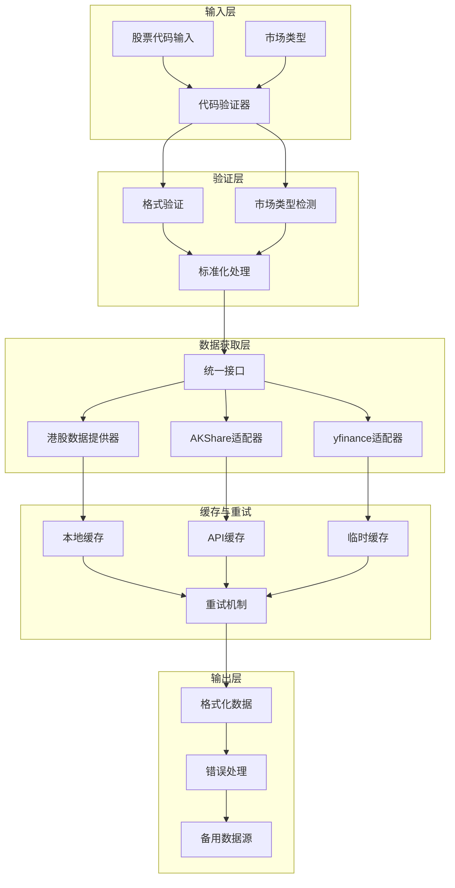

**图表来源**
- [interface.py](file://tradingagents/dataflows/interface.py#L1-L50)
- [stock_validator.py](file://tradingagents/utils/stock_validator.py#L1-L100)

### 主要组件关系图

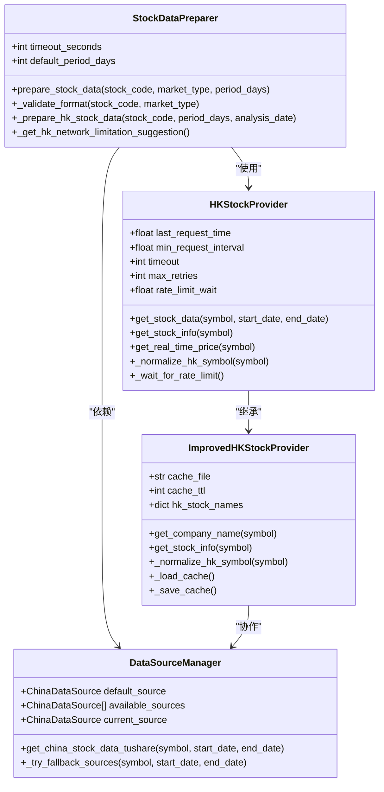

**图表来源**
- [hk_stock_utils.py](file://tradingagents/dataflows/hk_stock_utils.py#L15-L50)
- [improved_hk_utils.py](file://tradingagents/dataflows/improved_hk_utils.py#L15-L50)
- [stock_validator.py](file://tradingagents/utils/stock_validator.py#L50-L100)

## 港股代码识别错误排查

### 常见代码格式问题

#### 问题类型分析

| 问题类型 | 描述 | 示例 | 解决方案 |
|---------|------|------|----------|
| 格式缺失 | 缺少.HK后缀 | 0700 | 自动补全为0700.HK |
| 位数错误 | 数字位数不符合规范 | 700 (应为4-5位) | 补零至4位：0700 |
| 字符错误 | 包含非法字符 | 0700-HK | 移除非法字符 |
| 大小写问题 | 不符合标准大小写 | 0700.hk | 转换为大写：0700.HK |

#### 代码映射逻辑分析

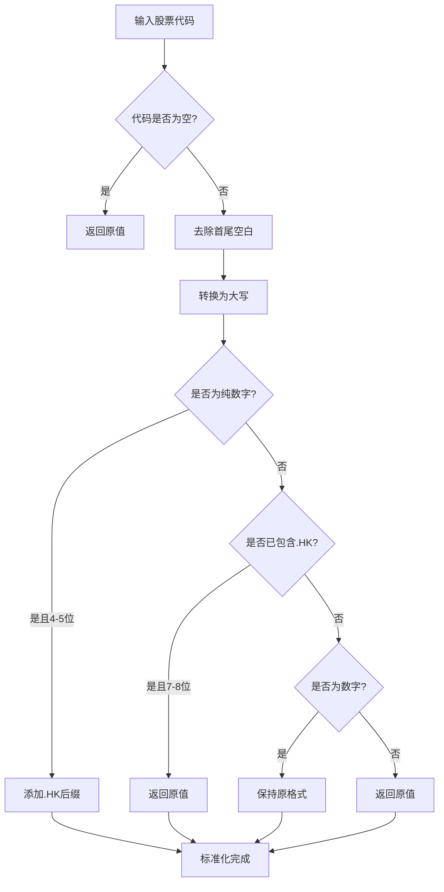

**图表来源**
- [hk_stock_utils.py](file://tradingagents/dataflows/hk_stock_utils.py#L199-L230)

**章节来源**
- [hk_stock_utils.py](file://tradingagents/dataflows/hk_stock_utils.py#L199-L230)
- [improved_hk_utils.py](file://tradingagents/dataflows/improved_hk_utils.py#L130-L160)

### 改进的代码验证机制

#### 内置映射表优化

改进版港股提供器维护了一个全面的内置映射表，包含主要港股公司的标准化名称：

- **腾讯系**：0700.HK → 腾讯控股
- **电信运营商**：0941.HK → 中国移动
- **银行**：0939.HK → 建设银行
- **科技股**：9988.HK → 阿里巴巴
- **消费股**：0291.HK → 华润啤酒

#### 验证流程增强

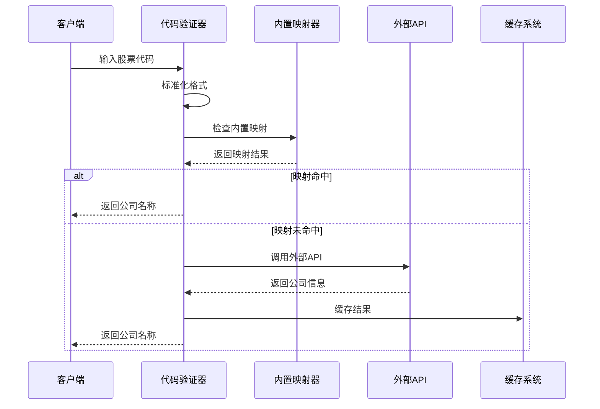

**图表来源**
- [improved_hk_utils.py](file://tradingagents/dataflows/improved_hk_utils.py#L160-L220)

**章节来源**
- [improved_hk_utils.py](file://tradingagents/dataflows/improved_hk_utils.py#L160-L220)

## Finnhub接口调用失败处理

### 接口调用失败原因分析

#### 常见失败场景

| 失败类型 | 原因 | 症状 | 解决方案 |
|---------|------|------|----------|
| 网络超时 | 网络连接不稳定 | 请求超时 | 增加重试机制 |
| API限制 | 调用频率过高 | 429状态码 | 实施指数退避 |
| 数据缺失 | 无对应数据 | 空数据响应 | 切换备用数据源 |
| 认证失败 | API密钥无效 | 401状态码 | 检查配置 |

#### 错误处理流程

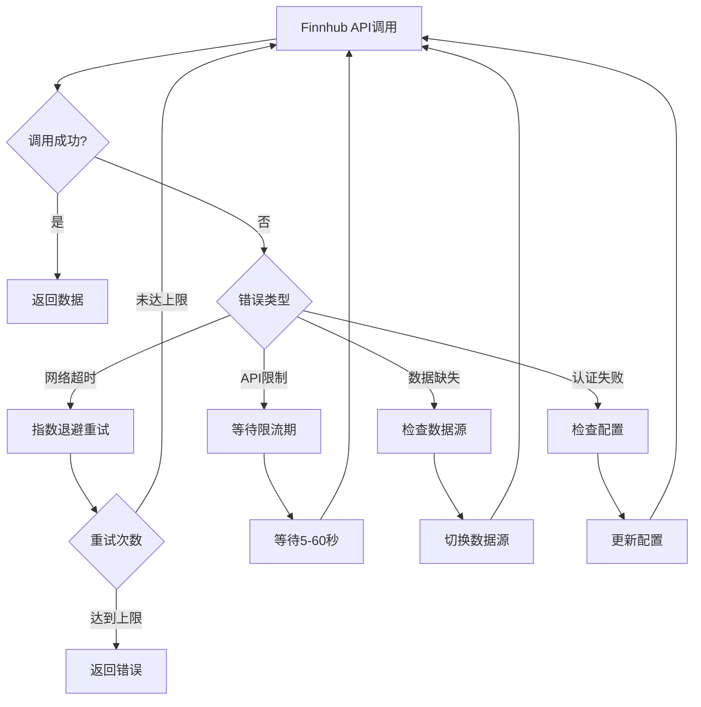

**图表来源**
- [finnhub_utils.py](file://tradingagents/dataflows/finnhub_utils.py#L10-L50)

**章节来源**
- [finnhub_utils.py](file://tradingagents/dataflows/finnhub_utils.py#L10-L50)

### 数据文件验证机制

Finnhub工具提供了严格的数据文件验证机制：

```python
# 数据文件存在性检查
if not os.path.exists(data_path):
    logger.warning(f"⚠️ 数据文件不存在: {data_path}")
    return {}

# JSON解析错误处理
try:
    with open(data_path, "r", encoding="utf-8") as f:
        data = json.load(f)
except json.JSONDecodeError as e:
    logger.error(f"❌ JSON解析错误: {e}")
    return {}
```

**章节来源**
- [finnhub_utils.py](file://tradingagents/dataflows/finnhub_utils.py#L25-L45)

## 市场数据延迟问题诊断

### 延迟问题分类

#### 实时数据延迟

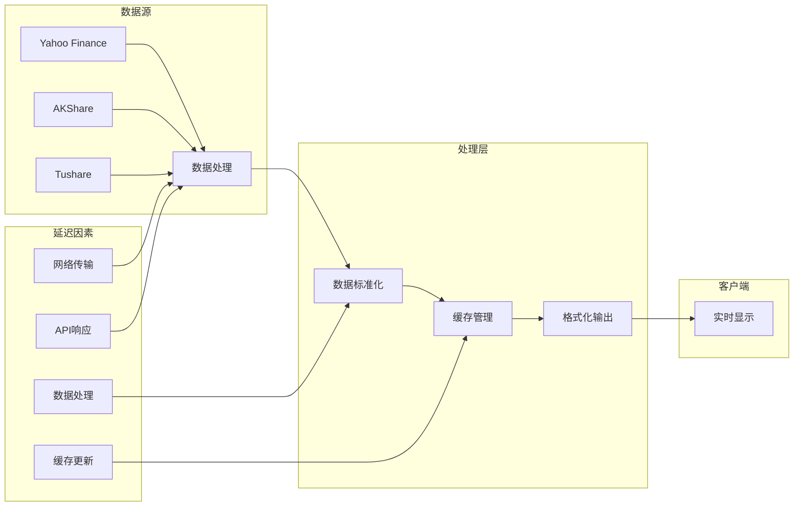

**图表来源**
- [hk_stock_utils.py](file://tradingagents/dataflows/hk_stock_utils.py#L150-L200)

#### 延迟诊断步骤

1. **网络连接检查**
   ```bash
   # 检查网络延迟
   ping yfinance.com
   
   # 测试API响应时间
   curl -w "@curl-format.txt" -o /dev/null -s "https://query1.finance.yahoo.com/v8/finance/chart/0700.HK"
   ```

2. **API性能监控**
   - 监控响应时间分布
   - 检查并发连接数
   - 分析峰值时段性能

3. **缓存策略优化**
   - 调整缓存过期时间
   - 实施智能预热机制
   - 优化缓存键设计

**章节来源**
- [hk_stock_utils.py](file://tradingagents/dataflows/hk_stock_utils.py#L150-L200)

## 数据适配机制分析

### 多源数据适配

#### 数据源优先级

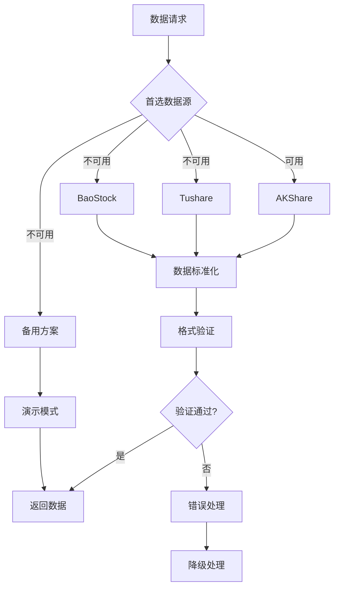

**图表来源**
- [data_source_manager.py](file://tradingagents/dataflows/data_source_manager.py#L547-L574)

#### 数据格式标准化

不同数据源返回的数据格式存在差异，需要统一处理：

| 数据源 | 格式特点 | 标准化处理 |
|--------|----------|------------|
| AKShare | 字典格式，字段丰富 | 提取关键字段，添加元数据 |
| Tushare | DataFrame格式 | 转换为字典，添加标准化字段 |
| Yahoo Finance | JSON格式，结构复杂 | 层级扁平化，字段映射 |
| BaoStock | 特殊格式 | 自定义解析器，格式转换 |

**章节来源**
- [data_source_manager.py](file://tradingagents/dataflows/data_source_manager.py#L547-L574)

### 统一接口设计

#### 接口抽象层

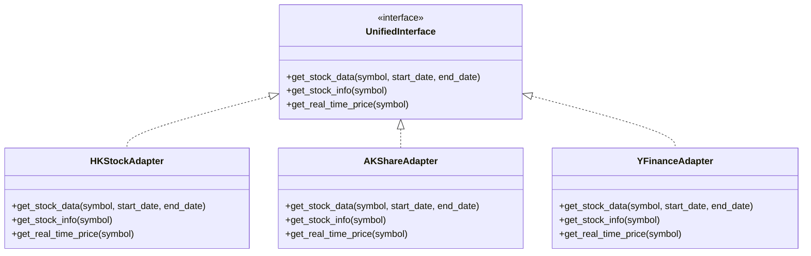

**图表来源**
- [interface.py](file://tradingagents/dataflows/interface.py#L1-L50)

**章节来源**
- [interface.py](file://tradingagents/dataflows/interface.py#L1-L50)

## 错误重试机制与缓存策略

### 指数退避重试算法

#### 重试参数配置

```python
# 港股数据提供器重试配置
self.max_retries = 3          # 最大重试次数
self.min_request_interval = 2.0  # 最小请求间隔（秒）
self.timeout = 60             # 请求超时时间（秒）
self.rate_limit_wait = 60     # 遇到限制时等待时间（秒）
```

#### 重试策略流程

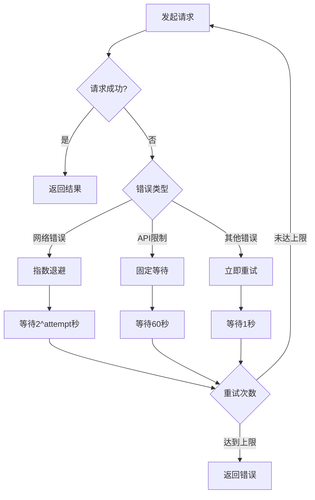

**图表来源**
- [hk_stock_utils.py](file://tradingagents/dataflows/hk_stock_utils.py#L93-L106)

**章节来源**
- [hk_stock_utils.py](file://tradingagents/dataflows/hk_stock_utils.py#L93-L106)

### 缓存系统设计

#### 缓存层次结构

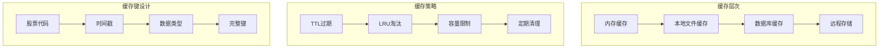

#### 改进版缓存机制

改进版港股提供器实现了更智能的缓存系统：

```python
# 缓存配置
self.cache_ttl = 3600 * 24  # 24小时缓存
self.rate_limit_wait = 5    # 速率限制等待时间

# 缓存有效性检查
def _is_cache_valid(self, key: str) -> bool:
    if key not in self.cache:
        return False
    cache_time = self.cache[key].get('timestamp', 0)
    return (time.time() - cache_time) < self.cache_ttl
```

**章节来源**
- [improved_hk_utils.py](file://tradingagents/dataflows/improved_hk_utils.py#L25-L35)

## 备用数据源切换方法

### 数据源切换策略

#### 自动切换机制

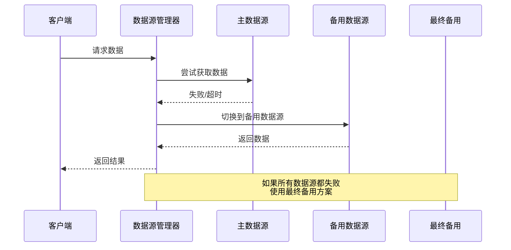

**图表来源**
- [data_source_manager.py](file://tradingagents/dataflows/data_source_manager.py#L547-L574)

#### 切换条件判断

| 切换条件 | 触发阈值 | 处理方式 | 恢复策略 |
|---------|----------|----------|----------|
| 连接超时 | >30秒 | 立即切换 | 下次请求恢复 |
| API限制 | 429状态码 | 等待+切换 | 指数退避恢复 |
| 数据为空 | 空响应 | 立即切换 | 下次请求恢复 |
| 认证失败 | 401状态码 | 配置修复 | 手动干预 |

**章节来源**
- [data_source_manager.py](file://tradingagents/dataflows/data_source_manager.py#L547-L574)

### 故障转移测试

#### 测试框架设计

```python
def test_hk_network_limitation_handling():
    """测试港股网络限制的错误处理"""
    test_cases = [
        {"code": "0700.HK", "name": "腾讯控股"},
        {"code": "9988.HK", "name": "阿里巴巴"},
        {"code": "3690.HK", "name": "美团"}
    ]
    
    for test_case in test_cases:
        result = prepare_stock_data(
            stock_code=test_case['code'],
            market_type="港股",
            period_days=7
        )
        
        if not result.is_valid:
            # 检查是否为网络限制问题
            if "网络限制" in result.error_message:
                print(f"检测到网络限制问题 - {test_case['code']}")
                # 执行备用方案
```

**章节来源**
- [test_hk_error_handling.py](file://scripts/test_hk_error_handling.py#L15-L50)

## 故障排除最佳实践

### 预防性措施

#### 代码验证最佳实践

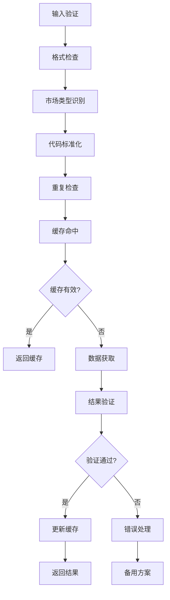

**图表来源**
- [stock_validator.py](file://tradingagents/utils/stock_validator.py#L100-L150)

#### 配置优化建议

1. **网络配置优化**
   ```python
   # 推荐的网络超时配置
   NETWORK_TIMEOUT = 30  # 秒
   REQUEST_INTERVAL = 2.0  # 秒
   MAX_RETRIES = 3
   ```

2. **缓存配置优化**
   ```python
   # 推荐的缓存配置
   CACHE_TTL = 3600 * 24  # 24小时
   CACHE_SIZE_LIMIT = 1000  # 最大缓存项数
   ```

3. **监控指标设置**
   - API响应时间 > 60秒
   - 错误率 > 5%
   - 缓存命中率 < 80%

**章节来源**
- [stock_validator.py](file://tradingagents/utils/stock_validator.py#L100-L150)

### 故障诊断清单

#### 快速诊断步骤

1. **网络连接检查**
   - [ ] Ping目标服务器
   - [ ] 检查防火墙设置
   - [ ] 验证DNS解析

2. **API状态检查**
   - [ ] 验证API密钥
   - [ ] 检查配额使用情况
   - [ ] 确认服务可用性

3. **数据源健康检查**
   - [ ] 测试主数据源
   - [ ] 验证备用数据源
   - [ ] 检查数据格式

4. **缓存系统检查**
   - [ ] 清理过期缓存
   - [ ] 检查缓存配置
   - [ ] 验证缓存键设计

## 监控与日志分析

### 日志级别配置

#### 日志分类体系

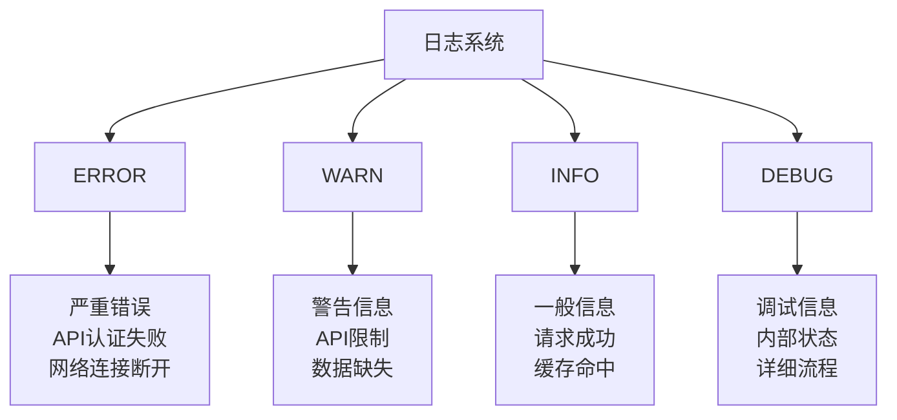

#### 关键监控指标

| 指标类别 | 监控项目 | 正常范围 | 告警阈值 |
|---------|----------|----------|----------|
| 性能指标 | API响应时间 | <5秒 | >30秒 |
| 可用性指标 | 请求成功率 | >95% | <90% |
| 错误指标 | 错误率 | <5% | >10% |
| 缓存指标 | 命中率 | >80% | <70% |

**章节来源**
- [hk_stock_utils.py](file://tradingagents/dataflows/hk_stock_utils.py#L20-L30)
- [improved_hk_utils.py](file://tradingagents/dataflows/improved_hk_utils.py#L15-L25)

### 故障恢复自动化

#### 自动恢复机制

```python
def auto_recovery_monitor():
    """自动恢复监控"""
    while True:
        # 检查服务状态
        health_status = check_service_health()
        
        if health_status == "degraded":
            # 触发自动恢复流程
            trigger_auto_recovery()
        elif health_status == "failed":
            # 启动紧急预案
            activate_emergency_mode()
        
        time.sleep(60)  # 每分钟检查一次
```

#### 监控告警配置

```python
# 告警规则配置
ALERT_RULES = {
    "api_failure": {
        "condition": "request_failures > 5",
        "severity": "critical",
        "actions": ["notify_admin", "switch_backup"]
    },
    "slow_response": {
        "condition": "avg_response_time > 10",
        "severity": "warning",
        "actions": ["optimize_cache", "scale_resources"]
    }
}
```

通过本指南提供的系统性故障排除方法，可以有效识别和解决港股数据流中的各种问题，确保系统的稳定性和可靠性。建议定期审查和更新故障排除流程，以适应不断变化的技术环境和业务需求。