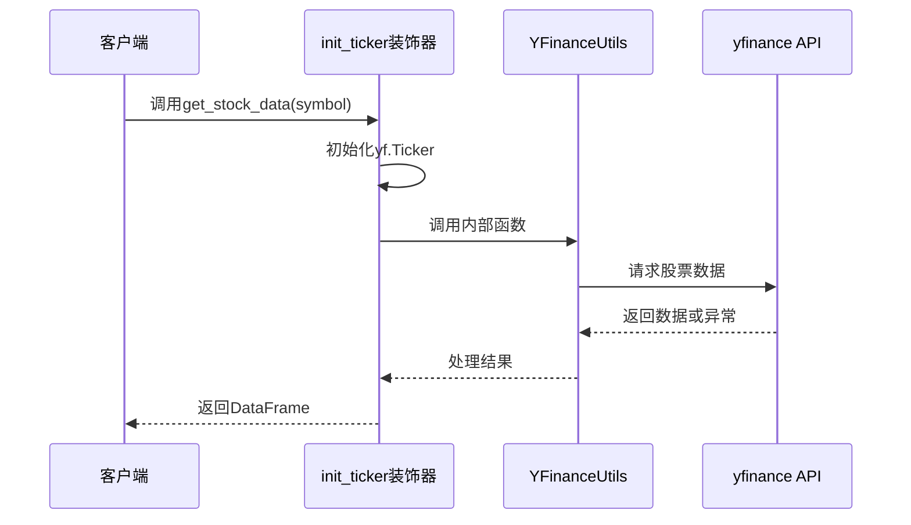
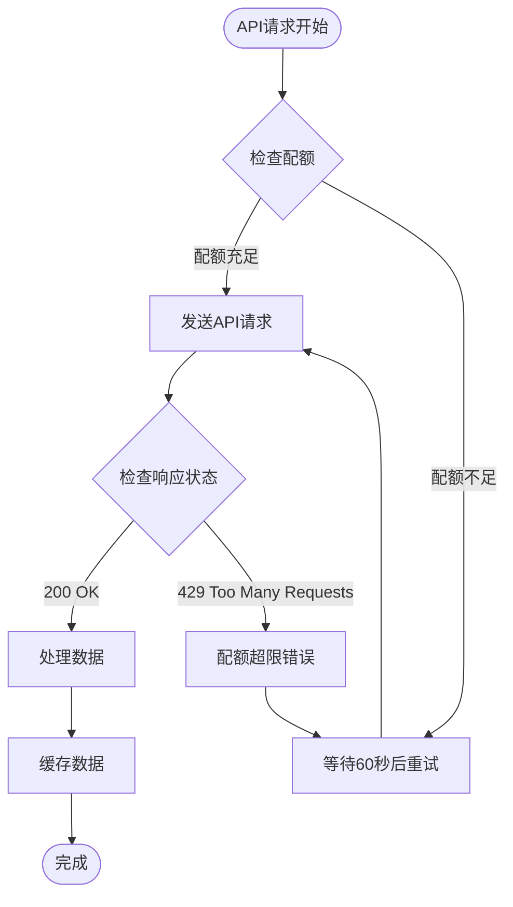
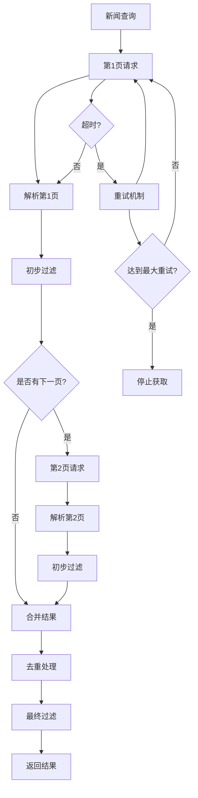
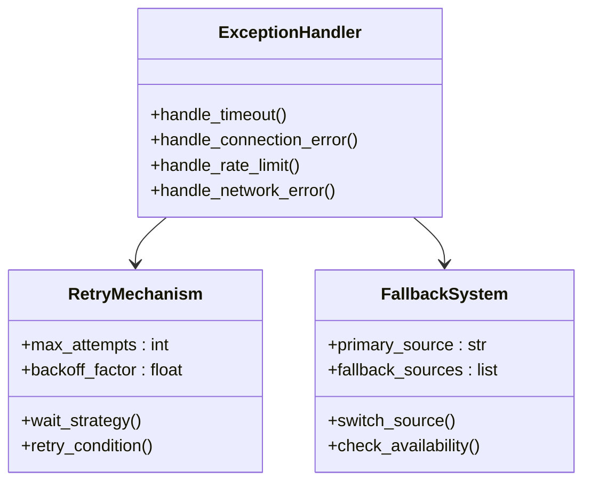
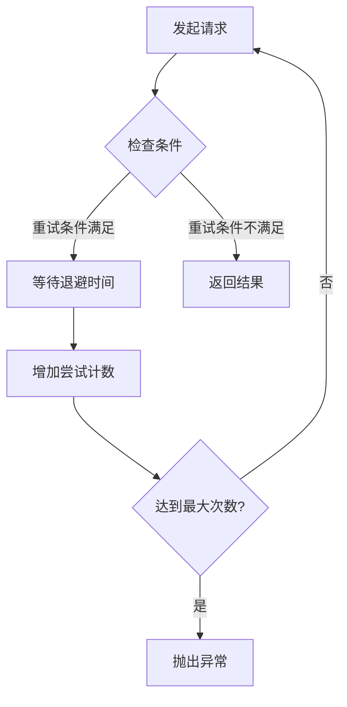
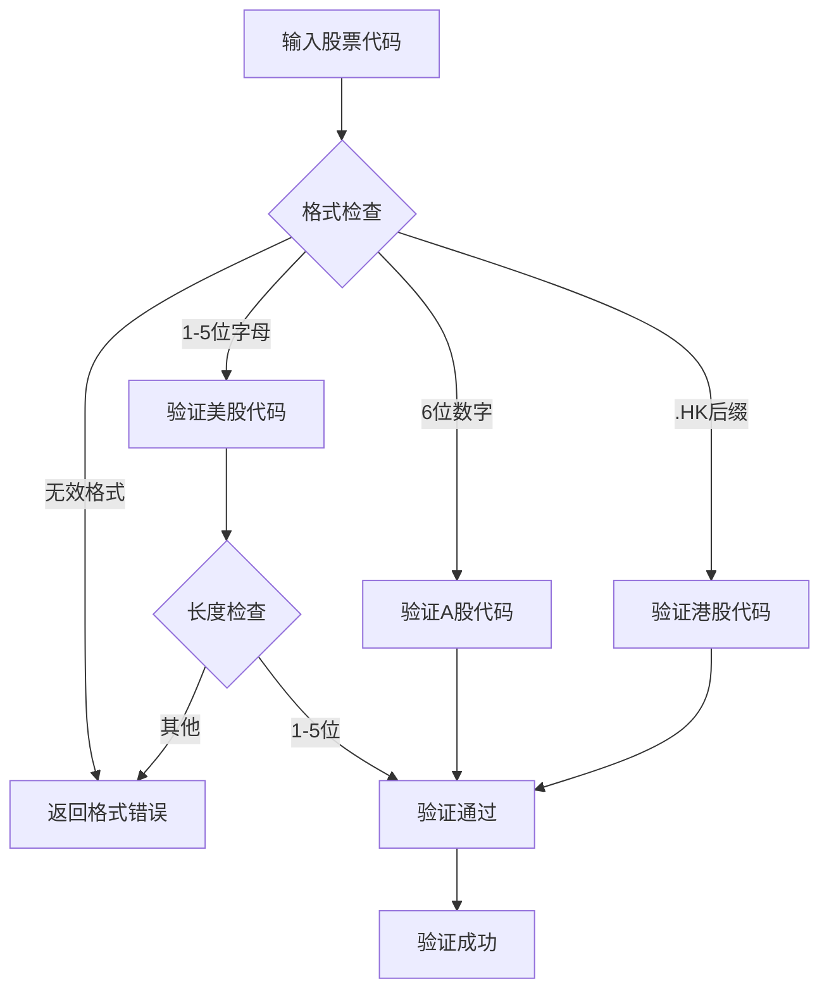
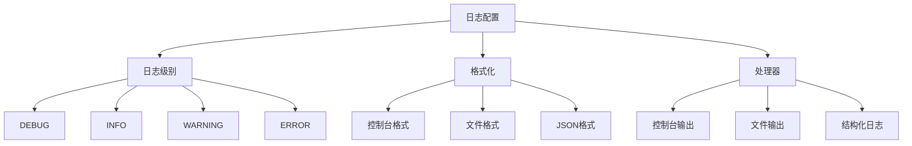
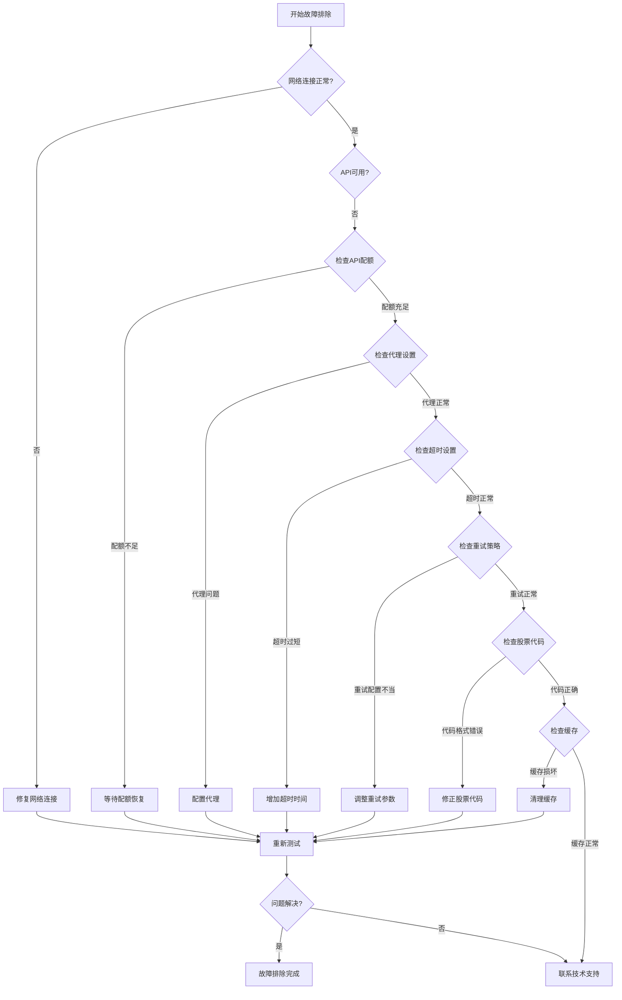

# 美股数据流故障排除指南

<cite>
**本文档引用的文件**
- [yfin_utils.py](file://tradingagents/dataflows/yfin_utils.py)
- [finnhub_utils.py](file://tradingagents/dataflows/finnhub_utils.py)
- [googlenews_utils.py](file://tradingagents/dataflows/googlenews_utils.py)
- [realtime_news_utils.py](file://tradingagents/dataflows/realtime_news_utils.py)
- [stock_validator.py](file://tradingagents/utils/stock_validator.py)
- [test_news_timeout_fix.py](file://tests/test_news_timeout_fix.py)
- [test_news_timeout.py](file://examples/test_news_timeout.py)
- [download_finnhub_data.py](file://scripts/download_finnhub_data.py)
- [akshare_utils.py](file://tradingagents/dataflows/akshare_utils.py)
- [logging_manager.py](file://tradingagents/utils/logging_manager.py)
</cite>

## 目录
1. [概述](#概述)
2. [yfinance连接问题诊断](#yfinance连接问题诊断)
3. [Finnhub API配额管理](#finnhub-api配额管理)
4. [Google News检索故障排除](#google-news检索故障排除)
5. [异步请求机制与异常处理](#异步请求机制与异常处理)
6. [代理配置与网络限制](#代理配置与网络限制)
7. [重试策略配置](#重试策略配置)
8. [美股代码验证最佳实践](#美股代码验证最佳实践)
9. [日志分析与调试](#日志分析与调试)
10. [故障排除流程图](#故障排除流程图)

## 概述

本指南针对TradingAgents-CN项目中美股数据流的常见故障提供系统性解决方案。涵盖yfinance连接超时、Finnhub API配额耗尽、Google News检索失败等问题的诊断和修复方法。

## yfinance连接问题诊断

### 问题症状
- 连接超时错误
- 网络连接失败
- 数据获取异常

### 异步请求机制分析

yfin_utils.py实现了基于装饰器的异步请求处理机制：



**图表来源**
- [yfin_utils.py](file://tradingagents/dataflows/yfin_utils.py#L25-L35)

### 连接超时处理

系统采用以下超时配置：
- 连接超时：10秒
- 读取超时：30秒
- 最大重试次数：5次

### 故障排除步骤

1. **检查网络连接**
   ```bash
   ping yfinance.com
   ```

2. **验证API密钥配置**
   ```python
   import yfinance as yf
   ticker = yf.Ticker("AAPL")
   print(ticker.info)  # 测试基础连接
   ```

3. **调整超时参数**
   修改yfin_utils.py中的超时设置：
   ```python
   # 在get_stock_data方法中
   stock_data = ticker.history(start=start_date, end=end_date, timeout=(10, 30))
   ```

**章节来源**
- [yfin_utils.py](file://tradingagents/dataflows/yfin_utils.py#L40-L50)

## Finnhub API配额管理

### API配额限制机制

Finnhub API采用基于令牌的配额管理系统：



**图表来源**
- [download_finnhub_data.py](file://scripts/download_finnhub_data.py#L80-L95)

### 配额耗尽诊断

1. **监控API使用情况**
   ```python
   # 检查API响应头
   response = requests.get(url, params=params)
   print(f"剩余配额: {response.headers.get('X-Ratelimit-Remaining')}")
   ```

2. **实现智能缓存策略**
   - 美股基本面数据缓存24小时
   - A股基本面数据缓存12小时
   - 基于市场类型分类存储

### 配额管理最佳实践

1. **设置合理的缓存策略**
   ```python
   # 缓存配置示例
   ttl_settings = {
       "us_fundamentals": 86400,   # 24小时
       "china_fundamentals": 43200, # 12小时
   }
   ```

2. **实现降级机制**
   - 当API不可用时，使用本地缓存
   - 提供备用数据源
   - 返回有意义的错误信息

**章节来源**
- [download_finnhub_data.py](file://scripts/download_finnhub_data.py#L80-L108)

## Google News检索故障排除

### 新闻数据过滤器工作原理

Google News检索采用多层过滤机制：



**图表来源**
- [googlenews_utils.py](file://tradingagents/dataflows/googlenews_utils.py#L40-L129)

### 超时处理机制

googlenews_utils.py实现了robust的超时处理：

1. **指数退避重试**
   - 最大重试次数：5次
   - 退避因子：2^attempt
   - 最小等待时间：4秒
   - 最大等待时间：60秒

2. **连续超时检测**
   ```python
   # 连续3页超时后停止
   if page > 3:
       logger.error("多次连接超时，停止获取Google新闻")
       break
   ```

### 故障排除步骤

1. **检查网络稳定性**
   ```bash
   curl -I https://www.google.com
   ```

2. **验证User-Agent配置**
   ```python
   headers = {
       "User-Agent": "Mozilla/5.0 (Windows NT 10.0; Win64; x64) AppleWebKit/537.36"
   }
   ```

3. **调整请求间隔**
   ```python
   # 添加随机延迟
   time.sleep(random.uniform(2, 6))
   ```

**章节来源**
- [googlenews_utils.py](file://tradingagents/dataflows/googlenews_utils.py#L25-L40)

## 异常处理流程

### 多层异常处理架构



**图表来源**
- [test_news_timeout_fix.py](file://tests/test_news_timeout_fix.py#L25-L45)

### 异常类型处理

1. **连接超时异常**
   ```python
   try:
       response = requests.get(url, timeout=30)
   except requests.exceptions.Timeout as e:
       logger.error(f"连接超时: {e}")
       # 继续尝试下一页
   ```

2. **连接错误处理**
   ```python
   except requests.exceptions.ConnectionError as e:
       logger.error(f"连接错误: {e}")
       # 继续尝试下一页
   ```

3. **API限制处理**
   ```python
   if response.status_code == 429:
       logger.warning("API调用频率限制，等待60秒...")
       time.sleep(60)
   ```

**章节来源**
- [googlenews_utils.py](file://tradingagents/dataflows/googlenews_utils.py#L108-L128)

## 代理配置与网络限制

### 代理配置选项

1. **HTTP代理配置**
   ```python
   proxies = {
       'http': 'http://proxy.example.com:8080',
       'https': 'https://proxy.example.com:8080'
   }
   ```

2. **SOCKS代理配置**
   ```python
   proxies = {
       'http': 'socks5://proxy.example.com:1080',
       'https': 'socks5://proxy.example.com:1080'
   }
   ```

### 网络限制绕过策略

1. **IP轮换机制**
   - 使用代理池
   - 动态切换IP地址
   - 监控IP封禁状态

2. **User-Agent轮换**
   ```python
   user_agents = [
       "Mozilla/5.0 (Windows NT 10.0; Win64; x64)",
       "Mozilla/5.0 (Macintosh; Intel Mac OS X 10_15_7)",
       "Mozilla/5.0 (Linux; Android 10)"
   ]
   ```

3. **请求间隔优化**
   ```python
   # 随机延迟避免检测
   time.sleep(random.uniform(2, 6))
   ```

## 重试策略配置

### 十通重试库配置

系统使用tenacity库实现智能重试：



**图表来源**
- [googlenews_utils.py](file://tradingagents/dataflows/googlenews_utils.py#L25-L35)

### 重试策略参数

1. **基础重试配置**
   ```python
   @retry(
       retry=(retry_if_result(is_rate_limited) | 
              retry_if_exception_type(requests.exceptions.ConnectionError) | 
              retry_if_exception_type(requests.exceptions.Timeout)),
       wait=wait_exponential(multiplier=1, min=4, max=60),
       stop=stop_after_attempt(5)
   )
   ```

2. **自定义重试条件**
   ```python
   def is_rate_limited(response):
       return response.status_code == 429
   ```

### 重试最佳实践

1. **指数退避策略**
   - 初始等待时间：4秒
   - 退避倍数：2
   - 最大等待时间：60秒

2. **最大重试次数**
   - 总尝试次数：5次
   - 超时重试：最多3页

3. **错误分类处理**
   ```python
   # 不同类型的错误采用不同的处理策略
   if "Rate limited" in error_msg:
       time.sleep(rate_limit_wait)
   else:
       time.sleep(2 ** attempt)
   ```

**章节来源**
- [googlenews_utils.py](file://tradingagents/dataflows/googlenews_utils.py#L25-L40)

## 美股代码验证最佳实践

### 代码格式验证

stock_validator.py提供了完整的美股代码验证机制：



**图表来源**
- [stock_validator.py](file://tradingagents/utils/stock_validator.py#L107-L140)

### 验证规则详解

1. **美股代码格式**
   - 规则：1-5位大写字母
   - 示例：AAPL, MSFT, TSLA, GOOGL
   - 正则表达式：`^[A-Z]{1,5}$`

2. **A股代码格式**
   - 规则：6位数字
   - 示例：000001, 600519, 300750
   - 正则表达式：`^\d{6}$`

3. **港股代码格式**
   - 规则：4-5位数字或4-5位数字.HK
   - 示例：0700.HK, 9988.HK, 0700
   - 正则表达式：`^\d{4,5}\.HK$|^\\d{4,5}$`

### 验证流程

1. **格式预检查**
   ```python
   # 长度限制
   if len(stock_code) > 10:
       return StockDataPreparationResult(
           is_valid=False,
           error_message="股票代码长度不能超过10个字符"
       )
   ```

2. **市场类型自动检测**
   ```python
   def _detect_market_type(self, stock_code: str) -> str:
       if re.match(r'^\d{6}$', stock_code):
           return "A股"
       elif re.match(r'^\d{4,5}\.HK$', stock_code) or re.match(r'^\d{4,5}$', stock_code):
           return "港股"
       elif re.match(r'^[A-Z]{1,5}$', stock_code):
           return "美股"
       return "未知"
   ```

3. **数据源验证**
   - 预先获取股票基本信息
   - 验证历史数据可用性
   - 检查数据完整性

**章节来源**
- [stock_validator.py](file://tradingagents/utils/stock_validator.py#L107-L170)

## 日志分析与调试

### 日志配置系统

系统采用多层次日志配置：



**图表来源**
- [logging_manager.py](file://tradingagents/utils/logging_manager.py#L163-L196)

### 关键日志信息

1. **连接状态日志**
   ```
   [INFO] 开始获取AAPL的实时新闻，回溯时间: 6小时
   [INFO] 成功从FinnHub获取3条新闻，耗时: 1.23秒
   ```

2. **错误诊断日志**
   ```
   [ERROR] 连接超时: HTTPSConnectionPool(host='www.google.com', port=443)
   [WARNING] API调用频率限制，等待60秒...
   ```

3. **性能监控日志**
   ```
   [INFO] 新闻聚合完成，总共获取15条新闻，总耗时: 8.56秒
   ```

### 调试技巧

1. **启用详细日志**
   ```python
   import logging
   logging.getLogger('tradingagents').setLevel(logging.DEBUG)
   ```

2. **分析日志模式**
   - 连续超时模式
   - 配额耗尽模式
   - 网络不稳定模式

3. **性能分析**
   ```python
   # 记录关键操作耗时
   start_time = time.time()
   # 执行操作
   duration = time.time() - start_time
   logger.info(f"操作耗时: {duration:.2f}秒")
   ```

**章节来源**
- [logging_manager.py](file://tradingagents/utils/logging_manager.py#L163-L196)

## 故障排除流程图

### 综合故障排除决策树



### 快速诊断清单

1. **网络连接检查**
   - [ ] Ping测试：`ping yfinance.com`
   - [ ] 代理配置：检查HTTP/SOCKS代理设置
   - [ ] 防火墙规则：确保API端口开放

2. **API配置检查**
   - [ ] API密钥：验证FINNHUB_API_KEY环境变量
   - [ ] 配额状态：检查剩余API调用次数
   - [ ] 请求频率：确认不超过API限制

3. **代码格式验证**
   - [ ] 美股代码：1-5位大写字母
   - [ ] A股代码：6位数字
   - [ ] 港股代码：4-5位数字或4-5位数字.HK

4. **重试机制测试**
   - [ ] 超时设置：验证timeout参数
   - [ ] 重试次数：确认max_attempts配置
   - [ ] 退避策略：检查指数退避参数

5. **缓存状态检查**
   - [ ] 缓存目录：确认数据存储位置
   - [ ] 缓存有效期：验证TTL设置
   - [ ] 缓存完整性：检查缓存文件

通过遵循本指南的系统性故障排除方法，可以快速定位和解决美股数据流中的各种问题，确保系统的稳定性和可靠性。