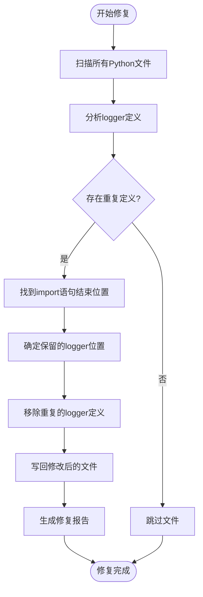
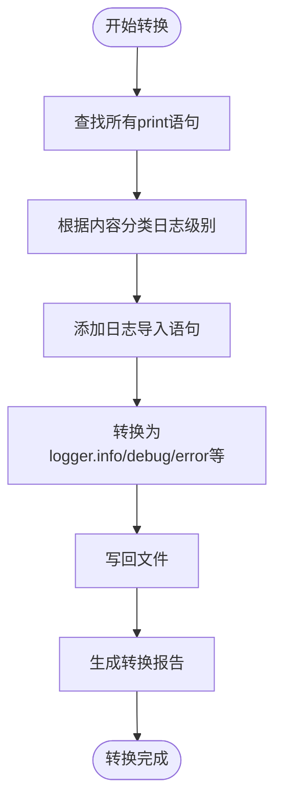
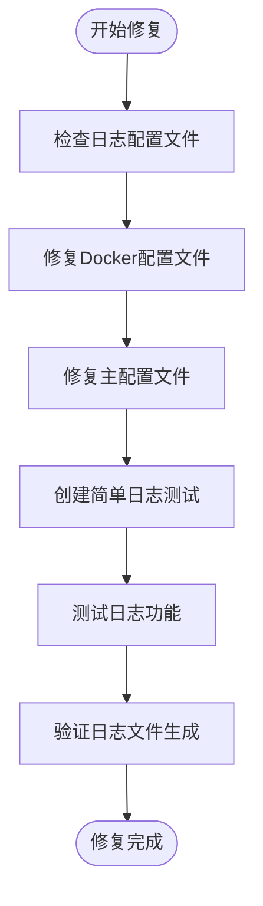

# 日志系统问题

<cite>
**本文档引用的文件**  
- [duplicate_logger_fix_report.md](file://reports/duplicate_logger_fix_report.md)
- [logger_position_fix_report.md](file://reports/logger_position_fix_report.md)
- [logging_import_fix_report.md](file://reports/logging_import_fix_report.md)
- [print_to_log_conversion_report.md](file://reports/print_to_log_conversion_report.md)
- [fix_duplicate_loggers.py](file://scripts/fix_duplicate_loggers.py)
- [fix_logger_position.py](file://scripts/fix_logger_position.py)
- [fix_logging_imports.py](file://scripts/fix_logging_imports.py)
- [convert_prints_to_logs.py](file://scripts/convert_prints_to_logs.py)
- [logging.toml](file://config/logging.toml)
- [logging_docker.toml](file://config/logging_docker.toml)
- [logging_manager.py](file://tradingagents/utils/logging_manager.py)
- [logging_init.py](file://tradingagents/utils/logging_init.py)
- [syntax_error_files_report.txt](file://reports/syntax_error_files_report.txt)
- [fix_logging_config_error.py](file://scripts/fix_logging_config_error.py)
</cite>

## 目录
1. [问题概述](#问题概述)
2. [重复日志记录器问题](#重复日志记录器问题)
3. [日志级别错乱问题](#日志级别错乱问题)
4. [日志文件无法生成问题](#日志文件无法生成问题)
5. [日志配置文件详解](#日志配置文件详解)
6. [日志配置验证与调试方法](#日志配置验证与调试方法)
7. [综合修复方案](#综合修复方案)
8. [预防措施与最佳实践](#预防措施与最佳实践)

## 问题概述

本指南旨在解决TradingAgents-CN项目中出现的日志系统问题，包括重复日志记录、日志级别错乱和日志文件无法生成等常见故障。通过分析reports/目录下的各类修复报告和修复脚本，我们将深入探讨问题根源并提供系统性的解决方案。

项目中的日志系统基于Python标准库logging模块构建，通过统一的logging_manager.py进行管理，并使用TOML格式的配置文件进行灵活配置。然而，在实际使用过程中，由于多处代码重复定义logger、日志导入位置不当以及配置文件不完整等问题，导致了日志系统的不稳定。

**Section sources**
- [duplicate_logger_fix_report.md](file://reports/duplicate_logger_fix_report.md)
- [logger_position_fix_report.md](file://reports/logger_position_fix_report.md)
- [logging_import_fix_report.md](file://reports/logging_import_fix_report.md)
- [print_to_log_conversion_report.md](file://reports/print_to_log_conversion_report.md)

## 重复日志记录器问题

### 问题根源

重复日志记录器问题是本项目中最普遍的日志问题。根据duplicate_logger_fix_report.md报告，系统扫描了321个Python文件，发现98个文件存在重复的logger定义，总共需要移除108个重复定义。

问题主要表现为在同一个Python文件中多次定义logger变量，例如：
```python
logger = get_logger('default')
# ... 其他代码 ...
logger = get_logger('default')  # 重复定义
```

这种重复定义会导致日志输出混乱，可能产生重复的日志条目，影响日志的可读性和分析效率。

### 修复方案

项目提供了fix_duplicate_loggers.py脚本专门解决此问题。该脚本的工作原理如下：

1. **扫描所有Python文件**：遍历项目目录，查找所有.py文件，排除虚拟环境和缓存目录。
2. **分析logger定义**：使用正则表达式`^\s*logger\s*=\s*get_logger\s*\(`识别文件中的logger定义语句。
3. **确定保留位置**：优先保留在import语句区域附近的logger定义（import后5行内），如果都没有则保留第一个。
4. **移除重复定义**：从后往前删除重复的logger定义，避免行号变化导致的问题。
5. **生成修复报告**：创建详细的修复报告，记录每个文件的修复详情。

修复脚本成功修复了98个文件，包括main.py、fix_stock_code_issue.py等核心文件，确保了每个文件只保留一个logger定义。



**Diagram sources**
- [fix_duplicate_loggers.py](file://scripts/fix_duplicate_loggers.py)
- [duplicate_logger_fix_report.md](file://reports/duplicate_logger_fix_report.md)

**Section sources**
- [fix_duplicate_loggers.py](file://scripts/fix_duplicate_loggers.py)
- [duplicate_logger_fix_report.md](file://reports/duplicate_logger_fix_report.md)

## 日志级别错乱问题

### 问题根源

日志级别错乱问题主要源于两个方面：一是print语句未转换为日志输出，二是日志导入位置不当。

根据print_to_log_conversion_report.md报告，项目成功将100个文件中的print语句转换为日志输出。这些print语句原本分散在代码各处，导致日志级别无法控制，所有输出都以默认级别显示，无法区分调试信息、警告和错误。

同时，logging_import_fix_report.md报告显示，103个文件的日志导入位置得到了修复。原本日志导入语句可能出现在函数内部或文件末尾，导致logger初始化时机不当，影响日志系统的正常工作。

### 修复方案

项目提供了两个脚本解决此问题：

1. **convert_prints_to_logs.py**：将print语句转换为适当的日志调用
   - 根据消息内容自动确定日志级别（如包含"错误"、"ERROR"等关键词的为error级别）
   - 支持f-string格式的print语句转换
   - 自动添加必要的日志导入语句

2. **fix_logging_imports.py**：修复日志导入位置
   - 将日志导入语句移动到import语句块之后
   - 根据文件路径确定适当的logger名称（如web目录使用'web'，scripts目录使用'scripts'）
   - 确保logger在文件顶部正确初始化

修复后，所有输出都通过统一的日志系统管理，可以根据需要调整日志级别，提高了日志的组织性和可读性。



**Diagram sources**
- [convert_prints_to_logs.py](file://scripts/convert_prints_to_logs.py)
- [fix_logging_imports.py](file://scripts/fix_logging_imports.py)
- [print_to_log_conversion_report.md](file://reports/print_to_log_conversion_report.md)
- [logging_import_fix_report.md](file://reports/logging_import_fix_report.md)

**Section sources**
- [convert_prints_to_logs.py](file://scripts/convert_prints_to_logs.py)
- [fix_logging_imports.py](file://scripts/fix_logging_imports.py)
- [print_to_log_conversion_report.md](file://reports/print_to_log_conversion_report.md)
- [logging_import_fix_report.md](file://reports/logging_import_fix_report.md)

## 日志文件无法生成问题

### 问题根源

日志文件无法生成问题主要出现在Docker环境中，根据分析，问题根源包括：

1. **配置文件不完整**：原始的logging.toml和logging_docker.toml文件缺少必要的file格式配置，导致KeyError: 'file'错误。
2. **Docker环境检测问题**：日志系统无法正确检测Docker环境，导致文件处理器未正确初始化。
3. **目录权限问题**：容器内/app/logs目录可能不存在或无写入权限。
4. **语法错误**：多个Python文件存在语法错误，导致程序无法正常启动，从而无法生成日志。

syntax_error_files_report.txt报告显示，共有65个文件存在语法错误，主要类型包括：
- 意外的缩进（unexpected indent）
- 缺少except或finally块
- 无效语法（invalid syntax）
- 非ASCII字符（如中文句号）

### 修复方案

针对日志文件无法生成问题，采取了以下综合修复措施：

1. **修复配置文件**：使用fix_logging_config_error.py脚本修复配置文件，确保包含完整的file格式配置。
2. **创建简单测试**：创建simple_log_test.py进行最小化日志测试，排除复杂依赖的影响。
3. **修复语法错误**：修复所有存在语法错误的文件，确保程序能够正常启动。

修复后的logging_docker.toml文件包含了完整的配置，特别是确保了[logging.format]部分包含file配置，解决了KeyError问题。



**Diagram sources**
- [fix_logging_config_error.py](file://scripts/fix_logging_config_error.py)
- [logging_docker.toml](file://config/logging_docker.toml)
- [syntax_error_files_report.txt](file://reports/syntax_error_files_report.txt)

**Section sources**
- [fix_logging_config_error.py](file://scripts/fix_logging_config_error.py)
- [logging_docker.toml](file://config/logging_docker.toml)
- [syntax_error_files_report.txt](file://reports/syntax_error_files_report.txt)

## 日志配置文件详解

### logging.toml配置结构

logging.toml是项目的主日志配置文件，采用TOML格式，结构清晰，易于维护。主要配置部分包括：

#### 全局配置
```toml
[logging]
level = "INFO"  # 全局日志级别
```

#### 格式配置
```toml
[logging.format]
console = "%(asctime)s | %(name)-20s | %(levelname)-8s | %(message)s"
file = "%(asctime)s | %(name)-20s | %(levelname)-8s | %(module)s:%(funcName)s:%(lineno)d | %(message)s"
structured = "json"
```

#### 处理器配置
```toml
[logging.handlers.console]
enabled = true
colored = true
level = "INFO"

[logging.handlers.file]
enabled = true
level = "DEBUG"
max_size = "10MB"
backup_count = 5
directory = "./logs"
```

#### 特定日志器配置
```toml
[logging.loggers.tradingagents]
level = "INFO"

[logging.loggers.web]
level = "INFO"

[logging.loggers.streamlit]
level = "WARNING"  # 降低第三方库日志级别
```

#### 环境特定配置
```toml
[logging.docker]
enabled = false
stdout_only = true
disable_file_logging = true

[logging.development]
enabled = false
debug_modules = ["tradingagents.graph", "tradingagents.llm_adapters"]
```

### 配置参数含义

| 配置项 | 含义 | 示例值 |
|--------|------|--------|
| level | 日志级别 | DEBUG, INFO, WARNING, ERROR, CRITICAL |
| console | 控制台输出格式 | "%(asctime)s | %(levelname)-8s | %(message)s" |
| file | 文件输出格式 | "%(asctime)s | %(module)s:%(lineno)d | %(message)s" |
| max_size | 单个日志文件最大大小 | "10MB", "100MB" |
| backup_count | 保留的旧日志文件数量 | 5 |
| directory | 日志文件存储目录 | "./logs", "/app/logs" |
| colored | 控制台输出是否彩色 | true, false |

### Docker专用配置

logging_docker.toml是为Docker环境优化的配置文件，主要特点包括：
- 启用结构化日志（JSON格式）便于日志收集
- 设置更大的日志文件大小（100MB）
- 同时输出到stdout和文件，满足容器日志收集需求
- 修复了原始配置中缺少file格式的问题

**Section sources**
- [logging.toml](file://config/logging.toml)
- [logging_docker.toml](file://config/logging_docker.toml)
- [logging_manager.py](file://tradingagents/utils/logging_manager.py)

## 日志配置验证与调试方法

### 验证步骤

1. **检查配置文件完整性**
   ```bash
   # 检查主配置文件
   cat config/logging.toml
   
   # 检查Docker配置文件
   cat config/logging_docker.toml
   ```
   
2. **运行简单日志测试**
   ```bash
   python simple_log_test.py
   ```
   
3. **检查日志文件生成**
   ```bash
   # 检查日志目录
   ls -la logs/
   
   # 查看最新日志
   tail logs/tradingagents.log
   ```

4. **验证Docker环境日志**
   ```bash
   # 重新构建镜像
   docker-compose build
   
   # 重启容器
   docker-compose down && docker-compose up -d
   
   # 查看容器日志
   docker-compose logs web
   ```

### 调试方法

当遇到日志问题时，可以按照以下步骤进行调试：

1. **检查语法错误**
   ```bash
   # 运行语法检查
   python scripts/syntax_checker.py
   ```
   
2. **验证日志配置加载**
   ```python
   # 在代码中添加调试信息
   from tradingagents.utils.logging_manager import get_logger_manager
   logger_manager = get_logger_manager()
   print(f"当前日志配置: {logger_manager.config}")
   ```

3. **使用自举日志器**
   ```python
   # 使用自举日志器进行早期调试
   from tradingagents.utils.logging_manager import _bootstrap_logger
   _bootstrap_logger.warning("配置加载前的警告信息")
   ```

4. **检查环境变量**
   ```bash
   # 检查影响日志的环境变量
   echo "DOCKER_CONTAINER: $DOCKER_CONTAINER"
   echo "TRADINGAGENTS_LOG_LEVEL: $TRADINGAGENTS_LOG_LEVEL"
   ```

### 常见问题排查

| 问题现象 | 可能原因 | 解决方案 |
|---------|--------|---------|
| 日志文件未生成 | 配置文件缺少file格式 | 使用fix_logging_config_error.py修复 |
| 控制台无彩色输出 | colored设置为false或非tty环境 | 检查colored配置和运行环境 |
| Docker容器无日志 | stdout_only设置不当 | 检查logging_docker.toml配置 |
| 日志级别无法控制 | 存在print语句 | 运行convert_prints_to_logs.py |
| 重复日志输出 | 多次定义logger | 运行fix_duplicate_loggers.py |

**Section sources**
- [simple_log_test.py](file://scripts/simple_log_test.py)
- [logging_manager.py](file://tradingagents/utils/logging_manager.py)
- [logging_init.py](file://tradingagents/utils/logging_init.py)

## 综合修复方案

### 修复流程

为确保日志系统的完整性和可读性，建议按照以下顺序执行修复：

1. **修复语法错误**
   ```bash
   # 修复所有语法错误文件
   # 根据syntax_error_files_report.txt逐个修复
   ```

2. **修复日志配置**
   ```bash
   # 修复日志配置文件
   python scripts/fix_logging_config_error.py
   ```

3. **修复日志导入位置**
   ```bash
   # 修复日志导入位置
   python scripts/fix_logging_imports.py
   ```

4. **转换print语句**
   ```bash
   # 转换print语句为日志
   python scripts/convert_prints_to_logs.py
   ```

5. **修复重复logger**
   ```bash
   # 修复重复logger定义
   python scripts/fix_duplicate_loggers.py
   ```

6. **验证修复结果**
   ```bash
   # 运行简单测试
   python simple_log_test.py
   
   # 检查日志文件
   tail logs/tradingagents.log
   ```

### 自动化修复脚本

可以创建一个综合修复脚本automate_fixes.py，按正确顺序执行所有修复步骤：

```python
#!/usr/bin/env python3
"""
自动化日志系统修复脚本
"""

import subprocess
import sys

def run_script(script_name):
    """运行修复脚本"""
    print(f"🔧 执行: {script_name}")
    result = subprocess.run([sys.executable, script_name], capture_output=True, text=True)
    if result.returncode == 0:
        print(f"✅ {script_name} 执行成功")
    else:
        print(f"❌ {script_name} 执行失败: {result.stderr}")
    return result.returncode

def main():
    """主函数"""
    scripts = [
        "scripts/fix_logging_config_error.py",
        "scripts/fix_logging_imports.py",
        "scripts/convert_prints_to_logs.py",
        "scripts/fix_duplicate_loggers.py"
    ]
    
    for script in scripts:
        if run_script(script) != 0:
            print(f"⚠️  {script} 执行失败，建议手动检查")
    
    print("🎉 日志系统修复完成！请运行简单测试验证")

if __name__ == "__main__":
    main()
```

**Section sources**
- [fix_logging_config_error.py](file://scripts/fix_logging_config_error.py)
- [fix_logging_imports.py](file://scripts/fix_logging_imports.py)
- [convert_prints_to_logs.py](file://scripts/convert_prints_to_logs.py)
- [fix_duplicate_loggers.py](file://scripts/fix_duplicate_loggers.py)

## 预防措施与最佳实践

### 代码规范

1. **单一logger原则**：每个文件只定义一个logger实例
2. **正确位置**：logger定义应在import语句块之后，文件顶部
3. **适当命名**：根据模块功能选择合适的logger名称
4. **避免print**：所有输出都应通过日志系统

### 配置管理

1. **配置文件完整性**：确保所有必要的配置项都存在
2. **环境区分**：为不同环境（开发、生产、Docker）提供专用配置
3. **版本控制**：将配置文件纳入版本控制，跟踪变更

### 开发流程

1. **预提交检查**：在提交代码前运行日志相关检查
2. **代码审查**：在代码审查中特别关注日志相关的变更
3. **自动化测试**：包含日志功能的单元测试和集成测试

### 监控与维护

1. **定期检查**：定期运行日志系统健康检查
2. **日志轮转**：确保日志文件不会无限增长
3. **错误监控**：监控日志系统自身的错误和警告

通过遵循这些最佳实践，可以确保日志系统的长期稳定运行，为系统的调试、监控和维护提供可靠的支持。

**Section sources**
- [logging_manager.py](file://tradingagents/utils/logging_manager.py)
- [logging_init.py](file://tradingagents/utils/logging_init.py)
- [logging.toml](file://config/logging.toml)